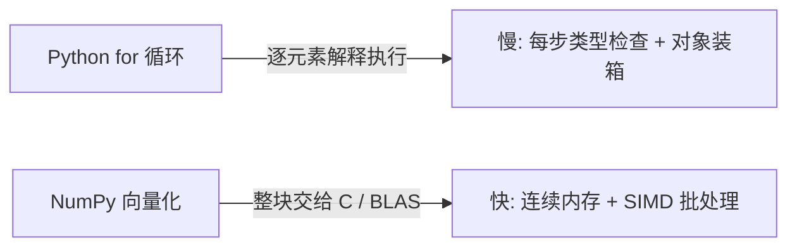

# NumPy与Pandas量化指南

> [!note] 本篇定位：NumPy 向量化
> 本篇专攻 **NumPy 向量化**——用 `ndarray`、广播与矩阵运算，把"逐行循环算收益/信号"改写成整块数组操作，并讲清"为什么向量化快"。
> 时间序列对齐、`resample`、面板数据等**时序/截面**操作由姊妹篇 [[量化工具链NumPy与Pandas]] 负责。一句话分工：**NumPy 管数值与矩阵，Pandas 管时序与面板。**

## 一、ndarray：量化计算的基本单位

`ndarray` 是同质（dtype 一致）、内存连续的多维数组，这是它快的物理基础。

```python
import numpy as np

prices = np.array([100., 101.5, 103., 102., 104.5])   # 示例价格，注意写成 float
print(prices.dtype, prices.shape)                      # float64 (5,)

# 二维收益矩阵：行=交易日 T，列=资产 N
R = np.array([[0.01, -0.02, 0.03],                      # 示例：T=2, N=3
              [0.00,  0.015, -0.01]])
print(R.shape)                                          # (2, 3)
```

> [!warning] 第一坑：整数 dtype
> `np.array([100, 101, 102])` 是 `int64`，做除法/`pct` 会被截断或报错。价格、收益一律用浮点：`np.array([...], dtype=float)`。

## 二、广播（Broadcasting）：免循环对齐形状

广播让不同形状的数组按规则自动对齐，**省去显式循环**。规则：从末尾维度起逐维比较，维度相等或其一为 1 即可对齐。

```python
weights = np.array([0.4, 0.35, 0.25])     # (3,) 三只股票权重
# 加权收益：(T,N) * (N,) -> 按列广播 -> (T,N)
weighted = R * weights
# 截面去均值：(T,N) - (N,) -> (T,N)，每列减去该列均值
demeaned = R - R.mean(axis=0)
```

| 操作 | A 形状 | B 形状 | 结果 | 含义 |
|------|--------|--------|------|------|
| 按资产加权 | (T, N) | (N,) | (T, N) | 每列乘各自权重 |
| 截面标准化 | (T, N) | (1, N) | (T, N) | 每日横截面去均值 |
| 时序归一 | (T, N) | (T, 1) | (T, N) | 每行除以当日基准 |

> [!tip] 控制广播方向用 `axis` + `keepdims`
> 想"每行"广播就保留行维：`R / R.sum(axis=1, keepdims=True)` 得到 (T,1)，再与 (T,N) 对齐。漏掉 `keepdims` 会得到 (T,) 并触发末维对齐，算错方向。

## 三、向量化代替循环：算收益与信号

### 1. 简单收益与对数收益

```python
# 简单收益 r_t = P_t / P_{t-1} - 1，用错位切片一次算完
simple_ret = prices[1:] / prices[:-1] - 1

# 对数收益 = diff(log(P))，可加性好，适合多期求和
log_ret = np.diff(np.log(prices))
```

### 2. 用 `np.where` 生成交易信号（无 if 循环）

```python
fast = np.array([10.0, 10.5, 11.0, 10.8, 11.2])   # 示例快线
slow = np.array([10.2, 10.3, 10.6, 10.9, 11.0])   # 示例慢线

# 快线在慢线之上 -> 持有(1)，否则空仓(0)
signal = np.where(fast > slow, 1, 0)

# 策略收益 = 用"昨日"信号乘"今日"收益，避免未来函数
asset_ret = np.diff(np.log(fast))                 # 示例：当作标的收益
strat_ret = signal[:-1] * asset_ret               # 信号前移一格
```

> [!important] 向量化里的未来函数
> `signal * asset_ret` 直接相乘等于"今天才知道的信号用在今天"——偷看未来。向量化必须手动错位：`signal[:-1] * asset_ret`（更稳妥的时序版本见 [[量化工具链NumPy与Pandas]] 的 `shift`）。

## 四、矩阵运算：组合收益与协方差

把"加权求和 + 协方差估计"交给矩阵乘法，一行写完，且底层走 BLAS 高度优化。

```python
np.random.seed(0)
R = np.random.normal(0, 0.01, size=(252, 3))      # 示例：252 日 3 资产收益
w = np.array([0.4, 0.35, 0.25])                   # 组合权重，和为 1

# 组合每日收益：R (T,N) @ w (N,) -> (T,)
port_ret = R @ w

# 协方差矩阵：rowvar=False 表示"每列是一个变量"
cov = np.cov(R, rowvar=False)                     # (3,3)

# 组合方差 = wᵀ Σ w（二次型），再年化为波动率
port_var = w @ cov @ w
port_vol_annual = np.sqrt(port_var) * np.sqrt(252)   # 年化波动率（示例）
print(round(port_vol_annual, 4))
```

> [!note] 二次型 wᵀΣw 的意义
> 组合风险不是各资产风险的简单加权，而是含协方差的二次型。这正是 [[NVIDIA量化组合优化]] 求最小方差/有效前沿的目标函数，也是 [[Python金融分析指南]] 度量风险的基础。

## 五、为什么向量化快

```python
import time
big = np.random.uniform(90, 110, size=1_000_000)  # 示例：百万级价格

def by_loop(p):                       # Python 循环
    out = np.empty(len(p) - 1)
    for i in range(1, len(p)):
        out[i-1] = p[i] / p[i-1] - 1
    return out

def by_vec(p):                        # 向量化
    return p[1:] / p[:-1] - 1

for f in (by_loop, by_vec):
    t = time.perf_counter()
    f(big)
    print(f.__name__, round(time.perf_counter() - t, 4), "秒")
# 示例量级：向量化通常比纯 Python 循环快几十到上百倍
```



三个原因：① 循环在 **C 层**执行，绕开 Python 解释器逐条字节码的开销；② `ndarray` 内存**连续**，CPU 缓存命中率高、可用 **SIMD** 批量计算；③ 矩阵运算直接调用 **BLAS**（如 OpenBLAS/MKL），多线程并行。

## 六、常见误区 / 踩坑

| 误区 | 后果 | 正确做法 |
|------|------|----------|
| 价格用整数 dtype | 除法被截断 / 报错 | 显式 `dtype=float` |
| 广播维度写反（漏 `keepdims`） | 跨资产/跨日期算错 | `axis=` + `keepdims=True` |
| 切片当独立副本改写 | 切片是 **view**，改它会改原数组 | 需独立数据用 `.copy()` |
| `np.cov` 忘记 `rowvar=False` | 把"日期"当成变量，协方差全错 | 收益按列存时设 `rowvar=False` |
| 信号不前移直接乘收益 | 未来函数，回测虚高 | `signal[:-1] * ret` 或用 `shift` |
| 用 `==` 比较浮点 | 精度误差导致判断失败 | `np.isclose(a, b)` |
| 大数组反复用 Python `list` 转换 | 频繁装箱拖慢 | 全程留在 `ndarray` |

> [!warning] view 与 copy 的隐蔽 bug
> ```python
> a = np.arange(5.0)
> b = a[1:4]        # b 是 a 的视图
> b[0] = 999        # a 也被改！
> c = a[1:4].copy() # 需要独立数据时显式 copy
> ```

## 相关链接

- [[量化工具链NumPy与Pandas]]
- [[Python量化入门]]
- [[Python金融分析课程]]
- [[../目录|量化策略总览]]
- [[Python金融分析指南]]
- [[NVIDIA量化组合优化]]
- [[Python量化进阶]]
