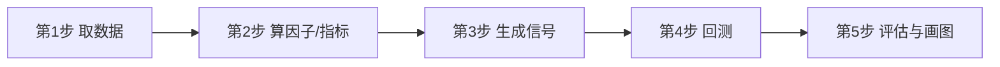

# Python量化3小时精通

> [!note] 本篇定位
> 这是一篇**端到端速成串讲**：用最短的代码，把"取数据 → 算因子 → 生成信号 → 回测 → 评估"在一篇里跑通，让你 3 小时内对量化全流程有完整体感。每一步只给最小可用代码，深入细节请点对应的专题笔记。适合有一点 Python 基础的人。

## 全流程地图



> [!tip] 学习节奏建议
> 第 1 小时：跑通取数据 + 画图（第 1-2 步）；第 2 小时：信号 + 回测（第 3-4 步）；第 3 小时：评估 + 改参数体会过拟合（第 5 步）。

## 第1步：取数据

```python
import akshare as ak
import pandas as pd

df = ak.stock_zh_a_hist(symbol="000300", period="daily",
                        start_date="20180101", adjust="hfq")
df = df.rename(columns={"日期": "date", "收盘": "close"})
df["date"] = pd.to_datetime(df["date"])
df = df.set_index("date")[["close"]]
```

环境与数据源的细节见 [[Python量化第一步]]。

## 第2步：算因子 / 指标

```python
df["ret"] = df["close"].pct_change()
df["ma20"] = df["close"].rolling(20).mean()
df["ma60"] = df["close"].rolling(60).mean()
# 一个简单的动量因子：过去20日累计收益
df["mom"] = df["close"].pct_change(20)
```

pandas 的 `rolling` / `shift` / `pct_change` 是量化里 90% 的活，详见 [[Python量化入门]]。

## 第3步：生成信号

```python
# 双均线：金叉持有，死叉空仓
df["signal"] = (df["ma20"] > df["ma60"]).astype(int)
```

## 第4步：回测（务必 shift 防未来函数）

```python
df["position"] = df["signal"].shift(1).fillna(0)      # 关键
cost = df["position"].diff().abs().fillna(0) * 0.0005  # 双边成本
df["strat"] = df["position"] * df["ret"] - cost
df["equity"] = (1 + df["strat"]).cumprod()
df["bench"] = (1 + df["ret"]).cumprod()
```

> [!warning] 唯一最致命的一行
> `shift(1)`。不加它，回测必然虚高、实盘必然崩。原理见 [[Python量化进阶]]。

## 第5步：评估与画图

```python
import numpy as np
ann = df["equity"].iloc[-1] ** (252/len(df.dropna())) - 1
vol = df["strat"].std() * np.sqrt(252)
sharpe = ann / vol
mdd = (df["equity"] / df["equity"].cummax() - 1).min()
print(f"年化{ann:.1%}  波动{vol:.1%}  夏普{sharpe:.2f}  回撤{mdd:.1%}")

df[["equity", "bench"]].plot(figsize=(10, 4), title="策略 vs 基准")
```

| 一眼判断 | 健康范围（示例，仅供体感） |
|---|---|
| 夏普 | > 1 还不错，> 2 要警惕过拟合 |
| 最大回撤 | 看你能不能拿住，-30% 多数人扛不住 |
| 策略 vs 基准 | 长期跑赢且回撤更小才有意义 |

指标含义见 [[业绩评估与归因]]。

## 速成之后，别停在这

> [!important] 3 小时能学会"跑通"，但学不会"做对"
> 这篇让你建立全局体感，但真正决定盈亏的几件事需要专门花时间：
> - **过拟合**：随手调出来的高夏普大多是假的 → [[回测方法论]]
> - **成本与执行**：高换手策略成本能吃掉一半收益 → [[市场微观结构与交易执行]]
> - **风险管理**：仓位和回撤边界比收益更重要 → [[风险管理框架]]
> - **因子逻辑**：信号背后要有经济学或行为学解释 → [[因子投资体系]]

## 常见误区

| 误区 | 纠正 |
|---|---|
| "3 小时就能稳定盈利" | 3 小时只够跑通流程，盈利靠长期打磨 |
| 信号不 shift | 未来函数，回测全是假的 |
| 不看成本 | 频繁交易的策略最怕成本 |
| 收益越高越好 | 没有风险和样本外验证的高收益不可信 |

## 相关链接

- [[Python量化入门]]
- [[Python量化进阶]]
- [[Python量化第一步]]
- [[回测方法论]]
- [[../目录|量化策略总览]]
