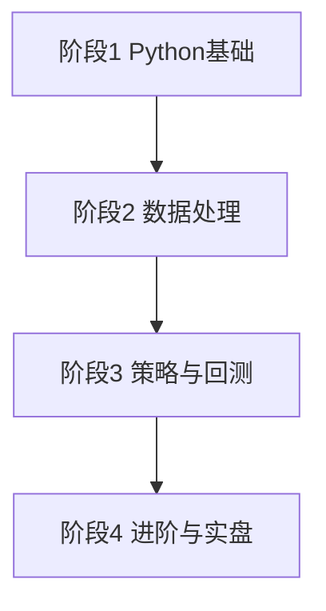

# Python量化教程Runoo

> [!note] 本篇定位
> 这是一份**结构化学习大纲**：把"用 Python 做量化"拆成基础 / 数据 / 策略 / 进阶四个阶段，每个阶段给清楚的**学习目标、必须掌握的 API 清单、一道动手练习**。它是索引性质的"课程地图"，具体每步怎么写代码，点进对应的专题笔记深学。

## 学习路线总览

> [!tip] 怎么用这份大纲
> 不要"看完"，要"做完"。每个阶段做完那道练习，再进下一阶段；卡住了回去补对应专题笔记。

## 阶段1：Python 基础（打地基）

**学习目标**：能独立装好环境、读懂别人的量化脚本、写出函数。

| 必会内容 | 关键点 |
|---|---|
| 环境 | Anaconda / conda 虚拟环境、Jupyter、VS Code |
| 数据类型 | list / dict / tuple、推导式 |
| 控制流与函数 | for / if、`def`、默认参数、返回值 |
| 库管理 | `pip install`、版本与依赖 |

**练习**：装好环境，用 akshare 拉一只指数的日线，打印最近 5 行。环境细节见 [[Python量化第一步]]。

## 阶段2：数据处理（量化的 90%）

**学习目标**：能熟练用 pandas 清洗、对齐、变换时间序列与面板数据。

| 必会 API | 用途 |
|---|---|
| `pd.read_csv` / `set_index` | 读入与设索引 |
| `pct_change` / `shift` | 收益率、避免未来函数 |
| `rolling` / `ewm` | 移动均线、指数加权 |
| `resample` / `asfreq` | 重采样到周/月 |
| `merge` / `concat` / `align` | 多资产对齐 |
| `dropna` / `fillna` | 缺失值处理 |

**练习**：算一只股票的 20 日均线和 20 日年化波动率，并把日线重采样成周线。详见 [[Python量化入门]] 与 [[量化工具链NumPy与Pandas]]。

## 阶段3：策略与回测（让想法可验证）

**学习目标**：能把一个交易想法写成信号、跑出净值、算出评估指标，并知道怎么防过拟合。

| 必会内容 | 关键点 |
|---|---|
| 技术指标 | MA、RSI、布林带、MACD 的实现 |
| 信号 → 持仓 | `shift(1)` 防未来函数 |
| 回测引擎 | 收益、净值、成本 |
| 评估 | 年化、夏普、最大回撤、卡玛 |
| 防过拟合 | 样本外、走向前、参数高原 |

**练习**：实现双均线策略的完整回测，加入双边千分之一成本，对比基准画净值曲线。详见 [[Python量化进阶]] 与 [[回测方法论]]。

## 阶段4：进阶与实盘（走向系统化）

**学习目标**：能搭多因子 / 组合层面的系统，理解实盘与回测的差距。

| 方向 | 入口笔记 |
|---|---|
| 多因子选股 | [[多因子策略实战]]、[[因子投资体系]] |
| 机器学习 | [[AI多因子选股策略]] |
| 风险与组合 | [[组合构建方法]]、[[风险管理框架]] |
| 执行与成本 | [[市场微观结构与交易执行]] |
| 金融指标实现 | [[Python量化金融入门]] |

**练习**：把阶段3的单策略，扩展成"在一个股票池上按因子打分选 Top-N、等权持有、月度调仓"的组合策略。

## 常见误区

| 误区 | 纠正 |
|---|---|
| 收藏一堆教程却不动手 | 每阶段必须做完练习 |
| 跳过数据处理直接写策略 | pandas 不熟，后面寸步难行 |
| 学了就想实盘大资金 | 先模拟、再小资金 |
| 追求复杂模型 | 简单策略做对，胜过复杂策略做错 |

## 相关链接

- [[Python量化入门]]
- [[Python量化进阶]]
- [[Python量化3小时精通]]
- [[Python量化金融入门]]
- [[目录|量化策略总览]]

## 课程化学习补充

> [!important] 学习定位
> 量化策略是投资假设、数据工程、回测验证、风险预算和执行系统的组合，不是单一公式。本文仅用于学习、研究与复盘，不构成任何投资建议。

### 必须掌握的问题

- 假设是否可证伪
- 数据是否 point-in-time
- 绩效是否扣除真实成本
- 上线后是否监控衰减

### 实战应用流程

1. 先写清楚你的投资假设：为什么这个信号、资产或方法应该产生收益。
2. 明确数据口径：样本范围、更新时间、复权/分红/停牌处理和交易日历。
3. 做最小可行验证：先用简单规则验证方向，再逐步加入复杂模型。
4. 把成本和约束前置：手续费、滑点、冲击成本、保证金、流动性和容量都要进入测算。
5. 上线后持续复盘：记录信号、下单、成交、持仓、回撤和失效原因。

### 风险与失效条件

- 数据挖掘偏差
- 因子拥挤
- 换手过高
- 实盘偏离回测

### 复盘问题

- 这笔交易或这套模型赚的是什么钱：风险补偿、行为偏差、流动性溢价，还是偶然噪音？
- 如果市场环境反过来，最大亏损和最长恢复期会是多少？
- 当前结论是否依赖某个不可持续假设，例如低利率、低波动、充裕流动性或监管套利？
- 有没有一个更简单的基准策略能取得接近效果？

### 延伸学习

- [[量化投资完全指南]]
- [[回测质量门清单]]
- [[市场微观结构与交易执行]]
- [[量化风险管理体系]]

## 跨领域进阶扩展

> [!tip] 交易者视角
> 学到 `Python量化教程Runoo` 时，不要只把它当成孤立知识点。把策略视为假设、数据、验证、组合和执行的整体工程。优秀投资交易者会把它放入“宏观背景 - 资产选择 - 估值/信号 - 组合风险 - 交易执行 - 复盘反馈”的闭环。

### 与其他知识的连接

- 收益来源和经济解释
- 数据清洗和偏差控制
- 回测、组合和风控
- 实盘衰减与策略迭代

### 进阶训练

1. 把策略假设写成可证伪命题
2. 建立基准策略比较
3. 把换手、容量和成本纳入绩效评价

### 能力验收

- 能否说清楚这个主题影响的是收益来源、风险来源、交易成本、流动性还是心理纪律？
- 能否指出它在什么市场环境、资产类别或交易周期中更有效？
- 能否把它写成一条可复盘的研究或交易规则？
- 能否说明如果判断错误，组合最大损失和退出机制是什么？

### 全局关联

- [[综合金融知识体系/金融投资全知识地图|金融投资全知识地图]]
- [[综合金融知识体系/优秀投资交易者能力地图|优秀投资交易者能力地图]]
- [[综合金融知识体系/一次性学习路线与复盘模板|一次性学习路线与复盘模板]]
