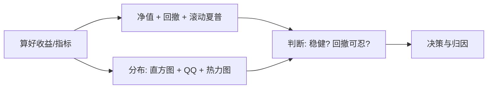

# Python金融分析课程

> [!note] 本篇定位：可视化与探索性分析
> 本篇专攻 **"把分析画出来"**：用 matplotlib 画净值曲线、回撤水下图、滚动夏普，再用相关性热力图、收益分布直方图与 QQ 图做探索性分析（EDA）。
> 指标怎么**算**见 [[Python金融分析指南]]，数据怎么**准备**见 [[NumPy与Pandas量化指南]] 与 [[量化工具链NumPy与Pandas]]。本篇假设收益序列已经算好，只负责呈现。

## 一、画图前的环境设置

```python
import numpy as np
import pandas as pd
import matplotlib.pyplot as plt

# 中文显示三件套（不设就乱码）
plt.rcParams['font.sans-serif'] = ['SimHei', 'Microsoft YaHei', 'Arial Unicode MS']
plt.rcParams['axes.unicode_minus'] = False        # 正常显示负号
plt.rcParams['figure.dpi'] = 110

# ---- 示例数据：一段日收益序列 ----
np.random.seed(7)
idx = pd.date_range('2024-01-01', periods=252, freq='B')
ret = pd.Series(np.random.normal(0.0005, 0.01, 252), index=idx, name='ret')  # 示例
equity = (1 + ret).cumprod()                       # 净值曲线
```

## 二、净值曲线：策略的"心电图"

```python
fig, ax = plt.subplots(figsize=(10, 4))
ax.plot(equity.index, equity.values, color='steelblue', lw=1.5)
ax.set_title('策略净值曲线（示例）')
ax.set_ylabel('净值'); ax.grid(alpha=0.3)
# 长周期建议对数轴，让早期小波动与后期大波动同等可读
# ax.set_yscale('log')
plt.tight_layout()
plt.savefig('equity.png', bbox_inches='tight')     # 无界面环境用 savefig 而非 show
```

> [!tip] 线性轴 vs 对数轴
> 跨度几年的净值用线性轴，早期 10% 的波动会被后期放大的曲线"压扁"。`set_yscale('log')` 后，相同百分比涨跌在图上高度一致，更利于比较不同阶段。

## 三、回撤水下图：直观看"被套多深"

```python
peak = equity.cummax()
dd = equity / peak - 1                              # 回撤曲线（<=0）

fig, ax = plt.subplots(figsize=(10, 3))
ax.fill_between(dd.index, dd.values, 0, color='firebrick', alpha=0.4)  # 水下面积图
ax.set_title('回撤水下图（示例）')
ax.set_ylabel('回撤'); ax.grid(alpha=0.3)
plt.tight_layout()
```

水下图把"水面"设为 0，阴影越深越久代表回撤越痛——比单个最大回撤数字更能传达煎熬感（回撤的算法见 [[Python金融分析指南]]）。

## 四、滚动夏普：业绩稳不稳

```python
window = 63                                         # 约一个季度
roll_sharpe = (ret.rolling(window).mean()
               / ret.rolling(window).std(ddof=1)) * np.sqrt(252)

fig, ax = plt.subplots(figsize=(10, 3))
ax.plot(roll_sharpe.index, roll_sharpe.values, color='darkgreen', lw=1.2)
ax.axhline(0, color='gray', ls='--', lw=1)
ax.set_title(f'{window}日滚动夏普（示例）')
ax.grid(alpha=0.3); plt.tight_layout()
```

> [!important] 一个总夏普会骗人
> 整段算出的单一夏普可能掩盖"靠某一两个月暴涨撑起来"的事实。滚动夏普能暴露业绩是否**持续**，是评估稳健性的关键一图。

## 五、相关性热力图（纯 matplotlib）

```python
np.random.seed(3)
rets = pd.DataFrame(np.random.normal(0, 0.01, (252, 5)),
                    columns=[f'股票{i}' for i in range(1, 6)])   # 示例多资产
corr = rets.corr()

fig, ax = plt.subplots(figsize=(5.5, 4.5))
im = ax.imshow(corr.values, cmap='coolwarm', vmin=-1, vmax=1)    # 固定色标范围
ax.set_xticks(range(len(corr))); ax.set_xticklabels(corr.columns, rotation=45, ha='right')
ax.set_yticks(range(len(corr))); ax.set_yticklabels(corr.columns)
for i in range(len(corr)):                                       # 每格标数值
    for j in range(len(corr)):
        ax.text(j, i, f'{corr.values[i, j]:.2f}', ha='center', va='center', fontsize=8)
fig.colorbar(im, ax=ax, fraction=0.046)
ax.set_title('收益相关性热力图（示例）')
plt.tight_layout()
```

> [!warning] 色标必须固定在 [-1, 1]
> 不设 `vmin=-1, vmax=1`，matplotlib 会按数据自动缩放色标，让 0.3 和 0.9 的相关看起来颜色差不多，严重误导。相关性矩阵是 [[NVIDIA量化组合优化]] 做分散化的输入，看错会选错组合。

## 六、收益分布：直方图 + QQ 图查胖尾

```python
from scipy import stats

fig, axes = plt.subplots(1, 2, figsize=(11, 4))

# 左：直方图叠加同均值同方差的正态密度
axes[0].hist(ret.values, bins=40, density=True, alpha=0.6,
             color='slateblue', label='实际收益')
x = np.linspace(ret.min(), ret.max(), 200)
axes[0].plot(x, stats.norm.pdf(x, ret.mean(), ret.std(ddof=1)),
             'r--', label='正态拟合')
axes[0].set_title('日收益分布（示例）'); axes[0].legend()

# 右：QQ 图，点偏离直线 = 偏离正态（尾部翘起多为胖尾）
stats.probplot(ret.values, dist='norm', plot=axes[1])
axes[1].set_title('收益 QQ 图（示例）')
plt.tight_layout()
```



## 七、常见误区 / 踩坑

| 误区 | 后果 | 正确做法 |
|------|------|----------|
| 中文不设字体 | 标题/图例全是方块 | 设 `font.sans-serif` + `unicode_minus=False` |
| 长周期净值用线性轴 | 早期波动被压扁 | 跨年净值用 `set_yscale('log')` |
| 双轴 `twinx` 比两条线 | 量纲不同、比例失真误导 | 同图比较先归一化到同起点 |
| 直方图 bins 太多/太少 | 误判分布形态 | 试 30-50，或用经验法则 |
| 热力图不固定色标 | 相关强弱视觉失真 | `vmin=-1, vmax=1` |
| 画图前不 `dropna` | 曲线断裂/报错 | 先清洗，见姊妹篇 |
| 脚本里只 `plt.show()` | 无界面环境出不来图 | 用 `savefig` 落盘 |
| 净值图忽视幸存者偏差 | 图越漂亮越骗自己 | 数据层面先排雷，见 [[回测方法论]] |

> [!tip] QQ 图怎么读
> 点都落在参考直线上 ≈ 近似正态；两端点向上/向下翘起 = 胖尾（极端涨跌比正态更频繁）。这正解释了为何不能只信夏普——配合 [[Python金融分析指南]] 的索提诺与最大回撤一起看。

## 相关链接

- [[Python量化入门]]
- [[Python金融分析指南]]
- [[Python量化金融入门]]
- [[目录|量化策略总览]]
- [[量化工具链NumPy与Pandas]]
- [[NumPy与Pandas量化指南]]
- [[业绩评估与归因]]

## 课程化学习补充

> [!important] 学习定位
> 量化策略是投资假设、数据工程、回测验证、风险预算和执行系统的组合，不是单一公式。本文仅用于学习、研究与复盘，不构成任何投资建议。

### 必须掌握的问题

- 假设是否可证伪
- 数据是否 point-in-time
- 绩效是否扣除真实成本
- 上线后是否监控衰减

### 实战应用流程

1. 先写清楚你的投资假设：为什么这个信号、资产或方法应该产生收益。
2. 明确数据口径：样本范围、更新时间、复权/分红/停牌处理和交易日历。
3. 做最小可行验证：先用简单规则验证方向，再逐步加入复杂模型。
4. 把成本和约束前置：手续费、滑点、冲击成本、保证金、流动性和容量都要进入测算。
5. 上线后持续复盘：记录信号、下单、成交、持仓、回撤和失效原因。

### 风险与失效条件

- 数据挖掘偏差
- 因子拥挤
- 换手过高
- 实盘偏离回测

### 复盘问题

- 这笔交易或这套模型赚的是什么钱：风险补偿、行为偏差、流动性溢价，还是偶然噪音？
- 如果市场环境反过来，最大亏损和最长恢复期会是多少？
- 当前结论是否依赖某个不可持续假设，例如低利率、低波动、充裕流动性或监管套利？
- 有没有一个更简单的基准策略能取得接近效果？

### 延伸学习

- [[量化投资完全指南]]
- [[回测质量门清单]]
- [[市场微观结构与交易执行]]
- [[量化风险管理体系]]

## 跨领域进阶扩展

> [!tip] 交易者视角
> 学到 `Python金融分析课程` 时，不要只把它当成孤立知识点。把策略视为假设、数据、验证、组合和执行的整体工程。优秀投资交易者会把它放入“宏观背景 - 资产选择 - 估值/信号 - 组合风险 - 交易执行 - 复盘反馈”的闭环。

### 与其他知识的连接

- 收益来源和经济解释
- 数据清洗和偏差控制
- 回测、组合和风控
- 实盘衰减与策略迭代

### 进阶训练

1. 把策略假设写成可证伪命题
2. 建立基准策略比较
3. 把换手、容量和成本纳入绩效评价

### 能力验收

- 能否说清楚这个主题影响的是收益来源、风险来源、交易成本、流动性还是心理纪律？
- 能否指出它在什么市场环境、资产类别或交易周期中更有效？
- 能否把它写成一条可复盘的研究或交易规则？
- 能否说明如果判断错误，组合最大损失和退出机制是什么？

### 全局关联

- [[综合金融知识体系/金融投资全知识地图|金融投资全知识地图]]
- [[综合金融知识体系/优秀投资交易者能力地图|优秀投资交易者能力地图]]
- [[综合金融知识体系/一次性学习路线与复盘模板|一次性学习路线与复盘模板]]
