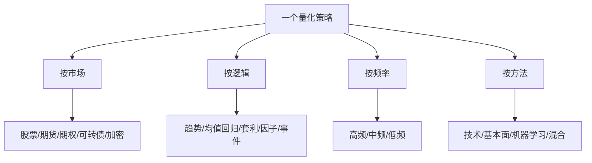

# Qbot策略分类

> [!note] 本篇定位
> 这是一张**策略分类参考卡**。量化策略可以从四个维度去切：交易**什么市场**、用**什么逻辑**、跑**什么频率**、靠**什么方法**。同一个策略在四个维度上各有坐标。理清分类，才能知道一个策略适合什么环境、风险在哪、该和谁组合。

## 四维分类总图

## 维度一：按市场（交易什么）

| 市场 | 特点 | 代表策略 |
|---|---|---|
| 股票 | 标的多、可做截面选股 | 多因子选股、指数增强 |
| 期货 | 杠杆、双向、跨品种 | CTA 趋势、跨期/跨品种套利 |
| 期权 | 非线性、波动率维度 | 波动率交易、对冲（见 [[期权策略]]） |
| 可转债 | 股债双性、下有保底 | 双低轮动、折溢价套利 |
| 加密 | 7×24、波动极大 | 趋势、资金费率套利（风险高） |

## 维度二：按逻辑（赚什么钱）

| 逻辑 | 核心假设 | 最怕的环境 |
|---|---|---|
| 趋势跟踪 | 趋势会延续 | 横盘震荡 |
| 均值回归 | 偏离终将回归 | 单边趋势 |
| 套利 | 定价偏差会收敛 | 关系破裂、拥挤 |
| 因子 | 因子有长期溢价 | 因子失效/拥挤 |
| 事件驱动 | 事件带来可预期重定价 | 概率估计错误 |

逻辑层面的展开见 [[五大经典量化策略]]、[[均值回归策略基础]]、[[统计套利深度解析]]。

## 维度三：按频率（多快交易）

| 频率 | 持仓周期 | 关键瓶颈 | 个人可行性 |
|---|---|---|---|
| 高频 | 秒~分钟 | 延迟、基建、撮合 | 几乎不可行 |
| 中频 | 日内~数日 | 成本、容量 | 有门槛 |
| 低频 | 周~月以上 | 逻辑与纪律 | **最适合个人** |

> [!tip] 频率越高，比拼的越是工程而非聪明
> 高频是基建和延迟的军备竞赛，个人没有优势；个人投资者的主场在中低频，靠逻辑、耐心和纪律取胜。执行细节见 [[市场微观结构与交易执行]]。

## 维度四：按方法（怎么生成信号）

| 方法 | 信号来源 | 优点 | 风险 |
|---|---|---|---|
| 技术分析 | 价量形态/指标 | 直观、易实现 | 易过拟合、主观 |
| 基本面 | 财务/估值/宏观 | 逻辑扎实 | 频率低、慢 |
| 机器学习 | 数据驱动的非线性 | 抓复杂关系 | 过拟合、黑箱 |
| 混合 | 多源融合 | 互补稳健 | 复杂度高 |

机器学习方法的取舍见 [[AI多因子选股策略]]。

## 怎么用这张卡

> [!example] 给一个策略定位
> 例：「在 A 股股票池上，用价值+动量因子月度选股」→ 市场=股票、逻辑=因子、频率=低频、方法=基本面/技术混合。定位清楚后，就知道它**最怕风格切换**、**适合和趋势/CTA 这类低相关策略组合**（见 [[组合构建方法]]）。

## 常见误区

| 误区 | 更好的理解 |
|---|---|
| 一个策略只属于一类 | 四个维度上各有坐标，要综合看 |
| 频率越高越赚钱 | 高频拼基建，个人无优势 |
| 方法越先进越好 | 适配市场与自己的能力才重要 |
| 不分类就堆策略 | 分类是为了判断相关性与适用环境 |

## 相关链接

- [[量化投资完全指南]]
- [[五大经典量化策略]]
- [[量化策略案例分析]]
- [[量化交易全景图]]
- [[组合构建方法]]
- [[目录|量化策略总览]]

## 实战掌握清单

> [!tip] 交易者视角
> Qbot策略分类 的学习重点不是记住术语，而是把它放进研究、组合、执行和复盘的闭环。量化策略必须从清晰假设出发，经过数据验证、成本测算、风险控制和实盘监控，才可能成为可持续系统。

### 关键判断

- 写清楚收益来自动量、反转、价值、套利、波动率、流动性还是行为偏差。
- 确认信号、过滤器、入场、退出、仓位和风控。
- 看收益是否集中在少数时期、少数品种或少数参数。

### 落地动作

1. 做样本外、滚动窗口和参数扰动测试。
2. 把手续费、滑点、冲击成本、容量和失败交易纳入报告。
3. 上线后监控成交质量、信号衰减、回撤和异常订单。

### 失效边界

- 过拟合。
- 策略容量不足。
- 市场结构变化后没有停止机制。

### 复盘问题

- 这项知识改变了哪一个具体决策：标的、方向、仓位、退出、对冲还是不交易？
- 如果判断相反，最大亏损、最长恢复期和退出触发条件是什么？
- 有没有一个更简单的基准方法可以取得相近结果？
