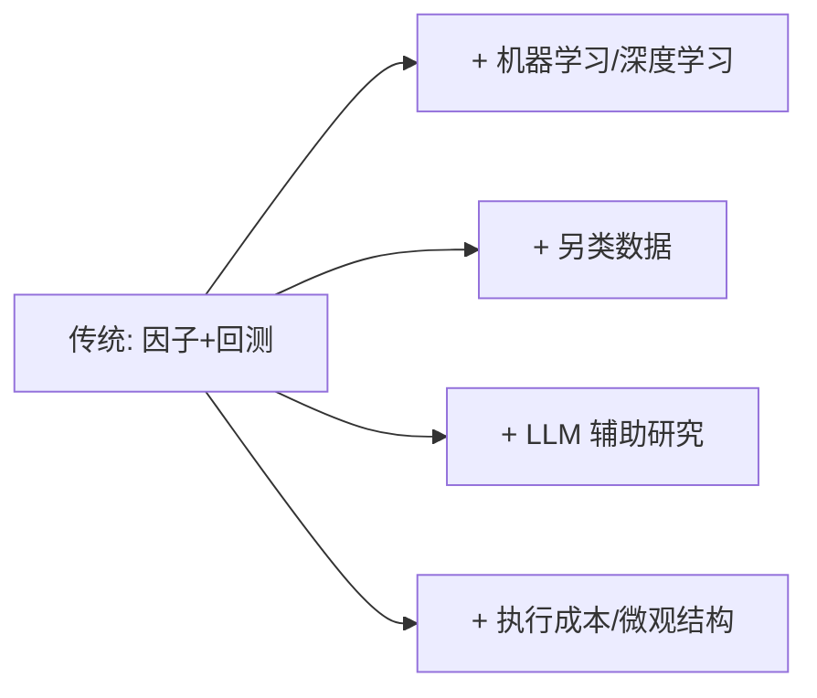

# 量化交易书单2026

> [!note] 本篇定位
> 与 [[量化交易书籍推荐]]（按入门→高级阶段排序）互补，这一篇**按主题（知识模块）组织**，并补上 2026 年更受重视的方向（机器学习、另类数据、执行成本）与**免费/在线资源**。用途：当你想补某一块短板时，直接按主题查。

## 按主题的核心书目

| 主题 | 代表书 | 一句话 |
|---|---|---|
| 概念与全景 | 《打开量化投资的黑箱》 | 先看清量化在做什么 |
| Python 工程 | 《Python量化投资》《Python for Finance》 | 把想法变代码 |
| 因子与组合 | 《主动投资组合管理》 | 因子、IR、主动管理法则 |
| 策略实证 | 《算法交易》《量化交易如何建立》 | 均值回归/动量/套利落地 |
| 机器学习 | 《Advances in Financial ML》 | 防过拟合、防泄露的正确姿势 |
| 资产定价 | 《Expected Returns》《Efficiently Inefficient》 | 收益从哪来、何时消失 |
| 期权波动率 | 期权与波动率交易类经典 | 非线性与波动率维度 |
| 风险管理 | 风险管理与凯利/仓位类 | 先活下来 |

## 2026 视角：哪些方向权重在上升

| 方向 | 为什么 2026 更重要 | 库内入口 |
|---|---|---|
| 机器学习 | 算力与工具成熟，但过拟合风险更高 | [[AI多因子选股策略]] |
| 另类数据 | 传统数据 alpha 衰减，找增量信息 | [[另类数据与信息优势]] |
| LLM 辅助 | 加速研究与信息提取，需防幻觉 | [[LLM因子搜索]] |
| 执行/微观结构 | 高换手策略成本决定生死 | [[市场微观结构与交易执行]] |

> [!warning] 越新越要警惕
> 新方向更容易被包装成"圣杯"。机器学习/另类数据不改变一个铁律：**没有可解释的逻辑 + 严格的样本外验证，再炫的方法也是过拟合。**

## 免费 / 在线资源（按类型）

| 类型 | 用途 |
|---|---|
| 开源数据接口（如 akshare、tushare、efinance） | 拉行情与基本面，练手 |
| 开源回测/因子框架 | 不重复造轮子 |
| 公开课程与文档（统计、Python、机器学习） | 补基础 |
| 优质中文社区与博客 | 跟进实战经验，但要自己验证 |

库内数据工具见"量化工具"目录下的 akshare / efinance / xalpha 等笔记。

## 怎么用这份书单

> [!tip] 三步法
> 1. **定位短板**：用 [[量化投资完全指南]] 的流程图找出你最弱的环节；
> 2. **按主题选一本**：只挑这一块的 1 本精读；
> 3. **配一个小项目**：用 [[Python量化进阶]] 把书里的方法复现一遍。

## 常见误区

| 误区 | 纠正 |
|---|---|
| 追"2026 最新书单"求全 | 按短板选，不必读全 |
| 重 ML/另类数据轻基础 | 没有因子和回测基础，新方法学不动 |
| 收藏=学会 | 必须复现 |

## 相关链接

- [[量化交易书籍推荐]]
- [[量化行业百科]]
- [[量化投资完全指南]]
- [[另类数据与信息优势]]
- [[目录|量化策略总览]]

## 课程化学习补充

> [!important] 学习定位
> 量化策略是投资假设、数据工程、回测验证、风险预算和执行系统的组合，不是单一公式。本文仅用于学习、研究与复盘，不构成任何投资建议。

### 必须掌握的问题

- 假设是否可证伪
- 数据是否 point-in-time
- 绩效是否扣除真实成本
- 上线后是否监控衰减

### 实战应用流程

1. 先写清楚你的投资假设：为什么这个信号、资产或方法应该产生收益。
2. 明确数据口径：样本范围、更新时间、复权/分红/停牌处理和交易日历。
3. 做最小可行验证：先用简单规则验证方向，再逐步加入复杂模型。
4. 把成本和约束前置：手续费、滑点、冲击成本、保证金、流动性和容量都要进入测算。
5. 上线后持续复盘：记录信号、下单、成交、持仓、回撤和失效原因。

### 风险与失效条件

- 数据挖掘偏差
- 因子拥挤
- 换手过高
- 实盘偏离回测

### 复盘问题

- 这笔交易或这套模型赚的是什么钱：风险补偿、行为偏差、流动性溢价，还是偶然噪音？
- 如果市场环境反过来，最大亏损和最长恢复期会是多少？
- 当前结论是否依赖某个不可持续假设，例如低利率、低波动、充裕流动性或监管套利？
- 有没有一个更简单的基准策略能取得接近效果？

### 延伸学习

- [[量化投资完全指南]]
- [[回测质量门清单]]
- [[市场微观结构与交易执行]]
- [[量化风险管理体系]]
