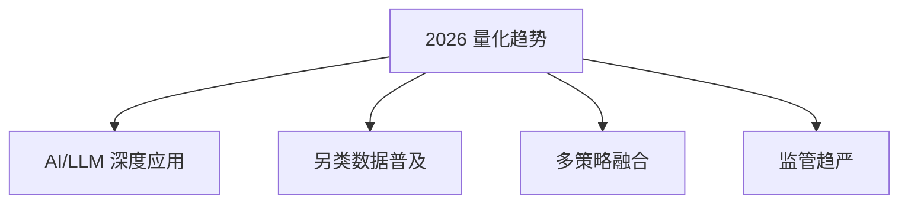

# 量化交易入门2026

> [!note] 本篇定位
> 这一篇讲**方向**：2026 年量化的新趋势，以及它们如何改变入门的重点。想要"手把手的一步步路线"，看 [[量化交易入门指南2025]]；想看全局地图，看 [[量化交易全景图]]。

## 2026 年的四个趋势

| 趋势 | 含义 | 对入门者的影响 |
|---|---|---|
| AI/LLM 深度应用 | 机器学习、大模型用于信号、研究、信息提取 | 要懂 ML，更要懂它的过拟合陷阱（[[AI多因子选股策略]]） |
| 另类数据普及 | 传统数据 alpha 衰减，转向另类信息 | 数据处理与合规变重要（[[另类数据与信息优势]]） |
| 多策略融合 | 单策略容量有限，机构走向多策略组合 | 组合与风险管理是必修（[[组合构建方法]]） |
| 监管趋严 | 对程序化/高频的规则更细 | 合规意识要前置 |

> [!warning] 趋势会变，铁律不变
> 不管 AI 多强，"有可解释逻辑 + 严格样本外验证 + 风险控制"这三条永远是底座。新技术放大的是效率，也放大了过拟合和盲目自信的代价。

## 入门重点：2026 版

相比几年前，入门时应更早接触这几块：

| 模块 | 传统权重 | 2026 权重 | 为什么 |
|---|---|---|---|
| Python/数据 | 高 | 高 | 永远的基本功 |
| 因子/回测 | 高 | 高 | 核心方法论 |
| 机器学习 | 中 | 中高 | 工具成熟，但需会防过拟合 |
| 另类数据 | 低 | 中 | 找增量信息 |
| 风险/执行 | 中 | 高 | 策略拥挤后，成本与风控决定生死 |

## 学习路径（精简版）

1. **Python 基础**：数据处理、可视化（[[Python量化第一步]]）
2. **金融知识**：市场机制、资产定价
3. **统计方法**：回归、时间序列
4. **策略开发**：因子构建、回测验证（[[回测方法论]]）
5. **风险管理**：仓位控制、止损（[[风险管理框架]]）
6. **实盘实践**：模拟交易、小资金实盘

详细的过关标准与产出见 [[量化交易入门指南2025]]。

## 常见误区

| 误区 | 纠正 |
|---|---|
| 觉得 AI 让量化变简单了 | AI 让门槛在某些环节更高（防过拟合更难） |
| 追最新工具忽视基础 | 基础不牢，新工具用不起来 |
| 以为监管与己无关 | 个人也要懂程序化交易的合规边界 |
| 把"趋势"当"圣杯" | 趋势是方向，不是稳定收益来源 |

## 相关链接

- [[量化交易入门指南2025]]
- [[量化投资完全指南]]
- [[量化交易全景图]]
- [[Python量化入门]]
- [[目录|量化策略总览]]

## 课程化学习补充

> [!important] 学习定位
> 量化策略是投资假设、数据工程、回测验证、风险预算和执行系统的组合，不是单一公式。本文仅用于学习、研究与复盘，不构成任何投资建议。

### 必须掌握的问题

- 假设是否可证伪
- 数据是否 point-in-time
- 绩效是否扣除真实成本
- 上线后是否监控衰减

### 实战应用流程

1. 先写清楚你的投资假设：为什么这个信号、资产或方法应该产生收益。
2. 明确数据口径：样本范围、更新时间、复权/分红/停牌处理和交易日历。
3. 做最小可行验证：先用简单规则验证方向，再逐步加入复杂模型。
4. 把成本和约束前置：手续费、滑点、冲击成本、保证金、流动性和容量都要进入测算。
5. 上线后持续复盘：记录信号、下单、成交、持仓、回撤和失效原因。

### 风险与失效条件

- 数据挖掘偏差
- 因子拥挤
- 换手过高
- 实盘偏离回测

### 复盘问题

- 这笔交易或这套模型赚的是什么钱：风险补偿、行为偏差、流动性溢价，还是偶然噪音？
- 如果市场环境反过来，最大亏损和最长恢复期会是多少？
- 当前结论是否依赖某个不可持续假设，例如低利率、低波动、充裕流动性或监管套利？
- 有没有一个更简单的基准策略能取得接近效果？

### 延伸学习

- [[量化投资完全指南]]
- [[回测质量门清单]]
- [[市场微观结构与交易执行]]
- [[量化风险管理体系]]

## 跨领域进阶扩展

> [!tip] 交易者视角
> 学到 `量化交易入门2026` 时，不要只把它当成孤立知识点。把策略视为假设、数据、验证、组合和执行的整体工程。优秀投资交易者会把它放入“宏观背景 - 资产选择 - 估值/信号 - 组合风险 - 交易执行 - 复盘反馈”的闭环。

### 与其他知识的连接

- 收益来源和经济解释
- 数据清洗和偏差控制
- 回测、组合和风控
- 实盘衰减与策略迭代

### 进阶训练

1. 把策略假设写成可证伪命题
2. 建立基准策略比较
3. 把换手、容量和成本纳入绩效评价

### 能力验收

- 能否说清楚这个主题影响的是收益来源、风险来源、交易成本、流动性还是心理纪律？
- 能否指出它在什么市场环境、资产类别或交易周期中更有效？
- 能否把它写成一条可复盘的研究或交易规则？
- 能否说明如果判断错误，组合最大损失和退出机制是什么？

### 全局关联

- [[综合金融知识体系/金融投资全知识地图|金融投资全知识地图]]
- [[综合金融知识体系/优秀投资交易者能力地图|优秀投资交易者能力地图]]
- [[综合金融知识体系/一次性学习路线与复盘模板|一次性学习路线与复盘模板]]
