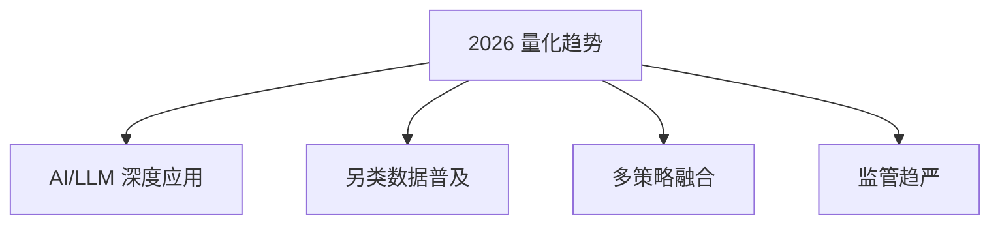

# 量化交易入门2026

> [!note] 本篇定位
> 这一篇讲**方向**：2026 年量化的新趋势，以及它们如何改变入门的重点。想要"手把手的一步步路线"，看 [[量化交易入门指南2025]]；想看全局地图，看 [[量化交易全景图]]。

## 2026 年的四个趋势

| 趋势 | 含义 | 对入门者的影响 |
|---|---|---|
| AI/LLM 深度应用 | 机器学习、大模型用于信号、研究、信息提取 | 要懂 ML，更要懂它的过拟合陷阱（[[AI多因子选股策略]]） |
| 另类数据普及 | 传统数据 alpha 衰减，转向另类信息 | 数据处理与合规变重要（[[另类数据与信息优势]]） |
| 多策略融合 | 单策略容量有限，机构走向多策略组合 | 组合与风险管理是必修（[[组合构建方法]]） |
| 监管趋严 | 对程序化/高频的规则更细 | 合规意识要前置 |

> [!warning] 趋势会变，铁律不变
> 不管 AI 多强，"有可解释逻辑 + 严格样本外验证 + 风险控制"这三条永远是底座。新技术放大的是效率，也放大了过拟合和盲目自信的代价。

## 入门重点：2026 版

相比几年前，入门时应更早接触这几块：

| 模块 | 传统权重 | 2026 权重 | 为什么 |
|---|---|---|---|
| Python/数据 | 高 | 高 | 永远的基本功 |
| 因子/回测 | 高 | 高 | 核心方法论 |
| 机器学习 | 中 | 中高 | 工具成熟，但需会防过拟合 |
| 另类数据 | 低 | 中 | 找增量信息 |
| 风险/执行 | 中 | 高 | 策略拥挤后，成本与风控决定生死 |

## 学习路径（精简版）

1. **Python 基础**：数据处理、可视化（[[Python量化第一步]]）
2. **金融知识**：市场机制、资产定价
3. **统计方法**：回归、时间序列
4. **策略开发**：因子构建、回测验证（[[回测方法论]]）
5. **风险管理**：仓位控制、止损（[[风险管理框架]]）
6. **实盘实践**：模拟交易、小资金实盘

详细的过关标准与产出见 [[量化交易入门指南2025]]。

## 常见误区

| 误区 | 纠正 |
|---|---|
| 觉得 AI 让量化变简单了 | AI 让门槛在某些环节更高（防过拟合更难） |
| 追最新工具忽视基础 | 基础不牢，新工具用不起来 |
| 以为监管与己无关 | 个人也要懂程序化交易的合规边界 |
| 把"趋势"当"圣杯" | 趋势是方向，不是稳定收益来源 |

## 相关链接

- [[量化交易入门指南2025]]
- [[量化投资完全指南]]
- [[量化交易全景图]]
- [[Python量化入门]]
- [[../目录|量化策略总览]]
