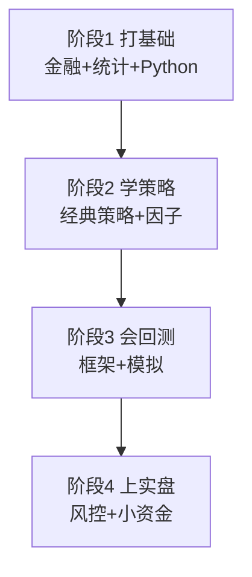

# 量化交易入门指南2025

> [!note] 本篇定位
> 这是一份**手把手的入门行动路线**：每个阶段告诉你"具体做什么、做到什么算过关、产出是什么"。它和 [[量化交易入门2026]]（讲趋势与方向）互补——那篇讲"往哪走"，这篇讲"怎么一步步走"。

## 四阶段路线图

## 阶段1：打基础

| 模块 | 学到什么 | 过关标准 |
|---|---|---|
| 金融市场 | 交易机制、订单、费用 | 能说清一笔交易怎么成交、成本几何 |
| 统计 | 均值/方差、回归、相关 | 能解释相关≠因果、显著性 |
| Python | pandas、画图 | 能拉数据、算均线、画净值 |

**产出**：用 Python 拉一只标的的历史数据，算并画出移动均线。见 [[Python量化第一步]]、[[Python量化入门]]。

## 阶段2：学策略

| 模块 | 学到什么 | 过关标准 |
|---|---|---|
| 经典策略 | 趋势/均值回归/因子/套利 | 能说清各自最怕什么环境 |
| 因子入门 | 价值/动量/质量等 | 能把一个因子算出来并打分 |

**产出**：写清一个策略的"假设→规则→风险"。见 [[五大经典量化策略]]、[[因子投资入门]]。

## 阶段3：会回测

| 模块 | 学到什么 | 过关标准 |
|---|---|---|
| 回测引擎 | 信号→持仓→净值 | 能跑出含成本的净值曲线 |
| 防过拟合 | 样本外、走向前 | 能识别未来函数与过拟合 |
| 模拟交易 | 纸上跑策略 | 模拟跑满一段时间并复盘 |

**产出**：一个含交易成本、有样本外验证的完整回测。见 [[Python量化进阶]]、[[回测方法论]]。

## 阶段4：上实盘

| 模块 | 学到什么 | 过关标准 |
|---|---|---|
| 风险管理 | 仓位、回撤、止损 | 写出自己的风控规则卡 |
| 小资金实盘 | 真实滑点与情绪 | 用能亏得起的钱跑通下单→对账 |

**产出**：一份风控规则 + 小资金实盘记录。见 [[风险管理框架]]、[[交易心理与执行纪律]]。

> [!important] 节奏建议：慢就是快
> 别跳级。多数人栽在"基础没打牢就上实盘大资金"。每个阶段的产出都做出来，再进下一阶段。

## 常见误区

> [!warning] 入门四大坑
> - 追求复杂模型，忽视基础（pandas 都不熟就想上深度学习）
> - 过度依赖回测结果（不做样本外，把过拟合当圣杯）
> - 忽视交易成本和滑点（高换手策略实盘必亏）
> - 缺乏风险管理意识（没想清楚最大亏损就满仓）

## 相关链接

- [[量化交易入门2026]]
- [[量化投资完全指南]]
- [[量化交易全景图]]
- [[Python量化入门]]
- [[风险管理框架]]
- [[../目录|量化策略总览]]
