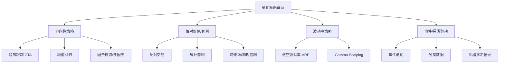
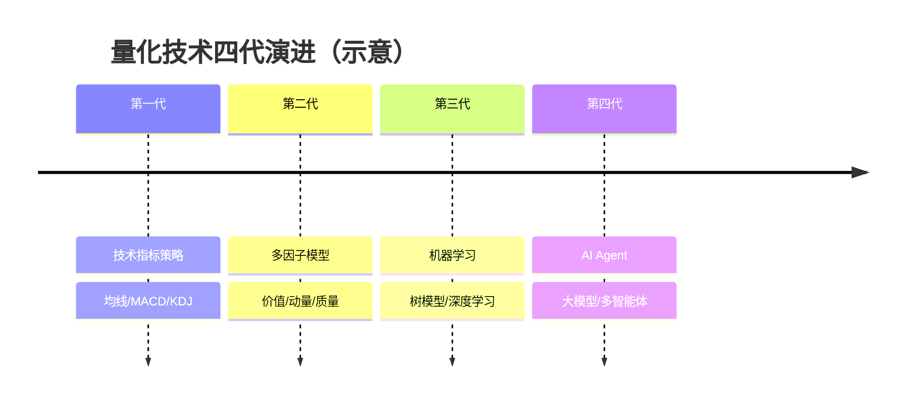

# 量化交易全景图

> [!note] 全景图
> 入门量化最容易犯的错误，是一头扎进某个具体策略，却始终没有全局视野。本文是一张"量化世界地图"：先看清都有哪些**玩家**、哪些**策略谱系**、哪些**频率层级**、技术经历了**几代演进**，最后回答最现实的问题——**个人到底能做什么**。

## 一、量化交易的核心理念

量化交易的核心可以浓缩成一句话：

> [!important] 一句话定义
> 把投资理念**固化为明确规则**，用历史数据**验证**其有效性，再让计算机**严格执行**，从而克服人性的弱点。

它与主观交易的根本区别在于"可复现"与"可验证"：

| 维度 | 主观交易 | 量化交易 |
|------|---------|---------|
| 决策依据 | 经验、盘感、消息 | 规则、数据、统计 |
| 可复现性 | 低，因人而异 | 高，代码即规则 |
| 情绪影响 | 大 | 小（执行层面） |
| 覆盖广度 | 几只到几十只 | 全市场数千标的 |
| 主要风险 | 纪律失守 | 模型失效、过拟合 |

## 二、参与者地图

量化世界并非铁板一块，不同体量的玩家在不同的"生态位"上竞争。

| 类型 | 代表 | 典型策略 | 资金体量 | 竞争壁垒 |
|-----|------|---------|---------|---------|
| 量化对冲基金 | Citadel、Two Sigma | 多策略、全市场 | 极大 | 人才+数据+资本 |
| 高频交易公司 | Virtu、Jump | 做市、低延迟套利 | 大 | 硬件+网络延迟 |
| 量化私募 | 九坤、幻方等 | A股指增、CTA | 中大 | 因子库+本土化 |
| 公募量化 | 各大基金公司 | 指数增强、Smart Beta | 大 | 渠道+合规 |
| 个人量化 | 散户、独立交易者 | 中低频、单策略 | 小 | 灵活+无规模拖累 |

> [!tip] 生态位思维
> 个人**打不过**机构的地方：低延迟、海量另类数据、团队化因子挖掘。个人**反而有优势**的地方：船小好调头、能做机构看不上的小容量策略、不受赎回压力与考核周期约束。

## 三、策略谱系

主流策略可以挂在一棵"逻辑树"上。它们并非互斥，成熟体系往往是多策略的组合。

五大经典框架是这棵树的主干，详见 [[五大经典量化策略]]；进阶分支见 [[高收益复杂策略解析]]。

## 四、频率谱系

"交易频率"决定了你需要的基础设施、容量上限和核心竞争力，是区分玩家最关键的一条轴。

| 频率层级 | 持仓周期 | 核心竞争力 | 容量 | 个人可行性 |
|---------|---------|-----------|------|-----------|
| 超高频 | 毫秒~秒 | 硬件、延迟 | 极小 | 几乎不可能 |
| 高频 | 秒~分钟 | 微观结构、做市 | 小 | 很难 |
| 中频 | 数小时~数天 | 因子、信号质量 | 中 | 可行 ✅ |
| 低频 | 数周~数月 | 逻辑、风控 | 大 | 可行 ✅ |
| 超低频 | 数月~数年 | 资产配置、择时 | 极大 | 可行 ✅ |

> [!warning] 频率与容量的天然矛盾
> 频率越高，单笔利润越薄、容量越小、对基础设施要求越苛刻。个人投资者**主动选择中低频**，往往不是退而求其次，而是扬长避短的理性选择。

## 五、技术演进四代

量化的"武器"一直在升级，但**新一代不会完全淘汰旧一代**——技术指标至今仍是许多策略的组成部分。

| 代际 | 核心方法 | 优势 | 局限 |
|------|---------|------|------|
| 第一代 | 技术指标 | 直观、易实现 | 易过拟合、同质化 |
| 第二代 | 多因子模型 | 可解释、可归因 | 因子拥挤、衰减 |
| 第三代 | 机器学习 | 捕捉非线性 | 黑箱、数据饥渴 |
| 第四代 | AI Agent | 自动化研究闭环 | 不确定性高、尚早期 |

机器学习一代的系统学习见 [[机器学习交易综合指南]]；多因子一代见 [[因子投资体系]]。

## 六、个人投资者能做什么

把上面几条轴叠加，个人的"可行区"就清晰了：**中低频 + 逻辑清晰 + 小容量 + 强风控**。

> [!example] 一条现实的个人路线（示例）
> 1. 选 1~2 个**逻辑能讲清楚**的策略（如趋势跟踪或多因子选股）。
> 2. 用**严谨回测**验证，警惕过拟合（见 [[回测方法论]]）。
> 3. 先**模拟盘**跑通，再用小资金实盘。
> 4. 把**风控写进规则**（仓位、止损、相关性），见 [[风险管理框架]]。
> 5. 持续**复盘迭代**，逐步扩展策略池。

| 个人应该做 | 个人应该避免 |
|-----------|------------|
| 中低频、小容量策略 | 和机构拼超高频延迟 |
| 逻辑可解释的策略 | 盲目堆砌复杂黑箱模型 |
| 严格风控与仓位管理 | 满仓单押、无止损 |
| 小步快跑、持续复盘 | 一把梭哈、回测即实盘 |

## 七、常见误区与风险

> [!warning] 三个最常见的认知陷阱
> 1. **把回测收益当实盘收益**：忽略滑点、手续费、冲击成本，回测越漂亮越要警惕过拟合。
> 2. **盲目崇拜复杂度**：复杂不等于有效，第四代不一定打得过一个干净的第二代模型。
> 3. **无视容量与频率错配**：拿着小资金去抄机构的高频思路，注定水土不服。

> [!important] 全景图的正确用法
> 这张地图的价值不在于让你"全都学"，而在于帮你**定位自己**：你在哪个频率层、用哪一代技术、和谁竞争、扬什么长避什么短。先定位，再深入。

## 相关链接

- [[量化投资完全指南]]
- [[五大经典量化策略]]
- [[高收益复杂策略解析]]
- [[目录|量化策略总览]]
- [[量化策略案例分析]]
- [[Qbot策略分类]]
- [[因子投资体系]]
- [[风险管理框架]]
- [[机器学习交易综合指南]]

## 实战掌握清单

> [!tip] 交易者视角
> 量化交易全景图 的学习重点不是记住术语，而是把它放进研究、组合、执行和复盘的闭环。量化策略必须从清晰假设出发，经过数据验证、成本测算、风险控制和实盘监控，才可能成为可持续系统。

### 关键判断

- 写清楚收益来自动量、反转、价值、套利、波动率、流动性还是行为偏差。
- 确认信号、过滤器、入场、退出、仓位和风控。
- 看收益是否集中在少数时期、少数品种或少数参数。

### 落地动作

1. 做样本外、滚动窗口和参数扰动测试。
2. 把手续费、滑点、冲击成本、容量和失败交易纳入报告。
3. 上线后监控成交质量、信号衰减、回撤和异常订单。

### 失效边界

- 过拟合。
- 策略容量不足。
- 市场结构变化后没有停止机制。

### 复盘问题

- 这项知识改变了哪一个具体决策：标的、方向、仓位、退出、对冲还是不交易？
- 如果判断相反，最大亏损、最长恢复期和退出触发条件是什么？
- 有没有一个更简单的基准方法可以取得相近结果？
