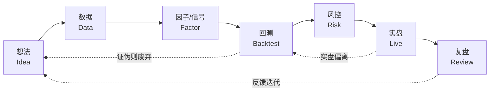
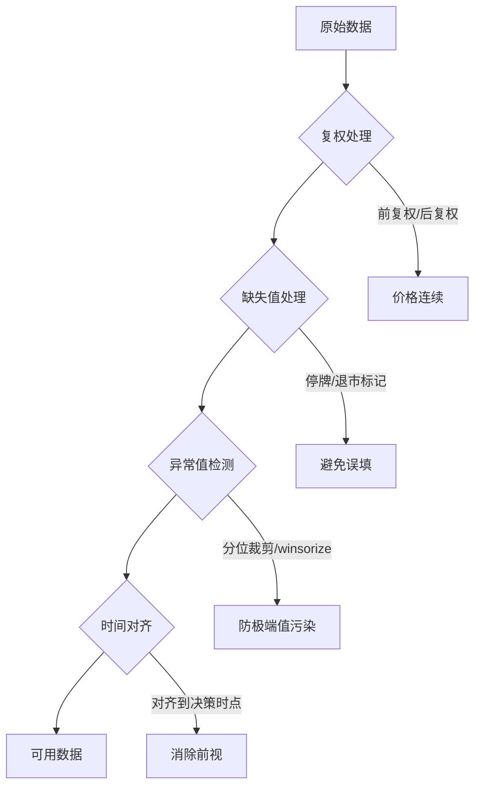

# 量化投资完全指南

> [!note] 完全流程手册
> 这是一份**端到端的工作流手册**：从一个模糊的想法，到能在市场上真金白银运行的策略，中间要走过想法、数据、因子/信号、回测、风控、实盘、复盘七个环节。每一环都有它的关键决策与典型陷阱。本文不堆砌公式，而是带你走通这条闭环——因为量化的成败，往往不在于某个模型多精妙，而在于流程是否严丝合缝。

## 一、什么是量化投资

量化投资是利用数学模型、统计方法和计算机程序来进行投资决策的方法。核心是将投资理念固化为**规则**，用**数据**验证，让**计算机**执行。

与主观交易相比，量化的本质区别不在"用不用计算机"，而在于**决策是否可复现、可检验、可批量执行**。

| 维度 | 主观交易 | 量化交易 |
|------|---------|---------|
| 决策依据 | 经验、盘感、消息 | 数据、模型、规则 |
| 可复现性 | 低（同一行情两次决策可能不同） | 高（规则确定，输入相同则输出相同） |
| 情绪影响 | 大 | 小（规则隔离情绪） |
| 容量上限 | 受精力限制 | 受策略容量与流动性限制 |
| 失败模式 | 冲动、过度自信 | 过拟合、数据错误、执行偏差 |

> [!tip] 一句话定位
> 主观交易拼的是"对市场的理解"；量化交易拼的是"把理解工程化的能力"。两者并不对立——最好的量化研究员，往往先有主观的市场直觉，再用数据去证伪它。

## 二、端到端工作流总览

量化投资不是线性的一次性流水线，而是一个**不断回到起点的闭环**。任何一环出问题，都会沿着链条放大到实盘亏损。



> [!important] 闭环的意义
> 注意图中的两条虚线反馈。**回测证伪 → 回到想法**，意味着大多数想法会死在回测；**实盘偏离 → 回到回测**，意味着实盘表现与回测不符时，第一反应应该是质疑回测，而不是质疑市场。

## 三、环节一：想法（Idea）

### 想法从哪里来

一个可量化的想法，本质是一句可以被数据证伪的**因果或统计假设**。

- **市场异象**：动量效应、规模效应、低波动异象等学术文献
- **行为金融**：投资者的过度反应、处置效应、锚定偏误
- **微观结构**：买卖价差、订单流不平衡、隔夜跳空
- **基本面逻辑**：盈利质量、现金流、估值与价格的偏离

### 关键决策与陷阱

> [!warning] 想法环节的三大陷阱
> 1. **故事先行**：先有一个动听的故事，再去找支持它的数据（确认偏误）。正确顺序是先提出假设，再用数据证伪。
> 2. **不可证伪**："牛市买、熊市卖"——听起来对，但没法落地为规则，等于没有假设。
> 3. **没有经济学解释**：纯粹靠挖数据挖出来的相关性，往往是噪音。能赚钱的因子通常背后有人愿意为承担某种风险付费，或有某种结构性的行为偏差。

> [!tip] 好假设的标准
> 一个好的想法应当能填进这句话："因为【某种经济/行为原因】，所以当【可观测条件】出现时，【某类资产】未来一段时间的【收益/波动】会【上升/下降】。"

## 四、环节二：数据（Data）

数据是量化的地基。**地基歪一寸，楼塌一丈**。

### 数据类型

| 数据类型 | 举例 | 主要用途 | 常见陷阱 |
|---------|------|---------|---------|
| 行情数据 | OHLCV、Tick、盘口 | 价格类信号、回测 | 复权处理、停牌缺失 |
| 基本面数据 | 财报、估值、分红 | 因子投资 | 发布滞后、财报重述 |
| 另类数据 | 舆情、卫星、网购 | 增量信息 | 噪音大、覆盖不全 |
| 宏观数据 | 利率、CPI、PMI | 资产配置、择时 | 发布滞后、修订频繁 |

### 数据清洗的核心动作



> [!warning] 数据环节最致命的陷阱：前视偏差（Look-ahead Bias）
> **用了在决策时点根本拿不到的信息。** 最经典的例子：用财报数据时，按"报告期"对齐而不是按"实际公告日"对齐——你在 3 月用了 12 月 31 日的年报数据，但那份年报可能 4 月才披露。回测因此凭空获得了未来信息，业绩好得不真实。

> [!warning] 第二致命陷阱：幸存者偏差（Survivorship Bias）
> 只用"今天还活着"的股票/基金做回测，自动剔除了退市、破产、清盘的样本。这会系统性地高估收益、低估风险。务必使用包含已退市标的的**Point-in-Time 数据库**。

## 五、环节三：因子与信号（Factor / Signal）

把想法落地成一个**可计算的数值**——这就是因子（连续值）或信号（离散的买/卖/空仓）。

### 因子构建流程

一个原始因子值，几乎从不直接拿来用，而要经过标准化处理：

$$
\text{因子标准化（Z-Score）：}\quad z_i = \frac{x_i - \mu}{\sigma}
$$

其中 $x_i$ 为个股原始因子值，$\mu$ 与 $\sigma$ 为横截面（同一时点全市场）的均值与标准差。

常见处理链：**去极值（Winsorize）→ 中性化（行业/市值）→ 标准化（Z-Score）→ 打分排序**。

> [!example] 一个简化的因子计算示例（数字为示意）
> 假设某股票本期 ROE = 18%，全市场横截面均值 $\mu$ = 10%、标准差 $\sigma$ = 8%。
> 则其质量因子 Z 值 $z = (18\% - 10\%) / 8\% = 1.0$，表示该股盈利能力高于市场均值 1 个标准差。
> 再对全市场 Z 值排序，取前 20% 构建多头组合——这就是最基础的因子选股逻辑。

### 因子有效性的检验

```python
# 因子有效性快速检验：IC 与分层回测（示意代码，需自备数据）
import numpy as np
import pandas as pd

def factor_ic(factor: pd.Series, fwd_return: pd.Series) -> float:
    """计算单期 Rank IC：因子值排名与未来收益排名的相关性"""
    return factor.rank().corr(fwd_return.rank())  # Spearman/Rank IC

def layered_backtest(factor: pd.Series, fwd_return: pd.Series, n_groups: int = 5):
    """分层回测：按因子值分 N 组，看各组未来平均收益是否单调"""
    groups = pd.qcut(factor, n_groups, labels=False, duplicates="drop")
    return fwd_return.groupby(groups).mean()

# 评价标准（经验值，仅供参考）：
# |IC 均值| > 0.03 且 IC_IR = mean(IC)/std(IC) > 0.5，分层收益单调，方可初步认为因子有效
