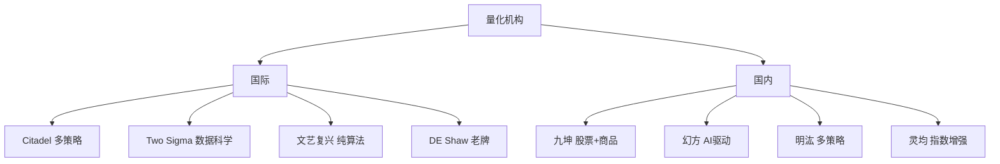

# 量化行业百科

> [!note] 本篇定位
> 一张**术语 + 机构 + 概念**的速查参考卡。读其它笔记遇到不认识的词，回这里查。术语按主题分组，附跳转到深入笔记。

## 一、收益与风险术语

| 术语 | 英文 | 含义 | 深入 |
|---|---|---|---|
| 超额收益 | Alpha | 扣除市场/因子后的真本事 | [[业绩评估与归因]] |
| 市场暴露 | Beta | 对市场的敏感度 | [[业绩评估与归因]] |
| 夏普比率 | Sharpe | 单位总波动的超额收益 | [[夏普比率]] |
| 索提诺比率 | Sortino | 只罚下行波动 | [[业绩评估与归因]] |
| 卡玛比率 | Calmar | 年化收益 / 最大回撤 | [[业绩评估与归因]] |
| 最大回撤 | Max Drawdown | 净值峰谷最大跌幅 | [[风险管理框架]] |
| 风险价值 | VaR / CVaR | 尾部损失分位/期望 | [[evt-var-es]] |
| 波动率 | Volatility | 收益标准差 | [[波动率]] |

## 二、因子与策略术语

| 术语 | 英文 | 含义 | 深入 |
|---|---|---|---|
| 信息系数 | IC | 因子值与未来收益的相关 | [[因子检验与评价]] |
| 信息比率 | IR | 超额收益 / 跟踪误差 | [[业绩评估与归因]] |
| 因子 | Factor | 解释收益的共同特征 | [[什么是因子]] |
| 动量 | Momentum | 强者恒强 | [[因子分类体系]] |
| 均值回归 | Mean Reversion | 偏离终将回归 | [[均值回归策略基础]] |
| 协整 | Cointegration | 价差长期稳定 | [[配对交易协整理论]] |
| 阿尔法衰减 | Alpha Decay | 优势随拥挤消失 | [[Alpha衰减与因子生命周期]] |
| 跟踪误差 | Tracking Error | 相对基准的波动 | [[风险预算与风险归因]] |

## 三、交易与执行术语

| 术语 | 英文 | 含义 | 深入 |
|---|---|---|---|
| 买卖价差 | Bid-Ask Spread | 即时性的报价成本 | [[市场微观结构与交易执行]] |
| 滑点 | Slippage | 决策价与成交价之差 | [[市场微观结构与交易执行]] |
| 市场冲击 | Market Impact | 大单推动价格 | [[市场微观结构与交易执行]] |
| 做市 | Market Making | 双边报价赚价差 | [[高频交易]] |
| 逆向选择 | Adverse Selection | 和有信息者成交吃亏 | [[市场微观结构与交易执行]] |
| 换手率 | Turnover | 交易频繁程度 | [[回测方法论]] |

## 四、量化研究流程术语

| 术语 | 英文 | 含义 |
|---|---|---|
| 回测 | Backtest | 用历史数据验证策略 |
| 样本外 | Out-of-Sample | 不参与调参的验证集 |
| 过拟合 | Overfitting | 拟合了噪声 |
| 未来函数 | Look-ahead Bias | 用了当时不可知的信息 |
| 幸存者偏差 | Survivorship Bias | 只统计活下来的样本 |
| 走向前分析 | Walk-forward | 滚动地"过去调参、未来验证" |

回测陷阱见 [[回测方法论]]。

## 五、主要机构（举例，定性）

| 机构 | 标签 |
|---|---|
| Citadel | 多策略量化巨头 |
| Two Sigma | 数据科学/机器学习驱动 |
| 文艺复兴科技 | 纯算法、模型保密 |
| DE Shaw | 老牌量化 |
| 九坤投资 | 股票和商品量化 |
| 幻方量化 | AI 驱动策略 |
| 明汯投资 | 多策略布局 |
| 灵均投资 | 指数增强 |

> [!note] 机构标签仅为定位
> 上述为公开印象式标签，非精确业务描述；行业格局的更多讨论见 [[量化交易行业报告2025]]。

## 六、常见缩写速查

| 缩写 | 全称 | 含义 |
|---|---|---|
| MDD | Max Drawdown | 最大回撤 |
| IC/IR | Information Coefficient/Ratio | 信息系数/比率 |
| TCA | Transaction Cost Analysis | 交易成本分析 |
| VRP | Volatility Risk Premium | 波动率风险溢价 |
| CTA | Commodity Trading Advisor | 管理期货/趋势策略 |
| HFT | High-Frequency Trading | 高频交易 |

## 相关链接

- [[量化交易行业报告2025]]
- [[量化策略案例分析]]
- [[量化交易全景图]]
- [[量化投资完全指南]]
- [[目录|量化策略总览]]

## 课程化学习补充

> [!important] 学习定位
> 量化策略是投资假设、数据工程、回测验证、风险预算和执行系统的组合，不是单一公式。本文仅用于学习、研究与复盘，不构成任何投资建议。

### 必须掌握的问题

- 假设是否可证伪
- 数据是否 point-in-time
- 绩效是否扣除真实成本
- 上线后是否监控衰减

### 实战应用流程

1. 先写清楚你的投资假设：为什么这个信号、资产或方法应该产生收益。
2. 明确数据口径：样本范围、更新时间、复权/分红/停牌处理和交易日历。
3. 做最小可行验证：先用简单规则验证方向，再逐步加入复杂模型。
4. 把成本和约束前置：手续费、滑点、冲击成本、保证金、流动性和容量都要进入测算。
5. 上线后持续复盘：记录信号、下单、成交、持仓、回撤和失效原因。

### 风险与失效条件

- 数据挖掘偏差
- 因子拥挤
- 换手过高
- 实盘偏离回测

### 复盘问题

- 这笔交易或这套模型赚的是什么钱：风险补偿、行为偏差、流动性溢价，还是偶然噪音？
- 如果市场环境反过来，最大亏损和最长恢复期会是多少？
- 当前结论是否依赖某个不可持续假设，例如低利率、低波动、充裕流动性或监管套利？
- 有没有一个更简单的基准策略能取得接近效果？

### 延伸学习

- [[量化投资完全指南]]
- [[回测质量门清单]]
- [[市场微观结构与交易执行]]
- [[量化风险管理体系]]

## 跨领域进阶扩展

> [!tip] 交易者视角
> 学到 `量化行业百科` 时，不要只把它当成孤立知识点。把策略视为假设、数据、验证、组合和执行的整体工程。优秀投资交易者会把它放入“宏观背景 - 资产选择 - 估值/信号 - 组合风险 - 交易执行 - 复盘反馈”的闭环。

### 与其他知识的连接

- 收益来源和经济解释
- 数据清洗和偏差控制
- 回测、组合和风控
- 实盘衰减与策略迭代

### 进阶训练

1. 把策略假设写成可证伪命题
2. 建立基准策略比较
3. 把换手、容量和成本纳入绩效评价

### 能力验收

- 能否说清楚这个主题影响的是收益来源、风险来源、交易成本、流动性还是心理纪律？
- 能否指出它在什么市场环境、资产类别或交易周期中更有效？
- 能否把它写成一条可复盘的研究或交易规则？
- 能否说明如果判断错误，组合最大损失和退出机制是什么？

### 全局关联

- [[综合金融知识体系/金融投资全知识地图|金融投资全知识地图]]
- [[综合金融知识体系/优秀投资交易者能力地图|优秀投资交易者能力地图]]
- [[综合金融知识体系/一次性学习路线与复盘模板|一次性学习路线与复盘模板]]
