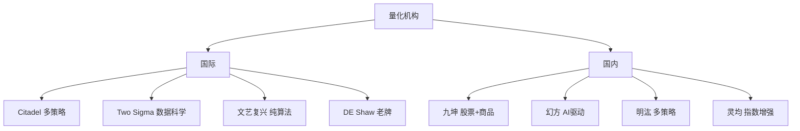

# 量化行业百科

> [!note] 本篇定位
> 一张**术语 + 机构 + 概念**的速查参考卡。读其它笔记遇到不认识的词，回这里查。术语按主题分组，附跳转到深入笔记。

## 一、收益与风险术语

| 术语 | 英文 | 含义 | 深入 |
|---|---|---|---|
| 超额收益 | Alpha | 扣除市场/因子后的真本事 | [[业绩评估与归因]] |
| 市场暴露 | Beta | 对市场的敏感度 | [[业绩评估与归因]] |
| 夏普比率 | Sharpe | 单位总波动的超额收益 | [[夏普比率]] |
| 索提诺比率 | Sortino | 只罚下行波动 | [[业绩评估与归因]] |
| 卡玛比率 | Calmar | 年化收益 / 最大回撤 | [[业绩评估与归因]] |
| 最大回撤 | Max Drawdown | 净值峰谷最大跌幅 | [[风险管理框架]] |
| 风险价值 | VaR / CVaR | 尾部损失分位/期望 | [[evt-var-es]] |
| 波动率 | Volatility | 收益标准差 | [[波动率]] |

## 二、因子与策略术语

| 术语 | 英文 | 含义 | 深入 |
|---|---|---|---|
| 信息系数 | IC | 因子值与未来收益的相关 | [[因子检验与评价]] |
| 信息比率 | IR | 超额收益 / 跟踪误差 | [[业绩评估与归因]] |
| 因子 | Factor | 解释收益的共同特征 | [[什么是因子]] |
| 动量 | Momentum | 强者恒强 | [[因子分类体系]] |
| 均值回归 | Mean Reversion | 偏离终将回归 | [[均值回归策略基础]] |
| 协整 | Cointegration | 价差长期稳定 | [[配对交易协整理论]] |
| 阿尔法衰减 | Alpha Decay | 优势随拥挤消失 | [[Alpha衰减与因子生命周期]] |
| 跟踪误差 | Tracking Error | 相对基准的波动 | [[风险预算与风险归因]] |

## 三、交易与执行术语

| 术语 | 英文 | 含义 | 深入 |
|---|---|---|---|
| 买卖价差 | Bid-Ask Spread | 即时性的报价成本 | [[市场微观结构与交易执行]] |
| 滑点 | Slippage | 决策价与成交价之差 | [[市场微观结构与交易执行]] |
| 市场冲击 | Market Impact | 大单推动价格 | [[市场微观结构与交易执行]] |
| 做市 | Market Making | 双边报价赚价差 | [[高频交易]] |
| 逆向选择 | Adverse Selection | 和有信息者成交吃亏 | [[市场微观结构与交易执行]] |
| 换手率 | Turnover | 交易频繁程度 | [[回测方法论]] |

## 四、量化研究流程术语

| 术语 | 英文 | 含义 |
|---|---|---|
| 回测 | Backtest | 用历史数据验证策略 |
| 样本外 | Out-of-Sample | 不参与调参的验证集 |
| 过拟合 | Overfitting | 拟合了噪声 |
| 未来函数 | Look-ahead Bias | 用了当时不可知的信息 |
| 幸存者偏差 | Survivorship Bias | 只统计活下来的样本 |
| 走向前分析 | Walk-forward | 滚动地"过去调参、未来验证" |

回测陷阱见 [[回测方法论]]。

## 五、主要机构（举例，定性）

| 机构 | 标签 |
|---|---|
| Citadel | 多策略量化巨头 |
| Two Sigma | 数据科学/机器学习驱动 |
| 文艺复兴科技 | 纯算法、模型保密 |
| DE Shaw | 老牌量化 |
| 九坤投资 | 股票和商品量化 |
| 幻方量化 | AI 驱动策略 |
| 明汯投资 | 多策略布局 |
| 灵均投资 | 指数增强 |

> [!note] 机构标签仅为定位
> 上述为公开印象式标签，非精确业务描述；行业格局的更多讨论见 [[量化交易行业报告2025]]。

## 六、常见缩写速查

| 缩写 | 全称 | 含义 |
|---|---|---|
| MDD | Max Drawdown | 最大回撤 |
| IC/IR | Information Coefficient/Ratio | 信息系数/比率 |
| TCA | Transaction Cost Analysis | 交易成本分析 |
| VRP | Volatility Risk Premium | 波动率风险溢价 |
| CTA | Commodity Trading Advisor | 管理期货/趋势策略 |
| HFT | High-Frequency Trading | 高频交易 |

## 相关链接

- [[量化交易行业报告2025]]
- [[量化策略案例分析]]
- [[量化交易全景图]]
- [[量化投资完全指南]]
- [[目录|量化策略总览]]

## 实战掌握清单

> [!tip] 交易者视角
> 量化行业百科 的学习重点不是记住术语，而是把它放进研究、组合、执行和复盘的闭环。量化策略必须从清晰假设出发，经过数据验证、成本测算、风险控制和实盘监控，才可能成为可持续系统。

### 关键判断

- 写清楚收益来自动量、反转、价值、套利、波动率、流动性还是行为偏差。
- 确认信号、过滤器、入场、退出、仓位和风控。
- 看收益是否集中在少数时期、少数品种或少数参数。

### 落地动作

1. 做样本外、滚动窗口和参数扰动测试。
2. 把手续费、滑点、冲击成本、容量和失败交易纳入报告。
3. 上线后监控成交质量、信号衰减、回撤和异常订单。

### 失效边界

- 过拟合。
- 策略容量不足。
- 市场结构变化后没有停止机制。

### 复盘问题

- 这项知识改变了哪一个具体决策：标的、方向、仓位、退出、对冲还是不交易？
- 如果判断相反，最大亏损、最长恢复期和退出触发条件是什么？
- 有没有一个更简单的基准方法可以取得相近结果？
