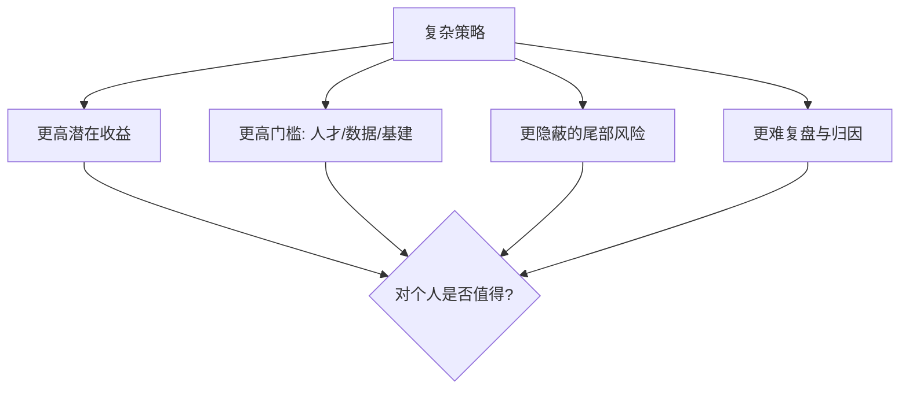

# 高收益复杂策略解析

> [!warning] 先泼一盆冷水
> "年化 50%、持续几十年"这类说法，绝大多数经不起推敲。能长期做到高收益的机构极少，且依赖**顶尖人才、海量数据、低延迟基建、严格风控**等普通人难以复制的条件。我们看到的"长青传奇"还叠加了幸存者偏差——失败的同类早已消失。**这篇拆解复杂策略的逻辑，不是教你一夜暴富，而是让你看懂它们赚什么钱、承担什么风险、门槛在哪。**

## 一、波动率交易：交易"波动"本身

### 为什么波动率是独立资产

大多数人交易"方向"（涨/跌），波动率交易不关心方向，只交易**价格运动的剧烈程度**。它的核心标的是隐含波动率（IV）与已实现波动率（RV）之差。期权的希腊字母与定价见 [[期权策略]] 与 [[波动率]]。

### 波动率风险溢价（VRP）

长期看，期权隐含波动率往往系统性地略高于事后实现的波动率——因为买保险的人愿意付溢价。卖波动率的人赚这个差价，代价是**承担尾部风险**（平时小赚、偶尔巨亏）。

| 市场 | IV 通常水平 | RV 通常水平 | VRP（IV−RV） |
|---|---|---|---|
| 宽基股指 | 较高 | 略低 | 长期多为正（示意） |
| 高波动资产 | 很高 | 高 | 波动更剧烈（示意） |

> [!important] 表中为定性示意，非精确统计
> VRP 的真实数值随市场、时段、口径差异很大，且会在危机中剧烈反转（IV 暴涨、卖方巨亏）。**不要把任何一个"历史平均 VRP"当成可稳定提取的收益。**

### Gamma Scalping（伽马剥头皮）

卖出高 IV 期权并做 Delta 中性对冲，赚"隐含 > 已实现"的差：

```
单期对冲损益 ≈ ½ · Γ · (ΔS)²  −  期权时间价值损耗(Θ)
长期期望    ≈ ½ · Γ · S² · (σ_实现² − σ_隐含²) · Δt
```

- 若实际波动 < 隐含波动 → 卖方净赚；
- 若实际波动 > 隐含波动（黑天鹅）→ 卖方巨亏。

> [!warning] 卖波动率 = 捡钢镚 vs 压路机
> 这类策略收益曲线平时平滑上行，像"稳定盈利"，但一次极端行情可能抹掉数年利润。务必配合尾部保护与仓位上限，见 [[对冲与尾部保护]]、[[资金管理与杠杆]]、[[evt-var-es]]。

## 二、其他复杂策略一览

| 策略 | 赚什么 | 主要风险 | 门槛 |
|---|---|---|---|
| 统计套利 | 价差均值回归 | 关系破裂、拥挤踩踏 | 中（建模+成本控制） |
| 另类数据 | 信息领先优势 | alpha 衰减、合规红线 | 高（数据采购+处理） |
| 高频做市 | 买卖价差 | 逆向选择、库存风险 | 极高（低延迟基建） |
| 机器学习 | 非线性信号 | 过拟合、数据泄露 | 高（工程+纪律） |

统计套利见 [[统计套利深度解析]]；执行与做市见 [[市场微观结构与交易执行]]。

## 三、复杂 ≠ 更好



> [!tip] 给个人投资者的现实建议
> 与其追逐看不懂的"年化 50%"，不如把简单策略（趋势、低估值、再平衡）做对、做稳、做久。复杂度应当来自你**真正理解且能管理的风险**，而不是为了显得高级。

## 常见误区

| 误区 | 更好的理解 |
|---|---|
| 复杂策略=高收益 | 复杂只意味着更高门槛和更隐蔽的风险 |
| 卖波动率是稳定收益 | 平时小赚，尾部一次可能巨亏 |
| 看到长青传奇就想复制 | 幸存者偏差，失败者你看不到 |
| "年化 50%+"可持续 | 极少数+不可复制+常含杠杆与尾部风险 |
| 高频/做市散户也能做 | 受限于延迟与基建，个人基本无门槛 |

## 相关链接

- [[五大经典量化策略]]
- [[量化交易全景图]]
- [[量化投资完全指南]]
- [[波动率]]
- [[期权策略]]
- [[对冲与尾部保护]]
- [[目录|量化策略总览]]

## 实战掌握清单

> [!tip] 交易者视角
> 高收益复杂策略解析 的学习重点不是记住术语，而是把它放进研究、组合、执行和复盘的闭环。量化策略必须从清晰假设出发，经过数据验证、成本测算、风险控制和实盘监控，才可能成为可持续系统。

### 关键判断

- 写清楚收益来自动量、反转、价值、套利、波动率、流动性还是行为偏差。
- 确认信号、过滤器、入场、退出、仓位和风控。
- 看收益是否集中在少数时期、少数品种或少数参数。

### 落地动作

1. 做样本外、滚动窗口和参数扰动测试。
2. 把手续费、滑点、冲击成本、容量和失败交易纳入报告。
3. 上线后监控成交质量、信号衰减、回撤和异常订单。

### 失效边界

- 过拟合。
- 策略容量不足。
- 市场结构变化后没有停止机制。

### 复盘问题

- 这项知识改变了哪一个具体决策：标的、方向、仓位、退出、对冲还是不交易？
- 如果判断相反，最大亏损、最长恢复期和退出触发条件是什么？
- 有没有一个更简单的基准方法可以取得相近结果？
