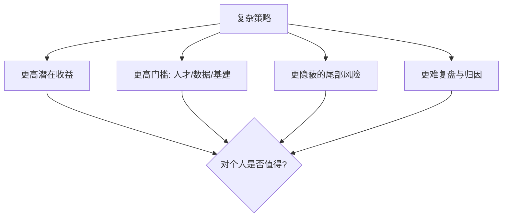

# 高收益复杂策略解析

> [!warning] 先泼一盆冷水
> "年化 50%、持续几十年"这类说法，绝大多数经不起推敲。能长期做到高收益的机构极少，且依赖**顶尖人才、海量数据、低延迟基建、严格风控**等普通人难以复制的条件。我们看到的"长青传奇"还叠加了幸存者偏差——失败的同类早已消失。**这篇拆解复杂策略的逻辑，不是教你一夜暴富，而是让你看懂它们赚什么钱、承担什么风险、门槛在哪。**

## 一、波动率交易：交易"波动"本身

### 为什么波动率是独立资产

大多数人交易"方向"（涨/跌），波动率交易不关心方向，只交易**价格运动的剧烈程度**。它的核心标的是隐含波动率（IV）与已实现波动率（RV）之差。期权的希腊字母与定价见 [[期权策略]] 与 [[波动率]]。

### 波动率风险溢价（VRP）

长期看，期权隐含波动率往往系统性地略高于事后实现的波动率——因为买保险的人愿意付溢价。卖波动率的人赚这个差价，代价是**承担尾部风险**（平时小赚、偶尔巨亏）。

| 市场 | IV 通常水平 | RV 通常水平 | VRP（IV−RV） |
|---|---|---|---|
| 宽基股指 | 较高 | 略低 | 长期多为正（示意） |
| 高波动资产 | 很高 | 高 | 波动更剧烈（示意） |

> [!important] 表中为定性示意，非精确统计
> VRP 的真实数值随市场、时段、口径差异很大，且会在危机中剧烈反转（IV 暴涨、卖方巨亏）。**不要把任何一个"历史平均 VRP"当成可稳定提取的收益。**

### Gamma Scalping（伽马剥头皮）

卖出高 IV 期权并做 Delta 中性对冲，赚"隐含 > 已实现"的差：

```
单期对冲损益 ≈ ½ · Γ · (ΔS)²  −  期权时间价值损耗(Θ)
长期期望    ≈ ½ · Γ · S² · (σ_实现² − σ_隐含²) · Δt
```

- 若实际波动 < 隐含波动 → 卖方净赚；
- 若实际波动 > 隐含波动（黑天鹅）→ 卖方巨亏。

> [!warning] 卖波动率 = 捡钢镚 vs 压路机
> 这类策略收益曲线平时平滑上行，像"稳定盈利"，但一次极端行情可能抹掉数年利润。务必配合尾部保护与仓位上限，见 [[对冲与尾部保护]]、[[资金管理与杠杆]]、[[evt-var-es]]。

## 二、其他复杂策略一览

| 策略 | 赚什么 | 主要风险 | 门槛 |
|---|---|---|---|
| 统计套利 | 价差均值回归 | 关系破裂、拥挤踩踏 | 中（建模+成本控制） |
| 另类数据 | 信息领先优势 | alpha 衰减、合规红线 | 高（数据采购+处理） |
| 高频做市 | 买卖价差 | 逆向选择、库存风险 | 极高（低延迟基建） |
| 机器学习 | 非线性信号 | 过拟合、数据泄露 | 高（工程+纪律） |

统计套利见 [[统计套利深度解析]]；执行与做市见 [[市场微观结构与交易执行]]。

## 三、复杂 ≠ 更好



> [!tip] 给个人投资者的现实建议
> 与其追逐看不懂的"年化 50%"，不如把简单策略（趋势、低估值、再平衡）做对、做稳、做久。复杂度应当来自你**真正理解且能管理的风险**，而不是为了显得高级。

## 常见误区

| 误区 | 更好的理解 |
|---|---|
| 复杂策略=高收益 | 复杂只意味着更高门槛和更隐蔽的风险 |
| 卖波动率是稳定收益 | 平时小赚，尾部一次可能巨亏 |
| 看到长青传奇就想复制 | 幸存者偏差，失败者你看不到 |
| "年化 50%+"可持续 | 极少数+不可复制+常含杠杆与尾部风险 |
| 高频/做市散户也能做 | 受限于延迟与基建，个人基本无门槛 |

## 相关链接

- [[五大经典量化策略]]
- [[量化交易全景图]]
- [[量化投资完全指南]]
- [[波动率]]
- [[期权策略]]
- [[对冲与尾部保护]]
- [[目录|量化策略总览]]

## 课程化学习补充

> [!important] 学习定位
> 量化策略是投资假设、数据工程、回测验证、风险预算和执行系统的组合，不是单一公式。本文仅用于学习、研究与复盘，不构成任何投资建议。

### 必须掌握的问题

- 假设是否可证伪
- 数据是否 point-in-time
- 绩效是否扣除真实成本
- 上线后是否监控衰减

### 实战应用流程

1. 先写清楚你的投资假设：为什么这个信号、资产或方法应该产生收益。
2. 明确数据口径：样本范围、更新时间、复权/分红/停牌处理和交易日历。
3. 做最小可行验证：先用简单规则验证方向，再逐步加入复杂模型。
4. 把成本和约束前置：手续费、滑点、冲击成本、保证金、流动性和容量都要进入测算。
5. 上线后持续复盘：记录信号、下单、成交、持仓、回撤和失效原因。

### 风险与失效条件

- 数据挖掘偏差
- 因子拥挤
- 换手过高
- 实盘偏离回测

### 复盘问题

- 这笔交易或这套模型赚的是什么钱：风险补偿、行为偏差、流动性溢价，还是偶然噪音？
- 如果市场环境反过来，最大亏损和最长恢复期会是多少？
- 当前结论是否依赖某个不可持续假设，例如低利率、低波动、充裕流动性或监管套利？
- 有没有一个更简单的基准策略能取得接近效果？

### 延伸学习

- [[量化投资完全指南]]
- [[回测质量门清单]]
- [[市场微观结构与交易执行]]
- [[量化风险管理体系]]

## 跨领域进阶扩展

> [!tip] 交易者视角
> 学到 `高收益复杂策略解析` 时，不要只把它当成孤立知识点。把策略视为假设、数据、验证、组合和执行的整体工程。优秀投资交易者会把它放入“宏观背景 - 资产选择 - 估值/信号 - 组合风险 - 交易执行 - 复盘反馈”的闭环。

### 与其他知识的连接

- 收益来源和经济解释
- 数据清洗和偏差控制
- 回测、组合和风控
- 实盘衰减与策略迭代

### 进阶训练

1. 把策略假设写成可证伪命题
2. 建立基准策略比较
3. 把换手、容量和成本纳入绩效评价

### 能力验收

- 能否说清楚这个主题影响的是收益来源、风险来源、交易成本、流动性还是心理纪律？
- 能否指出它在什么市场环境、资产类别或交易周期中更有效？
- 能否把它写成一条可复盘的研究或交易规则？
- 能否说明如果判断错误，组合最大损失和退出机制是什么？

### 全局关联

- [[综合金融知识体系/金融投资全知识地图|金融投资全知识地图]]
- [[综合金融知识体系/优秀投资交易者能力地图|优秀投资交易者能力地图]]
- [[综合金融知识体系/一次性学习路线与复盘模板|一次性学习路线与复盘模板]]
