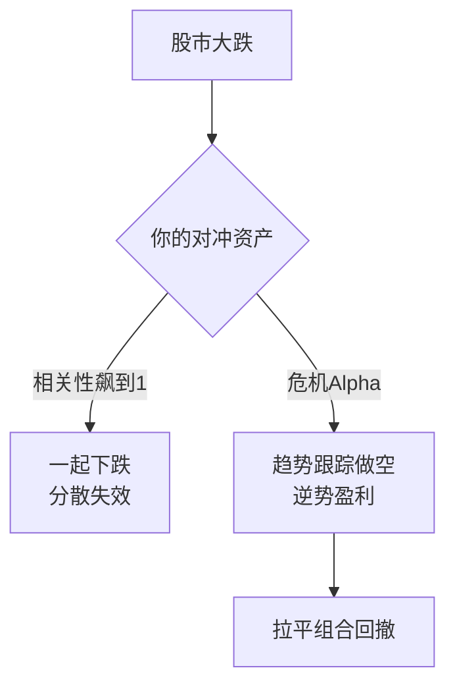
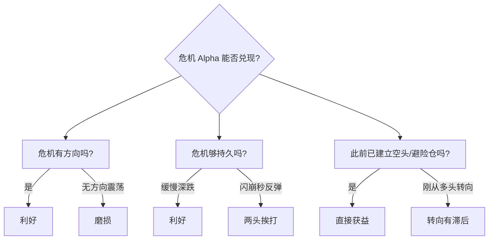

# CTA危机Alpha详解

> [!note] 危机Alpha
> "危机 Alpha"（Crisis Alpha）指一类策略**在股票市场大跌期间往往能产生正收益**的能力。CTA / 趋势跟踪是危机 Alpha 最经典的代表——但这是有**前提条件**的，并非任何下跌都灵，更不是免费的午餐。

## 一、什么是危机 Alpha

资产配置最痛的事，是"该分散的时候不分散"：平时低相关的资产，在危机中相关性一起冲向 1，集体下跌。危机 Alpha 描述的恰恰是反例——**在危机中不仅不一起跌，反而能逆势盈利**。

> [!important] 危机 Alpha ≠ 永久对冲
> 它不是"买了就保险"。它是一种**条件性、滞后性**的保护：需要危机"有方向、够持久"，让趋势策略有时间转向并骑住跌势。理解条件，比记住结论更重要。

## 二、CTA 为什么能在危机中盈利

| 机制 | 说明 |
|---|---|
| **多空双向** | 期货可直接做空，下跌趋势中做空获利，不像纯多头只能挨打 |
| **趋势跟踪本性** | 危机往往是"大趋势"：股指下行、避险资产（国债、黄金）上行，CTA 顺势两头赚 |
| **跨资产分散** | 同时在股指、债券、商品、外汇布局，危机中各市场的方向都能被捕捉 |
| **波动率放大机会** | 危机=高波动，趋势的"信噪比"短期内反而提升 |
| **强制去杠杆助推** | 全市场被迫平仓会**强化既有方向**，让趋势更陡，利好跟随者 |

> [!tip] 一句话直觉
> 股票多头是"做多平静"，趋势 CTA 是"做多动荡"。危机正是动荡最浓的时刻，于是两者天然互补——这就是为什么把少量 CTA 加进股债组合，能在最痛的时候发挥作用。

## 三、危机 Alpha 的"凸性"本质

趋势跟踪的收益曲线相对于股市，呈现出类似**做多看跌期权**的形状：股市小涨小跌时它略亏（保险费），股市深跌时它显著盈利（赔付）。

$$
R_{CTA} \approx \alpha - c \cdot |R_{equity}^{small}| + g \cdot \max(-R_{equity}^{big},\ 0)
$$

其中 $c$ 是平静期的"磨损/保费"，$g$ 是大跌时的"凸性赔付"。

| 股市情形 | 趋势 CTA 大致表现 | 类比 |
|---|---|---|
| 慢牛、低波动 | 小幅磨损或微利 | 交保费 |
| 区间震荡 | 持续磨损（最难熬） | 保费打水漂 |
| 持续大跌 | 显著正收益 | 保险赔付 |
| 闪崩后V型反弹 | 可能两头挨打 | 来不及理赔 |

> [!note] 为什么说它是"被偿付的保险"
> 普通尾部对冲（如长期买看跌期权）长期持有会持续流血。趋势 CTA 的不同在于：**平时也可能小赚**（多资产趋势分散），危机时凸性赔付，长期期望未必为负。这正是它优于"纯买保险"的地方。延伸 [[对冲与尾部保护]]。

## 四、历史经验（定性，非精确统计）

> [!warning] 关于下表
> 以下为**方向性、定性**描述，用于理解规律，不代表任何具体产品的精确收益。

| 危机事件 | 股票市场 | 趋势 CTA 的典型表现 | 关键原因 |
|---|---|---|---|
| 2008 全球金融危机 | 持续深跌 | 多数趋势基金录得正收益 | 跌势漫长、多资产同向趋势明显 |
| 2015 A 股剧烈调整 | 急跌 | 做空股指方向上可获益 | 国内股指期货提供做空工具 |
| 2020 新冠冲击 | 暴跌后快速反弹 | 表现分化、整体偏弱 | V 型太快，趋势"转身不及" |
| 2022 全球高通胀/加息 | 股债双杀 | 商品多头+债券空头表现突出 | 大宗与利率出现强趋势 |

> [!example] 两个对照案例的启示
> - **2008 vs 2020**：同样是危机，2008 跌势"够长够有方向"，CTA 大放异彩；2020 闪崩+秒反弹，趋势模型刚做空就被反向打回，说明**速度与持续性**决定危机 Alpha 是否兑现。
> - **2022**：危机 Alpha 不一定来自做空股票，也可能来自**做多商品、做空债券**——这正体现了跨资产趋势分散的价值。

## 五、危机 Alpha 的条件与局限

> [!warning] 三大局限
> 1. **滞后性**：趋势策略要"等趋势确认"，闪崩（如 2020 年 3 月、各类单日流动性危机）常让它来不及转向，甚至先吃一记反向耳光。
> 2. **震荡市磨损**：危机之外的漫长平静/锯齿行情，CTA 持续小亏。**保护的代价就是平时的磨损**。
> 3. **不保证、会失灵**：危机 Alpha 是统计规律不是物理定律。无趋势的危机、政策急转、流动性瞬间枯竭，都可能让它失效。

## 六、在资产配置中的用法

> [!tip] 参考配置比例（示例，非投资建议）
> - 保守型：5%–10%
> - 平衡型：10%–20%
> - 激进型：20%–30%
>
> 关键不在比例数字，而在于它的**低相关性**：即便单独看 CTA 收益平平，加入股债组合后，往往能改善组合的回撤与夏普。

加入少量低相关资产对组合的影响，可由组合波动公式理解：

$$
\sigma_p = \sqrt{w_E^2\sigma_E^2 + w_C^2\sigma_C^2 + 2w_E w_C \rho_{E,C}\,\sigma_E\sigma_C}
$$

当危机中 $\rho_{E,C}$ 变为**负值**时，交叉项变负，组合波动被显著压低——这正是危机 Alpha 在配置层面的价值所在。详见 [[相关性与协方差估计]]、[[风险管理框架]]。

> [!note] 正确的期待
> 把 CTA 当成组合的"安全气囊"，而非"发动机"。平时它可能不显眼甚至拖后腿；真正的价值在你最需要的那几次大跌里兑现。能不能拿得住平静期的磨损，决定了你能不能享受到危机里的赔付。

## 七、常见误区

| 常见误区 | 正确理解 |
|---|---|
| "CTA 是股灾稳赚的对冲" | 是条件性保护，闪崩/无方向危机可能失灵 |
| "买了就能随时对冲" | 趋势确认有滞后，保护往往"迟到" |
| "平时也该跑赢股票" | 它的使命是低相关+危机赔付，不是平时领跑 |
| "回撤说明策略坏了" | 平静/震荡期磨损是保费，是机制的一部分 |
| "危机 Alpha=做空股票" | 也可能来自做多商品、做多国债等避险方向 |
| "配得越多越安全" | 过度配置会让组合在长牛中明显跑输，得不偿失 |

## 八、一页纸总结

> [!important] 记住三句话
> 1. **机制**：多空双向 + 趋势跟踪 + 跨资产分散，让 CTA 在持续大跌中顺势盈利。
> 2. **本质**：像一份"被偿付的保险"——平时交保费（磨损），危机收赔付（凸性收益）。
> 3. **边界**：需要危机有方向、够持久；闪崩与震荡会让它失灵。它是安全气囊，不是发动机。

## 相关链接

- [[CTA策略详解]]
- [[CTA策略Python实战]]
- [[CTA量化论文集]]
- [[HighFlyer量化策略]]
- [[对冲与尾部保护]]
- [[风险管理框架]]
- [[相关性与协方差估计]]
- [[目录|量化策略总览]]

## 实战掌握清单

> [!tip] 交易者视角
> CTA危机Alpha详解 的学习重点不是记住术语，而是把它放进研究、组合、执行和复盘的闭环。量化策略必须从清晰假设出发，经过数据验证、成本测算、风险控制和实盘监控，才可能成为可持续系统。

### 关键判断

- 写清楚收益来自动量、反转、价值、套利、波动率、流动性还是行为偏差。
- 确认信号、过滤器、入场、退出、仓位和风控。
- 看收益是否集中在少数时期、少数品种或少数参数。

### 落地动作

1. 做样本外、滚动窗口和参数扰动测试。
2. 把手续费、滑点、冲击成本、容量和失败交易纳入报告。
3. 上线后监控成交质量、信号衰减、回撤和异常订单。

### 失效边界

- 过拟合。
- 策略容量不足。
- 市场结构变化后没有停止机制。

### 复盘问题

- 这项知识改变了哪一个具体决策：标的、方向、仓位、退出、对冲还是不交易？
- 如果判断相反，最大亏损、最长恢复期和退出触发条件是什么？
- 有没有一个更简单的基准方法可以取得相近结果？
