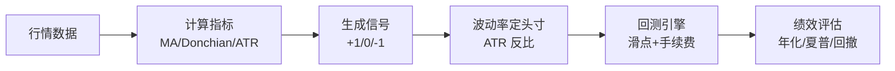

# CTA策略Python实战

> [!note] Python实现
> 本文用尽量"可运行"的骨架，带你走完一个趋势跟踪 CTA 的完整闭环：**数据 → 信号（双均线/唐奇安突破）→ 基于 ATR 的头寸管理 → 含滑点与手续费的回测 → 绩效评估**。代码以教学清晰为先，去掉了工程化细节，请勿直接用于实盘。

## 一、整体流程



> [!important] 三条铁律（先记住，再写代码）
> 1. **信号必须滞后一根**：今天收盘算出的信号，最早明天才能成交。代码里体现为 `signal.shift(1)`，否则就是"偷看未来"。
> 2. **成本不可省略**：期货有手续费+滑点+冲击成本，换手越高越致命。
> 3. **头寸由波动率决定**，而非固定手数——这是专业与业余的分水岭。

## 二、数据获取

```python
import numpy as np
import pandas as pd

# 方式一：tushare 期货日线（需 token）
# import tushare as ts
# pro = ts.pro_api()
# df = pro.fut_daily(ts_code='CU.SHF', start_date='20180101')
# df = df.sort_values('trade_date').reset_index(drop=True)

# 方式二：本地 CSV（教学用），要求列：date, open, high, low, close
df = pd.read_csv('CU_main.csv', parse_dates=['date']).sort_values('date')
df = df.set_index('date')
df = df`'open', 'high', 'low', 'close'`.dropna()
```

> [!warning] 连续合约的坑
> 单个合约会到期。回测要用**主力连续合约**，且换月时务必做**价格拼接（后复权/价差调整）**，否则移仓跳空会被误判成"趋势"，制造虚假收益。

## 三、信号一：双均线（趋势跟踪入门）

```python
def signal_dual_ma(df, short=20, long=60):
    """金叉做多(+1)，死叉做空(-1)。"""
    s = df['close'].rolling(short).mean()
    l = df['close'].rolling(long).mean()
    sig = pd.Series(0, index=df.index)
    sig[s > l] = 1
    sig[s < l] = -1
    return sig
```

> [!tip] 双均线的优缺点
> 优点：简单、稳健、抗噪。缺点：**震荡市来回打脸**（频繁金叉死叉）。可加"均线间距阈值"或与突破策略叠加来过滤。

## 四、信号二：唐奇安通道突破（经典趋势策略）

唐奇安（Donchian）突破是海龟交易法的核心：突破 $N$ 日最高价做多，跌破 $N$ 日最低价做空。

```python
def signal_donchian(df, entry=20, exit_win=10):
    """突破入场 + 较短通道反向出场（持仓状态机）。"""
    up = df['high'].rolling(entry).max().shift(1)     # 用昨日及之前，避免未来函数
    dn = df['low'].rolling(entry).min().shift(1)
    exit_up = df['high'].rolling(exit_win).max().shift(1)
    exit_dn = df['low'].rolling(exit_win).min().shift(1)

    pos = np.zeros(len(df))
    state = 0
    close = df['close'].values
    for i in range(len(df)):
        if state == 0:
            if close[i] > up.iloc[i]:   state = 1
            elif close[i] < dn.iloc[i]: state = -1
        elif state == 1 and close[i] < exit_dn.iloc[i]:
            state = 0
        elif state == -1 and close[i] > exit_up.iloc[i]:
            state = 0
        pos[i] = state
    return pd.Series(pos, index=df.index)
```

> [!note] 入场通道 > 出场通道
> 用较长通道（如 20 日）入场、较短通道（如 10 日）出场，能"晚进早出"地锁住趋势利润，同时减少震荡市反复进出。

## 五、头寸管理：ATR 波动率定仓

核心思想：**让每笔交易冒的钱大致相等**，而不是每次都买固定手数。波动大的品种少买，波动小的多买。

先算真实波幅 ATR：

$$
TR_t = \max\big(H_t-L_t,\ |H_t-C_{t-1}|,\ |L_t-C_{t-1}|\big),\qquad ATR_t = \frac{1}{n}\sum_{i=0}^{n-1} TR_{t-i}
$$

再用"单笔风险预算 / 每手风险"反推手数：

$$
\text{手数} = \frac{\text{账户权益}\times \text{风险比例 } r}{ATR \times k \times \text{合约乘数}}
$$

```python
def atr(df, n=20):
    h, l, c = df['high'], df['low'], df['close']
    tr = pd.concat([h - l, (h - c.shift()).abs(), (l - c.shift()).abs()], axis=1).max(axis=1)
    return tr.rolling(n).mean()

def position_size(equity, atr_value, multiplier, risk=0.005, k=2.0):
    """单笔最多亏损 equity*risk；k 个 ATR 作为止损距离。返回手数(可为小数,教学用)。"""
    risk_per_lot = atr_value * k * multiplier
    if risk_per_lot <= 0:
        return 0.0
    return (equity * risk) / risk_per_lot
```

> [!tip] 波动率目标（Vol Targeting）
> 组合层面常把整体年化波动锚定到某个目标（如 15%）：当近期波动升高时**自动降杠杆**，反之加杠杆。这能显著平滑净值曲线，是机构 CTA 的标配。延伸阅读 [[波动率]]、[[资金管理与杠杆]]。

## 六、回测引擎（含滑点与手续费）

```python
def backtest(df, signal, cost_rate=2e-4, slippage=1e-4):
    """
    signal: 目标仓位序列(+1/0/-1)，按收盘价计算、次日生效。
    cost_rate: 单边手续费率；slippage: 单边滑点率。
    返回含净值的 DataFrame。
    """
    out = df.copy()
    out['signal'] = signal
    out['ret'] = out['close'].pct_change().fillna(0)

    pos = out['signal'].shift(1).fillna(0)          # 关键：信号滞后一根，杜绝未来函数
    turnover = pos.diff().abs().fillna(0)           # 仓位变化=换手
    cost = turnover * (cost_rate + slippage)        # 每次调仓的总成本

    out['gross'] = pos * out['ret']
    out['net'] = out['gross'] - cost
    out['equity'] = (1 + out['net']).cumprod()
    return out
```

> [!warning] 最常见的三个回测谎言
> 1. **未来函数**：用了当根 K 线收盘后才知道的信息去当根成交。
> 2. **零成本幻觉**：忽略手续费/滑点，高频策略尤其会"纸面暴富"。
> 3. **幸存者/过拟合**：只在一段历史、一个品种、一组"最优参数"上好看。务必做样本外与多品种验证，参考 [[回测方法论]]。

## 七、绩效评估

```python
def performance(equity, periods_per_year=252, rf=0.0):
    ret = equity.pct_change().dropna()
    ann_ret = (1 + ret.mean())**periods_per_year - 1
    ann_vol = ret.std() * np.sqrt(periods_per_year)
    sharpe = (ann_ret - rf) / ann_vol if ann_vol > 0 else np.nan
    roll_max = equity.cummax()
    max_dd = (equity / roll_max - 1).min()
    calmar = ann_ret / abs(max_dd) if max_dd < 0 else np.nan
    return pd.Series({'年化收益': ann_ret, '年化波动': ann_vol,
                      '夏普': sharpe, '最大回撤': max_dd, 'Calmar': calmar})
```

| 指标 | 公式 / 含义 | 趋势 CTA 的合理预期（示例） |
|---|---|---|
| 年化收益 | 复利年化 | 看杠杆，单位风险更重要 |
| 年化波动 | 日波动 × √252 | 常锚定到 10%–20% |
| 夏普 | 超额收益 / 波动 | 单策略约 0.4–0.8（假设） |
| 最大回撤 | 净值从峰值的最大跌幅 | 可达 15%–25%（假设） |
| Calmar | 年化收益 / |最大回撤| | 越高越好 |

> [!note] 别只看夏普
> 趋势策略收益**正偏**，夏普会低估其价值（夏普惩罚向上波动）。结合 **Calmar、偏度、与股票的相关性、危机期表现**（见 [[CTA危机Alpha详解]]）一起看，才公平。

## 八、把它们串起来（主程序骨架）

```python
df['atr'] = atr(df, 20)
sig = signal_donchian(df, entry=20, exit_win=10)   # 或 signal_dual_ma(df)
res = backtest(df, sig, cost_rate=2e-4, slippage=1e-4)
print(performance(res['equity']))

# 多品种组合：对每个品种独立算信号与 ATR 头寸，再按风险预算等权合并
# combined = sum_i (w_i * net_i)，其中 w_i 由 ATR 反比/波动率目标给出
```

> [!example] 进阶练习
> 1. 把单品种扩展为 **10+ 品种组合**，用 ATR 反比定权重，观察夏普和回撤的改善。
> 2. 叠加**截面动量**：对品种按动量排序，做多前 3、做空后 3，与时序趋势对比。
> 3. 做**参数稳健性热力图**：扫描 (short, long) 网格，看绩效是"一片高地"还是"一根孤峰"——孤峰即过拟合。

## 九、常见误区与风险

| 常见误区 | 正确做法 |
|---|---|
| 信号当根就成交 | 一律 `shift(1)`，次日开盘/收盘成交 |
| 忽略手续费与滑点 | 显式建模单边成本，按换手扣除 |
| 用单合约回测 | 用主力连续合约并做换月价格拼接 |
| 固定手数下单 | 用 ATR/波动率反比定头寸 |
| 只调到"最优参数" | 看参数高原的稳健性 + 样本外验证 |
| 净值回撤就改代码 | 先判断是磨损期还是逻辑失效，避免过拟合 |

> [!warning] 工程提醒
> 教学代码用了 `for` 循环和小数手数，便于理解；实盘需处理整数手、保证金占用、移仓换月、断线重连、撮合延迟等。回测漂亮 ≠ 实盘能赚，**成本与执行**往往是最后的胜负手。

## 相关链接

- [[CTA策略详解]]
- [[CTA危机Alpha详解]]
- [[CTA量化论文集]]
- [[HighFlyer量化策略]]
- [[回测方法论]]
- [[波动率]]
- [[资金管理与杠杆]]
- [[目录|量化策略总览]]

## 实战掌握清单

> [!tip] 交易者视角
> CTA策略Python实战 的学习重点不是记住术语，而是把它放进研究、组合、执行和复盘的闭环。量化策略必须从清晰假设出发，经过数据验证、成本测算、风险控制和实盘监控，才可能成为可持续系统。

### 关键判断

- 写清楚收益来自动量、反转、价值、套利、波动率、流动性还是行为偏差。
- 确认信号、过滤器、入场、退出、仓位和风控。
- 看收益是否集中在少数时期、少数品种或少数参数。

### 落地动作

1. 做样本外、滚动窗口和参数扰动测试。
2. 把手续费、滑点、冲击成本、容量和失败交易纳入报告。
3. 上线后监控成交质量、信号衰减、回撤和异常订单。

### 失效边界

- 过拟合。
- 策略容量不足。
- 市场结构变化后没有停止机制。

### 复盘问题

- 这项知识改变了哪一个具体决策：标的、方向、仓位、退出、对冲还是不交易？
- 如果判断相反，最大亏损、最长恢复期和退出触发条件是什么？
- 有没有一个更简单的基准方法可以取得相近结果？
