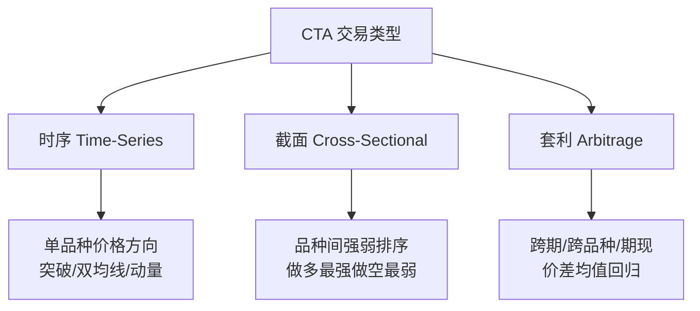
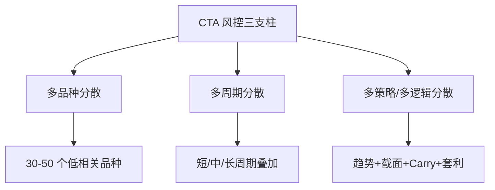
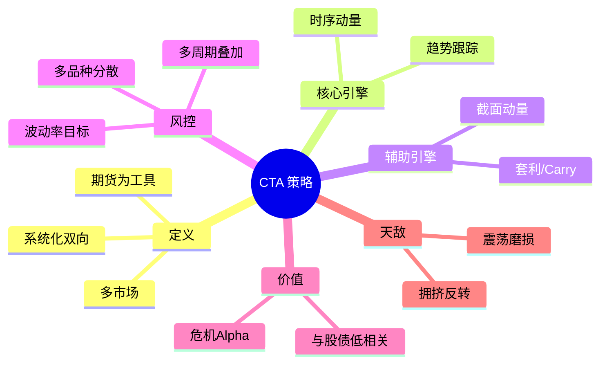

# CTA策略详解

> [!note] CTA策略概述
> CTA（Commodity Trading Advisor，商品交易顾问）策略即"管理期货"（Managed Futures）策略，以**期货与期权合约**为主要投资工具，通过系统化、量化的方式在商品、股指、债券、外汇等多个市场上做多或做空。它的灵魂是**趋势跟踪 + 跨品种分散**，并因与股债相关性低而成为资产配置中的"另类支柱"。

## 一、CTA策略的核心定义

很多人误以为 CTA 只能做商品。实际上，现代量化 CTA 的投资范围远不止于此：它以期货合约为载体，横跨**商品期货**与**金融期货**两大范畴，并可同时持有多头与空头。

| 资产大类 | 代表品种 | 在 CTA 中的角色 |
|---|---|---|
| 农产品 | 豆粕、白糖、棉花、玉米 | 趋势与季节性来源 |
| 金属 | 铜、铝、螺纹钢、黄金 | 宏观与工业周期载体 |
| 能源化工 | 原油、PTA、甲醇、燃油 | 高波动、强趋势 |
| 股指期货 | IF/IC/IM/IH（沪深300、中证500等） | 与股票市场的对冲/暴露 |
| 国债期货 | 2年/5年/10年/30年 | 利率趋势与避险 |
| 外汇/海外 | 全球商品、股指、债券、汇率 | 进一步分散 |

> [!important] 三个本质特征
> 1. **工具是期货**：自带杠杆、可双向交易、流动性集中在主力合约。
> 2. **方法是系统化**：信号由模型给出，纪律执行，弱化主观判断。
> 3. **价值在分散**：与传统股债低相关，是"危机 Alpha"的来源（详见 [[CTA危机Alpha详解]]）。

## 二、为什么趋势跟踪是 CTA 的核心

CTA 的策略谱系很广，但**趋势跟踪（Trend Following）始终是产业基石**。其底层逻辑是一个朴素假设：价格一旦形成方向，往往会因为行为偏差和信息扩散而**持续一段时间**。

**趋势为何长期存在**（行为金融视角，非保证）：

- **反应不足**：人们对新信息消化缓慢，价格分多步到位，制造了可跟随的斜坡。
- **处置效应**：盈利者过早卖、亏损者死扛，压制反向力量，延长趋势。
- **风险管理强制平仓**：机构在不利方向被迫止损，反而强化既有方向。

> [!tip] 一句话总结
> 趋势跟踪不预测顶底，只做一件事：**顺着已经发生的方向下注，截断亏损，让利润奔跑**。它本质上是一种"正凸性"（凸性收益）的策略——多次小亏，少数大赚。

## 三、CTA 的收益形态：为什么像"做多波动率"

趋势跟踪的收益分布具有显著的**右偏（正偏度）**和**类期权（凸性）**特征。把单笔交易的盈亏画出来，它更像持有了一份跨式期权：

$$
\text{单笔损益} \approx \begin{cases} +\text{大} & \text{出现持续趋势（少数情形）}\\ -\text{小} & \text{震荡被反复止损（多数情形）}\end{cases}
$$

| 维度 | 趋势跟踪 CTA | 典型股票多头 |
|---|---|---|
| 收益偏度 | 正偏（少数大赢家） | 略负偏 |
| 胜率 | 偏低（约 35%–45%，示例） | 较高 |
| 盈亏比 | 高（让利润奔跑） | 中等 |
| 最佳环境 | 大波动、强趋势 | 慢牛、低波动 |
| 最差环境 | 无方向震荡 | 急跌、流动性枯竭 |

> [!note] 关键直觉
> CTA 的"亏小钱"是为"赚大钱"买的保险费。理解了这一点，才能在长达数月的"磨损期"里拿得住——这正是大多数人放弃 CTA 的原因。

## 四、多维分类体系

### 按持仓周期

| 周期 | 持仓天数 | 策略容量 | 换手 | 特点 |
|---|---|---|---|---|
| 日内 | <1 天 | 小 | 极高 | 无隔夜风险，拼执行 |
| 短周期 | ≤3 天 | 较小 | 高 | 反转/统计为主 |
| 中周期 | 3–7 天 | 中 | 中 | 主流趋势策略 |
| 长周期 | >7 天 | 大 | 低 | 大容量、低交易成本 |

> [!tip] 周期与容量的权衡
> **周期越短，超额越锐利但容量越小、对成本越敏感**；周期越长，越能容纳大资金，但需要忍受更长的回撤。机构通常用**多周期叠加**来平滑曲线。

### 按交易类型

- **时序策略（时间序列动量）**：聚焦单品种自身的历史方向，"过去涨→继续做多"。这是 CTA 最核心的引擎。
- **截面策略（横截面动量）**：对一篮子品种排序，做多最强、做空最弱，赚取**相对强弱**而非绝对方向。
- **套利策略**：交易价差关系（跨期、跨品种、期现），偏均值回归，与趋势互补。

> [!example] 时序 vs 截面（示例对比）
> 假设原油、铜、黄金近 60 日涨幅为 +18%、+3%、−5%。
> - **时序**：原油、铜做多（均为正动量），黄金做空。
> - **截面**：做多原油（最强），做空黄金（最弱），铜居中可能不持仓。
> 两者在单边普涨/普跌行情中分歧最大——这也是为何要同时配置。

### 按交易逻辑

| 大类 | 子类 | 定位 |
|---|---|---|
| **量价类（主流）** | 趋势跟踪、截面动量、统计预测 | 数据驱动、可大规模复制 |
| **基本面类（补充）** | 宏观因素、供需库存、期限结构（展期收益/Carry） | 提供与量价低相关的另类信号 |

> [!note] 期限结构 = 被忽视的 Alpha
> 商品期货的**展期收益（Carry）**：当近月贵于远月（Backwardation，现货升水）时做多通常有正展期收益，反之（Contango）做空更划算。把"动量 + Carry"组合，往往比单一趋势更稳。

## 五、风控核心：多维度分散

量化 CTA 的风控灵魂不是"看得准"，而是**把蛋分到足够多互不相关的篮子里**。

分散为何如此有效，可用组合波动公式直观说明。若持有 $N$ 个等权、单品种波动率均为 $\sigma$、两两相关系数均为 $\rho$ 的头寸，则组合波动率为：

$$
\sigma_p = \sigma\sqrt{\frac{1}{N} + \frac{N-1}{N}\,\rho}
$$

当 $N\to\infty$，$\sigma_p \to \sigma\sqrt{\rho}$。

> [!important] 低相关是 CTA 的免费午餐
> 据公开研究与行业经验，国内商品期货主力合约**两两相关系数均值仅约 20%**（示例量级）。代入上式，$\rho=0.20$ 时分散到大量品种可把组合波动降到单品种的 $\sqrt{0.20}\approx 45\%$。这就是"分散持有 30–50 个品种即可显著降波"的数学来源。详见 [[相关性与协方差估计]]。

**头寸层面的风控**通常叠加：

- **波动率目标（Vol Targeting）**：按 ATR/历史波动率反比定头寸，高波动品种少配，使每个品种风险贡献均衡（见 [[波动率]]、[[资金管理与杠杆]]）。
- **组合层止损 / 回撤控制**：单品种、单策略、组合三级风险预算。
- **杠杆与保证金管理**：留足保证金缓冲，避免极端日被强平。

## 六、市场环境适配性

| 市场环境 | 趋势跟踪 | 截面动量 | 套利/Carry | 综合体验 |
|---|---|---|---|---|
| 强单边趋势 | 优异 | 良好 | 一般 | 最佳收获期 |
| 高波动+方向明确 | 优异 | 优异 | 良好 | 机会丰富 |
| 高波动+无方向 | 较差（被反复止损） | 一般 | 较好 | 磨损但可被套利对冲 |
| 低波动震荡 | 差 | 差 | 一般 | 最难熬的"磨损期" |
| 股市危机急跌 | 优异（危机 Alpha） | 良好 | 视情况 | CTA 的高光时刻 |

> [!warning] 震荡市是 CTA 的天敌
> 在长期无方向的"锯齿"行情里，趋势策略会**连续被小幅止损**，净值缓慢阴跌。这不是模型坏了，而是趋势策略的固有代价。应对方式是叠加截面/套利/Carry 等低相关子策略，而非频繁改参数。

## 七、常见误区与风险

| 常见误区 | 正确理解 |
|---|---|
| "CTA 就是炒商品" | CTA 横跨商品+股指+国债+外汇，是全资产期货策略 |
| "趋势跟踪要预测顶底" | 它从不预测，只跟随已发生的趋势并严格止损 |
| "胜率低=策略差" | 趋势策略天生低胜率高盈亏比，看的是期望而非胜率 |
| "回撤就该改参数" | 震荡期磨损是固有代价，频繁改参=过拟合，是大忌 |
| "杠杆越高越好" | 期货自带杠杆，过度加杠杆会在极端日被强平、放大尾部风险 |
| "CTA 永远对冲股市" | 危机 Alpha 有前提：危机需"有方向、够持久"，闪崩反弹未必有效 |

> [!warning] 三大真实风险
> 1. **流动性/展期风险**：非主力合约滑点大；移仓换月若处理不当会侵蚀收益。
> 2. **拥挤交易**：当太多资金做同一趋势，反转时踩踏加剧（动量崩溃）。
> 3. **参数过拟合**：在历史上"完美"的参数，往往是噪音。务必走稳健的 [[回测方法论]] 与样本外验证。

## 八、一页纸总结

> [!note] 学完你应该记住
> CTA = **"系统化趋势跟踪 + 跨品种分散"**。它用低胜率高盈亏比的方式，在多个市场上顺势而为；最大的价值不是单独跑赢，而是与股债低相关、在危机中提供保护。能不能赚钱，七分靠纪律与分散，三分靠信号。

## 相关链接

- [[CTA危机Alpha详解]]
- [[CTA策略Python实战]]
- [[CTA量化论文集]]
- [[HighFlyer量化策略]]
- [[五大经典量化策略]]
- [[波动率]]
- [[资金管理与杠杆]]
- [[相关性与协方差估计]]
- [[回测方法论]]
- [[目录|量化策略总览]]

## 课程化学习补充

> [!important] 学习定位
> 量化策略是投资假设、数据工程、回测验证、风险预算和执行系统的组合，不是单一公式。本文仅用于学习、研究与复盘，不构成任何投资建议。

### 必须掌握的问题

- 假设是否可证伪
- 数据是否 point-in-time
- 绩效是否扣除真实成本
- 上线后是否监控衰减

### 实战应用流程

1. 先写清楚你的投资假设：为什么这个信号、资产或方法应该产生收益。
2. 明确数据口径：样本范围、更新时间、复权/分红/停牌处理和交易日历。
3. 做最小可行验证：先用简单规则验证方向，再逐步加入复杂模型。
4. 把成本和约束前置：手续费、滑点、冲击成本、保证金、流动性和容量都要进入测算。
5. 上线后持续复盘：记录信号、下单、成交、持仓、回撤和失效原因。

### 风险与失效条件

- 数据挖掘偏差
- 因子拥挤
- 换手过高
- 实盘偏离回测

### 复盘问题

- 这笔交易或这套模型赚的是什么钱：风险补偿、行为偏差、流动性溢价，还是偶然噪音？
- 如果市场环境反过来，最大亏损和最长恢复期会是多少？
- 当前结论是否依赖某个不可持续假设，例如低利率、低波动、充裕流动性或监管套利？
- 有没有一个更简单的基准策略能取得接近效果？

### 延伸学习

- [[量化投资完全指南]]
- [[回测质量门清单]]
- [[市场微观结构与交易执行]]
- [[量化风险管理体系]]

## 跨领域进阶扩展

> [!tip] 交易者视角
> 学到 `CTA策略详解` 时，不要只把它当成孤立知识点。把策略视为假设、数据、验证、组合和执行的整体工程。优秀投资交易者会把它放入“宏观背景 - 资产选择 - 估值/信号 - 组合风险 - 交易执行 - 复盘反馈”的闭环。

### 与其他知识的连接

- 收益来源和经济解释
- 数据清洗和偏差控制
- 回测、组合和风控
- 实盘衰减与策略迭代

### 进阶训练

1. 把策略假设写成可证伪命题
2. 建立基准策略比较
3. 把换手、容量和成本纳入绩效评价

### 能力验收

- 能否说清楚这个主题影响的是收益来源、风险来源、交易成本、流动性还是心理纪律？
- 能否指出它在什么市场环境、资产类别或交易周期中更有效？
- 能否把它写成一条可复盘的研究或交易规则？
- 能否说明如果判断错误，组合最大损失和退出机制是什么？

### 全局关联

- [[综合金融知识体系/金融投资全知识地图|金融投资全知识地图]]
- [[综合金融知识体系/优秀投资交易者能力地图|优秀投资交易者能力地图]]
- [[综合金融知识体系/一次性学习路线与复盘模板|一次性学习路线与复盘模板]]
