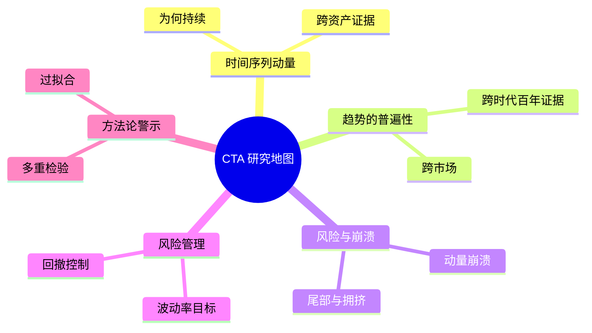

# CTA量化论文集

> [!note] 论文导读
> 本文不是文献堆砌，而是把 CTA / 趋势跟踪领域的**关键研究主题**串成一张地图，帮你建立"为什么趋势有效、它有多普遍、如何管理风险"的研究脉络。下文按主题归纳，仅列出领域内公认的少量经典文献作为锚点，**其余以主题与研究问题呈现，不杜撰具体标题、作者与数据**。

## 一、研究主题地图

## 二、主题一：时间序列动量（Time-Series Momentum）

**核心问题**：一个品种"过去 N 个月涨/跌"，能否预测它未来一段时间继续涨/跌？

研究普遍发现：在股指、债券、商品、外汇等众多期货市场中，过去 1–12 个月的收益方向，对未来短期收益具有**正向预测力**；据此构建的"涨了做多、跌了做空"组合，长期具有正的风险调整收益。这与依赖品种间相对强弱的**横截面动量**是两条不同但互补的线索。

> [!example] 锚点文献
> - Moskowitz, Ooi, Pedersen (2012): *"Time Series Momentum"* —— 时序动量的奠基性实证。
> - Baltas, Kosowski (2013): *"Momentum in Futures Markets"* —— 期货市场动量与组合构建。

**为何持续**（主流解释，均为假说而非定论）：

| 解释 | 机制 |
|---|---|
| 反应不足 | 信息分步消化，价格分多步到位 |
| 反应过度后延续 | 羊群与追涨在中期延长趋势 |
| 风险溢价 | 趋势承担了某种宏观/流动性风险的补偿 |

> [!tip] 给实战者的启示
> 时序动量是趋势跟踪 CTA 的"学术底座"。它告诉你：趋势不是错觉，但收益**正偏、低胜率**，必须靠纪律与分散兑现（见 [[CTA策略详解]]）。

## 三、主题二：趋势的普遍性与持久性

**核心问题**：趋势效应只是某段历史的运气，还是跨市场、跨时代稳定存在？

长周期研究通过回溯**长达一个世纪**的多资产数据，发现分散化趋势跟踪在不同年代、不同政体与货币体系下都能持续产生正收益，并在多数股票熊市中表现稳健——这为"危机 Alpha"提供了历史依据（见 [[CTA危机Alpha详解]]）。

> [!example] 锚点文献
> - Hurst, Ooi, Pedersen (2017): *"A Century of Evidence on Trend-Following Investing"* —— 趋势跟踪的百年证据。
> - Asness, Moskowitz, Pedersen (2013): *"Value and Momentum Everywhere"* —— 价值与动量在各类资产中的普遍共存。

> [!important] "普遍性"的两层含义
> 1. **跨资产**：动量不止存在于商品，股指、债券、外汇同样有。
> 2. **跨时间**：它经历过多次市场结构变迁仍存活，但**近年收益较历史均值有所衰减**（拥挤、套利增多）。普遍 ≠ 永远丰厚。

## 四、主题三：动量崩溃与尾部风险

**核心问题**：动量/趋势策略最危险的时刻是什么样？

研究指出，动量策略偶尔会经历**剧烈而集中的回撤**（"动量崩溃"），典型场景是市场在大跌后**急速反转**：此前做空的"输家"突然暴涨，策略被反向重创。这与危机 Alpha 失灵的场景（闪崩 V 型反弹）高度一致。

> [!example] 锚点文献
> - Daniel, Moskowitz (2016): *"Momentum Crashes"* —— 动量崩溃的成因与缓解。

> [!warning] 崩溃的两大诱因
> 1. **反转风险**：熊市末端的急速反弹，让空头动量仓位集中爆亏。
> 2. **拥挤交易**：当太多资金挤在同一趋势上，平仓踩踏放大尾部。
> 缓解思路：波动率目标、动态对冲极端反转、限制单一方向暴露。

## 五、主题四：风险管理与组合构建

**核心问题**：在信号既定的前提下，如何"活得久、回撤小"？这往往比信号本身更决定长期成败。

| 研究方向 | 关键问题 | 实务对应 |
|---|---|---|
| 波动率目标 | 如何让组合波动稳定？ | 按波动反比定头寸，高波动降杠杆 |
| 风险平价/风险预算 | 如何让各品种风险贡献均衡？ | ATR 反比、协方差约束 |
| 回撤控制 | 如何限制最大回撤？ | 三级风险预算、止损与降杠杆规则 |
| 相关性估计 | 危机中相关性会跳变怎么办？ | 稳健协方差、压力情景测试 |

> [!example] 锚点文献
> - Pedersen (2015): *"Efficiently Inefficient"* —— 市场"有效但不完全有效"，套利者如何在其中获利与管理风险（系统性论述，亦为优秀教材）。

风险管理的数学锚点之一是**波动率目标**：将仓位按目标波动 $\sigma^\*$ 与近期已实现波动 $\hat{\sigma}_t$ 之比缩放：

$$
w_t = \frac{\sigma^\*}{\hat{\sigma}_t}\cdot w_t^{signal}
$$

波动升高时自动降杠杆，从而平滑净值、压低尾部。延伸阅读 [[波动率]]、[[资金管理与杠杆]]、[[相关性与协方差估计]]。

## 六、主题五：方法论与"假发现"警示

**核心问题**：你看到的超额收益，有多少是真的，有多少是反复试参数试出来的运气？

随着被检验的"因子"越来越多，**多重假设检验**使得很多看似显著的策略其实站不住脚。研究呼吁提高显著性门槛、重视样本外与跨市场验证，警惕数据窥探与过拟合。

> [!example] 锚点文献
> - Harvey, Liu, Zhu (2016): *"…and the Cross-Section of Expected Returns"* —— 在海量已发表因子背景下，重新审视显著性标准。

> [!warning] 研究者与实战者通用的三条戒律
> 1. **多重检验要罚分**：试得越多，越要提高门槛。
> 2. **样本外为王**：训练期漂亮不算数，看样本外与不同市场。
> 3. **稳健胜于最优**：要参数"高原"而非"孤峰"。落到代码上就是稳健的 [[回测方法论]]。

## 七、前沿与延伸方向

| 方向 | 在研问题（开放） |
|---|---|
| 机器学习在 CTA 中的应用 | 深度学习/强化学习能否捕捉非线性趋势？泛化与过拟合如何平衡？ |
| 趋势与 Carry 的融合 | 动量 + 期限结构（展期收益）如何协同？ |
| 拥挤度度量 | 如何量化趋势交易的拥挤，预警动量崩溃？ |
| 另类数据 | 持仓报告、库存、卫星等数据能否改进信号？ |

> [!note] 怎么读这些研究
> 别背结论，要学**提问方式**：一个声称有效的策略，必须经得起"换市场、换时段、扣成本、控多重检验"的拷问。带着这套质疑去读，你看任何"高收益策略"的眼光都会不一样。

## 八、常见误区

| 常见误区 | 正确理解 |
|---|---|
| "论文证明了趋势永远赚钱" | 证明的是历史普遍性，收益会衰减、会有崩溃 |
| "动量崩溃很罕见可忽略" | 它是趋势策略的核心尾部风险，必须主动管理 |
| "信号好就够了" | 风险管理（波动率目标/回撤控制）常比信号更决定成败 |
| "因子越多越好" | 多重检验下，多数"新因子"是噪音 |
| "学术结论可直接照搬实盘" | 需扣除成本、考虑容量与拥挤后再验证 |

## 相关链接

- [[CTA策略详解]]
- [[CTA危机Alpha详解]]
- [[CTA策略Python实战]]
- [[HighFlyer量化策略]]
- [[回测方法论]]
- [[相关性与协方差估计]]
- [[波动率]]
- [[资金管理与杠杆]]
- [[目录|量化策略总览]]

## 课程化学习补充

> [!important] 学习定位
> 量化策略是投资假设、数据工程、回测验证、风险预算和执行系统的组合，不是单一公式。本文仅用于学习、研究与复盘，不构成任何投资建议。

### 必须掌握的问题

- 假设是否可证伪
- 数据是否 point-in-time
- 绩效是否扣除真实成本
- 上线后是否监控衰减

### 实战应用流程

1. 先写清楚你的投资假设：为什么这个信号、资产或方法应该产生收益。
2. 明确数据口径：样本范围、更新时间、复权/分红/停牌处理和交易日历。
3. 做最小可行验证：先用简单规则验证方向，再逐步加入复杂模型。
4. 把成本和约束前置：手续费、滑点、冲击成本、保证金、流动性和容量都要进入测算。
5. 上线后持续复盘：记录信号、下单、成交、持仓、回撤和失效原因。

### 风险与失效条件

- 数据挖掘偏差
- 因子拥挤
- 换手过高
- 实盘偏离回测

### 复盘问题

- 这笔交易或这套模型赚的是什么钱：风险补偿、行为偏差、流动性溢价，还是偶然噪音？
- 如果市场环境反过来，最大亏损和最长恢复期会是多少？
- 当前结论是否依赖某个不可持续假设，例如低利率、低波动、充裕流动性或监管套利？
- 有没有一个更简单的基准策略能取得接近效果？

### 延伸学习

- [[量化投资完全指南]]
- [[回测质量门清单]]
- [[市场微观结构与交易执行]]
- [[量化风险管理体系]]

## 跨领域进阶扩展

> [!tip] 交易者视角
> 学到 `CTA量化论文集` 时，不要只把它当成孤立知识点。把策略视为假设、数据、验证、组合和执行的整体工程。优秀投资交易者会把它放入“宏观背景 - 资产选择 - 估值/信号 - 组合风险 - 交易执行 - 复盘反馈”的闭环。

### 与其他知识的连接

- 收益来源和经济解释
- 数据清洗和偏差控制
- 回测、组合和风控
- 实盘衰减与策略迭代

### 进阶训练

1. 把策略假设写成可证伪命题
2. 建立基准策略比较
3. 把换手、容量和成本纳入绩效评价

### 能力验收

- 能否说清楚这个主题影响的是收益来源、风险来源、交易成本、流动性还是心理纪律？
- 能否指出它在什么市场环境、资产类别或交易周期中更有效？
- 能否把它写成一条可复盘的研究或交易规则？
- 能否说明如果判断错误，组合最大损失和退出机制是什么？

### 全局关联

- [[综合金融知识体系/金融投资全知识地图|金融投资全知识地图]]
- [[综合金融知识体系/优秀投资交易者能力地图|优秀投资交易者能力地图]]
- [[综合金融知识体系/一次性学习路线与复盘模板|一次性学习路线与复盘模板]]
