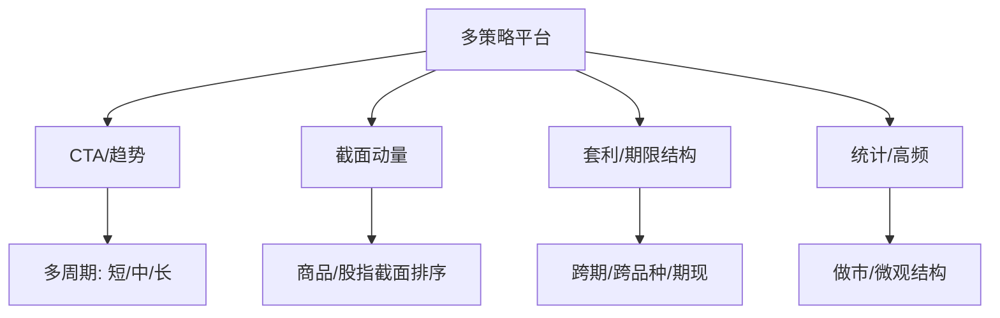
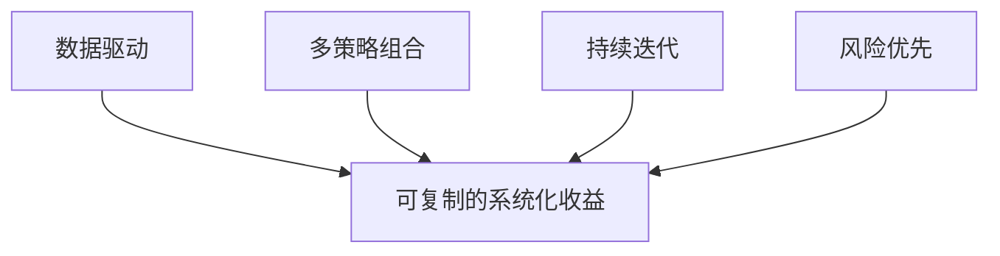

# HighFlyer量化策略

> [!note] 以机构为镜
> 本文以"大型量化机构的 CTA / 多策略平台"为切入口（HighFlyer 仅作典型代称），讲清**机构化 CTA 与个人/小团队的本质差异**：不是某个神奇信号，而是**组织、数据、品种覆盖、风控与工程**的系统性能力。内容以**概念与公开常识**为主，不涉及也不杜撰任何机构的内部数据。

## 一、机构化 CTA 的画像

| 维度 | 个人 / 小团队 | 大型量化机构 |
|---|---|---|
| 策略数量 | 1–3 个 | 数十至上百个子策略并行 |
| 品种覆盖 | 少数活跃品种 | 全市场商品+股指+国债+海外 |
| 数据 | 公开行情 | 行情+持仓+基本面+另类数据 |
| 风控 | 人工盯盘 | 多级风险预算+实时监控系统 |
| 执行 | 手动/简单脚本 | 智能算法交易、低延迟撮合 |
| 迭代 | 偶尔调参 | 研究流水线持续上线/下线策略 |

> [!important] 核心认知
> 机构的护城河**不在单一策略有多强**，而在于把"研究→风控→执行"工业化，并用**大量低相关子策略**叠加出平滑曲线。个人难以复制的是这套"系统"，而非某个公式。

## 二、组织：研究流水线

> [!tip] 像工厂，不像作坊
> 机构把投资拆成**专业分工的流水线**：数据工程、信号研究、组合优化、交易执行、风控合规各司其职。一个策略从想法到上线，要穿过回测、样本外、模拟盘、小资金实盘的层层关卡，**大多数想法会被淘汰**——这正是质量的来源。

## 三、品种与策略覆盖：用广度换稳健

机构 CTA 的稳健，来自"足够多 × 足够不相关"的子策略与品种。

| 子策略 | 收益来源 | 与趋势的相关性 |
|---|---|---|
| 趋势跟踪 | 价格延续 | —— |
| 截面动量 | 相对强弱 | 中 |
| 套利/Carry | 价差回归/展期收益 | 低 |
| 统计/高频 | 微观结构/做市 | 低 |

> [!example] 为什么要这么多条腿
> 单一趋势策略在震荡市会长期磨损（见 [[CTA危机Alpha详解]]）。机构用**截面、套利、Carry、统计**等低相关子策略去填趋势的"空窗期"，让整体净值更平。这本质上是 [[CTA策略详解]] 里"多策略逻辑分散"的工业化版本。

## 四、风控：机构的第一性原则

> [!important] 风控不是事后补救，而是设计的起点
> 机构把风控**前置**到组合构建中：先定风险预算，再在预算内分配策略与杠杆，而非"先追收益、出事再止损"。

**三级风险预算**（概念示意）：

$$
\text{总风险预算} = \sum_{\text{策略}} \text{策略预算} = \sum_{\text{策略}}\sum_{\text{品种}} \text{品种风险贡献}
$$

| 层级 | 控制对象 | 常用手段 |
|---|---|---|
| 组合层 | 总波动 / 总回撤 | 波动率目标、总杠杆上限 |
| 策略层 | 单策略风险占比 | 风险预算、相关性约束 |
| 品种层 | 单品种风险贡献 | ATR 反比定仓、集中度限制 |

机构常将组合波动锚定到目标 $\sigma^\*$，按近期已实现波动反比缩放总杠杆：

$$
L_t = \frac{\sigma^\*}{\hat{\sigma}_t}
$$

波动升高自动降杠杆，平滑净值、压低尾部。配合实时监控、压力测试与熔断规则，构成完整闭环。延伸阅读 [[风险管理框架]]、[[资金管理与杠杆]]、[[波动率]]。

> [!warning] 机构也会犯的错
> 1. **拥挤**：当多家机构策略趋同，反转时一起踩踏（动量崩溃）。
> 2. **杠杆与流动性错配**：高杠杆遇上极端日的流动性枯竭=被强平。
> 3. **过拟合的规模化**：把过拟合策略批量上线，错得更系统。规模不能免疫这些风险，只会放大后果。

## 五、投资理念（机构通行的四条）

1. **数据驱动**：决策基于大样本统计与可检验的证据，弱化主观拍脑袋。
2. **多策略组合**：用低相关子策略分散，追求"平稳的复利"而非"刺激的暴利"。
3. **持续迭代**：策略会衰减，研究流水线不断上线新策略、淘汰失效策略。
4. **风险优先**：先问"最坏会亏多少"，再谈收益——活下来才能复利。

> [!tip] 个人能借鉴什么
> 你复制不了机构的算力与数据，但可以借走它的**方法论**：写清研究纪律、做样本外验证、用波动率定头寸、追求多策略低相关、把风控写进规则而非临场情绪。

## 六、从机构到个人：可迁移与不可迁移

| 能力 | 个人可迁移? | 说明 |
|---|---|---|
| 系统化纪律 | ✅ 完全可学 | 信号化、规则化、去情绪化 |
| 波动率定头寸 | ✅ 可学 | ATR/波动率反比，见 [[CTA策略Python实战]] |
| 多策略低相关 | 🔶 部分 | 可做趋势+截面，但广度有限 |
| 全市场+另类数据 | ❌ 难 | 受数据与成本约束 |
| 低延迟执行 | ❌ 难 | 需要工程与基础设施投入 |

> [!note] 一句话
> 学机构，学的是它的**纪律与系统观**，不是它的算力。把"研究—风控—执行"当成一条你自己的小流水线来经营，你的曲线就会比"凭感觉调参"稳得多。

## 七、常见误区

| 常见误区 | 正确理解 |
|---|---|
| "机构有独门必胜公式" | 护城河是系统/组织/风控，不是单个信号 |
| "策略越复杂越赚钱" | 复杂≠更优，常意味着更易过拟合 |
| "规模大就更安全" | 规模会放大拥挤、流动性与过拟合风险 |
| "机器学习=印钞机" | ML 需海量数据与严控泛化，否则是高级过拟合 |
| "个人完全学不了机构" | 算力学不了，但纪律与方法论完全可迁移 |
| "风控是收益的对立面" | 风控是长期复利的前提，先活下来再谈收益 |

## 八、一页纸总结

> [!important] 记住三点
> 1. **机构 CTA = 系统工程**：研究流水线 + 多策略低相关 + 前置风控 + 工业化执行。
> 2. **稳健靠广度**：足够多、足够不相关的子策略与品种，平滑掉单一趋势的磨损。
> 3. **可迁移的是方法论**：纪律、样本外验证、波动率定仓、风险预算——这些个人也能用。

## 相关链接

- [[CTA策略详解]]
- [[CTA危机Alpha详解]]
- [[CTA策略Python实战]]
- [[CTA量化论文集]]
- [[五大经典量化策略]]
- [[风险管理框架]]
- [[资金管理与杠杆]]
- [[波动率]]
- [[量化策略案例分析]]
- [[目录|量化策略总览]]

## 课程化学习补充

> [!important] 学习定位
> 量化策略是投资假设、数据工程、回测验证、风险预算和执行系统的组合，不是单一公式。本文仅用于学习、研究与复盘，不构成任何投资建议。

### 必须掌握的问题

- 假设是否可证伪
- 数据是否 point-in-time
- 绩效是否扣除真实成本
- 上线后是否监控衰减

### 实战应用流程

1. 先写清楚你的投资假设：为什么这个信号、资产或方法应该产生收益。
2. 明确数据口径：样本范围、更新时间、复权/分红/停牌处理和交易日历。
3. 做最小可行验证：先用简单规则验证方向，再逐步加入复杂模型。
4. 把成本和约束前置：手续费、滑点、冲击成本、保证金、流动性和容量都要进入测算。
5. 上线后持续复盘：记录信号、下单、成交、持仓、回撤和失效原因。

### 风险与失效条件

- 数据挖掘偏差
- 因子拥挤
- 换手过高
- 实盘偏离回测

### 复盘问题

- 这笔交易或这套模型赚的是什么钱：风险补偿、行为偏差、流动性溢价，还是偶然噪音？
- 如果市场环境反过来，最大亏损和最长恢复期会是多少？
- 当前结论是否依赖某个不可持续假设，例如低利率、低波动、充裕流动性或监管套利？
- 有没有一个更简单的基准策略能取得接近效果？

### 延伸学习

- [[量化投资完全指南]]
- [[回测质量门清单]]
- [[市场微观结构与交易执行]]
- [[量化风险管理体系]]

## 跨领域进阶扩展

> [!tip] 交易者视角
> 学到 `HighFlyer量化策略` 时，不要只把它当成孤立知识点。把策略视为假设、数据、验证、组合和执行的整体工程。优秀投资交易者会把它放入“宏观背景 - 资产选择 - 估值/信号 - 组合风险 - 交易执行 - 复盘反馈”的闭环。

### 与其他知识的连接

- 收益来源和经济解释
- 数据清洗和偏差控制
- 回测、组合和风控
- 实盘衰减与策略迭代

### 进阶训练

1. 把策略假设写成可证伪命题
2. 建立基准策略比较
3. 把换手、容量和成本纳入绩效评价

### 能力验收

- 能否说清楚这个主题影响的是收益来源、风险来源、交易成本、流动性还是心理纪律？
- 能否指出它在什么市场环境、资产类别或交易周期中更有效？
- 能否把它写成一条可复盘的研究或交易规则？
- 能否说明如果判断错误，组合最大损失和退出机制是什么？

### 全局关联

- [[综合金融知识体系/金融投资全知识地图|金融投资全知识地图]]
- [[综合金融知识体系/优秀投资交易者能力地图|优秀投资交易者能力地图]]
- [[综合金融知识体系/一次性学习路线与复盘模板|一次性学习路线与复盘模板]]
