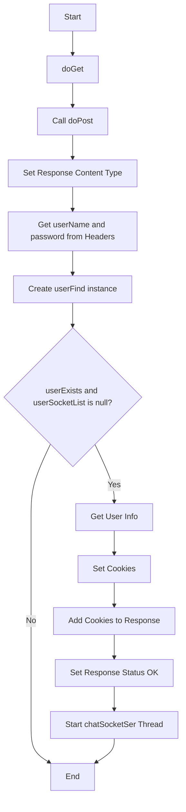
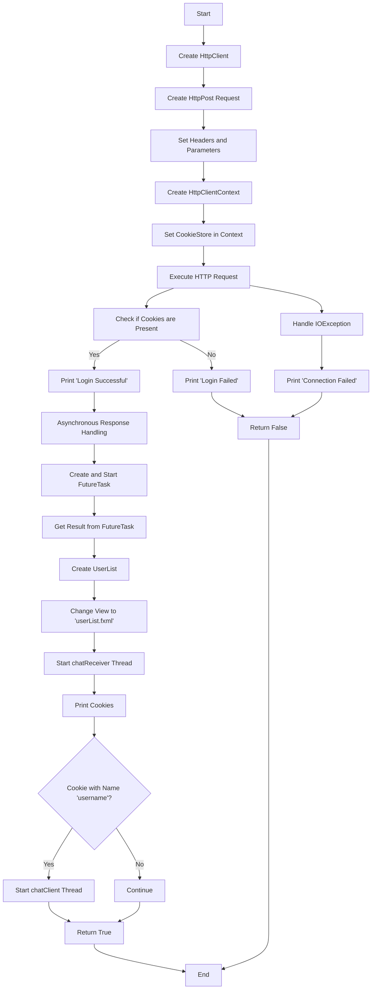

```mermaid
graph TD

    A[Start] --> B[doGet]

    B --> C[Call doPost]

    C --> D[Set Response Content Type]

    D --> E[Get userName and password from Headers]

    E --> F[Create userFind instance]

    F --> G{userExists and userSocketList is null?}

    G -->|Yes| H[Get User Info]

    H --> I[Set Cookies]

    I --> J[Add Cookies to Response]

    J --> K[Set Response Status OK]

    K --> L[Start chatSocketSer Thread]

    G -->|No| M[End]

    L --> M[End]
```

---

```mermaid
graph TD
    A[Start] --> B[Create HttpClient]
    B --> C[Create HttpPost Request]
    C --> D[Set Headers and Parameters]
    D --> E[Create HttpClientContext]
    E --> F[Set CookieStore in Context]
    F --> G[Execute HTTP Request]
    G --> H[Check if Cookies are Present]
    H -->|Yes| I[Print 'Login Successful']
    I --> J[Asynchronous Response Handling]
    J --> K[Create and Start FutureTask]
    K --> L[Get Result from FutureTask]
    L --> M[Create UserList]
    M --> N[Change View to 'userList.fxml']
    N --> O[Start chatReceiver Thread]
    O --> P[Print Cookies]
    P --> Q{Cookie with Name 'username'?}
    Q -->|Yes| R[Start chatClient Thread]
    Q -->|No| S[Continue]
    H -->|No| T[Print 'Login Failed']
    T --> U[Return False]
    R --> V[Return True]
    S --> V[Return True]
    V --> W[End]
    U --> W[End]
    G --> X[Handle IOException]
    X --> Y[Print 'Connection Failed']
    Y --> U

```