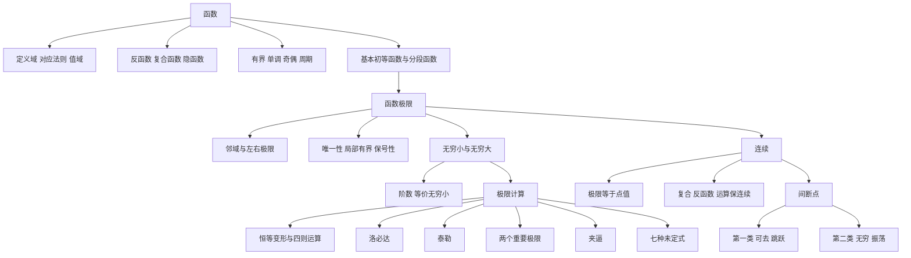

# 高数第1讲 函数极限与连续

> [!info] 教材来源与核对范围
> - 来源：`27张宇基础30讲高数.pdf`，印刷页 1-75 / PDF p6-p80。
> - 已逐页处理全部 75 页：全页 OCR 提取文字骨架，19 张四页联系图逐张阅读，并对定义表、函数图像、泰勒公式、连续性和习题答案页进行高清原页复核。
> - 本讲正文例题为例 1.1-1.38，讲末练习为 1.1-1.16；下文均有方法覆盖，不复刻完整题干。

## 本讲速览

- **函数是对象**：先确认定义域、对应法则和值域，再研究反函数、复合函数、分段函数及四种特性。
- **极限是局部趋势**：研究的是“靠近时怎样”，通常与点值无关；左右趋势一致，双侧极限才存在。
- **无穷小是极限语言**：$f(x)\to A$ 等价于 $f(x)=A+\alpha(x)$ 且 $\alpha(x)\to0$；比较阶数就是比较趋零速度。
- **极限计算先识别结构**：先代入和恒等变形，再在四则运算、等价无穷小、洛必达、泰勒、重要极限、夹逼中选工具。
- **连续把极限与点值接上**：$\lim f(x)=f(x_0)$；间断分类的核心是分别检查左右极限和点值。
- 本讲是后续 [[02_高数第2讲_数列极限|数列极限]]、[[03_高数第3讲_一元函数微分学的概念|导数]]、[[08_高数第8讲_一元函数积分学的概念与性质|积分]] 的共同入口。

## 教材路线

| 教材顺序 | 内容 | 页码 |
|---|---|---|
| 开篇 | 考试目标、重难点、全讲知识结构图 | 印刷页 1-2 / PDF p6-p7 |
| 一 | 函数、反函数、复合函数、隐函数；有界性、单调性、奇偶性、周期性 | 印刷页 3-14 / PDF p8-p19 |
| 二 | 基本初等函数、初等函数、分段函数、绝对值/符号/取整函数及图像 | 印刷页 15-27 / PDF p20-p32 |
| 三 | 邻域、24 种函数极限、超实数直观、极限性质、无穷小比较、无穷大 | 印刷页 27-45 / PDF p32-p50 |
| 四 | 四则运算、洛必达、泰勒、无穷小运算、两个重要极限、夹逼、七种未定式 | 印刷页 46-64 / PDF p51-p69 |
| 五 | 连续点、连续函数性质、间断点及分类 | 印刷页 64-68 / PDF p69-p73 |
| 练习 | 基础习题 1.1-1.16 与答案解析 | 印刷页 68-75 / PDF p73-p80 |

## 前置知识与关联导航

- 代数基础：因式分解、通分、有理化、换元、指数与对数恒等式。
- 三角基础：诱导公式、$\sin^2x+\cos^2x=1$、$1+\tan^2x=\sec^2x$。
- 极限的离散版本：[[02_高数第2讲_数列极限|数列极限与单调有界准则]]。
- 泰勒公式的定理与证明应用：[[06_高数第6讲_一元函数微分学的应用二#5. 泰勒公式（皮亚诺余项）|泰勒公式]]。
- 闭区间连续函数的证明题：[[07_高数第7讲_一元函数微分学的应用三|微分学应用]]。

## 知识网络

## 知识点清单

### 一、函数的概念与特性

#### 1. 常见定义域限制

函数 $y=f(x)$ 由**定义域 $D$ 与对应法则 $f$**共同确定；值域是 $\{f(x)\mid x\in D\}$。两个函数相同，必须定义域相同且对应法则相同。

- 单值函数允许“一对一”或“多对一”，不允许同一 $x$ 对应多个 $y$。
- 图像判定单值性用**铅直线法**：任一铅直线至多与图像相交一次。
- 定义域由实际意义和表达式限制共同确定：

| 结构 | 必须满足 |
|---|---|
| $1/g(x)$ | $g(x)\ne0$ |
| $\sqrt{g(x)}$ | $g(x)\ge0$ |
| $\ln g(x)$ | $g(x)>0$ |
| $\log_a g(x)$ | $a>0,\ a\ne1,\ g(x)>0$ |
| $\arcsin g(x),\arccos g(x)$ | $-1\le g(x)\le1$ |
| $f(g(x))$ | $x\in D_g$ 且 $g(x)\in D_f$ |

**看到什么想到它**

- 给出 $f(\varphi(x))$ 要求 $f(x)$：先令 $t=\varphi(x)$ 或解出 $x$ 与 $t$ 的关系，再把对应法则写回。
- 给出同时含 $f(x),f(1/x),f(-x)$ 的关系：作 $x\mapsto1/x$ 或 $x\mapsto -x$，组成方程组消元。换元后必须检查定义域。
- 函数由极限定义：求极限时把外层 $x$ 当参数，先得到分段对应法则，再研究连续与间断。

#### 2. 反函数

若每个 $y\in R_f$ 都唯一对应一个 $x\in D_f$，则 $f$ 有反函数。严格单调是充分条件，不是必要条件。

- 是否有反函数用**水平线法**；任一水平线与函数图像至多一个交点。
- $D_{f^{-1}}=R_f$，$R_{f^{-1}}=D_f$。
- $f^{-1}(f(x))=x$，$f(f^{-1}(x))=x$，但都要在各自定义域内。
- $y=f(x)$ 与写成标准形式后的 $y=f^{-1}(x)$ 关于 $y=x$ 对称。
- $f^{-1}(x)$ 是反函数，不是 $1/f(x)$。

反三角函数必须连同主值区间记忆：

| 函数 | 定义域 | 值域/主值区间 | 单调性 |
|---|---|---|---|
| $\arcsin x$ | $[-1,1]$ | $[-\pi/2,\pi/2]$ | 增 |
| $\arccos x$ | $[-1,1]$ | $[0,\pi]$ | 减 |
| $\arctan x$ | $\mathbb R$ | $(-\pi/2,\pi/2)$ | 增 |
| $\operatorname{arccot}x$ | $\mathbb R$ | $(0,\pi)$ | 减 |

$$
\arcsin x+\arccos x=\frac\pi2,
\qquad
\arctan x+\operatorname{arccot}x=\frac\pi2.
$$

> [!warning] 复合反三角函数
> $\sin(\arcsin x)=x$ 对 $x\in[-1,1]$ 成立；但 $\arcsin(\sin x)=x$ 只在 $[-\pi/2,\pi/2]$ 成立。超出主值区间要用诱导公式分段折回。

教材并列给出的三个重要函数为

$$
\operatorname{arsinh}x=\ln\left(x+\sqrt{x^2+1}\right),
\qquad
\sinh x=\frac{e^x-e^{-x}}2,
\qquad
\cosh x=\frac{e^x+e^{-x}}2.
$$

$\operatorname{arsinh}x$ 是奇函数，其反函数为 $\sinh x$，并有

$$
\ln\left(x+\sqrt{x^2+1}\right)\sim x\quad(x\to0),
$$

$$
\left[\ln\left(x+\sqrt{x^2+1}\right)\right]'=\frac1{\sqrt{x^2+1}}.
$$

在对称区间积分中，这个对数项因奇性可直接消去，例如教材结论

$$
\int_{-1}^{1}\left[\ln\left(x+\sqrt{x^2+1}\right)+x^2\right]dx
=\int_{-1}^{1}x^2dx=\frac23.
$$

**看到什么想到它**：题目要求周期函数在某段上的反函数，先按单调区间切开，再把角度搬到主值区间，不能给一个全局反函数。

#### 3. 复合函数与隐函数

若 $u=g(x)$ 的值落在 $f$ 的定义域内，则

$$
(f\circ g)(x)=f(g(x)),\qquad
D_{f\circ g}=\{x\in D_g\mid g(x)\in D_f\}.
$$

- 求复合对应法则：先判断内函数落在哪个区间，再选外函数分支。
- 若已知 $f(\varphi(x))$，把 $\varphi(x)$ 当整体反解；若出现平方，正负号由题设范围决定。
- 隐函数由 $F(x,y)=0$ 给出，可能有一支、多支或局部才是函数；用图像、对称性或参数表示理解，不强求总能显式解出 $y=f(x)$。

#### 4. 四种特性

**有界性**：在集合 $I$ 上存在 $M>0$，使 $|f(x)|\le M$ 对所有 $x\in I$ 成立。局部有界、区间有界和全定义域有界不是同一件事。

- 连续函数在闭区间上必有界并取得最值。
- 证明有界可用绝对值估计、基本不等式、配方或求最值，例如
  $|x|/(1+x^2)\le1/2$。

**单调性**：对 $x_1<x_2$，若 $f(x_1)<f(x_2)$ 则严格递增。等价地，

$$
(x_1-x_2)[f(x_1)-f(x_2)]>0
$$

表示同向变化；小于 $0$ 表示反向变化。单调性必须声明区间。

**奇偶性**：先检查定义域关于原点对称，再检查

$$
f(-x)=f(x)\Rightarrow\text{偶},\qquad
f(-x)=-f(x)\Rightarrow\text{奇}.
$$

- $f(|x|)$ 必为偶函数；$f(x)+f(-x)$ 为偶函数，$f(x)-f(-x)$ 为奇函数。
- 任意定义在对称区间上的函数可分解为

$$
f(x)=\frac{f(x)+f(-x)}2+\frac{f(x)-f(-x)}2.
$$

- 对加法型函数关系 $f(x+y)=f(x)+f(y)$，先令 $x=y=0$ 得 $f(0)=0$，再令 $y=-x$ 得奇性。

**周期性**：若 $f(x+T)=f(x)$，$T>0$，则 $T$ 是周期；题目通常说的周期指最小正周期。

- 非零常数函数每个正数都是周期，因此没有最小正周期。
- 证明周期性只需把函数关系迭代到 $f(x+T)=f(x)$。
- 若周期函数可导，则导函数仍同周期；若可积，则任意长度为一周期的积分值相同。

### 二、函数图像

#### 5. 基本初等函数与初等函数

基本初等函数包括幂函数、指数函数、对数函数、三角函数和反三角函数；有限次四则运算与复合得到的单式函数称初等函数。

**幂函数 $x^\alpha$**：定义域随 $\alpha$ 的类型变化，不能机械写成 $\mathbb R$。多因子乘幂求极值时，先取对数把乘除和乘方化为加减：

$$
y=x^a(1-x)^b\quad(0<x<1)
$$

的驻点由 $a/x-b/(1-x)=0$ 得 $x=a/(a+b)$。

**指数与对数**

$$
a^x=e^{x\ln a},\qquad
\log_a x=\frac{\ln x}{\ln a},
$$

$$
\log_a(MN)=\log_aM+\log_aN,\quad
\log_a\frac MN=\log_aM-\log_aN,\quad
\log_aM^r=r\log_aM.
$$

- $a>1$ 时 $a^x,\log_ax$ 增；$0<a<1$ 时减。
- $a^x>0$；$\log_ax$ 只在 $x>0$ 有定义。
- 用 $e^x=\sum_{n=0}^{\infty}x^n/n!$ 可把 $a^x=e^{x\ln a}$ 展成幂级数形式。

**三角与反三角**：要同时掌握定义域、值域、周期、奇偶、单调区间、特殊值与渐近线。尤其注意

$$
\tan x=\frac{\sin x}{\cos x},\quad
\cot x=\frac{\cos x}{\sin x},\quad
\sec x=\frac1{\cos x},\quad
\csc x=\frac1{\sin x}.
$$

$$
1+\tan^2x=\sec^2x,\qquad 1+\cot^2x=\csc^2x.
$$

**看到什么想到它**

- 多项乘积或幂的极值：取对数。
- $a^x$ 与幂级数：先写 $a^x=e^{x\ln a}$。
- 反三角函数图像与组合：先锁定主值区间，再利用对称和诱导公式分段。

#### 6. 分段函数与三个典型函数

分段函数是在不同区间使用不同对应法则的**一个函数**，通常不是初等函数。极限、连续、导数、积分都要在分界点单独处理。

$$
|x|=\begin{cases}x,&x\ge0,\\-x,&x<0,\end{cases}
\qquad
\operatorname{sgn}x=\begin{cases}1,&x>0,\\0,&x=0,\\-1,&x<0.\end{cases}
$$

$$
x=|x|\operatorname{sgn}x.
$$

取整函数 $[x]$ 是不超过 $x$ 的最大整数：

$$
[x+n]=[x]+n\quad(n\in\mathbb Z),\qquad x-1<[x]\le x.
$$

- $x-[x]\in[0,1)$ 是小数部分，周期为 $1$；负数也按向下取整，例如 $[-1.99]=-2$。
- $[x]$ 在整数点跳跃；$\lim_{x\to0^+}[x]=0$，$\lim_{x\to0^-}[x]=-1$。
- $Y=[x]+1$ 等价于存在整数 $i=Y-1$ 使 $i\le x<i+1$。

**看到什么想到它**：含 $[x]$ 的极限通常不能求导，优先用 $x-1<[x]\le x$ 夹逼，或在整数点分左右讨论。

### 三、函数极限的概念与性质

#### 7. 邻域与极限语言

$$
U(x_0,\delta)=\{x:|x-x_0|<\delta\},\qquad
\mathring U(x_0,\delta)=\{x:0<|x-x_0|<\delta\}.
$$

去心邻域不包含 $x_0$，所以函数在 $x_0$ 的极限一般不受 $f(x_0)$ 影响。左右邻域分别限制 $x>x_0$ 与 $x<x_0$。

#### 4. 极限存在

有限极限的标准定义：

$$
\lim_{x\to x_0}f(x)=A
\Longleftrightarrow
\forall\varepsilon>0,\ \exists\delta>0,
\ 0<|x-x_0|<\delta\Rightarrow|f(x)-A|<\varepsilon.
$$

教材的“24 种定义”来自两组选择：

- 自变量有 6 种趋向：$x\to x_0,x_0^+,x_0^-,\infty,+\infty,-\infty$。
- 函数值有 4 种趋向：$A,\infty,+\infty,-\infty$。

写定义时只替换两处：自变量条件和函数值条件。

| 趋向 | 自变量条件 |
|---|---|
| $x\to x_0$ | $0<\lvert x-x_0\rvert<\delta$ |
| $x\to x_0^+$ | $0<x-x_0<\delta$ |
| $x\to x_0^-$ | $0<x_0-x<\delta$ |
| $x\to\infty$ | $\lvert x\rvert>X$ |
| $x\to+\infty$ | $x>X$ |
| $x\to-\infty$ | $x<-X$ |

| 函数值趋向 | 结论条件 |
|---|---|
| $f(x)\to A$ | $\lvert f(x)-A\rvert<\varepsilon$ |
| $f(x)\to\infty$ | $\lvert f(x)\rvert>M$ |
| $f(x)\to+\infty$ | $f(x)>M$ |
| $f(x)\to-\infty$ | $f(x)<-M$ |

左右极限判定：

$$
\lim_{x\to x_0}f(x)=A
\Longleftrightarrow
\lim_{x\to x_0^-}f(x)=\lim_{x\to x_0^+}f(x)=A.
$$

> [!note] 超实数直观
> 教材用“无限靠近但不等于 $x_0$”的超实数帮助理解极限和趋近速度。考试书写仍以标准极限、左右极限、等价无穷小和泰勒为准，不把超实数当独立计算规则。

**极限与无穷小**

$$
f(x)\to A\Longleftrightarrow f(x)=A+\alpha(x),\quad\alpha(x)\to0.
$$

**绝对值规则**

$$
f(x)\to A\Rightarrow |f(x)|\to|A|,
$$

反向不一定成立，例如 $|f(x)|\to1$ 不能推出 $f(x)$ 有极限。若 $\lim[f(x)-g(x)]=0$，只能说明两者差趋零，不能单独保证任一极限存在。

#### 8. 极限的性质与判题规则

1. **唯一性**：极限若存在则唯一。
2. **局部有界性**：$f(x)\to A$，则在某去心邻域内 $|f(x)|\le M$；反之不成立。
3. **局部保号性**：若 $f(x)\to A>0$，则充分靠近时 $f(x)>0$；$A<0$ 同理。常用更强形式：充分靠近时 $f(x)>A/2>0$。
4. **有界区间内无奇点才可直接用连续有界性**：开区间连续不保证有界，必须检查端点附近和区间内无定义点。

极限四则运算在各自极限存在时成立：

$$
\lim(f\pm g)=A\pm B,\qquad
\lim(fg)=AB,\qquad
\lim\frac fg=\frac AB\ (B\ne0).
$$

若某个或两个分极限不存在，和、积、商仍可能存在，也可能不存在，必须回原式判断。典型信号是两个振荡项抵消或相乘后恒定。

**已知一个极限求另一个**：主动做恒等变形建立联系，例如 $f=(f/g)g$；不要把未知极限先假设存在后硬套四则运算。

#### 9. 无穷小、阶数与无穷大

极限为 $0$ 的量叫无穷小。注意它是某一趋近过程中的变量，不是“很小的常数”。

- 有限个无穷小的和、差、积仍为无穷小。
- 有界量乘无穷小仍为无穷小。
- 无穷多个无穷小的和未必是无穷小。

设 $\alpha,\beta\to0$ 且 $\beta\ne0$：

| 比值极限 | 关系 |
|---|---|
| $\alpha/\beta\to0$ | $\alpha=o(\beta)$，$\alpha$ 比 $\beta$ 高阶 |
| $\alpha/\beta\to\infty$ | $\alpha$ 比 $\beta$ 低阶 |
| $\alpha/\beta\to c\ne0$ | 同阶 |
| $\alpha/\beta\to1$ | 等价，$\alpha\sim\beta$ |
| $\alpha/\beta\to c\ne0$ | $\alpha\sim c\beta$，可称同阶主部 |

并非任意两个无穷小都可比较；比值极限可能振荡不存在。

无穷大是绝对值超过任意给定 $M$ 的变量。若 $f(x)\ne0$，则

$$
f(x)\to\infty\Longleftrightarrow\frac1{f(x)}\to0.
$$

但 $1/f\to0$ 只推出 $|f|\to\infty$，正负方向仍需判断。

常见增长阶：当 $x\to+\infty$，$\alpha,\beta>0,a>1$，

$$
(\ln x)^\alpha\ll x^\beta\ll a^x.
$$

数列版本还常用

$$
(\ln n)^\alpha\ll n^\beta\ll a^n\ll n!\ll n^n.
$$

### 四、函数极限的计算

#### 10. 计算前的总流程

1. **先代入**：确定是常数还是七种未定式。
2. **先化简**：因式分解、有理化、通分、提公因式、变量代换、分段。
3. **再选工具**：四则运算、等价无穷小、重要极限、夹逼、洛必达、泰勒。
4. **检查条件**：左右是否一致、等价替换是否在乘除结构、洛必达是否仍为未定式、展开阶数是否足够。

#### 11. 洛必达法则

对 $0/0$ 或 $\infty/\infty$ 型，若在相应去心邻域内 $f,g$ 可导，$g'(x)\ne0$，且

$$
\lim\frac{f'(x)}{g'(x)}=L
$$

存在或为无穷大，则

$$
\lim\frac{f(x)}{g(x)}=L.
$$

- 可连续使用，但每次求导后都要重新确认仍是 $0/0$ 或 $\infty/\infty$。
- 导数比极限不存在，不能断定原极限不存在；洛必达是充分工具，不是必要条件。
- $0\cdot\infty,\infty-\infty$ 和幂指型不能直接洛必达，先变成商或先取对数。
- 能用恒等变形、等价无穷小或泰勒一步解决时，不必机械多次求导。

**看到什么想到它**：分子分母同时趋零/无穷且求导明显简化；证明等价无穷小时也可用比值加洛必达。

#### 8. 泰勒展开速查

若 $f$ 在 $0$ 附近足够阶可导，则

$$
f(x)=f(0)+f'(0)x+\frac{f''(0)}{2!}x^2+\cdots+\frac{f^{(n)}(0)}{n!}x^n+o(x^n).
$$

本讲必须掌握的麦克劳林展开：

$$
\sin x=x-\frac{x^3}{6}+o(x^3),
\qquad
\cos x=1-\frac{x^2}{2}+\frac{x^4}{24}+o(x^4),
$$

$$
\tan x=x+\frac{x^3}{3}+o(x^3),
\qquad
\arctan x=x-\frac{x^3}{3}+o(x^3),
$$

$$
\arcsin x=x+\frac{x^3}{6}+o(x^3),
\qquad
\sec x=1+\frac{x^2}{2}+o(x^2),
$$

$$
e^x=1+x+\frac{x^2}{2}+\frac{x^3}{6}+o(x^3),
$$

$$
\ln(1+x)=x-\frac{x^2}{2}+\frac{x^3}{3}+o(x^3),
$$

$$
(1+x)^\alpha
=1+\alpha x+\frac{\alpha(\alpha-1)}2x^2
+\frac{\alpha(\alpha-1)(\alpha-2)}6x^3+o(x^3).
$$

**展开原则**

- 分式极限先看分母最低阶，分子展开到足以判断与该阶的关系。
- 加减结构执行“上下同阶”：相减双方展开到同一阶，防止主项抵消后漏项。
- 乘法结构可用“幂次最低”：先保留决定最低非零阶的项。
- 求 $k$ 阶无穷小或参数时，前 $k-1$ 阶系数必须为 $0$，$k$ 阶系数必须非零。

**看到什么想到它**：加减导致主项抵消、求高阶无穷小、反求参数、求局部多项式、洛必达次数过多时优先泰勒。

#### 6. 常用等价无穷小

当 $u\to0$：

$$
\sin u\sim u,\quad \tan u\sim u,\quad
\arcsin u\sim u,\quad \arctan u\sim u,
$$

$$
\ln(1+u)\sim u,\quad e^u-1\sim u,\quad
a^u-1\sim u\ln a,
$$

$$
1-\cos u\sim\frac{u^2}{2},\qquad
(1+u)^\alpha-1\sim\alpha u.
$$

复合小量可直接把 $u$ 换成 $u(x)$，前提是 $u(x)\to0$，例如

$$
\frac{\sin u(x)}{u(x)}\to1.
$$

**等价替换原则**

- 乘除中的因子可等价替换。
- 加减中不能逐项随意替换，因为主项可能抵消；应先通分、提公因式或用泰勒。
- 若整体相减后仍保留一个非零主项，可先恒等变形为乘除再替换。

二级结论：

$$
x-\sin x\sim\frac{x^3}{6},\qquad
\tan x-x\sim\frac{x^3}{3},
$$

$$
\arcsin x-x\sim\frac{x^3}{6},\qquad
x-\arctan x\sim\frac{x^3}{3},
$$

$$
e^x-1-x\sim\frac{x^2}{2},\qquad
x-\ln(1+x)\sim\frac{x^2}{2},
$$

$$
(1+x)^\alpha-1-\alpha x
\sim\frac{\alpha(\alpha-1)}2x^2.
$$

另有本讲反函数结论：

$$
\ln\left(x+\sqrt{1+x^2}\right)\sim x,\qquad
1-(\cos x)^a\sim\frac a2x^2\ (a\ne0).
$$

#### 12. 两个重要极限

第一重要极限：

$$
\lim_{u\to0}\frac{\sin u}{u}=1.
$$

第二重要极限：

$$
\lim_{u\to0}(1+u)^{1/u}=e,
\qquad
\lim_{x\to\infty}\left(1+\frac1x\right)^x=e.
$$

幂指函数统一处理：当底数在邻域内为正，

$$
f(x)^{g(x)}=\exp\{g(x)\ln f(x)\}.
$$

特别地，若 $f(x)\to1$，则

$$
\lim f(x)^{g(x)}
=\exp\left(\lim g(x)[f(x)-1]\right),
$$

前提是右端指数极限存在。不要只记“凑 $(1+1/x)^x$”，取对数法可统一 $1^\infty,0^0,\infty^0$。

#### 13. 夹逼准则

若在同一去心邻域内

$$
h(x)\le f(x)\le g(x),\qquad
\lim h(x)=\lim g(x)=A,
$$

则 $\lim f(x)=A$。

- 常见入口：绝对值估计、振荡因子、取整函数、无法求导的对象。
- 仅知道 $g(x)-h(x)\to0$ 不够；上下界本身还可能共同振荡或发散。
- $|f(x)|\le\alpha(x)$ 且 $\alpha(x)\to0$ 时，可直接夹出 $f(x)\to0$。

#### 14. 七种未定式的统一处理

| 未定式 | 首选变形 | 常用工具 |
|---|---|---|
| $0/0$ | 先约分、通分、有理化 | 等价、洛必达、泰勒 |
| $\infty/\infty$ | 同除最高阶或比较增长阶 | 洛必达、泰勒 |
| $0\cdot\infty$ | 把一个因子放到分母 | 转成 $0/0$ 或 $\infty/\infty$ |
| $\infty-\infty$ | 通分、提公因式、共轭或倒代换 | 转成商后计算 |
| $1^\infty$ | 取对数 | $g(f-1)$ 或泰勒 |
| $0^0$ | 取对数 | 计算 $g\ln f$ |
| $\infty^0$ | 取对数 | 计算 $g\ln f$ |

**有理函数在无穷远处**：只比较最高次项。若分子、分母次数分别为 $n,m$，则同次取首项系数比，$n<m$ 得 $0$，$n>m$ 通常发散到无穷并需判符号。

**看到什么想到它**

- $\infty-\infty$ 且有分母：先通分；无分母：提公因式、共轭或令 $t=1/x$ 造出分母。
- 已知一个含未知函数的极限：用“脱帽法”写成 $f(x)=A+\alpha(x)$，再代回目标式。
- 分段或由极限定义函数：先去掉极限符号得到对应法则，再谈极限、连续和间断。

### 五、函数的连续与间断

#### 10. 连续与间断

函数在 $x_0$ 连续，当且仅当

$$
\lim_{x\to x_0}f(x)=f(x_0).
$$

这包含三件事：$f(x_0)$ 有定义、双侧极限存在、二者相等。等价增量形式为

$$
\Delta x\to0\Rightarrow\Delta y=f(x_0+\Delta x)-f(x_0)\to0.
$$

- 左连续：$\lim_{x\to x_0^-}f(x)=f(x_0)$；右连续类似。
- 闭区间 $[a,b]$ 上连续，指 $(a,b)$ 内连续、$a$ 处右连续、$b$ 处左连续。
- 初等函数在其定义域的每个开区间内连续。

**连续性运算法则**

- 连续函数的和、差、积仍连续；商还要求分母不为 $0$。
- 若 $u=\varphi(x)$ 在 $x_0$ 连续，$f(u)$ 在 $u_0=\varphi(x_0)$ 连续，则 $f(\varphi(x))$ 在 $x_0$ 连续。
- 单调连续函数的反函数在对应区间上连续并保持相同单调性。
- 若 $f$ 在 $x_0$ 连续且 $f(x_0)>0$，则在某邻域内仍为正。

**间断点前提**：函数在 $x_0$ 的某去心邻域内有定义。区间端点不按双侧间断点讨论。

| 类型 | 判定 | 类别 |
|---|---|---|
| 可去间断 | 左右极限存在且相等，但点值不存在或不等于极限 | 第一类 |
| 跳跃间断 | 左右极限都有限存在但不相等 | 第一类 |
| 无穷间断 | 至少一个单侧极限为无穷 | 第二类 |
| 振荡间断 | 至少一个单侧极限振荡不存在 | 第二类 |

> [!warning] 判间断点只盯候选点
> 对初等函数与分段函数，先找无定义点和分段边界，再逐点算左右极限。跳跃类型与该点取值无关；“无穷间断”说的是邻近趋势，不是 $f(x_0)=\infty$。

## 公式与二级结论索引

| 结论 | 条件与用途 | 详细位置 |
|---|---|---|
| 复合定义域 $x\in D_g,g(x)\in D_f$ | 逐层限制，不是定义域简单求交 | [[#1. 常见定义域限制]] |
| 反函数主值区间 | 反三角组合必须分段折回 | [[#2. 反函数]] |
| $[x+n]=[x]+n$，$x-1<[x]\le x$ | $n\in\mathbb Z$；取整极限和夹逼 | [[#6. 分段函数与三个典型函数]] |
| 24 种极限定义 | 6 种自变量趋向乘 4 种函数值趋向 | [[#4. 极限存在]] |
| $f\to A\iff f=A+\alpha,\alpha\to0$ | 脱帽法、已知极限求未知 | [[#4. 极限存在]] |
| 唯一、局部有界、局部保号 | 都是“极限存在”推出的局部性质 | [[#8. 极限的性质与判题规则]] |
| 无穷小阶数 | 先保证两者在同一过程趋零 | [[#9. 无穷小、阶数与无穷大]] |
| 等价无穷小 | 主要替换乘除因子，加减防抵消 | [[#6. 常用等价无穷小]] |
| 二级等价 | 主项抵消或参数反求 | [[#6. 常用等价无穷小]] |
| 洛必达 | 仅 $0/0,\infty/\infty$ 且满足可导等条件 | [[#11. 洛必达法则]] |
| 麦克劳林展开 | 展开到第一个不抵消项 | [[#8. 泰勒展开速查]] |
| 两个重要极限 | 内层小量须趋零；幂指型先取对数 | [[#12. 两个重要极限]] |
| 夹逼准则 | 两侧函数各自趋于同一极限 | [[#13. 夹逼准则]] |
| 连续三条件 | 点值、左右极限、相等缺一不可 | [[#10. 连续与间断]] |

## 题型-方法决策表

| 题面信号 | 首选入口 | 备选方法 | 检查点 |
|---|---|---|---|
| $f(\varphi(x))$ 求 $f$ | 换元或反解内层 | 构造方程组 | 新变量取值范围 |
| $f(x),f(-x),f(1/x)$ 混合 | 变换自变量后联立 | 奇偶/对称 | 定义域是否允许变换 |
| 求某段反函数 | 先分单调区间 | 图像对称 | 主值区间、端点归属 |
| 分段复合 | 先算内层值的符号/范围 | 画数轴 | 不能只按原 $x$ 分支 |
| 判断有界/单调/奇偶/周期 | 直接回定义 | 图像、变换 | 性质所处区间 |
| 取整、振荡函数极限 | 夹逼或分左右 | 周期性 | 整数点、符号方向 |
| 分段点极限 | 左右分别算 | 化为对应法则 | 极限不看点值 |
| $0/0$ | 先化简 | 等价、洛必达、泰勒 | 是否发生主项抵消 |
| $\infty/\infty$ | 比最高阶/增长阶 | 洛必达 | 正负方向 |
| $0\cdot\infty$ | 把简单因子放分母 | 泰勒 | 转换后类型 |
| $\infty-\infty$ | 通分/共轭/提因式 | 倒代换、泰勒 | 不可拆成两个无穷极限 |
| 幂指型 | $e^{g\ln f}$ | $1^\infty$ 快式 | 底数在邻域内为正 |
| 求 $k$ 阶无穷小/参数 | 泰勒并消低阶项 | 多次洛必达 | 第 $k$ 阶系数非零 |
| 判连续 | 左极限、右极限、点值 | 连续函数运算 | 三者必须相等 |
| 判间断类型 | 候选点逐点算单侧极限 | 图像 | 第一类/第二类边界 |

## 教材例题覆盖表

| 例题 | 考查知识 | 看到什么想到它 | 迁移方法 |
|---|---|---|---|
| 1.1 | 由复合表达式还原对应法则 | $f(\varphi(x))$ | 换元并检查新变量范围 |
| 1.2 | 函数关系式求 $f(x)$ | 同时出现 $f(x),f(1/x)$ | 作倒代换，联立消元 |
| 1.3 | 求特殊对数函数的反函数 | $\ln(x+\sqrt{x^2+1})$ | 指数化、共轭有理化，并保留定义域 |
| 1.4 | 复合函数反求内函数 | 已知 $f(\varphi(x))$ 且 $f(u)=u^2$ | 把内层当整体，正负由题设决定 |
| 1.5 | 分段函数复合 | 内外函数都有分支 | 先确定内层值落在哪个外层区间 |
| 1.6 | 证明全域有界 | $x/(1+x^2)$ 型 | 绝对值估计或基本不等式求统一界 |
| 1.7 | 函数变换后的单调性 | 已知差积符号 | 先判原函数单调，再跟踪自变量/函数值变换 |
| 1.8 | 函数方程推出奇性 | $f(x+y)=f(x)+f(y)$ | 先取零，再取互为相反数 |
| 1.9 | 函数方程推出周期 | $f(x)=f(x-\pi)+\sin x$ | 迭代两次，使附加项抵消 |
| 1.10 | 乘积幂函数最大值 | 多个正因子相乘乘方 | 取对数后求导，把乘法化为加法 |
| 1.11 | 指数函数幂级数 | $2^x$ 与 $e^x$ 展开 | 先写 $2^x=e^{x\ln2}$ |
| 1.12 | 周期函数分段求反函数 | $\sin x$ 在多个单调区间 | 分段映射到反正弦主值区间 |
| 1.13 | 小数部分函数 | $x-[x]$ | 用取整平移公式证明周期为 1 |
| 1.14 | 已知一个极限反求另一个 | 目标式含相同未知极限 | 提取已知极限并用四则运算建立关系 |
| 1.15 | 双侧极限不存在 | 左右趋向导致符号/无穷不同 | 分左右极限，不能用点值替代 |
| 1.16 | 分段复合的极限 | 复合后分界点为 0 | 先写完整分段式，再比较左右极限 |
| 1.17 | 开区间有界性 | 连续函数但含奇点/端点 | 检查区间内无定义点和两端趋势 |
| 1.18 | 局部保号性 | 某比值极限为负且分母定号 | 先判目标函数极限符号，再用保号性 |
| 1.19 | 无穷小阶数 | 指数差与幂函数比较 | 先找等价主部，再比较次数 |
| 1.20 | 四则运算的逆向使用 | 已知商和一个因子极限 | 恒等变形，避免假设未知极限存在 |
| 1.21 | 已知极限反求参数 | 乘积极限为非零常数 | 先迫使趋零因子成立，再用等价求剩余参数 |
| 1.22 | 洛必达证明等价与二级结论 | 对数根式、$1-(\cos x)^a$ | 比值极限为 1 即得等价 |
| 1.23 | 无穷大量增长阶 | $\ln x,x,e^x$ 比较 | 两两作比，用洛必达判断谁更快 |
| 1.24 | $0/0$ 且出现幂指函数 | $(1+x)^{1/x}$ 与 $e$ 相减 | 先恒等变形或展开到首个非零项 |
| 1.25 | 有理函数无穷远极限 | 分子分母次数可见 | 同除最高次项，按次数分类 |
| 1.26 | 极限定义对应法则 | $n\to\infty$ 且含 $\sin^2\pi x$ | 按该因子是否为 0 分段 |
| 1.27 | 已知极限求未知极限 | 已知式与目标式只差一个组合 | 脱帽法或泰勒对齐最低阶 |
| 1.28 | $0\cdot\infty$ | $x\ln x$、$\ln x\ln(1-x)$ | 把简单因子放到分母，转为商 |
| 1.29 | 取整函数极限 | $[10/x]$ 等不可导结构 | 用 $t-1<[t]\le t$ 夹逼 |
| 1.30 | $\infty-\infty$ 且有分母 | 两个倒数相减 | 先通分成 $0/0$，再洛必达/泰勒 |
| 1.31 | $\infty-\infty$ 无现成分母 | 指数、根式相减 | 提公因式或倒代换造分母 |
| 1.32 | $0^0$ 或 $\infty^0$ | 变底变指数 | 写成 $\exp(g\ln f)$ |
| 1.33 | $1^\infty$ | 底数趋 1、指数趋无穷 | 用 $e^{\lim v(u-1)}$，并检查极限存在 |
| 1.34 | 比 $x^2$ 高阶 | 参数式减指数函数 | 泰勒展开，令常数到二阶系数依次抵消 |
| 1.35 | 求三阶泰勒多项式 | 局部多项式系数 | 分子分母各自展开后相乘 |
| 1.36 | 补定义使连续 | 分段点点值未知 | 先求极限，再令点值等于极限 |
| 1.37 | 统计第二类间断点 | 分式、对数、分段组合 | 先找全部无定义点，再逐个分类 |
| 1.38 | 极限定义函数的间断类型 | 先有 $n\to\infty$ 极限 | 先写分段对应法则，再比较极限与点值 |

## 讲末练习反查

| 练习 | 知识入口 | 笔记中应能找到的规则 |
|---|---|---|
| 1.1 | 已知含 $f(x)$ 极限求另一极限 | 脱帽法、泰勒对齐主项 |
| 1.2 | $g(x)=f(1/x)$ 的连续/间断 | 换元后的趋向与点值分别判断 |
| 1.3 | 指数分母函数的间断分类 | 候选点、左右极限、第一/第二类 |
| 1.4 | $1^\infty$ 与补定义 | 先取对数求极限，再和点值比较 |
| 1.5 | 含高次幂参数的极限函数 | 按 $\lvert x\rvert<1,=1,>1$ 分段后找间断 |
| 1.6 | 复合迭代 $f_n$ | 先算前几项找规律，再归纳对应法则 |
| 1.7 | 根式三角极限 | 共轭有理化与 $1-\cos x\sim x^2/2$ |
| 1.8 | 第二重要极限变形 | 把底数写成 $1+u$，计算指数与 $u$ 的乘积 |
| 1.9 | $x(a^{1/x}-b^{1/x})$ | 令 $t=1/x$，用 $a^t-1\sim t\ln a$ |
| 1.10 | 分段函数连续求参数 | 左极限=右极限=点值 |
| 1.11 | $\arcsin(\sin x)$ 图像 | 按主值区间分段折线化 |
| 1.12 | 等价替换的错误辨析 | 加减不能逐项替换，先通分再取主部 |
| 1.13 | 平均幂的 $1^\infty$ | 取对数，将幂指极限化为和 |
| 1.14 | 含取整/绝对值参数的极限存在 | 左右极限相等反求参数 |
| 1.15 | 对数泰勒反求系数 | 展开到分母同阶并比较系数 |
| 1.16 | 指定五阶无穷小 | 消去一阶、三阶，保留五阶非零项 |

## 易错点/易混点

1. 函数相等看“定义域 + 对应法则”，不能只看化简后的式子。
2. 单值函数可以多对一；只有一对多才不符合本课程的函数定义。
3. 有反函数不等于必严格单调；严格单调只是常用充分条件。
4. $\arcsin(\sin x)$ 不是恒等于 $x$，必须受主值区间限制。
5. 复合函数定义域不是 $D_f\cap D_g$，而是 $x\in D_g$ 且 $g(x)\in D_f$。
6. 奇偶性先看定义域对称；周期性还要保证平移后仍在定义域。
7. 分段函数是一个函数；复合时按内函数值选外函数分支。
8. $[-1.99]=-2$，小数部分 $x-[x]$ 始终落在 $[0,1)$。
9. 极限一般不看点值；连续一定要把点值纳入。
10. $|f|\to|A|$ 不能反推 $f\to A$；$f-g\to0$ 也不能保证二者极限存在。
11. 极限存在推出局部有界，局部有界不能反推极限存在。
12. 无穷小不是“等于 0”，也不是固定小数；无穷大不是一个普通实数。
13. 不是任意两个无穷小都能比较阶数，比值极限可能不存在。
14. 等价无穷小主要替换乘除因子；加减出现主项抵消时改用泰勒。
15. $1-\cos x\sim x^2/2$，而 $\cos x-1\sim-x^2/2$，符号不能丢。
16. 洛必达只直接处理 $0/0$ 与 $\infty/\infty$；求导后不是未定式就停止。
17. 导数比极限不存在，不代表原极限不存在。
18. 幂指型先保证底数邻域内为正，再取对数；最后结果是 $e^{L}$，不是 $L$。
19. 夹逼要求上下界分别趋向同一个极限，仅有差趋零不够。
20. 开区间连续不保证有界；还要排查端点趋势和区间内奇点。
21. 跳跃间断与点值无关；无穷间断说的是单侧趋势，不是函数值等于无穷。
22. 求 $k$ 阶无穷小时，低阶项全为 0 且 $k$ 阶项必须非 0。

## 注解

### 为什么要先化简再选工具

同一个极限经恒等变形后，未定式可能消失。因式分解、通分、有理化不仅是“算得快”，还会暴露真正的最低阶主项，决定应该用等价、洛必达还是泰勒。

### 为什么极限题总在比较主项

当 $x\to0$ 时，函数可看成“最低非零阶主项 + 更高阶余量”。极限、无穷小比阶、参数反求、连续补点，本质上都在寻找并匹配这个主项。

### 复习时如何使用本讲

1. 先沿 [[#知识网络]] 复述主线。
2. 遇题先查 [[#题型-方法决策表]]，说出为什么选该方法。
3. 算完后对照 [[#易错点/易混点]] 检查条件、左右、阶数和符号。
4. 用 [[#教材例题覆盖表]] 与 [[#讲末练习反查]] 回教材定位，不必重新通读全部叙述。

## 速背检查

1. **两个函数何时相同？** 定义域相同且对应法则相同。
2. **如何判断单值与可逆？** 铅直线判单值，水平线判一一对应。
3. **复合函数定义域怎么找？** $x\in D_g$ 且 $g(x)\in D_f$。
4. **奇偶性第一步是什么？** 检查定义域关于原点对称。
5. **$x-[x]$ 的范围与周期？** $[0,1)$，周期为 1。
6. **双侧极限存在的充要条件？** 左右极限都存在且相等。
7. **极限与点值有什么关系？** 极限通常与点值无关；连续要求极限等于点值。
8. **极限存在能推出哪三个局部性质？** 唯一性、局部有界性、极限非零时局部保号。
9. **如何把极限写成无穷小？** $f(x)=A+\alpha(x)$，$\alpha(x)\to0$。
10. **$\alpha\sim\beta$ 的定义？** $\alpha/\beta\to1$，且二者在同一过程趋零。
11. **等价替换最安全的结构？** 乘除；加减主项抵消时用泰勒。
12. **洛必达的直接适用类型？** $0/0$ 与 $\infty/\infty$，并满足可导、分母导数非零等条件。
13. **三条最常用二级等价？** $x-\sin x\sim x^3/6$，$\tan x-x\sim x^3/3$，$x-\ln(1+x)\sim x^2/2$。
14. **幂指型怎样统一？** 写成 $\exp(g\ln f)$。
15. **$1^\infty$ 快速公式是什么？** $f^g\to e^{\lim g(f-1)}$，前提是相应极限存在。
16. **夹逼的完整条件？** 同一邻域内夹住，且两侧函数分别趋于同一极限。
17. **七种未定式有哪些？** $0/0,\infty/\infty,0\cdot\infty,\infty-\infty,1^\infty,0^0,\infty^0$。
18. **连续的三项检查？** 点值存在、左右极限相等、共同值等于点值。
19. **第一类间断有哪些？** 可去、跳跃；第二类常考无穷、振荡。
20. **求五阶无穷小参数怎么做？** 泰勒展开，消掉一阶和三阶，并保证五阶系数非零。

## 相关链接

- [[00_目录与进度|数学笔记总目录]]
- [[00_定理公式方法题型易错真题索引|定理、公式与题型索引]]
- [[00_OCR视觉核查报告#01 高数 函数极限与连续|本讲 OCR 与视觉核查记录]]
- [[02_高数第2讲_数列极限|下一讲：数列极限]]
- [[03_高数第3讲_一元函数微分学的概念|导数概念]]
- [[06_高数第6讲_一元函数微分学的应用二#5. 泰勒公式（皮亚诺余项）|泰勒公式的后续应用]]
