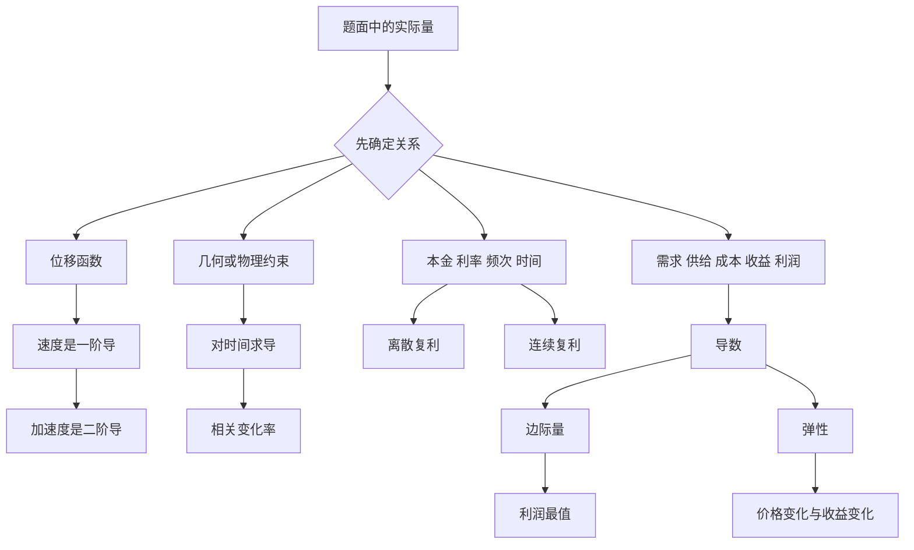

# 高数第7讲 一元函数微分学的应用（三）物理应用与经济应用

> [!info] 教材来源
> `27张宇基础30讲高数.pdf`，印刷页 186-194 / PDF p191-p199。物理应用与相关变化率仅数学一、数学二要求；复利、连续复利与导数的经济应用仅数学三要求。

## 本讲速览

- 本讲把“导数是变化率”落到实际问题：先把题面翻译成函数关系，再求所需变化率。
- 物理题的主线是 $s\to v\to a$；相关变化率题的主线是“建关系式 → 对时间求导 → 最后代瞬时值”。
- 计息题必须先辨认计息频率：每年一次、每年 $n$ 次、连续复利对应三个不同模型。
- 经济题先分清自变量：通常需求/供给以价格 $p$ 为自变量，成本/收益/利润以产量或销量 $Q$ 为自变量。
- 边际量是“再增加一个单位时总量的近似增量”；弹性是“自变量变化 $1\%$ 时因变量约变化百分之几”。
- 例题和练习集中考查：相关变化率建模、现值最优化、边际解释、弹性与收益增减。

## 教材路线

| 教材顺序 | 内容 | 页码 |
|---|---|---|
| 开篇 | 考题范围、目标、知识结构 | 印刷页186 / PDF p191 |
| 一 | 物理应用：速度、加速度、牛顿第二定律 | 印刷页186-187 / PDF p191-p192 |
| 一 | 相关变化率及例7.1 | 印刷页187-188 / PDF p192-p193 |
| 二 | 复利、每年多次复利、连续复利及例7.2 | 印刷页188-189 / PDF p193-p194 |
| 三（1） | 需求、供给、成本、收益、利润函数 | 印刷页189-190 / PDF p194-p195 |
| 三（2） | 边际函数与边际分析 | 印刷页190 / PDF p195 |
| 三（3） | 弹性函数、三类价格弹性及例7.3-7.5 | 印刷页190-193 / PDF p195-p198 |
| 练习 | 练习7.1-7.4及答案 | 印刷页193-194 / PDF p198-p199 |

## 前置知识与关联导航

- 求导规则与链式法则：[[04_高数第4讲_一元函数微分学的计算|第4讲 一元函数微分学的计算]]。
- 极值、最值与二阶导判别：[[05_高数第5讲_一元函数微分学的应用一_几何应用#7. 闭区间最值|闭区间最值]]。
- 指数函数极限 $\lim_{n\to\infty}(1+r/n)^n=e^r$：[[01_高数第1讲_函数极限与连续|第1讲 函数极限与连续]]。
- 由运动规律建立微分方程：[[15_高数第15讲_微分方程#13. 物理应用|微分方程的物理应用]]。
- 由边际量恢复总量：[[12_高数第12讲_一元函数积分学的应用三#8. 总成本与边际成本|总成本与边际成本]]。

## 知识网络

## 知识点清单

## 一、物理应用与相关变化率

### 1. 运动学

设质点位移为 $s=s(t)$。

$$
v(t)=\lim_{\Delta t\to0}\frac{\Delta s}{\Delta t}
=\frac{\mathrm ds}{\mathrm dt}=s'(t),
$$

$$
a(t)=\lim_{\Delta t\to0}\frac{\Delta v}{\Delta t}
=\frac{\mathrm dv}{\mathrm dt}=v'(t)=s''(t).
$$

- **直观理解**：速度描述位移变化得多快，加速度描述速度变化得多快。
- **牛顿第二定律**：$F=ma$。若力、质量或运动状态给成函数，常把 $a=s''(t)$ 代入后建立微分方程。
- **二级结论**：若速度可看作位移的函数 $v=v(s)$，则

$$
a=\frac{\mathrm dv}{\mathrm dt}
=\frac{\mathrm dv}{\mathrm ds}\frac{\mathrm ds}{\mathrm dt}
=v\frac{\mathrm dv}{\mathrm ds}.
$$

> [!tip] 看到什么想到它
> 给位移方程就连续求导得到速度、加速度；给 $v$ 与 $s$ 的关系而时间难消去，就想到 $a=v\,\mathrm dv/\mathrm ds$。

### 2. 相关变化率

若 $A=A(C)$、$C=C(B)$，链式法则给出

$$
\frac{\mathrm dA}{\mathrm dB}
=\frac{\mathrm dA}{\mathrm dC}\frac{\mathrm dC}{\mathrm dB}.
$$

若已知 $\mathrm dA/\mathrm dB$ 与 $\mathrm dC/\mathrm dB$，且 $\mathrm dC/\mathrm dB\ne0$，则

$$
\frac{\mathrm dA}{\mathrm dC}
=\frac{\mathrm dA/\mathrm dB}{\mathrm dC/\mathrm dB}.
$$

实际题中常把 $B$ 换成时间 $t$。若 $y=f(x)$，且 $x=x(t)$、$y=y(t)$，则

$$
\frac{\mathrm dy}{\mathrm dt}
=\frac{\mathrm dy}{\mathrm dx}\frac{\mathrm dx}{\mathrm dt}
=f'(x)\frac{\mathrm dx}{\mathrm dt}.
$$

这说明两个实际量的变化率由它们之间的函数关系联系起来。若有隐式关系 $F(x,y)=0$，则对 $t$ 求导：

$$
F_x\frac{\mathrm dx}{\mathrm dt}
+F_y\frac{\mathrm dy}{\mathrm dt}=0.
$$

#### 统一解题流程

1. 设出所有随时间变化的量，并标明正方向和单位。
2. 先写不含变化率的几何、物理或数量关系。
3. 保持变量形式，对等式两边关于 $t$ 求导。
4. 解出目标变化率，最后代入题目指定时刻的瞬时数据。
5. 用正负号解释“增大/减小、靠近/远离”。

> [!warning] 为什么必须最后代值
> 某量在指定时刻等于常数，不代表它在整个过程中是常数。若先代值再求导，会错误地把变量导数变成 $0$。

#### 例7.1：曲线上运动点到原点的距离

- **题面信号**：给曲线 $y=x^3$、横坐标变化率 $\mathrm dx/\mathrm dt=v_0$，求距离 $l$ 的变化率。
- **关系式**：$l=\sqrt{x^2+y^2}=\sqrt{x^2+x^6}$。
- **入口**：先求 $\mathrm dl/\mathrm dx$，再乘 $\mathrm dx/\mathrm dt$；在 $(1,1)$ 代值后得 $\mathrm dl/\mathrm dt=2\sqrt2v_0$。
- **迁移**：凡“点沿曲线运动，求到定点距离变化率”，先用距离公式把目标量写成一个坐标的函数。

## 二、复利与连续复利（仅数学三）

设初始本金为 $A$，年利率为 $r$，存款时间为 $t$ 年。

### 1. 每年计息一次

一年后乘一次 $(1+r)$，$t$ 年后的余额为

$$
A_t=A(1+r)^t.
$$

教材先写一般递推结果 $A_m=A(1+r)^m$，本质是“每期余额继续作为下一期本金”。

### 2. 每年计息 $n$ 次

每期利率为 $r/n$，共计息 $nt$ 次：

$$
A_t=A\left(1+\frac rn\right)^{nt}.
$$

### 3. 连续复利

令每年计息次数 $n\to\infty$：

$$
A_t=\lim_{n\to\infty}A\left(1+\frac rn\right)^{nt}=Ae^{rt}.
$$

> [!tip] 看到什么想到它
> “每年一次”用 $(1+r)^t$；“每年 $n$ 次”先把年利率除以 $n$、次数乘以 $n$；“连续复利/连续贴现”用指数因子 $e^{\pm rt}$。

### 4. 例7.2：售价增长与现值贴现的最优时间

酒窖藏 $t$ 年后的名义收入为 $R=R_0e^{\frac25\sqrt t}$，连续复利率为 $r$。未来收入折算到现在的现值为

$$
A(t)=Re^{-rt}=R_0e^{\frac25\sqrt t-rt}.
$$

求导：

$$
A'(t)=R_0e^{\frac25\sqrt t-rt}
\left(\frac1{5\sqrt t}-r\right).
$$

指数因子恒正，所以只需研究括号的符号。最大现值时

$$
t_0=\frac1{25r^2}.
$$

当 $r=6\%=0.06$ 时，$t_0=100/9\approx11$ 年。

- **关键翻译**：题目比较的是不同年份收入的“现值”，不能直接最大化未来售价 $R(t)$。
- **通用步骤**：写未来价值 → 乘贴现因子 → 化为一元函数 → 用导数求最值。

## 三、导数的经济应用（仅数学三）

### 1. 经济学中常见的函数

| 函数 | 定义与常见性质 | 自变量提醒 |
|---|---|---|
| 需求函数 | $Q=Q(p)$，一般随价格 $p$ 增大而减小，即 $Q'(p)<0$ | 价格 $p$ |
| 供给函数 | $q=q(p)$，一般随价格 $p$ 增大而增加，即 $q'(p)>0$ | 价格 $p$ |
| 成本函数 | $C=C(Q)=C_1+C_2(Q)$，$C_1$ 为固定成本，$C_2$ 为可变成本 | 产量 $Q$ |
| 平均成本 | $AC=\dfrac{C(Q)}Q=\dfrac{C_1}Q+\dfrac{C_2(Q)}Q$ | 产量 $Q>0$ |
| 收益函数 | $R=R(Q)=pQ$；若价格依赖销量，则 $R(Q)=p(Q)Q$ | 销量 $Q$ |
| 利润函数 | $L=L(Q)=R(Q)-C(Q)$ | 产量或销量 $Q$ |

教材约定：若无特殊说明，需求、供给函数以价格 $p$ 为自变量；成本、收益、利润函数以产量 $Q$ 为自变量。

### 5. 边际函数

若 $f$ 可导，则 $f'(x)$ 称为 $f(x)$ 的边际函数，$f'(x_0)$ 为 $x_0$ 处的边际值。由微分近似

$$
f(x_0+\Delta x)-f(x_0)\approx f'(x_0)\Delta x.
$$

取 $\Delta x=1$：

$$
f(x_0+1)-f(x_0)\approx f'(x_0).
$$

因此边际值表示：在当前水平 $x_0$ 附近，自变量再增加 $1$ 个单位时，函数值约改变多少单位。边际值的正负说明总量与自变量同向还是反向变化。

$$
MC=C'(Q),\qquad MR=R'(Q),\qquad ML=L'(Q).
$$

- $MC$：边际成本；多生产一个单位时总成本的近似增量。
- $MR$：边际收益；多销售一个单位时总收益的近似增量。
- $ML$：边际利润；多销售一个单位时利润的近似增量。
- 因 $L=R-C$，故 $ML=MR-MC$。内部利润驻点满足 $ML=0$，即 $MR=MC$；还要用二阶导、单调性或端点比较确认最大值。

> [!warning] 边际不是平均
> $AC=C/Q$ 是“每件平均成本”，$MC=C'$ 是“再增加一件的近似成本”。除非函数具有特殊形式，两者不相等。

### 6. 弹性函数与弹性分析

导数 $f'(x)$ 比较的是绝对改变量；弹性比较的是相对改变量。对 $y=f(x)$，定义

$$
\eta=\lim_{\Delta x\to0}
\frac{\Delta y/y}{\Delta x/x}
=\frac{x}{y}f'(x).
$$

在 $x=x_0$ 处的点弹性为

$$
\eta(x_0)=\frac{x_0}{f(x_0)}f'(x_0),
\qquad f(x_0)\ne0.
$$

其经济解释是：在 $x_0$ 附近，$x$ 改变 $1\%$ 时，$y$ 约改变 $\eta(x_0)\%$；$|\eta|$ 表示变化幅度，符号表示同向或反向。

#### （1）需求的价格弹性

按带符号定义：

$$
\eta_d=\frac pQ\frac{\mathrm dQ}{\mathrm dp}<0.
$$

经济题常把需求弹性规定为正数：

$$
\varepsilon=-\frac pQ\frac{\mathrm dQ}{\mathrm dp}>0.
$$

做题必须先看题目采用 $\eta_d<0$ 还是 $\varepsilon>0$ 的约定，不可混用。

#### （2）供给的价格弹性

$$
\eta_s=\frac pq\frac{\mathrm dq}{\mathrm dp}>0.
$$

#### （3）收益的价格弹性

$$
\eta_r=\frac pR\frac{\mathrm dR}{\mathrm dp}.
$$

教材在定义处按一般递增情形解释 $R'(p)>0$。但收益是“价格 × 销量”，具体题中并不必然随价格增加；应继续结合需求弹性判断，不能把 $R'(p)>0$ 当作无条件结论。

若采用正的需求价格弹性 $\varepsilon=-pQ'/Q$，由 $R=pQ(p)$ 得

$$
\frac{\mathrm dR}{\mathrm dp}
=Q+pQ'=Q(1-\varepsilon),
$$

$$
\eta_r=\frac pR\frac{\mathrm dR}{\mathrm dp}=1-\varepsilon.
$$

于是：

| 需求弹性 | $\mathrm dR/\mathrm dp$ | 涨价时收益 | 降价时收益 |
|---|---:|---|---|
| $0<\varepsilon<1$，缺乏弹性 | $>0$ | 增加 | 减少 |
| $\varepsilon=1$，单位弹性 | $=0$ | 一阶近似不变 | 一阶近似不变 |
| $\varepsilon>1$，富有弹性 | $<0$ | 减少 | 增加 |

> [!tip] 看到什么想到它
> 题目问“涨价/降价后总收益如何变化”，不要只看需求量下降；先用 $R=pQ$ 推出 $R'=Q(1-\varepsilon)$，再同时看 $1-\varepsilon$ 与 $\Delta p$ 的符号。

### 7. 教材经济例题的方法

#### 例7.3：边际利润与利润最大化

由固定成本、单位可变成本和价格函数先建模：

$$
C(Q)=60000+20Q,
$$

$$
p=60-\frac Q{1000},\qquad
R(Q)=pQ=60Q-\frac{Q^2}{1000},
$$

$$
L(Q)=R-C=-\frac{Q^2}{1000}+40Q-60000.
$$

因此

$$
ML=L'(Q)=-\frac Q{500}+40.
$$

- 当 $p=50$ 时，由价格函数先求 $Q=10000$，于是 $ML=20$：第 $10001$ 件商品带来的利润增量约为 $20$ 元。
- 令 $ML=0$ 得 $Q=20000$；因 $L''<0$，利润最大，对应价格 $p=40$。

#### 例7.4：由需求弹性判断收益弹性

核心恒等式是

$$
R=pQ(p),\qquad
\frac{\mathrm dR}{\mathrm dp}=Q(1-\varepsilon).
$$

教材给 $\varepsilon=\dfrac{2p^2}{192-p^2}$。在 $p=6$ 时

$$
\eta_r=1-\varepsilon
=\frac{192-3p^2}{192-p^2}\bigg|_{p=6}
=\frac7{13}\approx0.54.
$$

解释：价格上涨 $1\%$ 时，总收益约增加 $0.54\%$。

#### 例7.5：弹性选择题的判号

由 $\Delta R\approx R'(p)\Delta p=Q(1-\varepsilon)\Delta p$：

- $\varepsilon<1$ 时，$\Delta R$ 与 $\Delta p$ 同号；
- $\varepsilon>1$ 时，$\Delta R$ 与 $\Delta p$ 异号。

题目选项必须同时检查弹性区间、价格变化方向和收益变化方向。

## 公式与二级结论索引

| 结论 | 完整条件与用途 | 详解 |
|---|---|---|
| $v=s'(t),\ a=s''(t)$ | 位移是时间的可导函数 | [[#1. 运动学\|运动学]] |
| $a=v\,\mathrm dv/\mathrm ds$ | $v=v(s)$ 且相关导数存在 | [[#1. 运动学\|运动学二级结论]] |
| $\mathrm dy/\mathrm dt=f'(x)\mathrm dx/\mathrm dt$ | $y=f(x)$，$x=x(t)$ | [[#2. 相关变化率\|相关变化率]] |
| $A_t=A(1+r)^t$ | 年利率 $r$，每年计息一次 | [[#1. 每年计息一次\|每年一次复利]] |
| $A_t=A(1+r/n)^{nt}$ | 年利率 $r$，每年计息 $n$ 次，共 $t$ 年 | [[#2. 每年计息 $n$ 次\|分期复利]] |
| $A_t=Ae^{rt}$ | 连续复利；贴现时使用 $e^{-rt}$ | [[#3. 连续复利\|连续复利]] |
| $L=R-C$ | 收益与成本须采用同一自变量 | [[#1. 经济学中常见的函数\|经济函数]] |
| $MC=C',\ MR=R',\ ML=L'$ | 边际值是增加一个单位时总量的近似增量 | [[#5. 边际函数\|边际函数]] |
| $ML=MR-MC$ | 因 $L=R-C$；内部利润驻点常满足 $MR=MC$ | [[#5. 边际函数\|边际利润]] |
| $\eta=(x/y)y'$ | $y\ne0$；衡量相对变化率 | [[#6. 弹性函数与弹性分析\|弹性]] |
| $R'=Q(1-\varepsilon)$ | $R=pQ(p)$，$\varepsilon=-pQ'/Q>0$ | [[#（3）收益的价格弹性\|收益与弹性]] |

## 题型-方法决策表

| 题面信号 | 首选入口 | 关键检查 |
|---|---|---|
| 位移、速度、加速度 | $v=s'$，$a=s''$ | 位移是否带方向；题目要速度还是速率 |
| 多个量同时随时间变化 | 先写变量关系，再对 $t$ 求导 | 先求导后代瞬时值；速度符号是否正确 |
| 点沿曲线运动，求距离变化 | 距离公式 + 链式法则 | 曲线方程能否消去一个坐标 |
| 每年一次/每年 $n$ 次/连续计息 | 选对应复利模型 | 年利率、期利率和总期数是否匹配 |
| 未来收益与当前价值比较 | 未来价值乘 $e^{-rt}$ | 最大化的是现值，不是名义收入 |
| 给成本、价格或需求，求利润 | 先写 $C,R,L=R-C$ | 各函数自变量和单位保持一致 |
| “再生产/销售一个单位” | 求相应边际函数 | 结果是近似增量，不是平均量 |
| 求最大利润 | $L'=0$ 或 $MR=MC$ | 可行域、二阶导和端点 |
| 自变量改变 $1\%$ | 弹性 $(x/y)y'$ | 题目采用带符号还是正值需求弹性 |
| 涨价或降价对总收益的影响 | $R'=Q(1-\varepsilon)$ | 同时判断 $1-\varepsilon$ 与 $\Delta p$ |

## 教材例题覆盖表

| 例题 | 考查知识 | 题面信号 | 解法入口与独有方法 |
|---|---|---|---|
| 例7.1 | 曲线运动的相关变化率 | 给 $y=x^3$ 与 $\mathrm dx/\mathrm dt$，求到原点距离变化率 | 距离式先化成 $l(x)$，再用 $\mathrm dl/\mathrm dt=(\mathrm dl/\mathrm dx)(\mathrm dx/\mathrm dt)$ |
| 例7.2 | 连续复利、贴现与最值 | 售价随藏酒时间增长，要求现值最大 | 名义收入乘 $e^{-rt}$，指数因子恒正后只判括号符号 |
| 例7.3 | 经济函数、边际利润、利润最大 | 固定成本、单位成本、价格函数 | 依次建 $C,R,L$；边际解释后令 $L'=0$ 并验证最大 |
| 例7.4 | 需求弹性与收益弹性 | 已知 $\varepsilon(p)$，求收益对价格弹性 | 从 $R=pQ$ 推出 $R'=Q(1-\varepsilon)$，得 $\eta_r=1-\varepsilon$ |
| 例7.5 | 弹性判号 | 比较 $\varepsilon$、$\Delta p$、$\Delta R$ | 看 $\Delta R\approx Q(1-\varepsilon)\Delta p$ 的乘积符号 |

## 讲末练习反查

| 练习 | 依赖知识 | 只看笔记应想到的第一步 | 答案/检查点 |
|---|---|---|---|
| 练习7.1 | 曲线运动与距离变化率 | 由 $x=y^2$ 得 $y^2=x$，写 $s=\sqrt{x^2+x}$ | $x=9$ 时 $\mathrm ds/\mathrm dt=95/(6\sqrt{10})\ \mathrm{cm/s}$ |
| 练习7.2 | 正需求弹性与收益边际 | $s=\mathrm d(pQ)/\mathrm dp=Q(1-\varepsilon)$ | $Q=s/(1-\varepsilon)$，条件 $0<\varepsilon<1$ 保证分母正 |
| 练习7.3 | 两车距离相关变化率 | 设两方向路程为 $x,y$，由初始间隔写 $s^2=x^2+(y+10)^2$ | 1小时后 $\mathrm ds/\mathrm dt=196/\sqrt{41}\approx30.6\ \mathrm{km/h}$ |
| 练习7.4 | 利润、边际量与最大值 | 写 $L=R-C$，再分别求 $MR,MC,L'$ | 可行域 $x>0$；最大利润在 $x=1$，最大值 $11$ |

## 易错点/易混点

1. **把瞬时值当常量**：相关变化率必须先保留变量求导，最后才代指定时刻的数据。
2. **速度与速率混淆**：一维速度可带正负；“距离的变化率”也可能为负，负号表示距离缩短。
3. **漏掉链式因子**：$\mathrm dy/\mathrm dt$ 不是单独的 $f'(x)$，还要乘 $\mathrm dx/\mathrm dt$。
4. **计息频率错位**：每年 $n$ 次时，期利率是 $r/n$，总期数是 $nt$，二者必须同时变化。
5. **现值与终值混淆**：未来金额折现到现在乘 $e^{-rt}$；现在本金增长到未来乘 $e^{rt}$。
6. **经济函数自变量混乱**：若已知 $p=p(Q)$，先把 $R=p(Q)Q$ 写成 $Q$ 的函数再求边际收益。
7. **把边际值当精确差值**：一般只有 $f(Q+1)-f(Q)\approx f'(Q)$；导数给的是局部近似。
8. **把边际成本当平均成本**：$MC=C'$，$AC=C/Q$，含义和计算都不同。
9. **只解 $L'=0$ 就宣布最大**：还要排除不可行根，并用 $L''<0$、单调性或端点比较验证。
10. **需求弹性符号混用**：带符号弹性 $pQ'/Q<0$；教材题也可能另定义正弹性 $-pQ'/Q>0$。
11. **只看弹性不看价格方向**：$\varepsilon<1$ 只说明 $R'(p)>0$，收益实际增减还取决于 $\Delta p$。
12. **漏单位和经济解释**：边际利润的单位是“元/件”，弹性无量纲，结果应回到题意解释。

## 注解

### 应用题真正难在哪里

求导本身通常不难，难点是把文字条件翻译成“目标量、关系式、自变量”三件事。先问：题目最终求哪个量？哪些量在变？哪条几何、物理或经济关系把它们连接起来？关系式一旦正确，后面基本就是链式法则或极值判定。

### 边际与弹性为什么要同时学

- 边际 $y'$ 回答“$x$ 多一个单位，$y$ 大约多多少”，保留单位，适合成本、收益、利润的局部增量。
- 弹性 $(x/y)y'$ 回答“$x$ 多 $1\%$，$y$ 大约多百分之几”，消除单位，适合比较不同量级的敏感程度。

### 利润最大为何常写成 $MR=MC$

因为 $L'=R'-C'=MR-MC$。当多卖一件带来的新增收益仍大于新增成本时，继续增产可提高利润；两者相等是内部驻点，但是否为最大值仍要结合可行域和导数符号判断。

## 速背检查

- [ ] 位移、速度、加速度分别是什么关系？$v=s'$，$a=s''$。
- [ ] 何时可用 $a=v\,\mathrm dv/\mathrm ds$？当速度可写成位移的函数时。
- [ ] 相关变化率题为什么先求导后代值？指定时刻的数值不是全过程中的常量。
- [ ] $y=f(x)$ 且 $x=x(t)$ 时，$\mathrm dy/\mathrm dt$ 是什么？$f'(x)\mathrm dx/\mathrm dt$。
- [ ] 每年计息一次的 $t$ 年终值？$A(1+r)^t$。
- [ ] 每年计息 $n$ 次的 $t$ 年终值？$A(1+r/n)^{nt}$。
- [ ] 连续复利与连续贴现因子？分别为 $e^{rt}$、$e^{-rt}$。
- [ ] 需求、供给函数通常以什么为自变量？价格 $p$。
- [ ] 成本、收益、利润函数通常以什么为自变量？产量或销量 $Q$。
- [ ] 平均成本与边际成本？$AC=C/Q$，$MC=C'$。
- [ ] 边际值的实际含义？自变量增加一个单位时总量的近似增量。
- [ ] 利润内部驻点的经济条件？$MR=MC$，并需继续验证最大性。
- [ ] 弹性公式及含义？$\eta=(x/y)y'$，表示相对变化的敏感度。
- [ ] 为什么需求弹性有正负两套写法？$Q'(p)<0$，经济题常加负号把其大小定义为正数。
- [ ] 采用正需求弹性 $\varepsilon$ 时，$R'(p)$？$Q(1-\varepsilon)$。
- [ ] $0<\varepsilon<1$ 时涨价对收益的影响？收益增加。
- [ ] $\varepsilon>1$ 时降价对收益的影响？收益增加。
- [ ] 求实际最值还必须检查什么？可行域、端点、二阶导或单调性、单位。

## OCR/视觉核查

- PDF p191-p199 共 9 页已全部渲染并 OCR，3 张全页联系图已逐张阅读。
- 9 页均已高清复核；公式、上下标、正负号、例题7.1-7.5和练习7.1-7.4答案以原页为准，OCR仅用于文字骨架。
- 证据记录：[[00_OCR视觉核查报告#07 高数 一元函数微分学的应用（三）物理应用与经济应用|本讲 OCR/视觉核查报告]]。

## 相关链接

- [[06_高数第6讲_一元函数微分学的应用二|上一讲：中值定理、微分等式与微分不等式]]
- [[08_高数第8讲_一元函数积分学的概念与性质|下一讲：一元函数积分学的概念与性质]]
- [[12_高数第12讲_一元函数积分学的应用三#8. 总成本与边际成本|由边际量求总量]]
- [[15_高数第15讲_微分方程#13. 物理应用|运动规律与微分方程]]
