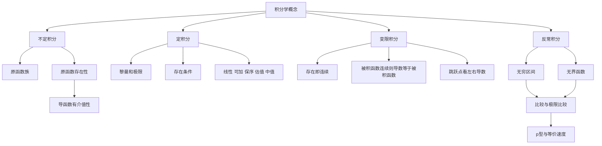

# 高数第8讲 一元函数积分学的概念与性质

> [!info] 教材来源
> `27张宇基础30讲高数.pdf`，印刷页 195-229 / PDF p200-p234。本讲考查不定积分、定积分、变限积分与反常积分，题型以选择题、填空题为主。

## 本讲速览

- **不定积分**研究“谁求导得到 $f$”；核心是原函数定义、存在性及导函数的特殊性质。
- **定积分**研究有限区间上黎曼和的极限；核心是定义中的“两任取”、存在条件和六类基本性质。
- 原函数存在与定积分存在没有简单的互推关系：教材用例8.3集中展示“有无原函数 × 是否可积”的四种组合。
- **变限积分**把积分值看成上限的函数：只要存在就连续；被积函数连续时才可直接得到 $F'=f$。
- **反常积分**是用极限定义的另一类积分；先找奇点并拆分，再用比较、极限比较和 $p$ 型结论判敛散。
- 做题主线：辨认积分种类 → 检查成立条件 → 选择定义、性质或比较对象 → 最后解释连续、可导或敛散结论。

## 教材路线

| 教材顺序 | 内容 | 页码 |
|---|---|---|
| 开篇 | 考纲目标与知识结构 | 印刷页195 / PDF p200 |
| 一（1） | 原函数与不定积分、例8.1-8.2 | 印刷页196-197 / PDF p201-p202 |
| 一（2） | 原函数存在定理、导函数的达布性质与间断点 | 印刷页197-203 / PDF p202-p208 |
| 二（1） | 定积分定义、几何意义、黎曼和特取 | 印刷页204-206 / PDF p209-p211 |
| 二（2） | 定积分存在的充分与必要条件 | 印刷页206-207 / PDF p211-p212 |
| 二（3） | 定积分性质及例8.3-8.10 | 印刷页207-214 / PDF p212-p219 |
| 三 | 变限积分概念、性质及例8.11-8.14 | 印刷页214-218 / PDF p219-p223 |
| 四（1） | 两类反常积分的概念与敛散性 | 印刷页218-219 / PDF p223-p224 |
| 四（2） | 比较判别、极限比较、$p$ 型结论及例8.15-8.19 | 印刷页220-225 / PDF p225-p230 |
| 练习 | 练习8.1-8.7及答案 | 印刷页225-229 / PDF p230-p234 |

## 前置知识与关联导航

- 连续、间断点与介值定理：[[01_高数第1讲_函数极限与连续#10. 连续与间断|连续与间断]]。
- 导数定义、左右导数与可导必连续：[[03_高数第3讲_一元函数微分学的概念#2. 导数定义|导数定义]]。
- 导数的介值性与中值定理：[[06_高数第6讲_一元函数微分学的应用二#（一）只涉及函数值的中值定理|介值定理]]。
- 下一讲将解决具体积分计算：[[09_高数第9讲_一元函数积分学的计算|第9讲 一元函数积分学的计算]]。

## 知识网络

## 知识点清单

## 一、不定积分

### 1. 原函数

设 $f(x)$ 定义在区间 $I$ 上。若存在可导函数 $F(x)$，使对任意 $x\in I$ 都有

$$
F'(x)=f(x),
$$

则称 $F$ 是 $f$ 在区间 $I$ 上的一个原函数。

- 原函数必须说明所在区间；同一表达式跨越奇点时，积分常数可分别取值。
- 若 $F$ 是一个原函数，则 $F+C$ 都是原函数。
- 若 $F_1,F_2$ 都是同一区间上的原函数，则 $(F_1-F_2)'=0$，故 $F_1-F_2=C$。

因此一旦存在原函数，原函数不是一个，而是相差常数的整个函数族。

### 2. 不定积分

函数 $f$ 在区间 $I$ 上的全体原函数记为

$$
\int f(x)\,\mathrm dx=F(x)+C,
\qquad F'(x)=f(x).
$$

这里的积分号只是表示原函数族的记号，不是一个确定数值。

$$
\left(\int f(x)\,\mathrm dx\right)'=f(x),
\qquad
\int F'(x)\,\mathrm dx=F(x)+C.
$$

线性性质：

$$
\int[k_1f(x)+k_2g(x)]\,\mathrm dx
=k_1\int f(x)\,\mathrm dx+k_2\int g(x)\,\mathrm dx.
$$

> [!warning] 不定积分与定积分
> $\int f(x)\,\mathrm dx$ 表示函数族；$\int_a^b f(x)\,\mathrm dx$ 表示一个数。前者要带 $+C$，后者不能带 $+C$。

#### 例8.1：积分等式反求复合函数

题目给出

$$
\int(1-x^2)f(x^2)\,\mathrm dx=\arcsin x+C,
\qquad 0<x<1.
$$

两边求导：

$$
(1-x^2)f(x^2)=\frac1{\sqrt{1-x^2}},
$$

故 $f(x^2)=(1-x^2)^{-3/2}$，再把 $x^2$ 整体换元，得

$$
f(x)=(1-x)^{-3/2}.
$$

**看到什么想到它**：题目给“不定积分等于某函数”，先两边求导，再处理复合自变量。

#### 例8.2：分段函数的原函数

分段积分后还要同时满足：

1. 每段导数等于对应的 $f(x)$；
2. 原函数在分界点可导，首先必须连续。

教材函数的正确原函数为

$$
F(x)=
\begin{cases}
\ln\left(\sqrt{1+x^2}+x\right)+1,&x\le0,\\
(x+1)\sin x+\cos x,&x>0.
\end{cases}
$$

两段在 $x=0$ 的值都为 $1$，并且各段求导后与原函数相符。

### 3. 原函数存在定理

#### （1）连续函数必有原函数

若 $f\in C[a,b]$，定义

$$
F(x)=\int_a^x f(t)\,\mathrm dt,
$$

则 $F$ 在 $[a,b]$ 上可导，且 $F'(x)=f(x)$，所以连续函数一定有原函数。

**证明主线**：

$$
\frac{F(x+\Delta x)-F(x)}{\Delta x}
=\frac1{\Delta x}\int_x^{x+\Delta x}f(t)\,\mathrm dt
=f(\xi)\to f(x),
$$

其中最后一步使用积分中值定理和 $f$ 的连续性。

#### （2）第一类间断点、无穷间断点会阻止原函数存在

若 $f$ 在区间内部含有可去间断、跳跃间断或无穷间断，则 $f$ 不可能是某个可导函数的导函数，因而在包含该点的区间上没有原函数。

理由不是“导数必连续”，而是导函数具有比一般函数更强的性质。

### 4. 导函数的特殊性质

#### （1）导函数极限若存在，就等于该点导数值

若 $F'(x_0)$ 存在，且 $\lim_{x\to x_0}F'(x)=A$ 存在，则由洛必达思想

$$
F'(x_0)=\lim_{x\to x_0}\frac{F(x)-F(x_0)}{x-x_0}
=\lim_{x\to x_0}F'(x)=A.
$$

所以导函数在该点连续。注意：这里额外要求导函数的极限存在，不能误记为“导函数处处连续”。

#### （2）达布定理：导函数具有介值性

若 $F$ 在 $[a,b]$ 上可导，$F'(a)\ne F'(b)$，则对任意介于两者之间的 $u$，存在 $\xi\in(a,b)$，使

$$
F'(\xi)=u.
$$

证明构造 $G(x)=F(x)-ux$，再用导数零点结论。

直接推论：

- 导函数不会有跳跃间断点或可去间断点；
- 若 $F'(x)$ 在区间上处处存在且从不为 $0$，则 $F'$ 必恒正或恒负；
- 导函数可以不连续，但不能“跳过”中间值。

#### （3）振荡间断点是否有原函数不能一概而论

教材给出两类振荡例子：

- $F(x)=x^2\sin(1/x)$（$x\ne0$，且 $F(0)=0$）可导，其导函数在 $0$ 振荡不连续，因此**导函数不一定连续**。
- 另一些带振荡间断点的函数虽“点点相依”，仍无法构造原函数。

判定时应回到定义、构造候选原函数或使用达布性质，不能仅凭“振荡”二字下结论。

> [!tip] 知识链
> $f$ 连续 $\Rightarrow$ $f$ 有原函数；$f$ 有第一类或无穷间断点 $\Rightarrow$ 无原函数；$f$ 有振荡间断点 $\Rightarrow$ 不确定。

## 二、定积分

### 4. 定积分定义

设 $f$ 在有限区间 $[a,b]$ 上有界。任意分割

$$
a=x_0<x_1<\cdots<x_n=b,
$$

记 $\Delta x_i=x_i-x_{i-1}$，在每段任取 $\xi_i\in[x_{i-1},x_i]$，并令

$$
\lambda=\max_i\Delta x_i.
$$

若极限

$$
\lim_{\lambda\to0}\sum_{i=1}^n f(\xi_i)\Delta x_i
$$

存在，且与分点和取点方法无关，则称 $f$ 在 $[a,b]$ 上可积，并记为

$$
\int_a^b f(x)\,\mathrm dx.
$$

> [!important] 定义中的两个“任取”
> 分割任取、每段取点任取。只有极限与两种选择都无关，才是黎曼可积。

#### 等分右端点的常用特取

$$
\int_a^b f(x)\,\mathrm dx
=\lim_{n\to\infty}\frac{b-a}{n}
\sum_{i=1}^n f\left(a+\frac{i(b-a)}n\right).
$$

特别地，

$$
\int_0^1f(x)\,\mathrm dx
=\lim_{n\to\infty}\frac1n\sum_{i=1}^nf\left(\frac in\right).
$$

### 5. 定积分几何意义

在 $[a,b]$ 上：

- $f\ge0$ 时，定积分等于曲线与 $x$ 轴围成的面积；
- $f\le0$ 时，定积分等于该面积的负值；
- $f$ 有正有负时，定积分等于“轴上面积 - 轴下面积”，是代数面积。

因此总面积应计算 $\int_a^b|f(x)|\,\mathrm dx$，不能把 $\left|\int_a^bf\right|$ 当作总面积。

定积分值只与被积函数和积分区间有关，与积分变量字母无关：

$$
\int_a^bf(x)\,\mathrm dx
=\int_a^bf(t)\,\mathrm dt
=\int_a^bf(u)\,\mathrm du.
$$

### 6. 定积分存在定理

这里讨论的是**常义可积**：积分区间有限、函数有界。

#### 充分条件

以下任一条件可保证 $\int_a^bf(x)\,\mathrm dx$ 存在：

1. $f$ 在 $[a,b]$ 上连续；
2. $f$ 在 $[a,b]$ 上单调；
3. $f$ 在 $[a,b]$ 上有界，且只有有限个间断点；
4. $f$ 在 $[a,b]$ 上只有有限个第一类间断点。

#### 必要条件

若 $f$ 在有限区间 $[a,b]$ 上可积，则 $f$ 必有界。

- 有界只是必要条件，不是教材给出的充分条件；
- 函数无界时，常义定积分不存在，但相应的反常积分仍可能收敛。

#### 原函数存在与定积分存在的四种组合

| 函数特征 | 原函数 | 常义定积分 | 判断依据 |
|---|---|---|---|
| 有跳跃间断但有界 | 不存在 | 可以存在 | 导数无跳跃；有限第一类间断可积 |
| 是某可导函数的导函数但在一点无界振荡 | 存在 | 不存在 | 可积必要条件要求有界 |
| 含 $1/x$ 型无穷间断 | 不存在 | 不存在 | 无穷间断阻止原函数，且函数无界 |
| 有界振荡导函数 | 存在 | 可以存在 | 振荡间断不必阻止原函数；有界且有限间断可积 |

这正是例8.3的核心：**原函数存在性看“能否是导函数”，定积分存在性看黎曼可积条件，两者不可混判。**

### 7. 定积分基本性质

先约定

$$
\int_a^af(x)\,\mathrm dx=0,
\qquad
\int_a^bf(x)\,\mathrm dx=-\int_b^af(x)\,\mathrm dx.
$$

#### 性质1：区间长度

$$
\int_a^b1\,\mathrm dx=b-a.
$$

#### 性质2：线性

$$
\int_a^b[k_1f(x)+k_2g(x)]\,\mathrm dx
=k_1\int_a^bf(x)\,\mathrm dx+k_2\int_a^bg(x)\,\mathrm dx.
$$

#### 性质3：区间可加

无论 $a,b,c$ 的大小关系如何，

$$
\int_a^bf(x)\,\mathrm dx
=\int_a^cf(x)\,\mathrm dx+
\int_c^bf(x)\,\mathrm dx.
$$

#### 性质4：保序性

若 $a<b$ 且 $f(x)\le g(x)$，则

$$
\int_a^bf(x)\,\mathrm dx
\le\int_a^bg(x)\,\mathrm dx.
$$

特别地，

$$
\left|\int_a^bf(x)\,\mathrm dx\right|
\le\int_a^b|f(x)|\,\mathrm dx.
$$

若 $f,g$ 连续、$f\ge g$ 且不恒等，则严格不等式成立：

$$
\int_a^bf(x)\,\mathrm dx>
\int_a^bg(x)\,\mathrm dx.
$$

教材例8.7的证明方法：找一点使 $f-g>0$，利用连续性在该点附近得到一段统一正下界，再积分。

#### 性质5：估值定理

若 $m,M$ 分别为 $f$ 在 $[a,b]$ 上的最小值、最大值，$a<b$，则

$$
m(b-a)\le\int_a^bf(x)\,\mathrm dx\le M(b-a).
$$

### 题型8：积分中值定理

若 $f\in C[a,b]$，则存在 $\xi\in[a,b]$，使

$$
\int_a^bf(x)\,\mathrm dx=f(\xi)(b-a).
$$

等价地，函数在某点的值等于区间平均值：

$$
f(\xi)=\frac1{b-a}\int_a^bf(x)\,\mathrm dx.
$$

若要证明 $\xi\in(a,b)$，可对

$$
F(x)=\int_a^x f(t)\,\mathrm dt
$$

使用拉格朗日中值定理，或构造减去平均斜率的辅助函数再用罗尔定理。

### 8. 定积分定义与性质的典型用法

#### 例8.4：反函数图像与面积

对过原点的严格递增函数 $y=f(x)$ 及其反函数 $x=\varphi(y)$，

$$
I=\int_0^af(x)\,\mathrm dx+
\int_0^b\varphi(y)\,\mathrm dy.
$$

当 $a<\varphi(b)$ 时，图形分割可见 $I>ab$。题目同时考反函数图像关于 $y=x$ 对称和定积分的代数面积意义。

#### 例8.5：代数面积与总面积

$e^{-x}\sin x$ 在 $[0,+\infty)$ 上正负交替：

- $\left|\int_0^{+\infty}e^{-x}\sin x\,\mathrm dx\right|$ 是代数面积之差的绝对值，不是总面积；
- $\int_0^{+\infty}e^{-x}|\sin x|\,\mathrm dx$ 才是总面积；
- 按每个半周期面积绝对值求和也表示总面积。

#### 例8.6：凑黎曼和

$$
\lim_{n\to\infty}
\sum_{i=1}^n\frac{n+i}{n^2+i^2}
=\lim_{n\to\infty}
\sum_{i=1}^n
\frac{1+i/n}{1+(i/n)^2}\frac1n
=\int_0^1\frac{1+x}{1+x^2}\,\mathrm dx.
$$

凑定义三步：凑出 $1/n$；凑出 $i/n$；确认 $i/n$ 是 $[0,1]$ 的取点。

#### 例8.8：积分中值定理的证明入口

先由估值定理得到

$$
m\le\frac1{b-a}\int_a^bf(x)\,\mathrm dx\le M,
$$

再用连续函数介值定理找到对应的 $\xi$。

#### 例8.9：比较两个定积分

设

$$
I_1=\int_0^{\pi/4}\frac{\tan x}{x}\,\mathrm dx,
\qquad
I_2=\int_0^{\pi/4}\frac{x}{\tan x}\,\mathrm dx.
$$

由 $0<\sin x<x<\tan x$ 得 $I_1>I_2$；再估计 $\tan x/x<4/\pi$ 得 $I_1<1$，故

$$
1>I_1>I_2.
$$

#### 例8.10：复合函数积分比较

$$
M=\int_0^{\pi/2}\sin(\sin x)\,\mathrm dx,
\qquad
N=\int_0^{\pi/2}\cos(\cos x)\,\mathrm dx.
$$

由 $\sin(\sin x)<\sin x$ 得 $M<1$；对 $N$ 作 $x=\pi/2-t$，再用 $\cos(\sin t)>\cos t$ 得 $N>1$，所以

$$
M<1<N.
$$

## 三、变限积分

### 11. 变限积分

当 $x\in[a,b]$ 变化时，

$$
F(x)=\int_a^x f(t)\,\mathrm dt
$$

称为变上限积分。类似地可定义变下限积分和上下限都变化的积分。

### 12. 变限积分的三条核心性质

#### （1）只要变限积分存在，就一定连续

若 $f$ 在区间 $I$ 上可积，则 $f$ 有界，设 $|f|\le M$。于是

$$
|F(x+\Delta x)-F(x)|
=\left|\int_x^{x+\Delta x}f(t)\,\mathrm dt\right|
\le M|\Delta x|\to0.
$$

因此 $F$ 连续。这里不要求 $f$ 连续。

#### （2）被积函数连续时，变限积分可导

若 $f\in C(I)$，则

$$
F'(x)=f(x),
$$

所以 $F$ 是 $f$ 的一个原函数。

常用推论：

$$
\frac{\mathrm d}{\mathrm dx}
\int_{alpha(x)}^{\beta(x)}f(t)\,\mathrm dt
=f(\beta(x))\beta'(x)-f(\alpha(x))\alpha'(x),
$$

前提是 $f$ 在相关端点连续，$\alpha,\beta$ 可导。

#### （3）唯一间断点处看左右极限

若 $x_0$ 是 $f$ 的唯一跳跃间断点，则 $F$ 连续但不可导，且

$$
F'_-(x_0)=\lim_{x\to x_0^-}f(x),
\qquad
F'_+(x_0)=\lim_{x\to x_0^+}f(x).
$$

若 $x_0$ 是可去间断点，则 $F'(x_0)$ 存在，且

$$
F'(x_0)=\lim_{x\to x_0}f(x),
$$

但它可能不等于人为指定的 $f(x_0)$，此时 $F$ 不是整个区间上 $f$ 的原函数。

### 13. 变限积分例题方法

#### 例8.11：由 $f$ 的图像判断 $F$ 的图像

判断顺序：

1. $F(0)=0$，图像必须过原点；
2. 变限积分存在，所以 $F$ 必连续；
3. $f>0$ 时 $F$ 增，$f<0$ 时 $F$ 减；
4. $f$ 的跳跃点对应 $F$ 的不可导点。

#### 例8.12：跳跃点左右导数

$$
f(x)=
\begin{cases}
\cos x,&0\le x<\pi,\\
1,&\pi\le x\le2\pi.
\end{cases}
$$

对 $F(x)=\int_0^xf(t)\,\mathrm dt$，$F$ 在 $\pi$ 连续，但

$$
F'_-(\pi)=-1,\qquad F'_+(\pi)=1,
$$

故不可导。

#### 例8.13：可去间断点与“是不是原函数”

若

$$
f(x)=
\begin{cases}
e^{x^2}+x^2,&x\ne0,\\
a,&x=0,
\end{cases}
$$

则无论 $a$ 取何值，$F(x)=\int_{-1}^xf(t)\,\mathrm dt$ 在 $0$ 都可导且 $F'(0)=1$。只有 $a=1$ 时 $F'(0)=f(0)$，此时 $F$ 才是整个区间上 $f$ 的原函数。

#### 例8.14：变限积分表达式的有界性

若 $a>0$、$f$ 在 $[0,+\infty)$ 连续有界，$|f|\le M$，则

$$
y=e^{-ax}\left[\int_0^xf(t)e^{at}\,\mathrm dt+C\right]
$$

满足

$$
|y(x)|\le |C|+\frac Ma.
$$

方法是三角不等式加上指数积分估计；看到“证明变限积分表达式有界”，优先把外部衰减因子与内部增长因子配对。

## 四、反常积分

### 13. 反常积分定义

常义定积分要求区间有限、函数有界。破坏区间有限性得到无穷区间反常积分；破坏函数有界性得到无界函数反常积分。

#### （1）无穷区间

若 $F$ 是 $f$ 的原函数，则

$$
\int_a^{+\infty}f(x)\,\mathrm dx
=\lim_{b\to+\infty}[F(b)-F(a)].
$$

极限存在且有限则收敛，否则发散。$(-\infty,b]$ 同理。

$$
\int_{-\infty}^{+\infty}f(x)\,\mathrm dx
=\int_{-\infty}^{x_0}f(x)\,\mathrm dx
+\int_{x_0}^{+\infty}f(x)\,\mathrm dx.
$$

两边都收敛才收敛；不能让两个无穷大“相消”。

#### （2）无界函数

若 $b$ 是唯一瑕点，则

$$
\int_a^bf(x)\,\mathrm dx
=\lim_{t\to b^-}\int_a^tf(x)\,\mathrm dx.
$$

端点 $a$ 为瑕点时取 $t\to a^+$；内部 $c$ 为瑕点时必须拆成

$$
\int_a^bf(x)\,\mathrm dx
=\int_a^cf(x)\,\mathrm dx+
\int_c^bf(x)\,\mathrm dx,
$$

且两边都收敛。

> [!warning] 奇点必须逐个拆
> $\infty$ 与瑕点统称奇点。一个积分若含多个奇点，先拆成每段只有一个奇点的积分；任一段发散，原积分就发散。

### 14. 比较判别法

以下默认 $f,g$ 在奇点附近非负且连续。

#### 直接比较

若 $0\le f\le g$：

- $\int g$ 收敛 $\Rightarrow\int f$ 收敛；
- $\int f$ 发散 $\Rightarrow\int g$ 发散。

#### 极限比较

若在奇点处

$$
\lim\frac{f(x)}{g(x)}=\lambda,
$$

则：

| 极限 | 可用结论 |
|---|---|
| $0<\lambda<+\infty$ | $\int f$ 与 $\int g$ 同敛散 |
| $\lambda=0$ | 若 $\int g$ 收敛，则 $\int f$ 收敛 |
| $\lambda=+\infty$ | 若 $\int g$ 发散，则 $\int f$ 发散 |

零点瑕积分和无穷区间积分的逻辑完全相同，只是极限位置不同。

### 15. $p$ 型积分与“速度比较”

$$
\int_0^1\frac{\mathrm dx}{x^p}
\begin{cases}
\text{收敛},&0<p<1,\\
\text{发散},&p\ge1,
\end{cases}
$$

$$
\int_1^{+\infty}\frac{\mathrm dx}{x^p}
\begin{cases}
\text{收敛},&p>1,\\
\text{发散},&p\le1.
\end{cases}
$$

记忆逻辑：

- $x\to0^+$ 时，分母趋零过快会发散，所以要求 $p<1$；
- $x\to+\infty$ 时，分母增长足够快才收敛，所以要求 $p>1$。

常用等价：

$$
\sin x\sim x\quad(x\to0),
\qquad
(ax+b)^p\sim a^px^p\quad(x\to+\infty,a>0).
$$

和式主导项：若 $a>b>0$，则

$$
x^a+x^b\sim x^b\quad(x\to0^+),
$$

$$
x^a+x^b\sim x^a\quad(x\to+\infty).
$$

### 16. 反常积分例题方法

#### 例8.15：同一被积函数要分别检查 $0$ 与 $+\infty$

$$
\int_0^{+\infty}\frac{\mathrm dx}{x^a+x^b},
\qquad a>b>0.
$$

零点附近与 $1/x^b$ 同敛散，要求 $b<1$；无穷远与 $1/x^a$ 同敛散，要求 $a>1$。故条件为

$$
a>1,qquad b<1.
$$

#### 例8.16：先求等价阶再转成 $p$ 型

$$
\int_1^{+\infty}
\left(e^{-\cos(1/x)}-e^{-1}\right)x^k\,\mathrm dx.
$$

当 $x\to+\infty$，括号与 $1/x^2$ 同阶，故整体与 $1/x^{2-k}$ 同敛散，要求

$$
2-k>1\Longrightarrow k<1.
$$

#### 例8.17：选择题必须逐个找奇点

教材四个选项分别用到：中值定理放缩对数差、把 $[0,+\infty)$ 在 $1$ 处分段、局部等价判瑕点，以及绝对值控制振荡函数。独有提醒：形式对称不能代替敛散性证明。

若反常积分本身收敛，才可使用

$$
f\text{ 偶}\Rightarrow
\int_{-\infty}^{+\infty}f=2\int_0^{+\infty}f,
$$

$$
f\text{ 奇}\Rightarrow
\int_{-\infty}^{+\infty}f=0.
$$

#### 例8.18与例8.19：对数因子低于任意幂

$$
\int_0^1\frac{|\ln x|}{x^\alpha}\,\mathrm dx
\quad\text{在}\quad 0<\alpha<1\quad\text{时收敛},
$$

$$
\int_1^{+\infty}\frac{\ln x}{x^\alpha}\,\mathrm dx
\quad\text{在}\quad \alpha>1\quad\text{时收敛}.
$$

方法：取很小的 $\varepsilon>0$，用“对数比任意正幂增长慢”把它夹在临界指数之外，再与 $p$ 型积分比较。

## 公式与二级结论索引

| 结论 | 条件与用途 | 详解 |
|---|---|---|
| $\int f=F+C$ | $F'=f$，必须说明区间 | [[#2. 不定积分|不定积分]] |
| 连续函数必有原函数 | 用变上限积分构造 | [[#3. 原函数存在定理|原函数存在定理]] |
| 导函数有介值性 | 导函数不能有跳跃、可去间断 | [[#4. 导函数的特殊性质|达布性质]] |
| 黎曼和定义 | 分割和取点均任意，极限与选择无关 | [[#4. 定积分定义|定积分定义]] |
| 可积 $\Rightarrow$ 有界 | 有限区间上的常义积分 | [[#6. 定积分存在定理|存在条件]] |
| $|\int f|\le\int|f|$ | 定积分存在且上下限方向确定 | [[#7. 定积分基本性质|保序性]] |
| $mL\le\int f\le ML$ | $m,M$ 为最小/最大值，$L=b-a>0$ | [[#7. 定积分基本性质|估值定理]] |
| $\int f=f(\xi)(b-a)$ | $f\in C[a,b]$ | [[#题型8：积分中值定理|积分中值定理]] |
| $F=\int_a^xf$ 存在 $\Rightarrow F$ 连续 | 只需 $f$ 可积 | [[#12. 变限积分的三条核心性质|变限积分连续性]] |
| $F'=f$ | 需要 $f$ 在该点连续 | [[#11. 变限积分|变限积分求导]] |
| 跳跃点处 $F'_\pm=f(x_0\pm)$ | $x_0$ 为唯一跳跃点 | [[#12. 变限积分的三条核心性质|左右导数]] |
| $\int_0^1x^{-p}$：$p<1$ 收敛 | 零点瑕积分 | [[#15. $p$ 型积分与“速度比较”|零点p型]] |
| $\int_1^\infty x^{-p}$：$p>1$ 收敛 | 无穷区间 | [[#15. $p$ 型积分与“速度比较”|无穷p型]] |

## 题型-方法决策表

| 题面信号 | 首选方法 | 检查点 |
|---|---|---|
| 给不定积分等式，反求 $f$ | 两边求导，再处理复合自变量 | 区间与根式符号 |
| 分段函数求原函数 | 分段积分 + 分界点连续 + 求导复核 | 每段常数不能完全独立 |
| 问函数能否有原函数 | 连续充分；第一类/无穷间断排除；振荡需另判 | 不要误记“导函数必连续” |
| 问定积分是否存在 | 有限区间 + 有界必要，再查连续/单调/有限间断 | 与原函数存在性分开判断 |
| 极限是 $n$ 项和 | 凑 $1/n$ 与 $i/n$；凑不成先放缩 | 积分区间和取点 |
| 比较两个定积分 | 比被积函数或作差；严格时用连续性 | 上下限方向一致 |
| 给 $f$ 图像，求 $F=\int f$ 图像 | $F(起点)=0$、连续、增减性、不可导点 | $F'=f$ 只在连续点直接用 |
| 变限积分在跳跃点求导 | 求左右导数 $f(x_0-),f(x_0+)$ | $F$ 仍连续 |
| 变限积分在可去间断点求导 | 用 $\lim f$ | 导数可存在但不等于 $f(x_0)$ |
| 反常积分判敛散 | 找全体奇点并拆分，再比较 | 每段都收敛才收敛 |
| 零点附近含幂 | 与 $x^{-p}$ 比，临界 $p=1$ | 零点要求 $p<1$ |
| 无穷远含幂 | 取最高阶主导项 | 无穷远要求 $p>1$ |
| 含 $\ln x$ | 对数低于任意正幂，用 $\varepsilon$ 调指数 | 同时检查零点和无穷远 |

## 教材例题覆盖表

| 例题 | 考查知识 | 题面信号 | 解法入口与独有方法 |
|---|---|---|---|
| 例8.1 | 不定积分定义 | 积分中含 $f(x^2)$ | 两边求导，再整体换元反求 $f$ |
| 例8.2 | 分段原函数 | 四个分段候选 | 先用连续性排除，再逐段求导 |
| 例8.3 | 原函数与定积分存在性 | 四个含不同间断点的函数 | 分别用导函数性质和黎曼可积条件判断 |
| 例8.4 | 定积分几何意义 | 函数与反函数两段积分 | 用关于 $y=x$ 对称的面积图解释 |
| 例8.5 | 代数面积与总面积 | 正负交替的衰减振荡函数 | 区分 $|\int f|$、$\int|f|$ 与分段面积和 |
| 例8.6 | 黎曼和 | 分子分母同时含 $n,i$ | 同阶提取 $n$，凑 $1/n$ 与 $i/n$ |
| 例8.7 | 严格积分不等式 | 连续非负且不恒为零 | 局部正下界推出积分严格为正 |
| 例8.8 | 积分中值定理 | 要证明存在 $\xi$ | 估值定理 + 介值定理；或中值定理构造 |
| 例8.9 | 定积分比较 | $\tan x/x$ 与 $x/\tan x$ | 基本不等式、作差、端点上界三种入口 |
| 例8.10 | 复合函数积分比较 | $\sin(\sin x)$、$\cos(\cos x)$ | 换元统一形式，再逐点比较 |
| 例8.11 | 变限积分图像 | 给 $f$ 的图像选 $F$ | 连续、过起点、增减性、跳跃点不可导 |
| 例8.12 | 跳跃点处可导性 | $f$ 在 $\pi$ 左右值不同 | $F$ 连续，左右导数分别等于左右极限 |
| 例8.13 | 可去间断与原函数 | 单点值参数 $a$ | $F'$ 取极限值；再检查是否等于 $f(0)$ |
| 例8.14 | 变限积分估计 | 指数因子乘积分表达式 | 三角不等式 + 被积函数有界 + 指数积分 |
| 例8.15 | 两端均反常 | $1/(x^a+x^b)$ 从 $0$ 到 $\infty$ | 零点取低幂，无穷远取高幂，条件取交集 |
| 例8.16 | 局部等价 | 指数与余弦复合后乘 $x^k$ | 泰勒/等价无穷小得到 $1/x^{2-k}$ |
| 例8.17 | 综合判敛散 | 四个不同奇点选项 | 找奇点、拆区间、放缩、绝对收敛逐项判断 |
| 例8.18 | 对数型零点瑕积分 | $|\ln x|/x^\alpha$ | 对数低于幂，转成零点 $p$ 型 |
| 例8.19 | 对数型无穷积分 | $\ln x/x^\alpha$ | 对数低于幂，转成无穷远 $p$ 型 |

## 讲末练习反查

| 练习 | 依赖知识 | 第一入口 | 答案/关键检查 |
|---|---|---|---|
| 练习8.1 | 积分比较与严格估计 | 由 $\sin x<x$ 比 $I_1,I_2$，再估计 $\sin x/x$ | $I_2>I_1>1$，选C |
| 练习8.2 | 原函数、可积、变限积分 | $x=0$ 是跳跃点 | 原函数不存在、可积、$F$ 连续但不可导；正确2个，选B |
| 练习8.3 | 含零点与无穷远的反常积分 | 在 $1$ 处分段，分别比较 | 两端条件取交集：$0<p<1$，选C |
| 练习8.4 | 黎曼和 | 将 $\sqrt{n^2+ni}$ 提取 $n$ | $\int_0^1(1+x)^{-1/2}\,\mathrm dx=2\sqrt2-2$ |
| 练习8.5 | 放缩后凑黎曼和 | 分母 $n+1/i$ 夹在 $n$ 与 $n+1$ | 极限为 $\int_0^1\sin(\pi x)\,\mathrm dx=2/\pi$ |
| 练习8.6 | 跳跃点左右导数 | $f(x)=x-[x]$ 在整数点跳跃 | $F'_-(1)=1,F'_+(1)=0$，和为 $1$ |
| 练习8.7 | 对数型反常积分 | 令 $u=\ln x$ 或直接计算 | $\int_2^\infty\frac{\mathrm dx}{x\ln^px}$ 在 $p>1$ 时收敛 |

## 易错点/易混点

1. **原函数不说明区间**：跨越不连续点时，“相差常数”只对同一连通区间成立。
2. **把一个原函数当全体原函数**：不定积分必须写 $F(x)+C$。
3. **误记导函数一定连续**：导函数可能有振荡间断，但有介值性，不能有跳跃或可去间断。
4. **把原函数存在与定积分存在混为一谈**：两者分别由导函数性质和黎曼可积条件决定。
5. **只看到有界就判可积**：有界是必要条件；做题还需调用教材给出的充分条件。
6. **把定积分当总面积**：定积分是代数面积，总面积要积 $|f|$。
7. **黎曼和漏掉 $1/n$**：先凑小区间长度，再确认取点属于哪个区间。
8. **比较积分时忽略上下限方向**：保序性默认 $a<b$；反向积分先变号。
9. **从 $f\ge g$ 直接写严格大于**：严格不等还需连续且不恒等，或证明正差在某段有统一下界。
10. **变限积分存在就写 $F'=f$**：存在只保证连续；求导还要检查被积函数在该点连续。
11. **跳跃点把 $f(x_0)$ 代成导数**：应看左右极限，左右不同则 $F$ 不可导。
12. **可去间断点误判不可导**：$F'$ 可等于 $\lim f$，但可能不等于人为指定的 $f(x_0)$。
13. **反常积分不拆奇点**：每个奇点单独取极限，不能让发散项相消。
14. **直接用奇偶性判整个无穷积分**：必须先确认反常积分收敛。
15. **混淆两个 $p$ 型条件**：零点附近 $p<1$，无穷远 $p>1$。
16. **比较判别方向写反**：大函数收敛推出小函数收敛；小函数发散推出大函数发散。

## 注解

### 为什么原函数存在与定积分存在无直接等价

原函数问题问的是“$f$ 能否作为某个可导函数的导数”，受达布性质约束；定积分问题问的是“任意细分后的黎曼和是否趋于同一数”，受有界性和间断点结构约束。两套判据不同，所以必须分开判断。

### 为什么变限积分能把不连续函数“积平滑”

积分累计的是一小段面积。即使 $f$ 在某点跳跃，区间长度 $|\Delta x|$ 趋于零时，这一小段面积仍被 $M|\Delta x|$ 控制，因此 $F$ 保持连续；但左右斜率会继承 $f$ 的左右极限，所以跳跃点通常不可导。

### 反常积分为什么先看“速度”

判敛散不要求先算出原函数，只需判断奇点附近面积是否有限。把复杂函数与 $x^{-p}$ 比较，本质是在比较它趋于无穷或趋于零的速度；局部同阶的函数具有相同敛散性。

## 速背检查

- [ ] 原函数定义是什么？在同一区间上 $F'=f$。
- [ ] 为什么全体原函数相差常数？两个原函数之差的导数为 $0$。
- [ ] 连续函数为什么一定有原函数？可用 $F(x)=\int_a^xf$ 构造。
- [ ] 导函数可能不连续吗？可以有振荡间断，但有介值性。
- [ ] 导函数能有跳跃间断吗？不能，达布性质会迫使它取遍中间值。
- [ ] 定积分定义中的两个任取是什么？任意分割、每段任意取点。
- [ ] 常义可积的必要条件？区间有限且函数有界。
- [ ] 教材给出的常用可积充分条件？连续、单调、有界且有限间断、有限第一类间断。
- [ ] 定积分与总面积的区别？定积分是带符号的代数面积。
- [ ] 区间可加性是否要求 $c$ 在 $a,b$ 之间？不要求，采用有向积分约定即可。
- [ ] 何时 $|\int f|\le\int|f|$？相关定积分均存在时。
- [ ] 积分中值定理的条件和结论？$f\in C[a,b]$，$\int f=f(\xi)(b-a)$。
- [ ] 变限积分存在能推出什么？连续。
- [ ] 何时可直接写 $(\int_a^xf)'=f(x)$？$f$ 在该点连续。
- [ ] 跳跃点处变限积分怎样判导？左右导数分别等于 $f$ 的左右极限。
- [ ] 可去间断点处 $F'$ 等于什么？等于 $\lim f$，不一定等于 $f(x_0)$。
- [ ] 反常积分收敛是什么意思？按定义拆出的每个极限都存在且有限。
- [ ] $\int_0^1x^{-p}\,dx$ 何时收敛？$p<1$；教材重点为 $0<p<1$。
- [ ] $\int_1^\infty x^{-p}\,dx$ 何时收敛？$p>1$。
- [ ] 极限比较中 $0<\lambda<\infty$ 说明什么？两积分同敛散。
- [ ] 对数因子与幂相比谁决定临界指数？幂决定，对数低于任意正幂。
- [ ] 黎曼和凑不出标准 $1/n$ 怎么办？先放缩，再对上下界使用定积分定义。

## OCR/视觉核查

- PDF p200-p234 共35页已全部渲染并OCR，共提取1368行文字骨架。
- 9张全页联系图已逐张阅读，35页均已高清复核。
- 例8.1-8.19、练习8.1-8.7、全部图像、公式、参数范围和答案均以高清原页为准，OCR仅用于文字检索。
- 证据记录：[[00_OCR视觉核查报告#08 高数 一元函数积分学的概念与性质|本讲OCR/视觉核查报告]]。

## 相关链接

- [[07_高数第7讲_一元函数微分学的应用三|上一讲：微分学的物理与经济应用]]
- [[09_高数第9讲_一元函数积分学的计算|下一讲：一元函数积分学的计算]]
- [[06_高数第6讲_一元函数微分学的应用二#（一）只涉及函数值的中值定理|连续函数介值定理]]
- [[11_高数第11讲_一元函数积分学的应用二#2. 积分中值定理|积分中值定理在证明题中的应用]]
