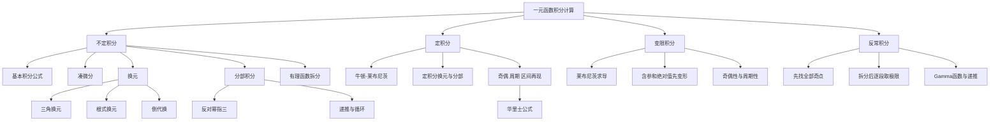

# 高数第9讲 一元函数积分学的计算

> [!info] 教材来源
> `27张宇基础30讲高数.pdf`，印刷页 230-262 / PDF p235-p267。本讲考查不定积分、定积分、变限积分和反常积分的计算，题型覆盖选择题、填空题与解答题。

## 本讲速览

- 积分计算不是“看到什么套什么公式”，而是先把被积式改造成**基本积分公式可识别的结构**：凑微分、换元、分部或拆分。
- 不定积分四条主线是：凑微分找内层导数、换元去根式或复杂层、分部让剩余积分变简单、有理函数先因式分解再拆部分分式。
- 定积分除牛顿-莱布尼茨公式外，还必须掌握上下限同步换元、分部积分、奇偶性、周期性、区间再现公式和华里士公式。
- 变限积分要分清“求导变量”和“积分变量”；含参数、绝对值、复合上限或积分方程时，先变形、分段或换元，再求导。
- 反常积分先找所有端点和内部奇点并拆开，再计算极限；Gamma 函数把一大类指数型反常积分统一成递推公式。
- 做题主线：识别结构信号 -> 检查定义域与连续区间 -> 选方法 -> 处理上下限、绝对值和常数 -> 求导或数量级验算。

## 教材路线

| 教材顺序 | 内容 | 页码 |
|---|---|---|
| 开篇 | 考纲、目标、重难点与知识结构 | 印刷页230 / PDF p235 |
| 一 | 10组基本积分公式 | 印刷页231-232 / PDF p236-p237 |
| 二（1） | 凑微分法及例9.1-9.2 | 印刷页232-234 / PDF p237-p239 |
| 二（2） | 换元法、三角换元、根式换元、倒代换及例9.3 | 印刷页234-236 / PDF p239-p241 |
| 二（3） | 分部积分、推广公式、循环积分及例9.4-9.7 | 印刷页236-239 / PDF p241-p244 |
| 二（4） | 有理函数积分、部分分式、三角有理式及例9.8-9.10 | 印刷页239-243 / PDF p244-p248 |
| 三 | 定积分公式、换元、分部、对称与周期结论、华里士公式及例9.11-9.19 | 印刷页243-248 / PDF p248-p253 |
| 四 | 变限积分求导、奇偶与周期结论及例9.20-9.25 | 印刷页249-252 / PDF p254-p257 |
| 五 | 反常积分计算、内部奇点、Gamma 函数及例9.26-9.29 | 印刷页253-255 / PDF p258-p260 |
| 练习 | 练习9.1-9.17及答案解析 | 印刷页255-262 / PDF p260-p267 |

## 前置知识与关联导航

- 原函数、不定积分、定积分、变限积分和反常积分的定义与成立条件：[[08_高数第8讲_一元函数积分学的概念与性质|第8讲 积分学的概念与性质]]。
- 换元积分是链式法则的逆用，分部积分是乘积求导的逆用：[[04_高数第4讲_一元函数微分学的计算|第4讲 导数计算]]。
- 等价无穷小、洛必达法则与泰勒展开常用于反常积分和变限积分的局部判断：[[02_高数第2讲_数列极限|第2讲 数列极限]]、[[05_高数第5讲_一元函数微分学的应用一_几何应用|第5讲 微分学应用一]]。
- 本讲计算工具将在几何应用中直接使用：[[10_高数第10讲_一元函数积分学的应用一_几何应用|第10讲 积分的几何应用]]。
- Gamma 函数与广义积分还会在级数和概率密度计算中再次出现：[[16_高数第16讲_无穷级数|第16讲 无穷级数]]。

## 知识网络

## 知识点清单

## 一、基本积分公式

### 1. 十组基本公式

基本公式是所有积分方法的终点。记忆时必须把条件、绝对值和积分常数一起记住。

#### （1）幂函数

$$
\int x^k\,\mathrm dx=\frac{x^{k+1}}{k+1}+C,\qquad k\ne-1.
$$

特殊情形：

$$
\int \frac{1}{x^2}\,\mathrm dx=-\frac1x+C,
\qquad
\int \frac1{\sqrt{x}}\,\mathrm dx=2\sqrt{x}+C.
$$

#### （2）对数型

$$
\int\frac{\mathrm dx}{x}=\ln|x|+C.
$$

绝对值不能漏；同一表达式跨过 $x=0$ 时应在各连通区间分别讨论常数。

#### （3）指数型

$$
\int e^x\,\mathrm dx=e^x+C,
\qquad
\int a^x\,\mathrm dx=\frac{a^x}{\ln a}+C,
\quad a>0, a\ne1.
$$

#### （4）三角函数

$$
\begin{aligned}
&\int\sin x\,\mathrm dx=-\cos x+C,
&&\int\cos x\,\mathrm dx=\sin x+C,\\
&\int\tan x\,\mathrm dx=-\ln|\cos x|+C,
&&\int\cot x\,\mathrm dx=\ln|\sin x|+C,\\
&\int\sec x\,\mathrm dx=\ln|\sec x+\tan x|+C,
&&\int\csc x\,\mathrm dx=\ln|\csc x-\cot x|+C,\\
&\int\sec^2x\,\mathrm dx=\tan x+C,
&&\int\csc^2x\,\mathrm dx=-\cot x+C,\\
&\int\sec x\tan x\,\mathrm dx=\sec x+C,
&&\int\csc x\cot x\,\mathrm dx=-\csc x+C.
\end{aligned}
$$

#### （5）反正切型

$$
\int\frac{\mathrm dx}{1+x^2}=\arctan x+C,
$$

$$
\int\frac{\mathrm dx}{a^2+x^2}
=\frac1a\arctan\frac xa+C,
\qquad a>0.
$$

#### （6）反正弦型

$$
\int\frac{\mathrm dx}{\sqrt{1-x^2}}=\arcsin x+C,
$$

$$
\int\frac{\mathrm dx}{\sqrt{a^2-x^2}}
=\arcsin\frac xa+C,
\qquad a>0, |x|<a.
$$

#### （7）根式对数型

$$
\int\frac{\mathrm dx}{\sqrt{x^2+a^2}}
=\ln\left|x+\sqrt{x^2+a^2}\right|+C,
$$

$$
\int\frac{\mathrm dx}{\sqrt{x^2-a^2}}
=\ln\left|x+\sqrt{x^2-a^2}\right|+C,
\qquad |x|>a>0.
$$

#### （8）平方差型

$$
\int\frac{\mathrm dx}{x^2-a^2}
=\frac1{2a}\ln\left|\frac{x-a}{x+a}\right|+C,
$$

$$
\int\frac{\mathrm dx}{a^2-x^2}
=\frac1{2a}\ln\left|\frac{a+x}{a-x}\right|+C,
\qquad a>0.
$$

两式分母只差一个负号，结果符号和对数分子分母的顺序也随之改变。

#### （9）圆根式

$$
\int\sqrt{a^2-x^2}\,\mathrm dx
=\frac{a^2}{2}\arcsin\frac xa
+\frac{x}{2}\sqrt{a^2-x^2}+C,
\qquad a>0, |x|\le a.
$$

它既可由 $x=a\sin t$ 推出，也可理解为扇形面积与三角形面积之和。

#### （10）三角平方

$$
\begin{aligned}
\int\sin^2x\,\mathrm dx&=\frac x2-\frac{\sin2x}{4}+C,\\
\int\cos^2x\,\mathrm dx&=\frac x2+\frac{\sin2x}{4}+C,\\
\int\tan^2x\,\mathrm dx&=\tan x-x+C,\\
\int\cot^2x\,\mathrm dx&=-\cot x-x+C.
\end{aligned}
$$

前三角平方来自降幂公式或 $\tan^2x=\sec^2x-1$、$\cot^2x=\csc^2x-1$。

**看到什么想到它：**积分做到最后若仍不能落到这十组公式，通常说明凑微分、换元、分部或代数拆分还没有完成。

> [!tip] 统一验算
> 不定积分结果必须求导回原被积函数；定积分结果还要检查符号、数量级和区间长度是否合理。

> [!note] 不一定存在初等表达式
> 即使被积函数是初等函数，它的原函数也未必能用有限个初等函数表示，例如 $e^{-x^2}$。遇到这类积分，不要强行寻找“不存在的基本公式”，应转用定积分性质、变限积分求导、反常积分或 Gamma 函数研究其值和性质。

## 二、不定积分的积分法

### 2. 凑微分法

凑微分是链式法则的逆用：

$$
\int f[g(x)]g'(x)\,\mathrm dx
=\int f[g(x)]\,\mathrm d[g(x)]
=\int f(u)\,\mathrm du.
$$

核心不是“看见一个内层函数”，而是同时找到它的导数因子。允许通过常数倍、拆项、配方、乘除同一因子把导数凑出来。

常用微分块：

$$
\begin{aligned}
x\,\mathrm dx&=\tfrac12\,\mathrm d(x^2),
&\sqrt{x}\,\mathrm dx&=\tfrac23\,\mathrm d(x^{3/2}),\\
\frac{\mathrm dx}{\sqrt{x}}&=2\,\mathrm d(\sqrt{x}),
&\frac{\mathrm dx}{x^2}&=\mathrm d\!\left(-\frac1x\right),\\
\frac{\mathrm dx}{x}&=\mathrm d(\ln x)\quad(x>0),
&e^x\,\mathrm dx&=\mathrm d(e^x),\\
a^x\,\mathrm dx&=\frac1{\ln a}\,\mathrm d(a^x),
&\sin x\,\mathrm dx&=\mathrm d(-\cos x),\\
\cos x\,\mathrm dx&=\mathrm d(\sin x),
&\sec^2x\,\mathrm dx&=\mathrm d(\tan x),\\
-\csc^2x\,\mathrm dx&=\mathrm d(\cot x),
&\frac{\mathrm dx}{1+x^2}&=\mathrm d(\arctan x),\\
\frac{\mathrm dx}{\sqrt{1-x^2}}&=\mathrm d(\arcsin x).
\end{aligned}
$$

**教材方法：**当熟悉的整体微分块不明显时，可对被积式中最复杂的候选部分 $g(x)$ 求导；若 $g'(x)$ 正好补齐剩余因子，就把 $\mathrm d g$ 从后面拿到前面。

**看到什么想到它：**复合函数幂、指数、对数、反三角函数外面紧跟内层导数；或分母的导数几乎出现在分子中。

**例题迁移：**例9.1用 $x^{3/2}$ 作为整体，把根式化成反正弦型；例9.2先对复杂分式求导，发现其导数恰好等于剩余因子，是“先猜整体再验证”的典型。

### 3. 换元法

换元法的本质是主动引入新变量，把原式整体改造成基本公式。设 $x=g(u)$，则

$$
\int f(x)\,\mathrm dx
=\int f[g(u)]g'(u)\,\mathrm du.
$$

换元函数应在所用区间单调可导，计算完必须用反函数 $u=g^{-1}(x)$ 换回；若反函数分支不唯一，要先限定取值区间。

#### （1）三角函数换元

当二次根式完成平方后出现三种标准形：

$$
\begin{array}{c|c|c}
\text{根式} & \text{换元} & \text{推荐区间}\\
\hline
\sqrt{a^2-x^2} & x=a\sin t & -\frac\pi2\le t\le\frac\pi2\\
\sqrt{a^2+x^2} & x=a\tan t & -\frac\pi2<t<\frac\pi2\\
\sqrt{x^2-a^2} & x=a\sec t & x>0:\ 0<t<\frac\pi2;\ x<0:\ \frac\pi2<t<\pi
\end{array}
$$

先配成 $\sqrt{\varphi^2(x)+a^2}$、$\sqrt{\varphi^2(x)-a^2}$ 或 $\sqrt{a^2-\varphi^2(x)}$，再对 $\varphi(x)$ 换元。化简时必须保留

$$
\sqrt{1-\sin^2t}=|\cos t|,
\qquad
\sqrt{\sec^2t-1}=|\tan t|,
$$

绝对值能否去掉由所选区间决定。

#### （2）根式代换

若含 $\sqrt[n]{ax+b}$、$\sqrt{\dfrac{ax+b}{cx+d}}$、$\sqrt[n]{ae^{bx}+c}$ 或若干不同次数根式，通常令根式本身为 $t$；多个根指数并存时，指数取最小公倍数，使所有根式同时整式化。

例如含 $\sqrt{x}$ 与 $\sqrt[3]{x}$ 时可令 $x=t^6$。根式代换的目标不是“少一个根号”，而是使整个被积式成为 $t$ 的有理函数。

#### （3）倒代换

当分母次数比分子高两次及以上，或最高次与常数项呈对称结构时，可令

$$
x=\frac1t,
\qquad
\mathrm dx=-\frac1{t^2}\,\mathrm dt.
$$

倒代换常把高次分母降阶，但必须把 $x$ 的幂和 $\mathrm dx$ 的 $t^{-2}$ 一并代入。

#### （4）复杂函数直接代换

含 $a^x,e^x,\ln x,\arcsin x,\arctan x$ 等整体时，可直接令该整体为 $t$。但若它与多项式或指数相乘，分部积分常比直接换元更短。

**看到什么想到它：**根式无法凑微分、二次式可配方、多个根指数可统一、分母高次适合倒代换、复杂函数整体反复出现。

**例题迁移：**例9.3用 $x=a\sin t$ 推出圆根式公式；例9.4先令根式为 $u$ 再分部；例9.5先令 $x=\tan t$ 去掉 $(1+x^2)^{3/2}$，随后出现循环分部；例9.6先令 $t=\ln x$ 还原 $f$ 的显式表达。

### 4. 分部积分法

分部积分是乘积求导公式的逆用：

$$
\int u\,\mathrm dv=uv-\int v\,\mathrm du.
$$

选择原则：让右侧 $\int v\,\mathrm du$ 比原积分更简单。教材口诀“反、对、幂、指、三”表示优先把反三角函数、对数函数、幂函数、指数函数、三角函数中靠左者选作 $u$，但要服从“能把剩余积分算掉”这一最终目标。

- $P_n(x)e^{ax}$、$P_n(x)\sin bx$、$P_n(x)\cos bx$：通常取 $u=P_n(x)$，连续分部直至多项式降为零。
- $P_n(x)\ln x$、$P_n(x)\arcsin x$、$P_n(x)\arctan x$：通常取对数或反三角函数为 $u$。
- $e^{ax}\sin bx$、$e^{ax}\cos bx$、$e^{ax}\sinh bx$、$e^{ax}\cosh bx$：分部后原积分可能再次出现，移项求解，称为循环积分。

高阶推广。若 $u,v$ 有足够阶导数，则

$$
\int u\,v^{(n+1)}\,\mathrm dx
=uv^{(n)}-u'v^{(n-1)}+\cdots+(-1)^nu^{(n)}v
+(-1)^{n+1}\int u^{(n+1)}v\,\mathrm dx.
$$

表格法就是把 $u$ 连续求导、把 $v^{(n+1)}$ 连续积分，并交替使用正负号。

常用循环积分结论：

$$
\int e^{ax}\sin bx\,\mathrm dx
=\frac{e^{ax}(a\sin bx-b\cos bx)}{a^2+b^2}+C,
$$

$$
\int e^{ax}\cos bx\,\mathrm dx
=\frac{e^{ax}(a\cos bx+b\sin bx)}{a^2+b^2}+C.
$$

**看到什么想到它：**两个不同类型函数相乘；含 $\ln x$、反三角函数但凑不出其导数；分部后原积分以常数倍重新出现。

**例题迁移：**例9.4是“根式换元后分部”；例9.5分部后原积分再现；例9.6先还原函数再分部；例9.7展开 $(\tan x+1)^2$ 后，两个积分通过分部正好抵消。

### 5. 有理函数的积分

形如

$$
\int\frac{P_n(x)}{Q_m(x)}\,\mathrm dx
$$

的积分称为有理函数积分。

#### （1）先化为真分式

- 若 $n\ge m$，先做多项式除法，化为“多项式 + 真分式”。
- 若 $n<m$，直接对分母在实数域因式分解，再拆成最简有理分式之和。

#### （2）部分分式的四种基本块

分母中每个因式对应如下项：

$$
\begin{array}{c|c}
Q(x)\text{中的因式} & \text{应拆出的项}\\
\hline
ax+b & \dfrac{A}{ax+b}\\
(ax+b)^k & \dfrac{A_1}{ax+b}+\dfrac{A_2}{(ax+b)^2}+\cdots+\dfrac{A_k}{(ax+b)^k}\\
px^2+qx+r & \dfrac{Ax+B}{px^2+qx+r},\quad q^2-4pr<0\\
(px^2+qx+r)^k & \displaystyle\sum_{j=1}^k\frac{A_jx+B_j}{(px^2+qx+r)^j}
\end{array}
$$

待定系数有两种常用求法：

1. 通分后比较同次幂系数。
2. 在恒等式中代入能使某些因式为零的特殊值，快速隔离系数；剩余系数再比较一两个次数。

不可约二次式要先配方，分子再拆成“分母导数 + 常数”，分别落到 $\ln$ 型与 $\arctan$ 型。

教材给出的常用递推示例：

$$
\int\frac{\mathrm dx}{(1+x^2)^2}
=\frac{x}{2(1+x^2)}+\frac12\arctan x+C.
$$

它可由分部积分把原积分移项求出，也可作为处理高次不可约二次因式的参考。

#### （3）三角函数有理式

对 $R(\sin x,\cos x)$：

- 通用换元 $t=\tan\dfrac x2$，则
  $$
  \sin x=\frac{2t}{1+t^2},\quad
  \cos x=\frac{1-t^2}{1+t^2},\quad
  \mathrm dx=\frac{2\,\mathrm dt}{1+t^2}.
  $$
- 若关于 $\sin x$ 变号后整体变号，令 $t=\cos x$ 凑 $\sin x\,\mathrm dx$。
- 若关于 $\cos x$ 变号后整体变号，令 $t=\sin x$ 凑 $\cos x\,\mathrm dx$。
- 若 $R(-\sin x,-\cos x)=R(\sin x,\cos x)$，可令 $t=\tan x$。

#### （4）可有理化的根式

$$
\int f\!\left(\sqrt{a^2+x^2}\right)\,\mathrm dx
$$

经 $x=a\tan t$ 可转为三角有理式；含 $\sqrt{\dfrac{ax+b}{cx+d}}$ 时令该根式为 $t$，通常直接转为有理函数。

**看到什么想到它：**多项式之比；分母能拆成一次因式和不可约二次因式；三角式只由 $\sin x,\cos x$ 有理运算构成。

**例题迁移：**例9.8展示重一次因式的拆分与“特殊值代入”；例9.9展示一次因式与不可约二次因式并存；例9.10先把分子凑成分母导数，再对剩余二次式配方。

## 三、定积分的计算

### 7. 定积分计算公式

#### （1）牛顿-莱布尼茨公式

若 $F'(x)=f(x)$，且 $f$ 在 $[a,b]$ 上连续，则

$$
\int_a^b f(x)\,\mathrm dx=F(b)-F(a).
$$

若 $f$ 在 $c$ 点分段，但在两侧分别有原函数 $F_1,F_2$，则先拆区间：

$$
\int_a^b f(x)\,\mathrm dx
=F_1(c-0)-F_1(a)+F_2(b)-F_2(c+0).
$$

左右原函数的相应极限都存在时定积分才可按此计算；至少一个不存在，原积分发散。

#### （2）定积分换元法

设 $x=\varphi(t)$，$\varphi(\alpha)=a$、$\varphi(\beta)=b$，且 $\varphi'$ 连续、$f$ 在 $\varphi([\alpha,\beta])$ 上连续，则

$$
\int_a^b f(x)\,\mathrm dx
=\int_\alpha^\beta f[\varphi(t)]\varphi'(t)\,\mathrm dt.
$$

换元三件事必须同步：被积函数换元、$\mathrm dx$ 换元、上下限换元。定积分换元后不必换回原变量。

即使 $\varphi(t)$ 的值域超出 $[a,b]$，只要 $f$ 在整个 $\varphi([\alpha,\beta])$ 上连续，上述公式仍成立。对三角换元常用：

$$
\sin\left(\frac\pi2\pm t\right)=\cos t,
\qquad
\cos\left(\frac\pi2\pm t\right)=\mp\sin t,
$$

$$
\sin(\pi-t)=\sin t,
\quad
\sin(\pi+t)=-\sin t,
\quad
\cos(\pi\pm t)=-\cos t.
$$

> [!warning] 分支与连续区间
> 若所得原函数在积分区间内有未定义点，即使被积函数连续，也不能直接代上下限；应在该点分段，分别选取连续的原函数分支。练习9.10专门检查这一点。

#### （3）定积分分部积分法

若 $u',v'$ 在 $[a,b]$ 上连续，则

$$
\int_a^b u(x)v'(x)\,\mathrm dx
=\left.u(x)v(x)\right|_a^b
-\int_a^b v(x)u'(x)\,\mathrm dx.
$$

定积分分部不出现 $+C$，但边界项必须完整代入上下限。

#### （4）奇偶、周期与区间再现

若 $f$ 可积：

$$
\int_{-a}^{a}f(x)\,\mathrm dx
=\begin{cases}
2\displaystyle\int_0^a f(x)\,\mathrm dx,&f\text{为偶函数},\\
0,&f\text{为奇函数}.
\end{cases}
$$

若 $f$ 以 $T$ 为周期，则任意 $a$ 都有

$$
\int_a^{a+T}f(x)\,\mathrm dx=\int_0^T f(x)\,\mathrm dx.
$$

区间再现公式：

$$
\int_a^b f(x)\,\mathrm dx
=\int_a^b f(a+b-x)\,\mathrm dx.
$$

两式相加得到常用对称配对：

$$
\int_a^b f(x)\,\mathrm dx
=\frac12\int_a^b[f(x)+f(a+b-x)]\,\mathrm dx.
$$

若 $g(a+b-x)=g(x)$，则

$$
\int_a^b xg(x)\,\mathrm dx
=\frac{a+b}{2}\int_a^b g(x)\,\mathrm dx.
$$

特别地，若 $g(x)=f(\sin x)$，则

$$
\int_0^\pi x f(\sin x)\,\mathrm dx
=\frac\pi2\int_0^\pi f(\sin x)\,\mathrm dx.
$$

#### （5）华里士公式

记

$$
I_n=\int_0^{\pi/2}\sin^n x\,\mathrm dx
=\int_0^{\pi/2}\cos^n x\,\mathrm dx.
$$

由分部积分得递推式

$$
I_n=\frac{n-1}{n}I_{n-2},\qquad n\ge2,
$$

且 $I_0=\dfrac\pi2$、$I_1=1$。因此

$$
I_n=
\begin{cases}
\dfrac{n-1}{n}\dfrac{n-3}{n-2}\cdots\dfrac23,&n>1\text{为奇数},\\[6pt]
\dfrac{n-1}{n}\dfrac{n-3}{n-2}\cdots\dfrac12\cdot\dfrac\pi2,&n\text{为正偶数}.
\end{cases}
$$

进一步：

$$
\int_0^\pi\sin^n x\,\mathrm dx=2I_n,
$$

$$
\int_0^\pi\cos^n x\,\mathrm dx
=\begin{cases}0,&n\text{为正奇数},\\2I_n,&n\text{为正偶数},\end{cases}
$$

$$
\int_0^{2\pi}\sin^n x\,\mathrm dx
=\int_0^{2\pi}\cos^n x\,\mathrm dx
=\begin{cases}0,&n\text{为正奇数},\\4I_n,&n\text{为正偶数}.\end{cases}
$$

#### （6）黎曼和反求定积分

看到

$$
\lim_{n\to\infty}\frac1n\sum_{i=1}^n h\!\left(\frac in\right)
$$

先认成 $\int_0^1h(x)\,\mathrm dx$，再利用换元、对称或区间再现简化。若求和项不是标准 $i/n$，先提取步长并辨认区间端点。

**看到什么想到它：**对称区间先看奇偶；长度为一个周期先平移；出现 $x$ 与 $a+b-x$ 先区间再现；高次 $\sin^n,\cos^n$ 先华里士；$\frac1n\sum$ 先黎曼和。

**例题迁移：**例9.11先由函数方程求 $f$；例9.12把求和极限化为积分再用对称；例9.13检查三角换元的分支和绝对值；例9.14-9.15用分部、换元与区间再现互相替代；例9.16-9.18集中建立周期与区间再现；例9.19对“不可显式求出的变限积分”直接做定积分分部。

## 四、变限积分的计算

### 8. 变限积分求导公式

若 $f$ 连续，$\varphi_1,\varphi_2$ 可导，则

$$
F(x)=\int_{\varphi_1(x)}^{\varphi_2(x)}f(t)\,\mathrm dt
$$

满足

$$
F'(x)=f[\varphi_2(x)]\varphi_2'(x)
-f[\varphi_1(x)]\varphi_1'(x).
$$

$x$ 是求导变量，$t$ 是积分变量。若被积函数中还含 $x$，教材优先要求先通过换元、恒等变形或分段把 $x$ 移出被积函数，再用公式。

在条件充分时可使用含参积分的扩展公式：

$$
\frac{\mathrm d}{\mathrm dx}
\int_{a(x)}^{b(x)}g(x,t)\,\mathrm dt
=g[x,b(x)]b'(x)-g[x,a(x)]a'(x)
+\int_{a(x)}^{b(x)}\frac{\partial g}{\partial x}(x,t)\,\mathrm dt.
$$

但考研题中若有绝对值或分段点，必须先确认 $g$ 对参数的连续性和分界位置，不能机械套扩展式。

常见任务：

- 求曲线切线或法线：先验证给定点确在曲线上，再求 $y'$；法线斜率为 $-1/y'$。
- 求极限或泰勒系数：先求 $F(0),F'(0),F''(0)$，再用局部展开。
- 积分方程含未知 $f$：先把内层积分变为标准变限积分，再对等式求导，最后用原式确定常数。
- 含 $|h(x,t)|$：先求零点 $h(x,t)=0$，按零点相对积分区间的位置分段。

**例题迁移：**例9.20先确认原点在曲线上再求法线；例9.21先去绝对值、分段写出 $F(x)$，再取右侧泰勒系数；例9.22令 $u=x^2-t^2$ 把含参核改成标准变限积分，再用二阶导判极值。

### 9. 变限积分的奇偶与周期结论

设 $f$ 在对称区间可积。

#### （1）$f$ 为奇函数

$$
F_a(x)=\int_a^x f(t)\,\mathrm dt
$$

的导数是奇函数，因此 $F_a$ 是偶函数；换起点只改变一个常数，不破坏偶性。特别地 $\int_0^x f(t)\,\mathrm dt$ 为偶函数。

#### （2）$f$ 为偶函数

$$
H(x)=\int_0^x f(t)\,\mathrm dt
$$

为奇函数。一般的 $F_a(x)=H(x)-H(a)$ 是“奇函数 + 常数”，只有 $H(a)=0$ 时才仍为奇函数；否则通常非奇非偶。

因此：连续奇函数的一切原函数都是偶函数；连续偶函数的原函数族中恰有一个奇函数，即把常数选到使 $F(0)=0$。

#### （3）周期函数的原函数

若 $f$ 以 $T$ 为周期，令

$$
F(x)=\int_a^x f(t)\,\mathrm dt,
\qquad
M=\int_0^T f(t)\,\mathrm dt.
$$

则

$$
F(x+T)-F(x)=M.
$$

所以

$$
F\text{以 }T\text{为周期}\iff M=0.
$$

无论 $M$ 是否为零，去掉线性漂移后的

$$
F(x)-\frac MT x
$$

总是以 $T$ 为周期。

**看到什么想到它：**题目问变限积分奇偶性，先看导数 $F'=f$；问原函数是否周期，先算一个周期上的平均积分是否为零。

**例题迁移：**例9.23证明原函数的奇偶结论；例9.24先判断复合被积函数奇偶性，再判断变限积分；例9.25给出“周期原函数存在当且仅当周期积分为零”及去线性项结论。

## 五、反常积分的计算

### 10. 先找奇点，再逐段取极限

反常积分的奇点既可能在端点，也可能在内部。若 $c\in(a,b)$ 为无界点，则必须写成

$$
\int_a^b f(x)\,\mathrm dx
=\int_a^c f(x)\,\mathrm dx+\int_c^b f(x)\,\mathrm dx,
$$

两侧各自收敛时原积分才收敛，不能用左右发散项互相抵消；柯西主值不等于通常意义的反常积分。

计算流程：

1. 解出分母为零、根式为零、对数端点和无穷端点，列出全部奇点。
2. 在每个奇点处分段；含绝对值时还要按符号变化点分段。
3. 每段用极限定义，必要时换元或分部。
4. 所有分段都收敛，才能合并结果。

在收敛条件下，换元可实现反常积分与定积分、不同反常积分之间的相互转化，但新上下限和新奇点也必须同步变换。

**例题迁移：**例9.26同时含端点与内部奇点，关键是先按 $x=1$ 分段并处理绝对值；例9.27用 $x-1=\sec\theta$ 把无穷区间化为有限区间。

### 11. Gamma 函数

Gamma 函数定义为

$$
\Gamma(\alpha)=\int_0^{+\infty}x^{\alpha-1}e^{-x}\,\mathrm dx,
\qquad \alpha>0.
$$

- $x\to0^+$ 时与 $x^{\alpha-1}$ 同阶，要求 $\alpha>0$。
- $x\to+\infty$ 时指数衰减快于任意幂，因此尾积分收敛。

分部积分得到递推：

$$
\Gamma(\alpha+1)=\alpha\Gamma(\alpha).
$$

基本值：

$$
\Gamma(1)=1,
\qquad
\Gamma\!\left(\frac12\right)=\sqrt\pi,
\qquad
\Gamma(n+1)=n!.
$$

缩放公式：对 $\beta>0$，

$$
\int_0^{+\infty}x^{\alpha-1}e^{-\beta x}\,\mathrm dx
=\frac{\Gamma(\alpha)}{\beta^\alpha}.
$$

特别地，对 $a>0$、非负整数 $n$，

$$
\int_0^{+\infty}x^ne^{-ax}\,\mathrm dx
=\frac{n!}{a^{n+1}},
$$

$$
\int_{-\infty}^{0}x^ne^{ax}\,\mathrm dx
=(-1)^n\frac{n!}{a^{n+1}}.
$$

又由 $u=x^2$：

$$
\int_0^{+\infty}e^{-x^2}\,\mathrm dx=\frac{\sqrt\pi}{2}.
$$

**看到什么想到它：**$[0,+\infty)$ 上“幂函数 $\times$ 指数衰减”，或换元后能化成 $u^{\alpha-1}e^{-u}$。

**例题迁移：**例9.28用分部积分建立 $I_n=nI_{n-1}$ 并得到 $n!$；例9.29先令 $u=(x/a)^2$，再用 $\Gamma(5/2)$。

## 公式与二级结论索引

| 结论 | 条件与用途 | 详细位置 |
|---|---|---|
| 十组基本积分公式 | 绝对值、参数范围和 $+C$ 必须同时保留 | [[#1. 十组基本公式|基本积分公式]] |
| $\int f(g)g'\,dx=\int f(u)\,du$ | 内层函数与其导数成对出现 | [[#2. 凑微分法|凑微分法]] |
| 三类三角换元 | 二次根式先配方，并限定反函数分支 | [[#3. 换元法|换元法]] |
| $\int u\,dv=uv-\int v\,du$ | 目标是使剩余积分更简单 | [[#4. 分部积分法|分部积分法]] |
| 高阶分部公式 | 多项式乘指数或三角函数，可用表格法 | [[#4. 分部积分法|分部积分法]] |
| 部分分式四类模板 | 假分式先除法，分母在实数域因式分解 | [[#5. 有理函数的积分|有理函数积分]] |
| 牛顿-莱布尼茨公式 | 原函数须在相应连续区间有效 | [[#7. 定积分计算公式|定积分计算]] |
| 区间再现公式 | $x=a+b-t$，常与两式相加配对 | [[#（4）奇偶、周期与区间再现|区间再现]] |
| 华里士递推 $I_n=\frac{n-1}{n}I_{n-2}$ | $I_0=\pi/2,I_1=1$，按奇偶分别收束 | [[#（5）华里士公式|华里士公式]] |
| 复合上下限求导 | 被积函数仅含积分变量时直接使用 | [[#8. 变限积分求导公式|变限积分求导]] |
| 奇函数的原函数全为偶函数 | 导函数为奇函数；常数不破坏偶性 | [[#9. 变限积分的奇偶与周期结论|奇偶结论]] |
| 偶函数仅有一个奇原函数 | 选常数使 $F(0)=0$ | [[#9. 变限积分的奇偶与周期结论|奇偶结论]] |
| 周期原函数判定 | $F$ 周期当且仅当一个周期积分为零 | [[#（3）周期函数的原函数|周期原函数]] |
| Gamma 递推 | $\alpha>0$，$\Gamma(\alpha+1)=\alpha\Gamma(\alpha)$ | [[#11. Gamma 函数|Gamma 函数]] |

## 题型-方法决策表

| 题面信号 | 首选方法 | 备选方法 | 检查点 |
|---|---|---|---|
| 外层函数旁出现内层导数 | 凑微分 | 先拆项或乘除常数 | 内层导数是否完整 |
| $\sqrt{a^2-x^2}$、$\sqrt{a^2+x^2}$、$\sqrt{x^2-a^2}$ | 三角换元 | 直接使用基本公式 | 取值区间与绝对值 |
| 多个不同次数根式 | 根式的最小公倍数换元 | 令关键根式为 $t$ | 是否全部有理化 |
| 两类函数相乘 | 分部积分 | 先换元再分部 | 剩余积分必须更简单 |
| 分部后原积分再次出现 | 循环积分并移项 | 直接套指数三角结论 | 移项系数是否为零 |
| 多项式之比 | 除法、因式分解、部分分式 | 分子凑分母导数 | 重因式项不能漏 |
| $R(\sin x,\cos x)$ | 看变号规律选换元 | $t=\tan(x/2)$ | 换元分支和定义域 |
| 对称区间 | 奇偶性 | 换元 $x=-t$ | 被积函数整体奇偶性 |
| 长度为一个周期 | 周期平移 | 分段到标准周期 | 区间长度必须正好为 $T$ |
| $f(x)$ 与 $f(a+b-x)$ 可配对 | 区间再现 | 奇偶、周期 | 两式相加后是否简化 |
| $\sin^n x$、$\cos^n x$ 定积分 | 华里士公式 | 降幂或分部递推 | 指数奇偶与区间倍数 |
| $\frac1n\sum h(i/n)$ | 黎曼和转定积分 | 先改写求和项 | 步长与积分区间 |
| 复合上下限积分求导 | 莱布尼茨公式 | 先换元移出参数 | 上限项减下限项 |
| 被积式含 $x,t$ 或绝对值 | 先换元、分段 | 含参积分扩展公式 | 移动零点和单侧区间 |
| 原函数奇偶、周期 | 看导函数奇偶与周期均值 | 直接换元证明 | 积分常数是否影响性质 |
| 反常积分含内部无界点 | 先按奇点拆分 | 再换元计算 | 每一侧必须独立收敛 |
| $x^{\alpha-1}e^{-\beta x}$ | Gamma 函数 | 分部递推 | $\alpha>0,\beta>0$ |

## 教材例题覆盖表

| 例题 | 页码 | 题面信号 | 解法入口与独有方法 |
|---|---|---|---|
| 例9.1 | PDF p238-p239 | $\sqrt{x}$ 与 $x^3$ 同时出现 | 凑 $\mathrm d(x^{3/2})$，整体落到反正弦公式 |
| 例9.2 | PDF p239 | 指数的指数与复杂三角分式相乘 | 对复杂分式求导，发现正好凑微分 |
| 例9.3 | PDF p240-p241 | $\sqrt{a^2-x^2}$ | $x=a\sin t$，推回圆根式基本公式 |
| 例9.4 | PDF p243 | 指数根式与 $x$ 混合 | 先令根式为 $u$，再分部积分 |
| 例9.5 | PDF p243 | $(1+x^2)^{3/2}$ 与 $e^{\arctan x}$ | $x=\tan t$ 后循环分部，原积分移项 |
| 例9.6 | PDF p244 | 给出 $f(\ln x)$ 而求 $\int f(x)dx$ | 令 $t=\ln x$ 先求 $f$，再分部与拆项 |
| 例9.7 | PDF p244 | $e^{2x}(\tan x+1)^2$ | 展开平方，凑 $\mathrm d(\tan x)$，分部后积分抵消 |
| 例9.8 | PDF p245-p246 | 重一次因式的有理函数 | 完整列出重因式各项，用特殊值代入求系数 |
| 例9.9 | PDF p246-p247 | 一次因式乘不可约二次因式 | 部分分式后分别得到对数与反正切 |
| 例9.10 | PDF p247-p248 | 分子接近二次分母的导数 | 分子凑导数，剩余项配方为反正切型 |
| 例9.11 | PDF p248-p249 | 函数方程给 $f(x+1/x)$ | 先解出积分区间上的 $f$，再用牛顿-莱布尼茨 |
| 例9.12 | PDF p250-p251 | 对数求和极限 | 化为黎曼和，再用 $x\mapsto1-x$ 形成奇函数积分 |
| 例9.13 | PDF p251 | 偶函数乘圆根式 | 先用偶性折半，再三角换元和华里士公式 |
| 例9.14 | PDF p251-p252 | $\arcsin\sqrt{1-x^2}$ | 分部法与三角换元两条路线互相校验 |
| 例9.15 | PDF p252 | 平移后的圆根式与例9.14同构 | 令 $1-2x=t$，用区间再现消去奇对称项 |
| 例9.16 | PDF p252 | 任意起点、长度为一周期 | 分段平移证明周期积分与起点无关 |
| 例9.17 | PDF p252-p253 | $f(a+b-x)$ | 作区间再现换元，建立对称配对公式 |
| 例9.18 | PDF p253 | $x f(\sin x)$ | $x\mapsto\pi-x$，两式相加把权重 $x$ 消掉 |
| 例9.19 | PDF p253-p254 | 变限积分 $f$ 无法显式求出 | 对 $\int x f(x)dx$ 直接定积分分部，再求 $f'$ |
| 例9.20 | PDF p254 | 变上限积分曲线的法线 | 先验点，再用链式法则求切线斜率与法线斜率 |
| 例9.21 | PDF p254-p255 | 含绝对值的参数积分求右侧泰勒系数 | 按 $t=x$ 去绝对值，显式化后展开或求各阶导 |
| 例9.22 | PDF p255-p256 | 核 $f(x^2-t^2)$ 与极值 | 先令 $u=x^2-t^2$，再求 $F',F''$ 判极值 |
| 例9.23 | PDF p257 | 原函数奇偶性 | 从 $F(x)=\int_a^x f(t)dt$ 换元证明常数的影响 |
| 例9.24 | PDF p257 | 复合被积函数的奇偶性 | 先判内偶外偶，再利用变限积分奇偶结论 |
| 例9.25 | PDF p257-p258 | 周期函数的原函数是否周期 | 计算 $F(x+T)-F(x)$；减去均值线性项后必周期 |
| 例9.26 | PDF p258 | 端点与内部同时为奇点且含绝对值 | 在内部奇点处分段，两侧分别选公式并取极限 |
| 例9.27 | PDF p258-p259 | 无穷上限与 $\sqrt{x^2-2x}$ | 配方后令 $x-1=\sec\theta$，化成有限区间 |
| 例9.28 | PDF p259 | $\int_0^\infty x^ne^{-x}dx$ | 分部建立阶乘递推，识别 $\Gamma(n+1)$ |
| 例9.29 | PDF p260 | 含参数的高斯型反常积分 | 令 $u=(x/a)^2$，化成 $\Gamma(5/2)$ |

## 讲末练习反查

| 练习 | 核心考点 | 只看本笔记应想到的入口 |
|---|---|---|
| 9.1 | 已知 $\int xf(x)dx$ 反求 $1/f(x)$ 的积分 | 先对已知原函数求导得到 $f$，再凑微分 |
| 9.2 | 定积分方程中的未知常数 | 把 $\int_0^1f$ 记为常数 $A$，两边积分后解代数方程 |
| 9.3 | 指数型极限 | 先化简指数底数，再用极限或泰勒展开 |
| 9.4 | 已知一个原函数求 $\int x f'(x)dx$ | 分部积分，$\int f$ 直接由已知原函数得到 |
| 9.5 | $\arcsin\sqrt{x}/\sqrt{x}$ | 令 $t=\sqrt{x}$ 去根，再分部 |
| 9.6 | 无穷区间根式积分 | 令 $t=\sqrt{x-2}$，同步改上下限 |
| 9.7 | 反正弦与分式根式 | 令反正弦整体为 $t$，把 $x$ 化成 $\tan^2t$ 后分部 |
| 9.8 | $e^{-x}\arctan(e^x)$ | 分部积分；也可先令 $e^x=t$ 再分部 |
| 9.9 | $\max\{1,|x|\}$ 的原函数 | 在 $x=\pm1$ 分段积分，用原函数连续性统一常数 |
| 9.10 | 原函数分支跨越 $\pi/2$ | 不能把 $\arctan(\tan x)$ 跨分支使用，必须在 $\pi/2$ 分段 |
| 9.11 | 特殊循环分部积分 | 一项分部后与原积分抵消，保留边界项 |
| 9.12 | $x\sin x/(1+\cos^2x)$ | 作 $x\mapsto\pi-x$，两式相加消去 $x$ |
| 9.13 | 对称区间与立方根 | 先拆奇偶部分，再对 $[0,1]$ 作根式换元 |
| 9.14 | 分段函数定积分 | 在 $x=0$ 分段，各段分别选指数换元和三角恒等变形 |
| 9.15 | $\int_{-1}^x(1-|t|)dt$ | 按 $x<0$、$0\le x$ 分段，并在 $t=0$ 拆绝对值 |
| 9.16 | 含 $f(tx)$ 的积分方程 | 令 $u=tx$ 化为变限积分，再求导并用原式定常数 |
| 9.17 | $\int_0^1t|t-x|dt$ 的导数 | 按 $x\le0$、$0<x\le1$、$x>1$ 分段，在端点验左右导数 |

## 易错点/易混点

1. $\int f(x)\,\mathrm dx$ 是原函数族，必须写 $+C$；$\int_a^b f(x)\,\mathrm dx$ 是数，不能写 $+C$。
2. $\int\frac{\mathrm dx}{x}=\ln|x|+C$，不是 $\ln x+C$；只有已知 $x>0$ 才可去绝对值。
3. 凑微分必须把内层导数完整凑出；差一个随 $x$ 变化的因子不能当作“常数差”。
4. 不定积分第二类换元结束后要换回 $x$；定积分换元则要同步换上下限，通常不必换回。
5. $\sqrt{1-\sin^2t}=|\cos t|$，不能无条件写成 $\cos t$；三角换元的区间就是为处理分支和绝对值服务。
6. 分部积分不是固定套口诀；若 $\int v\,du$ 更难，说明 $u,dv$ 选反了。
7. 部分分式中，$(ax+b)^k$ 必须从一次幂一直列到 $k$ 次幂；不可约二次因式的分子必须是一次式。
8. 定积分使用原函数前，要确认该原函数在整个区间同一分支上有效；练习9.10中 $\arctan(\tan x)$ 跨 $\pi/2$ 失效。
9. 周期函数在任意长度为 $T$ 的区间积分相同，但长度不是整数个周期时不能直接平移成 $[0,T]$。
10. 区间再现换元 $x=a+b-t$ 会同时翻转上下限和产生 $-\mathrm dt$，两次负号共同恢复正向积分。
11. 华里士公式要先看指数奇偶和积分区间；$[0,\pi/2]$、$[0,\pi]$、$[0,2\pi]$ 的倍数不同。
12. 变限积分公式中的上限项减下限项；下限求导自带负号。
13. 被积函数含求导变量 $x$ 时，不能只代上下限；还要处理 $\partial g/\partial x$，或按教材先变形。
14. 含绝对值的变限积分必须找移动零点，不能把绝对值当常数符号直接求导。
15. 奇函数的任意原函数都是偶函数；偶函数的原函数不一定全是奇函数，只有一个积分常数选择使其为奇函数。
16. 周期函数本身有周期原函数的充要条件是一个周期积分为零；仅有周期性不够。
17. 反常积分有内部奇点时必须拆成两段分别收敛，左右抵消只可能形成主值，不能判通常反常积分收敛。
18. Gamma 函数定义要求 $\alpha>0$；递推 $\Gamma(\alpha+1)=\alpha\Gamma(\alpha)$ 的下标不能错位。

## 注解

### 为什么积分方法最终都在“制造基本公式”

凑微分是把复合结构压成一个变量，换元是主动改变变量，分部是把导数从一个因子转移到另一个因子，部分分式是把复杂有理式拆成简单块。四种方法的共同目标，都是把原式送回基本积分表。

### 为什么定积分比不定积分更容易利用对称性

不定积分关心整个原函数族，而定积分只关心区间上的总累积量。变量替换 $x\mapsto a+b-x$ 不改变区间总量，因此可以把难积分与它的“镜像”相加，直接消去权重或复杂项。

### 为什么周期函数未必有周期原函数

原函数每经过一个周期增加固定量 $M=\int_0^T f$。若 $M\ne0$，图像每周期都会发生线性漂移；减去 $\frac MT x$ 正是把这段平均漂移去掉。

### 为什么 Gamma 函数能快速算阶乘型积分

分部积分每次把幂指数降低1，同时产生一个系数；重复到 $\Gamma(1)$ 时，所有系数相乘恰成阶乘。它把“重复分部”封装成了一个可递推的命名函数。

## 速背检查

1. **$\int x^kdx$ 的禁用指数？** $k=-1$；此时结果是 $\ln|x|+C$。
2. **凑微分的判断标准？** 内层函数与其导数因子同时出现，允许差非零常数倍。
3. **三类二次根式分别怎样换元？** $\sqrt{a^2-x^2}$ 用 $a\sin t$；$\sqrt{a^2+x^2}$ 用 $a\tan t$；$\sqrt{x^2-a^2}$ 用 $a\sec t$。
4. **三角换元为何必须限定 $t$ 的区间？** 保证反函数单值并正确处理根式中的绝对值。
5. **多个根指数怎样统一？** 取根指数最小公倍数，令相应幂为新变量。
6. **分部积分选 $u$ 的最终标准？** 让 $du$ 变简单，并让剩余积分可算。
7. **分部两次又出现原积分怎么办？** 把原积分记为 $I$，移项解代数方程。
8. **假有理分式第一步？** 多项式除法，化成多项式与真分式之和。
9. **重一次因式 $(ax+b)^k$ 要列几项？** 从 $(ax+b)^{-1}$ 到 $(ax+b)^{-k}$ 共 $k$ 项。
10. **不可约二次因式对应的分子次数？** 一次式 $Ax+B$。
11. **定积分换元必须同步改什么？** 被积函数、微分和上下限。
12. **区间再现公式？** $\int_a^bf(x)dx=\int_a^bf(a+b-x)dx$。
13. **华里士递推？** $I_n=\frac{n-1}{n}I_{n-2}$，且 $I_0=\pi/2,I_1=1$。
14. **$\int_0^\pi xg(x)dx$ 在 $g(\pi-x)=g(x)$ 时等于什么？** $\frac\pi2\int_0^\pi g(x)dx$。
15. **复合上下限积分求导？** 上限函数值乘上限导数，减下限函数值乘下限导数。
16. **连续奇函数的原函数是什么奇偶性？** 全部为偶函数。
17. **连续偶函数的原函数中有几个奇函数？** 恰有一个，对应 $F(0)=0$。
18. **周期函数有周期原函数的条件？** 一个周期上的积分为零。
19. **反常积分内部奇点怎样处理？** 在奇点拆成两段，每段独立收敛。
20. **Gamma 函数定义域和递推？** $\alpha>0$，$\Gamma(\alpha+1)=\alpha\Gamma(\alpha)$。
21. **$\Gamma(1/2)$ 与 $\Gamma(n+1)$？** $\sqrt\pi$ 与 $n!$。
22. **整道积分题最后怎样验算？** 不定积分求导；定积分查符号、数量级、区间和原函数分支。

## OCR/视觉核查

- 已对 `27张宇基础30讲高数.pdf` 的 PDF p235-p267 共33页逐页渲染、OCR并直接查看原页。
- 已查看9张全页联系图，并对公式、三角换元分支、部分分式、华里士公式、变限积分结论、Gamma 函数及答案页逐页高清复核。
- 教材例9.1-9.29与练习9.1-9.17均已建立覆盖记录；公式、上下限、正负号和参数范围以原页为准，OCR仅用于文字定位。

## 相关链接

- [[08_高数第8讲_一元函数积分学的概念与性质|上一讲：一元函数积分学的概念与性质]]
- [[10_高数第10讲_一元函数积分学的应用一_几何应用|下一讲：一元函数积分学的几何应用]]
- [[04_高数第4讲_一元函数微分学的计算|链式法则、乘积求导与积分法来源]]
- [[16_高数第16讲_无穷级数|无穷级数与反常积分的后续联系]]
- [[00_目录与进度|返回目录与进度]]
