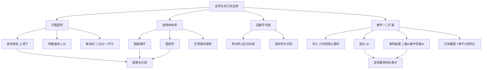

# 高数第10讲 一元函数积分学的应用（一）几何应用

> [!info] 教材来源
> 27张宇基础30讲高数.pdf，印刷页 263-281 / PDF p268-p286。本讲用定积分统一计算面积、体积、平均值，以及数学一、数学二要求的形心、弧长、旋转曲面面积和已知截面体积。

## 本讲速览

- 几何应用的核心不是背孤立公式，而是把几何量写成“微元之和”：先画图、选积分变量，再写面积、体积、弧长或侧面积微元。
- 面积题先确定区域和边界次序：直角坐标用“上减下”或“右减左”，极坐标用“外径平方减内径平方”，曲线换位时必须分段或加绝对值。
- 旋转体先看切片与旋转轴的关系：垂直旋转轴用圆盘/圆环，平行旋转轴用圆柱壳；半径永远是到旋转轴的距离。
- 函数平均值是“定积分除以区间长度”；形心是“几何矩除以面积”，两者形式相似但对象不同。
- 弧长的统一起点是 $\mathrm ds=\sqrt{(\mathrm dx)^2+(\mathrm dy)^2}$；旋转曲面面积再乘旋转周长 $2\pi\rho$。
- 做题主线：画区域 -> 找交点和有效定义域 -> 选微元方向 -> 写积分式 -> 用对称、换元或分段化简 -> 用量纲与正值检查。

## 教材路线

| 教材顺序 | 内容 | 页码 |
|---|---|---|
| 开篇 | 考纲、目标、重难点与知识结构 | 印刷页263 / PDF p268 |
| 一 | 直角坐标与极坐标面积，例10.1-10.4 | 印刷页264-267 / PDF p269-p272 |
| 二 | 旋转体体积、圆盘法、壳层法、任意直线旋转公式，例10.5-10.7 | 印刷页267-271 / PDF p272-p276 |
| 三 | 函数平均值与例10.8 | 印刷页271-272 / PDF p276-p277 |
| 四（1） | 曲边梯形形心坐标与例10.9 | 印刷页272-273 / PDF p277-p278 |
| 四（2） | 直角坐标、参数方程、极坐标弧长，例10.10-10.11 | 印刷页273-274 / PDF p278-p279 |
| 四（3） | 旋转曲面面积，例10.12-10.13 | 印刷页274-275 / PDF p279-p280 |
| 四（4） | 平行截面面积已知的立体体积与例10.14 | 印刷页275-276 / PDF p280-p281 |
| 练习 | 练习10.1-10.9及答案解析 | 印刷页277-281 / PDF p282-p286 |

## 前置知识与关联导航

- 定积分定义、可积条件、几何意义与性质：[[08_高数第8讲_一元函数积分学的概念与性质#5. 定积分几何意义|定积分的几何意义]]。
- 换元、分部、反常积分和周期区间拼接：[[09_高数第9讲_一元函数积分学的计算#7. 定积分计算公式|定积分计算公式]]。
- 切线方程、函数最值与含参最优化：[[05_高数第5讲_一元函数微分学的应用一_几何应用#七、最值或取值范围|最值或取值范围]]。
- 形心与质量分布还会在[[12_高数第12讲_一元函数积分学的应用三#5. 质心、重心、形心|质心、重心、形心]]中系统出现。
- 平面区域面积还可由二重积分计算：[[14_高数第14讲_二重积分#13. 平面区域面积|二重积分求面积]]。
- 下一讲转向积分等式与不等式：[[11_高数第11讲_一元函数积分学的应用二|第11讲 积分等式与积分不等式]]。

## 知识网络

## 知识点清单

## 一、用定积分表达和计算平面图形的面积

### 1. 直角坐标下面积

设两条光滑曲线为 $y=y_1(x)$、$y=y_2(x)$，区域位于 $a\le x\le b$。竖直小条的面积近似为

$$
\Delta S\approx |y_1(x)-y_2(x)|\,\Delta x,
$$

因此

$$
S=\int_a^b |y_1(x)-y_2(x)|\,\mathrm dx.
$$

若整个区间内 $y_1(x)\ge y_2(x)$，才可直接写成

$$
S=\int_a^b [y_1(x)-y_2(x)]\,\mathrm dx.
$$

同理，若左右边界更容易写成 $x=x_{\text{右}}(y)$、$x=x_{\text{左}}(y)$，则

$$
S=\int_c^d [x_{\text{右}}(y)-x_{\text{左}}(y)]\,\mathrm dy.
$$

**微元来源**

$$
\mathrm dS=(\text{上}-\text{下})\,\mathrm dx
$$

只是“高乘宽”的极限。边界上下关系改变时，应在交点处分段，而不是让正负面积互相抵消。

**参数曲线下方面积**

若曲线由

$$
x=x(t),\qquad y=y(t),\qquad \alpha\le t\le\beta
$$

给出，且与 $x$ 轴围成区域，则把 $\int y\,\mathrm dx$ 作换元：

$$
S=\left|\int_\alpha^\beta y(t)x'(t)\,\mathrm dt\right|.
$$

- 若 $x'(t)$ 在区间内变号，应按单调段拆分。
- 绝对值处理的是行进方向；不能不看方向就机械去掉。
- 摆线一拱 $x=a(t-\sin t),y=a(1-\cos t)$ 对应 $0\le t\le2\pi$，教材例10.2得到面积 $3\pi a^2$。

**看到什么想到它**

- “两曲线围成”“与坐标轴围成”：先解交点，再画图判定上、下或左、右。
- 给出参数方程：把普通面积公式中的 $\mathrm dx$ 或 $\mathrm dy$ 换成参数微元。
- 图形无限重复且振幅衰减：按零点分段，把每段面积转成级数。

### 2. 极坐标下面积

扇形微元来自

$$
\Delta S\approx\frac12r^2\Delta\theta.
$$

若外边界为 $r=r_2(\theta)$，内边界为 $r=r_1(\theta)$，且 $\alpha\le\theta\le\beta$，则

$$
S=\frac12\int_\alpha^\beta
\left|r_2^2(\theta)-r_1^2(\theta)\right|\,\mathrm d\theta.
$$

单曲线与极点围成的区域是 $r_1=0$ 的特例：

$$
S=\frac12\int_\alpha^\beta r^2(\theta)\,\mathrm d\theta.
$$

角度范围的确定比积分本身更重要：

1. 由 $r^2\ge0$ 或曲线方程确定可行角区间。
2. 判断积分区间扫过一瓣、半图还是全图。
3. 能用对称性时，先算基本区域再乘倍数。

教材例10.3中，$r^2=a^2\cos2\theta$ 的一瓣对应 $0\le\theta\le\pi/4$，全图面积为

$$
4\cdot\frac12\int_0^{\pi/4}a^2\cos2\theta\,\mathrm d\theta=a^2.
$$

### 3. 绝对值、无穷区域与面积级数

面积恒非负。若 $f(x)$ 反复变号，

$$
S=\int_a^b|f(x)|\,\mathrm dx
$$

通常要按全部零点分段。

当区域延伸到无穷远时，还要把积分理解为反常积分。若每个重复区间的面积构成等比数列，可先求单段再求和。

教材例10.4的结构是

$$
\int_0^\infty e^{-x}|\sin x|\,\mathrm dx.
$$

应按 $[k\pi,(k+1)\pi]$ 分段。第 $k$ 段比第 $0$ 段多因子 $e^{-k\pi}$，所以

$$
S=\frac{1+e^{-\pi}}{2(1-e^{-\pi})}.
$$

> [!warning] 判题边界
> $\int f$ 收敛不代表 $\int|f|$ 收敛；求几何面积时必须处理绝对值，不能把正负区域当作代数面积抵消。

## 二、用定积分表达和计算旋转体的体积

### 4. 圆盘法与圆环法

切片垂直于旋转轴时，小截面是圆盘或圆环。

若 $y=f(x)$ 与 $x$ 轴、$x=a$、$x=b$ 围成区域，绕 $x$ 轴旋转：

$$
\mathrm dV=\pi f^2(x)\,\mathrm dx,
\qquad
V_x=\pi\int_a^b f^2(x)\,\mathrm dx.
$$

若竖直切片到旋转轴的外、内距离分别为 $R(x)$、$r(x)$，则

$$
V=\pi\int_a^b\left[R^2(x)-r^2(x)\right]\,\mathrm dx.
$$

绕 $y$ 轴并用水平切片时同理：

$$
V=\pi\int_c^d\left[R^2(y)-r^2(y)\right]\,\mathrm dy.
$$

**条件与检查**

- $R$、$r$ 是到旋转轴的距离，必须满足 $R\ge r\ge0$。
- 圆环面积是 $\pi(R^2-r^2)$，不是 $\pi(R-r)^2$。
- 旋转轴穿过区域时，截面形状可能改变，应重新画截面并分段。
- 无穷区域旋转后仍可能有有限体积，此时按反常积分处理。

教材例10.5先检查根式

$$
y=e^{x/2}\sqrt{\sin x}
$$

在 $[0,2\pi]$ 中只有 $[0,\pi]$ 取实值，再写

$$
V=\pi\int_0^\pi e^x\sin x\,\mathrm dx
=\frac{\pi}{2}(1+e^\pi).
$$

**看到什么想到它**

- “绕某轴旋转”且容易写出垂直于轴的截面半径：优先圆盘/圆环。
- 题给区间含根式、对数或分母：写积分前先检查函数实际定义域。
- 旋转轴是 $y=c$ 或 $x=c$：半径写成 $|y-c|$ 或 $|x-c|$。

### 5. 圆柱壳法与反函数

切片平行于旋转轴时，小条旋转成薄圆柱壳：

$$
\mathrm dV
=2\pi\cdot(\text{旋转半径})
\cdot(\text{条高})\cdot(\text{条厚}).
$$

若 $0\le a<b$，区域位于 $y=f(x)$ 与 $x$ 轴之间，绕 $y$ 轴旋转：

$$
V_y=2\pi\int_a^b x\,|f(x)|\,\mathrm dx.
$$

若区域写成 $x_{\text{左}}(y)\le x\le x_{\text{右}}(y)$，绕 $x$ 轴旋转：

$$
V_x=2\pi\int_c^d
|y|\,[x_{\text{右}}(y)-x_{\text{左}}(y)]\,\mathrm dy.
$$

若边界由参数方程给出，体积公式仍只是换元。以 $x(t)$ 单调、区域位于第一象限为例：

$$
V_x=\pi\left|\int_\alpha^\beta y^2(t)x'(t)\,\mathrm dt\right|,
$$

$$
V_y=2\pi\left|\int_\alpha^\beta
x(t)y(t)x'(t)\,\mathrm dt\right|.
$$

若 $x'(t)$ 变号或参数曲线回折，必须先按 $x$ 的单调段拆开，防止同一薄壳被重复计算。

教材例10.6的关键不是积分，而是先从函数方程求出

$$
f(x)=\frac{x}{\sqrt{1+x^2}},\qquad x>0,
$$

再反解

$$
x=\frac{y}{\sqrt{1-y^2}},\qquad0<y<1.
$$

由于区域绕 $x$ 轴且水平边界已给出，用水平圆柱壳最自然：

$$
V=2\pi\int_{1/2}^{\sqrt3/2}
y\frac{y}{\sqrt{1-y^2}}\,\mathrm dy
=\frac{\pi^2}{6}.
$$

> [!tip] 选圆盘还是圆柱壳
> 垂直于轴切片容易写半径，就用圆盘/圆环；平行于轴切片容易写“半径乘条高”，就用壳层。两法都能做时，选无需反函数、无需分段的一种。

### 6. 平面曲线绕任意直线旋转

设曲线

$$
L:\ y=f(x),\qquad a\le x\le b
$$

绕直线

$$
L_0:\ Ax+By+C=0
$$

旋转。若过 $L_0$ 的任一垂线与 $L$ 至多有一个交点，则旋转体体积为

$$
V=
\frac{\pi}{(A^2+B^2)^{3/2}}
\int_a^b
[Ax+Bf(x)+C]^2
|Af'(x)-B|\,\mathrm dx.
$$

这个公式由两部分组成：

$$
\rho=\frac{|Ax+Bf(x)+C|}{\sqrt{A^2+B^2}}
$$

是曲线上点到旋转轴的距离，而

$$
\mathrm du=
\frac{|Af'(x)-B|}{\sqrt{A^2+B^2}}\,\mathrm dx
$$

是沿旋转轴方向的截面厚度，故 $\mathrm dV=\pi\rho^2\,\mathrm du$。

当 $L_0$ 为 $x$ 轴时，$A=C=0$，公式退化为

$$
V=\pi\int_a^b f^2(x)\,\mathrm dx.
$$

教材在化简中使用

$$
|B|^3=|B|B^2=B^2|B|,
$$

它保证系数 $B$ 无论正负，退化后的体积系数都为正。

教材例10.7先由“$y=e^x$ 的切线过原点”求切点：

$$
y-y_0=e^{x_0}(x-x_0),\qquad y_0=e^{x_0}
\Rightarrow x_0=1,
$$

所以切线为 $y=ex$。围域用 $y$ 作变量时，

$$
x_{\text{右}}=\frac ye,\qquad x_{\text{左}}=\ln y,
\qquad0<y\le e.
$$

面积与绕 $x=1$ 的体积分别为

$$
A=\int_0^e\left(\frac ye-\ln y\right)\mathrm dy
=\frac e2,
$$

$$
V=\pi\int_0^e
\left[
(1-\ln y)^2-\left(1-\frac ye\right)^2
\right]\mathrm dy
=\frac{5\pi e}{3}.
$$

**看到什么想到它**

- 绕斜线旋转：先判断能否直接写垂直截面；否则考虑任意直线公式。
- 题目给切线、曲线和水平边界：改用 $y$ 往往能避免分段。
- 使用任意直线公式前必须核对“每条轴的垂线至多交曲线一次”，否则旋转生成部分会重叠。

## 三、用定积分表达和计算函数的平均值

### 7. 函数平均值

若 $f$ 在 $[a,b]$ 上可积，则函数平均值为

$$
\bar f=\frac1{b-a}\int_a^b f(x)\,\mathrm dx.
$$

若 $f\in C[a,b]$，由积分中值定理，存在 $\xi\in[a,b]$ 使

$$
\bar f=f(\xi).
$$

直观上，$\bar f$ 是与原曲边梯形具有相同代数面积的矩形高度。它不是

$$
\frac{f(a)+f(b)}2
$$

，也不是最大值与最小值的平均。

**滑动积分型条件**

看到

$$
f(x+T)-f(x)
$$

时，可联想

$$
F(x)=\int_x^{x+T}f(t)\,\mathrm dt,
\qquad
F'(x)=f(x+T)-f(x).
$$

教材例10.8中

$$
F(x)=\int_x^{x+2}f(t)\,\mathrm dt,
\qquad F'(x)=x.
$$

又由 $F(0)=\int_0^2f(t)\,\mathrm dt=0$ 得

$$
F(x)=\frac{x^2}{2}.
$$

于是

$$
\frac1{3-1}\int_1^3f(x)\,\mathrm dx
=\frac12F(1)=\frac14.
$$

**看到什么想到它**

- “平均值、平均高度、平均函数值”：先除以区间长度。
- 已知 $f(x+T)-f(x)$：构造长度为 $T$ 的滑动积分。
- 已知 $f$ 周期为 $T$：任意长度为 $T$ 的区间积分相同。

## 四、其他几何应用（仅数学一、数学二）

### 10. 数学一扩展：形心与旋转体体积

#### （1）形心是几何矩除以面积

均匀平面区域 $D$ 的面积为

$$
S=\iint_D\mathrm d\sigma.
$$

形心坐标为

$$
\bar x=\frac{\iint_Dx\,\mathrm d\sigma}{S},
\qquad
\bar y=\frac{\iint_Dy\,\mathrm d\sigma}{S}.
$$

若

$$
D=\{(x,y)\mid a\le x\le b,\ 0\le y\le f(x)\},
\qquad f(x)\ge0,
$$

则

$$
S=\int_a^bf(x)\,\mathrm dx,
$$

$$
\bar x=
\frac{\int_a^bxf(x)\,\mathrm dx}
{\int_a^bf(x)\,\mathrm dx},
$$

$$
\bar y=
\frac{\frac12\int_a^bf^2(x)\,\mathrm dx}
{\int_a^bf(x)\,\mathrm dx}.
$$

其中 $\bar y$ 分子中的 $\frac12f^2(x)$ 来自

$$
\int_0^{f(x)}y\,\mathrm dy.
$$

若区域夹在 $f(x)\ge g(x)$ 之间，则二级结论为

$$
S=\int_a^b[f(x)-g(x)]\,\mathrm dx,
$$

$$
\bar x=\frac{\int_a^bx[f(x)-g(x)]\,\mathrm dx}{S},
\qquad
\bar y=\frac{\frac12\int_a^b[f^2(x)-g^2(x)]\,\mathrm dx}{S}.
$$

教材例10.9只问横坐标，因此只计算面积和关于 $y$ 轴的一阶矩，不必顺手把 $\bar y$ 也算出。

#### （2）形心与旋转体积的关联补充

> [!note] 补充结论，不是本讲正文主公式
> 面积为 $S$ 的平面区域绕同平面内、不穿过区域内部的直线旋转一周，若形心到轴的距离为 $d$，则
> $V=2\pi dS$。

这个结论可快速检查偏心圆域等题，但必须满足旋转轴不穿区域内部；一般题仍应以圆盘、壳层或截面法建模。

**看到什么想到它**

- “均匀薄片、几何中心、形心”：坐标等于一阶矩除以面积。
- 区域关于某条直线对称：形心必在该对称轴上，可少算一个坐标。
- 题目给非均匀密度：已变成质心问题，应跳转[[12_高数第12讲_一元函数积分学的应用三#5. 质心、重心、形心|质心与重心]]。

### 11. 平面曲线的弧长

弧长微元统一为

$$
\mathrm ds=\sqrt{(\mathrm dx)^2+(\mathrm dy)^2}.
$$

根据曲线表示选择形式。

**直角坐标 $y=f(x)$**

$$
\mathrm ds=\sqrt{1+[f'(x)]^2}\,\mathrm dx,
\qquad
L=\int_a^b\sqrt{1+[f'(x)]^2}\,\mathrm dx.
$$

**直角坐标 $x=g(y)$**

$$
\mathrm ds=\sqrt{1+[g'(y)]^2}\,\mathrm dy,
\qquad
L=\int_c^d\sqrt{1+[g'(y)]^2}\,\mathrm dy.
$$

**参数方程**

$$
\mathrm ds=
\sqrt{[x'(t)]^2+[y'(t)]^2}\,\mathrm dt,
$$

$$
L=\int_\alpha^\beta
\sqrt{[x'(t)]^2+[y'(t)]^2}\,\mathrm dt.
$$

**极坐标**

由 $x=r\cos\theta,\ y=r\sin\theta$ 得

$$
\mathrm ds=
\sqrt{r^2(\theta)+[r'(\theta)]^2}\,\mathrm d\theta,
$$

$$
L=\int_\alpha^\beta
\sqrt{r^2(\theta)+[r'(\theta)]^2}\,\mathrm d\theta.
$$

教材例10.10中

$$
y=\ln(1-x^2),\qquad
y'=-\frac{2x}{1-x^2}.
$$

在 $0\le x\le\frac12$ 上，

$$
\sqrt{1+(y')^2}
=\frac{1+x^2}{1-x^2},
$$

故弧长为 $\ln3-\frac12$。教材例10.11中 $r=\theta$，弧长化为

$$
\int_0^{2\pi}\sqrt{1+\theta^2}\,\mathrm d\theta.
$$

**看到什么想到它**

- 根号中出现 $1+(y')^2$：先尝试化成完全平方或简单有理式。
- 曲线以 $y$ 为范围给出：优先求 $\mathrm dx/\mathrm dy$，不要强行反解成 $y=f(x)$。
- 参数曲线或极坐标曲线有对称性：只算基本弧段再乘倍数。

### 12. 旋转曲面的面积（侧面积）

一小段曲线绕轴旋转形成窄曲面带，其面积微元为

$$
\mathrm dS=2\pi\rho\,\mathrm ds,
$$

其中 $\rho$ 是曲线点到旋转轴的距离。

**$y=f(x)$ 绕 $x$ 轴**

$$
S=2\pi\int_a^b
|f(x)|\sqrt{1+[f'(x)]^2}\,\mathrm dx.
$$

**参数曲线绕 $x$ 轴**

$$
S=2\pi\int_\alpha^\beta
|y(t)|
\sqrt{[x'(t)]^2+[y'(t)]^2}\,\mathrm dt.
$$

**极坐标曲线绕 $x$ 轴**

由于旋转半径为 $|y|=|r\sin\theta|$，

$$
S=2\pi\int_\alpha^\beta
|r(\theta)\sin\theta|
\sqrt{r^2(\theta)+[r'(\theta)]^2}\,\mathrm d\theta.
$$

绕 $y$ 轴时只需把旋转半径换成 $|x|$：

$$
S=2\pi\int |x|\,\mathrm ds.
$$

教材例10.13的星形线绕 $x$ 轴时，只取上半曲线生成曲面。下半曲线旋转后与上半曲线生成同一曲面，若把整条闭曲线直接积分会重复计数。

**看到什么想到它**

- “曲线绕轴所得曲面面积、侧面积”：用 $2\pi\rho\,\mathrm ds$。
- “区域绕轴所得体积”：用圆盘、圆环或壳层，不能把两类微元混用。
- 先判断哪些弧段生成的是同一曲面，再决定对称倍数。

### 13. 平行截面面积已知的立体体积

若在轴向坐标 $u\in[\alpha,\beta]$ 处，垂直于该轴的截面积为连续函数 $A(u)$，则

$$
V=\int_\alpha^\beta A(u)\,\mathrm du.
$$

旋转体只是

$$
A(u)=\pi R^2(u)
\quad\text{或}\quad
A(u)=\pi[R^2(u)-r^2(u)]
$$

的特例。

教材例10.14把 $y=\sqrt x$ 与 $y=x$ 围成的区域绕斜线 $y=x$ 旋转。曲线上点到轴的垂直距离为

$$
r(x)=\frac{\sqrt x-x}{\sqrt2},
$$

沿轴方向的厚度不是 $\mathrm dx$，而是

$$
\mathrm du=\sqrt2\,\mathrm dx.
$$

因此

$$
V=\int_0^1\pi r^2(x)\,\mathrm du
=\int_0^1
\pi\left(\frac{\sqrt x-x}{\sqrt2}\right)^2
\sqrt2\,\mathrm dx
=\frac{\sqrt2\pi}{60}.
$$

> [!warning] 斜轴题的核心
> 截面半径必须用点到直线的垂直距离，截面厚度必须沿旋转轴方向量取。把 $\mathrm du$ 直接写成 $\mathrm dx$ 会漏掉投影因子。

## 公式与二级结论索引

| 结论 | 完整条件与入口 |
|---|---|
| $S=\int_a^b|y_1-y_2|\,\mathrm dx$ | 竖直切片；能确定上下关系时才去绝对值 |
| $S=\int_c^d(x_{\rm 右}-x_{\rm 左})\,\mathrm dy$ | 水平切片；左右边界比上下边界容易表示 |
| $S=\left|\int_\alpha^\beta y(t)x'(t)\,\mathrm dt\right|$ | 参数曲线与 $x$ 轴围域；按单调段和方向处理 |
| $S=\frac12\int|r_2^2-r_1^2|\,\mathrm d\theta$ | 极坐标环扇形；先确定角区间与内外边界 |
| $V=\pi\int(R^2-r^2)\,\mathrm du$ | 切片垂直旋转轴，截面为圆环 |
| $V=2\pi\int(\text{半径})(\text{条高})\,\mathrm du$ | 切片平行旋转轴，薄壳不重叠 |
| 任意直线旋转公式 | 见[[#6. 平面曲线绕任意直线旋转]]；每条轴的垂线至多交曲线一次 |
| $\bar f=(b-a)^{-1}\int_a^bf$ | $f$ 在 $[a,b]$ 可积；连续时 $\bar f=f(\xi)$ |
| $\bar x=\frac{\iint_Dx}{S},\ \bar y=\frac{\iint_Dy}{S}$ | 均匀平面区域形心；分母是面积 |
| $\mathrm ds=\sqrt{(\mathrm dx)^2+(\mathrm dy)^2}$ | 弧长统一微元，按坐标表示展开 |
| $S_{\rm 曲面}=2\pi\int\rho\,\mathrm ds$ | 曲线绕轴所得侧面积；$\rho$ 为到轴距离 |
| $V=\int A(u)\,\mathrm du$ | $A(u)$ 是垂直于轴向坐标 $u$ 的真实截面积 |
| $V=2\pi dS$ | 关联补充；平面区域绕不穿内部的共面直线旋转 |

## 题型-方法决策表

| 题面信号 | 首选方法 | 备选方法 | 必查项 |
|---|---|---|---|
| 两条直角坐标曲线围域 | 上减下或右减左 | 分段后加绝对值 | 交点、边界次序 |
| 参数曲线与坐标轴围域 | $\int y(t)x'(t)\,\mathrm dt$ | 改成普通函数 | 参数方向、单调段 |
| 极坐标曲线面积 | $\frac12\int r^2\,\mathrm d\theta$ | 对称区域倍乘 | 一瓣角区间 |
| 衰减振荡曲线与轴围成总面积 | 按零点分段后求级数 | 先研究周期缩放 | 绝对值、收敛性 |
| 区域绕轴且垂直切片简单 | 圆盘/圆环 | 壳层法 | 到轴距离、内外半径 |
| 区域绕轴且平行切片简单 | 圆柱壳 | 圆环法 | 壳半径、条高 |
| 绕斜线或外部直线旋转 | 截面法或任意直线公式 | 形心旋转定理 | 投影厚度、无重叠条件 |
| 平均函数值 | 积分除以区间长度 | 滑动积分构造 | 分母 $b-a$ |
| 均匀区域形心 | 一阶矩除以面积 | 利用对称性 | 密度是否均匀 |
| 求曲线长度 | 选择最简弧长公式 | 换参数或换变量 | 导数、根号、对称倍数 |
| 求旋转曲面侧面积 | $2\pi\rho\,\mathrm ds$ | 参数化 | 半径、曲面是否重复 |
| 已知每个截面形状或面积 | $V=\int A(u)\,\mathrm du$ | 等价变换 | 截面方向和厚度 |
| 几何量含参数并求最值 | 先建积分，再对参数求导 | 对称或不等式 | 参数范围、端点 |

## 教材例题覆盖表

| 例题 | 页码 | 题面信号与方法入口 | 关键结论或自检结果 |
|---|---|---|---|
| 例10.1 | PDF p269-p270 | 相邻幂函数围成面积；先求 $A_n$，再裂项求和，最后用重要极限 | $A_n=\frac1{n+1}-\frac1{n+2}$，极限为 $e^{-2}$ |
| 例10.2 | PDF p270-p271 | 摆线一拱；把 $\int y\,\mathrm dx$ 作参数换元 | $S=3\pi a^2$ |
| 例10.3 | PDF p271 | 伯努利双纽线；算一瓣后乘4 | $S=a^2$ |
| 例10.4 | PDF p271-p272 | 衰减振荡曲线；按半周期拆绝对值，再求等比级数 | $S=\frac{1+e^{-\pi}}{2(1-e^{-\pi})}$ |
| 例10.5 | PDF p272-p273 | 根式函数绕 $x$ 轴；先缩小到真实定义域 | $V=\frac\pi2(1+e^\pi)$ |
| 例10.6 | PDF p273-p274 | 函数方程加水平边界；求 $f$、反解 $x(y)$，用水平壳层 | $f(x)=x/\sqrt{1+x^2}$，$V=\pi^2/6$ |
| 例10.7 | PDF p275-p276 | 指数曲线切线过原点；先求切点，再以 $y$ 为变量 | $A=e/2,\ V=5\pi e/3$ |
| 例10.8 | PDF p276-p277 | 差分 $f(x+2)-f(x)$；构造滑动积分并求导 | 平均值为 $1/4$ |
| 例10.9 | PDF p277-p278 | 曲边梯形形心；只问横坐标，算一阶矩除面积 | $\bar x=\frac{3(e^2+1)(e^2-3)}{4(e^3-7)}$ |
| 例10.10 | PDF p278-p279 | 直角坐标弧长；根式化为有理式 | $L=\ln3-\frac12$ |
| 例10.11 | PDF p279 | 阿基米德螺线；直接用极坐标弧长 | $L=\pi\sqrt{1+4\pi^2}+\frac12\ln(2\pi+\sqrt{1+4\pi^2})$ |
| 例10.12 | PDF p279-p280 | 曲线绕 $x$ 轴求侧面积 | $S=\frac\pi6(5\sqrt5-1)$ |
| 例10.13 | PDF p280 | 参数星形线绕 $x$ 轴；取上半曲线并用对称性 | $S=48\pi/5$ |
| 例10.14 | PDF p280-p281 | 围域绕斜线 $y=x$；垂距作半径、轴向距离作厚度 | $V=\sqrt2\pi/60$ |

## 讲末练习反查

| 练习 | 只看本笔记应想到的入口 | 关键步骤与自检结果 |
|---|---|---|
| 10.1 | 无穷区域绕 $x$ 轴，用圆盘法后取反常极限 | $\pi\int_0^\infty(1+x^2)^{-1}\mathrm dx=\pi^2/2$ |
| 10.2 | 偏心圆域绕 $x$ 轴，圆环平方差或形心旋转定理 | $V=2\pi^2k^2b$；条件 $0<k<b$ 保证轴不穿圆域 |
| 10.3 | 曲线以 $y$ 为范围给出，直接用 $\mathrm dx/\mathrm dy$ 弧长式 | 根式化为 $\frac12(y+1/y)$，$L=(e^2+1)/4$ |
| 10.4 | 参数星形线，先用四象限对称性 | 一象限参数弧长乘4，$L=6$ |
| 10.5 | 先除以区间长度，再令 $x=\sin\theta$ | 平均值为 $\pi(\sqrt3+1)/12$ |
| 10.6 | 设切点参数 $t$，写切线并把围成面积化成 $S(t)$ | $S'(t)=0$ 得 $t=1$，最优切线 $y=x/2+1/2$ |
| 10.7 | $D_1$ 绕 $x$ 轴用圆盘，$D_2$ 绕 $y$ 轴用壳层，再对 $a$ 求最值 | $a=1$ 时最大，$V_{\max}=129\pi/5$ |
| 10.8 | 摆线一拱区域绕 $y$ 轴，可选水平圆环或竖直壳层 | 两法同得 $V=6\pi^3a^3$ |
| 10.9 | 先把 $|x^2-1|$ 在 $|x|=1$ 分段，再用对称圆环 | $V=448\pi/15$ |

## 易错点/易混点

1. 面积是 $\int|y_1-y_2|$；不画图直接写 $y_1-y_2$，可能把部分面积抵消。
2. 参数面积中的 $x'(t)$ 决定方向；参数反向时积分会变号，但几何面积不能为负。
3. 极坐标面积前有 $\frac12$，角区间还要判断是一瓣、半图还是全图。
4. 无限多个曲边区域的总面积既要加绝对值，又要检查所得级数是否收敛。
5. 写几何积分前先检查函数定义域；教材例10.5的原题区间并非全部有效。
6. 圆环截面积是 $\pi(R^2-r^2)$，不是 $\pi(R-r)^2$。
7. 壳层法中“旋转半径”和“条高”是不同量；半径永远是到轴的距离。
8. 绕 $x$ 轴并不意味着一定用 $\mathrm dx$；水平壳层可能更简单。
9. 任意直线旋转公式有单值截面条件，生成体重叠时不能直接套用。
10. 平均值必须除以区间长度 $b-a$，不能用端点值平均代替。
11. 形心公式只适用于均匀区域；非均匀密度应使用质量矩。
12. 弧长根号里是导数平方，不是函数平方；以 $y$ 为变量时用 $\mathrm dx/\mathrm dy$。
13. 旋转体体积使用截面积微元，旋转曲面面积使用 $2\pi\rho\,\mathrm ds$，两者不能混。
14. 闭曲线绕轴时，不同弧段可能生成同一曲面；教材例10.13不能把上下半曲线重复计算。
15. 已知截面题的积分变量沿截面法向方向；斜轴题不能默认厚度就是 $\mathrm dx$。
16. 利用对称性前要确认被积式、区域和所求几何量都保持对称。
17. 含参数几何最值题不仅查驻点，还要检查参数范围和端点。
18. 形心旋转定理要求旋转轴不穿区域内部，只能作为满足条件时的快捷法或验算。

## 注解

### 为什么“先画图”是计算步骤而不是形式要求

图决定交点、上下关系、积分变量和是否分段。面积、体积题的大多数错误都发生在积分号写下之前；一张简图等于先完成了建模。

### 为什么圆盘法和壳层法本质相同

两者都在把体积拆成不重叠小体积。圆盘法累加“截面积乘厚度”，壳层法累加“周长乘高乘厚度”；选择标准只是哪个方向更容易表达。

### 为什么弧长和侧面积必须先写 $\mathrm ds$

弧长是沿曲线量取，不能用水平宽 $\mathrm dx$ 代替。侧面积的小带宽同样是 $\mathrm ds$，因此统一公式自然成为 $2\pi\rho\,\mathrm ds$。

### 为什么例10.14不能直接把 $\mathrm dx$ 当厚度

截面垂直于斜轴 $y=x$，相邻截面沿轴的距离是 $\mathrm du=\sqrt2\,\mathrm dx$。半径与厚度都要经过投影，这正是斜轴题最容易漏掉的两项。

## 速背检查

1. 两曲线直角坐标面积为什么通常要写绝对值？答：上下关系可能改变，几何面积不能正负抵消。
2. 参数曲线与 $x$ 轴围域怎样写面积？答：$\left|\int y(t)x'(t)\,\mathrm dt\right|$，必要时按单调段拆分。
3. 极坐标面积微元是什么？答：$\mathrm dS=\frac12r^2\,\mathrm d\theta$。
4. 圆盘法和壳层法怎样选？答：垂直轴切片简单用圆盘，平行轴切片简单用壳层。
5. 圆环截面积是什么？答：$\pi(R^2-r^2)$。
6. 壳层体积微元是什么？答：$2\pi\cdot$半径$\cdot$条高$\cdot$条厚。
7. 旋转半径如何确定？答：取曲线点或小条到旋转轴的垂直距离。
8. 函数平均值公式是什么？答：$\bar f=(b-a)^{-1}\int_a^bf(x)\,\mathrm dx$。
9. 看到 $f(x+T)-f(x)$ 应构造什么？答：$F(x)=\int_x^{x+T}f(t)\,\mathrm dt$。
10. 均匀区域的形心如何求？答：坐标的一阶矩除以区域面积。
11. 曲边梯形的 $\bar y$ 分子为什么有 $\frac12f^2$？答：因为 $\int_0^{f(x)}y\,\mathrm dy=\frac12f^2(x)$。
12. 直角坐标弧长公式是什么？答：$\int\sqrt{1+(y')^2}\,\mathrm dx$。
13. 参数弧长公式是什么？答：$\int\sqrt{x'^2+y'^2}\,\mathrm dt$。
14. 极坐标弧长公式是什么？答：$\int\sqrt{r^2+r'^2}\,\mathrm d\theta$。
15. 旋转曲面面积的统一微元是什么？答：$\mathrm dS=2\pi\rho\,\mathrm ds$。
16. 已知垂直截面积 $A(u)$ 时体积怎样求？答：$V=\int A(u)\,\mathrm du$。
17. 斜轴截面题必须额外检查什么？答：垂直距离作半径，沿轴投影作厚度。
18. 教材例10.13为何只取上半星形线？答：上下半曲线绕 $x$ 轴生成同一曲面，全部积分会重复。
19. 无穷区域旋转体积怎样处理？答：先写圆盘或壳层微元，再按反常积分取极限。
20. 几何量含参数并求最值的流程是什么？答：先建积分得到参数函数，再查驻点、参数范围和端点。

## OCR/视觉核查

- 本讲 PDF p268-p286 共19页已逐页渲染并 OCR，共提取682行文字骨架。
- 已查看5张覆盖全部页面的联系图，并逐页查看全部19张高清原图。
- 例10.1-10.14与练习10.1-10.9均已建立覆盖记录；公式、图形、积分限、对称倍数和答案以高清原页为准，OCR只用于检索。
- 证据入口：[[00_OCR视觉核查报告#10 高数 一元函数积分学的应用（一）几何应用|查看本讲 OCR/视觉核查]]。

## 相关链接

- [[08_高数第8讲_一元函数积分学的概念与性质|第8讲 积分概念与性质]]
- [[09_高数第9讲_一元函数积分学的计算|上一讲：积分计算]]
- [[11_高数第11讲_一元函数积分学的应用二|下一讲：积分等式与积分不等式]]
- [[12_高数第12讲_一元函数积分学的应用三#5. 质心、重心、形心|质心、重心、形心]]
- [[14_高数第14讲_二重积分#13. 平面区域面积|二重积分求平面区域面积]]
