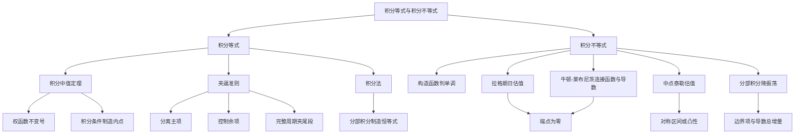

# 高数第11讲 一元函数积分学的应用（二）：积分等式与积分不等式

> [!info] 教材范围
> 来源：`27张宇基础30讲高数.pdf`，印刷页 282-293 / PDF p287-p298。
>
> 本讲正文含例11.1-例11.11，讲末练习含11.1-11.6。笔记按教材顺序压缩方法，不抄写完整题目。

## 本讲速览

- **积分等式**有三条主线：用积分中值定理制造内点，用夹逼准则处理含参积分极限，用分部积分制造恒等式。
- **积分不等式**有五个教材入口：函数单调性、拉格朗日中值定理、泰勒公式、分部积分、牛顿-莱布尼茨公式。
- 证明题不是“背一个万能公式”，而是把题设翻译成工具：`不变号权函数 -> 中值定理`，`端点为零 -> 用导数表示函数`，`对称区间 -> 中点泰勒`，`振荡因子 -> 分部积分`。
- 求积分极限时，优先问能否**分离主项并夹住余项**；不要一看到积分就先求原函数，也不要把随参数变化的中值点当常数。
- 本讲所有方法最终都在做两件事：把未知积分变成**可比较的非负量**，或变成**端点值、导数上界和简单核函数**。

## 教材路线

| 教材顺序 | 印刷页 / PDF页 | 内容与题目 |
|---|---|---|
| 入口与结构图 | 282 / p287 | 考点、目标、积分等式三法与积分不等式五法 |
| 一、积分等式：用中值定理 | 283-284 / p288-p289 | 推广积分中值定理；例11.1、例11.2 |
| 一、积分等式：用夹逼准则 | 285-286 / p290-p291 | 例11.3-例11.5；$\int_0^1x^nf(x)\,dx\to0$ |
| 一、积分等式：用积分法 | 286-287 / p291-p292 | 例11.6：两次分部积分与二阶导估值 |
| 二、积分不等式：单调性 | 287-288 / p292-p293 | 例11.7：把目标差参数化并求导 |
| 二、积分不等式：中值定理、泰勒 | 288-289 / p293-p294 | 例11.8、例11.9 |
| 二、积分不等式：积分法、牛顿-莱布尼茨 | 289-290 / p294-p295 | 例11.10、例11.11 |
| 基础习题精练与答案 | 290-293 / p295-p298 | 练习11.1-11.6及解析 |

## 前置知识与关联导航

- 定积分保序、估值和中值：[[08_高数第8讲_一元函数积分学的概念与性质#7. 定积分基本性质|定积分基本性质]]、[[08_高数第8讲_一元函数积分学的概念与性质#题型8：积分中值定理|积分中值定理题型]]。
- 罗尔、拉格朗日、柯西中值定理：[[06_高数第6讲_一元函数微分学的应用二#2. 罗尔定理|罗尔定理]]、[[06_高数第6讲_一元函数微分学的应用二#3. 拉格朗日中值定理|拉格朗日中值定理]]、[[06_高数第6讲_一元函数微分学的应用二#4. 柯西中值定理|柯西中值定理]]。
- 泰勒估值：[[06_高数第6讲_一元函数微分学的应用二#6. 泰勒公式（拉格朗日余项）|带拉格朗日余项的泰勒公式]]。
- 牛顿-莱布尼茨与分部积分：[[09_高数第9讲_一元函数积分学的计算#（1）牛顿-莱布尼茨公式|牛顿-莱布尼茨公式]]、[[09_高数第9讲_一元函数积分学的计算#4. 分部积分法|分部积分法]]。
- 上一讲把积分用于几何量，本讲把积分性质用于证明：[[10_高数第10讲_一元函数积分学的应用一_几何应用|第10讲 几何应用]]。
- 下一讲把微元法用于物理、经济模型：[[12_高数第12讲_一元函数积分学的应用三|第12讲 物理与经济应用]]。

## 知识网络

## 知识点清单

### 1. 积分等式的三条主线

积分等式题常以“证明存在某点”“求含参积分极限”“证明两个积分相等”出现。先按题面信号分流：

| 题面信号 | 首选入口 | 核心动作 |
|---|---|---|
| 存在 $\xi$，积分中有连续因子与不变号权函数 | 积分中值定理 | 把连续因子在某点取值抽出 |
| $n\to\infty$，被积函数含 $x^n$、$e^{-x^n}$、复合对数幂 | 夹逼准则 | 先分离主项，再找可积的上界 |
| 端点条件与二阶导同时出现 | 分部积分 | 设计核函数，使边界项消失 |

> [!tip] 做题起手式
> 先写出目标最想变成的形状：`常数 + 趋零余项`、`f(ξ)×权函数积分`，或 `∫简单核×高阶导数`。工具由目标形状决定。

### 2. 积分中值定理

#### 2.1 普通形式

若 $f$ 在 $[a,b]$ 上连续，$a<b$，则至少存在 $\xi\in(a,b)$，使

$$
\int_a^b f(x)\,dx=f(\xi)(b-a).
$$

直观上，$f(\xi)$ 是函数在区间上的某个“平均高度”。等价地，

$$
f(\xi)=\frac1{b-a}\int_a^b f(x)\,dx.
$$

#### 2.2 推广形式：带权积分中值定理

若 $f,g$ 在 $[a,b]$ 上连续，且 $g$ 在 $[a,b]$ 上不变号，则存在 $\xi\in(a,b)$，使

$$
\int_a^b f(x)g(x)\,dx
=f(\xi)\int_a^b g(x)\,dx.
$$

- $g$ 是**权函数**；不变号保证加权平均不会被正负抵消破坏。
- 若 $g\equiv0$，等式显然成立；证明时应先单独处理。
- 若 $g\le0$，可把 $-g$ 作为非负权函数，不影响结论。

**教材证明骨架（例11.1(1)）**：设

$$
F(x)=\int_a^x f(t)g(t)\,dt,
\qquad
G(x)=\int_a^x g(t)\,dt.
$$

当 $g>0$ 时，$G'(x)=g(x)>0$。在 $[a,b]$ 上对 $F,G$ 用柯西中值定理：

$$
\frac{F(b)-F(a)}{G(b)-G(a)}
=\frac{F'(\xi)}{G'(\xi)}=f(\xi),
$$

整理即得推广形式。

**看到什么想到它**：

- 题目直接要求“存在 $\xi$ 使积分等式成立”；
- 积分里有一个容易判断不变号的因子，如 $e^{\sin x}\cos x$；
- 想把复杂但连续的 $f(x)$ 抽成 $f(\xi)$，剩余权函数可计算或可估计。

#### 2.3 含参中值点不能当常数

例11.1(2)中，设

$$
I_n=\int_1^2 f(x)e^{-x^n}\,dx.
$$

因 $e^{-x^n}>0$，存在随 $n$ 变化的 $\xi_n\in(1,2)$，使

$$
I_n=f(\xi_n)\int_1^2e^{-x^n}\,dx.
$$

$f$ 连续只保证 $f(\xi_n)$ 有界，并不自动保证 $\xi_n$ 收敛。真正决定极限的是权函数积分：

$$
0<e^{-x^n}<x^{-n}\quad(1<x\le2),
$$

所以

$$
0<\int_1^2e^{-x^n}\,dx
<\int_1^2x^{-n}\,dx\longrightarrow0,
$$

从而 $I_n\to0$。

#### 2.4 从积分条件制造导数符号

例11.2的通用链条是：

1. 用推广积分中值定理把积分条件变成 $f(\eta)=f(0)$ 一类的**内点等值**；
2. 等值区间用罗尔定理，得到某点 $f'(\xi_1)=0$；
3. 另一端函数值更小，用拉格朗日中值定理得到某点 $f'(\xi_2)<0$；
4. 再对 $f'$ 用拉格朗日中值定理，得到 $f''(\xi)<0$。

**看到什么想到它**：题目给一个积分等式，同时给端点函数值，最后却问“存在 $f'$ 或 $f''$ 满足某符号”。先用积分中值把“积分信息”降成“函数值信息”，再逐阶使用微分中值定理。

### 3. 用夹逼准则

#### 3.1 基本原则：先夹被积函数，再积分

若在 $[a,b]$ 上

$$
0\le f_n(x)\le g_n(x),
\qquad
\int_a^b g_n(x)\,dx\to0,
$$

则由积分保序性，

$$
0\le\int_a^b f_n(x)\,dx
\le\int_a^b g_n(x)\,dx\to0.
$$

若 $f_n$ 不一定非负，先估计

$$
\left|\int_a^b f_n(x)\,dx\right|
\le\int_a^b|f_n(x)|\,dx.
$$

#### 3.2 分部积分分离主项（例11.3）

看到 $(n+1)x^n$，应识别

$$
(n+1)x^n\,dx=d(x^{n+1}).
$$

于是

$$
\int_0^1(n+1)x^n\ln(1+x)\,dx
=\ln2-\int_0^1\frac{x^{n+1}}{1+x}\,dx.
$$

余项满足

$$
0\le\int_0^1\frac{x^{n+1}}{1+x}\,dx
\le\int_0^1x^{n+1}\,dx=\frac1{n+2}\to0,
$$

故原极限为 $\ln2$。

**看到什么想到它**：积分中出现“幂函数导数 × 另一个函数”，先分部积分，让幂函数在端点 $x=1$ 留下主值，再夹逼剩余积分。

#### 3.3 复合幂先比较底数（例11.4）

在 $0\le t\le1$ 上，

$$
0\le\ln(1+t)\le t.
$$

因此对正整数 $n$，

$$
0\le |\ln t|[\ln(1+t)]^n\le t^n|\ln t|.
$$

控制积分可直接算出：

$$
\int_0^1t^n|\ln t|\,dt=\frac1{(n+1)^2}.
$$

所以被控制的积分趋于 $0$。这里还用到边界事实

$$
\lim_{t\to0^+}t^\alpha\ln t=0\qquad(\alpha>0).
$$

#### 3.4 教材的一般结论

若 $f$ 在 $[0,1]$ 上连续，则 $f$ 有界，并且

$$
\boxed{\lim_{n\to\infty}\int_0^1x^nf(x)\,dx=0.}
$$

若 $m\le f(x)\le M$，则

$$
\frac{m}{n+1}
\le\int_0^1x^nf(x)\,dx
\le\frac{M}{n+1},
$$

两端都趋于 $0$。

> [!note] 二级结论：端点抽样
> 若 $f$ 在 $[0,1]$ 连续，则还可证明
> $$
> (n+1)\int_0^1x^nf(x)\,dx\to f(1).
> $$
> 此时核 $(n+1)x^n$ 的总积分为 $1$，质量集中到右端点。不能只用“积分中值点”一句话跳过集中性证明。

#### 3.5 周期函数的长期平均（例11.5）

对 $f(x)=x-[x]$，每个长度为 $1$ 的完整周期积分均为 $1/2$。令

$$
n\le x<n+1,
$$

则用 $n$ 个完整周期和最后不足一个周期夹住 $\int_0^x f(t)\,dt$，并同步夹住 $1/x$，得到

$$
\frac{n}{2(n+1)}
<\frac1x\int_0^x f(t)\,dt
<\frac{n+1}{2n}.
$$

故极限为 $1/2$。

**可迁移结论**：若 $f$ 以 $T$ 为周期且在一周期可积，则

$$
\lim_{x\to\infty}\frac1x\int_0^x f(t)\,dt
=\frac1T\int_0^T f(t)\,dt.
$$

做法永远是“完整周期 + 有界尾段”。

### 4. 用积分法

这里的“积分法”主要指**分部积分制造等式**。题设给出端点值和高阶导数时，应反向设计一个核函数，使分部积分后的边界项消失。

#### 4.1 两次分部积分恒等式（例11.6）

若 $f''$ 在 $[0,1]$ 连续，且

$$
f(0)=f(1)=0,
$$

则

$$
\boxed{
\int_0^1f(x)\,dx
=\frac12\int_0^1x(x-1)f''(x)\,dx.}
$$

为什么选 $x(x-1)$：它在两个端点都为零，第一次分部积分可消去含 $f'$ 的边界项；再次分部积分后，含 $f$ 的边界项又由 $f(0)=f(1)=0$ 消失。

若

$$
M=\max_{0\le x\le1}|f''(x)|,
$$

则

$$
\left|\int_0^1f(x)\,dx\right|
\le\frac M2\int_0^1x(1-x)\,dx
=\frac M{12}.
$$

**看到什么想到它**：两端函数值为零、二阶导有界、目标是估计整段积分。若只用一次泰勒往往常数不够好，两次分部积分会把端点条件全部利用起来。

### 5. 用函数的单调性

#### 5.1 通用流程

1. 把待证不等式移到一边；
2. 将固定上限 $b$ 暂时换成变量 $x$，构造 $F(x)$；
3. 让 $F(a)=0$ 或其他端点值容易计算；
4. 求 $F'(x)$，利用题设单调性判定符号；
5. 由 $F$ 的单调性比较端点。

#### 5.2 嵌套积分上限（例11.7）

设 $f,g$ 在 $[a,b]$ 连续，$f$ 单调增加，$0\le g(x)\le1$。先有

$$
0\le\int_a^xg(t)\,dt\le x-a,
$$

所以

$$
a+\int_a^xg(t)\,dt\le x.
$$

为证明

$$
\int_a^{a+\int_a^b g(t)\,dt}f(x)\,dx
\le\int_a^bf(x)g(x)\,dx,
$$

构造

$$
F(x)=
\int_a^{a+\int_a^xg(u)\,du}f(t)\,dt
-\int_a^xf(t)g(t)\,dt.
$$

求导得

$$
F'(x)=
\left[f\left(a+\int_a^xg(u)\,du\right)-f(x)\right]g(x)\le0.
$$

这里同时用了：新上限不超过 $x$、$f$ 递增、$g\ge0$。又 $F(a)=0$，故 $F(b)\le0$。

**看到什么想到它**：不等式中出现“由积分决定的新上限”，且给出函数单调性或 $0\le g\le1$。先证明新上限与 $x$ 的大小，再构造目标差。

### 6. 拉格朗日中值定理估值

#### 6.1 一个端点为零

若 $f(a)=0$，$f'$ 在 $[a,b]$ 连续，且

$$
M=\max_{[a,b]}|f'(x)|,
$$

则由拉格朗日中值定理，

$$
|f(x)|=|f(x)-f(a)|\le M(x-a).
$$

从而

$$
\left|\int_a^bf(x)\,dx\right|
\le\frac{M(b-a)^2}{2}.
$$

#### 6.2 两个端点都为零（例11.8）

若 $f(a)=f(b)=0$，则从左右两端分别估计：

$$
|f(x)|\le M(x-a),
\qquad
|f(x)|\le M(b-x).
$$

因此

$$
|f(x)|\le M\min\{x-a,b-x\}.
$$

在区间中点 $c=(a+b)/2$ 分段积分，得到

$$
\boxed{
\left|\int_a^bf(x)\,dx\right|
\le\frac{M(b-a)^2}{4}.}
$$

特别地，在 $[0,1]$ 上有

$$
\left|\int_0^1f(x)\,dx\right|\le\frac M4.
$$

> [!warning] 例11.8的关键逻辑
> 若先在任意点 $x$ 分段，只会得到
> $$
> \left|\int_0^1f\right|\le\frac M2[x^2+(1-x)^2].
> $$
> 右端在 $x=1/2$ 取最小值 $M/4$。因此必须明确“取 $x=1/2$”；仅写 $x^2/2+(1-x)^2/2\ge1/4$ 不能直接推出目标上界。

**看到什么想到它**：给端点零值和 $\max|f'|$，目标含 $|f|$ 或 $|\int f|$。一个零点形成单侧线性包络，两个零点形成三角形包络。

### 7. 用泰勒公式

#### 7.1 中点展开与对称消项（例11.9）

若 $f$ 在 $[c-h,c+h]$ 上二阶可导，$f(c)=0$，且 $|f''(x)|\le M$，则在 $c$ 处展开：

$$
f(x)=f'(c)(x-c)+\frac{f''(\xi_x)}2(x-c)^2.
$$

对称区间上

$$
\int_{c-h}^{c+h}(x-c)\,dx=0,
$$

所以

$$
\left|\int_{c-h}^{c+h}f(x)\,dx\right|
\le\frac M2\int_{c-h}^{c+h}(x-c)^2\,dx
=\frac{Mh^3}{3}.
$$

例11.9取 $c=1,h=1$，即

$$
\left|\int_0^2f(x)\,dx\right|\le\frac M3.
$$

**展开点怎么选**：优先选已知函数值的点；若区间对称，再优先选中点，使一次项积分自动为零。

#### 7.2 凸函数位于切线上方（练习11.6）

若 $f''(x)>0$，则 $f$ 严格凸。对任意展开中心 $c$，

$$
f(x)>f(c)+f'(c)(x-c)\qquad(x\ne c).
$$

在关于 $c$ 对称的区间积分时，线性项消失。若 $c=1/2$ 且 $f(c)=1$，则

$$
\int_0^1f(x)\,dx>1.
$$

**看到什么想到它**：$f''>0$、给出中点函数值、要求积分下界。几何语言是“图像在切线上方”，计算语言是“泰勒余项为正”。

### 8. 用积分法

本节的“积分法”侧重**分部积分把难估计的振荡因子转移给导数**。

#### 8.1 高频振荡积分（例11.10）

设 $f\in C^1[0,2\pi]$ 且 $f'(x)\ge0$。对正整数 $n$，分部积分：

$$
\int_0^{2\pi}f(x)\sin nx\,dx
=-\frac1n[f(x)\cos nx]_0^{2\pi}
+\frac1n\int_0^{2\pi}f'(x)\cos nx\,dx.
$$

取绝对值并用 $|\cos nx|\le1$：

$$
\left|\int_0^{2\pi}f(x)\sin nx\,dx\right|
\le\frac1n[f(2\pi)-f(0)]
+\frac1n\int_0^{2\pi}f'(x)\,dx.
$$

因 $f'\ge0$，

$$
\int_0^{2\pi}f'(x)\,dx=f(2\pi)-f(0),
$$

故

$$
\boxed{
\left|\int_0^{2\pi}f(x)\sin nx\,dx\right|
\le\frac2n[f(2\pi)-f(0)].}
$$

**看到什么想到它**：$\sin nx$、$\cos nx$ 与 $n\to\infty$ 或 $1/n$ 型估计。分部积分能把振荡函数积分一次，直接产生 $1/n$。

### 9. 用牛顿-莱布尼茨公式

#### 9.1 把函数值写成导数积分

若 $f(a)=0$，则

$$
f(x)=\int_a^xf'(t)\,dt,
\qquad
|f(x)|\le\int_a^x|f'(t)|\,dt.
$$

若 $f(b)=0$，则

$$
f(x)=-\int_x^bf'(t)\,dt,
\qquad
|f(x)|\le\int_x^b|f'(t)|\,dt.
$$

#### 9.2 两端为零的 $L^1$ 估计（例11.11）

若 $f(a)=f(b)=0$，把上面两式相加：

$$
2|f(x)|
\le\int_a^x|f'(t)|\,dt+\int_x^b|f'(t)|\,dt
=\int_a^b|f'(t)|\,dt.
$$

因此

$$
\boxed{|f(x)|\le\frac12\int_a^b|f'(t)|\,dt.}
$$

**与拉格朗日法的区别**：

- 给 $\max|f'|$，优先用拉格朗日中值定理形成线性包络；
- 给 $\int|f'|$，优先用牛顿-莱布尼茨公式；
- 两者本质相同：都把 $f(x)-f(a)$ 表成“导数 × 距离”或“导数的积分”。

## 公式与二级结论索引

| 结论 | 条件 | 公式 | 详解 |
|---|---|---|---|
| 普通积分中值 | $f\in C[a,b]$ | $\int_a^bf=f(\xi)(b-a)$ | [[#2. 积分中值定理|定位]] |
| 带权积分中值 | $f,g$ 连续，$g$ 不变号 | $\int fg=f(\xi)\int g$ | [[#2. 积分中值定理|定位]] |
| 幂核积分趋零 | $f\in C[0,1]$ | $\int_0^1x^nf(x)\,dx\to0$ | [[#3. 用夹逼准则|定位]] |
| 端点抽样 | $f\in C[0,1]$ | $(n+1)\int_0^1x^nf(x)\,dx\to f(1)$ | [[#3. 用夹逼准则|定位]] |
| 对数控制积分 | $n>-1$ | $\int_0^1x^n|\ln x|\,dx=1/(n+1)^2$ | [[#3. 用夹逼准则|定位]] |
| 周期函数长期平均 | 周期为$T$且一周期可积 | $x^{-1}\int_0^xf\to T^{-1}\int_0^Tf$ | [[#3. 用夹逼准则|定位]] |
| 二阶导恒等式 | $f(0)=f(1)=0$ | $\int_0^1f=\tfrac12\int_0^1x(x-1)f''$ | [[#4. 用积分法|定位]] |
| 二阶导上界 | 上式且$M=\max|f''|$ | $|\int_0^1f|\le M/12$ | [[#4. 用积分法|定位]] |
| 单端点一阶导估值 | $f(a)=0$，$M=\max|f'|$ | $|f(x)|\le M(x-a)$ | [[#6. 拉格朗日中值定理估值|定位]] |
| 双端点一阶导估值 | $f(a)=f(b)=0$ | $|\int_a^bf|\le M(b-a)^2/4$ | [[#6. 拉格朗日中值定理估值|定位]] |
| 对称区间二阶导估值 | $f(c)=0$，$|f''|\le M$ | $|\int_{c-h}^{c+h}f|\le Mh^3/3$ | [[#7. 用泰勒公式|定位]] |
| 振荡积分估值 | $f'\ge0$ | $|\int_0^{2\pi}f\sin nx|\le2[f(2\pi)-f(0)]/n$ | [[#8. 用积分法|定位]] |
| 双端点导数积分估值 | $f(a)=f(b)=0$ | $|f(x)|\le\tfrac12\int_a^b|f'|$ | [[#9. 用牛顿-莱布尼茨公式|定位]] |

## 题型-方法决策表

| 题面特征 | 首选方法 | 第一笔怎么写 | 关键检查 |
|---|---|---|---|
| 证明存在$\xi$的带权积分等式 | 推广积分中值定理 | 检查权函数是否不变号 | $g\equiv0$要单独处理 |
| 积分条件最终要求$f''$符号 | 积分中值 + 微分中值 | 先制造内点函数值 | 是否能得到两处$f'$异号 |
| $(n+1)x^n$乘连续函数 | 分部积分或端点抽样 | 写$d(x^{n+1})$ | 主项在$x=1$，余项要夹逼 |
| 复合函数的$n$次幂 | 比较底数后夹逼 | 找$0\le u(x)\le v(x)<1$ | 幂次比较要求非负 |
| 周期函数、上限$x\to\infty$ | 完整周期 + 尾段 | 令$nT\le x<(n+1)T$ | 尾段积分必须有界 |
| 两端为零且给$\max|f''|$ | 两次分部积分 | 试核$x(x-1)$ | 边界项是否全部为零 |
| 单调$f$与积分型新上限 | 构造函数判单调 | 把$b$改为变量$x$ | 先比较新上限与$x$ |
| 端点为零且给$\max|f'|$ | 拉格朗日中值定理 | 从每个零端点各估一次 | 两端条件要分别使用 |
| 中点值已知、区间对称、给$f''$ | 中点泰勒 | 在中点展开 | 一次项积分是否为零 |
| $\sin nx$、$\cos nx$ | 分部积分 | 积分振荡因子产生$1/n$ | 边界项和$\int|f'|$都要估 |
| 两端为零且目标含$\int|f'|$ | 牛顿-莱布尼茨 | 从左右端点各写一次$f(x)$ | 两式相加才出现$1/2$ |
| $f''>0$且求积分下界 | 切线/泰勒 | $f(x)>f(c)+f'(c)(x-c)$ | 严格不等式需$ x\ne c$处成立 |

## 教材例题覆盖表

| 例题 | 核心知识 | 题面信号与方法入口 | 必须记住的转折 |
|---|---|---|---|
| 例11.1(1) | 推广积分中值定理 | 连续乘积、权函数不变号 | 构造两个变上限积分，用柯西中值定理 |
| 例11.1(2) | 含参积分极限 | 连续函数乘正权函数 | 中值点随$n$变化；只用其有界性，再夹逼权积分 |
| 例11.2 | 积分条件推出$f''<0$ | 积分值与端点值对应 | 积分中值制造等值点，再依次制造$f'=0$、$f'<0$ |
| 例11.3 | 主项加趋零余项 | $(n+1)x^n\ln(1+x)$ | 分部积分留下$\ln2$，余项夹到$1/(n+2)$ |
| 例11.4 | 比较底数与控制积分 | $[\ln(1+t)]^n$ | 用$\ln(1+t)\le t$，控制量为$1/(n+1)^2$ |
| 例11.5 | 周期函数平均值 | $x-[x]$与$x\to\infty$ | 令$n\le x<n+1$，夹住完整周期与尾段 |
| 例11.6 | 二阶导积分估值 | 两端为零、$\max|f''|$ | 两次分部积分得核$x(x-1)/2$，常数为$1/12$ |
| 例11.7 | 构造函数单调性 | 单调$f$、$0\le g\le1$、嵌套上限 | 先证$a+\int_a^xg\le x$，再判$F'\le0$ |
| 例11.8 | 一阶导上界 | 两端为零、$\max|f'|$ | 左右包络在中点拼接；分点必须取$1/2$ |
| 例11.9 | 中点泰勒估值 | $f(1)=0$、对称区间、$\max|f''|$ | 线性项积分为零，二次余项给$M/3$ |
| 例11.10 | 振荡积分估值 | $f'\ge0$、$\sin nx$ | 分部积分产生$1/n$；边界项和导数积分各贡献一次增量 |
| 例11.11 | 牛顿-莱布尼茨估值 | 两端为零、目标含$\int|f'|$ | 从左右端点各表示一次，相加得到系数$1/2$ |

## 讲末练习反查

### 练习11.1：积分平均值转化为二阶导符号

- 区间 $[2,3]$ 长度为 $1$，先由积分中值定理取 $\eta\in(2,3)$，使 $\int_2^3\varphi(x)\,dx=\varphi(\eta)$。
- 题设给出 $\varphi(2)>\varphi(1)$ 与 $\varphi(2)>\varphi(\eta)$，故在 $[1,2]$ 和 $[2,\eta]$ 上分别用拉格朗日中值定理，得到一处 $\varphi'>0$、一处 $\varphi'<0$。
- 再对 $\varphi'$ 用拉格朗日中值定理，即得某点 $\varphi''<0$。

### 练习11.2：对称换元证明三角积分不等式

- 把差写成 $\int_0^{\pi/2}(\cos x-\sin x)/(1+x^2)\,dx$，在 $\pi/4$ 处分段。
- 对后半段作 $x=\pi/2-t$，与前半段合并。
- 在 $[0,\pi/4]$ 上，$\cos x-\sin x\ge0$，且

$$
\frac1{1+x^2}-\frac1{1+(\pi/2-x)^2}\ge0,
$$

故积分差非负。
- 教材还给出另一思路：两段分别用积分中值定理，利用中值点一左一右比较权函数。

### 练习11.3：反函数关系藏在链式求导中

- $\varphi$ 是 $f$ 的反函数，因此核心关系是 $\varphi(f(x))=x$，不是“$\varphi$ 是 $f$ 的原函数”。
- 对外层积分分部积分，边界项由 $f(1)=0$ 消失；对内层变上限积分求导得到 $\varphi(f(x))f'(x)=xf'(x)$。
- 再把 $xf'(x)$ 写成关于 $d[f(x)]$ 的积分并分部积分，即可化到目标 $\int_0^1xf(x)\,dx$。

### 练习11.4：严格单调性产生严格积分不等式

构造

$$
F(t)=(a+t)\int_a^tf(x)\,dx-2\int_a^txf(x)\,dx.
$$

则

$$
F'(t)=\int_a^t[f(x)-f(t)]\,dx<0
$$

（$f$ 严格递增且 $x<t$）。又 $F(a)=0$，故 $F(b)<0$，正好等价于待证式。

### 练习11.5：一个零端点的两种同源方法

若 $f(0)=0$，$M=\max_{[0,a]}|f'|$，则两种方法都先得到

$$
|f(x)|\le Mx:
$$

- 微分法：$f(x)-f(0)=f'(\xi_x)x$；
- 积分法：$f(x)=\int_0^xf'(t)\,dt$。

再积分即得

$$
\left|\int_0^af(x)\,dx\right|\le\frac{Ma^2}{2}.
$$

### 练习11.6：严格凸函数的积分大于中点矩形

在 $c=1/2$ 处作二阶泰勒展开。因 $f''>0$，对 $x\ne1/2$ 有

$$
f(x)>f\left(\frac12\right)+f'\left(\frac12\right)\left(x-\frac12\right).
$$

两边在 $[0,1]$ 积分，线性项为零，且 $f(1/2)=1$，所以 $\int_0^1f(x)\,dx>1$。

## 易错点/易混点

1. **带权积分中值定理不是无条件抽因子**：权函数必须不变号；$g\equiv0$要先处理。
2. **中值点会随参数变化**：$\xi_n$一般不是固定点，不能直接写 $f(\xi_n)\to f(\xi)$。
3. **点态趋零不等于积分趋零**：本讲用统一上界和夹逼处理；不要只写“被积函数趋零”。
4. **取绝对值的方向固定**：$|\int f|\le\int|f|$，反向通常不成立。
5. **比较幂次前先检查非负性**：由 $0\le u\le v$ 才能推出 $u^n\le v^n$。
6. **严格积分不等式需要严格性占据非零区间**：连续函数只在一个孤立点严格大于并不够；严格单调可保证区间内严格。
7. **例11.8必须选中点分段**：任意分点的上界不是 $M/4$，中点才使两侧总面积最小。
8. **两端为零应使用两次信息**：只从一个端点估计会丢掉一半结构，常数通常不最优。
9. **泰勒余项中的 $\xi_x$随$x$变化**：不能把 $f''(\xi_x)$直接当常数提出积分，只能用统一上界 $M$。
10. **对称消项要核对区间中心**：只有关于展开点对称时，$\int(x-c)\,dx=0$。
11. **分部积分别漏边界项**：例11.6和例11.10的常数都来自边界项是否消失或如何估计。
12. **$f'\ge0$的用途有两处**：既保证端点增量非负，也使 $\int|f'|=\int f'=f(b)-f(a)$。
13. **构造函数的上限先验要先证**：例11.7若没先证 $a+\int_a^xg\le x$，就不能使用 $f$ 的单调性。
14. **练习11.3中的 $\varphi$ 是反函数**：关键等式是 $\varphi(f(x))=x$，不要误认成原函数关系。
15. **$f''>0$与$f''\ge0$不同**：前者给严格凸与严格积分不等式，后者通常只能推出非严格不等式。

## 注解

### 为什么端点条件决定工具

- $f(a)=0$：可写 $f(x)=f(x)-f(a)$，联想到拉格朗日或牛顿-莱布尼茨。
- $f(a)=f(b)=0$：可从左右各估一次，或设计在两端为零的核函数。
- $f(c)=0$且区间关于$c$对称：在$c$处泰勒展开，一次项积分自动消失。

### 为什么“积分后求极限”常先不求积分

多数含参被积函数没有方便的原函数。考点通常是：

1. 用分部积分分离可见主项；
2. 用保序性、绝对值或简单幂函数控制余项；
3. 再用夹逼完成极限。

若一上来追求原函数，往往偏离题目的结构。

### 如何构造辅助函数

不要凭空猜 $F$。把待证式中的固定上限 $b$替换为变量$t$，并让所得表达式在$t=a$时自动为零。然后求导，检查题设中的“单调、正负、上下界”是否恰好能控制 $F'(t)$。

### 五种积分不等式方法如何选

- 有**单调函数 + 变上限**：构造函数判单调。
- 有**端点零值 + 一阶导上界**：拉格朗日中值定理。
- 有**中点值 + 二阶导/凸性**：泰勒公式。
- 有**振荡因子或希望降阶**：分部积分。
- 有**端点零值 + 导数积分**：牛顿-莱布尼茨公式。

## 速背检查

1. **普通积分中值定理的条件与结论？** $f\in C[a,b]$，存在$\xi$使$\int_a^bf=f(\xi)(b-a)$。
2. **推广形式多了什么条件？** 权函数$g$连续且不变号；结论为$\int fg=f(\xi)\int g$。
3. **为什么$g\equiv0$要先讨论？** 此时分母$\int g=0$，不能套柯西中值定理的比值证明，但原等式恒成立。
4. **中值点$\xi_n$随$n$变化时怎么办？** 只使用$f(\xi_n)$的统一有界性，或另证$\xi_n$趋向某端点。
5. **$\int_0^1x^nf(x)\,dx$在$f$连续时趋向什么？** 趋向$0$。
6. **$\int_0^1x^n|\ln x|\,dx$等于多少？** $1/(n+1)^2$。
7. **周期函数长期平均值是什么？** 一周期积分除以周期长度。
8. **例11.6的核心恒等式？** $\int_0^1f=\frac12\int_0^1x(x-1)f''$，条件$f(0)=f(1)=0$。
9. **由该恒等式得到的上界？** $|\int_0^1f|\le\max|f''|/12$。
10. **构造函数法的四步？** 变量化上限、构造目标差、求导判号、比较端点。
11. **一个零端点和$M=\max|f'|$给什么估计？** $|f(x)|\le M|x-a|$。
12. **两个零端点在$[0,1]$上给什么积分估计？** $|\int_0^1f|\le M/4$。
13. **为什么例11.8取中点？** 左右线性包络面积之和在中点最小。
14. **对称区间为什么适合中点泰勒？** 常数项已知，一次项积分为零，只需控制二阶余项。
15. **看到$\sin nx$先想什么？** 分部积分，把振荡因子积分出$1/n$。
16. **两端为零且给$\int|f'|$时的点态估计？** $|f(x)|\le\frac12\int_a^b|f'|$。
17. **严格凸函数与切线关系？** 除切点外，函数图像严格位于切线上方。
18. **积分条件如何推出$f''$符号？** 积分中值制造函数值关系，再用罗尔/拉格朗日逐阶传递到导数。

## OCR/视觉核查

- 证据入口：[[00_OCR视觉核查报告#11 高数 一元函数积分学的应用（二）积分等式与积分不等式|查看本讲OCR/视觉核查记录]]。
- 已对 PDF p287-p298 共12页逐页 OCR，共407行文字骨架，并制作3张覆盖全讲的联系图。
- 已逐张查看全部联系图，并逐页查看12张高清原页；例题编号、公式条件、上下标、积分区间、严格不等号及练习答案均以原页为准。
- 例11.1-11.11与练习11.1-11.6均已进入反查表；OCR误识别的例题编号未直接采用。

## 相关链接

- [[00_目录与进度|考研数学目录与逐讲进度]]
- [[00_公式极简总表|公式极简总表]]
- [[00_知识链路图|高数知识链路图]]
- [[10_高数第10讲_一元函数积分学的应用一_几何应用|上一讲：积分的几何应用]]
- [[12_高数第12讲_一元函数积分学的应用三|下一讲：积分的物理与经济应用]]
