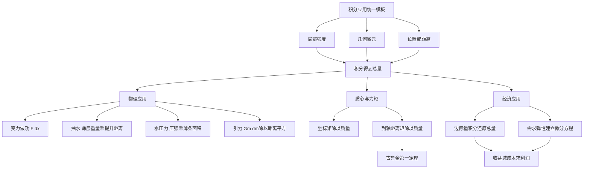

# 高数第12讲 一元函数积分学的应用（三）：物理应用与经济应用

> [!info] 教材范围
> 来源：`27张宇基础30讲高数.pdf`，印刷页 294-303 / PDF p299-p308。
>
> 本讲正文含例12.1-例12.4，讲末练习含12.1-12.4。物理应用、古鲁金第一定理仅要求数学一、数学二；经济应用仅要求数学三。

## 本讲速览

- 物理应用统一为：**取一个微元，写出该微元贡献，再按位置积分**。做功积“力 × 位移”，抽水积“薄层重量 × 提升距离”，水压力积“该深度压强 × 薄条面积”，引力积“质点对质量微元的引力”。
- 抽水做功与静水压力都要水平切片，但核心变量不同：抽水盯住**提升距离**，水压力盯住**距水面的深度**。
- 质心是“坐标的一阶矩除以总质量”；形心是均匀密度下的质心。古鲁金第一定理把旋转曲面面积写成“曲线长度 × 形心绕轴一周的路程”。
- 经济应用把导数语言翻回总量：边际量是导数，总量由边际量积分；需求弹性给出的是微分方程，不是可以直接代入的需求函数。
- 每道应用题先完成四件事：**选坐标、画微元、写局部量、查单位**。公式只是这四步压缩后的结果。

## 教材路线

| 教材顺序 | 印刷页 / PDF页 | 内容与题目 |
|---|---|---|
| 入口与结构图 | 294 / p299 | 考试范围、三部分知识结构、静水压力为重点 |
| 一、物理应用：变力做功 | 295 / p300 | $dW=F(x)dx$；例12.1铁锤打钉 |
| 一、物理应用：抽水做功 | 296 / p301 | 水平薄层微元；例12.2圆锥容器 |
| 一、物理应用：静水压力、引力 | 297 / p302 | 竖直平板压力；例12.3三角形平板；均匀细棒引力 |
| 二、古鲁金第一定理：三心与力矩 | 298-299 / p303-p304 | 三心概念、离散质点、连续曲线的质量与力矩 |
| 二、古鲁金第一定理及应用 | 299-300 / p304-p305 | 古鲁金第一定理、平面区域力矩与形心、圆绕外轴注例 |
| 三、经济应用 | 301 / p306 | 边际量还原总量、平均值；例12.4弹性与最大利润 |
| 基础习题精练与答案 | 302-303 / p307-p308 | 练习12.1-12.4及解析 |

## 前置知识与关联导航

- 定积分计算与牛顿-莱布尼茨：[[09_高数第9讲_一元函数积分学的计算#（1）牛顿-莱布尼茨公式|牛顿-莱布尼茨公式]]。
- 面积、体积、平均值、弧长与旋转曲面：[[10_高数第10讲_一元函数积分学的应用一_几何应用#7. 函数平均值|函数平均值]]、[[10_高数第10讲_一元函数积分学的应用一_几何应用#11. 平面曲线的弧长|弧长微元]]、[[10_高数第10讲_一元函数积分学的应用一_几何应用#12. 旋转曲面的面积（侧面积）|旋转曲面面积]]。
- 边际、弹性和利润最值：[[07_高数第7讲_一元函数微分学的应用三#5. 边际函数|边际函数]]、[[07_高数第7讲_一元函数微分学的应用三#6. 弹性函数与弹性分析|弹性分析]]。
- 上一讲训练积分证明方法：[[11_高数第11讲_一元函数积分学的应用二|第11讲 积分等式与不等式]]。
- 平面区域质心公式需要二重积分语言：[[14_高数第14讲_二重积分|第14讲 二重积分]]。

## 知识网络

## 知识点清单

### 0. 应用题的统一微元法

把区间分成许多很小的部分。在第 $i$ 个微元上，把变化量近似看成常量：

$$
\Delta Q_i\approx
\text{局部强度}\times\text{微元尺度}\times\text{必要的距离因子}.
$$

求和并取极限：

$$
Q=\int dQ.
$$

| 问题 | 微元 | 局部贡献 |
|---|---|---|
| 变力做功 | 位移$dx$ | $dW=F(x)dx$ |
| 抽水做功 | 水平薄层体积$A(x)dx$ | $dW=\rho gA(x)h(x)dx$ |
| 静水压力 | 水平薄条面积$w(x)dx$ | $dP=\rho g\,d(x)w(x)dx$ |
| 引力 | 质量微元$dm$ | $dF=Gm\,dm/r^2$ |
| 质心与力矩 | 质量微元$dm$ | $dM_x=y\,dm$，$dM_y=x\,dm$ |
| 经济总量 | 产量微元$dQ$ | $dC=C'(Q)dQ$，$dR=R'(Q)dQ$ |

> [!tip] 看到什么先画什么
> 图上必须标出：微元位置、微元厚度、微元几何尺寸、它到参考面或目标位置的距离。积分限应能直接从图上读出。

## 一、物理应用（仅数学一、数学二）

### 1. 变力沿直线做功

#### 1.1 基本模型

设物体沿 $x$ 轴正方向由 $a$ 移到 $b$，力在运动方向上的分量为 $F(x)$，则

$$
dW=F(x)\,dx,
\qquad
\boxed{W=\int_a^bF(x)\,dx.}
$$

- $F(x)$ 是**沿位移方向的有向分量**；同向为正，反向为负。
- 单位检查：$mathrm N\cdot m=mathrm J$。
- 几何上，$W$ 是 $F(x)$ 曲线在 $[a,b]$ 上的有向面积。

**看到什么想到它**：力随位置变化，或阻力、弹力与位移/深度成比例。先把文字关系译成 $F(x)$，再确定累计位置的积分区间。

#### 1.2 例12.1：相同做功不等于相同位移

铁钉所受阻力与入木累计深度 $x$ 成正比：

$$
F(x)=kx.
$$

第一次从 $0$ 打到 $x_1=1$：

$$
W_1=\int_0^1kx\,dx=\frac k2.
$$

第二次从 $1$ 打到累计深度 $x_2$：

$$
W_2=\int_1^{x_2}kx\,dx
=\frac k2(x_2^2-1).
$$

由 $W_2=W_1$ 得 $x_2=\sqrt2$。题目问第二次又打入多少，答案是增量

$$
x_2-x_1=\sqrt2-1\ mathrm{cm}.
$$

**关键转折**：阻力随累计深度增大，因此每次做功相同并不意味着每次推进距离相同。

### 2. 抽水做功

#### 2.1 通用微元

在位置 $x$ 取厚度为 $dx$ 的水平水层：

$$
dV=A(x)dx,
\qquad
dm=\rho A(x)dx,
\qquad
dG=\rho gA(x)dx.
$$

若该层要提升 $h(x)$，则

$$
\boxed{dW=\rho gA(x)h(x)\,dx},
$$

$$
\boxed{W=\rho g\int_a^bA(x)h(x)\,dx.}
$$

教材图12-2把坐标原点放在容器顶部，$x$ 向下，因此抽到顶部时 $h(x)=x$：

$$
W=\rho g\int_a^bxA(x)\,dx.
$$

**三个不可混的量**：

- $A(x)$：该高度的水平截面积；
- $dx$：薄层厚度；
- $h(x)$：薄层被提升到目标位置的距离。

#### 2.2 例12.2：圆锥容器

圆锥高 $a$，上底半径 $b$，水装满并抽到顶部。坐标从顶部向下，$0\le x\le a$。由相似三角形：

$$
r(x)=\frac{b(a-x)}a,
\qquad
A(x)=\pi r^2(x)=\frac{\pi b^2(a-x)^2}{a^2}.
$$

提升距离为 $x$，所以

$$
W=\rho g\int_0^ax\frac{\pi b^2(a-x)^2}{a^2}\,dx
=\frac1{12}\rho g\pi a^2b^2.
$$

**看到什么想到它**：圆锥/圆台容器先用相似三角形求半径，再平方得到截面积；不能把半径函数直接当面积。

### 3. 静水压力（水压力）

#### 3.1 压强随深度变化

液体密度为 $\rho$，距水面深度为 $x$ 时，压强为

$$
p(x)=\rho gx.
$$

对竖直平板，在深度 $x$ 取水平薄条。若薄条宽度为

$$
w(x)=f(x)-h(x),
$$

则薄条面积与压力微元为

$$
dA=w(x)dx,
$$

$$
dP=p(x)dA=\rho gx[f(x)-h(x)]\,dx.
$$

总压力：

$$
\boxed{P=\rho g\int_a^bx[f(x)-h(x)]\,dx.}
$$

若题目直接给“单位体积液体的重力” $r=\rho g$，则用 $rx$，**不要再乘一次 $g$**。

#### 3.2 抽水与水压力的区别

| 对比 | 抽水做功 | 静水压力 |
|---|---|---|
| 位置因子 | 提升距离$h(x)$ | 水深$x$ |
| 几何量 | 水平截面积$A(x)$ | 平板水平薄条宽度$w(x)$ |
| 微元 | 薄层体积$A(x)dx$ | 薄条面积$w(x)dx$ |
| 总量 | 功 | 力 |

#### 3.3 例12.3：等腰直角三角形平板

斜边长为 $2a$ 的等腰直角三角形平板，其斜边与水面相齐。取向下的深度 $y\in[0,a]$，由边界直线得薄条宽度

$$
w(y)=2(a-y).
$$

因此

$$
P=\int_0^a\rho gy\cdot2(a-y)\,dy
=\frac13\rho ga^3.
$$

**关键转折**：同一坐标 $y$ 同时决定压强 $\rho gy$ 和薄条宽度 $2(a-y)$。

### 4. 引力

万有引力大小为

$$
F=G\frac{m_1m_2}{r^2}.
$$

对连续质量分布，要把一个物体切成质量微元。教材的均匀细棒长 $l$、线密度 $\mu$，质点 $M$ 质量为 $m$，距细棒右端为 $a$。取右端为 $x=0$，细棒占 $[-l,0]$：

$$
dm=\mu dx,
\qquad
r(x)=a-x.
$$

因各微元引力共线同向，可直接积分大小：

$$
F=\int_{-l}^0\frac{Gm\mu}{(a-x)^2}\,dx
=Gm\mu\left(\frac1a-\frac1{a+l}\right).
$$

**看到什么想到它**：质点与细棒、线段或连续质量分布之间的引力。先写 $dm$，再写“质点到当前微元”的变量距离 $r(x)$。

> [!warning] 方向问题
> 只有所有引力微元共线同向时，才能直接积分大小。若方向随位置变化，必须先分解为坐标分量再积分。

## 二、古鲁金第一定理及其应用（仅数学一、数学二）

### 5. 质心、重心、形心

| 概念 | 含义 | 是否依赖外界 |
|---|---|---|
| 质心 | 物体质量分布中心 | 由质量分布决定，是物体固有性质 |
| 重心 | 物体所受重力的合力作用中心 | 依赖重力场；均匀重力场中与质心重合 |
| 形心 | 几何图形的分布中心 | 只由几何形状决定 |

- 物体密度为常数时，质心与几何形心重合。
- 在均匀重力场且物体均质时，重心、质心、形心三者重合。
- 对称图形的形心必在全部对称轴上；可先用对称性减少积分。

### 6. 质心与力矩计算

#### 6.1 离散质点系

两个质点在数轴上的平衡条件是力矩相等：

$$
(\bar x-x_1)m_1=(x_2-\bar x)m_2,
$$

所以

$$
\bar x=\frac{x_1m_1+x_2m_2}{m_1+m_2}.
$$

推广到平面上 $n$ 个质点：

$$
\boxed{
\bar x=\frac{\sum x_im_i}{\sum m_i},
\qquad
\bar y=\frac{\sum y_im_i}{\sum m_i}.}
$$

关于坐标轴的力矩为

$$
M_y=\sum x_im_i,
\qquad
M_x=\sum y_im_i.
$$

一句话记忆：

$$
\text{质心坐标}=\frac{\text{关于对应坐标的一阶矩}}{\text{总质量}}.
$$

#### 6.2 关于任意直线的力矩

点 $(x_i,y_i)$ 到直线

$$
L_0:ax+by+c=0
$$

的距离为

$$
r_i=\frac{|ax_i+by_i+c|}{\sqrt{a^2+b^2}}.
$$

质点系关于 $L_0$ 的力矩大小：

$$
M_{L_0}=\sum r_im_i.
$$

这里使用的是非负距离，适合讨论质心到旋转轴的距离和旋转曲面面积。

#### 6.3 连续曲线的质量、质心与力矩

设曲线 $L:y=f(x)$，$a\le x\le b$，线密度为 $\rho(x)$。弧长微元：

$$
ds=\sqrt{1+[f'(x)]^2}\,dx,
\qquad
dm=\rho(x)ds.
$$

总质量与质心：

$$
M=\int_Ldm=\int_a^b\rho(x)\sqrt{1+[f'(x)]^2}\,dx,
$$

$$
\bar x=\frac1M\int_Lx\,dm,
\qquad
\bar y=\frac1M\int_Ly\,dm.
$$

关于直线 $L_0$ 的力矩：

$$
M_{L_0}
=\int_Lr(x,y)\,dm
=\int_a^b
\frac{|ax+bf(x)+c|}{\sqrt{a^2+b^2}}
\rho(x)\sqrt{1+[f'(x)]^2}\,dx.
$$

若密度为常数，且整条曲线位于 $L_0$ 同一侧，则密度可约掉，并有

$$
r(\bar x,\bar y)
=\frac{M_{L_0}}M
=\frac{\int_Lr\,ds}{\int_Lds}.
$$

#### 6.4 平面区域的质量、质心与力矩

对平面区域 $D$，面密度为 $\rho(x,y)$：

$$
dm=\rho(x,y)dA,
\qquad
M=\iint_D\rho(x,y)dA,
$$

$$
\bar x=\frac{\iint_Dx\rho(x,y)dA}{M},
\qquad
\bar y=\frac{\iint_Dy\rho(x,y)dA}{M}.
$$

关于直线 $L_0$ 的力矩为

$$
M_{L_0}=\iint_D
\frac{|ax+by+c|}{\sqrt{a^2+b^2}}
\rho(x,y)dA.
$$

密度为常数且区域位于直线同一侧时：

$$
r(\bar x,\bar y)
=\frac{\iint_Dr(x,y)dA}{\iint_DdA}.
$$

这部分是后续[[14_高数第14讲_二重积分|二重积分]]中区域质心问题的入口，不能只记曲线公式。

### 7. 古鲁金第一定理

#### 7.1 定理内容

长度为 $l$ 的平面曲线 $L$ 绕同平面内一条**不与曲线相交**的直线 $L_0$ 旋转一周，所得旋转曲面面积为

$$
\boxed{A=2\pi l\,r(\bar x,\bar y),}
$$

其中 $r(\bar x,\bar y)$ 是曲线形心到旋转轴的距离。

记忆语言：

$$
\text{旋转曲面面积}
=\text{母线长度}\times\text{形心走过的路程}.
$$

#### 7.2 为什么成立

曲线小段 $ds$ 到轴的距离约为 $r$，旋转后形成窄带：

$$
dA=2\pi r\,ds.
$$

因此

$$
A=2\pi\int_Lr\,ds.
$$

又由均匀曲线的形心距离公式

$$
r(\bar x,\bar y)=\frac{\int_Lr\,ds}{l},
$$

即得定理。

#### 7.3 教材注例：圆绕外轴

单位圆 $x^2+y^2=1$ 绕直线 $x=2$ 旋转一周：

$$
l=2\pi,
\qquad
r(\bar x,\bar y)=2,
$$

故旋转曲面面积

$$
A=2\pi\cdot2\pi\cdot2=8\pi^2.
$$

> [!warning] 定理边界
> 本讲教材给的是古鲁金**第一定理**，用于旋转曲面面积；不要把它误写成旋转体体积公式。旋转轴不得与母线相交，否则“形心走过路程”的直接形式不满足这里的定理条件。

## 三、经济应用（仅数学三）

### 8. 总成本与边际成本

若 $C(Q)$ 是生产 $Q$ 单位产品的总成本，$C'(Q)$ 是边际成本，固定成本为

$$
C_0=C(0),
$$

则由牛顿-莱布尼茨公式：

$$
\boxed{C(Q)=C_0+\int_0^QC'(t)\,dt.}
$$

- 边际成本的含义：产量在 $Q$ 附近增加一个很小单位时，总成本的近似增量率。
- 由边际成本恢复总成本时，**固定成本必须加回**。
- 若边际成本单位是“万元/单位”，对产量积分后单位是“万元”。

### 9. 收益、需求弹性与最大利润

#### 9.1 总收益与边际收益

若 $R(Q)$ 是总收益，$R'(Q)$ 是边际收益，通常 $R(0)=0$，则

$$
\boxed{R(Q)=\int_0^QR'(t)\,dt.}
$$

若单价是产量的函数 $p=p(Q)$，则

$$
R(Q)=Qp(Q).
$$

平均单位收益为

$$
\bar R(Q)=\frac{R(Q)}Q
=\frac1Q\int_0^QR'(t)\,dt.
$$

这与函数平均值

$$
\bar f=\frac1{b-a}\int_a^bf(x)\,dx
$$

是同一结构。

#### 9.2 需求的价格弹性

设需求量 $Q=Q(p)$，需求的价格弹性定义为

$$
\boxed{\eta_p=-\frac pQ\frac{dQ}{dp}.}
$$

需求量通常随价格上升而下降，所以 $dQ/dp<0$，前面的负号使弹性常取正值。

若题目给 $\eta_p=\eta(p)$，应化成可分离变量方程：

$$
\frac{dQ}{Q}=-\frac{\eta(p)}p\,dp,
$$

积分后再用最大需求量或某个价格-需求点确定常数。

#### 9.3 最大利润

利润函数

$$
L(Q)=R(Q)-C(Q).
$$

内点最大利润的必要条件为

$$
L'(Q)=R'(Q)-C'(Q)=0,
$$

即“边际收益 = 边际成本”。还要用 $L''(Q)<0$、单调性或定义域端点确认最大值。

#### 9.4 例12.4：边际成本 + 弹性 + 利润最值

边际成本为 $4+Q/4$，固定成本为 $1$：

$$
C(Q)=\int_0^Q\left(4+\frac t4\right)dt+1
=4Q+\frac{Q^2}{8}+1.
$$

需求弹性满足

$$
-\frac pQ\frac{dQ}{dp}=\frac p{8-p},
\qquad Q(0)=8.
$$

由弹性为正且 $p>0$，先知 $0<p<8$。分离变量：

$$
\frac{dQ}{Q}=\frac{dp}{p-8}.
$$

积分并用 $Q(0)=8$ 得

$$
Q=8-p,
\qquad
p=8-Q.
$$

于是

$$
R(Q)=Q(8-Q)=8Q-Q^2,
$$

$$
L(Q)=R(Q)-C(Q)
=-\frac98Q^2+4Q-1.
$$

由

$$
L'(Q)=4-\frac94Q=0,
\qquad
L''(Q)=-\frac94<0,
$$

得最大利润时

$$
Q=\frac{16}{9},
\qquad
p=\frac{56}{9}.
$$

**看到什么想到它**：题目同时给边际成本和弹性，先分别恢复 $C(Q)$ 与需求函数，再统一改写成产量 $Q$ 的函数后求利润最值。

## 公式与二级结论索引

| 结论 | 条件与符号 | 公式 | 详解 |
|---|---|---|---|
| 变力做功 | $F$为沿位移方向分量 | $W=\int_a^bF(x)dx$ | [[#1. 变力沿直线做功\|定位]] |
| 抽水做功 | $A$截面积，$h$提升距离 | $W=\rho g\int A(x)h(x)dx$ | [[#2. 抽水做功\|定位]] |
| 静水压力 | $d$为深度，$w$为薄条宽 | $P=\rho g\int d(x)w(x)dx$ | [[#3. 静水压力（水压力）\|定位]] |
| 连续质量引力 | $dm$为质量微元 | $dF=Gm\,dm/r^2$ | [[#4. 引力\|定位]] |
| 离散质心 | $M=\sum m_i$ | $\bar x=\sum x_im_i/M$，$\bar y=\sum y_im_i/M$ | [[#6. 质心与力矩计算\|定位]] |
| 曲线质心 | $dm=\rho ds$ | $\bar x=\int xdm/M$，$\bar y=\int ydm/M$ | [[#6. 质心与力矩计算\|定位]] |
| 平面区域质心 | $dm=\rho dA$ | $\bar x=\iint xdm/M$，$\bar y=\iint ydm/M$ | [[#6. 质心与力矩计算\|定位]] |
| 古鲁金第一定理 | 轴与曲线不相交 | $A=2\pi l\,r(\bar x,\bar y)$ | [[#7. 古鲁金第一定理\|定位]] |
| 总成本 | $C_0=C(0)$ | $C(Q)=C_0+\int_0^QC'(t)dt$ | [[#8. 总成本与边际成本\|定位]] |
| 总收益 | 通常$R(0)=0$ | $R(Q)=\int_0^QR'(t)dt$ | [[#9. 收益、需求弹性与最大利润\|定位]] |
| 需求价格弹性 | $Q=Q(p)$ | $\eta_p=-(p/Q)dQ/dp$ | [[#9. 收益、需求弹性与最大利润\|定位]] |
| 最大利润内点条件 | 可导且极值点在内部 | $R'(Q)=C'(Q)$ | [[#9. 收益、需求弹性与最大利润\|定位]] |

## 题型-方法决策表

| 题面特征 | 首选模型 | 第一笔怎么写 | 核心检查 |
|---|---|---|---|
| 力随位置变化 | 变力做功 | $dW=F(x)dx$ | $F$是否为位移方向分量 |
| 每次做功相同、阻力随深度变 | 分段积分 | 分别写每次累计深度区间 | 问累计位置还是新增距离 |
| 容器抽水 | 水平薄层 | $dW=\rho gA(x)h(x)dx$ | $h(x)$是目标高度差 |
| 圆锥、球形容器 | 截面积函数 | 先由几何关系求半径$ r(x)$ | 面积应为$\pi r^2$ |
| 竖直平板受水压 | 水平薄条 | $dP=\rho g\,d(x)w(x)dx$ | 深度和宽度用同一变量 |
| 题目给单位体积液体重力$r$ | 直接用$r$ | $dP=r\,d(x)w(x)dx$ | 不再乘$g$ |
| 质点与细棒引力 | 质量微元 | $dm=\mu dx$，再写$r(x)$ | 距离必须随微元变化 |
| 求质量分布中心 | 质心公式 | 先写总质量$M=\int dm$ | 分子是坐标的一阶矩 |
| 曲线绕外轴求曲面面积 | 古鲁金第一定理 | 求$l$和形心到轴距离$r$ | 轴不得与曲线相交 |
| 给边际成本/收益求总量 | 牛顿-莱布尼茨 | 从0积分到$Q$ | 成本要加固定成本 |
| 给边际收益求平均单位收益 | 先还原总收益 | $\bar R=Q^{-1}\int_0^QR'(t)dt$ | 不能拿$R'(Q)$冒充平均值 |
| 给需求弹性求需求函数 | 可分离微分方程 | $dQ/Q=-\eta(p)dp/p$ | 用经济定义域去绝对值 |
| 求最大利润 | $L=R-C$ | 全部统一为同一自变量 | 检查二阶导和端点 |

## 教材例题覆盖表

| 例题 | 核心知识 | 题面信号与方法入口 | 必须记住的转折 |
|---|---|---|---|
| 例12.1 | 变力做功 | 阻力正比于累计深度、两次功相同 | 第二次积分区间从1到$x_2$，答案是$x_2-1$ |
| 例12.2 | 圆锥抽水 | 抽到顶部、截面积随高度变 | 相似三角形求$r(x)$，提升距离由坐标方向确定 |
| 例12.3 | 静水压力 | 三角形竖直平板、斜边贴水面 | 水深$y$乘宽度$2(a-y)$，结果$\rho ga^3/3$ |
| 例12.4 | 经济综合 | 边际成本、固定成本、弹性、利润最大 | 分别求$C(Q)$与需求函数，再写$R(Q)$和$L(Q)$ |

## 教材正文推导覆盖表

| 教材内容 | 笔记落点 | 做题价值 |
|---|---|---|
| 变力做功通式与几何意义 | [[#1. 变力沿直线做功\|变力做功]] | 明确有向力分量与积分限 |
| 抽水微元及圆锥截面积推导 | [[#2. 抽水做功\|抽水做功]] | 区分薄层重量、提升距离和截面积 |
| 静水压力通式 | [[#3. 静水压力（水压力）\|静水压力]] | 把压强变化与平板宽度同时写入微元 |
| 均匀细棒引力 | [[#4. 引力\|引力]] | 训练质量微元与变量距离 |
| 三心定义及重合条件 | [[#5. 质心、重心、形心\|三心概念]] | 判断能否把质量问题化成几何问题 |
| 离散质点与曲线力矩公式 | [[#6. 质心与力矩计算\|质心与力矩]] | 建立“一阶矩除以质量”框架 |
| 平面区域力矩与形心公式 | [[#6. 质心与力矩计算\|平面区域公式]] | 对接二重积分质心题 |
| 古鲁金第一定理及圆绕外轴注例 | [[#7. 古鲁金第一定理\|古鲁金第一定理]] | 快速求旋转曲面面积并识别适用边界 |
| 边际量还原和平均值 | [[#8. 总成本与边际成本\|成本]]、[[#9. 收益、需求弹性与最大利润\|收益]] | 区分边际量、总量和平均量 |

## 讲末练习反查

### 练习12.1：任意竖直平板的水压力

坐标 $x$ 从水面向下，题中 $r=\rho g$ 表示单位体积液体的重力。深度 $x$ 处薄条宽度为

$$
f_2(x)-f_1(x),
$$

所以

$$
dF=rx[f_2(x)-f_1(x)]dx,
$$

$$
F=\int_a^brx[f_2(x)-f_1(x)]dx.
$$

教材选择题答案为 D。判题时同时检查三个因子：单位重 $r$、水深 $x$、薄条宽度。

### 练习12.2：边际收益不等于平均收益

销售量为 $2000$，边际收益

$$
R'(a)=200-\frac a{50}.
$$

总收益为 $\int_0^{2000}R'(a)da$，平均单位收益为

$$
\bar R
=\frac1{2000}\int_0^{2000}\left(200-\frac a{50}\right)da
=180.
$$

不能直接代入 $R'(2000)$；那是终点的边际收益，不是区间平均收益。

### 练习12.3：半球水池抽水

半球半径为 $4$，水箱在原水面上方 $6$ m。取球心及原水面为 $y=0$，池底为 $y=-4$，目标高度为 $y=6$，水层范围 $-4\le y\le0$：

$$
A(y)=\pi(16-y^2).
$$

深度为 $y$ 的水层提升到 $y=6$，提升距离为

$$
h(y)=6-y.
$$

教材原页的微元与答案为

$$
dW=(6-y)\rho g\pi(16-y^2)dy,
$$

$$
W=\int_{-4}^0(6-y)\rho g\pi(16-y^2)dy
=320\pi\rho g\approx9847\ \mathrm{kJ}.
$$

> [!warning] 坐标注释
> 这道题最重要的不是死背$6-y$，而是先在图上标出池底、原水面和目标高度，再用“目标坐标减水层坐标”写提升距离。

### 练习12.4：由弹性求需求函数和边际收益

需求弹性

$$
-\frac pQ\frac{dQ}{dp}=\frac p{120-p}
$$

给出

$$
\frac{dQ}{Q}=-\frac{dp}{120-p}.
$$

积分得 $Q=C(120-p)$。最大需求量为 $1200$，即 $Q(0)=1200$，故

$$
Q=1200-10p.
$$

反需求函数、收益和边际收益为

$$
p=120-\frac Q{10},
$$

$$
R(Q)=120Q-\frac{Q^2}{10},
\qquad
R'(Q)=120-\frac Q5.
$$

当 $p=100$ 时，$Q=200$，所以

$$
R'(200)=80.
$$

经济意义：销量为 $200$ 时，再增加一个单位销量，总收益约增加 $80$ 万元。

## 易错点/易混点

1. **做功使用累计位置**：分段做功的积分上下限是每次开始和结束的累计坐标。
2. **力与位移方向决定功的正负**：$F(x)$应取沿位移方向的分量，不是无条件取力的大小。
3. **抽水的距离不是水深**：提升到哪里由目标高度决定，必须写成目标坐标减水层坐标。
4. **圆锥先求半径再平方**：$r(x)$与$A(x)$不能混用。
5. **水压力的深度从水面量起**：压强取决于距水面的垂直深度。
6. **水压力微元是薄条面积**：宽度乘厚度，不是整块板面积。
7. **$\rho$与$r=\rho g$不能重复使用**：一个是质量密度，一个是单位体积重力。
8. **引力距离必须随微元变化**：不能用到棒端或棒中点的固定距离代替 $r(x)$。
9. **非共线引力要分解方向**：标量积分只适用于各微元作用力同向的模型。
10. **质心、重心、形心不总相同**：均匀重力场和均匀密度分别控制不同的重合条件。
11. **曲线质量元是$\rho ds$**：不能把 $dx$直接当弧长；$ds=\sqrt{1+f'^2}dx$。
12. **平面区域质量元是$\rho dA$**：与曲线的线密度公式属于不同维度。
13. **到直线的距离带绝对值**：若要把平均距离等同为形心到轴距离，还需整体位于轴同一侧。
14. **古鲁金第一定理求的是曲面面积**：本讲没有把旋转体体积定理作为正文结论。
15. **旋转轴不得与母线相交**：这是古鲁金第一定理的适用条件。
16. **边际量不是总量**：边际成本、边际收益都要积分才能还原总成本、总收益。
17. **总成本要加固定成本**：$C(0)$不能在积分时丢掉。
18. **平均收益不是终点边际收益**：一个是区间平均，一个是导数在某点的值。
19. **弹性方程先分清自变量**：$Q=Q(p)$时导数是$dQ/dp$，求利润时再改写为$p=p(Q)$。
20. **利润临界点还要验最大性和定义域**：只解$L'=0$不够。

## 注解

### 为什么四类物理题看起来不同却是同一方法

四类题都在计算“局部贡献之和”。差别只是局部强度：

- 做功的局部强度是力；
- 抽水是薄层重量，再乘提升距离；
- 水压力是压强，再乘薄条面积；
- 引力是单位质量微元受到的引力。

若不知道如何开始，先问：“我切下来的这一小块是什么？它单独贡献多少？”

### 坐标怎样选才不容易错

- 抽水：把原点放在出口或容器顶端，提升距离往往最简单。
- 水压力：把原点放在水面，水深直接等于坐标。
- 球、圆锥：把原点放在对称中心、顶点或开口处，选择能最简化截面积的方案。
- 选定后立即把所有特殊高度写成坐标值，避免把“离池底6 m”和“坐标为6”混为一谈。

### 怎样用单位检查微元

- 抽水：$\rho A dx$是质量，乘$g$得力，再乘$h$得功。
- 水压力：$\rho gd$是压强，乘$w dx$得力。
- 质心：分子“坐标 × 质量”，除以质量后仍是长度。
- 经济量：边际量“金额/单位”乘产量微元后才是金额。

### 古鲁金第一定理为什么能省积分

直接求旋转曲面面积要积 $2\pi r\,ds$；古鲁金定理把其中的加权平均距离识别成形心到轴的距离。已知弧长和形心时，它把整段曲面积分压缩为一次乘法。

## 速背检查

1. **变力沿直线做功的微元？** $dW=F(x)dx$。
2. **例12.1为什么第二次推进更短？** 阻力随累计深度增大，相同功对应的位移减小。
3. **抽水做功的三个因子？** 薄层重量$\rho gA(x)dx$与提升距离$h(x)$。
4. **圆锥截面积怎样求？** 先用相似三角形求$r(x)$，再写$A(x)=\pi r^2(x)$。
5. **静水压强与什么成正比？** 与距水面的深度成正比，$p=\rho gd$。
6. **竖直平板压力微元？** $dP=\rho g\,d(x)w(x)dx$。
7. **抽水与水压力最关键的区别？** 前者用提升距离和体积微元，后者用水深和面积微元。
8. **连续质量引力的起手式？** 写$dm$与变量距离$r(x)$，再用$dF=Gm\,dm/r^2$。
9. **三心何时全部重合？** 均匀重力场且物体密度均匀。
10. **质心坐标的统一结构？** 坐标的一阶矩除以总质量。
11. **曲线质量微元？** $dm=\rho ds$，$ds=\sqrt{1+f'^2}dx$。
12. **古鲁金第一定理？** $A=2\pi l\,r(\bar x,\bar y)$，且旋转轴不与曲线相交。
13. **古鲁金第一定理求面积还是体积？** 旋转曲面面积。
14. **由边际成本恢复总成本？** $C(Q)=C(0)+\int_0^QC'(t)dt$。
15. **平均单位收益怎样由边际收益求？** $\bar R=Q^{-1}\int_0^QR'(t)dt$。
16. **需求价格弹性公式？** $\eta_p=-(p/Q)dQ/dp$。
17. **最大利润的边际条件？** $R'(Q)=C'(Q)$，再验证最大性与端点。
18. **应用题最后必须检查什么？** 积分限、方向/距离、几何尺寸和单位。

## OCR/视觉核查

- 证据入口：[[00_OCR视觉核查报告#12 高数 一元函数积分学的应用（三）物理应用与经济应用|查看本讲OCR/视觉核查记录]]。
- 已对 PDF p299-p308 共10页逐页 OCR，共382行文字骨架，并制作3张覆盖全讲的联系图。
- 已逐张查看全部联系图，并逐页查看10张高清原页；微元图、坐标方向、上下限、单位、古鲁金公式和需求弹性符号均以原页为准。
- 例12.1-例12.4、全部正文推导与练习12.1-12.4均已进入反查表；OCR未识别出的例题编号未直接采用。

## 相关链接

- [[00_目录与进度|考研数学目录与逐讲进度]]
- [[00_公式极简总表|公式极简总表]]
- [[00_知识链路图|高数知识链路图]]
- [[11_高数第11讲_一元函数积分学的应用二|上一讲：积分等式与积分不等式]]
- [[13_高数第13讲_多元函数微分学|下一讲：多元函数微分学]]
