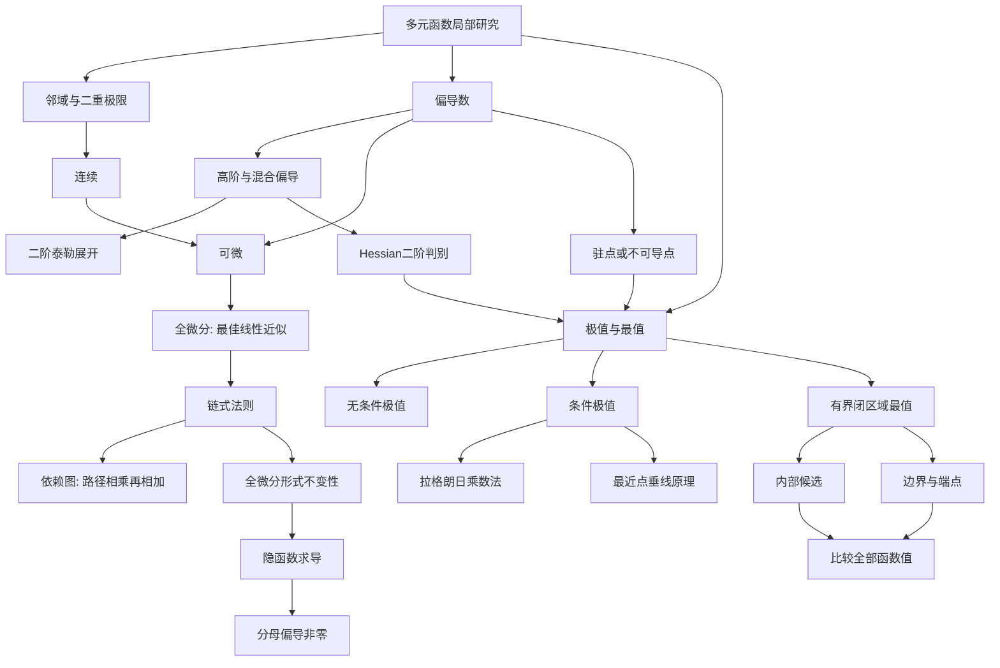

# 高数第13讲 多元函数微分学

> [!info] 教材范围
> 来源：`27张宇基础30讲高数.pdf`，印刷页 304-337 / PDF p309-p342。
>
> 本讲正文含例13.1-例13.22，基础习题含13.1-13.14。已对34页逐页OCR，并查看9张全覆盖联系图及34张高清原页；公式、图像、例题和答案均以原页复核结果为准。

## 本讲速览

- 多元微分的第一条主线是**局部性质链**：偏导只看坐标轴方向，可微要求任意方向上的增量都有同一个线性主部。因此“偏导存在”远弱于“可微”。
- 二重极限必须允许点从任意路径趋近。两条路径结果不同可立即否定极限；证明极限存在则要用放缩、夹逼、极坐标或定义控制所有路径。
- 复合函数求导的核心不是背展开式，而是画清“外层变量 <- 中间变量 <- 自变量”的依赖图：每条路径相乘，同一终点的路径相加。
- 隐函数公式来自对方程取全微分。分母偏导非零是定理保证局部存在、唯一、可导的**充分条件**，不是隐函数存在的必要条件。
- 多元极值要区分三层：局部极值、约束极值、闭区域最值。驻点只是候选点；不可导点、边界和端点同样不能漏。
- 做题时始终回答四个问题：对象是否存在、使用条件是否满足、候选点是否找全、结论是必要还是充分。

## 教材路线

| 教材顺序 | 印刷页 / PDF页 | 内容与题目 |
|---|---|---|
| 入口与知识结构 | 304-305 / p309-p310 | 考点目标；基本概念、微分法则、极值与最值的完整知识树；邻域 |
| 一、极限与连续 | 306-308 / p311-p313 | 二重极限定义、路径与放缩；连续；例13.1-13.2 |
| 一、偏导数 | 308-312 / p313-p317 | 偏导定义与几何意义、高阶偏导、混合偏导换序、二元函数二阶泰勒公式（仅数学一）；例13.3-13.6 |
| 一、可微 | 313-316 / p318-p321 | 全增量、全微分、必要与充分条件、关系图、定义判别；例13.7-13.8 |
| 二、链式法则 | 317-318 / p322-p323 | 复合结构图、位置下标、高阶复合偏导；例13.9-13.11 |
| 二、全微分形式不变性 | 319 / p324 | 中间变量与自变量使用同一微分形式；例13.12 |
| 二、隐函数存在定理 | 320-322 / p325-p327 | 一元、二元隐函数公式，充分非必要条件，多种求法；例13.13-13.16 |
| 二、二元拉格朗日定理 | 323-324 / p328-p329 | 两个偏导恒为零推出常数及区域条件反例 |
| 三、极值与无条件极值 | 324-327 / p329-p332 | 局部/整体最值、切片必要条件、Hessian判别、隐函数极值；例13.17-13.19 |
| 三、条件极值与几何原理 | 327-330 / p332-p335 | 拉格朗日乘数法、非闭约束端点、最近点垂线原理、闭区域最值；例13.20-13.22 |
| 基础习题与答案 | 331-337 / p336-p342 | 习题13.1-13.14及完整解析 |

## 前置知识与关联导航

- 一元极限、连续与夹逼：[[01_高数第1讲_函数极限与连续#13. 夹逼准则|夹逼准则]]、[[01_高数第1讲_函数极限与连续#10. 连续与间断|连续与间断]]。
- 一元可导、微分及切线：[[03_高数第3讲_一元函数微分学的概念#2. 导数定义|导数定义]]、[[03_高数第3讲_一元函数微分学的概念#8. 微分定义|微分定义]]。
- 一元链式法则与隐函数求导：[[04_高数第4讲_一元函数微分学的计算#3. 复合函数链式法则|链式法则]]、[[04_高数第4讲_一元函数微分学的计算#6. 隐函数求导|隐函数求导]]。
- 一元极值与最值的逻辑会原样迁移到多元：[[06_高数第6讲_一元函数微分学的应用二|一元函数极值与最值]]。
- 需求弹性练习13.6使用：[[07_高数第7讲_一元函数微分学的应用三#6. 弹性函数与弹性分析|弹性函数]]。
- 下一讲把本讲定义域、边界和极坐标思想用于积分：[[14_高数第14讲_二重积分|二重积分]]。
- 梯度、方向导数、切平面会把偏导的几何意义进一步统一：[[17_高数第17讲_多元函数积分学的预备知识#3. 方向导数|方向导数]]、[[17_高数第17讲_多元函数积分学的预备知识#4. 梯度|梯度]]。

## 知识网络

## 知识点清单

### 一、基本概念

### 1. 邻域

设平面点 $P_0(x_0,y_0)$，点 $P(x,y)$ 到它的距离为

$$
|PP_0|=\sqrt{(x-x_0)^2+(y-y_0)^2}.
$$

半径为 $\delta>0$ 的 $\delta$ 邻域是开圆内部：

$$
U(P_0,\delta)
=\{(x,y)\mid |PP_0|<\delta\}.
$$

去掉中心点得到去心邻域：

$$
\mathring U(P_0,\delta)
=\{(x,y)\mid 0<|PP_0|<\delta\}.
$$

- 讨论极限时用去心邻域，因为极限只关心“靠近”而不关心点值。
- 讨论连续、可微时必须连同点值一起看。
- 邻域不含圆周；教材图中的边界不计入 $U(P_0,\delta)$。

**看到什么想到它**：题目出现“在某点的邻域内”“充分接近”“任意方向趋近”，先把距离统一记为

$$
\rho=\sqrt{(x-x_0)^2+(y-y_0)^2}.
$$

### 2. 二元函数极限

#### 2.1 正式定义

设 $f(x,y)$ 在 $P_0$ 的某个去心邻域内有定义。若对任意 $\varepsilon>0$，总存在 $\delta>0$，使

$$
0<\sqrt{(x-x_0)^2+(y-y_0)^2}<\delta
$$

时恒有

$$
|f(x,y)-A|<\varepsilon,
$$

则

$$
\lim_{(x,y)\to(x_0,y_0)}f(x,y)=A.
$$

**直观理解**：一元函数只有左右两侧；二元函数可沿无限多条直线、曲线甚至振荡路径接近同一点。极限存在意味着**所有路径得到同一个值，并且误差能由同一个 $\delta$ 统一控制**。

#### 2.2 存在与不存在的判题规则

| 目标 | 首选方法 | 能得出的结论 |
|---|---|---|
| 证明不存在 | 找两条路径得到不同结果 | 足以否定 |
| 证明不存在 | 找一条路径极限本身不存在 | 足以否定 |
| 证明存在 | 放缩成只含 $\rho$ 且趋于0的上界 | 可用夹逼证明 |
| 证明存在 | 极坐标 $x=r\cos\theta,y=r\sin\theta$ 后对 $\theta$ 一致控制 | 可证明所有方向 |
| 证明存在 | 化为 $t=x^2+y^2\to0$ 的一元极限 | 适合径向式 |
| 仅试若干路径相同 | 信息不足 | 不能证明存在 |

原点处常用：

$$
|xy|\le \frac{x^2+y^2}{2}=\frac{\rho^2}{2}.
$$

若

$$
|f(x,y)-A|\le C\rho^\alpha,\qquad \alpha>0,
$$

则极限为 $A$。

> [!warning] 路径法的单向性
> 不同路径得到不同结果可以否定极限；沿所有直线结果相同仍不能证明极限存在，因为还可能有抛物线、分式曲线等路径。

#### 2.3 一元极限性质的迁移

极限唯一性、局部有界性、局部保号性、四则运算、夹逼准则及等价无穷小思想仍适用，但每一步必须面对**二重趋近**。等价替换若要使用，应先把表达式化为某个整体变量 $t(x,y)\to0$ 的一元等价关系。

#### 2.4 教材例13.1：同一题中的“证存在”和“证不存在”

- 对含 $|xy|/\sqrt{x^2+y^2}$ 的极限，用

$$
0\le
\frac{|xy|}{\sqrt{x^2+y^2}}
\le \frac12\sqrt{x^2+y^2}\to0
$$

证明存在。
- 对含 $x|y|/(x^2+y^2)$ 的极限，取 $y=x$，再比较 $x\to0^+$ 与 $x\to0^-$，得到不同值，故不存在。

**迁移**：分子总次数比分母高，优先放缩；同次齐次式，优先试 $y=kx$。

### 3. 连续

函数 $f(x,y)$ 在 $(x_0,y_0)$ 连续，当且仅当

$$
\lim_{(x,y)\to(x_0,y_0)}f(x,y)=f(x_0,y_0).
$$

在区域 $D$ 内每一点都连续，称 $f$ 在 $D$ 上连续。连续性判定仍分三步：

1. 函数在该点有定义；
2. 二重极限存在；
3. 极限等于点值。

复合、和差积商等连续函数的运算规律与一元情形相同，分母须非零。

#### 教材例13.2：径向变量降维

分段函数在原点补值时，若表达式只通过 $x^2+y^2$ 出现，令

$$
t=x^2+y^2\to0^+,
$$

把二重极限化成一元等价无穷小。先求极限 $L$，再令原点值 $a=L$。

**看到什么想到它**：出现 $\sqrt[n]{1-(x^2+y^2)}-1$、$e^{x^2+y^2}-1$ 一类组合，先把 $x^2+y^2$ 看成整体小量，不必展开成两条路径。

### 4. 偏导数与高阶偏导

#### 4.1 定义：偏导只看一条坐标截线

对 $x$ 的偏导：

$$
f_x(x_0,y_0)
=\lim_{\Delta x\to0}
\frac{f(x_0+\Delta x,y_0)-f(x_0,y_0)}{\Delta x}.
$$

对 $y$ 的偏导：

$$
f_y(x_0,y_0)
=\lim_{\Delta y\to0}
\frac{f(x_0,y_0+\Delta y)-f(x_0,y_0)}{\Delta y}.
$$

求 $f_x$ 时把 $y$ 固定，求 $f_y$ 时把 $x$ 固定。几何上：

- $f_x(x_0,y_0)$ 是曲面 $z=f(x,y)$ 与平面 $y=y_0$ 的交线在该点切线对 $x$ 轴的斜率；
- $f_y(x_0,y_0)$ 是与平面 $x=x_0$ 的交线切线对 $y$ 轴的斜率。

**边界/分段/绝对值点**：一般点的求导公式可能不适用，必须沿对应坐标轴回到定义。

#### 4.2 高阶偏导与混合偏导

$$
f_{xx}=\frac{\partial^2f}{\partial x^2},\qquad
f_{yy}=\frac{\partial^2f}{\partial y^2},
$$

$$
f_{xy}=\frac{\partial}{\partial y}(f_x),\qquad
f_{yx}=\frac{\partial}{\partial x}(f_y).
$$

下标按**实际求导顺序**理解；不同教材记号可能把顺序书写习惯处理得不同，做题时直接看分式最稳。

若 $f_{xy},f_{yx}$ 在区域内连续，则

$$
\boxed{f_{xy}=f_{yx}}.
$$

连续是常用充分条件；不能看到“混合偏导”就无条件交换。

#### 4.3 三类常考计算

**1. 特殊点偏导**

固定另一变量后化为一元定义极限。教材例13.3中的绝对值说明：同一点的两个偏导可一个存在、一个不存在。

**2. 含参变量限积分**

若

$$
F(x,y)=\int_{\alpha(x,y)}^{\beta(x,y)}g(x,y,t)\,dt,
$$

则在可交换求导与积分的条件下

$$
F_x
=g(x,y,\beta)\beta_x-g(x,y,\alpha)\alpha_x
+\int_{\alpha}^{\beta}g_x(x,y,t)\,dt.
$$

教材例13.4先改写积分再求偏导，利用上下限只含 $x-y$ 得到一、二阶偏导之间的关系。教材例13.5求 $f_x(1,+\infty)$ 时，**先求边界函数 $f(x,+\infty)$ 再对 $x$ 求导**最简；先求一般 $f_x(x,y)$ 再令 $y\to+\infty$ 虽可能可行，但运算更重。

**3. 由偏导反求原函数**

若已知 $f_y(x,y)$，先对 $y$ 积分：

$$
f(x,y)=\int f_y(x,y)\,dy+\varphi(x).
$$

再对 $x$ 求导，与给定 $f_x$ 比较以确定 $\varphi'(x)$，最后用点值确定常数。教材例13.6即此模板。

#### 4.4 二元函数二阶泰勒公式（仅数学一）

若 $f$ 在 $(x_0,y_0)$ 的邻域内具有二阶连续偏导，令

$$
h=x-x_0,\qquad k=y-y_0,
$$

则二阶 Peano 展开为

$$
\boxed{
\begin{aligned}
f(x_0+h,y_0+k)
={}&f(x_0,y_0)+f_xh+f_yk\\
&+\frac12\left(f_{xx}h^2+2f_{xy}hk+f_{yy}k^2\right)
+o(h^2+k^2),
\end{aligned}}
$$

其中右侧各阶偏导均取在 $(x_0,y_0)$。用微分记号可压缩为

$$
f(P_0+\Delta P)=f(P_0)+df(P_0)+\frac12d^2f(P_0)+o(\|\Delta P\|^2),
$$

$$
d^2f=f_{xx}\,dx^2+2f_{xy}\,dx\,dy+f_{yy}\,dy^2.
$$

相应的 Lagrange 余项形式可写成

$$
f(P_0+\Delta P)
=f(P_0)+df(P_0)+\frac12d^2f(P_0+\theta\Delta P),
\qquad 0<\theta<1.
$$

**为什么与极值相连**：在驻点处 $df(P_0)=0$，函数增量的首个有效部分就是二次型

$$
\frac12\left(f_{xx}h^2+2f_{xy}hk+f_{yy}k^2\right),
$$

其正负性正是后面 Hessian 判别的来源。

> **看到什么想到它**：题目要求“在某点附近近似”“求二阶无穷小主部”“判断驻点附近函数值增减”，或需要解释 Hessian 判别时，想到二阶泰勒展开。先确认二阶连续偏导，再检查一次项是否因驻点而消失。

### 5. 可微与全微分

#### 5.1 直观与定义

在点 $(x_0,y_0)$ 处令

$$
\rho=\sqrt{(\Delta x)^2+(\Delta y)^2},
$$

$$
\Delta z=f(x_0+\Delta x,y_0+\Delta y)-f(x_0,y_0).
$$

若存在只与点有关、与增量无关的常数 $A,B$，使

$$
\Delta z=A\Delta x+B\Delta y+o(\rho),
$$

则 $f$ 在该点可微。线性主部

$$
dz=A\,dx+B\,dy
$$

称为全微分。

**直观理解**：可微表示在足够小的范围内，曲面可由一个切平面统一逼近；误差相对于移动距离 $\rho$ 更高阶。

#### 5.2 可微的必要条件

若 $f$ 可微，则偏导存在，且

$$
A=f_x(x_0,y_0),\qquad B=f_y(x_0,y_0).
$$

因此

$$
\boxed{dz=f_x\,dx+f_y\,dy}.
$$

同时

$$
\boxed{\text{可微}\Rightarrow\text{连续}},
\qquad
\boxed{\text{可微}\Rightarrow f_x,f_y\text{存在}}.
$$

#### 5.3 可微的常用充分条件

若 $f_x,f_y$ 在该点某邻域内存在，并且在该点连续，则 $f$ 在该点可微：

$$
\boxed{f_x,f_y\text{连续}\Rightarrow f\text{可微}}.
$$

这只是充分条件，不是必要条件；可微函数的偏导未必连续。

#### 5.4 一元与多元关系对照

| 性质 | 一元函数 | 多元函数 |
|---|---|---|
| 可导与可微 | 可导 $\Leftrightarrow$ 可微 | 偏导存在 $\nRightarrow$ 可微 |
| 可微与连续 | 可微 $\Rightarrow$ 连续 | 可微 $\Rightarrow$ 连续 |
| 连续与偏导 | 连续不保证可导 | 连续不保证偏导存在 |
| 偏导连续 | 导函数连续不是可导必要条件 | 各偏导连续是可微充分条件 |

要背成方向图：

$$
\text{偏导连续}\Rightarrow\text{可微}
\Rightarrow
\begin{cases}
\text{连续},\\
\text{偏导存在}.
\end{cases}
$$

其余反向一般都不成立。

#### 5.5 定义法判可微

1. 算全增量 $\Delta z$；
2. 用定义求 $f_x(x_0,y_0),f_y(x_0,y_0)$；
3. 检验

$$
\lim_{(\Delta x,\Delta y)\to(0,0)}
\frac{\Delta z-f_x\Delta x-f_y\Delta y}
{\sqrt{(\Delta x)^2+(\Delta y)^2}}=0.
$$

极限为0才可微；只要找到一条路径使其不为0或不存在，就不可微。

#### 5.6 教材例13.7-13.8的迁移

- 若 $M(x,y)dx+N(x,y)dy=du$，则连续二阶偏导条件下必须有

$$
M_y=N_x.
$$

教材例13.7用此条件确定参数。反过来，在适当单连通区域内，$M_y=N_x$ 也是存在势函数的常用充分条件。
- 对

$$
z_1=|xy|,\qquad
z_2=
\begin{cases}
\dfrac{|xy|}{\sqrt{x^2+y^2}},&(x,y)\ne(0,0),\\
0,&(x,y)=(0,0),
\end{cases}
$$

两者在原点偏导都为0，但

$$
\frac{|xy|}{\sqrt{x^2+y^2}}\to0
$$

说明 $z_1$ 可微；而 $z_2$ 的可微余项比值沿 $y=x$ 为 $1/2$，故不可微。

**核心区别**：偏导只测试两条坐标轴；可微测试所有方向且要求统一线性近似。

### 二、多元函数微分法则

### 6. 复合函数依赖图总则

设

$$
z=f(u,v),\qquad
u=\varphi(x,y),\qquad
v=\psi(x,y).
$$

从 $x$ 到 $z$ 有两条路径 $x\to u\to z$、$x\to v\to z$，故

$$
z_x=f_u u_x+f_v v_x.
$$

同理

$$
z_y=f_u u_y+f_v v_y.
$$

**口诀**：沿每条依赖路径把导数相乘，到同一终点后相加。

> [!warning] 位置下标
> $f'_1,f'_2$ 表示对外层函数第1、第2个位置求导，与该位置里恰好写了哪个字母无关。例如 $f(x,e^x)$ 中，$f'_1$ 对第一位置求导，$f'_2$ 对第二位置求导。

### 7. 复合函数求导：一元中间变量

若

$$
z=f(u,v),\qquad u=u(t),\quad v=v(t),
$$

则

$$
\boxed{\frac{dz}{dt}=f_u\frac{du}{dt}+f_v\frac{dv}{dt}}.
$$

若只有一个中间变量 $u=u(x,y)$，$z=f(u)$，则

$$
z_x=f'(u)u_x,\qquad z_y=f'(u)u_y,
$$

$$
dz=f'(u)\,du.
$$

二阶总导数常用式：

$$
\frac{d^2z}{dt^2}
=f_{uu}(u')^2+2f_{uv}u'v'+f_{vv}(v')^2
+f_u u''+f_v v''.
$$

**看到什么想到它**：题中外层函数未知、只给 $f'(u_0)$，先算中间变量在目标点的值，再算其微分。

### 8. 复合函数求导：多元中间变量

二阶偏导要对一阶结果逐项再用链式法则。它同时包含：

- 外层二阶偏导 $\times$ 两个内层一阶偏导；
- 外层一阶偏导 $\times$ 内层二阶偏导。

矩阵形式可帮助检查漏项：

$$
H_z=J^{\mathrm T}H_fJ+\sum_i f_{u_i}H_{u_i}.
$$

其中 $J$ 是中间变量对自变量的雅可比矩阵。

#### 教材例13.9-13.11的三种信号

1. **二阶复合偏导**：例13.9先画 $z\leftarrow(u,v)\leftarrow(x,y)$，求一次后保持原复合结构再求一次。
2. **已知一条复合曲线的导数**：例13.10对整体 $f(x,e^x)$ 求导，再代入已知关系，不能把 $f'_1$ 误当成“对字母 $x$ 的所有依赖求导”。
3. **变量代换改写方程**：例13.11先写 $g_u,g_v$，再把原偏导关系代入，按独立项比较系数。

### 9. 全微分形式的链式法则

若 $z=f(u,v)$，且各函数具有连续偏导，则无论 $u,v$ 是独立变量还是中间变量，形式始终是

$$
\boxed{dz=f_u\,du+f_v\,dv}.
$$

再代入

$$
du=u_xdx+u_ydy,\qquad
dv=v_xdx+v_ydy,
$$

即可读出 $z_x,z_y$。这称为**全微分形式不变性**。

对隐式方程

$$
F(x,y,z)=0
$$

可直接写

$$
dF=F_xdx+F_ydy+F_zdz=0,
$$

所以

$$
dz=-\frac{F_x}{F_z}dx-\frac{F_y}{F_z}dy.
$$

教材例13.12先由原方程求基点的 $z$，再对等式两端取全微分；这通常比先显式解出 $z$ 更快。

### 10. 一元隐函数求导

若在 $(x_0,y_0)$ 附近：

1. $F(x_0,y_0)=0$；
2. $F_x,F_y$ 连续；
3. $F_y(x_0,y_0)\ne0$；

则方程 $F(x,y)=0$ 在该点附近能唯一确定连续且可导的

$$
y=y(x),
$$

并有

$$
\boxed{y'=-\frac{F_x}{F_y}}.
$$

二阶导由

$$
F_x+F_yy'=0
$$

继续对 $x$ 求导：

$$
\boxed{
y''=-\frac{F_{xx}+2F_{xy}y'+F_{yy}(y')^2}{F_y}
}.
$$

**分母的含义**：要解出哪个变量，就要求 $F$ 对哪个变量的偏导非零。若 $F_y=0$，公式失效、切线可能竖直，但这并不自动说明隐函数不存在。

### 11. 二元隐函数求导

若 $F(x,y,z)=0$ 在点 $(x_0,y_0,z_0)$ 附近具有连续偏导，且

$$
F_z(x_0,y_0,z_0)\ne0,
$$

则局部可唯一确定 $z=z(x,y)$，且

$$
\boxed{z_x=-\frac{F_x}{F_z}},\qquad
\boxed{z_y=-\frac{F_y}{F_z}}.
$$

同一方程也可能解出 $x=x(y,z)$ 或 $y=y(x,z)$；分别检查 $F_x\ne0$、$F_y\ne0$。

#### 11.1 充分而非必要

隐函数定理中的“对应偏导非零”保证局部存在、唯一和可导，是充分条件。教材例13.14用

$$
F(x,y)=(y-x)^2=0
$$

说明即使原点处 $F_y=0$，仍能确定 $y=x$。因此不能把定理条件反说成必要条件。

#### 11.2 三种求导法

| 方法 | 做法 | 适用场景 |
|---|---|---|
| 公式法 | 设整体 $G=0$，用 $z_x=-G_x/G_z$ | 目标是一阶偏导，结构清楚 |
| 复合函数法 | 对原等式分别关于 $x,y$ 求偏导 | 外层未知函数 $F(\cdot,\cdot)$ |
| 全微分法 | 对等式两端取全微分，解出 $dz$ | 直接求全微分或结构对称 |

教材例13.13逐个检查 $F_x,F_y,F_z$，判断能解出哪些变量；例13.15用公式法复核例13.12；例13.16展示复杂未知外函数下三种方法可相互校验。

#### 11.3 隐函数极值的二阶简化

若 $z=z(x,y)$ 由 $F(x,y,z)=0$ 确定且 $F_z\ne0$，在 $z_x=z_y=0$ 的驻点有 $F_x=F_y=0$。二阶偏导可简化为

$$
z_{xx}=-\frac{F_{xx}}{F_z},\qquad
z_{xy}=-\frac{F_{xy}}{F_z},\qquad
z_{yy}=-\frac{F_{yy}}{F_z},
$$

其中右侧均在驻点计算。若不在驻点，必须保留由链式法则产生的一阶导项。

### 12. 二元函数的拉格朗日定理

若 $f(x,y)$ 定义在连通区域 $D$ 上，且

$$
f_x(x,y)=0,\qquad f_y(x,y)=0,\qquad (x,y)\in D,
$$

则

$$
f(x,y)=C,\qquad (x,y)\in D.
$$

**证明思路**：在 $D$ 内用有限条水平/竖直或一般线段组成的折线连接任意两点，在每段上使用一元拉格朗日中值定理，函数值逐段不变。

> [!warning] 区域几何不能省
> 只知 $f_x=0$，不能无条件推出 $f(x,y)=g(y)$；还要保证同一水平截线上相关点能在定义域内连通。教材用带缺口区域给出反例。类似地，极坐标中 $u_\theta=0$ 也不能脱离区域条件就断言 $u=g(r)$。

### 三、多元函数的极值与最值

### 13. 无条件极值：必要条件

#### 13.1 局部极值与整体最值

- 若在 $(x_0,y_0)$ 某邻域内恒有

$$
f(x,y)\le f(x_0,y_0)
$$

或反向不等式，则该点为局部极大点或极小点。
- 若在整个定义域内恒成立，则函数值是最大值或最小值。

局部极值只看附近，整体最值比较整个定义域。

#### 13.2 切片必要条件

若二元函数在 $(x_0,y_0)$ 取极值，则固定 $y=y_0$ 的一元函数 $f(x,y_0)$ 在 $x_0$ 取同类极值；固定 $x=x_0$ 同理。

反向不成立：两个坐标截线都取极值，二元函数仍可能沿斜线方向升降。教材例13.17把这一结论判为**必要条件，不是充分条件**。

若二阶偏导存在，局部最大点满足

$$
f_{xx}(x_0,y_0)\le0,\qquad f_{yy}(x_0,y_0)\le0;
$$

局部最小点满足反向不等式。允许等于0，教材例13.18用高次函数说明不能写成严格不等号。

#### 13.3 一阶必要条件

若 $(x_0,y_0)$ 是定义域内部极值点，且一阶偏导存在，则

$$
\boxed{f_x(x_0,y_0)=0,\qquad f_y(x_0,y_0)=0}.
$$

满足两式的点是驻点。但候选点还包括：

- 偏导不存在的内点；
- 定义域边界上的点。

驻点不一定是极值点；极值点也不一定是驻点。

### 14. 无条件极值：二阶判别

设驻点处二阶偏导连续，记

$$
A=f_{xx},\qquad B=f_{xy},\qquad C=f_{yy},
$$

$$
\Delta=AC-B^2.
$$

| 条件 | 结论 |
|---|---|
| $\Delta>0,\ A>0$ | 极小值 |
| $\Delta>0,\ A<0$ | 极大值 |
| $\Delta<0$ | 不是极值点，通常为鞍点 |
| $\Delta=0$ | 判别法失效，改用定义、配方或高阶项 |

当 $\Delta>0$ 时，$A,C$ 同号；故只看 $A$ 即可决定极大或极小。

**完整流程**：

1. 解 $f_x=f_y=0$，并列出偏导不存在点；
2. 在每个驻点算 $A,B,C,\Delta$；
3. 若 $\Delta=0$，回到函数增量的符号；
4. 若题目求极值，还要代回求极值数值。

教材例13.19对隐函数 $z(x,y)$ 先由 $z_x=z_y=0$ 找驻点，再对隐式一阶方程继续求导，最后用 $\Delta$ 判别。关键是**先利用驻点条件化简，再算二阶导**。

### 15. 条件极值：拉格朗日乘数法

#### 15.1 一个约束

求 $f(x,y)$ 在

$$
\varphi(x,y)=0
$$

下的极值，构造

$$
L(x,y,\lambda)=f(x,y)+\lambda\varphi(x,y),
$$

解

$$
\begin{cases}
L_x=f_x+\lambda\varphi_x=0,\\
L_y=f_y+\lambda\varphi_y=0,\\
L_\lambda=\varphi(x,y)=0.
\end{cases}
$$

几何意义：

$$
\nabla f=-\lambda\nabla\varphi,
$$

即约束曲线上目标函数无法沿切向继续增减时，目标函数等值线与约束曲线相切，两个梯度平行。

#### 15.2 多个约束

若目标 $f(x,y,z)$ 有两个约束

$$
\varphi(x,y,z)=0,\qquad \psi(x,y,z)=0,
$$

构造

$$
L=f+\lambda\varphi+\mu\psi,
$$

对 $x,y,z,\lambda,\mu$ 全部求偏导并令零。一般规律：

$$
\text{未知数总数}
=\text{自变量数}+\text{约束数}.
$$

#### 15.3 候选点不是最终答案

拉格朗日方程只给候选点。还要检查：

- 约束是否为闭曲线/闭曲面；
- 是否有端点、角点或分段点；
- 约束梯度是否可能为0；
- 问题是否保证最大值或最小值存在；
- 所有候选值是否已比较。

教材例13.20先把积分条件化为

$$
a^2+b^2=1,\qquad a\le0,\ b\ge0,
$$

再把面积化为只需优化 $b-a$ 的目标。约束只是单位圆第二象限的一段弧，必须把弧端点与拉格朗日候选点一起比较。

**能消元时**：若约束容易写成 $y=y(x)$，也可代入目标，转化为一元极值问题。拉格朗日法的优势是保持对称、避免根式与分支。

### 16. 最近（近）点的垂线原理

若 $P$ 是光滑曲线 $\Gamma$ 上距外点 $Q$ 最近或最远的点，则

$$
\overrightarrow{PQ}\perp\Gamma\text{ 在 }P\text{ 处的切线}.
$$

若两条不相交光滑闭曲线 $\Gamma_1,\Gamma_2$ 之间距离在 $P_1,P_2$ 处取得极值，则连线 $P_1P_2$ 同时垂直于两条曲线的切线，是公垂线。

#### 两种做法

1. **拉格朗日法**：最小化距离平方，避免根号；
2. **垂线法**：写出曲线切向量 $\tau$，令连接向量与 $\tau$ 点积为0。

教材例13.21求椭圆到直线的最近点：

- 方法一最小化“点到直线距离的平方”并加椭圆约束；
- 方法二令椭圆切向量与直线法向量平行。

两个方法应得到同一候选点；最后用题意判断取最近还是最远。

### 17. 有界闭区域上连续函数的最值

**最大值最小值定理**：多元连续函数在有界闭区域 $D$ 上一定能取得最大值与最小值。

求法：

1. 在区域内部解 $f_x=f_y=0$，并检查偏导不存在点；
2. 对每段边界用参数化、代入法或拉格朗日法求候选点；
3. 检查角点、端点及边界交点；
4. 比较所有候选点的函数值。

边界若为

$$
\varphi(x,y)=0,
$$

可直接用拉格朗日乘数法；若能写成 $y=g(x)$，也可代入降为一元函数。

教材例13.22先由

$$
dz=2x\,dx-2y\,dy
$$

恢复 $f(x,y)=x^2-y^2+C$，再用点值定常数。随后分别求椭圆内部和椭圆边界候选值，最后统一比较。它展示了闭区域最值题的完整闭环。

## 公式与二级结论索引

| 结论 | 条件与公式 | 详细位置 |
|---|---|---|
| 二重极限 | 所有路径统一；$\varepsilon$-$\delta$ 控制距离 $\rho$ | [[#2. 二元函数极限\|二元函数极限]] |
| 连续 | $\lim f(x,y)=f(x_0,y_0)$ | [[#3. 连续\|连续]] |
| 偏导 | 固定其他变量，用一元导数定义 | [[#4. 偏导数与高阶偏导\|偏导数]] |
| 混合偏导换序 | $f_{xy},f_{yx}$ 连续 $\Rightarrow f_{xy}=f_{yx}$ | [[#4. 偏导数与高阶偏导\|高阶偏导]] |
| 二阶泰勒公式（数学一） | 二阶连续偏导；$f=f_0+df_0+\frac12d^2f_0+o(\|\Delta P\|^2)$ | [[#4.4 二元函数二阶泰勒公式（仅数学一）\|二阶泰勒公式]] |
| 可微定义 | $\Delta z=f_x\Delta x+f_y\Delta y+o(\rho)$ | [[#5. 可微与全微分\|可微]] |
| 性质链 | 偏导连续 $\Rightarrow$ 可微 $\Rightarrow$ 连续、偏导存在 | [[#5. 可微与全微分\|关系链]] |
| 链式法则 | 每条依赖路径相乘，同一终点相加 | [[#6. 复合函数依赖图总则\|链式法则]] |
| 全微分不变性 | $dz=f_u\,du+f_v\,dv$ | [[#9. 全微分形式的链式法则\|全微分不变性]] |
| 一元隐函数 | $y'=-F_x/F_y$，前提 $F_y\ne0$ | [[#10. 一元隐函数求导\|一元隐函数]] |
| 二元隐函数 | $z_x=-F_x/F_z,\ z_y=-F_y/F_z$，前提 $F_z\ne0$ | [[#11. 二元隐函数求导\|二元隐函数]] |
| 二元拉格朗日定理 | 连通域内 $f_x=f_y=0\Rightarrow f=C$ | [[#12. 二元函数的拉格朗日定理\|拉格朗日定理]] |
| 极值必要条件 | 内点极值且偏导存在 $\Rightarrow f_x=f_y=0$ | [[#13. 无条件极值：必要条件\|必要条件]] |
| Hessian判别 | $\Delta=f_{xx}f_{yy}-f_{xy}^2$ | [[#14. 无条件极值：二阶判别\|二阶判别]] |
| 拉格朗日乘数法 | $\nabla f+\lambda\nabla\varphi=0,\ \varphi=0$ | [[#15. 条件极值：拉格朗日乘数法\|条件极值]] |
| 闭区域最值 | 内部、边界、不可导点、端点全比较 | [[#17. 有界闭区域上连续函数的最值\|闭区域最值]] |

## 题型-方法决策表

| 题面信号 | 第一反应 | 首选方法 | 必查点 |
|---|---|---|---|
| 原点处二重极限、齐次分式 | 先比较次数 | 放缩或 $y=kx$ | 路径法只能否定 |
| 只含 $x^2+y^2$ 的组合 | 视为整体小量 | 令 $t=x^2+y^2$ | $t\to0^+$ |
| 分段点求偏导 | 一般公式可能失效 | 沿坐标轴用定义 | 两个偏导分别算 |
| 某点附近二阶近似、驻点局部形态 | 一次项和二次型决定主部 | 二阶泰勒展开 | 条件、展开点、交叉项系数2 |
| 问连续/偏导/可微关系 | 画性质箭头 | 用反例检验逆命题 | “充分/必要”方向 |
| 给 $Mdx+Ndy=du$ | 系数是 $u_x,u_y$ | 查 $M_y=N_x$ | 连续性与区域条件 |
| 外层函数未知、内层已知 | 位置下标最关键 | 画依赖图 | 同一路径乘、各路径加 |
| 求二阶复合偏导 | 一阶结果仍是复合函数 | 再用链式法则 | 外一阶$\times$内二阶项 |
| 隐式方程求 $dz$ | 不必解出函数 | 直接取全微分 | 先求基点处隐变量 |
| 问能否解出某变量 | 看对应偏导 | 隐函数存在定理 | 非零是充分非必要 |
| 隐函数求极值 | 先找 $z_x=z_y=0$ | 公式法后继续隐式求导 | 驻点处二阶式可化简 |
| 无条件极值 | 候选点不止驻点 | 一阶筛选+Hessian | 不可导点、$\Delta=0$ |
| 有约束最值 | 梯度沿切向不能变化 | 拉格朗日法 | 端点、奇异约束点 |
| 点到曲线/线距离 | 根号无益 | 最小化距离平方 | 垂线条件可校验 |
| 闭区域最大最小 | 一定存在但位置未知 | 内部+每段边界 | 角点并统一比较 |

## 教材例题覆盖表

| 例题 | 核心方法与可迁移结论 |
|---|---|
| 13.1 | 放缩证明一个二重极限存在；用路径及单侧结果否定另一个 |
| 13.2 | 把 $x^2+y^2$ 作为整体变量，用等价无穷小确定连续补值 |
| 13.3 | 绝对值特殊点沿坐标轴用定义求偏导 |
| 13.4 | 含参变量限积分先改写，利用结构比较一、二阶偏导 |
| 13.5 | 参数趋于无穷时先形成边界函数，再求目标偏导 |
| 13.6 | 由一个偏导积分，加另一变量函数，再用其余条件确定 |
| 13.7 | 全微分系数满足混合偏导相等，借此确定参数 |
| 13.8 | 两个“偏导都为0”的函数用可微定义区分 |
| 13.9 | 依赖图处理二阶复合偏导和位置下标 |
| 13.10 | 对已知复合函数整体求导，反求某个外层位置偏导 |
| 13.11 | 变量代换后写新偏导，把原方程变换到新变量 |
| 13.12 | 对隐式方程直接取全微分，先确定基点隐变量 |
| 13.13 | 检查一个三元方程对各变量的偏导，判断局部可解变量 |
| 13.14 | 用反例说明隐函数定理的非零条件充分但不必要 |
| 13.15 | 用公式法求隐函数全微分，并与例13.12互证 |
| 13.16 | 复杂未知外函数可用公式、复合求导、全微分三法 |
| 13.17 | 二元极值推出两条坐标切片极值，仅为必要条件 |
| 13.18 | 局部最大点的纯二阶偏导非正，等号不能排除 |
| 13.19 | 隐函数先找驻点，再由隐式方程求二阶偏导判别 |
| 13.20 | 应用题先化目标与约束；非闭约束须比较端点 |
| 13.21 | 最近点可用距离平方拉格朗日法或垂线原理 |
| 13.22 | 由全微分恢复函数；闭域最值统一比较内部与边界 |

## 讲末练习反查

| 练习 | 只看笔记应能启动的解法 |
|---|---|
| 13.1 | 对四个原点函数分别放缩或选路径；只有全路径受控者连续 |
| 13.2 | $f_x>0,f_y<0$ 只允许固定另一个变量逐段比较；跨两坐标的强结论用反例排除 |
| 13.3 | $\sqrt{\lvert xy\rvert}$ 的偏导沿轴存在，但可微余项比值不趋零 |
| 13.4 | 画两层复合依赖图，用 $xz_x-yz_y$ 消去不需要的外层偏导 |
| 13.5 | $\lvert x+y\rvert$ 在原点不可偏导仍可取极小；另一函数由全微分和Hessian判别 |
| 13.6 | 需求价格弹性 $\eta=-\dfrac pQ\dfrac{\partial Q}{\partial p}$，注意符号约定 |
| 13.7 | 设 $u=x/y$，写 $dz=z_u\,du$，在目标点代值 |
| 13.8 | 设 $u=4x^2-y^2$，先求 $du$，再乘 $f'(u_0)$ |
| 13.9 | 改写为 $F(x,y,z)=0$，检查定义域与 $F_z\ne0$ 后用公式 |
| 13.10 | 二阶链式法则中保留“外一阶偏导乘内二阶偏导” |
| 13.11 | 先写最外层 $du/dx$，再分别对两个隐式方程求 $y',z'$ |
| 13.12 | 解驻点并用Hessian；唯一驻点不等于自动是极值点 |
| 13.13 | 由 $f_{xx}$ 积分两次，用给定截线条件消去任意函数，再求极值 |
| 13.14 | 距离取平方；拉格朗日法或垂线法找曲线内部候选，并补查端点 |

## 易错点/易混点

1. **两条路径相同不能证明极限存在**；两条不同才足以证明不存在。
2. 极坐标后结果含 $\theta$ 不一定不存在；关键看能否对所有 $\theta$ 一致趋于同一值。
3. 偏导存在只说明两条坐标轴截线可导，不说明函数连续或可微。
4. 可微能推出偏导存在与连续，但不能推出偏导连续。
5. “偏导连续推出可微”要求偏导在邻域内存在并在该点连续，不能只看点值。
6. 分段点、绝对值点不能把一般点偏导公式机械代入。
7. $f_{xy}=f_{yx}$ 需要连续等充分条件，不是符号层面的恒等式。
8. 二阶泰勒式括号内的混合项是 $2f_{xy}hk$；漏掉系数2会直接改变二次型和极值判断。
9. 位置下标 $f'_1,f'_2$ 指参数位置，不指字母名称。
10. 二阶复合求导最容易漏掉外层一阶偏导乘内层二阶偏导。
11. 隐函数分母偏导为0，只说明当前定理/公式不能用，不等于隐函数不存在。
12. 二元拉格朗日定理中的区域连通性不能删；$f_x=0$ 也不能脱离水平连通条件推出只与 $y$ 有关。
13. 驻点不等于极值点；极值点可能位于偏导不存在处。
14. 极大点的 $f_{xx},f_{yy}$ 是 $\le0$，不是必须 $<0$。
15. Hessian判别式是 $AC-B^2$；$\Delta=0$ 时不能硬判。
16. 拉格朗日方程只产生候选点，非闭约束还要补端点。
17. 闭区域最值必须比较内部、每段边界、角点和不可导点。
18. 距离问题优先优化距离平方，避免无意义的根式求导。
19. 求“极值”要同时给极值点和函数值；只找到点尚未完成。

## 注解

### 为什么偏导存在仍可能不可微

偏导只沿 $x$ 轴和 $y$ 轴测试变化率，相当于只看曲面的两条截线。可微却要求任意小位移 $(\Delta x,\Delta y)$ 都由同一个线性式

$$
f_x\Delta x+f_y\Delta y
$$

控制。斜线方向上的异常可以完全躲过两条坐标轴。

### 为什么全微分是本讲的中心

全微分把四件事统一起来：

- 它是可微的线性主部；
- 把中间变量的微分代入就得到链式法则；
- 对隐式方程写 $dF=0$ 就得到隐函数公式；
- 极值点上所有一阶变化消失，因而进入二阶判别。

### 为什么拉格朗日乘数法会出现梯度平行

在约束曲线上只能沿切向移动。极值点处目标函数沿切向的变化率为0，所以 $\nabla f$ 与切向垂直；$\nabla\varphi$ 也与约束曲线切向垂直，因此二者平行。

### 复习时如何使用本讲

1. 先背性质方向图和Hessian表；
2. 再用题型决策表判断“存在性、计算、关系判断、极值”四类入口；
3. 对照教材例13.1、13.8、13.14、13.20分别复盘四个高频陷阱：路径、可微、定理条件、边界；
4. 最后用14道讲末练习检查是否能在不看答案时说出首步及理由。

## 速背检查

1. **什么是二重极限？** 任意路径接近该点时，都由同一个 $\delta$ 控制到同一个值。
2. **两条路径结果相同能证明极限存在吗？** 不能；不同才足以否定。
3. **偏导的本质是什么？** 固定其他变量后的坐标截线导数。
4. **混合偏导何时可换序？** 常用充分条件是两个混合偏导在邻域内连续。
5. **二阶泰勒式的二次项？** $\frac12(f_{xx}h^2+2f_{xy}hk+f_{yy}k^2)$，偏导取在展开点。
6. **二阶泰勒为何能解释Hessian判别？** 驻点处一次项为0，局部增量首先由该二次型控制。
7. **可微的定义式？** $\Delta z=f_x\Delta x+f_y\Delta y+o(\rho)$。
8. **最重要的性质链？** 偏导连续 $\Rightarrow$ 可微 $\Rightarrow$ 连续且偏导存在。
9. **偏导存在能推出连续吗？** 不能。
10. **链式法则怎样避免漏项？** 画依赖图，每条路径相乘，同一终点相加。
11. **二阶复合求导有哪两类项？** 外二阶乘内一阶乘积；外一阶乘内二阶。
12. **全微分形式不变性是什么？** 无论 $u,v$ 是自变量还是中间变量，$dz=f_u du+f_v dv$。
13. **$F(x,y)=0$ 解 $y(x)$ 的公式和条件？** $y'=-F_x/F_y$，且定理使用时 $F_y\ne0$。
14. **分母偏导为0说明什么？** 当前隐函数定理/公式失效，不等于隐函数不存在。
15. **二元拉格朗日定理为何需要区域条件？** 必须能在定义域内连接任意两点并逐段使用一元中值定理。
16. **无条件极值候选点有哪些？** 驻点和偏导不存在的内点；闭域题还要加边界。
17. **Hessian判别式？** $\Delta=f_{xx}f_{yy}-f_{xy}^2$。
18. **$\Delta>0$ 时怎样判？** $f_{xx}>0$ 极小，$f_{xx}<0$ 极大。
19. **$\Delta=0$ 怎样办？** 判别失效，回到定义、配方或高阶项。
20. **拉格朗日乘数法的几何意义？** 目标梯度与约束梯度平行。
21. **最近点为什么用距离平方？** 与距离有相同极值点，且求导更简单。
22. **闭区域最值的最终动作？** 比较内部、边界、角点、不可导点的全部函数值。

## OCR/视觉核查

- 证据入口：[[00_OCR视觉核查报告#13 高数 多元函数微分学|查看本讲OCR/视觉核查]]。
- 已逐页处理并复核 PDF p309-p342，共34页；联系图9张，覆盖整讲全部页面。
- 高清原页重点核对：定义中的去心条件与 $o(\rho)$；混合偏导次序与二阶泰勒公式；链式法则位置下标；隐函数公式分母；Hessian中 $AC-B^2$；例13.1-13.22及练习13.1-13.14的公式、正负号和答案。
- OCR只用于建立文字骨架；本笔记中的数学公式与题型结论均按高清原页重新确认。

## 相关链接

- [[12_高数第12讲_一元函数积分学的应用三|上一讲：一元函数积分学的应用（三）]]
- [[14_高数第14讲_二重积分|下一讲：二重积分]]
- [[17_高数第17讲_多元函数积分学的预备知识#3. 方向导数|方向导数]]
- [[17_高数第17讲_多元函数积分学的预备知识#4. 梯度|梯度]]
