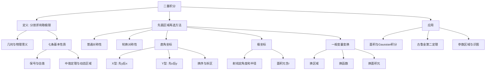

# 高数第14讲 二重积分

> [!info] 教材范围
> 来源：`27张宇基础30讲高数.pdf`，印刷页 338-376 / PDF p343-p381。
>
> 本讲正文含例14.1-例14.17，基础习题含14.1-14.12。已对39页逐页OCR，并查看10张全覆盖联系图及39张高清原页；公式、区域图、例题和答案均以原页复核结果为准。

## 本讲速览

- 二重积分的本质仍是“分割、近似、求和、取极限”，只是把一维小区间换成二维小区域；它既表示有向体积，也能表示面积、质量等总量。
- 计算前先做两件事：**画积分区域**，再看**对称性**。很多题不是算不动，而是坐标系、积分次序或区域拆分选错了。
- 普通对称性比较对称点处函数值的“相同或相反”；轮换对称性利用 $x,y$ 互换后区域不变，把 $f(x,y)$ 与 $f(y,x)$ 相加化简。
- 直角坐标的核心是截线定限，极坐标的核心是射线定限。看到无初等原函数先想换序，看到圆、扇形或 $x^2+y^2$ 先想极坐标。
- 一般变量变换必须完成“三换”：换区域、换被积函数、换面积元；极坐标和椭圆缩放都只是它的特例。
- 例题与练习反复考查“方法切换”：直角坐标可转极坐标，极坐标也可转回直角坐标；积分难算时先改变描述，不要硬算。

## 教材路线

| 教材顺序 | 印刷页 / PDF页 | 内容与题目 |
|---|---|---|
| 入口与知识结构 | 338 / p343 | 考试目标；概念、性质、对称性、三类计算、换元、古鲁金第二定理、区域大观 |
| 一、概念与性质 | 339-343 / p344-p348 | 定义、几何意义、7条性质、中值定理、动态区域；例14.1-14.2 |
| 一、普通与轮换对称性 | 343-347 / p348-p352 | 轴、平移轴、原点、$y=x$ 对称；轮换平均；例14.3-14.4 |
| 二、直角坐标计算 | 347-350 / p352-p355 | X型与Y型区域、选择次序、交换次序、无初等原函数；例14.5-14.7 |
| 二、极坐标计算 | 350-355 / p355-p360 | 面积元、极点三种位置、选坐标原则、轮换联用、Gaussian积分；例14.8-14.13 |
| 二、两种坐标互换 | 355 / p360 | 由直角限画区域后改极坐标；例14.14 |
| 二、一般换元法 | 356-357 / p361-p362 | 一般变量变换、Jacobian、“三换”；例14.15 |
| 三、古鲁金第二定理 | 358-359 / p363-p364 | 平面区域旋转成体积、斜轴距离、逆求形心；例14.16-14.17 |
| 四、平面区域大观 | 360-371 / p365-p376 | 17个直线边界区、44个曲线边界区、15个极坐标区、9个参数区的识图训练 |
| 基础习题与答案 | 371-376 / p376-p381 | 习题14.1-14.12及完整解析 |

## 前置知识与关联导航

- 二重积分定义直接推广自[[08_高数第8讲_一元函数积分学的概念与性质#4. 定积分定义|定积分定义]]，性质与[[08_高数第8讲_一元函数积分学的概念与性质#7. 定积分基本性质|定积分基本性质]]同源。
- 累次积分最终仍靠[[09_高数第9讲_一元函数积分学的计算|一元积分计算]]，换序题常用变限积分和分部积分。
- 平面区域、极坐标面积与[[10_高数第10讲_一元函数积分学的应用一_几何应用|一元积分几何应用]]互相验证。
- 古鲁金第二定理需要[[12_高数第12讲_一元函数积分学的应用三#6. 质心与力矩计算|区域形心与力矩]]，并应与第12讲古鲁金第一定理区分。
- 区域边界、隐式曲线与极值判断依赖[[13_高数第13讲_多元函数微分学|多元函数微分学]]。
- 本讲的区域与坐标变换会直接迁移到[[18_高数第18讲_多元函数积分学#1. 三重积分定义|三重积分]]及曲线、曲面积分。

## 知识网络

## 知识点清单

### 一、概念、性质与对称性

### 1. 二重积分定义

设 $f(x,y)$ 是有界闭区域 $D$ 上的有界函数。把 $D$ 任意分成 $n$ 个小闭区域 $\Delta\sigma_i$，其面积也记为 $\Delta\sigma_i$；在每块内任取 $(\xi_i,\eta_i)$，作积分和

$$
\sum_{i=1}^n f(\xi_i,\eta_i)\Delta\sigma_i.
$$

令

$$
\lambda=\max_i\{\Delta\sigma_i\text{ 的直径}\}.
$$

若当 $\lambda\to0$ 时，积分和总趋于同一极限，且与分割方式和取点方式均无关，则

$$
\boxed{
\iint_D f(x,y)\,d\sigma
=\lim_{\lambda\to0}
\sum_{i=1}^n f(\xi_i,\eta_i)\Delta\sigma_i
}.
$$

- $f$ 是被积函数，$D$ 是积分区域，$d\sigma$ 是面积元素。
- 二维区域要用“小区域直径的最大值”趋于0，不能只让某一个方向网格变细。
- 若 $f$ 在有界闭区域 $D$ 上连续，则二重积分一定存在；这是常用充分条件。
- 可积函数必有界，但有界函数未必可积。

**直观理解**：把薄板切得足够细，每块上近似把函数看成常数，“局部函数值 $\times$ 小块面积”求和，再取极限。这与定积分、三重积分的思想完全一致。

**看到什么想到它**：双重求和极限中出现 $\Delta x\Delta y$、$1/n^2$ 和二维样点时，先尝试配成二重积分的Riemann和。习题14.1就是这一入口。

### 2. 几何意义与物理意义

若 $f(x,y)\ge0$，则

$$
\iint_D f(x,y)\,d\sigma
$$

是以 $D$ 为底、$z=f(x,y)$ 为顶的曲顶柱体体积。若 $f$ 有正有负，则积分表示

$$
\text{$xOy$ 面上方体积}-\text{$xOy$ 面下方体积},
$$

即**有向体积**，不是几何体积绝对值。

若 $f$ 表示面密度，则积分给出薄板总质量；同理可表示总电荷、总热量等。

### 3. 基本性质与中值定理

设 $A=S_D$ 为区域面积。

**性质1：区域面积**

$$
\boxed{\iint_D 1\,d\sigma=A}.
$$

详细计算见[[#13. 平面区域面积|平面区域面积]]。

**性质2：可积必有界**

在有界闭区域上可积 $\Rightarrow$ 有界；逆命题一般不成立。

**性质3：线性**

$$
\iint_D(k_1f\pm k_2g)\,d\sigma
=k_1\iint_Df\,d\sigma
\pm k_2\iint_Dg\,d\sigma.
$$

**性质4：区域可加**

若 $D=D_1\cup D_2$，两部分内部不重叠，则

$$
\iint_Df\,d\sigma
=\iint_{D_1}f\,d\sigma+\iint_{D_2}f\,d\sigma.
$$

**性质5：保号与比较**

若 $f\le g$，则

$$
\iint_Df\,d\sigma\le\iint_Dg\,d\sigma.
$$

特别地，

$$
\boxed{\left|\iint_Df\,d\sigma\right|
\le\iint_D|f|\,d\sigma}.
$$

**性质6：估值定理**

若 $m\le f(x,y)\le M$，则

$$
\boxed{mA\le\iint_Df\,d\sigma\le MA}.
$$

**性质7：中值定理**

若 $f$ 在有界闭区域 $D$ 上连续，则至少存在 $(\xi,\eta)\in D$，使

$$
\boxed{\iint_Df(x,y)\,d\sigma=f(\xi,\eta)A}.
$$

因此函数在区域上的平均值为

$$
\bar f=\frac1A\iint_Df\,d\sigma.
$$

#### 3.1 两个高频二级结论

**1. 怎样选区域使积分最大**

若允许自由选择积分区域，为使 $\iint_D f\,d\sigma$ 最大，应纳入所有 $f>0$ 的点并排除所有 $f<0$ 的点；$f=0$ 的边界是否纳入不影响积分。例14.1与习题14.12都不是先积分，而是先找被积函数的非负区域。

**2. 动态区域缩向一点**

若 $D(t)$ 缩向 $P_0$，面积为 $A(t)$，且 $f$ 在 $P_0$ 连续，则由中值定理

$$
\iint_{D(t)}f\,d\sigma
=A(t)f(\xi_t,\eta_t)
\sim A(t)f(P_0).
$$

求 $F'(0)$ 时，先写导数定义，再比较 $A(t)$ 与 $t$ 的阶。例14.2中动态椭圆的面积直接给出主阶；抽象函数同样适用。

> **看到什么想到它**：积分本身难算、区域随参数缩小、只求端点导数或被积函数抽象时，先想中值定理，而不是硬积。

### 4. 普通对称性

普通对称性的统一做法只有两步：

1. 找区域关于哪条轴、直线或点对称；
2. 把对称点代入 $f$，若函数值相同则半区乘2，若相反则积分为0。

若 $D$ 关于 $y$ 轴对称，对称点为 $(-x,y)$：

$$
\iint_D f\,d\sigma=
\begin{cases}
2\iint_{D_R}f\,d\sigma,&f(-x,y)=f(x,y),\\
0,&f(-x,y)=-f(x,y).
\end{cases}
$$

若 $D$ 关于 $x$ 轴对称，把 $y$ 换成 $-y$；若关于原点对称，把 $(x,y)$ 换成 $(-x,-y)$；若关于 $y=x$ 对称，把 $(x,y)$ 换成 $(y,x)$。

平移后的对称轴也要会：

| 对称对象 | 对称点 |
|---|---|
| $x=a$ | $(2a-x,y)$ |
| $y=a$ | $(x,2a-y)$ |
| 原点 | $(-x,-y)$ |
| $y=x$ | $(y,x)$ |

例如，若 $D$ 关于 $x=a$ 对称，则

$$
\iint_D(x-a)\,d\sigma=0.
$$

**创造对称性**：区域本身不完全对称时，可加辅助曲线把它拆成“对称部分 + 剩余部分”。对称部分先消掉，再用保号性判断剩余部分正负。例14.3和习题14.7都使用这一思想。

### 5. 轮换对称性

在直角坐标系下，若把 $x,y$ 对调后区域 $D$ 不变，即 $D$ 关于 $y=x$ 对称，则

$$
\boxed{
\iint_Df(x,y)\,dx\,dy
=\iint_Df(y,x)\,dx\,dy
}.
$$

于是

$$
\boxed{
\iint_Df(x,y)\,d\sigma
=\frac12\iint_D[f(x,y)+f(y,x)]\,d\sigma
}.
$$

若 $f(x,y)+f(y,x)=c$，则

$$
\iint_Df(x,y)\,d\sigma=\frac c2S_D.
$$

**与普通对称性的区别**

| 方法 | 区域条件 | 观察对象 | 典型结论 |
|---|---|---|---|
| 普通对称性 | 关于 $y=x$ 对称 | $f(x,y)$ 与 $f(y,x)$ 是否相等或相反 | 半区乘2或积分为0 |
| 轮换对称性 | 交换 $x,y$ 后区域不变 | $f(x,y)+f(y,x)$ 是否更简单 | 原积分等于两式平均 |

当 $f(x,y)=-f(y,x)$ 时，两种方法殊途同归；当二者既不相等也不相反时，轮换平均往往仍能化简。例14.4、14.8、14.10均属此类。

> **看到什么想到它**：区域关于 $y=x$ 对称，而分式、根式或对数中 $x,y$ 地位不对称时，立刻写出换位后的函数并求和。

### 二、二重积分的计算

### 6. 直角坐标下的计算原则

直角坐标用平行于坐标轴的截线切割区域。选择积分次序同时看两点：

- 哪个次序使区域不用拆或少拆；
- 被积函数先对哪个变量容易积分。

面积元为

$$
d\sigma=dx\,dy=dy\,dx>0.
$$

因此真实二重积分写成累次积分时，内层下限必须不大于上限。若交换上下限添负号，所得只是带符号的累次积分表达式，不能再直接称为该区域上的二重积分。

### 7. X型区域：先 $y$ 后 $x$

若每条竖直截线与区域边界至多形成一段，写成

$$
D=\{(x,y)\mid a\le x\le b,\ \varphi_1(x)\le y\le\varphi_2(x)\},
$$

则

$$
\boxed{
\iint_Df\,d\sigma
=\int_a^b\left[\int_{\varphi_1(x)}^{\varphi_2(x)}
f(x,y)\,dy\right]dx
}.
$$

记忆：外层 $x$ 是区域向 $x$ 轴的投影；固定 $x$，先遇到下边界，再遇到上边界。

### 8. Y型区域：先 $x$ 后 $y$

若每条水平截线形成一段，写成

$$
D=\{(x,y)\mid c\le y\le d,\ \psi_1(y)\le x\le\psi_2(y)\},
$$

则

$$
\boxed{
\iint_Df\,d\sigma
=\int_c^d\left[\int_{\psi_1(y)}^{\psi_2(y)}
f(x,y)\,dx\right]dy
}.
$$

区域若对当前方向不是简单区域，就按边界切换点分段相加。

### 9. 换序核心

换序不是“机械交换 $dx,dy$”，而是**同一区域重新投影**：

1. 把原上下限翻译成不等式；
2. 画边界、求交点并标明区域；
3. 找新外层变量的总投影；
4. 固定新外层变量，用截线读出内层左右界或上下界；
5. 边界中途改变时分段。

**高频触发信号**

- 原内层出现无初等原函数，而换序后可积；
- 被积函数只含原外层变量，可先积另一变量得到截线长度；
- 原式本质是二次变上限积分，换序后才能正确求导；
- 换序后能结合等价无穷小或单调性。

教材列出的常见无初等原函数形式包括

$$
\frac{\sin x}{x},\quad
\frac{\cos x}{x},\quad
\frac{\ln(1+x)}x,\quad
\frac1{\ln x},\quad
\sin x^2,\quad \cos x^2,
$$

$$
\sin\frac1x,\quad
\cos\frac1x,\quad
\frac{\tan x}{x},\quad
\frac{e^x}{x},\quad
\tan x^2,\quad
e^{ax^2+bx+c}\ (a\ne0).
$$

见到这些作内层积分时，优先检查能否换序。

若 $x\to0^+$ 时 $f(x)\sim g(x)$，且相应积分存在，则常可用

$$
\frac{\int_0^x f(t)\,dt}{\int_0^x g(t)\,dt}\to1.
$$

教材通过换序还得到两个可复用结果：

$$
\int_0^1\arcsin\sqrt{1-x^2}\,dx=1,
$$

$$
\int_0^1\arcsin\sqrt{4x-4x^2}\,dx=\frac12.
$$

> **看到什么想到它**：题面含“交换积分次序”、内层无法原函数表示、变限积分套娃，第一步都不是积分，而是画区域。

### 10. 极坐标变换

极坐标关系为

$$
x=r\cos\theta,\qquad y=r\sin\theta,\qquad r\ge0,
$$

面积微元是

$$
\boxed{dx\,dy=r\,dr\,d\theta}.
$$

其中 $r$ 来自小扇形面积近似 $dr\cdot r\,d\theta$，绝不能漏。

#### 10.1 三类区域

对固定 $\theta$，沿从极点出发的射线读取径向区间：

1. **极点在区域外**：

   $$
   \int_\alpha^\beta
   \int_{r_1(\theta)}^{r_2(\theta)}
   f(r\cos\theta,r\sin\theta)\,r\,dr\,d\theta.
   $$

2. **极点在区域边界**：

   $$
   \int_\alpha^\beta
   \int_0^{r(\theta)}
   f(r\cos\theta,r\sin\theta)\,r\,dr\,d\theta.
   $$

3. **极点在区域内部且区域关于极点为单段星形**：

   $$
   \int_0^{2\pi}
   \int_0^{r(\theta)}
   f(r\cos\theta,r\sin\theta)\,r\,dr\,d\theta.
   $$

若一条射线与区域交成多段，仍要拆区。通常先积 $r$ 后积 $\theta$，但若反过来更简单，可以改变次序。

#### 10.2 何时优先用极坐标

满足以下至少一项时优先考虑：

- 被积函数含 $x^2+y^2$、$\sqrt{x^2+y^2}$、$y/x$ 或 $x/y$；
- 区域是圆、圆环、扇形或圆的一部分；
- 直角坐标上下限复杂，而射线边界简单。

若区域关于 $y=x$ 对称但被积函数不是径向式，可先轮换平均，再化成 $x^2+y^2$，如例14.8。

#### 10.3 常用边界互换

| 直角坐标边界 | 极坐标边界 |
|---|---|
| $x=a$ | $r=a\sec\theta$ |
| $y=a$ | $r=a\csc\theta$ |
| $x+y=c$ | $r=c/(\cos\theta+\sin\theta)$ |
| $x^2+y^2=R^2$ | $r=R$ |
| $x^2+y^2=2ax$ | $r=2a\cos\theta$ |
| $x^2+y^2=2by$ | $r=2b\sin\theta$ |
| $y=kx$ | $\theta=\arctan k$，并结合象限 |

例14.9说明：边界是 $x^2+y^2-xy=c$ 时，可直接代入极坐标定 $r$；若需要画图，可用特殊点、配方或二次型主轴旋转辅助。

### 11. 极坐标系与直角坐标系的互相转化

坐标变换是双向工具：

- 直角坐标中圆弧、斜线使内层难积，可以先画图再改极坐标；
- 极坐标中 $\theta$ 积分困难，而 $r\sin\theta=y$、$r\cos\theta=x$ 能显著化简时，可以转回直角坐标。

例14.14的累次积分无论先积 $x$ 还是 $y$ 都困难，真正入口是把圆弧区域改成极坐标。习题14.10、14.11则相反，题目虽以极坐标给出，但转回直角坐标后换序更短。

> **判断顺序**：先画同一个区域，再比较“直角截线”和“极坐标射线”哪一种能让边界与被积函数同时简单。

### 12. 一般变量变换

设

$$
x=x(u,v),\qquad y=y(u,v),
$$

在相应区域内是一一映射，具有一阶连续偏导，且

$$
J=\frac{\partial(x,y)}{\partial(u,v)}
=
\begin{vmatrix}
x_u&x_v\\
y_u&y_v
\end{vmatrix}
\ne0.
$$

则

$$
\boxed{
\iint_{D_{xy}}f(x,y)\,dx\,dy
=\iint_{D_{uv}}
f(x(u,v),y(u,v))
\left|J\right|\,du\,dv
}.
$$

必须完成“三换”：

1. $D_{xy}\to D_{uv}$：换积分区域；
2. $f(x,y)\to f(x(u,v),y(u,v))$：换被积函数；
3. $dx\,dy\to|J|du\,dv$：换面积元。

例14.15中令 $u=x+y,\ v=y$，既把三角区域简化，也把指数中的 $y/(x+y)$ 解耦。选换元时优先抓题面反复出现的组合，如 $x+y$、$x-y$、$xy$ 或二次型。

极坐标只是一般换元：

$$
\left|
\frac{\partial(x,y)}{\partial(r,\theta)}
\right|=r.
$$

对椭圆 $2x^2+y^2\le1$，可用“椭圆极坐标”

$$
x=\frac r{\sqrt2}\cos\theta,\qquad
y=r\sin\theta,
$$

此时

$$
\boxed{dx\,dy=\frac r{\sqrt2}\,dr\,d\theta}.
$$

习题14.12专门检查这一非标准Jacobian。

### 13. 平面区域面积

面积统一写成

$$
\boxed{S_D=\iint_D1\,d\sigma}.
$$

直角坐标：

$$
S_D=\int_a^b[\varphi_2(x)-\varphi_1(x)]\,dx
=\int_c^d[\psi_2(y)-\psi_1(y)]\,dy.
$$

极坐标：

$$
\boxed{
S_D=\frac12\int_\alpha^\beta
\left[r_2^2(\theta)-r_1^2(\theta)\right]d\theta
}.
$$

这既是面积公式，也是检查积分限的快捷方式：把被积函数换成1，所得结果必须非负，并与图形量级一致。

### 14. 古鲁金第二定理

平面区域 $D$ 绕与其内部不相交的直线旋转一周，形成旋转体。若 $S$ 为区域面积，$(\bar x,\bar y)$ 为形心，形心到旋转轴的距离为 $\bar r$，则

$$
\boxed{V=2\pi S\bar r}.
$$

即

$$
\text{旋转体体积}
=\text{区域面积}\times\text{形心走过的路程}.
$$

若旋转轴为

$$
ax+by+c=0,
$$

则

$$
\bar r=
\frac{|a\bar x+b\bar y+c|}{\sqrt{a^2+b^2}}.
$$

定理来自面积微元旋转形成薄环：

$$
dV=2\pi r(x,y)\,d\sigma,
$$

再利用形心的一阶矩公式。定理也可逆用：先由几何求旋转体体积，再由

$$
\bar r=\frac{V}{2\pi S}
$$

反求形心坐标。例14.16是正用，例14.17是外体减内体后逆求形心。

**易混对比**

- 古鲁金第一定理：曲线旋转，求曲面面积，见[[12_高数第12讲_一元函数积分学的应用三|第12讲]]。
- 古鲁金第二定理：平面区域旋转，求旋转体体积。

### 15. 平面区域 $D$ 大观

教材用大量图训练的不是背图，而是以下四套识图程序。

#### 15.1 直线边界型

1. 每个等式先画边界直线；
2. 用原点或简单测试点判断取哪一侧；
3. 联立边界找顶点；
4. 绝对值要按符号分象限或分区，如 $|x|+|y|\le1$ 是菱形；
5. 多个线性不等式取交集，不要把“且”看成“或”。

#### 15.2 曲线边界型

1. 先识别熟悉曲线：圆、抛物线、双曲线、指数、三角曲线；
2. 求交点，确定哪条曲线在上、下、左、右；
3. 二次式优先配方，如 $x^2+y^2-2x\le0$ 是圆；
4. 乘积、高次式可先因式分解，再判断各因子符号；
5. 形如 $(x^2+y^2)^2\le2xy$ 的区域，改极坐标后才显形。

#### 15.3 极坐标方程型

固定 $\theta$ 后把 $r$ 看成射线上的有向距离，先画角度范围，再画径向上下界。要熟悉

$$
r=2a\cos\theta,\qquad r=2a\sin\theta
$$

对应过原点的圆。教材特别提醒：有些区域虽然用直角坐标描述，极坐标图形反而更清楚，不能被题面形式绑住。

#### 15.4 参数方程型

把参数暂当常数，先找边界交点、相切和包含关系；这些临界情形会改变区域拓扑。教材参数椭圆与圆的示例在

$$
a=\frac{2\sqrt2}{3},\qquad a=1
$$

处发生关系变化，因此必须分参数范围作图。参数区域题的核心不是积分，而是先找临界参数。

> **看到什么想到它**：区域含绝对值、max/min、参数或多条隐式曲线时，先做“边界、交点、测试点、分参数”四步，再谈积分限。

### 16. 教材延伸：Gaussian积分与Gamma函数

令

$$
I=\int_0^\infty e^{-x^2}\,dx.
$$

利用积分变量只是哑变量，

$$
I^2
=\int_0^\infty\int_0^\infty
e^{-(x^2+y^2)}\,dx\,dy.
$$

在第一象限改用极坐标：

$$
I^2
=\int_0^{\pi/2}\int_0^\infty e^{-r^2}r\,dr\,d\theta
=\frac\pi4.
$$

由 $I>0$，

$$
\boxed{\int_0^\infty e^{-x^2}\,dx=\frac{\sqrt\pi}{2}},
\qquad
\boxed{\int_{-\infty}^{\infty}e^{-x^2}\,dx=\sqrt\pi}.
$$

教材继续得到

$$
\boxed{
\int_{-\infty}^{\infty}x^2e^{-x^2}\,dx
=\frac{\sqrt\pi}{2}
},
$$

$$
\int_0^\infty x^2e^{-x^2}\,dx=\frac{\sqrt\pi}{4}.
$$

可用偶性后配合Gamma函数

$$
\Gamma(\alpha)=\int_0^\infty x^{\alpha-1}e^{-x}\,dx,
\qquad
\Gamma(\alpha+1)=\alpha\Gamma(\alpha),
$$

也可分部积分借用Gaussian积分。例14.11-14.13把这些结果用于反常积分与指数型极限。

## 公式与二级结论索引

| 结论 | 条件与公式 | 详细位置 |
|---|---|---|
| 二重积分定义 | 任意分割、任意取点，$\lambda\to0$ 时积分和同极限 | [[#1. 二重积分定义|定义]] |
| 连续可积 | $f$ 在有界闭区域连续 $\Rightarrow\iint_Df$ 存在 | [[#1. 二重积分定义|存在性]] |
| 面积 | $S_D=\iint_D1\,d\sigma$ | [[#13. 平面区域面积|面积]] |
| 绝对值估计 | $\left|\iint_Df\right|\le\iint_D|f|$ | [[#3. 基本性质与中值定理|基本性质]] |
| 估值定理 | $mA\le\iint_Df\le MA$ | [[#3. 基本性质与中值定理|估值]] |
| 中值定理 | $\iint_Df=f(\xi,\eta)A$，$f$ 连续 | [[#3. 基本性质与中值定理|中值定理]] |
| 最优积分区域 | 纳入 $f\ge0$ 区域并排除 $f<0$ 区域 | [[#3.1 两个高频二级结论|区域优化]] |
| 轮换平均 | $\iint_Df=\frac12\iint_D[f(x,y)+f(y,x)]$ | [[#5. 轮换对称性|轮换]] |
| X型区域 | $\int_a^b dx\int_{\varphi_1}^{\varphi_2}f\,dy$ | [[#7. X型区域：先 $y$ 后 $x$|X型]] |
| Y型区域 | $\int_c^d dy\int_{\psi_1}^{\psi_2}f\,dx$ | [[#8. Y型区域：先 $x$ 后 $y$|Y型]] |
| 极坐标 | $x=r\cos\theta,\ y=r\sin\theta,\ d\sigma=r\,dr\,d\theta$ | [[#10. 极坐标变换|极坐标]] |
| 极坐标面积 | $S=\frac12\int(r_2^2-r_1^2)d\theta$ | [[#13. 平面区域面积|极坐标面积]] |
| 一般换元 | $dx\,dy=\left|\partial(x,y)/\partial(u,v)\right|du\,dv$ | [[#12. 一般变量变换|Jacobian]] |
| 椭圆极坐标 | $x=r\cos\theta/\sqrt2,\ y=r\sin\theta$，$dxdy=r\,drd\theta/\sqrt2$ | [[#12. 一般变量变换|非标准极坐标]] |
| 古鲁金第二定理 | $V=2\pi S\bar r$，旋转轴不穿过区域内部 | [[#14. 古鲁金第二定理|古鲁金第二定理]] |
| Gaussian积分 | $\int_0^\infty e^{-x^2}dx=\sqrt\pi/2$ | [[#16. 教材延伸：Gaussian积分与Gamma函数|Gaussian积分]] |
| Gamma递推 | $\Gamma(\alpha+1)=\alpha\Gamma(\alpha)$ | [[#16. 教材延伸：Gaussian积分与Gamma函数|Gamma函数]] |

## 题型-方法决策表

| 题面信号 | 第一反应 | 首选方法 | 必查点 |
|---|---|---|---|
| 双重求和极限、$1/n^2$ | 配二维小面积 | 识别Riemann和 | 样点和区域 |
| 同一函数在不同区域比较 | 先看正负分界 | 保号性+区域可加 | 新增部分贡献正负 |
| 区域缩向一点，求端点导数 | 积分不必真算 | 中值定理+面积主阶 | 连续性、面积阶 |
| 轴、原点或 $y=x$ 对称 | 代入对称点 | 普通对称性 | 区域也必须对称 |
| $D$ 交换 $x,y$ 不变，分式不对称 | 写换位函数 | 轮换平均 | $f+f^\ast$ 是否简单 |
| 内层无初等原函数 | 停止硬积 | 画图换序 | 新次序是否要拆区 |
| 被积函数只含外层变量 | 内层只贡献截线长度 | 换序或先积1 | 截线长度表达 |
| 圆、扇形、$x^2+y^2$ | 改用射线描述 | 极坐标 | 角度、径向、额外因子$r$ |
| 极坐标中角积分更难 | 不迷信极坐标 | 转回直角坐标再换序 | $r\sin\theta,y$ 等对应 |
| 出现 $x+y,x-y,y/(x+y)$ | 抓组合变量 | 一般换元 | 三换与Jacobian绝对值 |
| 椭圆非负区 | 缩放成圆 | 椭圆极坐标 | 缩放因子进入Jacobian |
| 区域绕外部直线旋转 | 面积和形心已知 | 古鲁金第二定理 | 形心到轴的垂距 |
| 已知旋转体体积，求形心 | 反解距离 | $\bar r=V/(2\pi S)$ | 外体减内体 |
| $e^{\max\{x^2,y^2\}}$ 等分段函数 | 先去掉max/min | 按分界线拆区 | 各区表达式不同 |
| 参数区域 | 先找图形临界值 | 交点、相切、包含 | 分参数范围 |

## 教材例题覆盖表

| 例题 | 核心考点 | 看见题面后的第一步 | 可迁移方法 |
|---|---|---|---|
| 14.1 | 积分比较 | 找被积函数正负区域 | 最优区域就是全部非负区 |
| 14.2 | 动态区域导数 | 中值定理写成面积乘函数值 | 抽象函数也可用面积主阶 |
| 14.3 | 普通对称性 | 画区域并加辅助曲线 | 对称部分消零，余区看符号 |
| 14.4 | 轮换对称性 | 计算 $g(u,v)+g(v,u)$ | 不必要求二者相等或相反 |
| 14.5 | 换序 | 由三角函数限画区域 | 反函数分支必须结合区间 |
| 14.6 | 换序与极限 | 把套娃积分变成二重积分 | 无初等原函数是换序信号 |
| 14.7 | 换序降维 | 先积不出就换截线方向 | 截线长度乘一元函数 |
| 14.8 | 轮换+极坐标 | 先把非径向式对称化 | 多种方法可以串联 |
| 14.9 | 非标准二次边界 | 极坐标代入边界求 $r$ | 特殊点或主轴旋转只辅助画图 |
| 14.10 | 参数积分函数 | 只算到所需导数层级 | 不必完整求出上层积分 |
| 14.11 | Gaussian积分 | 平方后进入第一象限 | 哑变量乘积+极坐标 |
| 14.12 | Gaussian矩 | 先用偶性减半 | Gamma递推或分部积分 |
| 14.13 | 指数型极限 | 先令分子主项消失 | 已知反常积分用于定参数 |
| 14.14 | 坐标系切换 | 先画圆弧区域 | 难点可能不是换序而是换坐标 |
| 14.15 | 一般换元 | 令重复组合成为新变量 | 区域、函数、面积元三换 |
| 14.16 | 古鲁金正用 | 求面积和形心到斜轴距离 | 斜轴距离要正规化 |
| 14.17 | 古鲁金逆用 | 外旋转体减内旋转体 | 分别绕两轴可求两个形心坐标 |

## 讲末练习反查

| 练习 | 依赖知识 | 只看笔记应能想到 |
|---|---|---|
| 14.1 | 定义 | 把双和配成单位正方形上的Riemann和 |
| 14.2 | 区域多种表示 | 配方画圆，逐个核对直角与极坐标限，不能擅加偶性 |
| 14.3 | 坐标互换 | $r\le\cos\theta$ 是圆，再分别写X型、Y型区域 |
| 14.4 | 极坐标角度 | $y=|x|$ 与半圆决定 $\theta\in[\pi/4,3\pi/4]$ |
| 14.5 | 分段函数 | 两个非零条件的交集就是有效积分区域 |
| 14.6 | 动态区域 | 先换序化单积分，再求变上限导数 |
| 14.7 | 人造对称 | 加 $y=-\sin x$，两个子区分别关于不同坐标轴对称 |
| 14.8 | 拆项与对称 | 径向项极坐标，$xy$ 项由轴对称消零 |
| 14.9 | max函数 | 由 $y=x$ 分区，再选各区方便的积分次序 |
| 14.10 | 反向换坐标 | 极坐标难算就转直角坐标，使内层可换元 |
| 14.11 | 反向换坐标 | 认出 $r\sin\theta=y$，把楔形区写成直角坐标后换序 |
| 14.12 | 区域优化与椭圆缩放 | 先取 $2x^2+y^2\le1$，再用Jacobian为 $r/\sqrt2$ 的椭圆极坐标 |

## 易错点/易混点

1. 二重积分定义要求与分割方式、取点方式均无关，只沿某一种网格趋近不能代替定义。
2. 连续是可积的充分条件；“可积必有界”不能反过来写。
3. 几何体积要求非负；函数有正有负时，二重积分给的是有向体积。
4. 比较不同区域上的积分，区域大不代表积分一定大，还要看新增区域上 $f$ 的符号。
5. 中值定理要求连续；动态区域题还要检查区域面积随参数的阶。
6. 对称性必须同时满足“区域对称”和“函数在对称点上的关系”。
7. 关于 $x=a$ 的对称点是 $(2a-x,y)$，不是简单把 $x$ 换成 $-x$。
8. 普通对称性与轮换对称性不是同一判据；后者关注 $f(x,y)+f(y,x)$。
9. X型、Y型名称描述区域截线，不代表被积函数只含某个变量。
10. 换序必须先画同一区域，不能只交换积分号和微分次序。
11. 内层上下限必须下限 $\le$ 上限；倒置后添负号的表达式不再是正面积元下的二重积分。
12. 反三角函数边界要结合原变量区间选择正确分支。
13. 极坐标面积元一定带 $r$；$r$ 不是被积函数的一部分，不能因化简而丢失。
14. 极角范围要覆盖区域恰好一次，既不能漏扫也不能重复扫。
15. 圆心不在原点不代表不能用极坐标；应看边界能否化成简单的 $r(\theta)$。
16. 已给极坐标不等于必须留在极坐标，习题14.10、14.11都应转回直角坐标。
17. 一般变量变换的Jacobian取绝对值，并且区域、函数、面积元必须同时变换。
18. 非标准缩放极坐标的Jacobian不是 $r$，要把每个坐标缩放因子乘进去。
19. 古鲁金第二定理用形心到旋转轴的垂直距离，不是到原点或坐标轴的横纵坐标。
20. 旋转轴穿过区域内部时，简单的 $V=2\pi S\bar r$ 可能出现体积重叠，不能直接套用。
21. 参数区域必须在相切、相交或包含关系变化处分类，不能只画一个参数值。
22. 求 $\sqrt{I^2}$ 时要用积分符号判断 $I$ 的正负，不能无条件去根号。

## 注解

### 为什么二重积分必须先画区域

积分限只是区域的一种语言。换序、改极坐标、一般换元都在重写同一个集合 $D$；如果脑中没有区域，无法判断投影范围、边界切换、角度范围和是否需要拆分。画图不是附加步骤，而是计算的一部分。

### 为什么普通对称和轮换对称容易混

普通对称把区域中的每个点与镜像点配对，比较两点的“高度”是否抵消。轮换对称则利用积分变量是哑变量，把整个积分抄一份并交换 $x,y$，再对两个积分取平均。前者是局部配对，后者是整体换名。

### 为什么极坐标有时反而更难

极坐标只在“区域”和“被积函数”至少有一项明显变简单时才值得用。若变换后留下难积的角函数，而直角坐标中某个变量能直接换元，就应转回去。坐标系没有优先级，只有计算成本。

### 本讲复习顺序

1. 先背7条性质、普通对称和轮换平均；
2. 再练X型、Y型区域互写，确保会画图换序；
3. 熟记极坐标面积元和常见直线、圆的转换；
4. 用例14.11、14.15、14.16复盘“极坐标、一般换元、古鲁金”三种扩展；
5. 最后用12道练习检查能否在计算前说出选法理由。

## 速背检查

1. **二重积分定义中的 $\lambda$ 是什么？** 所有小区域直径的最大值。
2. **连续函数何时保证二重积分存在？** 在有界闭区域上连续。
3. **可积与有界的正确方向？** 可积必有界；有界未必可积。
4. **函数有正有负时积分的几何意义？** 上方体积减下方体积。
5. **估值定理？** $mA\le\iint_Df\le MA$。
6. **中值定理？** $\iint_Df=f(\xi,\eta)A$，前提是连续。
7. **怎样选区域使 $\iint_Df$ 最大？** 纳入全部非负区，排除负值区。
8. **关于 $x=a$ 的对称点？** $(2a-x,y)$。
9. **轮换平均公式？** $\iint_Df=\frac12\iint_D[f(x,y)+f(y,x)]$。
10. **X型区域怎样积分？** 固定 $x$ 先积 $y$，再对 $x$ 积分。
11. **换序五步的第一步？** 把原积分限翻译成区域并画图。
12. **看到无初等原函数先想什么？** 交换积分次序。
13. **极坐标面积元？** $d\sigma=r\,dr\,d\theta$。
14. **极坐标通常怎样定限？** 先定射线角度，再读该射线上的径向起止。
15. **$x^2+y^2=2ax$ 的极坐标式？** $r=2a\cos\theta$。
16. **一般换元的“三换”？** 区域、被积函数、面积元。
17. **一般换元为何取 $|J|$？** 面积缩放取绝对大小，与定向无关。
18. **椭圆极坐标为什么不能只乘 $r$？** 坐标缩放还贡献额外Jacobian因子。
19. **古鲁金第二定理？** $V=2\pi S\bar r$。
20. **第一、第二古鲁金定理分别求什么？** 曲线旋转求曲面面积；区域旋转求旋转体体积。
21. **Gaussian半轴积分？** $\int_0^\infty e^{-x^2}dx=\sqrt\pi/2$。
22. **参数区域先找什么？** 交点、相切和包含关系变化的临界参数。

## OCR/视觉核查

- 证据入口：[[00_OCR视觉核查报告#14 高数 二重积分|查看本讲OCR/视觉核查]]。
- 已逐页处理并复核 PDF p343-p381，共39页；联系图10张，覆盖整讲全部页面。
- 高清原页重点核对：定义中 $\lambda$ 的含义；7条性质；平移轴、原点与 $y=x$ 对称点；轮换平均；X/Y型区域与换序图；三类极坐标区域；Jacobian；古鲁金第二定理；平面区域大观；例14.1-14.17及练习14.1-14.12的公式、积分限和答案。
- OCR只用于建立文字骨架；本笔记中的公式、区域边界、正负号、积分次序与题型结论均按高清原页重新确认。

## 相关链接

- [[13_高数第13讲_多元函数微分学|上一讲：多元函数微分学]]
- [[15_高数第15讲_微分方程|下一讲：微分方程]]
- [[10_高数第10讲_一元函数积分学的应用一_几何应用|一元积分几何应用]]
- [[12_高数第12讲_一元函数积分学的应用三#6. 质心与力矩计算|形心与力矩]]
- [[18_高数第18讲_多元函数积分学#1. 三重积分定义|三重积分]]
