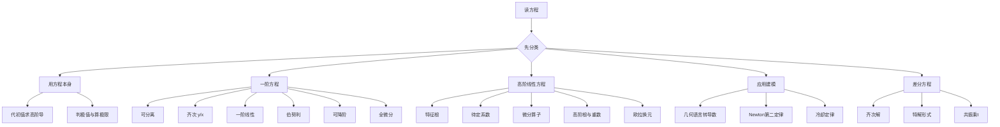

# 高数第15讲 微分方程

> 来源：`27张宇基础30讲高数.pdf`，印刷页377-408 / PDF p382-p413。
>
> 本讲正文含例15.1-例15.25，基础习题含15.1-15.15。已对32页逐页OCR，并查看8张全覆盖联系图及32张高清原页；导数阶数、特征根、待定系数、算子公式和差分下标均以原页复核结果为准。

## 本讲速览

1. 微分方程题先做的不是积分，而是**分类**：看阶数、是否线性、是否可分离、是否只含 $y/x$、是否不显含某个变量、是否常系数。
2. 一阶方程的主线是“化成已知型”：可分离、齐次型、一阶线性、伯努利、全微分；直接不行时要想到换元或交换 $x,y$ 的角色。
3. 二阶及高阶常系数线性方程的主线是“齐次看特征根，非齐次看右端形式与共振重数”，通解永远是“齐次通解+一个特解”。
4. 教材先用例15.1-15.2强调：有时无需解出 $y(x)$，直接把初值代入原方程或对原方程求导，就能判断极值、补齐导数和计算极限。
5. 应用题的难点是翻译：切线斜率写成 $y'$，加速度可写成 $v\,dv/dx$，冷却规律要带正确正负号。
6. 数学三还要掌握一阶常系数线性差分方程；它与常系数微分方程同样遵循“齐次解+特解、叠加、共振乘变量”的结构。

## 教材路线

| 教材部分 | 印刷页 / PDF页 | 本讲任务 |
|---|---|---|
| 开篇结构与考纲 | 377-378 / p382-p383 | 明确数一、数二、数三范围及整讲分类 |
| 一、微分方程的概念 | 378-380 / p383-p385 | 阶、常微分方程、线性、解、通解、初值和用概念解题 |
| 二、一阶微分方程的求解 | 380-388 / p385-p393 | 可分离、齐次、一阶线性、伯努利、可降阶、全微分 |
| 三、高阶线性微分方程 | 388-398 / p393-p403 | 二阶齐次/非齐次、算子法、高阶齐次、欧拉方程 |
| 四、几何应用 | 398-399 / p403-p404 | 用切线方向、截距、距离建立方程 |
| 五、物理应用 | 399-401 / p404-p406 | 牛顿第二定律、阻力模型、牛顿冷却 |
| 六、一阶常系数线性差分方程 | 401-403 / p406-p408 | 差分定义、解的结构、待定系数与共振 |
| 基础习题与解答 | 403-408 / p408-p413 | 练习15.1-15.15及答案反查 |

## 前置知识与关联导航

- 导数、隐函数求导与链式法则：[[04_高数第4讲_一元函数微分学的计算|第4讲]]。
- 切线、极值和函数性态：[[05_高数第5讲_一元函数微分学的应用一_几何应用|第5讲]]、[[06_高数第6讲_一元函数微分学的应用二|第6讲]]。
- 不定积分、分部积分与三角积分：[[09_高数第9讲_一元函数积分学的计算|第9讲]]。
- 面积与物理建模：[[10_高数第10讲_一元函数积分学的应用一_几何应用|第10讲]]、[[12_高数第12讲_一元函数积分学的应用三|第12讲]]。
- 练习15.10需要把圆域二重积分转成变上限积分：[[14_高数第14讲_二重积分#10. 极坐标变换|极坐标变换]]。
- 常系数线性方程中的幂级数/Taylor消项与下一讲相连：[[16_高数第16讲_无穷级数|第16讲]]。

## 知识网络

## 知识点清单

### 一、微分方程的概念

### 1. 基本概念与用概念解题

#### 1.1 微分方程、阶与常微分方程

含未知函数及其导数（或微分）的关系式称为微分方程，一般写成

$$
F\bigl(x,y,y',\ldots,y^{(n)}\bigr)=0
$$

或

$$
y^{(n)}=f\bigl(x,y,y',\ldots,y^{(n-1)}\bigr).
$$

- **阶**：方程中未知函数最高阶导数的阶数。
- **常微分方程**：未知函数只有一个自变量。
- **偏微分方程**：未知函数有多个自变量并出现偏导数；考纲不系统要求，但题面可能借用简单形式。

> **看到什么想到它**：先圈出最高阶导数，阶数就确定了；不要被方程的次数、根号或指数外形干扰。

#### 1.2 线性、常系数、齐次与非齐次

$n$阶线性微分方程为

$$
a_n(x)y^{(n)}+a_{n-1}(x)y^{(n-1)}
+\cdots+a_1(x)y'+a_0(x)y=f(x),
\qquad a_n(x)\ne0.
$$

- $y,y',\ldots,y^{(n)}$ 只能一次出现，彼此不能相乘，也不能放入非线性函数中。
- 若全部 $a_k$ 为常数，称为**常系数线性微分方程**。
- 若 $f(x)\equiv0$，称为**齐次线性方程**；否则为**非齐次线性方程**。

“齐次型一阶方程 $y'=\varphi(y/x)$”与“齐次线性方程右端为0”是两个不同概念。

#### 1.3 解、积分曲线、通解和特解

- **解**：代入方程后使等式成立的函数。
- **积分曲线**：解 $y=y(x)$ 的图像。
- **通解**：含有的独立任意常数个数等于方程阶数。
- **初始条件**：

  $$
  y(x_0)=a_0,\quad y'(x_0)=a_1,\quad\ldots,\quad
  y^{(n-1)}(x_0)=a_{n-1}.
  $$

  用它确定通解中的常数，所得为**特解**。

常数必须独立。例如 $C_1\sin x+2C_2\sin x$ 实际只能并成一个任意常数，不是两个独立常数。任意常数也不一定能取全部实数，例15.4中的常数受通解表达式限制。

#### 1.4 不求通解也能做题

若只问某点性态、某阶导数或局部极限，应先利用原方程：

1. 把 $x_0,y(x_0),y'(x_0),\ldots$ 代入方程，直接求下一阶导数；
2. 若还缺更高阶导数，对方程两边求导后再代点；
3. 用 $y'(x_0)=0,\ y''(x_0)$ 的符号判断极值；
4. 局部极限可把由方程得到的导数值送入Taylor展开或洛必达法则。

例15.1由方程直接得 $f''(x_0)<0$，判定极大值；例15.2先由方程求 $y''(0)$，再算极限，全程不需要求 $y(x)$。

> **看到什么想到它**：题目只给一个点的初值，却问极值、凹凸、高阶导或 $x\to x_0$ 的极限，先“代方程、必要时求导”，不要先求通解。

### 二、一阶微分方程的求解

### 2. 可分离变量型微分方程

#### 2.1 直接可分离

若

$$
y'=f(x)g(y),
$$

且当前解段上 $g(y)\ne0$，则

$$
\boxed{\int\frac{dy}{g(y)}=\int f(x)\,dx}.
$$

实际步骤：

1. 把所有含 $y$ 的因子与 $dy$ 放一边，含 $x$ 的因子与 $dx$ 放另一边；
2. 两边积分；
3. 合并常数，必要时由初值定常数；
4. 回代并检查定义域、符号和被除掉的因子。

**奇解检查**：若分离时除以 $g(y)$，必须把 $g(y)=0$ 单独代回原方程；满足原方程的常数解可能被分离步骤丢掉。例15.5除以 $1+\sin u$ 时会遗漏 $\sin u=-1$ 对应的部分解；考纲若只要求通解，可以不列全部奇解，但判断“全部解”时不能漏。

**常数整理**：含对数时常写 $\ln C$ 方便合并，但应根据指数化后的表达式判断 $C>0$、$C\ne0$ 或 $C\in\mathbb R$。

#### 2.2 换元后可分离

若

$$
y'=f(ax+by+c),\qquad ab\ne0,
$$

令

$$
u=ax+by+c,
$$

则

$$
\frac{du}{dx}=a+b\frac{dy}{dx}=a+bf(u),
$$

化为关于 $u,x$ 的可分离方程。

> **看到什么想到它**：$x,y$ 总以同一线性组合出现，立刻把该组合整体设元；不要试图分别处理 $x$ 与 $y$。

### 3. 齐次型微分方程

形如

$$
\frac{dy}{dx}=\varphi\left(\frac yx\right)
$$

的方程称为齐次型微分方程。令

$$
u=\frac yx,\qquad y=ux,\qquad y'=u+xu',
$$

得到

$$
x\frac{du}{dx}=\varphi(u)-u,
\qquad
\boxed{\frac{du}{\varphi(u)-u}=\frac{dx}{x}}.
$$

微分形式 $M(x,y)dx+N(x,y)dy=0$ 若 $M,N$ 是同次齐次函数，通常也能整理成 $y/x$ 或 $x/y$ 的函数。

**几何题入口**：切线在 $y$ 轴上的截距为 $y-xy'$；到原点的距离、斜率和截距常能整理成 $y/x$，从而出现齐次方程。例15.6就是“先写切线截距，再令 $u=y/x$”。

### 4. 一阶线性微分方程

#### 4.1 标准形式与积分因子

标准形式为

$$
y'+p(x)y=q(x),
$$

其中 $p,q$ 连续。积分因子为

$$
\mu(x)=e^{\int p(x)\,dx}.
$$

因为

$$
(\mu y)'=\mu q,
$$

故通解

$$
\boxed{
y=e^{-\int p(x)\,dx}
\left[\int e^{\int p(x)\,dx}q(x)\,dx+C\right]
}.
$$

公式不是孤立模板，其本质就是“乘积分因子后左端成为乘积导数”。

若 $\int p(x)dx=\ln|\varphi(x)|$，可直接把积分因子取为 $\varphi(x)$，得到

$$
(\varphi y)'=\varphi q.
$$

#### 4.2 带初值的定积分形式

给定 $y(x_0)=y_0$ 时，最稳的形式是

$$
\boxed{
y(x)=e^{-\int_{x_0}^{x}p(s)\,ds}
\left[
y_0+\int_{x_0}^{x}
q(t)e^{\int_{x_0}^{t}p(s)\,ds}\,dt
\right]
}.
$$

它自动吸收初值，特别适合：

- 证明解的有界性、周期性或极限；
- 被积函数没有初等原函数；
- 只需要研究解的性质而非写出闭式。

例15.9用它把无穷远极限化成积分比；例15.10利用 $a>0$ 带来的指数衰减证明有界性。

#### 4.3 交换 $x,y$ 的角色

若 $dy/dx$ 难解，而倒数后可写成

$$
\frac{dx}{dy}+P(y)x=Q(y),
$$

就把 $x=x(y)$ 当未知函数，按一阶线性公式求解，最后再结合初值还原 $y(x)$。

例15.8说明：初值不仅能定 $C$，还可能决定平方根的正负分支。例15.11也先交换角色，才显出伯努利结构。

> **看到什么想到它**：方程是 $M(x,y)dx+N(x,y)dy=0$，直接整理 $y'$ 很乱时，同时试一次 $dx/dy$。

### 5. 伯努利方程（仅数学一）

伯努利方程为

$$
y'+p(x)y=q(x)y^n,\qquad n\ne0,1.
$$

两边除以 $y^n$ 后令

$$
z=y^{1-n},
$$

则

$$
z'=(1-n)y^{-n}y',
$$

原方程化为

$$
\boxed{
z'+(1-n)p(x)z=(1-n)q(x)
},
$$

即一阶线性方程。

分母中出现 $y^n$ 时要检查 $y=0$ 是否为原方程的解；若对 $x,y$ 交换后才形成伯努利方程，也可以先换位再作幂函数代换。

### 6. 二阶可降阶微分方程（数一、数二）

核心不是背三个孤立公式，而是观察方程**缺了谁**。

#### 6.1 不显含 $y$：$y''=f(x,y')$

令

$$
p(x)=y',
\qquad y''=p',
$$

先解

$$
p'=f(x,p),
$$

再积分

$$
y=\int p(x)\,dx+C_2.
$$

#### 6.2 不显含 $x$：$y''=f(y,y')$

令 $p=p(y)=y'$，由链式法则

$$
\boxed{
y''=\frac{dp}{dx}
=\frac{dp}{dy}\frac{dy}{dx}
=p\frac{dp}{dy}
}.
$$

先解

$$
p\frac{dp}{dy}=f(y,p),
$$

得到 $p=\varphi(y,C_1)$ 后，再由

$$
\frac{dy}{dx}=\varphi(y,C_1)
$$

分离变量求 $y(x)$。

#### 6.3 只含 $y'$：$y''=f(y')$

它既不显含 $y$，也不显含 $x$，通常按6.1令 $p=p(x)$ 最短。

**易丢解处**：若过程中除以 $p$，必须单独检查 $p=0$；这常对应常数解。例15.13最后要把由 $p\ne0$ 得到的解与 $y=0$ 一并检查。

> **看到什么想到它**：出现 $y''$ 时，先扫描方程是否缺 $x$ 或缺 $y$，再决定 $p$ 是 $p(x)$ 还是 $p(y)$。

### 7. 全微分方程（仅数学一）

设

$$
P(x,y)dx+Q(x,y)dy=0.
$$

若 $P,Q$ 在单连通区域内有连续一阶偏导，且

$$
\boxed{\frac{\partial P}{\partial y}
=\frac{\partial Q}{\partial x}},
$$

则存在势函数 $U(x,y)$，使

$$
dU=Pdx+Qdy,
$$

方程通解为

$$
\boxed{U(x,y)=C}.
$$

求 $U$ 的标准步骤：

1. 对 $P$ 关于 $x$ 积分：

   $$
   U(x,y)=\int P(x,y)\,dx+\phi(y);
   $$

2. 对 $y$ 求偏导，与 $Q$ 比较求 $\phi'(y)$；
3. 积分得到 $\phi(y)$，写 $U=C$。

若题目要求“确定某函数使方程成为全微分方程”，先用 $P_y=Q_x$ 反求该函数，再求势函数。例15.14正是这一两阶段结构。

### 三、高阶线性微分方程的求解

### 8. 二阶常系数齐次线性微分方程

方程

$$
y''+py'+qy=0
$$

对应特征方程

$$
r^2+pr+q=0.
$$

若 $y_1,y_2$ 是齐次方程的两个解，且

$$
\frac{y_1(x)}{y_2(x)}\ne C,
$$

即二者不成常数倍，则称它们**线性无关**；找到两个线性无关解后，$C_1y_1+C_2y_2$ 才构成二阶齐次方程的通解。只找到两个彼此成倍数的写法，实际仍只有一个独立解。

| 特征根 | 齐次通解 |
|---|---|
| 两个不等实根 $r_1\ne r_2$ | $y=C_1e^{r_1x}+C_2e^{r_2x}$ |
| 二重实根 $r$ | $y=(C_1+C_2x)e^{rx}$ |
| 共轭复根 $\alpha\pm i\beta$ | $y=e^{\alpha x}(C_1\cos\beta x+C_2\sin\beta x)$ |

**反向读根**

- 解中有 $e^{rx}$：$r$ 是特征根；
- 有 $xe^{rx}$：$r$ 至少是二重根；
- 有 $e^{\alpha x}\cos\beta x$：$\alpha\pm i\beta$ 都是根；
- 有周期解且带 $e^{\alpha x}$：要周期必须 $\alpha=0$；
- 有界性还要结合 $x\to+\infty$ 或 $x\to-\infty$ 的方向判断指数符号。

“函数在 $x_0$ 取极值”要翻译为 $y'(x_0)=0$，再与函数值一起确定常数。

### 9. 二阶常系数非齐次线性微分方程

设

$$
L[y]=y''+py'+qy=f(x).
$$

#### 9.1 解的结构

1. 若 $L[y_1]=f_1,\ L[y_2]=f_2$，则

   $$
   L[y_1+y_2]=f_1+f_2.
   $$

2. 若 $y_1^*,y_2^*$ 都是同一非齐次方程的特解，则

   $$
   y_1^*-y_2^*
   $$

   是对应齐次方程的解。

3. 非齐次方程通解为

   $$
   \boxed{y=y_h+y^*},
   $$

   其中 $y_h$ 是齐次通解，$y^*$ 是任一特解。

已知多个非齐次解时，先作差制造齐次解；已知一个齐次解和一个非齐次解时，二者之和仍是非齐次解。

#### 9.2 自由项为 $P_n(x)e^{\alpha x}$

设 $\alpha$ 是特征方程的 $k$ 重根，$k=0,1,2$，则试特解

$$
\boxed{
y^*=x^ke^{\alpha x}Q_n(x)
},
$$

其中 $Q_n$ 是与 $P_n$ 同次数、系数待定的多项式。

记忆为：**一看指数 $\alpha$，二查根重数，三比较多项式次数**。

#### 9.3 自由项为指数乘三角函数

若

$$
f(x)=e^{\alpha x}
[P_m(x)\cos\beta x+P_n(x)\sin\beta x],
$$

令 $l=\max(m,n)$。若 $\alpha+i\beta$ 不是特征根，取 $k=0$；若它是特征根，二阶方程中取 $k=1$。试

$$
\boxed{
y^*=x^ke^{\alpha x}
[Q_l(x)\cos\beta x+R_l(x)\sin\beta x]
}.
$$

即使右端只有正弦或只有余弦，试特解一般也要把正弦、余弦同时写全，因为求导会互相转化。

#### 9.4 自由项是和

若 $f=f_1+f_2+\cdots$，分别为每一部分求特解 $y_1^*,y_2^*,\ldots$，再相加。每一项的共振重数分别判断，不能用同一个 $k$。

> **看到什么想到它**：先求齐次根，再看右端属于“多项式×指数”还是“多项式×指数×三角”，最后才写试探式。

### 10. 微分算子法

令

$$
D=\frac d{dx},\qquad
F(D)=D^2+pD+q.
$$

方程写成

$$
F(D)y=f(x),
$$

形式上一个特解为

$$
y^*=\frac1{F(D)}f(x).
$$

算子法只用于求**一个特解**，最后仍要加齐次通解。

#### 10.1 指数右端

利用位移公式

$$
\boxed{
\frac1{F(D)}\bigl(e^{\alpha x}v(x)\bigr)
=e^{\alpha x}\frac1{F(D+\alpha)}v(x)
}.
$$

特别地，

$$
\frac1{F(D)}e^{\alpha x}
=
\begin{cases}
\dfrac{e^{\alpha x}}{F(\alpha)},&F(\alpha)\ne0,\\[6pt]
\dfrac{x e^{\alpha x}}{F'(\alpha)},&
F(\alpha)=0,\ F'(\alpha)\ne0,\\[6pt]
\dfrac{x^2 e^{\alpha x}}{F''(\alpha)},&
F(\alpha)=F'(\alpha)=0,\ F''(\alpha)\ne0.
\end{cases}
$$

这与待定系数法中的“共振乘 $x^k$”完全一致。

#### 10.2 正弦、余弦右端

可用复指数统一处理：

$$
\frac1{F(D)}\cos\beta x
=\Re\left(\frac{e^{i\beta x}}{F(i\beta)}\right),
$$

正弦取虚部；若 $F(i\beta)=0$，按根的重数乘 $x^k$。实际考试中也可按教材的偶次、奇次算子拆分规则化简。

#### 10.3 多项式右端

把 $1/F(D)$ 展成 $D$ 的幂级数，只保留作用在该多项式后仍不为0的有限项。例如

$$
\frac1{1+D}=1-D+D^2-\cdots.
$$

若出现 $1/D$，表示积分；求特解时积分常数取0。

**使用边界**：算子可以像多项式一样因式分解和位移，但不能无条件把含 $D$ 的式子当普通数约分；遇到 $F(\alpha)=0$ 就是共振，必须转向导数规则。

### 11. $n$阶常系数齐次线性微分方程

若特征方程有以下根：

1. $k$重实根 $r$：

   $$
   (C_0+C_1x+\cdots+C_{k-1}x^{k-1})e^{rx};
   $$

2. $k$重共轭复根 $\alpha\pm i\beta$：

   $$
   e^{\alpha x}
   \sum_{j=0}^{k-1}x^j
   (A_j\cos\beta x+B_j\sin\beta x).
   $$

各根贡献的独立解个数之和等于方程阶数。

**从已知特解反推根**

- $e^{\alpha x}\cos\beta x$ 给出 $\alpha\pm i\beta$；
- $xe^{\alpha x}\cos\beta x$ 说明这对复根至少二重；
- 多项式 $1,x,\ldots,x^{k-1}$ 说明 $r=0$ 至少是 $k$重根。

例15.19给出 $e^x\cos2x$ 与 $x$，因此根为 $1\pm2i$ 以及二重根0，四阶特征多项式即可确定。

### 12. 欧拉方程（仅数学一）

标准二阶欧拉方程为

$$
x^2y''+pxy'+qy=f(x),\qquad x\ne0.
$$

当 $x>0$，令

$$
t=\ln x,\qquad x=e^t.
$$

则

$$
\frac{dy}{dx}=\frac1x\frac{dy}{dt},
$$

$$
\boxed{
\frac{d^2y}{dx^2}
=\frac1{x^2}
\left(\frac{d^2y}{dt^2}-\frac{dy}{dt}\right)
}.
$$

代入得到常系数方程

$$
\boxed{
\frac{d^2y}{dt^2}
+(p-1)\frac{dy}{dt}+qy=f(e^t)
}.
$$

当 $x<0$，令 $t=\ln(-x)$，同样成立；最后通常用

$$
t=\ln|x|
$$

统一写答案，但 $x>0$ 与 $x<0$ 是两个不跨越0的解区间。例15.20与练习15.8都专门检查这个定义域问题。

#### 12.1 几何应用

几何题先把语言翻译成以下公式：

- 曲线在 $(x,y)$ 处的切线：

  $$
  Y-y=y'(X-x);
  $$

- 切线与 $x$ 轴交点横坐标：

  $$
  x-\frac y{y'};
  $$

- 切线与 $y$ 轴交点纵坐标：

  $$
  y-xy';
  $$

- 切线倾角 $\alpha$：

  $$
  y'=\tan\alpha,\qquad
  \boxed{\frac{d\alpha}{dx}
  =\frac{y''}{1+(y')^2}}.
  $$

建立方程的一般流程：

1. 画图并明确运动方向、切线方向、截距和距离的正负；
2. 用切线方程把几何条件写成 $x,y,y'$ 的关系；
3. 若含切线角变化率，再用链式法则引入 $y''$；
4. 解方程后用过点、相切或单调条件选分支。

例15.21中“追及点到被追及点的连线始终为切线方向”是核心翻译；练习15.12-15.13则分别从切线角和切线围成面积建立二阶方程。

### 13. 物理应用

#### 13.1 牛顿第二定律与阻力模型

$$
F=ma,\qquad a=\frac{dv}{dt}.
$$

若还要求位移，可利用

$$
\boxed{
\frac{dv}{dt}
=\frac{dv}{dx}\frac{dx}{dt}
=v\frac{dv}{dx}
}.
$$

阻力与速度成正比、方向相反时，

$$
m\frac{dv}{dt}=-kv,\qquad k>0.
$$

若直接求速度随时间，解可分离方程；若要位移与速度的关系，改写成 $m v\,dv/dx=-kv$，约去允许约去的 $v$ 后积分。例15.22由此得到滑行距离与速度下降量的关系。

#### 13.2 牛顿冷却定律

物体温度为 $T(t)$，环境恒温为 $T_0$。温差衰减满足

$$
\boxed{
\frac{dT}{dt}=-k(T-T_0),\qquad k>0
}.
$$

解为

$$
\boxed{
T(t)=T_0+(T(0)-T_0)e^{-kt}
}.
$$

- 物体比环境热且在降温时，$T-T_0>0$，故 $T'<0$，负号必须保留。
- $k$ 通常不是题目直接给出的已知量，要由某一时刻的测量温度反求。
- 若环境温度变化，右端相应变成 $-k[T-T_{\rm env}(t)]$，成为一阶线性方程。

#### 13.3 建模的统一检查

1. 先明确未知函数及自变量；
2. 写单位和正方向；
3. 把“正比”“速率”“切线”“合力”等词翻译成导数关系；
4. 再代初值求常数；
5. 最后检查符号、量纲、单调性和极限是否符合现实。

### 14. 一阶常系数线性差分方程（仅数学三）

#### 14.1 差分定义

对离散函数 $y_t=f(t)$，

$$
\boxed{\Delta y_t=y_{t+1}-y_t},
$$

$$
\boxed{
\Delta^2y_t
=y_{t+2}-2y_{t+1}+y_t
}.
$$

差分描述离散时刻的变化，不能把下标 $t$ 当连续变量直接求导。

#### 14.2 一阶常系数线性差分方程

一般形式

$$
y_{t+1}+ay_t=f(t),\qquad a\ne0.
$$

对应齐次方程

$$
y_{t+1}+ay_t=0
$$

的特征根为

$$
r=-a,
$$

齐次通解为

$$
\boxed{y_t^{(h)}=C(-a)^t}.
$$

非齐次通解仍为

$$
\boxed{y_t=y_t^{(h)}+y_t^*}.
$$

若两个非齐次方程右端分别为 $f_1,f_2$，对应解相加后右端也相加；同一非齐次方程两个特解之差是齐次解。

#### 14.3 多项式乘指数型右端

若

$$
f(t)=d^tP_m(t),
$$

则

$$
y_t^*=
\begin{cases}
d^tQ_m(t),&a+d\ne0,\\
t\,d^tQ_m(t),&a+d=0.
\end{cases}
$$

$a+d=0$ 表示强迫底数 $d$ 恰为齐次特征根 $-a$，因此发生共振，要乘 $t$。

#### 14.4 三角型右端

若

$$
f(t)=b_1\cos\omega t+b_2\sin\omega t,
$$

先试

$$
y_t^*=\alpha\cos\omega t+\beta\sin\omega t.
$$

代入后系数方程的行列式为

$$
\boxed{
\Delta=
\begin{vmatrix}
a+\cos\omega&\sin\omega\\
-\sin\omega&a+\cos\omega
\end{vmatrix}
=(a+\cos\omega)^2+\sin^2\omega
}.
$$

- $\Delta\ne0$：直接求 $\alpha,\beta$；
- $\Delta=0$：发生共振，试探式再乘 $t$。

例15.24是多项式共振，例15.25是三角型的行列式判定。该部分考频较低，但公式和“共振乘 $t$”必须记牢。

## 公式与二级结论索引

| 结论 | 条件与完整公式 | 详细位置 |
|---|---|---|
| 可分离变量 | $y'=f(x)g(y)$，$g(y)\ne0$：$\int dy/g(y)=\int f(x)dx$；另查 $g(y)=0$ | [[#2. 可分离变量型微分方程|可分离变量]] |
| 齐次型 | $y'=\varphi(y/x)$，令 $u=y/x$：$du/[\varphi(u)-u]=dx/x$ | [[#3. 齐次型微分方程|齐次型]] |
| 一阶线性 | $y'+py=q$：$y=e^{-\int p}[\int e^{\int p}q\,dx+C]$ | [[#4. 一阶线性微分方程|一阶线性]] |
| 带初值线性解 | 用从 $x_0$ 到 $x$ 的定积分形式，自动带入 $y(x_0)$ | [[#4.2 带初值的定积分形式|定积分形式]] |
| 伯努利 | $y'+py=qy^n$，$z=y^{1-n}$，得 $z'+(1-n)pz=(1-n)q$ | [[#5. 伯努利方程（仅数学一）|伯努利]] |
| 不显含 $y$ | 令 $p(x)=y'$，则 $y''=p'$ | [[#6.1 不显含 $y$：$y''=f(x,y')$|不显含y]] |
| 不显含 $x$ | 令 $p(y)=y'$，则 $y''=p\,dp/dy$ | [[#6.2 不显含 $x$：$y''=f(y,y')$|不显含x]] |
| 全微分判定 | 单连通且一阶偏导连续时，$P_y=Q_x$，通解 $U(x,y)=C$ | [[#7. 全微分方程（仅数学一）|全微分]] |
| 二阶齐次 | 三类特征根对应指数、$xe^{rx}$、指数乘三角 | [[#8. 二阶常系数齐次线性微分方程|二阶齐次]] |
| 非齐次结构 | $y=y_h+y^*$；同一方程两特解之差为齐次解 | [[#9.1 解的结构|解的结构]] |
| 多项式指数特解 | $P_n(x)e^{\alpha x}\Rightarrow x^ke^{\alpha x}Q_n(x)$，$k$为根重数 | [[#9.2 自由项为 $P_n(x)e^{\alpha x}$|多项式指数]] |
| 指数三角特解 | $e^{\alpha x}[P_m\cos\beta x+P_n\sin\beta x]\Rightarrow x^ke^{\alpha x}[Q_l\cos\beta x+R_l\sin\beta x]$ | [[#9.3 自由项为指数乘三角函数|指数三角]] |
| 算子位移 | $\frac1{F(D)}e^{\alpha x}v=e^{\alpha x}\frac1{F(D+\alpha)}v$ | [[#10.1 指数右端|算子位移]] |
| 高阶根重数 | $k$重实根给 $x^je^{rx}$；$k$重复根给 $x^je^{\alpha x}\cos/\sin\beta x$，$0\le j<k$ | [[#11. $n$阶常系数齐次线性微分方程|高阶齐次]] |
| 欧拉换元 | $t=\ln|x|$，$x^2y''=y_{tt}-y_t$ | [[#12. 欧拉方程（仅数学一）|欧拉方程]] |
| 切线角 | $y'=\tan\alpha$，$\alpha'=y''/[1+(y')^2]$ | [[#12.1 几何应用|几何应用]] |
| 加速度换元 | $a=dv/dt=v\,dv/dx$ | [[#13.1 牛顿第二定律与阻力模型|阻力模型]] |
| 冷却定律 | $T'=-k(T-T_0)$，$T=T_0+[T(0)-T_0]e^{-kt}$ | [[#13.2 牛顿冷却定律|冷却定律]] |
| 齐次差分解 | $y_{t+1}+ay_t=0\Rightarrow y_t=C(-a)^t$ | [[#14.2 一阶常系数线性差分方程|齐次差分]] |
| 差分共振 | 强迫底数等于 $-a$ 或三角行列式为0时，试特解乘 $t$ | [[#14.3 多项式乘指数型右端|差分共振]] |

## 题型-方法决策表

| 题面信号 | 第一判断 | 首选方法 | 检查点 |
|---|---|---|---|
| 只给一点初值，问极值/极限/高阶导 | 不一定要求通解 | 代原方程，必要时对方程求导 | 连续性与可导阶数 |
| $y'=f(x)g(y)$ | 可分离 | 两边分离后积分 | 被除因子为0的奇解 |
| $x,y$ 只以 $ax+by+c$ 出现 | 组合换元 | 令 $u=ax+by+c$ | $du/dx$ 中含 $y'$ |
| 右端只含 $y/x$ | 齐次型 | $u=y/x$ | $y'=u+xu'$ |
| $y'+p(x)y=q(x)$ | 一阶线性 | 积分因子 | 标准式中 $y'$ 系数先化1 |
| 直接求 $y(x)$ 很乱 | 可能换位 | 尝试 $dx/dy$ | 初值是否决定分支 |
| $y'+py=qy^n$ | 伯努利 | $z=y^{1-n}$ | $n\ne0,1$，检查 $y=0$ |
| 二阶方程不含 $y$ | 可降阶 | $p(x)=y'$ | 解完 $p$ 后再积分 |
| 二阶方程不含 $x$ | 可降阶 | $p(y)=y'$，$y''=p\,dp/dy$ | 除以 $p$ 是否丢常数解 |
| $Pdx+Qdy=0$ | 检查恰当 | 比较 $P_y,Q_x$ | 单连通、势函数积分常数 |
| 二阶常系数齐次 | 特征根 | 三类根模板 | 独立常数个数为2 |
| 非齐次右端为指数/多项式/三角 | 待定系数 | 先查特征根重数 | 共振乘 $x^k$ |
| 已知同一非齐次方程多个解 | 利用线性结构 | 两解作差造齐次解 | 线性无关性 |
| 已知 $e^{\alpha x},xe^{\alpha x},e^{\alpha x}\cos\beta x$ | 反推根 | 读取根与重数 | 方程阶数是否匹配 |
| $x^2y''+pxy'+qy$ | 欧拉方程 | $t=\ln|x|$ | 分 $x>0,x<0$ |
| 切线、截距、追迹、倾角 | 几何建模 | 先写切线方程 | 方向与根号符号 |
| 阻力与速度成正比 | 物理建模 | $m v\,dv/dx=-kv$ 或 $m v'=-kv$ | 求的是时间还是位移 |
| 温差变化率与温差成正比 | 冷却定律 | $T'=-k(T-T_0)$ | 降温时导数应为负 |
| $y_{t+1}+ay_t=f(t)$ | 一阶差分 | 齐次解+待定特解 | 强迫是否与 $-a$ 共振 |

## 教材例题覆盖表

| 例题 | 核心考点 | 看见题面后的第一步 | 可迁移方法 |
|---|---|---|---|
| 15.1 | 用方程判极值 | 把点值代入原方程求 $f''(x_0)$ | 不求通解也能判性态 |
| 15.2 | 用方程补导数 | 由初值求 $y''(0)$ 再洛必达 | 局部题优先用方程本身 |
| 15.3 | 几何到可分离 | 把切线斜率写成 $y'$ | 几何语言先翻译 |
| 15.4 | 分离变量 | 两边积分并合并对数 | 任意常数可能有范围 |
| 15.5 | 组合换元 | 令 $u=x+y+100$ | 除法会遗漏奇解 |
| 15.6 | 齐次型+几何 | 写切线截距并令 $u=y/x$ | 距离条件决定符号 |
| 15.7 | 一阶线性 | 积分因子求特解 | 解曲线后连接面积计算 |
| 15.8 | 交换角色 | 把 $x$ 看成 $y$ 的函数 | 初值还能选正负分支 |
| 15.9 | 解的极限 | 写定积分形式通解 | 积分比用洛必达 |
| 15.10 | 解的有界性 | 写指数衰减卷积 | 定积分形式研究性态 |
| 15.11 | 伯努利+换位 | 先交换 $x,y$ | 困难时先改变未知函数 |
| 15.12 | 不显含 $x,y$ 的降阶 | 令 $p=y'$ | 先解 $p$ 再积分 $y$ |
| 15.13 | 不显含 $x$ 的降阶 | 令 $p=p(y)$ | 另查 $p=0$ |
| 15.14 | 全微分方程 | 先用 $P_y=Q_x$ 求未知函数 | 判定条件也能反求参数 |
| 15.15 | 两实根+极值 | 特征方程后写 $y'(0)=0$ | 文字条件转初值 |
| 15.16 | 共轭复根 | 写指数乘正弦余弦 | 求导时别漏指数项 |
| 15.17 | 二阶非齐次 | 先求齐次，再择待定系数/算子 | 两种方法互校验 |
| 15.18 | 由特解反推方程 | 分辨哪些指数项属于齐次解 | $xe^{\lambda x}$ 透露重根 |
| 15.19 | 四阶齐次反推 | 从给定解读取4个根 | 多项式解透露0根重数 |
| 15.20 | 欧拉方程 | 令 $t=\ln|x|$ | 正负半轴分别处理 |
| 15.21 | 自行车追迹 | 连线方向写成切线方向 | 先判运动方向 |
| 15.22 | 阻力模型 | 用 $a=v\,dv/dx$ | 相关变量换元 |
| 15.23 | 冷却定律 | 写 $T'=-k(T-T_0)$ | 由测量数据反求 $k$ |
| 15.24 | 多项式差分 | 齐次解后设一次多项式特解 | 共振时乘 $t$ |
| 15.25 | 三角差分 | 设正弦余弦组合并算行列式 | 行列式为0再乘 $t$ |

## 讲末练习反查

| 练习 | 依赖知识 | 只看笔记应能想到 |
|---|---|---|
| 15.1 | 待定系数 | 多项式看0的重数，$e^{2x}$ 看2的重数，两部分分别设 |
| 15.2 | 非齐次解结构 | 三个非齐次解互相作差，造两个齐次基解 |
| 15.3 | 可分离变量 | 分离 $dy/(y\ln y)$ 与 $dx/\tan x$，检查定义域 |
| 15.4 | 齐次型 | 令 $u=y/x$，隐式通解可以作为答案 |
| 15.5 | 指数换元 | 乘 $e^y$ 后令 $z=e^y$，化一阶线性 |
| 15.6 | 可降阶 | 令 $p=y'$，解一阶方程后再积一次 |
| 15.7 | 指数共振 | $\lambda=2$ 为单根，特解试 $Axe^{2x}$ |
| 15.8 | 欧拉方程 | $t=\ln|x|$，最终保留 $\ln|x|$ |
| 15.9 | 已知特解反推 | $(x+1)e^x$ 说明1为二重根，特解减齐次解仍为特解 |
| 15.10 | 二重积分跨讲建模 | 圆域先极坐标化变上限积分，再求导得到一阶线性方程 |
| 15.11 | 四阶齐次+高阶无穷小 | 先写通解，再Taylor展开并让低阶项系数消失 |
| 15.12 | 切线角 | $y'=\tan\alpha$，把 $d\alpha/dx$ 化成 $y''/[1+(y')^2]$ |
| 15.13 | 切线截距与面积 | 写横截距和面积等式，求导得到不显含 $x$ 的二阶方程 |
| 15.14 | 常值强迫差分 | 齐次为常数，试一次多项式特解，再代 $y_0$ |
| 15.15 | 指数+常数强迫差分 | 齐次 $A3^t$，分求 $2^t$ 与常数特解后叠加 |

## 易错点/易混点

1. 微分方程的阶由最高阶导数决定，不是方程关于导数的次数。
2. “齐次型一阶方程”与“齐次线性方程”不是同一个齐次。
3. 通解中的任意常数必须独立，数量等于方程阶数；重复参数不能凑数。
4. 任意常数不一定取遍实数，要结合对数、平方根和指数化后的表达式判断范围。
5. 只问某点性态或极限时，先代原方程；求完整通解往往是多余工作。
6. 分离变量时除以 $g(y)$ 会丢 $g(y)=0$ 对应的奇解，必须回代检查。
7. $\int du/u$ 应写 $\ln|u|+C$；只有明确 $u>0$ 时才能去绝对值。
8. 齐次型代换后 $y'=u+xu'$，不能漏掉 $u$。
9. 一阶线性方程必须先把 $y'$ 的系数化为1，再识别 $p(x),q(x)$。
10. 积分因子是 $e^{\int p(x)dx}$，通解外因子是其倒数。
11. 初始条件不仅定常数，还可能决定隐式解或根式解的分支。
12. 伯努利代换是 $z=y^{1-n}$，系数同时乘 $(1-n)$；还要检查 $y=0$。
13. 不显含 $x$ 时 $y''=p\,dp/dy$，不是简单的 $dp/dy$。
14. 可降阶方程解出 $p=y'$ 后还需再积分一次，否则少一个任意常数。
15. 全微分判定需要单连通区域及连续一阶偏导；仅有 $P_y=Q_x$ 而忽略区域可能不够。
16. 二阶齐次复根通解中指数因子是 $e^{\alpha x}$，三角频率是 $\beta$。
17. 非齐次通解必须加齐次通解；算子法和待定系数法只给一个特解。
18. 待定系数的 $x^k$ 由特征根重数决定，不由右端多项式次数决定。
19. 右端只有 $\sin$ 时，试特解一般仍要同时写 $\sin$ 与 $\cos$。
20. 同一非齐次方程两个特解相减才是齐次解；随意相加没有这个结论。
21. $xe^{rx}$ 出现在齐次解中说明 $r$ 至少是二重根；只看到 $e^{rx}$ 不能断言重数。
22. 欧拉方程的 $t=\ln|x|$ 不能跨过 $x=0$，正负半轴是不同解区间。
23. 几何应用必须先判断切线方向与截距正负，根号不能机械取正。
24. 冷却时温度高于环境却写出 $T'>0$，说明模型符号错了。
25. 差分齐次特征根是 $r=-a$，不是 $a$；右端底数等于 $-a$ 时才共振。
26. 差分方程的 $t$ 是离散下标，不能把 $\Delta y_t$ 直接当 $dy/dt$。

## 注解

### 为什么“分类”比背公式重要

同一方程可能经过一次换元从“无法下手”变成可分离、线性或伯努利。做题时先标出它缺少的变量、重复出现的组合和线性结构，往往比直接积分更快。

### 为什么线性方程总写成“齐次+特解”

线性算子满足叠加。齐次解描述所有不改变右端的自由度，一个特解负责匹配右端；二者相加正好给出全部解。这一结构同时支配微分方程和差分方程。

### 为什么共振要乘变量

试探式若已经落在齐次解空间，代入线性算子后会变成0，无法产生右端。乘 $x$（差分方程中乘 $t$）相当于移出齐次解空间；根重数越高，需要乘的次数越高。

### 本讲复习顺序

1. 先默写分类决策表；
2. 熟练可分离、齐次、一阶线性和三类二阶齐次根；
3. 再练可降阶、全微分和非齐次待定系数；
4. 最后补算子法、欧拉方程、应用与差分；
5. 用25个例题和15道练习逐项反查，不会选法时回到“题面信号”。

## 速背检查

1. **微分方程的阶怎么看？** 看未知函数出现的最高阶导数。
2. **通解中应有几个独立常数？** 一般等于方程阶数。
3. **只问某点极值时先做什么？** 把点值代入原方程求所需高阶导数。
4. **可分离变量最容易丢什么？** 被除因子为0对应的奇解。
5. **$y'=\varphi(y/x)$ 用什么代换？** $u=y/x,\ y'=u+xu'$。
6. **一阶线性积分因子？** $\mu=e^{\int p(x)dx}$。
7. **为什么定积分形式重要？** 自动带初值，适合研究有界性、极限和周期性。
8. **何时交换 $x,y$？** $dy/dx$ 难解而 $dx/dy$ 可化线性或伯努利时。
9. **伯努利代换？** $z=y^{1-n}$。
10. **方程不含 $y$ 怎样降阶？** 令 $p(x)=y'$。
11. **方程不含 $x$ 怎样降阶？** 令 $p(y)=y'$，用 $y''=p\,dp/dy$。
12. **全微分判定？** $P_y=Q_x$，并注意单连通和偏导连续。
13. **二阶齐次三类根？** 不等实根、二重实根、共轭复根。
14. **非齐次通解结构？** $y=y_h+y^*$。
15. **同一非齐次方程两特解之差？** 对应齐次方程的解。
16. **$P_n(x)e^{\alpha x}$ 特解怎样设？** $x^ke^{\alpha x}Q_n(x)$，$k$为 $\alpha$ 的根重数。
17. **指数乘三角右端为什么正弦余弦都写？** 求导会互相转化。
18. **算子位移公式？** $\frac1{F(D)}e^{\alpha x}v=e^{\alpha x}\frac1{F(D+\alpha)}v$。
19. **$xe^{rx}$ 透露什么？** $r$ 至少是二重特征根。
20. **欧拉方程换元？** $t=\ln|x|$，且不能跨越0。
21. **切线倾角导数？** $\alpha'=y''/[1+(y')^2]$。
22. **速度与位移换元？** $dv/dt=v\,dv/dx$。
23. **牛顿冷却定律？** $T'=-k(T-T_0)$。
24. **一阶齐次差分通解？** $y_t=C(-a)^t$。
25. **差分共振怎么办？** 试特解乘 $t$。

## OCR/视觉核查

- 已逐页处理PDF p382-p413，共32页。
- 已查看8张全页联系图，并逐页查看全部32张高清原图。
- 重点高清复核：考纲结构、奇解提示、一阶线性推导、三类可降阶公式、全微分判定、特征根表、待定系数共振、算子法、欧拉换元、几何图、物理模型、差分试探表和全部答案页。
- 例15.1-例15.25及练习15.1-15.15均已进入覆盖表；重复计算被压缩，独有方法、条件和易错边界均保留。

## 相关链接

- [[14_高数第14讲_二重积分|上一讲：二重积分]]
- [[16_高数第16讲_无穷级数|下一讲：无穷级数]]
- [[00_目录与进度|目录与进度]]
- [[00_定理公式方法题型易错真题索引|定理公式方法题型易错真题索引]]
