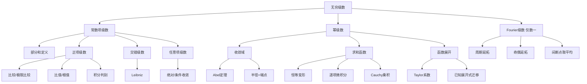

# 高数第16讲 无穷级数

> 来源：`考研数学/27张宇基础30讲高数.pdf`，印刷页409-463 / PDF p414-p468。
>
> 本讲正文含例16.1-例16.39，基础习题含16.1-16.17。已对55页逐页OCR，并查看14张全覆盖联系图和55张高清原页；级数下标、幂次、端点、展开系数及Fourier积分区间均以原页复核结果为准。

## 本讲速览

1. 常数项级数不是“把无穷项直接相加”，而是研究**部分和数列** $S_n$ 是否有有限极限；任何判别法最终都在替你判断 $\{S_n\}$。
2. 判敛散先分类：正项级数优先比较、比值、根值、积分；交错级数先查莱布尼茨；任意项级数先查绝对收敛，再考虑拆项、Taylor主项或正负子级数。
3. 幂级数题固定三步：**求半径 $R$ → 得开区间 → 两端逐点代回原级数**。比值或根值极限不存在时，不代表半径不存在，可拆奇偶项或直接研究一般项。
4. 求和函数与函数展开方向相反：前者由级数找函数，后者由函数找级数；共同工具是已知展开式、恒等变形、逐项求导/积分和Cauchy乘积。
5. “分母含 $n$”常先求导再积分，“分子含 $n$”常先积分再求导；系数递推则把递推翻译为和函数的微分方程。
6. Fourier级数仅数学一要求。先延拓，再算系数；连续点收敛到函数值，间断点收敛到左右极限平均，周期端点同样按两侧极限处理。

## 教材路线

| 教材部分 | 印刷页 / PDF页 | 本讲任务 |
|---|---|---|
| 开篇考纲与知识结构 | 409-410 / p414-p415 | 明确数一、数三范围及整讲知识链 |
| 一、常数项级数的概念与性质 | 411-415 / p416-p420 | 部分和定义、几何级数、四条性质与必要条件 |
| 二、级数敛散性的判别方法 | 415-431 / p420-p436 | 正项、交错、任意项级数及抽象结论 |
| 三、幂级数及其收敛域 | 431-440 / p436-p445 | 函数项级数、Abel定理、半径、端点和抽象变换 |
| 四、幂级数求和函数 | 440-449 / p445-p454 | 运算、恒等变形、逐项微积分、重要展开与求和套路 |
| 五、函数展开成幂级数 | 449-453 / p454-p458 | Taylor/Maclaurin、直接法、间接法和端点成立性 |
| 六、傅里叶级数（仅数一） | 453-456 / p458-p461 | 周期展开、Dirichlet定理、奇偶与半区间展开 |
| 基础习题与解答 | 456-463 / p461-p468 | 练习16.1-16.17及答案反查 |

## 前置知识与关联导航

- 极限、等价无穷小、夹逼与Taylor定阶：[[01_高数第1讲_函数极限与连续|第1讲]]、[[06_高数第6讲_一元函数微分学的应用二#5. 泰勒公式（皮亚诺余项）|第6讲Taylor公式]]。
- 级数的定义依赖数列极限：[[02_高数第2讲_数列极限|第2讲]]。
- 逐项积分、分部积分和三角积分：[[09_高数第9讲_一元函数积分学的计算|第9讲]]。
- 积分判别法需要反常积分：[[08_高数第8讲_一元函数积分学的概念与性质|第8讲]]。
- 系数递推求和、练习16.5和16.16要调用：[[15_高数第15讲_微分方程|第15讲微分方程]]。
- Fourier级数为后续曲线曲面积分之外的独立数一模块；下一讲入口：[[17_高数第17讲_多元函数积分学的预备知识|第17讲]]。

## 知识网络

## 知识点清单

### 一、常数项级数的概念与性质

### 1. 常数项级数定义

#### 1.1 级数、通项与部分和

给定数列 $\{u_n\}$，形式

$$
\sum_{n=1}^{\infty}u_n=u_1+u_2+\cdots+u_n+\cdots
$$

称为常数项无穷级数，$u_n$ 称为通项。真正参与极限的是部分和

$$
S_n=\sum_{k=1}^{n}u_k.
$$

- 若 $\lim_{n\to\infty}S_n=S\in\mathbb R$，级数收敛，和为 $S$。
- 若该有限极限不存在，级数发散，包括趋于无穷和振荡两类。
- 逆向关系：$u_n=S_n-S_{n-1}$（$n\ge2$），连接“项”与“部分和”。

> **直观理解**：$\sum u_n$ 只是记号；“和”是有限和 $S_n$ 的极限，不能直接对无穷项使用有限加法规则。

> **看到什么想到它**：出现 $u_{n+1}-u_n$、相邻对数差或可裂项分式，先写 $S_n$，寻找望远镜消项。例16.1正是用 $\sum(u_{n+1}-u_n)$ 把问题化为 $u_n$ 是否有有限极限。

#### 1.2 几何级数

对 $a\ne0$，

$$
\sum_{n=1}^{\infty}aq^{n-1}
$$

满足

$$
S_n=\frac{a(1-q^n)}{1-q}\quad(q\ne1).
$$

因此

$$
\boxed{
\sum_{n=1}^{\infty}aq^{n-1}
\begin{cases}
\text{收敛，和为 }\dfrac{a}{1-q},&|q|<1,\\
\text{发散},&|q|\ge1.
\end{cases}}
$$

$q=1$ 时部分和线性增长；$q=-1$ 时部分和振荡；$|q|>1$ 时通项本身不趋于0。

#### 1.3 收敛级数的四条基本性质

1. **线性组合**：若 $\sum u_n=A,\sum v_n=B$，则

   $$
   \sum(au_n+bv_n)=aA+bB.
   $$

   逆向不成立：$\sum(u_n+v_n)$ 收敛，不能推出两者各自收敛。

2. **改变有限项**不改变敛散性，但会改变级数的和。
3. **收敛级数加括号**仍收敛且和不变；去括号的逆命题不成立。若加括号后发散，则原级数必发散。
4. **必要条件**：

   $$
   \boxed{\sum u_n\text{ 收敛}\Rightarrow u_n\to0.}
   $$

   逆命题错误，调和级数 $\sum1/n$ 是基本反例。

例16.2体现“只知道偶数部分和趋于 $S$”还不够，必须再有 $u_n\to0$ 才能补出奇数部分和也趋于 $S$。

> **判题语言**：看到“必要”“充分”“等价”先画箭头。$u_n\to0$ 只够用于快速判发散：若极限非0或不存在，则级数必发散。

### 二、级数敛散性的判别方法

### 2. 正项级数

设 $u_n\ge0$，则 $S_n$ 单调不减。因此正项级数只有两种结局：$S_n$ 有上界则收敛；无上界则 $S_n\to+\infty$。

#### 2.1 收敛原则：部分和有界

$$
\boxed{\sum u_n\text{ 收敛}\Longleftrightarrow\{S_n\}\text{ 有上界}.}
$$

例16.3用

$$
\frac1{n!}\le\frac1{n(n-1)}=\frac1{n-1}-\frac1n
$$

给部分和造统一上界，而不是求出精确和。

#### 2.2 比较判别法

若从某项起 $0\le u_n\le v_n$，则：

- $\sum v_n$ 收敛 $\Rightarrow\sum u_n$ 收敛；
- $\sum u_n$ 发散 $\Rightarrow\sum v_n$ 发散。

口诀是“大收敛带小收敛，小发散逼大发散”。比较只需从某项起成立，有限项不影响敛散。

高频母级数：

$$
\sum_{n=1}^{\infty}\frac1{n^p}
\begin{cases}
\text{收敛},&p>1,\\
\text{发散},&p\le1.
\end{cases}
$$

- $p=1$ 为调和级数，可用积分判别或分组证发散。
- 例16.4中 $\ln(1+1/n)$ 的部分和直接望远镜为 $\ln(n+1)$，故发散；也可用 $0<\ln(1+x)<x$ 配合比较。
- 若 $\sum a_n$ 为收敛正项级数，则由 $a_n\to0$ 可得最终 $a_n\le M$，从而 $a_n^2\le Ma_n$；同理其偶项、奇项等子级数都收敛（例16.5）。
- 若 $\sum a_n^2,\sum b_n^2$ 收敛，则

  $$
  |a_nb_n|\le\frac{a_n^2+b_n^2}{2},
  $$

  故 $\sum a_nb_n$ 绝对收敛（练习16.2）。

> **看到什么想到它**：题面给一个正项级数收敛，要求证明新级数收敛，先尝试“最终有界+乘回原项”、平方不等式或抽取子列，不要急着算极限。

#### 2.3 比较判别法的极限形式

对正项 $u_n,v_n$，若

$$
\lim_{n\to\infty}\frac{u_n}{v_n}=A,
$$

则：

| 极限 $A$ | 可得结论 |
|---|---|
| $0<A<\infty$ | 两级数同敛散 |
| $A=0$ | 若 $\sum v_n$ 收敛，则 $\sum u_n$ 收敛 |
| $A=+\infty$ | 若 $\sum v_n$ 发散，则 $\sum u_n$ 发散 |

常用等价：$\sin x\sim x$、$e^x-1\sim x$、$\ln(1+x)\sim x$。含 $\ln n$ 时牢记

$$
\ln n=o(n^\varepsilon)\qquad(\varepsilon>0).
$$

因此 $\sum\ln n/n^\alpha$ 的临界仍由幂指数决定：$\alpha>1$ 收敛，$0<\alpha\le1$ 发散。例16.8、16.9都是“先定一般项阶数，再与 $p$ 级数比较”。

#### 2.4 比值判别法（D'Alembert）

对正项级数，若

$$
\rho=\lim_{n\to\infty}\frac{u_{n+1}}{u_n},
$$

则

$$
\rho<1\Rightarrow\text{收敛},\qquad
\rho>1\Rightarrow\text{发散},\qquad
\rho=1\Rightarrow\text{失效}.
$$

- 适合含阶乘、指数、连乘及 $a_n^n$ 的式子。
- $\rho>1$ 时不仅绝对值级数发散，而且 $u_n\not\to0$，任意项原级数也发散。
- $\rho=1$ 时必须换方法；$\sum1/n$ 与 $\sum1/n^2$ 都给出1，却一散一敛。
- 例16.11在 $a=e$ 时比值极限等于1，教材改用一般项最终递增，推出 $u_n\not\to0$。

#### 2.5 根值判别法（Cauchy）

若

$$
\rho=\lim_{n\to\infty}\sqrt[n]{u_n},
$$

则同样有

$$
\rho<1\Rightarrow\text{收敛},\quad
\rho>1\Rightarrow\text{发散},\quad
\rho=1\Rightarrow\text{失效}.
$$

适合一般项整体被 $n$ 次幂包住。若可直接证明 $\sqrt[n]{u_n}\ge1$，则 $u_n\ge1$，由必要条件立即发散，不必强求极限存在。例16.12把两个正项级数拆开，一个用等价无穷小，一个用根值法。

#### 2.6 积分判别法

若 $f(x)$ 在 $[N,+\infty)$ 上非负、连续、单调减少，且 $u_n=f(n)$，则

$$
\boxed{\sum_{n=N}^{\infty}u_n\text{ 与 }\int_N^{+\infty}f(x)\,dx\text{ 同敛散}.}
$$

最常用结论：

$$
\sum_{n\ge2}\frac1{n^p(\ln n)^q}
\begin{cases}
\text{收敛},&p>1,\\
\text{收敛},&p=1,\ q>1,\\
\text{发散},&p<1\text{ 或 }(p=1,q\le1).
\end{cases}
$$

例16.13中 $\int dx/(x\ln x)=\ln\ln x$ 发散，所以 $\sum1/(n\ln n)$ 发散。

#### 2.7 正项无穷乘积（习题补充）

对 $c_n>0$，无穷乘积 $\prod_{n=1}^{\infty}c_n$ 通过部分积

$$
P_N=\prod_{n=1}^{N}c_n
$$

定义。若讨论收敛到有限正数，则可取对数：

$$
\boxed{\prod c_n\text{ 收敛到正数}\Longleftrightarrow
\sum\ln c_n\text{ 收敛}.}
$$

练习16.10中

$$
\prod_{n=2}^{\infty}2^{\frac{\ln n}{n^\alpha}}
$$

的对数为常数 $\ln2$ 乘 $\sum\ln n/n^\alpha$，故 $\alpha>1$ 时收敛，$0<\alpha\le1$ 时发散。不要把“乘积的一般因子趋于1”误当作充分条件，它与级数的“通项趋于0”一样只具必要性。

### 3. 交错级数

交错级数写作

$$
\sum_{n=1}^{\infty}(-1)^{n-1}u_n,\qquad u_n>0.
$$

莱布尼茨判别法：若从某项起

$$
u_{n+1}\le u_n,\qquad u_n\to0,
$$

则交错级数收敛。

- “单调”只需最终成立，可令 $u_n=f(n)$，用 $f'(x)$ 判最终单调（例16.15）。
- 莱布尼茨是充分条件，不是必要条件。例16.14是标准交错调和级数；教材另给出 $u_n$ 不单调但拆成两个收敛级数后仍收敛的反例。
- 若 $u_n$ 受 $(-1)^n$ 干扰而不单调，先有理化或按奇偶拆项。例16.16拆出一个收敛交错级数和一个调和阶正项级数，最终判原级数发散。
- 交错 $p$ 级数

  $$
  \sum(-1)^{n-1}\frac1{n^p}
  $$

  在 $p>0$ 时收敛；$p>1$ 绝对收敛，$0<p\le1$ 条件收敛，$p\le0$ 发散。

> **看到什么想到它**：看到正负交替，不要立刻写“莱布尼茨”。先确认正项部分最终单调且趋零；若单调难证，考虑连续化求导、Taylor拆主项或拆奇偶项。

### 4. 任意项级数、绝对收敛与条件收敛

定义：

- 若 $\sum|u_n|$ 收敛，则 $\sum u_n$ **绝对收敛**；
- 若 $\sum u_n$ 收敛而 $\sum|u_n|$ 发散，则称**条件收敛**。

核心关系：

$$
\boxed{\text{绝对收敛}\Rightarrow\text{收敛}},
$$

逆命题不成立。交错调和级数是条件收敛的典型。

把 $u_n$ 分解为正部、负部绝对值

$$
v_n=\frac{u_n+|u_n|}{2},\qquad
w_n=\frac{|u_n|-u_n}{2},\qquad
u_n=v_n-w_n,\quad |u_n|=v_n+w_n.
$$

- 绝对收敛时，$\sum v_n,\sum w_n$ 都收敛；
- 条件收敛时，两者都发散，即全部正项之和趋 $+\infty$，全部负项绝对值之和也趋 $+\infty$。

因此条件收敛的交错级数中，奇、偶子级数分别可能发散；不能把“原级数收敛”误当作“任意子级数都收敛”（例16.17）。

#### 4.1 运算规则

1. 两级数都绝对收敛，则 $\sum(u_n\pm v_n)$ 绝对收敛。
2. 一个绝对收敛、一个条件收敛，则其和或差条件收敛。
3. 两个条件收敛级数的和或差一定收敛，但可能绝对收敛，也可能条件收敛。
4. 若 $\sum|nu_n|$ 收敛、$\sum v_n/n$ 收敛，则由 $v_n/n\to0$ 得其有界，故 $\sum u_nv_n$ 绝对收敛（例16.19）。
5. 若 $\sum|u_n|$ 发散，通常不能推出 $\sum u_n$ 发散；但若比值法或根值法给 $\rho>1$，则 $u_n\not\to0$，原级数也发散。

#### 4.2 抽象级数高频真假表

设 $\sum u_n$ 收敛，下列结论要逐条记边界：

| 命题 | 结论 | 理由/反例入口 |
|---|---|---|
| $\sum\lvert u_n\rvert$ | 不确定 | 可能绝对，也可能条件收敛 |
| $\sum u_n^2$ | 不确定 | $(-1)^n/\sqrt n$ 与 $(-1)^n/n$ 可区分 |
| $\sum(-1)^nu_n$ | 不确定 | 乘交错因子可能消掉或制造振荡 |
| $\sum(-1)^nu_n/n$ | 不确定 | 不能只看多了一个 $1/n$ |
| 偶项、奇项子级数 | 不确定 | 交错调和原级数收敛，两个子级数均发散 |
| $\sum(u_{2n-1}+u_{2n})$ | 必收敛 | 是收敛级数按相邻项加括号 |
| $\sum(u_{2n-1}-u_{2n})$ | 不确定 | 改变符号不是加括号 |
| $\sum(u_n+u_{n+1})$ | 必收敛 | 原级数与去首项后的级数相加 |
| $\sum(u_n-u_{n+1})$ | 必收敛 | 望远镜，且 $u_n\to0$ |
| $\sum u_nu_{n+1}$ | 不确定 | 乘积没有一般保持性 |

补充：若 $a,b,c\ne0$ 且 $au_n+bv_n+cw_n=0$，三个级数中任意两个收敛就推出第三个收敛。若 $\sum u_n^2$ 收敛，则

$$
\left|\frac{u_n}{n}\right|\le\frac12\left(u_n^2+\frac1{n^2}\right),
$$

故 $\sum u_n/n$ 绝对收敛。

### 三、幂级数及其收敛域

### 5. 函数项级数与幂级数

函数列 $\{u_n(x)\}$ 的级数

$$
\sum_{n=1}^{\infty}u_n(x)
$$

称函数项级数。固定 $x=x_0$ 后，它变成常数项级数；使其收敛的全部 $x$ 构成**收敛域**。

幂级数的一般形式为

$$
\sum_{n=0}^{\infty}a_n(x-x_0)^n,
$$

$x_0=0$ 时为标准形式 $\sum a_nx^n$。若函数确能在 $x_0$ 展成幂级数，则展开唯一，系数必为

$$
\boxed{a_n=\frac{f^{(n)}(x_0)}{n!}}.
$$

#### 5.1 Abel定理与收敛半径

对 $\sum a_nx^n$：

- 若在 $x=x_1\ne0$ 收敛，则对所有 $|x|<|x_1|$ 绝对收敛；
- 若在 $x=x_2$ 发散，则对所有 $|x|>|x_2|$ 发散。

于是存在 $R\in[0,+\infty]$，使级数在 $|x|<R$ 绝对收敛、在 $|x|>R$ 发散。$R$ 为收敛半径，$(-R,R)$ 为收敛区间；$x=\pm R$ 不由Abel定理决定，必须分别代回原级数。

对中心为 $x_0$ 的级数，改为 $|x-x_0|<R$。

#### 5.2 求收敛半径与收敛域

若连续相邻系数不缺项，且极限存在：

$$
\rho=\lim\left|\frac{a_{n+1}}{a_n}\right|
\quad\text{或}\quad
\rho=\lim\sqrt[n]{|a_n|},
$$

则

$$
\boxed{R=
\begin{cases}
1/\rho,&0<\rho<\infty,\\
+\infty,&\rho=0,\\
0,&\rho=+\infty.
\end{cases}}
$$

完整流程：

1. 求 $R$；中心不是0时先写 $|x-x_0|<R$；
2. 得开区间；
3. 把左右端点分别代回**原级数**，用常数项级数方法判；
4. 最后写收敛域，端点括号不能凭感觉。

对缺项幂级数或一般函数项级数，直接对 $|u_n(x)|$ 用比值/根值判别，先解出绝对收敛区间，再查边界。一般函数项级数的收敛域未必关于某点对称，也未必存在“收敛半径”（例16.25）。

> **重要反例**：$\lim|a_{n+1}/a_n|$ 或 $\lim\sqrt[n]{|a_n|}$ 不存在，只说明这两个快捷公式失效，不说明 $R$ 不存在。系数按奇偶周期变化时，拆成奇、偶幂级数，各求半径后取较小者（练习16.12）。

#### 5.3 抽象幂级数的半径推断

对 $\sum a_n(x-x_0)^n$：

- 在 $x_1$ 收敛：$R\ge|x_1-x_0|$；若条件收敛，则 $R=|x_1-x_0|$。
- 在 $x_2$ 发散：$R\le|x_2-x_0|$。
- 在收敛区间内部一定绝对收敛。
- 平移中心、提取或乘以 $(x-x_0)^k$，收敛半径不变；逐项求导半径不变但收敛域可能缩小；逐项积分半径不变但收敛域可能扩大。

例16.26由“在某点条件收敛”先锁死半径，再平移、求导、乘因子，把所问点送回新收敛区间内部，从而判绝对收敛。

#### 5.4 拆分与交集

若函数项能拆成两部分，分别求收敛域后取交集。两幂级数相加时至少在 $|x|<\min(R_1,R_2)$ 内可逐项相加；相消可能使化简后的实际半径变大，不能机械写成恒等于最小半径。例16.27中两部分半径分别为1和2，原级数收敛域取交集 $[-1,1)$。

### 四、幂级数求和函数

### 6. 和函数、运算与恒等变形

在收敛域内

$$
S(x)=\sum_{n=0}^{\infty}a_nx^n
$$

称为幂级数的和函数。

#### 6.1 代数运算

在共同收敛区间内：

$$
k\sum a_nx^n=\sum ka_nx^n,
$$

$$
\sum a_nx^n\pm\sum b_nx^n=\sum(a_n\pm b_n)x^n,
$$

$$
\left(\sum a_nx^n\right)\left(\sum b_nx^n\right)
=\sum_{n=0}^{\infty}\left(\sum_{k=0}^{n}a_kb_{n-k}\right)x^n.
$$

最后一个是Cauchy乘积。看到系数 $1+1/2+\cdots+1/n$ 这类前缀和，要尝试把它识别为卷积；例16.28由此得到

$$
\sum_{n=1}^{\infty}\left(1+\frac12+\cdots+\frac1n\right)x^n
=\frac{-\ln(1-x)}{1-x}.
$$

#### 6.2 三种恒等变形

1. **通项和下标一起变**：令 $m=n+l$，幂次和系数下标必须同步替换。
2. **只改下标，不改通项**：先把漏掉的有限项写出，再从新下标起求和。
3. **只改幂次，不改下标**：提取 $x^k$，例如

   $$
   \sum_{n=1}^{\infty}a_nx^n=x\sum_{n=1}^{\infty}a_nx^{n-1}.
   $$

合并级数前必须让幂次与下标的对应关系一致；最常见错误是“只换 $n$，忘了换 $x^n$”。

#### 6.3 连续、逐项积分和逐项求导

若收敛半径为 $R$，则：

$$
S'(x)=\sum_{n=1}^{\infty}na_nx^{n-1},\qquad |x|<R,
$$

$$
\int_0^xS(t)dt=\sum_{n=0}^{\infty}\frac{a_n}{n+1}x^{n+1}.
$$

- 和函数在 $(-R,R)$ 内连续、可导且可积。
- 逐项求导、积分所得幂级数的收敛半径仍为 $R$。
- 求导后端点可能丢失，积分后端点可能增加；收敛域必须重判。
- 若原级数在右端点 $R$ 收敛，则 $S(x)$ 在 $x=R$ 左连续；左端点同理右连续。端点代值求数项和时要同时满足“端点级数收敛+对应函数单侧连续”。

### 7. 重要幂级数展开式

下列式子既用于求和，也用于间接展开。条件与端点不能省：

$$
e^x=\sum_{n=0}^{\infty}\frac{x^n}{n!},\qquad x\in\mathbb R;
$$

$$
\frac1{1-x}=\sum_{n=0}^{\infty}x^n,\qquad |x|<1;
$$

$$
\frac1{1+x}=\sum_{n=0}^{\infty}(-1)^nx^n,\qquad |x|<1;
$$

$$
\ln(1+x)=\sum_{n=1}^{\infty}(-1)^{n-1}\frac{x^n}{n},\qquad -1<x\le1;
$$

$$
-\ln(1-x)=\sum_{n=1}^{\infty}\frac{x^n}{n},\qquad -1\le x<1;
$$

$$
\sin x=\sum_{n=0}^{\infty}(-1)^n\frac{x^{2n+1}}{(2n+1)!},\qquad x\in\mathbb R;
$$

$$
\cos x=\sum_{n=0}^{\infty}(-1)^n\frac{x^{2n}}{(2n)!},\qquad x\in\mathbb R;
$$

$$
\arctan x=\sum_{n=0}^{\infty}(-1)^n\frac{x^{2n+1}}{2n+1},\qquad -1\le x\le1.
$$

广义二项式：

$$
(1+x)^\alpha
=1+\alpha x+\frac{\alpha(\alpha-1)}{2!}x^2+\cdots
+\frac{\alpha(\alpha-1)\cdots(\alpha-n+1)}{n!}x^n+\cdots
$$

其开区间总为 $|x|<1$，端点随 $\alpha$ 变化：

| $\alpha$ | 收敛域 |
|---|---|
| $\alpha\le-1$ | $(-1,1)$ |
| $-1<\alpha<0$ | $(-1,1]$ |
| $\alpha>0$ 且非自然数 | $[-1,1]$ |
| $\alpha\in\mathbb N$ | 有限多项式，对全部实数成立 |

特殊式：

$$
\frac1{\sqrt{1+x}}
=1-\frac12x+\frac{1\cdot3}{2\cdot4}x^2
-\frac{1\cdot3\cdot5}{2\cdot4\cdot6}x^3+\cdots,\qquad |x|<1.
$$

教材还把偶、奇阶指数项分别归纳为

$$
\frac{e^x+e^{-x}}2=\sum_{n=0}^{\infty}\frac{x^{2n}}{(2n)!},
\qquad
\frac{e^x-e^{-x}}2=\sum_{n=0}^{\infty}\frac{x^{2n+1}}{(2n+1)!}.
$$

### 8. 求和函数的方法链

#### 8.1 先求导还是先积分

- 系数在**分母**，如 $1/n,1/(2n+1)$：先对级数求导消去分母，再积分还原。
- 系数在**分子**，如 $n,n^2$：先把幂次整理后积分降阶，再求导还原；等价地，可从几何级数连续求导。
- 先求导再积分时，必须补 $S(x_0)$；中心为0通常用 $S(0)$。
- 全程先确定开区间，最后再查端点。

两条母公式：

$$
\sum_{n=1}^{\infty}\frac{x^n}{n}=-\ln(1-x),\qquad -1\le x<1,
$$

$$
\sum_{n=1}^{\infty}nx^n=\frac{x}{(1-x)^2},\qquad |x|<1.
$$

连续求导得

$$
\sum_{n=2}^{\infty}n(n-1)x^{n-2}=\frac2{(1-x)^3},
$$

$$
\sum_{n=3}^{\infty}n(n-1)(n-2)x^{n-3}=\frac6{(1-x)^4}.
$$

多项式 $an^3+bn^2+cn+d$ 应改写成下降阶乘

$$
A n(n-1)(n-2)+B n(n-1)+C n+D,
$$

再套上述公式；练习16.14就是这一入口。

#### 8.2 系数递推变微分方程

若给出 $a_{n+1}$ 与 $a_n$ 的递推，令 $S(x)=\sum a_nx^n$：

1. 对 $S$ 求导，使 $na_n$ 或 $(n+1)a_{n+1}$ 出现；
2. 调整下标并代入递推；
3. 得到关于 $S,S'$ 的微分方程；
4. 用 $S(0)=a_0$ 定常数。

例16.33由递推得到一阶线性方程，最终

$$
S(x)=2\left(\frac1{\sqrt{1-x}}-1\right),\qquad |x|<1.
$$

#### 8.3 拆分、卷积与“包装函数”

- 前缀和系数：想Cauchy乘积（例16.28）。
- 系数可拆两部分：分别求和后相减（练习16.13）。
- 有理函数：先部分分式，再套几何展开，取各展开区间交集（练习16.15）。
- 含 $(2n-1)!$、$2^{2n}$ 和交错符号：尝试识别 $\sin x$ 或 $\cos x$ 的缩放包装（练习16.17）。
- 积分序列：先用换元或递推把 $a_n/b_n$ 化简，再把剩余数项级数放入和函数（例16.34）。

例16.34调用的Wallis递推（也常称点火公式）应完整记为：令

$$
I_n=\int_0^{\pi/2}\sin^n x\,dx,
$$

则

$$
\boxed{I_n=\frac{n-1}{n}I_{n-2}\quad(n\ge2)},
\qquad I_0=\frac\pi2,\quad I_1=1.
$$

从而

$$
I_{2m}=\frac{(2m-1)!!}{(2m)!!}\frac\pi2,
\qquad
I_{2m+1}=\frac{(2m)!!}{(2m+1)!!}.
$$

看到 $\int_0^{\pi/2}\sin^n x\,dx$ 或 $\cos^n x$，应立即按奇偶降两阶；例16.34正是用 $b_{n+2}/b_n=(n+1)/(n+2)$ 把积分比值化成有理系数。

### 五、函数展开成幂级数

### 8. 泰勒公式与麦克劳林公式

若 $f$ 在 $x_0$ 附近可展开为幂级数，则唯一展开为Taylor级数

$$
f(x)=\sum_{n=0}^{\infty}\frac{f^{(n)}(x_0)}{n!}(x-x_0)^n.
$$

$x_0=0$ 时称Maclaurin级数：

$$
f(x)=\sum_{n=0}^{\infty}\frac{f^{(n)}(0)}{n!}x^n.
$$

“各阶导数存在”只保证能形式地写出Taylor级数，不自动保证它等于 $f$。充要条件是Taylor余项在相应区间趋于0：

$$
\boxed{f(x)=\sum_{n=0}^{\infty}\frac{f^{(n)}(x_0)}{n!}(x-x_0)^n
\Longleftrightarrow R_n(x)\to0.}
$$

#### 8.1 直接法

逐阶计算 $f^{(n)}(x_0)$，代入系数公式。适合导数循环、规律明显或题目直接问高阶导数的函数；缺点是计算量大。

#### 8.2 间接法

从 [[16_高数第16讲_无穷级数#7. 重要幂级数展开式|重要展开式]] 出发，用：

1. 变量替换，如 $x\mapsto ax^m$；
2. 四则运算与部分分式；
3. 逐项求导、逐项积分；
4. 待定系数或微分方程。

每次替换后都要同步更新收敛区间，端点再查。

> **看到什么想到它**：
> - $\ln(1-x+x^2)$：先做代数恒等变形，例16.36用 $1+x^3=(1+x)(1-x+x^2)$ 拆成两个熟悉对数。
> - 复杂反三角复合：先求导，若导数化成几何型再逐项积分，常数由 $f(0)$ 定（例16.37）。
> - 只问等价无穷小或极限：只保留首个非零项，不必展开到底（例16.35）。

#### 8.3 展开式端点能否代表原函数

逐项微积分得到的新级数在开区间内成立；若想把端点并入，还需：

1. 端点处数项级数收敛；
2. 原函数在该端点有对应单侧连续性；
3. 原函数本身在端点有定义。

例16.37在 $x=1$ 虽然级数收敛，但原复合函数无定义，不能把成立域扩到1；在 $x=-1$，函数右连续且端点级数收敛，故可并入。

### 六、傅里叶级数（仅数学一）

### 9. 周期为 $2l$ 的傅里叶级数

设 $f$ 以 $2l$ 为周期且在 $[-l,l]$ 可积，则系数为

$$
a_n=\frac1l\int_{-l}^{l}f(x)\cos\frac{n\pi x}{l}\,dx
\quad(n=0,1,2,\ldots),
$$

$$
b_n=\frac1l\int_{-l}^{l}f(x)\sin\frac{n\pi x}{l}\,dx
\quad(n=1,2,\ldots),
$$

形式展开为

$$
f(x)\sim\frac{a_0}{2}+\sum_{n=1}^{\infty}
\left(a_n\cos\frac{n\pi x}{l}+b_n\sin\frac{n\pi x}{l}\right).
$$

$\sim$ 表示Fourier展开，不应在尚未核对收敛点时直接写等号。

#### 9.1 Dirichlet收敛定理

若一个周期内分段光滑（有限个第一类间断点、有限个极值点），则Fourier级数和函数 $S(x)$ 满足

$$
\boxed{S(x)=\frac{f(x-0)+f(x+0)}2.}
$$

- 连续点：$S(x)=f(x)$。
- 跳跃间断点：取左右极限平均，不取题目给的单点值。
- 周期端点 $x=\pm l$：两侧来自周期延拓，故取 $[f(-l+)+f(l-)]/2$。

#### 9.2 奇偶性简化

- $f$ 为奇函数：$a_0=a_n=0$，只剩正弦级数

  $$
  b_n=\frac2l\int_0^lf(x)\sin\frac{n\pi x}{l}\,dx.
  $$

- $f$ 为偶函数：$b_n=0$，只剩余弦级数

  $$
  a_n=\frac2l\int_0^lf(x)\cos\frac{n\pi x}{l}\,dx.
  $$

算系数前先判“函数奇偶 × 三角函数奇偶”，可直接消掉一半积分。

#### 9.3 只定义在 $[0,l]$ 的半区间展开

- 要正弦级数：先作奇延拓到 $[-l,l]$，再作 $2l$ 周期延拓；
- 要余弦级数：先作偶延拓，再作周期延拓。

题目问区间外的 $S(x)$ 时，必须按“奇/偶延拓 → 周期折回 → 连续或间断点取值”三步走。例16.38先把 $-5/2$ 按周期2折回，再在折回后的跳点取平均，得 $3/4$。

例16.39把 $1-x^2$ 在 $[0,\pi]$ 作偶延拓，算出余弦系数，再令 $x=0$ 得

$$
\sum_{n=1}^{\infty}\frac{(-1)^{n+1}}{n^2}=\frac{\pi^2}{12}.
$$

## 公式与二级结论索引

| 结论 | 条件与边界 | 详细位置 |
|---|---|---|
| $\sum u_n$ 收敛 $\Leftrightarrow S_n$ 有有限极限 | 定义，不是判别技巧 | [[16_高数第16讲_无穷级数#1. 常数项级数定义\|级数定义]] |
| $u_n\to0$ | 仅必要，不充分 | [[16_高数第16讲_无穷级数#1.3 收敛级数的四条基本性质\|基本性质]] |
| 几何级数和 $a/(1-q)$ | 仅 $\lvert q\rvert<1$ | [[16_高数第16讲_无穷级数#1.2 几何级数\|几何级数]] |
| $p$ 级数 | $p>1$ 收敛，$p\le1$ 发散 | [[16_高数第16讲_无穷级数#2.2 比较判别法\|比较判别]] |
| 比值/根值判别 | $\rho=1$ 时均失效 | [[16_高数第16讲_无穷级数#2.4 比值判别法（D'Alembert）\|比值]]、[[16_高数第16讲_无穷级数#2.5 根值判别法（Cauchy）\|根值]] |
| $\sum1/[n^p(\ln n)^q]$ | $p>1$ 或 $p=1,q>1$ 收敛 | [[16_高数第16讲_无穷级数#2.6 积分判别法\|积分判别]] |
| 莱布尼茨判别 | 最终单调趋0；仅充分 | [[16_高数第16讲_无穷级数#3. 交错级数\|交错级数]] |
| 绝对收敛 $\Rightarrow$ 收敛 | 逆命题错误 | [[16_高数第16讲_无穷级数#4. 任意项级数、绝对收敛与条件收敛\|任意项级数]] |
| $R=1/\rho$ | 系数比值/根值极限存在时 | [[16_高数第16讲_无穷级数#5.2 求收敛半径与收敛域\|收敛半径]] |
| 逐项微积分半径不变 | 端点必须重判 | [[16_高数第16讲_无穷级数#6.3 连续、逐项积分和逐项求导\|幂级数性质]] |
| $\sum x^n/n=-\ln(1-x)$ | $-1\le x<1$ | [[16_高数第16讲_无穷级数#8.1 先求导还是先积分\|求和母式]] |
| $\sum nx^n=x/(1-x)^2$ | $\lvert x\rvert<1$ | [[16_高数第16讲_无穷级数#8.1 先求导还是先积分\|求和母式]] |
| Taylor系数 $f^{(n)}(x_0)/n!$ | 等于原函数还需余项趋0 | [[16_高数第16讲_无穷级数#8. 泰勒公式与麦克劳林公式\|Taylor展开]] |
| Fourier和为左右极限平均 | 先按规定延拓 | [[16_高数第16讲_无穷级数#9.1 Dirichlet收敛定理\|Dirichlet定理]] |

## 题型-方法决策表

| 题面信号 | 首选方法 | 备选方法 | 最后检查 |
|---|---|---|---|
| $u_{n+1}-u_n$、对数差、分式裂项 | 写部分和望远镜 | 转乘积后取对数 | 极限必须有限 |
| 正项且像 $n^{-p}$、$\ln n/n^p$ | 极限比较 | 直接比较、积分判别 | 临界指数是否等于1 |
| 阶乘、指数连乘 | 比值判别 | Stirling/必要条件 | 比值等于1时换方法 |
| 一般项整体 $n$ 次幂 | 根值判别 | 取对数、拆项 | 根值等于1时换方法 |
| 正负交替 | 莱布尼茨 | Taylor拆项、奇偶拆项 | 最终单调且趋0 |
| 任意符号且绝对值易判 | 先判 $\sum\lvert u_n\rvert$ | 正负部拆分 | 绝对/条件措辞 |
| 含参数并要求收敛 | 先用 $u_n\to0$ 消主项 | 再比较/莱布尼茨 | 等号临界点单查 |
| 幂级数求域 | 半径→开区间→两端 | 缺项则对一般项判 | 端点代回原式 |
| 系数奇偶周期变化 | 拆奇偶子级数 | 直接对一般项根值上极限 | 取较小半径并查端点 |
| 求和且分母有 $n$ | 先导后积 | 套 $-\ln(1-x)$ | 补积分常数 |
| 求和且分子有 $n$ | 先积后导/几何级数求导 | 下降阶乘分解 | 幂次与下标对齐 |
| 系数给递推 | 建 $S(x)$ 的微分方程 | 先求显式 $a_n$ | 用 $S(0)$ 定常数 |
| 函数展开 | 从熟悉展开式间接变形 | 直接求高阶导 | 区间和端点 |
| 复杂复合函数 | 先求导化简单 | 代数恒等变形 | 积分后加 $f(0)$ |
| Fourier区间外点值 | 延拓并按周期折回 | 直接算系数 | 跳点取左右平均 |

## 教材例题覆盖表

| 例题 | 一句话方法与迁移 |
|---|---|
| 16.1 | 裂项为 $u_{n+1}-u_n$ 时写部分和；级数收敛等价于 $u_n$ 有有限极限。 |
| 16.2 | 已知偶数部分和有极限时，用 $S_{2n+1}=S_{2n}+u_{2n+1}$ 和 $u_n\to0$ 补齐全体部分和。 |
| 16.3 | 正项部分和难精确求时，给每项造可裂项上界，证明部分和有界。 |
| 16.4 | $\ln(1+1/n)$ 可直接写成相邻对数差；比较法之外，部分和望远镜更直接。 |
| 16.5 | 收敛正项级数满足 $a_n\to0$，故最终有界，再用 $a_n^2\le Ma_n$。 |
| 16.6 | 单调比较与 $u_nv_n\le(u_n^2+v_n^2)/2$ 可把乘积级数送回已知收敛级数。 |
| 16.7 | 隐式定义的正根无需解出；给方程代入试探值，夹出 $x_n<1/n$ 后比较。 |
| 16.8 | 先用 $\sin t\sim t$，再用 $\ln n=o(n^\varepsilon)$ 确定临界指数。 |
| 16.9 | $e^t-1\sim t$ 把一般项化成 $p$ 级数阶，原级数收敛可反推参数。 |
| 16.10 | 由已知级数先推数列极限，再求新旧一般项比值；抽象题也可用极限比较。 |
| 16.11 | 含 $a^nn!/n^n$ 用比值法；临界 $a=e$ 时改查单调性和通项是否趋0。 |
| 16.12 | 外层整体 $n$ 次幂优先根值；和式可拆为两个正项级数分别判断。 |
| 16.13 | $1/(n\ln n)$ 用积分判别，原函数 $\ln\ln x$ 无界。 |
| 16.14 | 标准交错调和级数满足莱布尼茨，但绝对值级数发散，故条件收敛。 |
| 16.15 | 交错正项部分单调难看时令 $u_n=f(n)$，以 $f'(x)$ 证明最终单调。 |
| 16.16 | $(-1)^n$ 混入分母破坏单调时先有理化，再拆成交错部分和正项部分。 |
| 16.17 | 条件收敛交错级数的正项、负项子级数均发散，据此判断线性组合。 |
| 16.18 | 有界三角因子乘正项裂项，先取绝对值并放缩，可直接证绝对收敛。 |
| 16.19 | 从一个收敛级数的必要条件得到乘子有界，再与绝对可和项比较。 |
| 16.20 | 抽象级数真假题逐项用性质或反例；只有能写成收敛级数线性组合的结论稳固。 |
| 16.21 | 先有理化确定 $a_n\sim1/(2n^{p+1/2})$，再分绝对、条件、发散三个参数区间。 |
| 16.22 | 系数为调和数时用 $1<a_n<n$ 夹出 $\sqrt[n]{a_n}\to1$，故半径为1。 |
| 16.23 | 只有偶次幂时直接对一般项作比值，再把 $x=\pm1$ 分别代回。 |
| 16.24 | 逐项积分保持半径但可能增加端点；收敛域不能照抄原级数。 |
| 16.25 | 一般函数项级数对绝对值作比值判别，其收敛域未必关于某点对称。 |
| 16.26 | 条件收敛点先锁定半径；平移、求导、乘幂因子后把目标点送入区间内部。 |
| 16.27 | 能拆则分别求收敛域再取交集，端点也按各自原式判断。 |
| 16.28 | 前缀和系数识别为Cauchy卷积，得到 $-\ln(1-x)/(1-x)$。 |
| 16.29 | 先解微分方程，再算积分定义的 $a_n$，最后化成几何级数求和。 |
| 16.30 | 分母含 $n$：逐项求导消去 $n$，积分还原并由 $S(0)$ 补常数。 |
| 16.31 | 分子含 $n$：把目标化为简单幂级数，先积分降阶再求导还原。 |
| 16.32 | 奇次幂且分母 $2n-1$：先提一个 $x$，求导后识别 $1/(1+x^2)$。 |
| 16.33 | 系数递推翻译成 $S,S'$ 的一阶线性微分方程，再用 $S(0)$ 定常数。 |
| 16.34 | 三角换元把两个积分序列连接，用Wallis递推化简比值，再借和函数求数项和。 |
| 16.35 | 只比较等价无穷小时保留首个非零项；变上限积分会把阶数再提高一阶。 |
| 16.36 | 用 $1+x^3=(1+x)(1-x+x^2)$ 把陌生对数拆成两个熟悉对数展开。 |
| 16.37 | 复杂反正切复合先求导化为 $1/(1+x^2)$，积分后用 $f(0)$ 定常数并核端点。 |
| 16.38 | 半区间余弦式意味着偶延拓；周期折回目标点后，跳点取左右极限平均。 |
| 16.39 | 对 $1-x^2$ 作偶延拓并算余弦系数，选 $x=0$ 反求交错平方倒数和。 |

## 讲末练习反查

| 练习 | 只看笔记应能定位的规则 |
|---|---|
| 16.1 | 加括号、去有限项、比值大于1、线性组合的箭头方向与反例。 |
| 16.2 | $\lvert a_nb_n\rvert\le(a_n^2+b_n^2)/2$ 推乘积绝对收敛。 |
| 16.3 | 收敛正项级数的子级数收敛，再用 $n\sin(\lambda/n)\to\lambda$ 作极限比较。 |
| 16.4 | 展开一般项，先由必要条件令 $1/n$ 主项系数为0。 |
| 16.5 | 由微分方程求 $y'(0),y''(0)$，Taylor到 $1/n^2$ 阶，不必解出 $y$。 |
| 16.6 | 中心1、半径3、两个端点均不满足必要条件，收敛域为 $(-2,4)$。 |
| 16.7 | 周期端点取 $[f(-\pi+)+f(\pi-)]/2=(\pi^2-5)/2$。 |
| 16.8 | 先用奇偶性化简 $b_3$ 积分，结果 $2\pi/3$。 |
| 16.9 | 单调正项列极限存在；交错级数发散反推极限非0，再与几何级数比较。 |
| 16.10 | 无穷乘积取对数，化为 $\sum\ln n/n^\alpha$；$\alpha>1$ 收敛。 |
| 16.11 | $\ln(1+(-1)^n/\sqrt n)$ 要展开到 $1/n$，交错首项不能抵消负调和主项，原级数发散。 |
| 16.12 | 相邻比值和根值极限不存在时拆奇偶项；$R=1/4$ 且两端都发散。 |
| 16.13 | 拆和函数；对 $1/(2n+1)$ 先乘 $x$ 再逐项微积分，并单列 $x=0$。 |
| 16.14 | 把 $n^2-n+1$ 写成 $n(n-1)+1$，套几何级数二阶导，和为 $22/27$。 |
| 16.15 | 部分分式后套两个几何展开，取区间交集 $(-1,1)$。 |
| 16.16 | 先解 $f''-f'-2f=0$，再比较指数级数系数，$a_n=[(-1)^{n+1}+2^n]/3$。 |
| 16.17 | 识别原和函数为 $2\sin(x/2)$，再用和角公式改写成关于 $x-1$ 的幂级数。 |

## 易错点/易混点

1. $u_n\to0$ 不是收敛判据，只是必要条件。
2. 加括号保持收敛，去括号不保持；改变有限项不改敛散，但会改和。
3. 正项级数比较法方向不可反：“大收敛、小发散”才有传递力。
4. 极限比较只有 $0<A<\infty$ 才能直接说同敛散；$A=0,+\infty$ 各只有一个方向。
5. 比值法、根值法得到1时是“无法判断”，不是“发散”。
6. 交错外形不等于莱布尼茨条件满足；单调性可以只要求最终成立。
7. 条件收敛级数的正项子级数和负项绝对值子级数都发散。
8. $\sum|u_n|$ 发散不能直接推出 $\sum u_n$ 发散。
9. 原级数收敛不保证偶项、奇项子级数分别收敛。
10. 幂级数的收敛区间通常指开区间，收敛域才包含端点信息。
11. 中心在 $x_0$ 时写 $|x-x_0|<R$，不能仍写 $|x|<R$。
12. 缺项幂级数不要硬套 $a_{n+1}/a_n$；对完整一般项判，或换元为 $t=x^m$。
13. 系数比值/根值极限不存在，不代表收敛半径不存在。
14. 逐项求导、积分保持半径，不保证保持端点。
15. 求和函数积分还原时漏掉 $S(x_0)$，会得到少一个常数的错误答案。
16. 换下标时系数下标与幂次必须同步；只改一个会造成错位。
17. Taylor级数形式存在不代表等于原函数，还需余项趋0。
18. 展开复合函数后要重新写收敛区间，端点不能照搬母公式。
19. Fourier级数在跳点取左右极限平均，不一定取 $f(x)$。
20. 半区间正弦/余弦展开先做奇/偶延拓；问区间外点值还要再作周期延拓。

## 注解：把知识点变成做题入口

- **先判项的量级，再判级数**：很多复杂三角、指数、对数项，真正考的是首个非零主项。先Taylor或等价无穷小，再匹配 $p$ 级数。
- **参数题先用必要条件消最高风险项**：若一般项含 $c/n+d/n^2+o(n^{-2})$，收敛先要求 $c=0$，再看剩余 $1/n^2$ 或交错部分。
- **抽象题先问“题设究竟给了什么强度”**：收敛、绝对收敛、正项收敛、条件收敛能推出的结论差别很大。
- **幂级数先画数轴**：标中心、左右端点和开区间，再在端点旁写代回后的常数项级数，括号最不容易错。
- **求和题先把复杂系数变简单**：分母 $n$ 用导数消，分子 $n$ 用积分降，递推用微分方程，前缀和用卷积，多项式用下降阶乘。
- **展开题先找母函数**：$1/(1-x)$、$\ln(1+x)$、$e^x$、$\sin x$、$\cos x$ 是五个主要源头；代换、求导、积分、四则运算把目标拉回它们。
- **Fourier题先处理函数，不先处理积分**：先确定周期和奇偶延拓后的图像，才能判断系数简化与目标点属于连续点还是跳点。

## 速背检查

1. **级数收敛的定义？** 部分和数列 $S_n$ 有有限极限。
2. **$u_n\to0$ 能否推出收敛？** 不能；调和级数反例。
3. **正项级数为何只需查部分和有上界？** 部分和单调不减。
4. **比较法口诀？** 大收敛带小收敛，小发散逼大发散。
5. **比值、根值判别何时失效？** 判别极限等于1。
6. **$\sum1/[n^p(\ln n)^q]$ 何时收敛？** $p>1$，或 $p=1,q>1$。
7. **莱布尼茨两条件？** 正项部分最终单调不增且趋于0。
8. **绝对收敛与条件收敛区别？** 前者 $\sum|u_n|$ 收敛；后者原级数收敛但绝对值级数发散。
9. **条件收敛的正、负子级数怎样？** 两者都发散。
10. **幂级数收敛域三步？** 求半径、写开区间、两端代回原级数。
11. **比值极限不存在怎么办？** 不等于无半径；拆奇偶项、缺项换元或直接判一般项。
12. **逐项求导/积分对半径和端点的影响？** 半径不变；求导可能丢端点，积分可能加端点。
13. **分母含 $n$ 的和函数首选？** 先求导，再积分并补中心值。
14. **分子含 $n$ 的和函数首选？** 先积分再求导，或从几何级数连续求导。
15. **系数递推怎样求和？** 对 $S(x)$ 求导并代递推，建立微分方程。
16. **函数能否等于其Taylor级数的判断？** Taylor余项趋于0。
17. **复杂函数间接展开四工具？** 代换、四则运算、逐项求导、逐项积分。
18. **Fourier级数在跳点收敛到哪里？** 左右极限平均。
19. **奇函数/偶函数的Fourier展开分别剩什么？** 奇函数只剩正弦项；偶函数只剩余弦项。
20. **半区间正弦/余弦展开分别怎样延拓？** 正弦作奇延拓，余弦作偶延拓，再周期延拓。

## OCR/视觉核查

- 全讲PDF p414-p468共55页已逐页OCR，正文、习题与答案页全部纳入。
- 已查看14张四页联系图，覆盖55页；另逐页查看55张高清原页，不以OCR结果直接录入数学公式。
- 已核对例16.1-16.39和练习16.1-16.17；练习独有的无限乘积、周期系数拆奇偶、ODE反求系数和换中心展开已吸收进正文。
- 高清复核重点：$p,q$ 临界条件、幂级数端点、广义二项式收敛域、Taylor正负号、Wallis递推、Fourier系数与周期端点。

## 相关链接

- 上一讲：[[15_高数第15讲_微分方程|第15讲 微分方程]]
- 下一讲：[[17_高数第17讲_多元函数积分学的预备知识|第17讲 多元函数积分学的预备知识]]
- 全书路线：[[00_目录与进度|目录与进度]]
- 方法网络：[[00_知识链路图|知识链路图]]
- 公式与题型总索引：[[00_定理公式方法题型易错真题索引|定理公式方法题型易错真题索引]]
