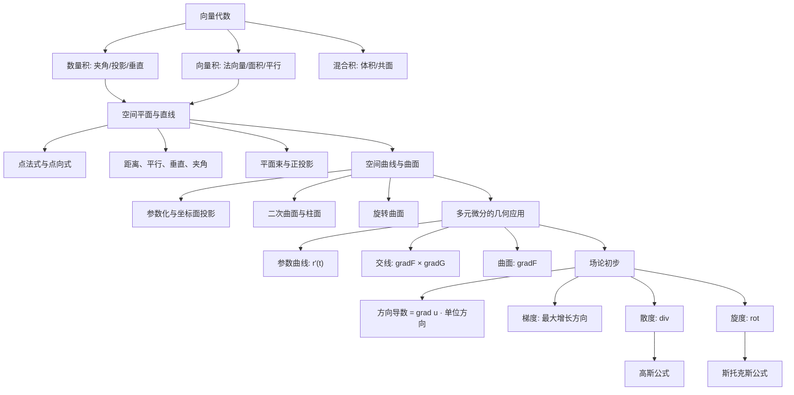

# 高数第17讲 多元函数积分学的预备知识

> [!info] 教材与复核范围
> 来源：27张宇基础30讲高数.pdf，印刷页 464-487 / PDF p469-p492，共24页。
> 本讲已逐页 OCR（1133行文字骨架），阅读6张全页联系图并逐页查看全部24张高清原页；例17.1-17.13、练习17.1-17.10及答案均已逐题反查。数学公式、图形和符号以高清原页为准。

## 本讲速览

- 本讲是多元积分的空间语言准备：先用向量描述方向，再用线、面、曲线、曲面描述积分对象。
- 空间解析几何题的中心不是背方程，而是识别两类向量：直线的方向向量 $\boldsymbol{\tau}$、平面或曲面的法向量 $\boldsymbol n$。
- 曲线求切线就是找切向量；曲面求切平面就是找法向量。参数曲线用 $\boldsymbol r'(t)$，隐式曲面用 $\nabla F$，两曲面交线用 $\nabla F\times\nabla G$。
- 方向导数回答“沿指定方向变化多快”，梯度回答“增长最快的方向和速率”；两者由点积统一。
- 散度和旋度分别刻画向量场的源汇强度与局部旋转强度，是下一讲高斯公式、斯托克斯公式的语言基础。
- 做题总入口：先把题目中的点、方向、法向量、约束方程写出来，再选点积、叉积、梯度或消元。

## 教材路线

| 教材顺序 | 内容 | 印刷页 / PDF页 | 复习任务 |
|---|---|---|---|
| 开篇 | 考题、目标、知识结构图 | 464-465 / p469-p470 | 建立“向量-线面-曲线曲面-微分几何-场论”主线 |
| 一 | 向量代数 | 466-467 / p471-p472 | 数量积、向量积、混合积、方向余弦 |
| 二 | 空间平面与直线 | 468-471 / p473-p476 | 方程、平面束、距离、位置关系、夹角 |
| 三 | 空间曲线与曲面 | 472-476 / p477-p481 | 参数化、投影、二次曲面、柱面、旋转曲面 |
| 四 | 多元函数微分学的几何应用 | 477-479 / p482-p484 | 曲线切线与法平面、曲面切平面与法线 |
| 五 | 场论初步 | 479-483 / p484-p488 | 方向导数、梯度、散度、旋度 |
| 练习 | 基础习题与答案 | 484-487 / p489-p492 | 10类基础题反查 |

## 前置知识与关联导航

- 多元函数的极限、偏导、可微与隐函数：[[13_高数第13讲_多元函数微分学#5. 可微与全微分|可微与全微分]]、[[13_高数第13讲_多元函数微分学#11. 二元隐函数求导|二元隐函数求导]]。
- 平面区域、极坐标和坐标变换：[[14_高数第14讲_二重积分#10. 极坐标变换|极坐标变换]]。
- 上一讲：[[16_高数第16讲_无穷级数|无穷级数]]。
- 本讲内容将在下一讲用于曲线积分、曲面积分、三重积分与三大公式：[[18_高数第18讲_多元函数积分学|多元函数积分学]]。

## 知识网络

## 知识点清单

### 一、向量代数

### 1. 向量及其表示形式

既有大小又有方向的量称为向量。空间向量写成

$$
\boldsymbol a=(a_x,a_y,a_z)
=a_x\boldsymbol i+a_y\boldsymbol j+a_z\boldsymbol k,
\qquad
|\boldsymbol a|=\sqrt{a_x^2+a_y^2+a_z^2}.
$$

两个向量只要大小相等、方向相同就相等，与在空间中的起点无关，这就是向量的自由性。

非零向量的单位向量为

$$
\boldsymbol a^0=\frac{\boldsymbol a}{|\boldsymbol a|}.
$$

由 $A(x_1,y_1,z_1)$ 指向 $B(x_2,y_2,z_2)$：

$$
\overrightarrow{AB}=(x_2-x_1,y_2-y_1,z_2-z_1).
$$

> [!tip] 看到什么想到它
> 出现“从 $A$ 指向 $B$”时一定用终点减起点；出现“沿向量 $\boldsymbol a$”时先检查它是否为单位向量。

### 2. 数量积、向量积与混合积

#### 2.1 数量积：夹角、投影与垂直

设 $\theta$ 为非零向量 $\boldsymbol a,\boldsymbol b$ 的夹角，则

$$
\boldsymbol a\cdot\boldsymbol b
=a_xb_x+a_yb_y+a_zb_z
=|\boldsymbol a||\boldsymbol b|\cos\theta.
$$

由此得到

$$
\cos\theta=\frac{\boldsymbol a\cdot\boldsymbol b}
{|\boldsymbol a||\boldsymbol b|},
\qquad
\boldsymbol a\perp\boldsymbol b
\Longleftrightarrow
\boldsymbol a\cdot\boldsymbol b=0.
$$

教材中的 $\boldsymbol a$ 在 $\boldsymbol b$ 上的投影是有符号的标量投影：

$$
\operatorname{Prj}_{\boldsymbol b}\boldsymbol a
=\frac{\boldsymbol a\cdot\boldsymbol b}{|\boldsymbol b|}
=|\boldsymbol a|\cos\theta.
$$

若题目要“投影向量”，则还要乘 $\boldsymbol b$ 的单位向量：

$$
\operatorname{proj}_{\boldsymbol b}\boldsymbol a
=\frac{\boldsymbol a\cdot\boldsymbol b}{|\boldsymbol b|^2}\boldsymbol b.
$$

> [!tip] 看到什么想到它
> 夹角、垂直、投影、长度平方、$|\boldsymbol a+\boldsymbol b|=|\boldsymbol a-\boldsymbol b|$ 都优先想到数量积。最后一个条件平方后立即化为 $\boldsymbol a\cdot\boldsymbol b=0$。

#### 2.2 向量积：法向量、面积与平行

$$
\boldsymbol a\times\boldsymbol b
=
\begin{vmatrix}
\boldsymbol i&\boldsymbol j&\boldsymbol k\\
a_x&a_y&a_z\\
b_x&b_y&b_z
\end{vmatrix},
\qquad
|\boldsymbol a\times\boldsymbol b|
=|\boldsymbol a||\boldsymbol b|\sin\theta.
$$

- 方向由右手法则确定，且 $\boldsymbol b\times\boldsymbol a=-(\boldsymbol a\times\boldsymbol b)$。
- $\boldsymbol a\times\boldsymbol b$ 同时垂直于 $\boldsymbol a,\boldsymbol b$。
- $\boldsymbol a\parallel\boldsymbol b\Longleftrightarrow\boldsymbol a\times\boldsymbol b=\boldsymbol0$。
- 平行四边形面积为 $|\boldsymbol a\times\boldsymbol b|$，三角形面积为其一半。

> [!tip] 看到什么想到它
> “同时垂直于两个方向”“过两条相交直线作平面”“两平面交线方向”都用叉积。

#### 2.3 混合积：体积与共面

$$
[\boldsymbol a\boldsymbol b\boldsymbol c]
=(\boldsymbol a\times\boldsymbol b)\cdot\boldsymbol c
=
\begin{vmatrix}
a_x&a_y&a_z\\
b_x&b_y&b_z\\
c_x&c_y&c_z
\end{vmatrix}.
$$

其绝对值是三向量构成的平行六面体体积，并且

$$
[\boldsymbol a\boldsymbol b\boldsymbol c]=0
\Longleftrightarrow
\boldsymbol a,\boldsymbol b,\boldsymbol c\text{ 共面}.
$$

> [!note] 教材例17.1的迁移结论
> 若 $f(x,y)$ 在原点可微且 $f(0,0)=0$，则
> $f(x,y)=f_x(0,0)x+f_y(0,0)y+o(\rho)$，$\rho=\sqrt{x^2+y^2}$。
> 因此“切平面线性主部减去函数值”除以 $\rho$ 的极限为0。看到“可微 + 除以距离”的极限，要先写可微定义，而不是只代偏导。

### 3. 方向角与方向余弦

非零向量 $\boldsymbol a$ 与 $x,y,z$ 轴正向的夹角 $\alpha,\beta,\gamma$ 称为方向角，其方向余弦为

$$
\cos\alpha=\frac{a_x}{|\boldsymbol a|},\qquad
\cos\beta=\frac{a_y}{|\boldsymbol a|},\qquad
\cos\gamma=\frac{a_z}{|\boldsymbol a|}.
$$

故

$$
\boldsymbol a^0=(\cos\alpha,\cos\beta,\cos\gamma),
\qquad
\cos^2\alpha+\cos^2\beta+\cos^2\gamma=1.
$$

位置向量 $\boldsymbol r=(x,y,z)$ 也可写成

$$
\boldsymbol r=r(\cos\alpha,\cos\beta,\cos\gamma),
\qquad r=\sqrt{x^2+y^2+z^2}.
$$

**看到什么想到它：** 给出方向角时，先把三个方向余弦组成单位方向向量；给出普通方向向量时，除以模即可得到方向余弦。

### 二、空间平面与直线

### 1. 平面方程

平面的两个核心要素是：平面上一点 $P_0(x_0,y_0,z_0)$ 和法向量 $\boldsymbol n=(A,B,C)$。

| 形式 | 方程 | 使用条件/入口 |
|---|---|---|
| 一般式 | $Ax+By+Cz+D=0$ | 法向量直接为 $(A,B,C)$ |
| 点法式 | $A(x-x_0)+B(y-y_0)+C(z-z_0)=0$ | 已知一点和法向量 |
| 三点式 | $\begin{vmatrix}x-x_1&y-y_1&z-z_1\\x-x_2&y-y_2&z-z_2\\x-x_3&y-y_3&z-z_3\end{vmatrix}=0$ | 三点不共线 |
| 截距式 | $\dfrac xa+\dfrac yb+\dfrac zc=1$ | 三个非零截距为 $a,b,c$ |

#### 平面束

设相交平面

$$
\pi_1:F_1(x,y,z)=0,\qquad
\pi_2:F_2(x,y,z)=0.
$$

过交线 $L=\pi_1\cap\pi_2$ 的平面可写成

$$
F_1+\lambda F_2=0.
$$

它包含 $\pi_1$，但不包含 $\pi_2$；换成 $F_2+\lambda F_1=0$ 时相反。完整表示为

$$
\lambda F_1+\mu F_2=0,\qquad (\lambda,\mu)\ne(0,0).
$$

> [!tip] 看到什么想到它
> “过已知直线作平面”“求直线在某平面上的投影”先把直线写成两平面交式，再使用平面束。求出参数后仍要确认未漏掉的基准平面是否满足条件。

### 2. 直线方程

直线的两个核心要素是：直线上一点 $P_0(x_0,y_0,z_0)$ 和方向向量 $\boldsymbol\tau=(l,m,n)$。

| 形式 | 方程 | 说明 |
|---|---|---|
| 一般式 | $\begin{cases}A_1x+B_1y+C_1z+D_1=0\\A_2x+B_2y+C_2z+D_2=0\end{cases}$ | 两不平行平面的交线；$\boldsymbol\tau=\boldsymbol n_1\times\boldsymbol n_2$ |
| 点向式 | $\dfrac{x-x_0}{l}=\dfrac{y-y_0}{m}=\dfrac{z-z_0}{n}$ | 已知一点和方向；分母为0时改写成相应坐标恒等 |
| 参数式 | $x=x_0+lt,\ y=y_0+mt,\ z=z_0+nt$ | 最适合代入、求交点、求切线 |
| 两点式 | $\dfrac{x-x_1}{x_2-x_1}=\dfrac{y-y_1}{y_2-y_1}=\dfrac{z-z_1}{z_2-z_1}$ | 两点必须不同 |

例如 $l=0$ 时应写 $x=x_0$，不能机械写成 $(x-x_0)/0$。

**看到什么想到它：** 两平面交线的方向向量取法向量叉积；两点确定直线的方向向量取 $\overrightarrow{P_1P_2}$。

### 3. 位置关系、距离与夹角

#### 3.1 点到直线、点到平面的距离

点 $M_1$ 到过 $M_0$、方向为 $\boldsymbol\tau$ 的直线：

$$
d(M_1,L)=
\frac{|\overrightarrow{M_0M_1}\times\boldsymbol\tau|}
{|\boldsymbol\tau|}.
$$

点 $P_0(x_0,y_0,z_0)$ 到平面 $Ax+By+Cz+D=0$：

$$
d(P_0,\pi)=
\frac{|Ax_0+By_0+Cz_0+D|}
{\sqrt{A^2+B^2+C^2}}.
$$

二维点到直线公式是后者的降维形式：

$$
d=\frac{|Ax_0+By_0+C|}{\sqrt{A^2+B^2}}.
$$

#### 3.2 直线与直线

方向向量分别为 $\boldsymbol\tau_1,\boldsymbol\tau_2$：

$$
L_1\perp L_2\Longleftrightarrow
\boldsymbol\tau_1\cdot\boldsymbol\tau_2=0,
\qquad
L_1\parallel L_2\Longleftrightarrow
\boldsymbol\tau_1\times\boldsymbol\tau_2=\boldsymbol0.
$$

两直线的夹角取锐角或直角：

$$
\theta=\arccos
\frac{|\boldsymbol\tau_1\cdot\boldsymbol\tau_2|}
{|\boldsymbol\tau_1||\boldsymbol\tau_2|}
\in\left[0,\frac\pi2\right].
$$

非平行直线还需区分相交与异面。若 $P_i\in L_i$，则

$$
[\overrightarrow{P_1P_2},\boldsymbol\tau_1,\boldsymbol\tau_2]=0
$$

表示两直线共面，此时相交；非零时为异面。异面直线距离为

$$
d=
\frac{|\,\overrightarrow{P_1P_2}\cdot
(\boldsymbol\tau_1\times\boldsymbol\tau_2)\,|}
{|\boldsymbol\tau_1\times\boldsymbol\tau_2|}.
$$

#### 3.3 平面与平面

法向量分别为 $\boldsymbol n_1,\boldsymbol n_2$：

$$
\pi_1\perp\pi_2\Longleftrightarrow
\boldsymbol n_1\cdot\boldsymbol n_2=0,
\qquad
\pi_1\parallel\pi_2\Longleftrightarrow
\boldsymbol n_1\times\boldsymbol n_2=\boldsymbol0.
$$

两平面夹角：

$$
\theta=\arccos
\frac{|\boldsymbol n_1\cdot\boldsymbol n_2|}
{|\boldsymbol n_1||\boldsymbol n_2|}
\in\left[0,\frac\pi2\right].
$$

法向量平行只能说明两平面平行或重合，还要代入一点判断。

#### 3.4 直线与平面

设直线方向为 $\boldsymbol\tau$，平面法向量为 $\boldsymbol n$：

$$
L\perp\pi\Longleftrightarrow\boldsymbol\tau\parallel\boldsymbol n,
\qquad
L\parallel\pi\Longleftrightarrow\boldsymbol\tau\cdot\boldsymbol n=0.
$$

第二个条件还可能表示直线在平面内，需把直线上一点代入平面方程判断。

线面角 $\theta$ 是直线与其在平面内投影的锐角：

$$
\theta=\arcsin
\frac{|\boldsymbol\tau\cdot\boldsymbol n|}
{|\boldsymbol\tau||\boldsymbol n|}
\in\left[0,\frac\pi2\right].
$$

> [!note] 例17.2-17.4方法链
> - 例17.2：平面平行两直线，法向量取两方向向量的叉积。
> - 例17.3：正投影直线等于“投影面”与“过原直线且垂直投影面的辅助平面”的交线。
> - 例17.4：直线由两平面交式给出时，先叉乘两个法向量得到方向，再代夹角公式；绝对值不能漏。

### 三、空间曲线与曲面

### 1. 空间曲线

#### 1.1 两种表示

空间曲线可看作两个曲面的交线：

$$
\Gamma:
\begin{cases}
F(x,y,z)=0,\\
G(x,y,z)=0.
\end{cases}
$$

也可写成参数方程：

$$
\Gamma:
\begin{cases}
x=\varphi(t),\\
y=\psi(t),\\
z=\omega(t),
\end{cases}
\qquad t\in[\alpha,\beta].
$$

将方程组中的某个坐标选作参数，再把另两个坐标解成它的函数，是常见参数化入口；若出现多值、根式分支或无法单值解出，就另设更合适的参数。

#### 1.2 在坐标面上的投影

求 $\Gamma$ 在 $xOy$ 面上的投影：

1. 从 $F=0,G=0$ 中消去 $z$，得到 $\varphi(x,y)=0$。
2. 加上投影平面 $z=0$：

$$
\begin{cases}
\varphi(x,y)=0,\\
z=0.
\end{cases}
$$

同理，投影到 $xOz$ 面消去 $y$，投影到 $yOz$ 面消去 $x$。

> [!warning] 消元方程可能扩大投影
> 消元得到的平面曲线通常只保证“包含真实投影”。还要结合原曲线的参数范围、根式条件和变量取值，删去由消元引入的多余点。

若投影曲线容易参数化为 $x=x(t),y=y(t)$，再代回原曲线求单值的 $z=z(t)$，即可得到原空间曲线的参数式。

**看到什么想到它：** “求投影区域/投影曲线”先消去垂直于投影面的坐标，不是直接令该坐标为0；令其为0只是把投影结果放到坐标面上。

### 2. 空间曲面与二次曲面

空间曲面的一般方程为

$$
F(x,y,z)=0.
$$

识别二次曲面时先看平方项符号与等号右端，再用“固定一个坐标看截痕”确认开口和轴向。

| 曲面 | 标准方程 | 识别规则 |
|---|---|---|
| 椭球面 | $\dfrac{x^2}{a^2}+\dfrac{y^2}{b^2}+\dfrac{z^2}{c^2}=1$ | 三个平方同号；截面为椭圆 |
| 单叶双曲面 | $\dfrac{x^2}{a^2}+\dfrac{y^2}{b^2}-\dfrac{z^2}{c^2}=1$ | 两正一负；负号变量对应中心轴 |
| 双叶双曲面 | $\dfrac{x^2}{a^2}-\dfrac{y^2}{b^2}-\dfrac{z^2}{c^2}=1$ | 一正两负；正号变量对应中心轴 |
| 椭圆抛物面 | $\dfrac{x^2}{2p}+\dfrac{y^2}{2q}=z,\ p,q>0$ | 两平方同号，沿 $z$ 单向开口 |
| 椭圆锥面 | $\dfrac{x^2}{a^2}+\dfrac{y^2}{b^2}=\dfrac{z^2}{c^2}$ | 齐次二次式，关于顶点成双锥 |
| 双曲抛物面 | $-\dfrac{x^2}{2p}+\dfrac{y^2}{2q}=z$ | 两平方异号，马鞍面 |
| 旋转坐标后的马鞍面 | $z=xy$ | 将 $z=y^2-x^2$ 的 $xOy$ 坐标轴绕 $z$ 轴旋转 $\pi/4$ 可得 |

> [!tip] 看截痕
> 椭球面用平行坐标面的截面辨认；单叶双曲面沿轴截得双曲线、横截得椭圆；双叶双曲面在轴向需超过阈值才有截面；双曲抛物面沿两组竖直平面分别得到开口相反的抛物线。

### 3. 柱面

柱面是动直线沿定曲线平行移动形成的曲面，动直线叫母线，定曲线叫准线。

若方程缺少某个变量，曲面就沿该变量对应的坐标轴平行延伸：

| 方程 | 曲面 | 母线方向 |
|---|---|---|
| $\dfrac{x^2}{a^2}+\dfrac{y^2}{b^2}=1$ | 椭圆柱面 | 平行 $z$ 轴 |
| $\dfrac{x^2}{a^2}-\dfrac{y^2}{b^2}=1$ | 双曲柱面 | 平行 $z$ 轴 |
| $y=ax^2$ | 抛物柱面 | 平行 $z$ 轴 |

更一般地，若曲面上每一点的法向量都与同一个非零固定向量 $\boldsymbol\tau$ 垂直，则 $\boldsymbol\tau$ 是处处相同的切向方向，曲面为以 $\boldsymbol\tau$ 为母线方向的柱面。这就是例17.9识别含任意函数曲面的办法。

### 4. 旋转曲面

曲线 $\Gamma$ 绕固定直线 $L$ 旋转一周形成旋转曲面。设轴线过 $M_0$，方向为 $\boldsymbol\tau$；母线上一点为 $M_1(x_1,y_1,z_1)$，其旋转圆上一点为 $P(x,y,z)$。几何不变量是：

$$
\overrightarrow{M_1P}\perp\boldsymbol\tau,
\qquad
|M_0P|=|M_0M_1|.
$$

坐标式为

$$
\begin{cases}
l(x-x_1)+m(y-y_1)+n(z-z_1)=0,\\
(x-x_0)^2+(y-y_0)^2+(z-z_0)^2\\
\qquad=(x_1-x_0)^2+(y_1-y_0)^2+(z_1-z_0)^2.
\end{cases}
$$

再与母线方程 $F(x_1,y_1,z_1)=0,G(x_1,y_1,z_1)=0$ 联立，消去 $x_1,y_1,z_1$。

#### 绕 $z$ 轴的快捷式

绕 $z$ 轴旋转时，高度 $z$ 不变，到 $z$ 轴的距离不变：

$$
z=z_1,\qquad x^2+y^2=x_1^2+y_1^2.
$$

若母线能写成 $x_1=f_1(z),y_1=f_2(z)$，则旋转面为

$$
x^2+y^2=f_1^2(z)+f_2^2(z).
$$

例如母线 $x=0,\ y^2-(z-1)^2=1$ 绕 $z$ 轴旋转后，直接得到

$$
x^2+y^2-(z-1)^2=1.
$$

> [!note] 例17.5与练习17.6
> 直线绕 $z$ 轴时，先把母线写成参数式并用 $z$ 表示其余坐标，再用“半径平方不变”消参数。旋转面与另一曲面求交后，求 $xOy$ 投影还要继续消去 $z$；若题设限制 $z\ge0$，消元时必须保留这个分支条件。

### 四、多元函数微分学的几何应用

### 1. 空间曲线的切线与法平面

#### 1.1 参数曲线

设

$$
\boldsymbol r(t)=(x(t),y(t),z(t)),
\qquad P_0=\boldsymbol r(t_0).
$$

若三个分量可导且 $\boldsymbol r'(t_0)\ne\boldsymbol0$，则切向量为

$$
\boldsymbol\tau=\boldsymbol r'(t_0)
=(x'(t_0),y'(t_0),z'(t_0)).
$$

切线：

$$
\frac{x-x_0}{x'(t_0)}
=\frac{y-y_0}{y'(t_0)}
=\frac{z-z_0}{z'(t_0)}.
$$

法平面：

$$
x'(t_0)(x-x_0)+y'(t_0)(y-y_0)+z'(t_0)(z-z_0)=0.
$$

若某个导数为0，对应坐标在切线上保持常数，不要写零分母。

#### 1.2 两曲面交线

设曲线为

$$
\begin{cases}
F(x,y,z)=0,\\
G(x,y,z)=0.
\end{cases}
$$

若在 $P_0$ 处 $\nabla F,\nabla G$ 不平行，即

$$
\nabla F(P_0)\times\nabla G(P_0)\ne\boldsymbol0,
$$

则交线切向量可取

$$
\boldsymbol\tau=
\nabla F(P_0)\times\nabla G(P_0)=(A,B,C).
$$

切线和法平面分别为

$$
\frac{x-x_0}{A}=\frac{y-y_0}{B}=\frac{z-z_0}{C},
$$

$$
A(x-x_0)+B(y-y_0)+C(z-z_0)=0.
$$

教材用某个非零二阶Jacobian（如 $\partial(F,G)/\partial(y,z)\ne0$）保证局部可将两个变量写成第三个变量的函数；做题时更直接的正则条件是两个梯度叉积非零。

> [!tip] 看到什么想到它
> 曲线给参数式就求导；曲线给两个隐式方程就叉乘两个梯度；曲线由 $z=f(x,y)$ 与 $y=0$ 等简单约束给出时，直接参数化通常最快。

### 2. 空间曲面的切平面与法线

#### 2.1 隐式曲面

设曲面 $F(x,y,z)=0$，一阶偏导连续，且

$$
\nabla F(P_0)\ne\boldsymbol0.
$$

则法向量为

$$
\boldsymbol n=\nabla F(P_0)
=(F_x(P_0),F_y(P_0),F_z(P_0)).
$$

切平面：

$$
F_x(P_0)(x-x_0)+F_y(P_0)(y-y_0)+F_z(P_0)(z-z_0)=0.
$$

法线：

$$
\frac{x-x_0}{F_x(P_0)}
=\frac{y-y_0}{F_y(P_0)}
=\frac{z-z_0}{F_z(P_0)}.
$$

#### 2.2 显式曲面

对 $z=f(x,y)$，可写成 $F=f(x,y)-z=0$，取向下法向量

$$
\boldsymbol n=(f_x(x_0,y_0),f_y(x_0,y_0),-1).
$$

切平面：

$$
f_x(x_0,y_0)(x-x_0)
+f_y(x_0,y_0)(y-y_0)
-(z-z_0)=0.
$$

也可取相反的向上法向量 $(-f_x,-f_y,1)$，所得平面和法线相同，只是定向相反。

> [!warning] 三个检查
> 先验证 $P_0$ 在曲面上；再确认梯度不为零；最后把点坐标代入切平面检查常数项。法向量可乘任意非零常数，切平面不会改变。

> [!note] 例17.6-17.9方法
> - 例17.6：参数曲线逐分量求导，变上限积分用微积分基本定理。
> - 例17.7：交线 $y=0,z=f(x,y)$ 直接令 $x=t$，无需强行叉乘梯度。
> - 例17.8：隐式曲面直接求 $\nabla F(P_0)$，约去公因子后写点法式。
> - 例17.9：找一个与曲面所有法向量都垂直的固定向量，即可判为柱面。

### 五、场论初步

### 1. 场的概念与两种类型

场是空间区域 $\Omega$ 上的一种对应规则。

- 每一点对应一个数 $u(x,y,z)$，称为数量场，如温度场。
- 每一点对应一个向量

$$
\boldsymbol A(x,y,z)
=P(x,y,z)\boldsymbol i
+Q(x,y,z)\boldsymbol j
+R(x,y,z)\boldsymbol k,
$$

称为向量场，如速度场、引力场。

### 2. 从空间位移到局部变化

从 $P_0(x_0,y_0,z_0)$ 沿射线 $l$ 移动，设其单位方向向量为

$$
\boldsymbol l^0=(\cos\alpha,\cos\beta,\cos\gamma).
$$

距离为 $t>0$ 时，

$$
\Delta x=t\cos\alpha,\qquad
\Delta y=t\cos\beta,\qquad
\Delta z=t\cos\gamma.
$$

方向导数研究数量场沿这条射线的瞬时变化，梯度把所有方向的变化统一成一个向量。

### 3. 方向导数

定义：

$$
\left.\frac{\partial u}{\partial l}\right|_{P_0}
=\lim_{t\to0^+}
\frac{
u(x_0+t\cos\alpha,y_0+t\cos\beta,z_0+t\cos\gamma)
-u(P_0)}
{t}.
$$

教材采用沿射线的 $t\to0^+$。若使用有向直线的双侧定义，则取 $t\to0$；函数可微时计算公式一致。

若 $u$ 在 $P_0$ 可微，则沿任意方向的方向导数存在，且

$$
\left.\frac{\partial u}{\partial l}\right|_{P_0}
=u_x(P_0)\cos\alpha
+u_y(P_0)\cos\beta
+u_z(P_0)\cos\gamma.
$$

若题目给普通方向向量 $\boldsymbol v$，必须先单位化：

$$
\boldsymbol l^0=\frac{\boldsymbol v}{|\boldsymbol v|}.
$$

> [!warning] 逻辑边界
> 可微 $\Rightarrow$ 任意方向导数存在；任意方向导数存在 $\nRightarrow$ 可微，甚至不必连续。方向导数只检查一条射线，可微要求误差对所有方向统一为高阶小量。

**看到什么想到它：** “从点 $A$ 指向点 $B$”先求 $\overrightarrow{AB}$ 并单位化；“沿坐标轴正向”直接用对应单位向量；“最大方向导数”不要逐方向算，直接转梯度。

### 4. 梯度

若 $u$ 在 $P_0$ 处有一阶连续偏导，梯度定义为

$$
\operatorname{grad}u(P_0)
=\nabla u(P_0)
=(u_x(P_0),u_y(P_0),u_z(P_0)).
$$

运算规则：

$$
\nabla(u\pm v)=\nabla u\pm\nabla v,
$$

$$
\nabla(uv)=v\nabla u+u\nabla v,
$$

$$
\nabla\left(\frac uv\right)
=\frac{v\nabla u-u\nabla v}{v^2},
\qquad v\ne0.
$$

方向导数与梯度的统一式：

$$
\frac{\partial u}{\partial l}
=\nabla u\cdot\boldsymbol l^0
=|\nabla u|\cos\theta,
$$

其中 $\theta$ 是梯度与单位方向的夹角。因此：

| 方向 | 方向导数 |
|---|---:|
| 与 $\nabla u$ 同向 | 最大值 $|\nabla u|$ |
| 与 $\nabla u$ 反向 | 最小值 $-|\nabla u|$ |
| 与 $\nabla u$ 垂直 | $0$ |

若 $\nabla u=\boldsymbol0$，所有方向导数均为0，此时没有唯一的最速上升方向。

对于等值面 $u(x,y,z)=c$，梯度垂直于等值面，正是其法向量。这把“梯度”和“切平面法向量”统一起来。

#### 两个方向导数反求梯度

二维情形设 $\nabla f(P_0)=(f_x,f_y)$。沿两条不共线单位方向

$$
\boldsymbol l_1^0=(\cos\alpha_1,\cos\beta_1),\qquad
\boldsymbol l_2^0=(\cos\alpha_2,\cos\beta_2)
$$

的方向导数给出线性方程组

$$
\begin{cases}
f_x\cos\alpha_1+f_y\cos\beta_1=d_1,\\
f_x\cos\alpha_2+f_y\cos\beta_2=d_2.
\end{cases}
$$

只有当

$$
\begin{vmatrix}
\cos\alpha_1&\cos\beta_1\\
\cos\alpha_2&\cos\beta_2
\end{vmatrix}\ne0
$$

时才能唯一确定梯度。两方向共线时信息重复，通常不能唯一确定梯度。

若在连通区域的每一点，沿两条不共线方向的方向导数都为0，则上述齐次方程组给出 $\nabla f=\boldsymbol0$，于是 $df=0$，函数在该区域内为常数。注意“在某一个点梯度为0”只能说明该点各方向的一阶变化率为0，不能推出函数整体为常数。

> [!note] 例17.10-17.12方法
> - 例17.10：给出的 $(1,2,2)$ 不是单位向量，先除以3。
> - 例17.11：题设“沿某方向最大”表示梯度与该方向同向，比例系数必须为正；最大值等于梯度模。
> - 例17.12：用两条不共线方向建立二元一次方程组，解出偏导后再取梯度模。

### 5. 散度

对向量场

$$
\boldsymbol A=P\boldsymbol i+Q\boldsymbol j+R\boldsymbol k,
$$

散度为数量场

$$
\operatorname{div}\boldsymbol A
=\nabla\cdot\boldsymbol A
=\frac{\partial P}{\partial x}
+\frac{\partial Q}{\partial y}
+\frac{\partial R}{\partial z}.
$$

直观上，散度描述一点附近“向外流出”的强弱：正值偏源，负值偏汇，零表示局部净流出为零。

**看到什么想到它：** 只做“同名变量偏导再相加”，即 $P_x+Q_y+R_z$；结果是标量。

### 6. 旋度

旋度为向量场：

$$
\operatorname{rot}\boldsymbol A
=\nabla\times\boldsymbol A
=
\begin{vmatrix}
\boldsymbol i&\boldsymbol j&\boldsymbol k\\
\dfrac{\partial}{\partial x}&
\dfrac{\partial}{\partial y}&
\dfrac{\partial}{\partial z}\\
P&Q&R
\end{vmatrix}.
$$

展开为

$$
\operatorname{rot}\boldsymbol A
=
\left(R_y-Q_z,\ P_z-R_x,\ Q_x-P_y\right).
$$

旋度方向给出局部旋转轴方向，大小刻画局部旋转强度。

> [!warning] 最易错符号
> 行列式按第一行展开时，$\boldsymbol j$ 分量带负号。直接背分量式时按循环顺序记：
> $(R_y-Q_z,\ P_z-R_x,\ Q_x-P_y)$。结果是向量，不是标量。

> [!note] 例17.13
> 先把向量场明确写成 $(P,Q,R)$，再逐分量代入旋度公式；代点放在求完偏导之后，避免把变量过早消掉。

## 公式与二级结论索引

| 结论 | 完整条件与入口 | 详解 |
|---|---|---|
| 数量积 | 非零向量夹角；投影、垂直、模等式 | [[17_高数第17讲_多元函数积分学的预备知识#2. 数量积、向量积与混合积|向量三种积]] |
| 向量积 | 两方向不平行；求共同法向量或面积 | [[17_高数第17讲_多元函数积分学的预备知识#2. 数量积、向量积与混合积|向量三种积]] |
| 混合积 | 三向量共面判定、平行六面体体积 | [[17_高数第17讲_多元函数积分学的预备知识#2. 数量积、向量积与混合积|向量三种积]] |
| 平面点法式 | 已知一点和非零法向量 | [[17_高数第17讲_多元函数积分学的预备知识#1. 平面方程|平面方程]] |
| 直线点向式 | 已知一点和非零方向向量；零分量改为坐标恒等 | [[17_高数第17讲_多元函数积分学的预备知识#2. 直线方程|直线方程]] |
| 点线距离 | 叉积面积除以底边长 | [[17_高数第17讲_多元函数积分学的预备知识#3. 位置关系、距离与夹角|距离与夹角]] |
| 点面距离 | 一般式代点取绝对值，再除法向量模 | [[17_高数第17讲_多元函数积分学的预备知识#3. 位置关系、距离与夹角|距离与夹角]] |
| 线线/面面角 | 取锐角，数量积必须加绝对值 | [[17_高数第17讲_多元函数积分学的预备知识#3. 位置关系、距离与夹角|距离与夹角]] |
| 线面角 | $\arcsin\dfrac{|\tau\cdot n|}{|\tau||n|}$ | [[17_高数第17讲_多元函数积分学的预备知识#3. 位置关系、距离与夹角|距离与夹角]] |
| 曲线切向量 | 参数曲线要求 $\boldsymbol r'(t_0)\ne0$ | [[17_高数第17讲_多元函数积分学的预备知识#1. 空间曲线的切线与法平面|曲线切线]] |
| 交线切向量 | $\nabla F\times\nabla G\ne0$ | [[17_高数第17讲_多元函数积分学的预备知识#1. 空间曲线的切线与法平面|交线切向量]] |
| 曲面法向量 | 隐式曲面要求 $\nabla F(P_0)\ne0$ | [[17_高数第17讲_多元函数积分学的预备知识#2. 空间曲面的切平面与法线|曲面法向量]] |
| 方向导数 | 可微函数；方向向量必须单位化 | [[17_高数第17讲_多元函数积分学的预备知识#3. 方向导数|方向导数]] |
| 最大方向导数 | 梯度非零时，方向为梯度方向，值为梯度模 | [[17_高数第17讲_多元函数积分学的预备知识#4. 梯度|梯度]] |
| 散度 | $P_x+Q_y+R_z$，结果为标量 | [[17_高数第17讲_多元函数积分学的预备知识#5. 散度|散度]] |
| 旋度 | $(R_y-Q_z,P_z-R_x,Q_x-P_y)$，结果为向量 | [[17_高数第17讲_多元函数积分学的预备知识#6. 旋度|旋度]] |

## 题型-方法决策表

| 题面信号 | 首选方法 | 备选/补充 | 最后检查 |
|---|---|---|---|
| 过一点且平行两直线的平面 | 两方向叉乘得法向量，写点法式 | 设一般式待定系数 | 两方向都与法向量垂直 |
| 过已知直线作满足条件的平面 | 平面束 | 先找直线上一点和辅助方向 | 是否漏掉基准平面 |
| 直线在平面上的正投影 | 过直线作垂直投影面的辅助平面 | 用方向投影构造 | 投影线必须在目标平面内 |
| 两线、两面、线面夹角 | 提取方向/法向量后点积 | 先用叉积求交线方向 | 锐角、绝对值、线面角用arcsin |
| 空间曲线投影 | 消去垂直坐标，再加坐标面方程 | 参数化后直接投影 | 参数范围和多余分支 |
| 识别二次曲面 | 化标准式，看平方项符号 | 固定坐标画截痕 | 轴向由正负号决定 |
| 缺少某一变量 | 柱面，母线平行该坐标轴 | 寻找固定切向量 | 不要误判为平面曲线 |
| 母线绕坐标轴旋转 | 保留轴向坐标和到轴距离 | 一般旋转不变量消元 | 半面/分支限制 |
| 参数曲线切线 | 求 $\boldsymbol r'(t_0)$ | 先把隐式曲线参数化 | 切向量不能为零 |
| 两曲面交线切线 | $\nabla F\times\nabla G$ | 隐函数求导 | 两梯度不能平行 |
| 曲面切平面/法线 | $\nabla F$ 作法向量 | 显式曲面用 $(f_x,f_y,-1)$ | 点在面上、梯度非零 |
| 沿给定向量的方向导数 | 梯度点乘单位方向 | 由定义求特殊点 | 方向必须单位化 |
| 最大方向导数 | $|\nabla u|$ | 隐函数先隐式求偏导 | 梯度为零的特殊情形 |
| 两个方向导数反求偏导 | 建线性方程组 | 矩阵求解 | 两方向不共线 |
| 求散度 | 同名偏导相加 | 无 | 结果为标量 |
| 求旋度 | 按三分量公式 | 行列式展开 | 中间分量符号 |

## 教材例题覆盖表

| 例题 | 知识点 | 题面信号与解法入口 | 独有迁移点 |
|---|---|---|---|
| 17.1 | 可微定义 | “可微 + 除以 $\rho$ 的极限”先写线性主部与 $o(\rho)$ | 法向量点乘中线性主部恰好相消 |
| 17.2 | 平面法向量 | 平面平行两直线，法向量取两方向叉积 | 过原点时常数项直接为0 |
| 17.3 | 正投影直线 | 平面束中选出与投影面垂直的辅助平面 | 投影线是两个平面的交线 |
| 17.4 | 线线夹角 | 两平面交线方向取两法向量叉积 | 夹角取锐角，点积加绝对值 |
| 17.5 | 旋转面与投影 | 绕 $z$ 轴保留 $z$ 与半径，和另一曲面联立消元 | 必须保留 $z\ge0$ 分支 |
| 17.6 | 参数曲线切线 | 三个分量分别对参数求导 | 变上限积分用基本定理 |
| 17.7 | 交线法平面 | 对 $y=0,z=f(x,y)$ 直接令 $x=t$ | 只给 $f_x$ 也能得到切向量 |
| 17.8 | 隐式曲面切平面 | 求 $\nabla F(P_0)$ 写点法式 | 法向量可约公因子 |
| 17.9 | 柱面判定 | 找与所有法向量垂直的固定向量 | 任意函数不必求出，系数配平即可 |
| 17.10 | 方向导数 | 梯度点乘单位方向 | 非单位方向先除以模 |
| 17.11 | 最大方向导数 | 梯度与给定方向同向且模为给定最大值 | 同向比例系数为正 |
| 17.12 | 方向导数反求梯度 | 两条不共线方向给出两个线性方程 | 解出梯度后最大值取其模 |
| 17.13 | 旋度 | 先辨认 $P,Q,R$ 再展开 | $\boldsymbol j$ 分量负号 |

## 讲末练习反查

| 练习 | 必须能从笔记定位的规则 | 答案/结论 |
|---|---|---|
| 17.1 | 两平面交线方向为法向量叉积，再与目标平面法向量比较 | 直线垂直平面，选C |
| 17.2 | 解 $\boldsymbol r'(t)\cdot\boldsymbol n=0$，并检查切线不在平面内 | 2条，选B |
| 17.3 | 切平面平行给定平面，故 $\nabla F(P)$ 与给定法向量平行，再代曲面 | $P=(1,1,2)$，选C |
| 17.4 | $|\boldsymbol a+\boldsymbol b|=|\boldsymbol a-\boldsymbol b|\Rightarrow\boldsymbol a\cdot\boldsymbol b=0$ | $z=1$ |
| 17.5 | 过原直线作与目标平面垂直的辅助平面，再联立目标平面 | 得投影直线的两平面交式 |
| 17.6 | 绕 $z$ 轴保持 $z$ 和半径平方，消去母线参数 | $x^2+y^2-2z^2+2z-1=0$ |
| 17.7 | 求梯度，构造 $A\to B$ 的单位向量后点乘 | $\dfrac12$ |
| 17.8 | 隐式求 $u_x,u_y,u_z$，最大方向导数为 $|\nabla u|$ | $\sqrt2$ |
| 17.9 | 散度只取 $P_x+Q_y+R_z$ | $6$ |
| 17.10 | 旋度按 $(R_y-Q_z,P_z-R_x,Q_x-P_y)$ | $2\boldsymbol i+\boldsymbol j+3\boldsymbol k$ |

## 易错点/易混点

1. **标量投影与投影向量混淆**：教材 $\operatorname{Prj}_{\boldsymbol b}\boldsymbol a$ 是有符号长度；投影向量还要乘 $\boldsymbol b/|\boldsymbol b|$。
2. **叉积次序写反**：交换顺序会整体反号；若只求平面方程可约去，若题目问定向向量则不能忽略。
3. **平面束漏面**：$F_1+\lambda F_2=0$ 不含 $F_2=0$，必须单独检查。
4. **零方向分量仍写分式**：方向分量为0时，对应坐标应写成常数。
5. **平行条件不等于位置关系已确定**：法向量平行还可能重合；$\boldsymbol\tau\cdot\boldsymbol n=0$ 还可能表示直线在平面内。
6. **线面角套成余弦**：线面角是方向向量与法向量夹角的余角，公式用 $\arcsin$。
7. **夹角漏绝对值**：线线角、面面角通常取锐角或直角。
8. **投影时直接令坐标为0**：先从原方程消去该坐标，再加投影平面方程。
9. **消元后忘记范围**：消元曲线可能包含真实投影之外的点，根式、参数区间、半面条件必须保留。
10. **缺变量识别错轴**：缺哪个变量，柱面母线就平行哪个坐标轴。
11. **旋转面只会“换成 $x^2+y^2$”**：这只适用于绕 $z$ 轴；一般轴要用轴向坐标和到轴距离不变。
12. **切线与法线混淆**：曲线求切向量；曲面求法向量。曲线对应法平面，曲面对应切平面。
13. **未检查正则条件**：参数曲线需 $\boldsymbol r'(t_0)\ne0$；隐式曲面需 $\nabla F(P_0)\ne0$；交线需两梯度不平行。
14. **方向向量未单位化**：$\nabla u\cdot\boldsymbol v$ 只有在 $|\boldsymbol v|=1$ 时才是方向导数。
15. **把方向导数存在当成可微**：方向导数逐方向存在仍可能不可微。
16. **最大方向写反**：最大值沿梯度方向，最小值沿负梯度方向；只说“平行”不够。
17. **散度与旋度混淆**：散度是标量且只取同名偏导；旋度是向量且含交叉偏导。
18. **旋度中间分量漏负号**：优先背三分量展开式并逐项核对。

## 注解：把知识点变成做题入口

### 1. 为什么“方向向量/法向量”是空间题总开关

直线由“点 + 方向”决定，平面由“点 + 法向”决定。平行、垂直、夹角、投影、切线和切平面，最终都转为这两个向量之间的点积或叉积。因此拿到空间题先写向量，比先套方程更稳。

### 2. 为什么梯度既管方向导数又管切平面

等值面 $u=c$ 上沿任意切向移动时函数值不变，方向导数为0，所以所有切向量都与 $\nabla u$ 垂直。于是梯度既是等值面的法向量，又给出函数增长最快的方向。

### 3. 为什么投影题容易多解

消元只保留“存在某个被消坐标使方程成立”的代数信息，平方、乘方或结果式可能引入额外分支。投影方程写完后必须回看原方程的取值范围。

### 4. 本讲复习顺序

1. 先练会从各种方程中提取方向向量和法向量。
2. 再练平面束、距离、夹角和正投影。
3. 用参数曲线、隐式曲面统一切线与切平面。
4. 最后把方向导数、梯度、散度、旋度接到下一讲的积分公式。

## 速背检查

1. **数量积解决哪三类问题？** 夹角、投影、垂直。
2. **向量积解决哪三类问题？** 共同法向量、面积、平行判定。
3. **混合积为0说明什么？** 三向量共面。
4. **标量投影和投影向量差什么？** 后者还要乘被投影方向的单位向量。
5. **平面最核心的两个数据是什么？** 平面上一点和法向量。
6. **直线最核心的两个数据是什么？** 直线上一点和方向向量。
7. **$F_1+\lambda F_2=0$ 漏哪个平面？** 漏 $F_2=0$。
8. **两平面交线方向怎么求？** 两法向量叉积。
9. **线面角为什么用 $\arcsin$？** 它是直线方向与平面法向夹角的余角。
10. **求 $xOy$ 投影消去哪个变量？** 消去 $z$，再加 $z=0$。
11. **方程缺 $z$ 表示什么？** 柱面母线平行 $z$ 轴。
12. **绕 $z$ 轴旋转保持什么？** $z$ 不变，$x^2+y^2$ 不变。
13. **参数曲线切向量是什么？** $\boldsymbol r'(t_0)$，且它必须非零。
14. **两曲面交线切向量是什么？** $\nabla F(P_0)\times\nabla G(P_0)$。
15. **隐式曲面法向量是什么？** $\nabla F(P_0)$。
16. **方向导数计算前先做什么？** 把给定方向单位化。
17. **梯度的方向和模分别表示什么？** 最速上升方向与最大方向导数。
18. **已知两个方向导数何时能唯一求梯度？** 两个单位方向不共线。
19. **散度公式是什么？** $P_x+Q_y+R_z$。
20. **旋度展开式是什么？** $(R_y-Q_z,P_z-R_x,Q_x-P_y)$。

## OCR/视觉核查

- PDF p469-p492 共24页已全部渲染并OCR，提取1133行文字骨架。
- 6张全页联系图已逐张阅读，全部24张高清原页已逐页查看。
- 重点复核：知识结构图、三种向量积、平面束遗漏、点线/点面距离、三类夹角、投影的包含关系、二次曲面图表、一般轴与 $z$ 轴旋转面、曲线/曲面切法公式、方向导数定义、梯度最大值、散度、旋度符号。
- 例17.1-17.13和练习17.1-17.10已逐题建立“题面信号-方法入口-独有技巧-笔记位置”映射，并按答案页反查。
- OCR只用于文字定位；上下标、正负号、向量方向、曲面图形和答案均以高清原页为准。

## 相关链接

- [[00_目录与进度|考研数学笔记目录]]
- [[00_OCR视觉核查报告|OCR与视觉核查报告]]
- [[13_高数第13讲_多元函数微分学|多元函数微分学]]
- [[14_高数第14讲_二重积分|二重积分]]
- [[16_高数第16讲_无穷级数|上一讲：无穷级数]]
- [[18_高数第18讲_多元函数积分学|下一讲：多元函数积分学]]
