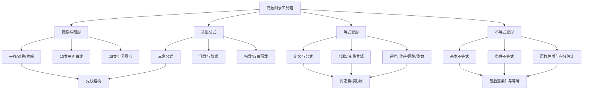

# 高数附录 图形、公式与变形技巧

> [!info] 教材与复核范围
> 来源：27张宇基础30讲高数.pdf，印刷页 546-578 / PDF p551-p583，共33页。
> 已逐页 OCR（1337行文字骨架），阅读9张全页联系图并逐页查看全部33张高清原页；10类平面图形、18类空间图形、6道正式例题及教材穿插示例均已反查。数学公式、函数定义域、图形方向和不等号以高清原页为准。

## 本讲速览

- 六个附录不是零散“公式表”，而是高数全书的工具箱：**图像怎么变、常见图形怎么认、基础公式怎么调、复杂式子怎么变到可用定理的形状**。
- 图形题先从方程读出对称、轴向、截面和参数范围；积分区域不熟时，优先回本附录查平面曲线与空间曲面。
- 公式必须连同条件记忆：根式要定号，分母要非零，对数真数要正，反双曲函数要看定义域，等价变形要可逆。
- 等式变形的目标是制造定义、公式、差分、乘积或可积结构；不等式变形的目标是把待估量缩成已知上界/下界。
- 数列递推优先试作差、同除、取倒数、移项配成线性递推；根式、三角和幂式分别优先想到共轭、配方与取对数。
- 使用顺序：**看题面信号 -> 明确目标形状 -> 选变形工具 -> 检查条件与可逆性 -> 再调用定理或公式**。

## 教材路线

| 教材顺序 | 内容 | 印刷页 / PDF页 | 复习任务 |
|---|---|---|---|
| 附录1 | 图像变换 | 546-548 / p551-p553 | 平移、对称、隐式曲线对称判据、伸缩 |
| 附录2 | 常用平面图形 | 549-551 / p554-p556 | 10类极坐标、参数曲线及其方向和对称性 |
| 附录3 | 常用空间图形 | 552-554 / p557-p559 | 18类曲面、交线和曲面片的识别 |
| 附录4 | 重要公式 | 555-557 / p560-p562 | 三角、二次方程、因式分解、阶乘 |
| 附录5 | 从指数函数到双曲函数 | 558-562 / p563-p567 | 指数/对数、双曲函数、反双曲函数 |
| 附录6 | 变形技巧 | 563-578 / p568-p583 | 定义、代换、消项、递推、共轭及不等式估计 |

## 前置知识与关联导航

- 函数性质、复合与反函数：[[01_高数第1讲_函数极限与连续#一、函数的概念与特性|函数基础]]。
- 导数定义、中值定理和泰勒公式：[[03_高数第3讲_一元函数微分学的概念#2. 导数定义|导数定义]]、[[06_高数第6讲_一元函数微分学的应用二#3. 拉格朗日中值定理|拉格朗日中值定理]]、[[06_高数第6讲_一元函数微分学的应用二#5. 泰勒公式（皮亚诺余项）|泰勒公式]]。
- 一元积分计算、极坐标面积与弧长：[[09_高数第9讲_一元函数积分学的计算|一元积分计算]]、[[10_高数第10讲_一元函数积分学的应用一_几何应用|积分几何应用]]。
- 二重积分与空间曲面识别：[[14_高数第14讲_二重积分|二重积分]]、[[17_高数第17讲_多元函数积分学的预备知识#三、空间曲线与曲面|空间曲线与曲面]]。
- 数列递推、级数和幂级数：[[02_高数第2讲_数列极限|数列极限]]、[[16_高数第16讲_无穷级数|无穷级数]]。
- 正式高数主线已在[[18_高数第18讲_多元函数积分学|高数第18讲]]收束；本附录负责把全书常用识图和变形工具集中起来。

## 知识网络

## 知识点清单

## 一、附录1 图像变换

### 1. 平移变换

设原图像为 $y=f(x)$。

| 新图像 | 对原图像的操作 | 快速记忆 |
|---|---|---|
| $y=f(x+x_0)$ | 向左平移 $x_0$ | 括号内符号与方向相反 |
| $y=f(x-x_0)$ | 向右平移 $x_0$ | 横坐标先满足$x-x_0=$原横坐标 |
| $y=f(x)+y_0$ | 向上平移 $y_0$ | 括号外符号与方向相同 |
| $y=f(x)-y_0$ | 向下平移 $y_0$ | 纵坐标整体减小 |

一般地，$y=f(x-a)+b$ 是把 $y=f(x)$ 向右移 $a$、向上移 $b$；若 $a,b$ 为负，方向自动反转。

> [!tip] 看到什么想到它
> 出现 $x-a$、$x+a$、$f(x)\pm b$，先不要重新作图，直接找原图像的“关键点、零点、渐近线”整体平移。渐近线 $x=c$ 也随横移变为 $x=c+a$。

### 2. 对称变换

| 新图像 | 作图规则 |
|---|---|
| $y=-f(x)$ | 关于 $x$ 轴对称 |
| $y=f(-x)$ | 关于 $y$ 轴对称 |
| $y=-f(-x)$ | 关于原点对称 |
| $y=f^{-1}(x)$ | 在反函数存在的区间内，关于 $y=x$ 对称 |
| $y=\lvert f(x)\rvert$ | $x$轴上方不动，下方部分翻到上方 |
| $y=f(\lvert x\rvert)$ | 保留 $x\ge0$ 部分，再关于$y$轴复制到左侧 |

**必须分清两个绝对值：**$|f(x)|$ 改纵坐标，$f(|x|)$ 改自变量；前者图像必在 $x$ 轴上方，后者图像必为偶函数。

> [!warning] 易错边界
> $f^{-1}(x)$ 表示反函数，不是 $1/f(x)$。原函数若在整个定义域不单调，应先限制到单调区间，再讨论反函数图像。

### 3. 隐式曲线的对称判据

对曲线 $F(x,y)=0$，本质是“完成相应坐标变换后，方程表示的点集不变”。教材给出以下直接判据：

| 对称对象 | 检验方式 |
|---|---|
| $y$轴 | $F(-x,y)=F(x,y)$ |
| 直线$x=T$ | $F(T+x,y)=F(T-x,y)$ |
| $x$轴 | $F(x,-y)=F(x,y)$ |
| 直线$y=T$ | $F(x,T+y)=F(x,T-y)$ |
| 原点 | $F(-x,-y)=F(x,y)$ |
| 点$(a,0)$ | $F(a+x,y)=F(a-x,-y)$ |
| 直线$y=x$ | $F(y,x)=F(x,y)$ |

- 关于 $x=T$、$y=T$、$(a,0)$ 的判据，分别是 $y$轴、$x$轴、原点对称的平移版本。
- 实际判断只要求变换前后得到**等价方程**；若整体乘了非零常数，点集仍不变。
- 参数曲线先找参数替换。例如摆线
  $$
  x=t-\sin t,\qquad y=1-\cos t
  $$
  在一个周期内用 $t\mapsto2\pi-t$，可看出关于 $x=\pi$ 对称。

教材示例识别：$y^2=x^3-x^4$ 关于$x$轴对称；$y^2=(1-x^2)^3$ 同时关于$x$轴、$y$轴和原点对称；$x^3+y^3-3xy=0$ 关于$y=x$对称。

> [!tip] 看到什么想到它
> 隐式方程要求对称性、积分区域看似复杂但换元后不变、或需要判断奇函数积分是否为0时，先做坐标替换，不要凭图感猜。

### 4. 伸缩变换

以下先取 $k>0$：

| 新图像 | 伸缩规则 |
|---|---|
| $y=f(kx)$ | 横坐标缩为原来的 $1/k$；$k>1$ 横向压缩，$0<k<1$ 横向拉伸 |
| $y=kf(x)$ | 纵坐标变为原来的 $k$ 倍；$k>1$ 纵向拉伸，$0<k<1$ 纵向压缩 |

若 $k<0$，除按 $|k|$ 伸缩外，还要补相应的轴对称。判断变化时最好追踪点：原点 $(u,f(u))$ 在 $y=f(kx)$ 上对应 $(u/k,f(u))$。

## 二、附录2 常用平面图形

### 1. 极坐标曲线的统一读法

极坐标曲线不要只背轮廓，按四步画：

1. 看 $r(\theta)$ 的周期，确定最小作图区间。
2. 解 $r=0$ 找极点，解 $|r|$ 最大找花瓣或鼓包方向。
3. 用 $r(-\theta)$、$r(\pi-\theta)$ 判断关于极轴或$y$轴的对称。
4. 若 $r<0$，点应画到角度 $\theta+\pi$ 的方向，不可把负半径丢掉。

### 2. 十类常用平面图形

| 序号 | 名称与方程 | 图像抓手 | 常见用途 |
|---:|---|---|---|
| 1 | 心形线 $r=a(1\pm\cos\theta)$、$r=a(1\pm\sin\theta)$，$a>0$ | $\cos$型关于$x$轴、$\sin$型关于$y$轴；令括号为0找尖点，正号向对应正轴鼓起 | 极坐标面积、弧长、旋转体 |
| 2 | 伯努利双纽线 $r^2=a^2\cos2\theta$ 或 $r^2=a^2\sin2\theta$ | $\cos2\theta$ 两瓣沿$x$轴，$\sin2\theta$ 两瓣沿两条对角线；只取右端非负的角区间 | 分区积分、角度范围判断 |
| 3 | 阿基米德螺线 $r=a\theta$，$a>0,\theta\ge0$ | 半径随角度线性增长，相邻两圈间距恒定 $2\pi a$ | 参数/极坐标弧长与面积 |
| 4 | 对数螺线 $r=e^{a\theta}$，$a>0$ | 半径按指数增长，转相同角度时半径按固定倍数变化 | 指数与极坐标结合 |
| 5 | 双曲螺线 $r\theta=a$，$a>0$ | $\theta\to0^+$ 时$r\to\infty$；$\theta\to\infty$ 时$r\to0$ | 反比例型极坐标区域 |
| 6 | 三叶玫瑰线 $r=a\sin3\theta$ 或 $a\cos3\theta$ | 周期 $2\pi/3$；令三倍角取$\pm1$找花瓣轴，共3瓣 | 利用周期只算一瓣再倍乘 |
| 7 | 四叶玫瑰线 $r=a\sin2\theta$ 或 $a\cos2\theta$ | $\sin2\theta$ 花瓣沿对角线，$\cos2\theta$ 沿坐标轴，共4瓣 | 极坐标对称与分区 |
| 8 | 摆线 $x=a(t-\sin t),y=a(1-\cos t)$，$a>0$ | 一拱 $0\le t\le2\pi$；尖点在两端，最高点$(\pi a,2a)$，关于$x=\pi a$对称 | 参数曲线弧长、面积、旋转 |
| 9 | 星形线 $x=a\cos^3t,y=a\sin^3t$ | 等价于 $x^{2/3}+y^{2/3}=a^{2/3}$；四个尖点在坐标轴上 | 参数化、弧长、面积 |
| 10 | 笛卡尔叶形线 $x^3+y^3-3axy=0$ | 关于$y=x$对称；参数式 $x=\frac{3at}{1+t^3},y=\frac{3at^2}{1+t^3}$，第一象限成叶瓣 | 隐式对称、参数积分 |

> [!note] 参数范围决定“画哪一段”
> 方程名称相同不代表积分路径相同。题目若指定“一拱”“一瓣”“第一象限”或曲线方向，必须先把它翻译成参数区间，再写积分限。

## 三、附录3 常用空间图形

### 1. 空间图形的统一识别法

1. **缺哪个变量**：方程不含某变量，通常沿该变量方向无限延伸，是柱面。
2. **固定一个变量看截面**：截面是圆、椭圆还是双曲线，可判断曲面开口和轴向。
3. **令变量为0看坐标面截痕**：三条截痕比凭空想象可靠。
4. **找定义域与符号限制**：根式、第一卦限、$z\ge0$ 往往只保留半个曲面。
5. **联立方程先消元**：交线常落在某个平面或投影为椭圆/圆，消元后更容易定积分区域。

### 2. 十八类常用空间图形

| 序号 | 方程/边界 | 图形与识别要点 |
|---:|---|---|
| 1 | $z=\sqrt{a^2-x^2-y^2}$，$a>0$ | 半径$a$的上半球面；投影域$x^2+y^2\le a^2$ |
| 2 | $x/a+y/b+z/c=1$，$x,y,z\ge0$ | 第一卦限截距平面片，三截距为$a,b,c$ |
| 3 | $z=\sqrt{x^2+y^2}$ | 上半圆锥面，柱坐标为$z=r$ |
| 4 | $x^2+y^2=z^2$ | 上下双圆锥面；不加$z\ge0$不能只画上半部 |
| 5 | $z=x^2+y^2$ | 绕$z$轴的旋转抛物面，向上开口，水平截面为圆 |
| 6 | $x^2+y^2=a^2,z\ge0$ | 圆柱侧面的上半部分；方程不含$z$故沿$z$方向延伸 |
| 7 | $x^2/a^2+y^2/b^2-z^2/c^2=1$ | 单叶双曲面；负项变量$z$给轴向，$z=0$有腰部椭圆 |
| 8 | $x^2/a^2-y^2/b^2-z^2/c^2=1$ | 双叶双曲面；唯一正项$x$给轴向，$\lvert x\rvert\ge a$ |
| 9 | $\sqrt x+\sqrt y+\sqrt z=\sqrt a$ | 仅在第一卦限，三个坐标轴截距均为$a$；根式使面向原点一侧弯曲 |
| 10 | $z=xy$ | 双曲抛物面（马鞍面）；沿$y=x$上弯，沿$y=-x$下弯 |
| 11 | $z=xy$，由$y=x,x=1,z=0$围成 | 投影在$xy$面由$y=x,x=1$和$y=0$限定；先画投影再取曲面片 |
| 12 | $z=xy$，由$x+y=1,z=0$围成 | 第一象限三角投影上的马鞍面片；$z=0$对应$x=0$或$y=0$ |
| 13 | $z=xy$ 与 $x^2+y^2=a^2$ | 圆柱上截出的空间闭曲线；可令$x=a\cos t,y=a\sin t$参数化 |
| 14 | $z=x^2+y^2$ 与 $z=1-x^2$ | 消去$z$得$2x^2+y^2=1$，投影为椭圆 |
| 15 | $x^2+y^2=1$ 与 $z=1-x^2$ | 在圆柱上有$z=y^2$，可用圆柱参数$x=\cos t,y=\sin t$ |
| 16 | $x^2+(y-z)^2=(1-z)^2,0\le z\le1$ | 固定$z$得到圆心$(0,z)$、半径$1-z$的圆；向上收缩到一点 |
| 17 | $z=x^2+y^2$ 与 $x^2+(y-1)^2=1$ | 由圆柱式得$x^2+y^2=2y$，故交线同时位于平面$z=2y$ |
| 18 | $z=2(x^2+y^2)$，$x^2+y^2=x,2x$，$z=0$ | 两偏心圆柱之间、抛物面下方与$z=0$上方限定的空间体；极坐标边界为$r=\cos\theta,2\cos\theta$ |

> [!tip] 看到什么想到它
> 曲面交线、曲面积分边界或三重积分区域：先消元找投影，再决定直角/柱面坐标。含$x^2+y^2$优先尝试$r^2$；方程不含某变量优先判断柱面。

## 四、附录4 重要公式

### 1. 三角函数基本关系与诱导公式

#### 1.1 同角关系

$$
\sin^2x+\cos^2x=1,\qquad
\tan x=\frac{\sin x}{\cos x},\qquad
\cot x=\frac{\cos x}{\sin x},
$$

$$
\sec x=\frac1{\cos x},\qquad
\csc x=\frac1{\sin x},
$$

$$
1+\tan^2x=\sec^2x,\qquad
1+\cot^2x=\csc^2x.
$$

所有分式关系都要求分母非零。

#### 1.2 周期、奇偶与诱导

$$
\sin(x+2k\pi)=\sin x,\quad
\cos(x+2k\pi)=\cos x,\quad
\tan(x+k\pi)=\tan x.
$$

$$
\sin(-x)=-\sin x,\quad \cos(-x)=\cos x,\quad \tan(-x)=-\tan x.
$$

常用互余关系：

$$
\sin\left(\frac\pi2-x\right)=\cos x,\qquad
\cos\left(\frac\pi2-x\right)=\sin x,
$$

$$
\sin\left(\frac\pi2+x\right)=\cos x,\qquad
\cos\left(\frac\pi2+x\right)=-\sin x.
$$

统一记忆：**奇数个 $\pi/2$ 时函数名改变，偶数个不变；最终符号看原角所在象限，即“奇变偶不变，符号看象限”**。

| 函数 | 第一象限 | 第二象限 | 第三象限 | 第四象限 |
|---|---:|---:|---:|---:|
| $\sin,\csc$ | $+$ | $+$ | $-$ | $-$ |
| $\cos,\sec$ | $+$ | $-$ | $-$ | $+$ |
| $\tan,\cot$ | $+$ | $-$ | $+$ | $-$ |

### 2. 和差、倍角、半角与三倍角

#### 2.1 和差公式

$$
\sin(\alpha\pm\beta)=\sin\alpha\cos\beta\pm\cos\alpha\sin\beta,
$$

$$
\cos(\alpha\pm\beta)=\cos\alpha\cos\beta\mp\sin\alpha\sin\beta,
$$

$$
\tan(\alpha\pm\beta)=
\frac{\tan\alpha\pm\tan\beta}{1\mp\tan\alpha\tan\beta},
$$

$$
\cot(\alpha+\beta)=
\frac{\cot\alpha\cot\beta-1}{\cot\alpha+\cot\beta},\qquad
\cot(\alpha-\beta)=
\frac{\cot\alpha\cot\beta+1}{\cot\beta-\cot\alpha}.
$$

使用正切、余切公式时，原式及右端分母都要有意义。

#### 2.2 倍角与三倍角

$$
\sin2\alpha=2\sin\alpha\cos\alpha,
$$

$$
\cos2\alpha=\cos^2\alpha-\sin^2\alpha
=1-2\sin^2\alpha=2\cos^2\alpha-1,
$$

$$
\tan2\alpha=\frac{2\tan\alpha}{1-\tan^2\alpha},\qquad
\cot2\alpha=\frac{\cot^2\alpha-1}{2\cot\alpha},
$$

$$
\sin3\alpha=3\sin\alpha-4\sin^3\alpha,\qquad
\cos3\alpha=4\cos^3\alpha-3\cos\alpha.
$$

#### 2.3 半角与降幂

$$
\sin^2\frac\alpha2=\frac{1-\cos\alpha}{2},\qquad
\cos^2\frac\alpha2=\frac{1+\cos\alpha}{2},
$$

$$
\tan\frac\alpha2
=\frac{1-\cos\alpha}{\sin\alpha}
=\frac{\sin\alpha}{1+\cos\alpha}
=\pm\sqrt{\frac{1-\cos\alpha}{1+\cos\alpha}},
$$

$$
\cot\frac\alpha2
=\frac{1+\cos\alpha}{\sin\alpha}
=\frac{\sin\alpha}{1-\cos\alpha}
=\pm\sqrt{\frac{1+\cos\alpha}{1-\cos\alpha}}.
$$

根号前正负由 $\alpha/2$ 所在象限决定；分式形式还要检查分母。

### 3. 积化和差、和差化积与万能代换

#### 3.1 积化和差

$$
\sin\alpha\sin\beta
=\frac12[\cos(\alpha-\beta)-\cos(\alpha+\beta)],
$$

$$
\cos\alpha\cos\beta
=\frac12[\cos(\alpha-\beta)+\cos(\alpha+\beta)],
$$

$$
\sin\alpha\cos\beta
=\frac12[\sin(\alpha+\beta)+\sin(\alpha-\beta)],
$$

$$
\cos\alpha\sin\beta
=\frac12[\sin(\alpha+\beta)-\sin(\alpha-\beta)].
$$

#### 3.2 和差化积

$$
\sin\alpha+\sin\beta
=2\sin\frac{\alpha+\beta}{2}\cos\frac{\alpha-\beta}{2},
$$

$$
\sin\alpha-\sin\beta
=2\cos\frac{\alpha+\beta}{2}\sin\frac{\alpha-\beta}{2},
$$

$$
\cos\alpha+\cos\beta
=2\cos\frac{\alpha+\beta}{2}\cos\frac{\alpha-\beta}{2},
$$

$$
\cos\alpha-\cos\beta
=-2\sin\frac{\alpha+\beta}{2}\sin\frac{\alpha-\beta}{2}.
$$

#### 3.3 万能代换

令 $u=\tan(x/2)$，在不跨越代换奇点的区间内有

$$
\sin x=\frac{2u}{1+u^2},\qquad
\cos x=\frac{1-u^2}{1+u^2},\qquad
dx=\frac{2\,du}{1+u^2}.
$$

教材以 $-\pi<x<\pi$ 说明主区间。它把 $\sin x,\cos x$ 的有理式积分转为 $u$ 的有理函数，但若简单凑微分可解，不必机械使用万能代换。

> [!tip] 看到什么想到它
> 同频率平方想到降幂；不同频率乘积想到积化和差；$a\sin x+b\cos x$想到辅助角；三角有理式且常规换元失败时再考虑万能代换。

### 4. 一元二次方程

对 $ax^2+bx+c=0$，$a\ne0$：

$$
\Delta=b^2-4ac,\qquad
x_{1,2}=\frac{-b\pm\sqrt\Delta}{2a}.
$$

- 实数范围：$\Delta>0$ 两个不等实根，$\Delta=0$ 二重实根，$\Delta<0$ 无实根。
- 当 $\Delta<0$ 时，在复数范围有一对共轭根
  $$
  x_{1,2}=\frac{-b\pm i\sqrt{4ac-b^2}}{2a}.
  $$
- 韦达定理：
  $$
  x_1+x_2=-\frac ba,\qquad x_1x_2=\frac ca.
  $$
- 反向使用时，若已知和 $S$、积 $P$，可令两数为方程 $t^2-St+P=0$ 的两根。

### 5. 因式分解与二项式定理

$$
(a+b)^2=a^2+2ab+b^2,\qquad
(a-b)^2=a^2-2ab+b^2,
$$

$$
(a+b)^3=a^3+3a^2b+3ab^2+b^3,
$$

$$
(a-b)^3=a^3-3a^2b+3ab^2-b^3.
$$

$$
a^2-b^2=(a-b)(a+b),
$$

$$
a^3-b^3=(a-b)(a^2+ab+b^2),\qquad
a^3+b^3=(a+b)(a^2-ab+b^2).
$$

对正整数 $n$：

$$
a^n-b^n=(a-b)(a^{n-1}+a^{n-2}b+\cdots+ab^{n-2}+b^{n-1}),
$$

当 $n$ 为奇数时：

$$
a^n+b^n=(a+b)(a^{n-1}-a^{n-2}b+\cdots-ab^{n-2}+b^{n-1}).
$$

二项式定理：

$$
(a+b)^n=\sum_{k=0}^n\binom nk a^{n-k}b^k,\qquad
\binom nk=\frac{n!}{k!(n-k)!}.
$$

题目出现 $a^n-b^n$、$x^n-1$、差商或有限等比和时，先提取 $a-b$；出现局部幂展开时，二项式定理常比逐项相乘更快。

### 6. 阶乘与双阶乘

$$
n!=1\cdot2\cdots n,\qquad 0!=1,
$$

$$
(2n)!!=2\cdot4\cdots(2n)=2^n n!,
$$

$$
(2n-1)!!=1\cdot3\cdots(2n-1).
$$

还常用

$$
(2n)!= (2n)!!(2n-1)!!,\qquad
(2n-1)!!=\frac{(2n)!}{2^n n!}.
$$

这些关系常出现在幂级数系数、三角积分递推和组合数化简中。

## 五、附录5 从指数函数到双曲函数

### 1. 指数函数与自然指数

指数函数

$$
y=a^x,\qquad a>0, a\ne1
$$

恒过 $(0,1)$，值恒正。$a>1$ 时严格递增，$0<a<1$ 时严格递减；$y=a^{-x}$ 是 $y=a^x$ 关于 $y$ 轴的对称图像。

自然指数 $e^x$ 的核心优势是导数不改变自身：

$$
(e^x)'=e^x,\qquad (e^{kx})'=ke^{kx}.
$$

微分方程 $y'=ky$ 的非零解为

$$
y=Ce^{kx}.
$$

这解释了自然增长、衰减和连续复利为什么统一出现 $e^{kx}$。

### 2. 自然对数与常用对数

$$
\ln x=\ln10\cdot\lg x,\qquad
\lg x=\lg e\cdot\ln x,\qquad x>0,
$$

其中

$$
\ln10\approx2.302585,\qquad
\lg e\approx0.434294.
$$

换底公式的一般形式为

$$
\log_a x=\frac{\ln x}{\ln a},\qquad a>0, a\ne1, x>0.
$$

> [!warning] 易错边界
> 对数式必须先写真数、底数条件。由 $a^b=c^d$ 取对数得到 $b\ln a=d\ln c$，要求两边底数为正；若原式可能为0或负数，不能直接取实对数。

### 3. 双曲函数定义与图像

教材记号为 $\operatorname{sh}x,\operatorname{ch}x,\operatorname{th}x$；现代教材也常写 $\sinh x,\cosh x,\tanh x$。

$$
\operatorname{sh}x=\frac{e^x-e^{-x}}2,\qquad
\operatorname{ch}x=\frac{e^x+e^{-x}}2,\qquad
\operatorname{th}x=\frac{\operatorname{sh}x}{\operatorname{ch}x}.
$$

| 函数 | 奇偶与范围 | 图像抓手 |
|---|---|---|
| $\operatorname{sh}x$ | 奇函数，值域$\mathbb R$ | 严格递增，过原点 |
| $\operatorname{ch}x$ | 偶函数，$\operatorname{ch}x\ge1$ | 在$(0,1)$取最小值，两端上升 |
| $\operatorname{th}x$ | 奇函数，值域$(-1,1)$ | 严格递增，水平渐近线$y=\pm1$ |

指数函数与双曲函数可互相还原：

$$
e^x=\operatorname{ch}x+\operatorname{sh}x,\qquad
e^{-x}=\operatorname{ch}x-\operatorname{sh}x.
$$

由定义直接求导：

$$
(\operatorname{sh}x)'=\operatorname{ch}x,\qquad
(\operatorname{ch}x)'=\operatorname{sh}x,\qquad
(\operatorname{th}x)'=\frac1{\operatorname{ch}^2x}.
$$

### 4. 双曲函数恒等式

和差公式：

$$
\operatorname{sh}(u\pm v)
=\operatorname{sh}u\operatorname{ch}v
\pm\operatorname{ch}u\operatorname{sh}v,
$$

$$
\operatorname{ch}(u\pm v)
=\operatorname{ch}u\operatorname{ch}v
\pm\operatorname{sh}u\operatorname{sh}v.
$$

基本恒等式：

$$
\operatorname{ch}^2u-\operatorname{sh}^2u=1,\qquad
1-\operatorname{th}^2u=\frac1{\operatorname{ch}^2u}.
$$

倍角公式：

$$
\operatorname{sh}2u=2\operatorname{sh}u\operatorname{ch}u,
$$

$$
\operatorname{ch}2u
=\operatorname{ch}^2u+\operatorname{sh}^2u
=2\operatorname{ch}^2u-1
=1+2\operatorname{sh}^2u.
$$

与三角函数相比，最容易错的是 $\operatorname{ch}^2u-\operatorname{sh}^2u=1$ 的符号，以及 $\operatorname{ch}(u\pm v)$ 中间符号与括号内同号。

### 5. 反双曲函数

#### 5.1 反双曲正弦

$$
y=\operatorname{arsh}x
=\ln\left(x+\sqrt{x^2+1}\right),\qquad x\in\mathbb R.
$$

它是 $y=\operatorname{sh}x$ 的反函数，定义域和值域均为 $\mathbb R$。

#### 5.2 反双曲余弦

双曲余弦在整个实轴不是一一函数。若只取 $y\ge0$ 的主支，则

$$
y=\operatorname{arch}x
=\ln\left(x+\sqrt{x^2-1}\right),\qquad x\ge1, y\ge0.
$$

若把 $\operatorname{ch}y=x$ 看作两支反关系，则

$$
y=\pm\ln\left(x+\sqrt{x^2-1}\right),\qquad x\ge1.
$$

并且由共轭关系

$$
\left(x+\sqrt{x^2-1}\right)
\left(x-\sqrt{x^2-1}\right)=1
$$

得到

$$
\ln\left(x-\sqrt{x^2-1}\right)
=-\ln\left(x+\sqrt{x^2-1}\right).
$$

#### 5.3 反双曲正切

$$
y=\operatorname{arth}x
=\frac12\ln\frac{1+x}{1-x},\qquad |x|<1.
$$

反函数图像与原函数图像关于 $y=x$ 对称。看到 $\ln(x+\sqrt{x^2\pm1})$ 时，应主动识别为反双曲函数结构，这常能简化求导、积分和反函数讨论。

## 六、附录6 变形技巧

### 1. 变形的目标与底线

“会变形”不是把式子越写越长，而是把题目变成某个已知入口：定义、基本公式、差分、等比、完全平方、共轭、单调性或标准不等式。

1. **先看目标**：要证存在点，就造中值定理；要求极限，就造等价无穷小/夹逼；要求和，就造差分；要求界，就造标准不等式。
2. **等式变形要合法**：除法先查非零，开方要定号，平方或取对数要补条件。
3. **等价与推出不同**：$A\Leftrightarrow B$ 要双向可逆；只需证明时可用单向放缩，但必须朝目标方向。
4. **记录等号条件**：不等式链中任一环节不能同时取等，最终等号就不存在。

### 2. 定义变形

#### 2.1 用极限定义制造可用差值

教材穿插示例：若 $f$ 可导、

$$
\lim_{x\to+\infty}[x-f(x)]=0,\qquad f(1)<1,
$$

要得到某点 $f'(\eta)>1$，不能直接对极限式求导。令

$$
\varepsilon=1-f(1)>0,
$$

由极限定义取充分大的 $\xi>1$，使

$$
\xi-f(\xi)<1-f(1),
$$

即

$$
\frac{f(\xi)-f(1)}{\xi-1}>1.
$$

再由拉格朗日中值定理，存在 $\eta\in(1,\xi)$ 使 $f'(\eta)>1$。

**迁移模板：**极限信息先转成“对充分大/充分近的点成立的不等式”，再把两点函数值差转成导数。

#### 2.2 从商的极限读函数值与导数

若 $f$ 在 $x_0$ 连续，且

$$
\lim_{x\to x_0}\frac{f(x)}{x-x_0}=a
$$

为有限数，则先由分母趋0且商有界得到 $f(x_0)=0$，进而

$$
f'(x_0)=\lim_{x\to x_0}\frac{f(x)-f(x_0)}{x-x_0}=a.
$$

若 $f$ 在 $x_0$ 邻域可导，且

$$
\lim_{x\to x_0}\frac{f(x)}{(x-x_0)^2}=a
$$

有限，则可依次读出 $f(x_0)=0$、$f'(x_0)=0$；本质是 $f$ 的低阶项必须消失。

#### 2.3 相切条件与局部上下关系

曲线 $y=f(x)$ 与 $y=g(x)$ 在 $x_0$ 相切，只能推出

$$
f(x_0)=g(x_0),\qquad f'(x_0)=g'(x_0).
$$

要判断谁在上方，研究 $h=f-g$：若 $h''(x_0)>0$，则 $x_0$ 是 $h$ 的局部极小点，附近有 $f\ge g$；若 $f''(x_0)>0,g''(x_0)<0$，则 $h''(x_0)>0$。

> [!tip] 看到什么想到它
> 商的分母是 $(x-x_0)^m$，想到“前$m-1$阶项必须为0”；两曲线相切，想到作差并看更高阶导，而不是仅凭切线相同判断上下。

### 3. 公式变形

公式法的关键不是背得多，而是认出“目标公式缺哪一块”。

- 出现 $f(x)-f(x_0)-f'(x_0)(x-x_0)$，想到泰勒余项或可微定义。
- 出现 $f(b)-f(a)$，想到中值定理或积分 $\int_a^b f'(x)dx$。
- 出现 $a^n-b^n$，想到提取 $a-b$；出现三角乘积，想到积化和差。
- 公式有唯一性条件时必须一并使用。例如泰勒系数由各阶导数唯一确定，不能只比较外形。

### 4. 代换与消元

#### 4.1 复杂整体代换

看到重复出现的复杂表达式，把它作为整体。例如含

$$
\ln\left(1+\sqrt{\frac{1+x}{x}}\right)
$$

时，可令其为 $t$，先研究 $t$ 与 $x$ 的关系，再把原式降层。整体代换是否有效，要看替换后能否消去根式、对数或复合层。

#### 4.2 平移代换

- 研究 $x\to1$：令 $t=x-1\to0$，把非零点极限搬到原点。
- 区间内存在点：若只知 $a<b$，可令 $c=a+\varepsilon$，其中 $0<\varepsilon<b-a$，把“有间距”量化。
- 固定中心或对称点：令 $x=m+t$，常可显出奇偶性与配方结构。

#### 4.3 大小、比值、和与积的消元

| 已知关系 | 推荐代换 | 作用 |
|---|---|---|
| $x_1>x_2$ | $x_1=x_2+t, t>0$ | 把大小关系变成正参数 |
| $x_1,x_2>0$ | $x_1=tx_2, t>0$ | 把二元比较变成比值函数 |
| $x+y=S$ | $x=S/2+t,y=S/2-t$ | 显出对称与平方项 |
| $2x+y=1$ | $2x=1/2+t,y=1/2-t$ | 先把加权项当整体，仍用零和参数 |
| $x+y+z=1$ | $x=1/3+t_1,y=1/3+t_2,z=1/3-t_1-t_2$ | 消去线性约束 |
| $x_1x_2=a^2$ | $x_1=at,x_2=a/t$，$t>0$ | 固定积转成单变量 |

教材还给出跨章构造：若 $x,y,z>0$ 且 $x+y+z=1$，把 $x,y,z$ 看成概率，令随机变量分别取 $2/x,1/y,1/z$，由 $\operatorname{Var}X\ge0$ 可导出

$$
\frac4x+\frac1y+\frac1z\ge16.
$$

这里真正应记的是：**正数和为1 + 加权平方/倒数和**，可尝试构造概率分布，把代数不等式转为方差非负或柯西不等式。

### 5. 消项法

#### 5.1 加法裂项

目标是把通项写成相邻差：

$$
\frac1{n(n+k)}=\frac1k\left(\frac1n-\frac1{n+k}\right),
$$

$$
\frac1{(2n-1)(2n+1)}
=\frac12\left(\frac1{2n-1}-\frac1{2n+1}\right),
$$

$$
\frac1{n(n+1)(n+2)}
=\frac12\left[\frac1{n(n+1)}-\frac1{(n+1)(n+2)}\right].
$$

其他常见差分：

$$
q^{n+1}-q^n=(q-1)q^n,\qquad
\ln\frac{n+1}{n}=\ln(n+1)-\ln n,
$$

$$
\sqrt{n+1}-\sqrt n
=\frac1{\sqrt{n+1}+\sqrt n}.
$$

指数分式也可先整体同乘 $e^n$ 或 $2^n$：

$$
\frac{e^{-n}(e-1)}{(1-e^{-n})(e-e^{-n})}
=\frac1{e^n-1}-\frac1{e^{n+1}-1},
$$

$$
\frac{2^{-n}}{(1-2^{-n})(2-2^{-n})}
=\frac1{2^n-1}-\frac1{2^{n+1}-1}.
$$

分式递推若直接相加无结构，可先取倒数再裂项。教材示例

$$
\frac{a_{n+1}}n
=\frac{a_n}{(n+1)(na_n+1)},\qquad a_1=\frac12
$$

可改写为

$$
\frac1{(n+1)a_{n+1}}-\frac1{na_n}=1.
$$

从1到$n-1$连锁消项后得到

$$
a_n=\frac1{n(n+1)}.
$$

#### 5.2 乘法消项

若能写出

$$
\frac{b_{n+1}}{b_n}=r_n,
$$

则连乘得到 $b_n=b_1\prod r_k$。教材示例

$$
a_n=(n-1)a_{n-1}+\cdots+3a_3+2a_2+a_1,\qquad a_1=1
$$

把相邻两式相减得到 $a_{n+1}-a_n=na_n$，故

$$
\frac{a_{n+1}}{a_n}=n+1,\qquad
a_n=\frac{n!}{2}\quad(n\ge2).
$$

含部分和 $S_n$ 的递推也常先求 $S_n/S_{n-1}$，再由 $a_n=S_n-S_{n-1}$ 还原通项。

#### 5.3 借位消项

有限等比和可通过“乘公比后错位相减”得到

$$
1+q+\cdots+q^n=\frac{1-q^{n+1}}{1-q},\qquad q\ne1.
$$

这类方法的共同点是：人为制造相同项，使中间大批抵消，只留下边界项。

### 6. 递推数列变形

#### 6.1 同除法：消去指数增长因子

对

$$
a_{n+1}=ka_n+f(n),\qquad k\ne0,
$$

若 $f(n)$ 含 $k^{n+1}$，令

$$
b_n=\frac{a_n}{k^n},
$$

或直接同除 $k^{n+1}$，常可化为 $b_{n+1}-b_n=$简单式，再求和。

教材例1：

$$
a_{n+1}=2a_n+2^{n+2},\qquad a_1=2.
$$

同除 $2^{n+1}$ 后得到等差型差分，最终

$$
a_n=2^n(2n-1).
$$

更一般地，对

$$
a_{n+1}+Aa_n=B^nP_m(n),
$$

- 齐次解为 $C(-A)^n$。
- 若 $B\ne-A$，特解可试 $B^nQ_m(n)$。
- 若 $B=-A$ 发生共振，特解要多乘一个 $n$，试 $nB^nQ_m(n)$。

#### 6.2 取倒数：把乘积递推线性化

若

$$
a_na_{n+1}=pa_n+qa_{n+1},
$$

两边除以 $a_na_{n+1}$ 得

$$
\frac p{a_{n+1}}+\frac q{a_n}=1.
$$

令 $b_n=1/a_n$ 即得一阶线性递推。若 $p+q\ne0$，再令

$$
c_n=b_n-\frac1{p+q}
$$

可消去常数项。

教材例4：

$$
a_{n+1}=\frac{a_n}{a_n+2},\qquad a_1=1.
$$

取倒数并平移：

$$
\frac1{a_{n+1}}+1=2\left(\frac1{a_n}+1\right),
$$

故

$$
a_n=\frac1{2^n-1}.
$$

#### 6.3 根式递推：找能连乘/等比的整体

出现 $\sqrt{a_n/a_{n-1}}$ 或相邻项平方根比，不要逐层展开。教材例2从

$$
\sqrt{a_na_{n-2}}
=\sqrt{a_{n-1}a_{n-2}}+2a_{n-1},\qquad
a_0=a_1=1
$$

出发，把

$$
\sqrt{\frac{a_n}{a_{n-1}}}+1
$$

看成整体并化成公比为2的等比数列，得到

$$
\sqrt{\frac{a_n}{a_{n-1}}}+1=2^n,\qquad
a_n=\prod_{k=2}^n(2^k-1)^2.
$$

检查时必须包括首项和每个平方根的正值条件。

#### 6.4 三项递推：制造相邻差

对

$$
F(a_{n+1},a_n,a_{n-1})=0,
$$

先试把它改写为

$$
a_{n+1}-a_n=r_n(a_n-a_{n-1}).
$$

教材例3的原递推为

$$
a_{n+1}=\frac{na_n+a_{n-1}}{n+1},\qquad
a_0=1, a_1=0.
$$

把它改写为相邻差递推后得到

$$
a_n-a_{n-1}=\frac{(-1)^n}{n!},
$$

之后再对差分求和；不要在得到相邻差后误当成已经求出 $a_n$。

#### 6.5 二阶常系数齐次递推

$$
a_{n+1}+Aa_n+Ba_{n-1}=0
$$

的特征方程为

$$
r^2+Ar+B=0.
$$

- 两个不同根 $r_1,r_2$：
  $$
  a_n=C_1r_1^n+C_2r_2^n.
  $$
- 二重根 $r$：
  $$
  a_n=(C_1+C_2n)r^n.
  $$

最后由两个初始条件定 $C_1,C_2$。它与二阶常系数线性微分方程同构，可与[[15_高数第15讲_微分方程|微分方程]]对照记忆。

> [!tip] 递推题选择顺序
> 先看能否作差；含固定倍数指数就同除；含分式乘积就取倒数；含根式比就设整体；三项线性递推再用特征方程。

### 7. 配方、开方与根式

常用目标是制造平方：

$$
(a\pm b)^2=a^2+b^2\pm2ab,
$$

若 $ab=1$，则

$$
a^2+b^2=(a+b)^2-2=(a-b)^2+2.
$$

特别地，

$$
x^2+\frac1{x^2}
=\left(x+\frac1x\right)^2-2
=\left(x-\frac1x\right)^2+2,\qquad x\ne0,
$$

$$
e^{2x}+e^{-2x}
=(e^x-e^{-x})^2+2.
$$

若线性组合 $a+b/2=c$ 为定值，则

$$
a^2+ab+b^2
=\left(a+\frac b2\right)^2+\frac34b^2
=c^2+\frac34b^2.
$$

$$
a^2+b^2+c^2-ab-bc-ca
=\frac12[(a-b)^2+(b-c)^2+(c-a)^2]\ge0.
$$

三元量之间还常用

$$
a^2+b^2+c^2=(a+b+c)^2-2(ab+bc+ca),
$$

$$
a^2+b^2+c^2+ab+bc+ca
=\frac12[(a+b)^2+(b+c)^2+(c+a)^2].
$$

三角式中

$$
1+\sin2\theta=(\sin\theta+\cos\theta)^2,
$$

同理 $1-\sin2\theta=(\sin\theta-\cos\theta)^2$。

若 $x^2+y^2=1$ 且 $x,y>0$，可令 $x=\cos\theta,y=\sin\theta$，$0<\theta<\pi/2$，把代数式变成可配方的三角式。教材示意

$$
\frac1{y^2}+\frac xy+1
=\csc^2\theta+\cot\theta+1
=\left(\cot\theta+\frac12\right)^2+\frac74
\ge\frac74.
$$

若已知 $a^2+b^2=A,ab=B$，则

$$
(a+b)^2=A+2B,\qquad |a+b|=\sqrt{A+2B}.
$$

**开方必须带绝对值。**只有再由 $a+b\ge0$ 等条件，才能去掉绝对值。嵌套根式常先猜成 $\sqrt u\pm\sqrt v$，再比较 $u+v$ 与 $2\sqrt{uv}$。

例如

$$
\sqrt{2+\sqrt3}+\sqrt{2-\sqrt3}=\sqrt6,
$$

因为先平方后，中间乘积正好化为1；含参根式和也可先平方，把最值问题转成根号内乘积的最值。

### 8. 特殊值法

当多项式系数以某种组合出现，可用函数值/导数值直接提取。若

$$
f(x)=ax^3+bx^2+cx+d,
$$

则

$$
a+c=\frac{f(1)-f(-1)}2,\qquad
b+d=\frac{f(1)+f(-1)}2.
$$

类似地，$f'(1),f'(-1)$ 可提取带次数权重的系数组合。题面给系数交错和、奇次项和、偶次项和时，优先尝试 $x=1,-1,0$，不要逐项解系数。

### 9. 因式分解、整数幂和与小量和

#### 9.1 因式与有限几何和

出现 $x^n-y^n$ 就提取 $x-y$；出现 $1+x+\cdots+x^n$ 就与 $(1-x)$ 相乘。极限中这能把“高次差”变成“一次小量 × 有界和”。

#### 9.2 整数幂和的主项

对固定正整数 $k$，

$$
\sum_{j=1}^n j^k
=\frac{n^{k+1}}{k+1}+R_k(n),
$$

其中 $R_k(n)$ 是次数不超过 $k$ 的多项式。极限只需最高阶时，主项已足够；要求精确值时再用完整幂和公式。

教材例5：

$$
\sum_{j=1}^n\sin\frac{j}{n^2}.
$$

因为所有角都趋于0，可用 $\sin x$ 与 $x$ 的夹逼，并结合

$$
\sum_{j=1}^n\frac{j}{n^2}=\frac{n(n+1)}{2n^2}\to\frac12
$$

得到原极限为 $1/2$。这不是标准黎曼和：通项前没有 $1/n$，应从小角等价与幂和入手。

### 10. 三角与共轭变形

#### 10.1 辅助角公式

令 $R=\sqrt{a^2+b^2}$，取 $\varphi$ 满足

$$
\cos\varphi=\frac aR,\qquad \sin\varphi=\frac bR,
$$

则

$$
a\sin x+b\cos x=R\sin(x+\varphi).
$$

因此其值域为 $[-R,R]$。$\varphi$ 的象限由向量 $(a,b)$ 决定，不能只写 $\tan\varphi=b/a$ 后忽略象限。

还常用

$$
\tan\left(\frac\pi4-\alpha\right)
=\frac{1-\tan\alpha}{1+\tan\alpha}.
$$

#### 10.2 共轭结构

| 原结构 | 共轭/搭档 | 目的 |
|---|---|---|
| $\sqrt A-\sqrt B$ | $\sqrt A+\sqrt B$ | 去根号、制造$A-B$ |
| $1-\cos x$ | $1+\cos x$或半角式 | 制造$\sin^2x$ |
| $a\sin x+b\cos x$ | $b\sin x-a\cos x$ | 平方相加得$a^2+b^2$ |
| $\cos ax\cos bx$ | $\sin ax\sin bx$或积化和差 | 分离频率$a\pm b$ |

教材例6先用

$$
(a\sin x+b\cos x)^2
+(b\sin x-a\cos x)^2=a^2+b^2,
$$

这说明上述两个线性组合互为“共轭搭档”。对例6本身，先用

$$
\cos ax\cos bx
=\frac12[\cos(a+b)x+\cos(a-b)x],
$$

再用

$$
\frac{d^n}{dx^n}\cos(kx)=k^n\cos\left(kx+\frac{n\pi}{2}\right),
$$

得到

$$
\frac{d^n}{dx^n}(\cos ax\cos bx)
=\frac{(a+b)^n}{2}\cos\left((a+b)x+\frac{n\pi}{2}\right)
+\frac{(a-b)^n}{2}\cos\left((a-b)x+\frac{n\pi}{2}\right).
$$

也可直接套莱布尼茨公式，但会得到含二项式系数的求和，难以看出简洁闭式。教材强调：题面是三角乘积且目标为高阶导时，**先积化和差再求导**通常比直接展开乘积导数更有价值。

### 11. 常见等式变形入口

1. **加减同一项**：$f(x)-g(x)=[f(x)-f(a)]+[f(a)-g(x)]$，为中值定理或极限拆分制造结构。
2. **乘除同一非零项**：把差商、比例或共轭补齐；先确认除数非零。
3. **把1换形**：$1=\sin^2x+\cos^2x=e^{0}=a/a$，服务配方、通分或换元。
4. **降幂与倒代换**：$x^4+1=x^2[(x+1/x)^2-2]$，适合倒数对称式，要求$x\ne0$。
5. **幂指式取对数**：$a^b=c^d\Rightarrow b\ln a=d\ln c$，要求$a,c>0$。
6. **积分拆区间**：
   $$
   \int_a^b f(x)dx=\int_a^c f(x)dx+\int_c^b f(x)dx.
   $$
   拆点应选对称点、变号点、奇点或便于换元的位置。

### 12. 不等式变形总原则

- 先确定要证的是上界还是下界，再选放缩方向。
- 目标含和、平方和、倒数和，优先均值不等式或柯西；含函数值差，优先单调/中值/凹凸；含积分，优先绝对值、单调夹逼或柯西积分型。
- 乘除不等式前先判因子正负；平方前先确认两边非负；取倒数会在正数范围反向。
- 放缩不仅要成立，还要“同阶”。极限题中界太粗，可能无法夹出目标。

### 13. 十八条抽象型基本不等式

教材将常用底座集中为18条，按用途整理如下。

#### 13.1 绝对值与三点关系

$$
0\le a+|a|\le2|a|,
$$

$$
|a|=|a-b+b|\le|a-b|+|b|,
$$

$$
|a-b|=|a-c+c-b|\le|a-c|+|c-b|.
$$

第三式是“三个量关系”：要控制两点距离，可插入便于估计的中间点 $c$。

#### 13.2 均值链与二次型

对 $a,b>0$：

$$
\frac{2}{1/a+1/b}
\le\sqrt{ab}
\le\frac{a+b}{2}
\le\sqrt{\frac{a^2+b^2}{2}}.
$$

并有

$$
|ab|\le\frac{a^2+b^2}{2},\qquad
a^2+b^2\ge2ab,
$$

$$
4ab\le(a+b)^2\le2(a^2+b^2).
$$

倒数型：

$$
\frac1a+\frac1b\ge\frac2{\sqrt{ab}}
\ge\frac4{a+b},\qquad
(a+b)\left(\frac1a+\frac1b\right)\ge4.
$$

#### 13.3 柯西、三元均值与自倒数

对 $c,d>0$：

$$
\frac{a^2}{c}+\frac{b^2}{d}
\ge\frac{(a+b)^2}{c+d}.
$$

这是 Engel 形式（Titu 引理），目标出现加权平方和时尤其好用。

对 $a,b,c>0$：

$$
\frac{a+b+c}{3}\ge\sqrt[3]{abc},
$$

且对 $a>0$：

$$
a+\frac1a\ge2.
$$

#### 13.4 区间距离、积分与柯西

若 $x\in[a,b]$：

$$
\frac{(b-a)^2}{2}
\le(x-a)^2+(b-x)^2
\le(b-a)^2,
$$

$$
\frac{(b-a)^3}{4}
\le(x-a)^3+(b-x)^3
\le(b-a)^3.
$$

积分绝对值：

$$
\left|\int_a^b f(x)dx\right|
\le\int_a^b|f(x)|dx,
$$

分点 $c\in[a,b]$ 后：

$$
\left|\int_a^b f\right|
\le\int_a^c|f|+\int_c^b|f|.
$$

有限维柯西：

$$
(a_1b_1+a_2b_2)^2
\le(a_1^2+a_2^2)(b_1^2+b_2^2).
$$

积分型柯西：

$$
\left[\int_a^b f(x)g(x)dx\right]^2
\le\int_a^b f^2(x)dx\int_a^b g^2(x)dx.
$$

等号条件是两向量/两函数成比例（积分型按几乎处处意义理解）。

### 14. 二十二条条件不等式

这些结论只在所列条件下成立。下面保持教材的1-22顺序，并在每组后提炼来源。

#### 14.1 小量、固定和积与已有界（1-7）

1. 若 $0<a<1$，则
   $$
   a>a^2,\qquad \frac{a^2}{2}<a-\frac{a^2}{2}<a.
   $$
2. 若 $0<a<1$，则幂随指数增大而减小，因为
   $$
   (1-a)^n-(1-a)^{n+1}=a(1-a)^n>0.
   $$
3. 若 $ab=A$ 且 $a,b>0$，则
   $$
   a+b\ge2\sqrt A.
   $$
4. 若 $a+b=A$ 且 $a,b>0$，则
   $$
   ab\le\frac{A^2}{4}.
   $$
   例如 $x_0\in(0,1)$ 时，$x_0(1-x_0)\le1/4$，故 $1/[x_0(1-x_0)]\ge4$。
5. $c\ge M\Rightarrow a+b+c\ge a+b+M$。
6. $c\le M\Rightarrow a+b+c\le a+b+M$。
7. $|c|\le M\Rightarrow |a+b+c|\le|a|+|b|+M$。

这一组的入口是：小量平方更小、固定积压和、固定和压积、已知界直接替换。替换前要先看目标需要上界还是下界。

#### 14.2 单调、分母与根式小量（8-15）

8. 若 $a_n>0$ 且单调递减，则
   $$
   a_{n+1}\le\sqrt{a_na_{n+1}}.
   $$
9. 若 $a,b>0$，则
   $$
   \frac1{\sqrt{a+b}}<\frac1{\sqrt a}.
   $$
10. 若 $a>1,b>0$，则
    $$
    \frac{a-\sqrt a}{a+b}<\frac{a-\sqrt a}{a}<1.
    $$
11. 若 $a>1$，则
    $$
    \frac a{1+a}>\frac12.
    $$
12. 若 $0<a<1$，则
    $$
    \frac a2<\frac a{1+a}<a.
    $$
13. 若 $0<a<1/2$，则
    $$
    a<\frac a{1-a}<2a.
    $$
14. 若 $0<a<1$，则
    $$
    \frac a{1-a}>a.
    $$
15. 若 $0<a<1$，则
    $$
    1-\sqrt{1-a}
    =\frac a{1+\sqrt{1-a}}<a.
    $$

第9-15条都依赖正性：分母变大时正分式变小；取倒数会反向；根式差优先共轭有理化。

#### 14.3 根式配方、均值与强制取等（16-22）

16. 若 $a>0$，则
    $$
    \sqrt{b^2-2ab+2a^2}
    =\sqrt{(b-a)^2+a^2}\ge|b-a|.
    $$
17. 若 $b>a>0$，则
    $$
    \sqrt{b^2-2ab+2a^2}
    =\sqrt{b^2-2a(b-a)}\le b.
    $$
18. 若 $0<a<2$，则
    $$
    \sqrt{a(2-a)}\le\frac{a+(2-a)}2=1.
    $$
19. 若 $0<a<1/2$，则
    $$
    \sqrt{a(1-2a)}
    =\frac1{\sqrt2}\sqrt{2a(1-2a)}
    \le\frac1{2\sqrt2}.
    $$
20. 若 $a,b>0$，则
    $$
    \sqrt{a(a+b)}-a
    =\frac{ab}{\sqrt{a(a+b)}+a}<\frac b2.
    $$
21. 若 $a>0$ 且
    $$
    a+\frac4a\le4,
    $$
    则 $(a-2)^2\le0$，只能有 $a=2$。
22. 若
    $$
    a+\frac4b\le4,\qquad 0<b<4,
    $$
    则
    $$
    a-b\le4-\left(\frac4b+b\right)\le0,
    $$
    即 $a\le b$。

第16-20条先配方、均值或共轭；第21-22条体现“**题设上界碰到理论最小值**”会强制取等或确定大小关系。

### 15. 初等函数不等式

#### 15.1 指数与对数

1. 切线不等式：
   $$
   e^x\ge1+x,\qquad x\in\mathbb R,
   $$
   等号仅在 $x=0$。替换 $x\mapsto x-1$ 得 $e^{x-1}\ge x$。
2.
   $$
   e^x\ge e\,x,\qquad x\in\mathbb R,
   $$
   等号在 $x=1$。
3. 对 $x>0$：
   $$
   1-\frac1x\le\ln x\le x-1,
   $$
   两端等号均在 $x=1$。
4. 当 $0<x<1$：
   $$
   \frac{x}{x+1}
   \le\ln\left(1+\frac1x\right)
   \le\frac1x.
   $$
   由 $\ln(1+t)\le t$ 还可迅速得到
   $$
\ln(1+n)\le n,\qquad \ln n<n,\qquad
   \frac1{\ln\sqrt n}=\frac2{\ln n}>\frac2n.
   $$
5. 泰勒细化：$x>0$且在适用范围内，
   $$
   \ln(1+x)=x-\frac{x^2}{2}+\frac{x^3}{3}-\cdots,
   $$
   可用截断项给比 $\ln(1+x)\le x$ 更精细的上下界；截断方向须由余项或交错性确认。
   例如令 $x=1/n^2$，可得
   $$
   0<\frac1{n^2}-\ln\left(1+\frac1{n^2}\right)<\frac1{2n^4}.
   $$
6.
   $$
   e^x-\ln x>2,\qquad x>0.
   $$
7.
   $$
   n!<n^n,\qquad n>1,
   $$
   因为每个因子 $k\le n$ 且并非全取等。

#### 15.2 三角与经典极限型

对 $0<x<\pi/2$：

$$
\sin x<x<\tan x,
$$

$$
\frac2\pi<\frac{\sin x}{x}<1.
$$

对 $0<x<\pi/4$：

$$
1<\frac{\tan x}{x}<\frac4\pi.
$$

还常用

$$
\left(1+\frac1x\right)^x<e,\qquad x>0,
$$

$$
x\ln x\ge-\frac1e,\qquad x>0,
$$

$$
|\cos x|
=\left|\sin\left(\frac\pi2-x\right)\right|
\le\left|x-\frac\pi2\right|.
$$

> [!tip] 看到什么想到它
> $e^x$或$\ln x$与一次式比较，想到切线/凹凸；$\sin x,x,\tan x$同现，想到几何不等式；$(1+1/x)^x$想到$e$；$x\ln x$想到求导找$x=1/e$。

### 16. 函数性质中的不等式

#### 16.1 极限保号与有界控制

若 $x_n\to a\ne0$，则充分大时

$$
|x_n|>\frac{|a|}{2};
$$

若 $f(x)\to a\ne0$，则充分靠近目标点时

$$
|f(x)|>\frac{|a|}{2}.
$$

若极限为0，则可按定义取例如 $|x_n|<1/2$ 或 $|f(x)|<1/2$。常数 $1/2$ 不是固定定理，只是选取 $\varepsilon$ 后得到的方便界。

#### 16.2 单调性

若 $f$ 单调递增，则

$$
(x-x_0)[f(x)-f(x_0)]\ge0.
$$

更一般地，对任意 $c$，

$$
[f(x)-f(c)](x-c)\ge0.
$$

教材的两个转译示例都不是靠硬算：若 $a,b>0$ 且 $a=\ln(a+e^b)$，由对数单调性得 $a>b$；若 $0<a,b<\pi/2$ 且 $\cos a-a=\cos b$，则 $\cos a-\cos b=a>0$，由余弦在该区间递减得 $b>a$。

若 $f$ 在 $[0,x]$ 单调递增且 $x>0$，由积分中值定理

$$
\int_0^x f(t)dt=xf(\xi),\qquad 0<\xi<x,
$$

故

$$
xf(x)-\int_0^x f(t)dt=x[f(x)-f(\xi)]>0
$$

（严格递增时）。这是比较“端点值×区间长”和“积分平均”的通用入口。

若 $f$ 正且单调递减，则每个单位区间上

$$
f(k+1)\le\int_k^{k+1}f(x)dx\le f(k),
$$

求和可在离散和与积分之间夹逼。取 $f(x)=1/x$ 得调和和与 $\ln n$ 的经典界，并可继续估计相应连乘。

具体地，

$$
\frac12+\frac13+\cdots+\frac1n
\le\ln n
\le1+\frac12+\cdots+\frac1{n-1}.
$$

由下界可推出 $\ln k>(k-1)/k$（$k\ge2$），连乘得到

$$
\ln2\cdot\ln3\cdots\ln n>\frac12\cdot\frac23\cdots\frac{n-1}{n}=\frac1n.
$$

#### 16.3 凹凸性

若 $f''(x)>0$，则图像在任意弦的下方：对 $a\le x\le b$，

$$
f(x)\le f(a)+\frac{f(b)-f(a)}{b-a}(x-a).
$$

这是凸函数的弦线不等式；切线在图像下方，弦线在图像上方。若 $f''<0$，方向全部反转。

#### 16.4 积分与绝对值估计

教材示例

$$
a_n=\int_0^{\pi/4}\tan^n x\,dx.
$$

令 $t=\tan x$，则

$$
0<a_n=\int_0^1\frac{t^n}{1+t^2}dt
<\int_0^1t^n dt=\frac1{n+1}.
$$

这给出 $a_n$ 的衰减阶，并可推出进一步的 $a_n/n^p$ 上界。

例如 $p>0$ 时，

$$
0<\frac{a_n}{n^p}<\frac1{n^{p+1}}.
$$

比较积分与左端点黎曼和时，先分区间：

$$
\left|\int_0^1f(x)dx-\frac1n\sum_{k=1}^nf\left(\frac{k-1}{n}\right)\right|
$$

$$
\le\sum_{k=1}^n
\int_{(k-1)/n}^{k/n}
\left|f(x)-f\left(\frac{k-1}{n}\right)\right|dx.
$$

之后再用一致连续性或导数有界控制每个小区间的振幅。

### 17. 消项法中的不等式

#### 17.1 用可裂项式作下界

因为

$$
\frac1{(2n-1)^2}
>\frac1{(2n-1)(2n+1)}
=\frac12\left(\frac1{2n-1}-\frac1{2n+1}\right),
$$

奇数倒数平方和可用右侧望远镜式给出下界。关键不是精确求和，而是选一个“方向正确、能消项”的比较项。

对前$n$个奇数项，教材的消项结果为

$$
1+\frac1{3^2}+\cdots+\frac1{(2n-1)^2}
>\frac76-\frac1{2(2n+1)}.
$$

#### 17.2 根式差的共轭估计

若 $0<a<b$：

$$
\sqrt b-\frac a{\sqrt b}
=\left(1+\sqrt{\frac ab}\right)(\sqrt b-\sqrt a)
<2(\sqrt b-\sqrt a).
$$

这把不好求和的根式量压到相邻根式差上。

#### 17.3 部分和倒数消项

令

$$
S_n=\sum_{k=1}^na_k,\qquad a_k>0.
$$

则 $S_n>S_{n-1}>0$，且

$$
\frac{a_n}{S_n^2}
=\frac{S_n-S_{n-1}}{S_n^2}
<\frac{S_n-S_{n-1}}{S_nS_{n-1}}
=\frac1{S_{n-1}}-\frac1{S_n}.
$$

从 $n=2$ 求和立即得到

$$
\sum_{k=2}^n\frac{a_k}{S_k^2}
<\frac1{S_1}-\frac1{S_n}
=\frac1{a_1}-\frac1{S_n}.
$$

> [!tip] 看到什么想到它
> 求和项含 $S_n$ 且分母是 $S_n^2$，主动制造 $1/S_{n-1}-1/S_n$；含相邻根式，主动乘共轭；需要估和但精确式困难，寻找可望远镜的上下界。

## 公式与二级结论索引

| 主题 | 结论与条件 | 详细入口 |
|---|---|---|
| 平移 | $f(x-a)+b$：右移$a$、上移$b$ | [[#1. 平移变换\|平移变换]] |
| 绝对值作图 | $\lvert f(x)\rvert$翻纵坐标，$f(\lvert x\rvert)$复制右半图 | [[#2. 对称变换\|对称变换]] |
| 隐式对称 | 对坐标作相应替换后方程点集不变 | [[#3. 隐式曲线的对称判据\|隐式对称]] |
| 伸缩 | $f(kx)$横缩$1/k$，$kf(x)$纵伸$k$，先取$k>0$ | [[#4. 伸缩变换\|伸缩变换]] |
| 心形线 | $r=a(1\pm\cos\theta),a(1\pm\sin\theta)$，$a>0$ | [[#2. 十类常用平面图形\|平面图形]] |
| 双纽/玫瑰线 | $r^2=a^2\cos2\theta$等，必须限制使$r^2\ge0$的角区间 | [[#2. 十类常用平面图形\|平面图形]] |
| 摆线 | $x=a(t-\sin t),y=a(1-\cos t)$，一拱$t\in[0,2\pi]$ | [[#2. 十类常用平面图形\|平面图形]] |
| 星形线 | $x^{2/3}+y^{2/3}=a^{2/3}$及三次幂参数式 | [[#2. 十类常用平面图形\|平面图形]] |
| 常见曲面 | 缺变量看柱面；平方项符号看双曲面轴向；先消元找投影 | [[#2. 十八类常用空间图形\|空间图形]] |
| 和差公式 | 正弦同号、余弦反号；正切分母需非零 | [[#2. 和差、倍角、半角与三倍角\|和差倍半角]] |
| 降幂 | $\sin^2(\alpha/2)=(1-\cos\alpha)/2$等 | [[#2. 和差、倍角、半角与三倍角\|和差倍半角]] |
| 三倍角 | $\sin3x=3\sin x-4\sin^3x$，$\cos3x=4\cos^3x-3\cos x$ | [[#2. 和差、倍角、半角与三倍角\|和差倍半角]] |
| 积化和差 | 两个频率乘积拆为$a\pm b$两个频率 | [[#3. 积化和差、和差化积与万能代换\|积化和差]] |
| 万能代换 | $u=\tan(x/2)$，不跨代换奇点 | [[#3. 积化和差、和差化积与万能代换\|万能代换]] |
| 二次方程 | 根公式、判别式与韦达，要求$a\ne0$ | [[#4. 一元二次方程\|二次方程]] |
| 幂差分解 | $a^n-b^n$总含$a-b$；幂和含$a+b$要求$n$奇 | [[#5. 因式分解与二项式定理\|因式分解]] |
| 双阶乘 | $(2n)!!=2^nn!$，$(2n-1)!!=(2n)!/(2^nn!)$ | [[#6. 阶乘与双阶乘\|双阶乘]] |
| 双曲函数 | $\operatorname{ch}^2x-\operatorname{sh}^2x=1$ | [[#4. 双曲函数恒等式\|双曲恒等式]] |
| 反双曲函数 | $\operatorname{arsh}x=\ln(x+\sqrt{x^2+1})$等，须看定义域/分支 | [[#5. 反双曲函数\|反双曲函数]] |
| 裂项 | $1/[n(n+k)]=(1/k)(1/n-1/(n+k))$ | [[#5. 消项法\|消项法]] |
| 一阶递推 | 同除增长因子，令$b_n=a_n/k^n$ | [[#6. 递推数列变形\|递推变形]] |
| 二阶递推 | 特征根不同/重根对应两种通项 | [[#6.5 二阶常系数齐次递推\|二阶递推]] |
| 辅助角 | $a\sin x+b\cos x=\sqrt{a^2+b^2}\sin(x+\varphi)$，象限由$(a,b)$定 | [[#10. 三角与共轭变形\|辅助角]] |
| 均值链 | 正数范围 $H\le G\le A\le Q$，等号为各量相等 | [[#13. 十八条抽象型基本不等式\|基本不等式]] |
| Engel/柯西 | 分母正；积分型等号要求函数成比例 | [[#13.3 柯西、三元均值与自倒数\|柯西]] |
| 指对数界 | $e^x\ge1+x$；$1-1/x\le\ln x\le x-1$，注意定义域 | [[#15. 初等函数不等式\|初等函数不等式]] |
| 三角界 | $\sin x<x<\tan x$仅在指定正区间直接使用 | [[#15.2 三角与经典极限型\|三角不等式]] |
| 凸函数弦线 | $f''>0$时图像在弦下、切线之上 | [[#16.3 凹凸性\|凹凸性]] |
| 部分和倒数 | $a_n/S_n^2<1/S_{n-1}-1/S_n$，要求$a_n>0$ | [[#17.3 部分和倒数消项\|部分和消项]] |

## 题型—方法决策表

| 题面特征 | 首选知识点 | 开始动作 | 备选方法 | 检查点 |
|---|---|---|---|---|
| $f(x-a)+b$或绝对值函数作图 | 图像变换 | 追踪关键点和渐近线 | 分段写函数 | 横移方向、绝对值作用对象 |
| 隐式曲线问对称 | 隐式对称判据 | 替换$x,y$比较方程 | 参数替换 | 等价方程而非字面完全相同 |
| 极坐标面积/弧长 | 十类平面曲线 | 求周期、零点、最大半径 | 画关键角表 | 负$r$和一瓣参数范围 |
| 曲面/交线不熟 | 十八类空间图形 | 看缺变量、截面、消元投影 | 柱坐标参数化 | 半面、卦限和边界是否遗漏 |
| 三角乘积不同频率 | 积化和差 | 拆成$a+b,a-b$ | 欧拉公式 | 系数$1/2$和正负号 |
| 三角有理积分 | 万能代换 | 先试凑微分，再令$u=\tan(x/2)$ | 分部/降幂 | 代换区间和奇点 |
| $\ln(x+\sqrt{x^2\pm1})$ | 反双曲函数 | 识别arsh/arch | 直接求导 | $x$范围及arch分支 |
| 极限给商$(x-x_0)^{-m}$ | 导数定义/泰勒 | 先确定低阶函数值为0 | 洛必达（条件满足时） | 不能先对极限等式求导 |
| 两曲线相切后比较上下 | 作差与二阶导 | 令$h=f-g$ | 泰勒展开 | 相切只给0、1阶相同 |
| 正数和为1、倒数加权和 | 柯西/方差构造 | 写Engel式或构造概率 | 拉格朗日乘数 | 权重正、等号条件 |
| 有理通项求和 | 加法裂项 | 因式分解并写相邻差 | 积分比较 | 边界项和起止编号 |
| 部分和递推/连乘 | 乘法消项 | 求$S_n/S_{n-1}$ | 取对数 | 最后用$a_n=S_n-S_{n-1}$ |
| $a_{n+1}=ka_n+k^{n+1}P(n)$ | 同除法 | 令$b_n=a_n/k^n$ | 待定系数 | 共振时特解多乘$n$ |
| 分式递推 | 取倒数 | 看$1/a_n$能否线性化 | 平移变量 | 项非零、常数平移值 |
| 三项递推 | 作相邻差/特征方程 | 先找$a_n-a_{n-1}$ | 生成函数 | 得到差后还要再求和 |
| 根式差或嵌套根式 | 共轭/配方 | 乘共轭或设$\sqrt u\pm\sqrt v$ | 单调放缩 | 开方后的绝对值 |
| 系数奇偶组合 | 特殊值法 | 代$x=1,-1,0$ | 求导后再赋值 | 题目要的是哪组系数 |
| 小角求和但不像黎曼和 | 小量等价+幂和 | 统一控制最大角 | 夹逼 | 等价替换对求和是否一致 |
| $a\sin x+b\cos x$ | 辅助角 | 算$R=\sqrt{a^2+b^2}$ | 柯西 | $\varphi$象限 |
| 不等式含和/积/平方和 | 均值与柯西 | 找正数、固定和积 | 配方 | 等号能否同时达到 |
| 函数与切线/弦比较 | 凹凸性 | 求$f''$并判号 | 构造差函数 | 凸函数切线下、弦线上 |
| 离散和与积分比较 | 单调性 | 每个单位区间夹住$f$ | 欧拉求和（非基础要求） | 单调方向决定不等号 |
| $a_n/S_n^2$求和 | 倒数消项 | 造$1/S_{n-1}-1/S_n$ | 积分比较 | $a_n>0$保证$S_n$递增 |

## 教材例题覆盖表

| 教材位置 | 考查知识 | 题面信号 | 解法入口 | 独有技巧/结论 | 笔记定位 |
|---|---|---|---|---|---|
| p568 穿插示例 | 极限定义+中值定理 | 无穷远趋近、证某点导数较大 | 先用$\varepsilon$造两点斜率 | 不能对极限式直接求导 | [[#2.1 用极限定义制造可用差值\|定义变形]] |
| p569 穿插示例 | 导数定义与相切 | 高阶分母、相切后比较 | 先消低阶项；两函数作差 | 相切不自动给上下关系 | [[#2. 定义变形\|定义变形]] |
| p570 穿插示例 | 方差证不等式 | 正数和为1、加权倒数 | 构造离散随机变量 | 由$\operatorname{Var}X\ge0$得下界16 | [[#4.3 大小、比值、和与积的消元\|代换消元]] |
| 例1 p572 | 一阶非齐次递推 | $2^n$与$a_n$同现 | 同除$2^{n+1}$ | $a_n=2^n(2n-1)$ | [[#6.1 同除法：消去指数增长因子\|同除法]] |
| 例2 p573 | 根式递推 | 相邻项比值开方 | 设根式整体成等比 | 连乘恢复通项并查首项 | [[#6.3 根式递推：找能连乘/等比的整体\|根式递推]] |
| 例3 p573 | 三项递推 | $a_{n+1},a_n,a_{n-1}$ | 构造相邻差 | $a_n-a_{n-1}=(-1)^n/n!$ | [[#6.4 三项递推：制造相邻差\|作差递推]] |
| 例4 p573-p574 | 分式递推 | $a_{n+1}=a_n/(a_n+2)$ | 取倒数再平移 | $a_n=1/(2^n-1)$ | [[#6.2 取倒数：把乘积递推线性化\|取倒数]] |
| p574 穿插示例 | 配方与三角开方 | 已知平方和与乘积 | 造$(a+b)^2$ | 开方保留$\lvert a+b\rvert$ | [[#7. 配方、开方与根式\|配方开方]] |
| 例5 p575-p576 | 小量和与幂和 | $\sum\sin(j/n^2)$ | 小角夹逼+一阶幂和 | 极限$1/2$，不是黎曼和 | [[#9.2 整数幂和的主项\|幂和小量]] |
| 例6 p577 | 三角高阶导 | $\cos ax\cos bx$的$n$阶导 | 先积化和差 | 分离$a+b,a-b$两个频率 | [[#10.2 共轭结构\|三角变形]] |
| p554-p556 图表 | 10类平面曲线 | 极坐标/参数方程识图 | 周期、极点、对称、参数范围 | 每类方程和轮廓均已入表 | [[#2. 十类常用平面图形\|平面图形]] |
| p557-p559 图表 | 18类空间图形 | 曲面、交线、限定面 | 缺变量、截面、投影、消元 | 每类方程和识别点均已入表 | [[#2. 十八类常用空间图形\|空间图形]] |

## 讲末练习反查

本附录在 PDF p583 直接结束，没有另设独立练习和答案页，因此不虚构练习题号。用下面的“方法自测”代替题号式反查；若只看本笔记，应能完成每项入口判断。

| 自测任务 | 应能立即想到 | 定位 |
|---|---|---|
| 区分$\lvert f(x)\rvert$与$f(\lvert x\rvert)$的图像 | 一个翻纵坐标，一个复制右半图 | [[#2. 对称变换\|对称变换]] |
| 由隐式方程判断关于$x=T$对称 | 比较$F(T+u,y)$与$F(T-u,y)$ | [[#3. 隐式曲线的对称判据\|隐式对称]] |
| 给极坐标曲线确定一瓣积分限 | 周期、$r=0$、最大半径方向 | [[#1. 极坐标曲线的统一读法\|极坐标读图]] |
| 联立两个曲面画交线 | 消元找投影或附加平面 | [[#1. 空间图形的统一识别法\|空间识图]] |
| 不查表写出三角乘积的转换 | 积化和差四式 | [[#3. 积化和差、和差化积与万能代换\|积化和差]] |
| 解释$\operatorname{arch}x$为什么有分支 | $\operatorname{ch}x$在全实轴不一一 | [[#5.2 反双曲余弦\|反双曲余弦]] |
| 从极限商读出函数值/导数 | 先消低阶项再回定义 | [[#2.2 从商的极限读函数值与导数\|导数定义]] |
| 一眼判断递推该作差、同除还是倒数 | 看三项、指数因子、分式乘积 | [[#6. 递推数列变形\|递推变形]] |
| 给根式差和倒数平方和找可消项界 | 共轭或望远镜比较项 | [[#17. 消项法中的不等式\|消项估计]] |
| 使用不等式后说明等号 | 逐环节检查条件能否同时满足 | [[#12. 不等式变形总原则\|不等式原则]] |

## 易错点/易混点

1. $f(x-a)$向右移，不是向左；括号内横移方向相反。
2. $|f(x)|$与$f(|x|)$作用坐标不同；后者一定是偶函数。
3. 方程替换后整体乘非零常数仍等价，不能只比字符串是否完全相同。
4. 极坐标$r<0$不是“没有点”，而是在反方向取$|r|$。
5. 玫瑰线和双纽线的一瓣范围要由$r$的符号和周期确定，不能一律$0$到$2\pi$。
6. 参数曲线的图形相同但参数区间/方向不同，曲线积分结果可能不同。
7. 双圆锥$x^2+y^2=z^2$含上下两半；根式$z=\sqrt{x^2+y^2}$只含上半。
8. 单叶双曲面的轴对应唯一负平方项，双叶双曲面的轴对应唯一正平方项。
9. 半角根式前的$\pm$由半角象限决定，不能固定取正。
10. $a^n+b^n$能提$a+b$需要$n$为奇数；幂差则任意正整数$n$都能提$a-b$。
11. $f^{-1}(x)$是反函数，不是倒数；$\operatorname{ch}x$需限支后才有单值反函数。
12. $\operatorname{ch}^2x-\operatorname{sh}^2x=1$，不要照搬$\sin^2+\cos^2=1$。
13. 有限极限商不能未经条件检查就连续使用洛必达；先看它是否直接给导数定义。
14. 相切只保证函数值和一阶导相等；局部上下需比较二阶或首个非零高阶项。
15. 开平方得$\sqrt{u^2}=|u|$，不是$u$。
16. 取倒数、除式、取对数和平方都可能改变等价性，必须检查正负与非零。
17. 得到$a_n-a_{n-1}$后还要求和并用初值，不能把差分当通项。
18. 小量逐项等价放进越来越长的求和前，要有统一误差控制；例5用夹逼而非随意替换。
19. 凸函数图像在切线上方、弦线下方；凹函数方向相反。
20. 证明不等式时“放得更大/更小”必须服务目标方向；链条中等号条件还要能同时成立。

## 注解

### 1. 怎样把附录用回正文

- 做[[10_高数第10讲_一元函数积分学的应用一_几何应用|积分几何应用]]前，先回看平面曲线参数范围。
- 做[[14_高数第14讲_二重积分|二重积分]]与[[18_高数第18讲_多元函数积分学|多元积分]]前，先用空间图形表确定投影与坐标系。
- 做[[02_高数第2讲_数列极限|递推数列]]或[[16_高数第16讲_无穷级数|级数]]时，先按“作差-同除-倒数-特征根”扫描结构。
- 做证明题时，先写目标定理需要的形状，再从附录6反向找变形，而不是无目标展开。

### 2. 公式记忆分层

1. 第一层背“母式”：和差、倍角、均值链、柯西、指数切线。
2. 第二层会现场推出：降幂、半角、积化和差、条件小量界。
3. 第三层记题面信号：不同频率、固定和积、相邻差、部分和平方。
4. 每次默写都同时写定义域、分母、等号条件，避免只背式子外形。

### 3. 图形不靠死背的办法

平面曲线用“周期-零点-极值-对称”，空间曲面用“缺变量-截面-符号-投影”。只要这两套流程熟练，即使忘记教材插图，也能重建大致轮廓。

## 速背检查

| 问题 | 短答 |
|---|---|
| 1. $f(x-a)+b$怎样平移？ | 右$a$、上$b$。 |
| 2. $\lvert f(x)\rvert$与$f(\lvert x\rvert)$各改什么？ | 前者改纵坐标，后者把自变量折到右半轴。 |
| 3. 如何判曲线关于$(a,0)$对称？ | 检查$F(a+u,y)=F(a-u,-y)$或等价方程。 |
| 4. 极坐标画图四步？ | 周期、零点、最大半径、对称与负$r$。 |
| 5. 摆线一拱参数范围和最高点？ | $0\le t\le2\pi$，最高点$(\pi a,2a)$。 |
| 6. 星形线两种方程？ | $x=a\cos^3t,y=a\sin^3t$；$x^{2/3}+y^{2/3}=a^{2/3}$。 |
| 7. 单叶/双叶双曲面怎样找轴？ | 单叶看唯一负项，双叶看唯一正项。 |
| 8. 诱导公式口诀是什么意思？ | 奇数个$\pi/2$变函数名，偶数个不变，符号看象限。 |
| 9. 半角开根为什么有$\pm$？ | 只知平方，符号由半角所在象限决定。 |
| 10. 万能代换是什么？ | $u=\tan(x/2)$，把正弦余弦有理化。 |
| 11. 双曲函数基本恒等式？ | $\operatorname{ch}^2x-\operatorname{sh}^2x=1$。 |
| 12. $\operatorname{arch}x$主支？ | $\ln(x+\sqrt{x^2-1})$，$x\ge1$且值非负。 |
| 13. 极限商分母为$(x-x_0)^2$先想到什么？ | $f(x_0)=f'(x_0)=0$，再看二阶信息。 |
| 14. 固定和、固定积各压什么？ | 固定和压乘积上界，固定积压和下界。 |
| 15. 一阶递推有$k^n$因子怎么办？ | 同除$k^n$，把它化成差分。 |
| 16. 分式递推首先试什么？ | 取倒数，看能否线性化。 |
| 17. 根式差首先试什么？ | 乘共轭；开方结果查绝对值。 |
| 18. $a\sin x+b\cos x$怎样合并？ | 合为$\sqrt{a^2+b^2}\sin(x+\varphi)$，象限由$(a,b)$定。 |
| 19. 凸函数与切线、弦线的关系？ | 图像在切线上方、弦线下方。 |
| 20. $a_n/S_n^2$怎样消项？ | 用$1/S_{n-1}-1/S_n$作上界。 |

## OCR/视觉核查

- PDF p551-p583 共33页全部渲染并OCR，得到1337行文字骨架；OCR仅用于定位标题和正文，不直接采信数学公式。
- 9张覆盖全页的联系图均已阅读，33张原页均以高清模式逐页查看。
- 图形复核：10类平面曲线、18类空间曲面/交线逐项核对方程、方向、参数范围和限制条件。
- 公式复核：三角和差/倍半角、因式分解、双阶乘、双曲及反双曲函数均核对上下标、正负号、根号和定义域。
- 方法复核：附录6的6道正式例题、4组穿插示例、18条基本不等式、22条条件不等式及末页消项结论均反向定位到正文。
- 本附录无独立讲末练习；已用方法自测完成反查，未虚构题号或答案。

## 相关链接

- [[00_目录与进度|张宇基础30讲目录与进度]]
- [[00_知识链路图|知识链路图]]
- [[00_公式极简总表|公式极简总表]]
- [[00_刷题高命中索引|刷题高命中索引]]
- [[01_高数第1讲_函数极限与连续|高数第1讲 函数极限与连续]]
- [[02_高数第2讲_数列极限|高数第2讲 数列极限]]
- [[06_高数第6讲_一元函数微分学的应用二|高数第6讲 中值定理与微分证明]]
- [[09_高数第9讲_一元函数积分学的计算|高数第9讲 一元积分计算]]
- [[14_高数第14讲_二重积分|高数第14讲 二重积分]]
- [[18_高数第18讲_多元函数积分学|高数第18讲 多元函数积分学]]
