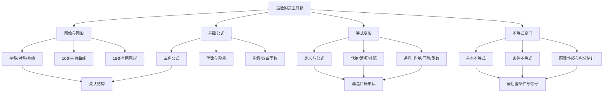

# 高数附录 图形、公式与变形技巧

> [!info] 教材与复核范围
> 来源：27张宇基础30讲高数.pdf，印刷页 546-578 / PDF p551-p583，共33页。
> 已逐页 OCR（1337行文字骨架），阅读9张全页联系图并逐页查看全部33张高清原页；10类平面图形、18类空间图形、6道正式例题及教材穿插示例均已反查。数学公式、函数定义域、图形方向和不等号以高清原页为准。

## 本讲速览

- 六个附录不是零散“公式表”，而是高数全书的工具箱：**图像怎么变、常见图形怎么认、基础公式怎么调、复杂式子怎么变到可用定理的形状**。
- 图形题先从方程读出对称、轴向、截面和参数范围；积分区域不熟时，优先回本附录查平面曲线与空间曲面。
- 公式必须连同条件记忆：根式要定号，分母要非零，对数真数要正，反双曲函数要看定义域，等价变形要可逆。
- 等式变形的目标是制造定义、公式、差分、乘积或可积结构；不等式变形的目标是把待估量缩成已知上界/下界。
- 数列递推优先试作差、同除、取倒数、移项配成线性递推；根式、三角和幂式分别优先想到共轭、配方与取对数。
- 使用顺序：**看题面信号 -> 明确目标形状 -> 选变形工具 -> 检查条件与可逆性 -> 再调用定理或公式**。

## 教材路线

| 教材顺序 | 内容 | 印刷页 / PDF页 | 复习任务 |
|---|---|---|---|
| 附录1 | 图像变换 | 546-548 / p551-p553 | 平移、对称、隐式曲线对称判据、伸缩 |
| 附录2 | 常用平面图形 | 549-551 / p554-p556 | 10类极坐标、参数曲线及其方向和对称性 |
| 附录3 | 常用空间图形 | 552-554 / p557-p559 | 18类曲面、交线和曲面片的识别 |
| 附录4 | 重要公式 | 555-557 / p560-p562 | 三角、二次方程、因式分解、阶乘 |
| 附录5 | 从指数函数到双曲函数 | 558-562 / p563-p567 | 指数/对数、双曲函数、反双曲函数 |
| 附录6 | 变形技巧 | 563-578 / p568-p583 | 定义、代换、消项、递推、共轭及不等式估计 |

## 前置知识与关联导航

- 函数性质、复合与反函数：[[01_高数第1讲_函数极限与连续#一、函数|函数基础]]。
- 导数定义、中值定理和泰勒公式：[[03_高数第3讲_一元函数微分学的概念#2. 导数定义|导数定义]]、[[06_高数第6讲_一元函数微分学的应用二#3. 拉格朗日中值定理|拉格朗日中值定理]]、[[06_高数第6讲_一元函数微分学的应用二#5. 泰勒公式（皮亚诺余项）|泰勒公式]]。
- 一元积分计算、极坐标面积与弧长：[[09_高数第9讲_一元函数积分学的计算|一元积分计算]]、[[10_高数第10讲_一元函数积分学的应用一_几何应用|积分几何应用]]。
- 二重积分与空间曲面识别：[[14_高数第14讲_二重积分|二重积分]]、[[17_高数第17讲_多元函数积分学的预备知识#三、空间曲线与曲面|空间曲线与曲面]]。
- 数列递推、级数和幂级数：[[02_高数第2讲_数列极限|数列极限]]、[[16_高数第16讲_无穷级数|无穷级数]]。
- 正式高数主线已在[[18_高数第18讲_多元函数积分学|高数第18讲]]收束；本附录负责把全书常用识图和变形工具集中起来。

## 知识网络

## 知识点清单

## 一、附录1 图像变换

### 1. 平移变换

设原图像为 $y=f(x)$。

| 新图像 | 对原图像的操作 | 快速记忆 |
|---|---|---|
| $y=f(x+x_0)$ | 向左平移 $x_0$ | 括号内符号与方向相反 |
| $y=f(x-x_0)$ | 向右平移 $x_0$ | 横坐标先满足$x-x_0=$原横坐标 |
| $y=f(x)+y_0$ | 向上平移 $y_0$ | 括号外符号与方向相同 |
| $y=f(x)-y_0$ | 向下平移 $y_0$ | 纵坐标整体减小 |

一般地，$y=f(x-a)+b$ 是把 $y=f(x)$ 向右移 $a$、向上移 $b$；若 $a,b$ 为负，方向自动反转。

> [!tip] 看到什么想到它
> 出现 $x-a$、$x+a$、$f(x)\pm b$，先不要重新作图，直接找原图像的“关键点、零点、渐近线”整体平移。渐近线 $x=c$ 也随横移变为 $x=c+a$。

### 2. 对称变换

| 新图像 | 作图规则 |
|---|---|
| $y=-f(x)$ | 关于 $x$ 轴对称 |
| $y=f(-x)$ | 关于 $y$ 轴对称 |
| $y=-f(-x)$ | 关于原点对称 |
| $y=f^{-1}(x)$ | 在反函数存在的区间内，关于 $y=x$ 对称 |
| $y=|f(x)|$ | $x$轴上方不动，下方部分翻到上方 |
| $y=f(|x|)$ | 保留 $x\ge0$ 部分，再关于$y$轴复制到左侧 |

**必须分清两个绝对值：**$|f(x)|$ 改纵坐标，$f(|x|)$ 改自变量；前者图像必在 $x$ 轴上方，后者图像必为偶函数。

> [!warning] 易错边界
> $f^{-1}(x)$ 表示反函数，不是 $1/f(x)$。原函数若在整个定义域不单调，应先限制到单调区间，再讨论反函数图像。

### 3. 隐式曲线的对称判据

对曲线 $F(x,y)=0$，本质是“完成相应坐标变换后，方程表示的点集不变”。教材给出以下直接判据：

| 对称对象 | 检验方式 |
|---|---|
| $y$轴 | $F(-x,y)=F(x,y)$ |
| 直线$x=T$ | $F(T+x,y)=F(T-x,y)$ |
| $x$轴 | $F(x,-y)=F(x,y)$ |
| 直线$y=T$ | $F(x,T+y)=F(x,T-y)$ |
| 原点 | $F(-x,-y)=F(x,y)$ |
| 点$(a,0)$ | $F(a+x,y)=F(a-x,-y)$ |
| 直线$y=x$ | $F(y,x)=F(x,y)$ |

- 关于 $x=T$、$y=T$、$(a,0)$ 的判据，分别是 $y$轴、$x$轴、原点对称的平移版本。
- 实际判断只要求变换前后得到**等价方程**；若整体乘了非零常数，点集仍不变。
- 参数曲线先找参数替换。例如摆线
  $$
  x=t-\sin t,\qquad y=1-\cos t
  $$
  在一个周期内用 $t\mapsto2\pi-t$，可看出关于 $x=\pi$ 对称。

教材示例识别：$y^2=x^3-x^4$ 关于$x$轴对称；$y^2=(1-x)^3$ 关于点$(1,0)$对称；$x^3+y^3-3xy=0$ 关于$y=x$对称。

> [!tip] 看到什么想到它
> 隐式方程要求对称性、积分区域看似复杂但换元后不变、或需要判断奇函数积分是否为0时，先做坐标替换，不要凭图感猜。

### 4. 伸缩变换

以下先取 $k>0$：

| 新图像 | 伸缩规则 |
|---|---|
| $y=f(kx)$ | 横坐标缩为原来的 $1/k$；$k>1$ 横向压缩，$0<k<1$ 横向拉伸 |
| $y=kf(x)$ | 纵坐标变为原来的 $k$ 倍；$k>1$ 纵向拉伸，$0<k<1$ 纵向压缩 |

若 $k<0$，除按 $|k|$ 伸缩外，还要补相应的轴对称。判断变化时最好追踪点：原点 $(u,f(u))$ 在 $y=f(kx)$ 上对应 $(u/k,f(u))$。

## 二、附录2 常用平面图形

### 1. 极坐标曲线的统一读法

极坐标曲线不要只背轮廓，按四步画：

1. 看 $r(\theta)$ 的周期，确定最小作图区间。
2. 解 $r=0$ 找极点，解 $|r|$ 最大找花瓣或鼓包方向。
3. 用 $r(-\theta)$、$r(\pi-\theta)$ 判断关于极轴或$y$轴的对称。
4. 若 $r<0$，点应画到角度 $\theta+\pi$ 的方向，不可把负半径丢掉。

### 2. 十类常用平面图形

| 序号 | 名称与方程 | 图像抓手 | 常见用途 |
|---:|---|---|---|
| 1 | 心形线 $r=a(1\pm\cos\theta)$、$r=a(1\pm\sin\theta)$，$a>0$ | $cos$型关于$x$轴、$\sin$型关于$y$轴；令括号为0找尖点，正号向对应正轴鼓起 | 极坐标面积、弧长、旋转体 |
| 2 | 伯努利双纽线 $r^2=a^2\cos2\theta$ 或 $r^2=a^2\sin2\theta$ | $\cos2\theta$ 两瓣沿$x$轴，$\sin2\theta$ 两瓣沿两条对角线；只取右端非负的角区间 | 分区积分、角度范围判断 |
| 3 | 阿基米德螺线 $r=a\theta$，$a>0,\theta\ge0$ | 半径随角度线性增长，相邻两圈间距恒定 $2\pi a$ | 参数/极坐标弧长与面积 |
| 4 | 对数螺线 $r=e^{a\theta}$，$a>0$ | 半径按指数增长，转相同角度时半径按固定倍数变化 | 指数与极坐标结合 |
| 5 | 双曲螺线 $r\theta=a$，$a>0$ | $\theta\to0^+$ 时$r\to\infty$；$\theta\to\infty$ 时$r\to0$ | 反比例型极坐标区域 |
| 6 | 三叶玫瑰线 $r=a\sin3\theta$ 或 $a\cos3\theta$ | 周期 $2\pi/3$；令三倍角取$\pm1$找花瓣轴，共3瓣 | 利用周期只算一瓣再倍乘 |
| 7 | 四叶玫瑰线 $r=a\sin2\theta$ 或 $a\cos2\theta$ | $\sin2\theta$ 花瓣沿对角线，$\cos2\theta$ 沿坐标轴，共4瓣 | 极坐标对称与分区 |
| 8 | 摆线 $x=a(t-\sin t),y=a(1-\cos t)$，$a>0$ | 一拱 $0\le t\le2\pi$；尖点在两端，最高点$(\pi a,2a)$，关于$x=\pi a$对称 | 参数曲线弧长、面积、旋转 |
| 9 | 星形线 $x=a\cos^3t,y=a\sin^3t$ | 等价于 $x^{2/3}+y^{2/3}=a^{2/3}$；四个尖点在坐标轴上 | 参数化、弧长、面积 |
| 10 | 笛卡尔叶形线 $x^3+y^3-3axy=0$ | 关于$y=x$对称；参数式 $x=\frac{3at}{1+t^3},y=\frac{3at^2}{1+t^3}$，第一象限成叶瓣 | 隐式对称、参数积分 |

> [!note] 参数范围决定“画哪一段”
> 方程名称相同不代表积分路径相同。题目若指定“一拱”“一瓣”“第一象限”或曲线方向，必须先把它翻译成参数区间，再写积分限。

## 三、附录3 常用空间图形

### 1. 空间图形的统一识别法

1. **缺哪个变量**：方程不含某变量，通常沿该变量方向无限延伸，是柱面。
2. **固定一个变量看截面**：截面是圆、椭圆还是双曲线，可判断曲面开口和轴向。
3. **令变量为0看坐标面截痕**：三条截痕比凭空想象可靠。
4. **找定义域与符号限制**：根式、第一卦限、$z\ge0$ 往往只保留半个曲面。
5. **联立方程先消元**：交线常落在某个平面或投影为椭圆/圆，消元后更容易定积分区域。

### 2. 十八类常用空间图形

| 序号 | 方程/边界 | 图形与识别要点 |
|---:|---|---|
| 1 | $z=\sqrt{a^2-x^2-y^2}$，$a>0$ | 半径$a$的上半球面；投影域$x^2+y^2\le a^2$ |
| 2 | $x/a+y/b+z/c=1$，$x,y,z\ge0$ | 第一卦限截距平面片，三截距为$a,b,c$ |
| 3 | $z=\sqrt{x^2+y^2}$ | 上半圆锥面，柱坐标为$z=r$ |
| 4 | $x^2+y^2=z^2$ | 上下双圆锥面；不加$z\ge0$不能只画上半部 |
| 5 | $z=x^2+y^2$ | 绕$z$轴的旋转抛物面，向上开口，水平截面为圆 |
| 6 | $x^2+y^2=a^2,z\ge0$ | 圆柱侧面的上半部分；方程不含$z$故沿$z$方向延伸 |
| 7 | $x^2/a^2+y^2/b^2-z^2/c^2=1$ | 单叶双曲面；负项变量$z$给轴向，$z=0$有腰部椭圆 |
| 8 | $x^2/a^2-y^2/b^2-z^2/c^2=1$ | 双叶双曲面；唯一正项$x$给轴向，$|x|\ge a$ |
| 9 | $\sqrt x+\sqrt y+\sqrt z=\sqrt a$ | 仅在第一卦限，三个坐标轴截距均为$a$；根式使面向原点一侧弯曲 |
| 10 | $z=xy$ | 双曲抛物面（马鞍面）；沿$y=x$上弯，沿$y=-x$下弯 |
| 11 | $z=xy$，由$y=x,x=1,z=0$围成 | 投影在$xy$面由$y=x,x=1$和$x=0$限定；先画投影再取曲面片 |
| 12 | $z=xy$，由$x+y=1,z=0$围成 | 第一象限三角投影上的马鞍面片；$z=0$对应$x=0$或$y=0$ |
| 13 | $z=xy$ 与 $x^2+y^2=a^2$ | 圆柱上截出的空间闭曲线；可令$x=a\cos t,y=a\sin t$参数化 |
| 14 | $z=x^2+y^2$ 与 $z=1-x^2$ | 消去$z$得$2x^2+y^2=1$，投影为椭圆 |
| 15 | $x^2+y^2=1$ 与 $z=1-x^2$ | 在圆柱上有$z=y^2$，可用圆柱参数$x=\cos t,y=\sin t$ |
| 16 | $x^2+(y-z)^2=(1-z)^2,0\le z\le1$ | 固定$z$得到圆心$(0,z)$、半径$1-z$的圆；向上收缩到一点 |
| 17 | $z=x^2+y^2$ 与 $x^2+(y-1)^2=1$ | 由圆柱式得$x^2+y^2=2y$，故交线同时位于平面$z=2y$ |
| 18 | $z=2(x^2+y^2)$，$x^2+y^2=x,2x$，$z=0$ | 两偏心圆柱之间、抛物面下方与$z=0$上方限定的空间体；极坐标边界为$r=\cos\theta,2\cos\theta$ |

> [!tip] 看到什么想到它
> 曲面交线、曲面积分边界或三重积分区域：先消元找投影，再决定直角/柱面坐标。含$x^2+y^2$优先尝试$r^2$；方程不含某变量优先判断柱面。

## 四、附录4 重要公式

### 1. 三角函数基本关系与诱导公式

#### 1.1 同角关系

$$
\sin^2x+\cos^2x=1,\qquad
\tan x=\frac{\sin x}{\cos x},\qquad
\cot x=\frac{\cos x}{\sin x},
$$

$$
1+\tan^2x=\sec^2x,\qquad
1+\cot^2x=\csc^2x.
$$

所有分式关系都要求分母非零。

#### 1.2 周期、奇偶与诱导

$$
\sin(x+2k\pi)=\sin x,\quad
\cos(x+2k\pi)=\cos x,\quad
\tan(x+k\pi)=\tan x.
$$

$$
\sin(-x)=-\sin x,quad \cos(-x)=\cos x,quad \tan(-x)=-\tan x.
$$

常用互余关系：

$$
\sin\left(\frac\pi2-x\right)=\cos x,qquad
\cos\left(\frac\pi2-x\right)=\sin x,
$$

$$
\sin\left(\frac\pi2+x\right)=\cos x,qquad
\cos\left(\frac\pi2+x\right)=-\sin x.
$$

统一记忆：**奇数个 $\pi/2$ 时函数名改变，偶数个不变；最终符号看原角所在象限，即“奇变偶不变，符号看象限”**。

### 2. 和差、倍角、半角与三倍角

#### 2.1 和差公式

$$
\sin(\alpha\pm\beta)=\sin\alpha\cos\beta\pm\cos\alpha\sin\beta,
$$

$$
\cos(\alpha\pm\beta)=\cos\alpha\cos\beta\mp\sin\alpha\sin\beta,
$$

$$
\tan(\alpha\pm\beta)=
\frac{\tan\alpha\pm\tan\beta}{1\mp\tan\alpha\tan\beta},
$$

$$
\cot(\alpha+\beta)=
\frac{\cot\alpha\cot\beta-1}{\cot\alpha+\cot\beta},qquad
\cot(\alpha-\beta)=
\frac{\cot\alpha\cot\beta+1}{\cot\beta-\cot\alpha}.
$$

使用正切、余切公式时，原式及右端分母都要有意义。

#### 2.2 倍角与三倍角

$$
\sin2\alpha=2\sin\alpha\cos\alpha,
$$

$$
\cos2\alpha=\cos^2\alpha-\sin^2\alpha
=1-2\sin^2\alpha=2\cos^2\alpha-1,
$$

$$
\tan2\alpha=\frac{2\tan\alpha}{1-\tan^2\alpha},qquad
\cot2\alpha=\frac{\cot^2\alpha-1}{2\cot\alpha},
$$

$$
\sin3\alpha=3\sin\alpha-4\sin^3\alpha,qquad
\cos3\alpha=4\cos^3\alpha-3\cos\alpha.
$$

#### 2.3 半角与降幂

$$
\sin^2\frac\alpha2=\frac{1-\cos\alpha}{2},qquad
\cos^2\frac\alpha2=\frac{1+\cos\alpha}{2},
$$

$$
\tan\frac\alpha2
=\frac{1-\cos\alpha}{\sin\alpha}
=\frac{\sin\alpha}{1+\cos\alpha}
=\pm\sqrt{\frac{1-\cos\alpha}{1+\cos\alpha}},
$$

$$
\cot\frac\alpha2
=\frac{1+\cos\alpha}{\sin\alpha}
=\frac{\sin\alpha}{1-\cos\alpha}
=\pm\sqrt{\frac{1+\cos\alpha}{1-\cos\alpha}}.
$$

根号前正负由 $\alpha/2$ 所在象限决定；分式形式还要检查分母。

### 3. 积化和差、和差化积与万能代换

#### 3.1 积化和差

$$
\sin\alpha\sin\beta
=\frac12[\cos(\alpha-\beta)-\cos(\alpha+\beta)],
$$

$$
\cos\alpha\cos\beta
=\frac12[\cos(\alpha-\beta)+\cos(\alpha+\beta)],
$$

$$
\sin\alpha\cos\beta
=\frac12[\sin(\alpha+\beta)+\sin(\alpha-\beta)],
$$

$$
\cos\alpha\sin\beta
=\frac12[\sin(\alpha+\beta)-\sin(\alpha-\beta)].
$$

#### 3.2 和差化积

$$
\sin\alpha+\sin\beta
=2\sin\frac{\alpha+\beta}{2}\cos\frac{\alpha-\beta}{2},
$$

$$
\sin\alpha-\sin\beta
=2\cos\frac{\alpha+\beta}{2}\sin\frac{\alpha-\beta}{2},
$$

$$
\cos\alpha+\cos\beta
=2\cos\frac{\alpha+\beta}{2}\cos\frac{\alpha-\beta}{2},
$$

$$
\cos\alpha-\cos\beta
=-2\sin\frac{\alpha+\beta}{2}\sin\frac{\alpha-\beta}{2}.
$$

#### 3.3 万能代换

令 $u=\tan(x/2)$，在不跨越代换奇点的区间内有

$$
\sin x=\frac{2u}{1+u^2},\qquad
\cos x=\frac{1-u^2}{1+u^2},\qquad
dx=\frac{2\,du}{1+u^2}.
$$

教材以 $-\pi<x<\pi$ 说明主区间。它把 $\sin x,\cos x$ 的有理式积分转为 $u$ 的有理函数，但若简单凑微分可解，不必机械使用万能代换。

> [!tip] 看到什么想到它
> 同频率平方想到降幂；不同频率乘积想到积化和差；$a\sin x+b\cos x$想到辅助角；三角有理式且常规换元失败时再考虑万能代换。

### 4. 一元二次方程

对 $ax^2+bx+c=0$，$a\ne0$：

$$
\Delta=b^2-4ac,qquad
x_{1,2}=\frac{-b\pm\sqrt\Delta}{2a}.
$$

- 实数范围：$\Delta>0$ 两个不等实根，$\Delta=0$ 二重实根，$\Delta<0$ 无实根。
- 在复数范围总有两根（计重数）。
- 韦达定理：
  $$
  x_1+x_2=-\frac ba,qquad x_1x_2=\frac ca.
  $$
- 反向使用时，若已知和 $S$、积 $P$，可令两数为方程 $t^2-St+P=0$ 的两根。

### 5. 因式分解与二项式定理

$$
a^2-b^2=(a-b)(a+b),
$$

$$
a^3-b^3=(a-b)(a^2+ab+b^2),qquad
a^3+b^3=(a+b)(a^2-ab+b^2).
$$

对正整数 $n$：

$$
a^n-b^n=(a-b)(a^{n-1}+a^{n-2}b+\cdots+ab^{n-2}+b^{n-1}),
$$

当 $n$ 为奇数时：

$$
a^n+b^n=(a+b)(a^{n-1}-a^{n-2}b+\cdots-ab^{n-2}+b^{n-1}).
$$

二项式定理：

$$
(a+b)^n=\sum_{k=0}^n\binom nk a^{n-k}b^k,qquad
\binom nk=\frac{n!}{k!(n-k)!}.
$$

题目出现 $a^n-b^n$、$x^n-1$、差商或有限等比和时，先提取 $a-b$；出现局部幂展开时，二项式定理常比逐项相乘更快。

### 6. 阶乘与双阶乘

$$
n!=1\cdot2\cdots n,qquad 0!=1,
$$

$$
(2n)!!=2\cdot4\cdots(2n)=2^n n!,
$$

$$
(2n-1)!!=1\cdot3\cdots(2n-1).
$$

还常用

$$
(2n)!= (2n)!!(2n-1)!!,qquad
(2n-1)!!=\frac{(2n)!}{2^n n!}.
$$

这些关系常出现在幂级数系数、三角积分递推和组合数化简中。

## 五、附录5 从指数函数到双曲函数

### 1. 指数函数与自然指数

指数函数

$$
y=a^x,\qquad a>0, a\ne1
$$

恒过 $(0,1)$，值恒正。$a>1$ 时严格递增，$0<a<1$ 时严格递减；$y=a^{-x}$ 是 $y=a^x$ 关于 $y$ 轴的对称图像。

自然指数 $e^x$ 的核心优势是导数不改变自身：

$$
(e^x)'=e^x,qquad (e^{kx})'=ke^{kx}.
$$

微分方程 $y'=ky$ 的非零解为

$$
y=Ce^{kx}.
$$

这解释了自然增长、衰减和连续复利为什么统一出现 $e^{kx}$。

### 2. 自然对数与常用对数

$$
\ln x=\ln10\cdot\lg x,qquad
\lg x=\lg e\cdot\ln x,qquad x>0,
$$

其中

$$
\ln10\approx2.302585,qquad
\lg e\approx0.434294.
$$

换底公式的一般形式为

$$
\log_a x=\frac{\ln x}{\ln a},qquad a>0, a\ne1, x>0.
$$

> [!warning] 易错边界
> 对数式必须先写真数、底数条件。由 $a^b=c^d$ 取对数得到 $b\ln a=d\ln c$，要求两边底数为正；若原式可能为0或负数，不能直接取实对数。

### 3. 双曲函数定义与图像

教材记号为 $\operatorname{sh}x,\operatorname{ch}x,\operatorname{th}x$；现代教材也常写 $\sinh x,\cosh x,\tanh x$。

$$
\operatorname{sh}x=\frac{e^x-e^{-x}}2,qquad
\operatorname{ch}x=\frac{e^x+e^{-x}}2,qquad
\operatorname{th}x=\frac{\operatorname{sh}x}{\operatorname{ch}x}.
$$

| 函数 | 奇偶与范围 | 图像抓手 |
|---|---|---|
| $\operatorname{sh}x$ | 奇函数，值域$\mathbb R$ | 严格递增，过原点 |
| $\operatorname{ch}x$ | 偶函数，$\operatorname{ch}x\ge1$ | 在$(0,1)$取最小值，两端上升 |
| $\operatorname{th}x$ | 奇函数，值域$(-1,1)$ | 严格递增，水平渐近线$y=\pm1$ |

指数函数与双曲函数可互相还原：

$$
e^x=\operatorname{ch}x+\operatorname{sh}x,qquad
e^{-x}=\operatorname{ch}x-\operatorname{sh}x.
$$

由定义直接求导：

$$
(\operatorname{sh}x)'=\operatorname{ch}x,qquad
(\operatorname{ch}x)'=\operatorname{sh}x,qquad
(\operatorname{th}x)'=\frac1{\operatorname{ch}^2x}.
$$

### 4. 双曲函数恒等式

和差公式：

$$
\operatorname{sh}(u\pm v)
=\operatorname{sh}u\operatorname{ch}v
\pm\operatorname{ch}u\operatorname{sh}v,
$$

$$
\operatorname{ch}(u\pm v)
=\operatorname{ch}u\operatorname{ch}v
\pm\operatorname{sh}u\operatorname{sh}v.
$$

基本恒等式：

$$
\operatorname{ch}^2u-\operatorname{sh}^2u=1,qquad
1-\operatorname{th}^2u=\frac1{\operatorname{ch}^2u}.
$$

倍角公式：

$$
\operatorname{sh}2u=2\operatorname{sh}u\operatorname{ch}u,
$$

$$
\operatorname{ch}2u
=\operatorname{ch}^2u+\operatorname{sh}^2u
=2\operatorname{ch}^2u-1
=1+2\operatorname{sh}^2u.
$$

与三角函数相比，最容易错的是 $\operatorname{ch}^2u-\operatorname{sh}^2u=1$ 的符号，以及 $\operatorname{ch}(u\pm v)$ 中间符号与括号内同号。

### 5. 反双曲函数

#### 5.1 反双曲正弦

$$
y=\operatorname{arsh}x
=\ln\left(x+\sqrt{x^2+1}\right),qquad x\in\mathbb R.
$$

它是 $y=\operatorname{sh}x$ 的反函数，定义域和值域均为 $\mathbb R$。

#### 5.2 反双曲余弦

双曲余弦在整个实轴不是一一函数。若只取 $y\ge0$ 的主支，则

$$
y=\operatorname{arch}x
=\ln\left(x+\sqrt{x^2-1}\right),qquad x\ge1, y\ge0.
$$

若把 $\operatorname{ch}y=x$ 看作两支反关系，则

$$
y=\pm\ln\left(x+\sqrt{x^2-1}\right),qquad x\ge1.
$$

并且由共轭关系

$$
\left(x+\sqrt{x^2-1}\right)
\left(x-\sqrt{x^2-1}\right)=1
$$

得到

$$
\ln\left(x-\sqrt{x^2-1}\right)
=-\ln\left(x+\sqrt{x^2-1}\right).
$$

#### 5.3 反双曲正切

$$
y=\operatorname{arth}x
=\frac12\ln\frac{1+x}{1-x},qquad |x|<1.
$$

反函数图像与原函数图像关于 $y=x$ 对称。看到 $\ln(x+\sqrt{x^2\pm1})$ 时，应主动识别为反双曲函数结构，这常能简化求导、积分和反函数讨论。

## 六、附录6 变形技巧

### 1. 变形的目标与底线

“会变形”不是把式子越写越长，而是把题目变成某个已知入口：定义、基本公式、差分、等比、完全平方、共轭、单调性或标准不等式。

1. **先看目标**：要证存在点，就造中值定理；要求极限，就造等价无穷小/夹逼；要求和，就造差分；要求界，就造标准不等式。
2. **等式变形要合法**：除法先查非零，开方要定号，平方或取对数要补条件。
3. **等价与推出不同**：$A\Leftrightarrow B$ 要双向可逆；只需证明时可用单向放缩，但必须朝目标方向。
4. **记录等号条件**：不等式链中任一环节不能同时取等，最终等号就不存在。

### 2. 定义变形

#### 2.1 用极限定义制造可用差值

教材穿插示例：若 $f$ 可导、

$$
\lim_{x\to+\infty}[x-f(x)]=0,qquad f(1)<1,
$$

要得到某点 $f'(\eta)>1$，不能直接对极限式求导。令

$$
\varepsilon=1-f(1)>0,
$$

由极限定义取充分大的 $\xi>1$，使

$$
\xi-f(\xi)<1-f(1),
$$

即

$$
\frac{f(\xi)-f(1)}{\xi-1}>1.
$$

再由拉格朗日中值定理，存在 $\eta\in(1,\xi)$ 使 $f'(\eta)>1$。

**迁移模板：**极限信息先转成“对充分大/充分近的点成立的不等式”，再把两点函数值差转成导数。

#### 2.2 从商的极限读函数值与导数

若 $f$ 在 $x_0$ 连续，且

$$
\lim_{x\to x_0}\frac{f(x)}{x-x_0}=a
$$

为有限数，则先由分母趋0且商有界得到 $f(x_0)=0$，进而

$$
f'(x_0)=\lim_{x\to x_0}\frac{f(x)-f(x_0)}{x-x_0}=a.
$$

若 $f$ 在 $x_0$ 邻域可导，且

$$
\lim_{x\to x_0}\frac{f(x)}{(x-x_0)^2}=a
$$

有限，则可依次读出 $f(x_0)=0$、$f'(x_0)=0$；本质是 $f$ 的低阶项必须消失。

#### 2.3 相切条件与局部上下关系

曲线 $y=f(x)$ 与 $y=g(x)$ 在 $x_0$ 相切，只能推出

$$
f(x_0)=g(x_0),qquad f'(x_0)=g'(x_0).
$$

要判断谁在上方，研究 $h=f-g$：若 $h''(x_0)>0$，则 $x_0$ 是 $h$ 的局部极小点，附近有 $f\ge g$；若 $f''(x_0)>0,g''(x_0)<0$，则 $h''(x_0)>0$。

> [!tip] 看到什么想到它
> 商的分母是 $(x-x_0)^m$，想到“前$m-1$阶项必须为0”；两曲线相切，想到作差并看更高阶导，而不是仅凭切线相同判断上下。

### 3. 公式变形

公式法的关键不是背得多，而是认出“目标公式缺哪一块”。

- 出现 $f(x)-f(x_0)-f'(x_0)(x-x_0)$，想到泰勒余项或可微定义。
- 出现 $f(b)-f(a)$，想到中值定理或积分 $\int_a^b f'(x)dx$。
- 出现 $a^n-b^n$，想到提取 $a-b$；出现三角乘积，想到积化和差。
- 公式有唯一性条件时必须一并使用。例如泰勒系数由各阶导数唯一确定，不能只比较外形。

### 4. 代换与消元

#### 4.1 复杂整体代换

看到重复出现的复杂表达式，把它作为整体。例如含

$$
\ln\left(1+\sqrt{\frac{1+x}{x}}\right)
$$

时，可令其为 $t$，先研究 $t$ 与 $x$ 的关系，再把原式降层。整体代换是否有效，要看替换后能否消去根式、对数或复合层。

#### 4.2 平移代换

- 研究 $x\to1$：令 $t=x-1\to0$，把非零点极限搬到原点。
- 区间内存在点：若只知 $a<b$，可令 $c=a+\varepsilon$，其中 $0<\varepsilon<b-a$，把“有间距”量化。
- 固定中心或对称点：令 $x=m+t$，常可显出奇偶性与配方结构。

#### 4.3 大小、比值、和与积的消元

| 已知关系 | 推荐代换 | 作用 |
|---|---|---|
| $x_1>x_2$ | $x_1=x_2+t, t>0$ | 把大小关系变成正参数 |
| $x_1,x_2>0$ | $x_1=tx_2, t>0$ | 把二元比较变成比值函数 |
| $x+y=S$ | $x=S/2+t,y=S/2-t$ | 显出对称与平方项 |
| $x+y+z=1$ | $x=1/3+t_1,y=1/3+t_2,z=1/3-t_1-t_2$ | 消去线性约束 |
| $x_1x_2=a^2$ | $x_1=at,x_2=a/t$，$t>0$ | 固定积转成单变量 |

教材还给出跨章构造：若 $x,y,z>0$ 且 $x+y+z=1$，把 $x,y,z$ 看成概率，令随机变量分别取 $2/x,1/y,1/z$，由 $\operatorname{Var}X\ge0$ 可导出

$$
\frac4x+\frac1y+\frac1z\ge16.
$$

这里真正应记的是：**正数和为1 + 加权平方/倒数和**，可尝试构造概率分布，把代数不等式转为方差非负或柯西不等式。

### 5. 消项法

#### 5.1 加法裂项

目标是把通项写成相邻差：

$$
\frac1{n(n+k)}=\frac1k\left(\frac1n-\frac1{n+k}\right),
$$

$$
\frac1{(2n-1)(2n+1)}
=\frac12\left(\frac1{2n-1}-\frac1{2n+1}\right),
$$

$$
\frac1{n(n+1)(n+2)}
=\frac12\left[\frac1{n(n+1)}-\frac1{(n+1)(n+2)}\right].
$$

其他常见差分：

$$
q^{n+1}-q^n=(q-1)q^n,qquad
\ln\frac{n+1}{n}=\ln(n+1)-\ln n,
$$

$$
\sqrt{n+1}-\sqrt n
=\frac1{\sqrt{n+1}+\sqrt n}.
$$

分式递推若直接相加无结构，可先取倒数再裂项。教材的非线性递推示例经倒数变形后可连锁消项，得到 $a_n=1/[n(n+1)]$。

#### 5.2 乘法消项

若能写出

$$
\frac{b_{n+1}}{b_n}=r_n,
$$

则连乘得到 $b_n=b_1\prod r_k$。含部分和 $S_n$ 的递推，常先求 $S_n/S_{n-1}$，再由 $a_n=S_n-S_{n-1}$ 还原通项。教材示例用此法把连乘化简到阶乘结构。

#### 5.3 借位消项

有限等比和可通过“乘公比后错位相减”得到

$$
1+q+\cdots+q^n=\frac{1-q^{n+1}}{1-q},\qquad q\ne1.
$$

这类方法的共同点是：人为制造相同项，使中间大批抵消，只留下边界项。
