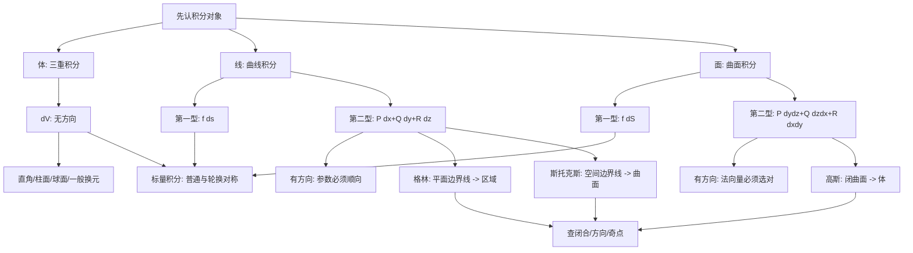

# 高数第18讲 多元函数积分学

> [!info] 教材与复核范围
> 来源：27张宇基础30讲高数.pdf，印刷页 488-545 / PDF p493-p550，共58页。
> 本讲为教材标注的“仅数学一”内容。
> 本讲已逐页 OCR（2335行文字骨架），阅读15张全页联系图并逐页查看全部58张高清原页；例18.1-18.30、练习18.1-18.11及答案均已逐题反查。数学公式、曲面方向、积分限和正负号以高清原页为准。

## 本讲速览

- 本讲把“在区域上累加”推广到三维区域、曲线和曲面；先识别积分对象，再判断它是否带方向。
- 三重积分、第一型曲线积分、第一型曲面积分都是**标量积分**：微元 $dV,ds,dS$ 均为正，优先用普通对称性、轮换对称性和坐标变换。
- 第二型曲线积分、第二型曲面积分是**向量场的功与通量**：换方向会变号，不能脱离 $dx,dy,dz$ 或法向量谈“几何对称”。
- 格林、高斯、斯托克斯分别完成“平面边界线 $\to$ 平面区域”“闭曲面 $\to$ 空间区域”“空间边界线 $\to$ 张成曲面”的转换。
- 三大公式不是见到闭合就套：必须检查光滑性、方向、奇点和区域拓扑；非闭合先补，含奇点先挖或换路/换面。
- 做题总入口：**对象与类型 $\to$ 方向 $\to$ 直接参数法还是转换公式 $\to$ 对称/换元 $\to$ 符号复核**。

## 教材路线

| 教材顺序 | 内容 | 印刷页 / PDF页 | 复习任务 |
|---|---|---|---|
| 开篇 | 考题、目标、知识结构图 | 488 / p493 | 区分五类积分，建立三大公式主线 |
| 一 | 三重积分 | 489-506 / p494-p511 | 概念、性质、对称性、三套坐标、换元、几何物理应用 |
| 二 | 第一型曲线积分 | 507-512 / p512-p517 | $ds$、四类参数表示、对称性、弧长与线质量 |
| 三 | 第一型曲面积分 | 512-519 / p517-p524 | $dS$、一投二代三计算、分片投影、面积与面质量 |
| 四 | 平面第二型曲线积分 | 519-528 / p524-p533 | 功、参数法、格林公式、路径无关与原函数 |
| 五 | 第二型曲面积分 | 529-538 / p534-p543 | 通量、方向、投影、高斯公式、补面与挖洞 |
| 六 | 空间第二型曲线积分 | 538-541 / p543-p546 | 参数法、斯托克斯公式、张成曲面选择 |
| 练习 | 基础习题与答案 | 541-545 / p546-p550 | 11道综合题反查 |

## 前置知识与关联导航

- 二重积分、区域换序、极坐标与对称性：[[14_高数第14讲_二重积分#10. 极坐标变换|极坐标变换]]、[[14_高数第14讲_二重积分|二重积分]]。
- 空间曲线、曲面、法向量、梯度、散度和旋度：[[17_高数第17讲_多元函数积分学的预备知识#三、空间曲线与曲面|空间曲线与曲面]]、[[17_高数第17讲_多元函数积分学的预备知识#5. 散度|散度]]、[[17_高数第17讲_多元函数积分学的预备知识#6. 旋度|旋度]]。
- 一元定积分的换元、对称性和几何物理应用：[[09_高数第9讲_一元函数积分学的计算|一元积分计算]]、[[10_高数第10讲_一元函数积分学的应用一_几何应用|一元积分几何应用]]。
- 本讲是高数正文最后一讲；常用图形、重要公式和变形技巧集中见[[18A_高数附录_图形公式与变形技巧|高数附录]]。

## 知识网络

## 知识点清单

## 一、三重积分

### 1. 三重积分定义

在有界闭区域 $\Omega$ 上把区域分成体积为 $\Delta V_i$ 的小块，在每块取点 $(\xi_i,\eta_i,\zeta_i)$。若不依赖分割与取点方式的极限

$$
\lim_{\lambda\to0}\sum_{i=1}^n
f(\xi_i,\eta_i,\zeta_i)\Delta V_i
$$

存在，则称 $f$ 在 $\Omega$ 上可积，记为

$$
\iiint_\Omega f(x,y,z)\,dV.
$$

- $dV$ 是无方向的体积微元，始终为正。
- 几何上是对空间区域内函数值的累加；物理上若密度为 $\rho$，质量为 $M=\iiint_\Omega\rho\,dV$。
- 连续函数在有界闭区域上可积；考研计算通常从“描述 $\Omega$”转为“给三个变量定限”。

> [!tip] 看到什么想到它
> 出现实体质量、体积、形心、转动惯量、空间密度或三维区域累加，先考虑三重积分。第一步不是选坐标，而是画出/写清区域边界。

### 2. 性质

设以下积分均存在，教材性质可归为七条：

1. **体积**：$\iiint_\Omega1\,dV=V(\Omega)$。
2. **有界性**：可积函数在有界闭区域上必有界。
3. **线性性**：
   $$
   \iiint_\Omega(af+bg)\,dV
   =a\iiint_\Omega f\,dV+b\iiint_\Omega g\,dV.
   $$
4. **区域可加性**：若 $\Omega=\Omega_1\cup\Omega_2$ 且内部不重叠，则积分等于两部分之和。
5. **保序与绝对值估计**：$f\le g\Rightarrow\iiint f\le\iiint g$，且
   $$
   \left|\iiint_\Omega f\,dV\right|
   \le\iiint_\Omega|f|\,dV.
   $$
6. **估值**：若 $m\le f\le M$，则
   $$
   mV(\Omega)\le\iiint_\Omega f\,dV\le MV(\Omega).
   $$
7. **积分中值定理**：若 $f$ 连续，则存在 $(\xi,\eta,\zeta)\in\Omega$，使
   $$
   \iiint_\Omega f\,dV=f(\xi,\eta,\zeta)V(\Omega).
   $$

这些性质与二重积分同源；做题时最常用的是线性、分区、对称性和估值。

### 3. 对称性

#### 3.1 普通对称性

若 $\Omega$ 关于坐标面 $x=0$ 对称：

$$
\iiint_\Omega f(x,y,z)\,dV=
\begin{cases}
0, & f(-x,y,z)=-f(x,y,z),\\
2\iiint_{\Omega\cap\{x\ge0\}}f\,dV,
& f(-x,y,z)=f(x,y,z).
\end{cases}
$$

关于 $y=0,z=0$ 同理。判断时必须同时检查**区域**和**被积函数**；只有被积函数奇偶而区域不对称，不能消项。

#### 3.2 轮换对称性

若交换 $x,y$ 后区域不变，则

$$
\iiint_\Omega f(x,y,z)\,dV
=\iiint_\Omega f(y,x,z)\,dV.
$$

若区域对 $x,y,z$ 任意轮换不变，则

$$
\iiint_\Omega x^2\,dV
=\iiint_\Omega y^2\,dV
=\iiint_\Omega z^2\,dV
=\frac13\iiint_\Omega(x^2+y^2+z^2)\,dV.
$$

例18.1的关键是四面体在变量轮换下不变，所以 $x,y,z$ 的积分相等；线性组合只需把系数相加。例18.3则把球内 $z^2$ 化为径向函数的三分之一。

> [!warning] 易错边界
> “图形看起来对称”不等于变量可轮换。轮换对称要求交换变量后，区域方程、范围和测度都不变。

### 4. 直角坐标计算

#### 4.1 先一后二：投影穿线法

先投影到 $xOy$ 面，设

$$
D_{xy}=\operatorname{proj}_{xOy}\Omega,
\qquad z_1(x,y)\le z\le z_2(x,y),
$$

则

$$
\iiint_\Omega f\,dV
=\iint_{D_{xy}}
\left[\int_{z_1(x,y)}^{z_2(x,y)}f(x,y,z)\,dz\right]dxdy.
$$

也可投到 $yOz$ 或 $zOx$。口诀是：**先投影、再穿线；内层下界到上界，外层按二重积分定限**。

适合：某一方向上下边界容易写成单值函数，或者被积函数先对该变量积分明显简化。

#### 4.2 先二后一：定限截面法

先固定一个变量，例如 $z$，截面为

$$
D_z=\{(x,y):(x,y,z)\in\Omega\},
$$

则

$$
\iiint_\Omega f\,dV
=\int_a^b\left[\iint_{D_z}f(x,y,z)\,dxdy\right]dz.
$$

适合：截面形状简单、截面积可直接求，尤其是旋转体、锥台、球体和分段截面。

例18.1两种次序都可做：直接投影逐层积分，或利用 $z$ 截面是相似三角形先求截面积。选法标准是“哪种描述区域最短”。

### 5. 柱面坐标

取

$$
x=r\cos\theta,
\qquad y=r\sin\theta,
\qquad z=z,
\qquad dV=r\,dr\,d\theta\,dz.
$$

其中 $r\ge0$，$\theta$ 是 $xOy$ 面内的极角。多出来的 $r$ 是二维极坐标雅可比，绝不能漏。

**适用信号**：区域或被积函数反复出现 $x^2+y^2$、圆柱、旋转抛物面、绕 $z$ 轴旋转体。

常见定限次序：

$$
\iiint_\Omega f\,dV
=\int_{\theta_1}^{\theta_2}
\int_{r_1(\theta)}^{r_2(\theta)}
\int_{z_1(r,\theta)}^{z_2(r,\theta)}
f(r\cos\theta,r\sin\theta,z),r\,dz\,dr\,d\theta.
$$

例18.2先把偏心圆柱在 $xOy$ 面的投影写成极坐标边界，再由抛物面给 $z$ 上界。这里“用柱面坐标”不意味着固定一种积分次序，仍要选择最简单的投影。

### 6. 球面坐标

教材采用

$$
\begin{cases}
x=r\sin\varphi\cos\theta,\\
y=r\sin\varphi\sin\theta,\\
z=r\cos\varphi,
\end{cases}
\qquad
dV=r^2\sin\varphi\,dr\,d\varphi\,d\theta.
$$

- $r\ge0$：到原点距离；
- $0\le\theta\le2\pi$：绕 $z$ 轴的方位角；
- $0\le\varphi\le\pi$：与 $z$ 轴正向的夹角。

**定限图像法**：从原点沿方向 $(\theta,\varphi)$ 发射射线，第一次进入区域是 $r$ 下界，离开区域是 $r$ 上界。球面给 $r=$ 常数，锥面给 $\varphi=$ 常数，过原点的半平面给 $\theta=$ 常数。

**适用信号**：$x^2+y^2+z^2$、球、锥与球组合、径向函数。

例18.4中锥面给 $0\le\varphi\le\pi/4$，平面 $z=1$ 给 $r\cos\varphi=1$，故 $r\le\sec\varphi$。这类题先定角，再沿射线定半径。

> [!warning] 角度约定
> 有些教材交换 $\theta,\varphi$ 的含义。本讲必须按上式使用；背公式时把 $z=r\cos\varphi$ 和雅可比 $r^2\sin\varphi$ 绑在一起。

### 7. 一般换元法

设

$$
x=x(u,v,w),\quad y=y(u,v,w),\quad z=z(u,v,w)
$$

在变换区域内一一对应、连续可微，且雅可比不为0，则

$$
\iiint_\Omega f(x,y,z)\,dxdydz
=\iiint_{\Omega'}f(x(u,v,w),y(u,v,w),z(u,v,w))
\left|\frac{\partial(x,y,z)}{\partial(u,v,w)}\right|dudvdw.
$$

雅可比取绝对值，因为体积微元不带方向。柱面坐标和球面坐标就是该公式的特殊情形：

$$
\left|\frac{\partial(x,y,z)}{\partial(r,\theta,z)}\right|=r,
\qquad
\left|\frac{\partial(x,y,z)}{\partial(r,\varphi,\theta)}\right|=r^2\sin\varphi.
$$

例18.5把椭球作线性伸缩变为单位球，再接球面坐标。看到椭球型二次式时，先想“缩放成球”，并把缩放系数计入雅可比。

### 8. 几何与物理应用

#### 8.1 体积、质量与形心

$$
V=\iiint_\Omega dV,
\qquad
M=\iiint_\Omega\rho\,dV.
$$

质心为

$$
\bar x=\frac1M\iiint_\Omega x\rho\,dV,
\quad
\bar y=\frac1M\iiint_\Omega y\rho\,dV,
\quad
\bar z=\frac1M\iiint_\Omega z\rho\,dV.
$$

均匀密度时 $M=\rho V$，质心就是形心：

$$
\bar x=\frac1V\iiint_\Omega x\,dV,
\quad
\bar y=\frac1V\iiint_\Omega y\,dV,
\quad
\bar z=\frac1V\iiint_\Omega z\,dV.
$$

形心已知时可反用 $\iiint x\,dV=\bar xV$。例18.6对平移椭球配方后直接读出形心，例18.7用“矩/体积”求抛物面帽的 $\bar z$。

#### 8.2 转动惯量

对三坐标轴和原点：

$$
\begin{aligned}
I_x&=\iiint_\Omega(y^2+z^2)\rho\,dV,\\
I_y&=\iiint_\Omega(z^2+x^2)\rho\,dV,\\
I_z&=\iiint_\Omega(x^2+y^2)\rho\,dV,\\
I_O&=\iiint_\Omega(x^2+y^2+z^2)\rho\,dV.
\end{aligned}
$$

记忆原则：转轴惯量的 integrand 是“点到该轴距离的平方 $\times$ 密度”。

#### 8.3 引力

空间物体密度为 $\rho(x,y,z)$，外部质点 $M_0(x_0,y_0,z_0)$ 质量为 $m$。令

$$
R=\sqrt{(x-x_0)^2+(y-y_0)^2+(z-z_0)^2},
$$

则引力向量可写为

$$
\boldsymbol F
=Gm\iiint_\Omega
\rho(x,y,z)
\frac{(x-x_0,\ y-y_0,\ z-z_0)}{R^3}\,dV.
$$

若只求某分量，取对应坐标差；先用区域对称性判断横向分量是否为0，再积分。

## 二、第一型曲线积分

### 1. 第一型曲线积分的概念与性质

设光滑曲线弧 $L$ 被分成弧长为 $\Delta s_i$ 的小段，在每段取点 $(\xi_i,\eta_i,\zeta_i)$。若极限

$$
\lim_{\lambda\to0}\sum_i f(\xi_i,\eta_i,\zeta_i)\Delta s_i
$$

存在，则称为 $f$ 对弧长的曲线积分：

$$
\int_L f(x,y,z)\,ds.
$$

$ds$ 是弧长微元，始终为正，所以积分与曲线走向无关：

$$
\int_{L^-}f\,ds=\int_{L^+}f\,ds.
$$

物理背景是线密度为 $\rho$ 的细线质量 $M=\int_L\rho\,ds$。

教材性质与三重积分平行：

1. $\int_L1\,ds=l(L)$；
2. 可积函数有界；
3. 线性性；
4. 曲线弧可加性；
5. 保序性与 $\left|\int_Lf\,ds\right|\le\int_L|f|\,ds$；
6. 若 $m\le f\le M$，则 $ml(L)\le\int_Lf\,ds\le Ml(L)$；
7. 若 $f$ 连续，则存在曲线上一点 $\xi$，使 $\int_Lf\,ds=f(\xi)l(L)$。

> [!tip] 看到什么想到它
> 出现“沿曲线的线密度、弧长、细线质量、形心、转动惯量”，且写 $ds$ 或没有指定走向，优先判断为第一型曲线积分。

### 2. 第一型曲线积分的对称性

第一型曲线积分是标量积分，普通对称性与轮换对称性可直接使用。

- 若 $L$ 关于 $yOz$ 面对称，$f$ 关于 $x$ 为奇函数，则 $\int_Lf\,ds=0$；为偶函数则等于半边的2倍。
- 若交换 $x,y$ 后曲线不变，则 $\int_Lf(x,y,z)\,ds=\int_Lf(y,x,z)\,ds$。
- 圆、球面与平面交成的圆常有轮换/旋转对称；先把曲线约束代入被积函数，再判断通常更快。

例18.10在球面与平面交圆上利用约束和轮换对称；例18.11利用平移圆周的形心与轮换对称反求积分。

### 3. 第一型曲线积分计算：一投二代三计算

计算本质是把 $ds$ 化成单参数的正微元，同时把曲线方程代入被积函数。

#### 3.1 平面显式曲线

若 $y=y(x)$，$x$ 从 $a$ 到 $b$，则

$$
ds=\sqrt{1+[y'(x)]^2}\,dx,
$$

$$
\int_Lf(x,y)\,ds
=\int_a^b f(x,y(x))\sqrt{1+[y'(x)]^2}\,dx.
$$

若 $x=x(y)$，则

$$
ds=\sqrt{1+[x'(y)]^2}\,dy.
$$

这里上下限按坐标的最小值到最大值写，因为 $ds>0$，与曲线方向无关。例18.8就是显式法后作一元换元。

#### 3.2 平面参数曲线

若

$$
x=x(t),\qquad y=y(t),\qquad \alpha\le t\le\beta,
$$

则

$$
ds=\sqrt{[x'(t)]^2+[y'(t)]^2}\,dt.
$$

参数区间取小到大即可。

#### 3.3 极坐标曲线

若 $r=r(\theta)$，则

$$
ds=\sqrt{r^2(\theta)+[r'(\theta)]^2}\,d\theta.
$$

例18.9的曲线和被积函数都含 $x^2+y^2$，极坐标可同时简化两者。不要只看曲线选坐标，也要看 integrand。

#### 3.4 空间参数曲线

若

$$
\boldsymbol r(t)=(x(t),y(t),z(t)),
$$

则

$$
ds=|\boldsymbol r'(t)|dt
=\sqrt{x'^2(t)+y'^2(t)+z'^2(t)}\,dt.
$$

### 4. 几何与物理应用

#### 4.1 弧长、质量与形心

$$
l=\int_Lds,
\qquad
M=\int_L\rho\,ds.
$$

空间细线的质心：

$$
\bar x=\frac1M\int_Lx\rho\,ds,
\quad
\bar y=\frac1M\int_Ly\rho\,ds,
\quad
\bar z=\frac1M\int_Lz\rho\,ds.
$$

均匀细线时分母为 $\rho l$，可约去密度；已知形心时可反用 $\int_Lx\,ds=\bar x\,l$。

#### 4.2 转动惯量

$$
\begin{aligned}
I_x&=\int_L(y^2+z^2)\rho\,ds,\\
I_y&=\int_L(z^2+x^2)\rho\,ds,\\
I_z&=\int_L(x^2+y^2)\rho\,ds,\\
I_O&=\int_L(x^2+y^2+z^2)\rho\,ds.
\end{aligned}
$$

平面细线在 $xOy$ 面内时，$I_x=\int_Ly^2\rho\,ds$，$I_y=\int_Lx^2\rho\,ds$。

> [!important] 能否代入区域方程
> 曲线积分只在曲线本身上累加，因此曲线方程可直接代入 integrand；三重积分在区域内部累加，边界方程通常不能对内部点使用。

## 三、第一型曲面积分

### 1. 第一型曲面积分的概念与性质

把光滑曲面 $\Sigma$ 分成面积为 $\Delta S_i$ 的小片，在每片取点。极限

$$
\iint_\Sigma f(x,y,z)\,dS
$$

称为 $f$ 对面积的曲面积分。$dS>0$，不带方向，因此曲面取哪一侧不影响第一型曲面积分。

物理背景是面密度为 $\rho$ 的薄壳质量：

$$
M=\iint_\Sigma\rho\,dS.
$$

性质仍与三重积分同构：

1. $\iint_\Sigma1\,dS=S(\Sigma)$；
2. 可积函数有界；
3. 线性性；
4. 曲面可加性；
5. 保序性与绝对值估计；
6. $mS\le\iint_\Sigma f\,dS\le MS$；
7. 连续函数满足积分中值定理。

### 2. 第一型曲面积分的对称性

- 普通对称：曲面关于坐标面对称，integrand 对相应变量为奇函数则积分为0，为偶函数则取半面2倍。
- 轮换对称：交换变量后曲面不变，则交换后的积分相等。
- 球面上常用
  $$
  \iint_\Sigma x^2\,dS
  =\iint_\Sigma y^2\,dS
  =\iint_\Sigma z^2\,dS
  =\frac13\iint_\Sigma(x^2+y^2+z^2)\,dS.
  $$

例18.13利用椭球的切平面距离与面积微元配合；例18.14先化简曲面密度和投影边界，再用极坐标。

### 3. 第一型曲面积分计算：一投二代三计算

#### 3.1 投影到 $xOy$ 面

若曲面可写为 $z=z(x,y)$，且向 $xOy$ 面投影一一对应，则

$$
dS=\sqrt{1+z_x^2+z_y^2}\,dxdy,
$$

$$
\iint_\Sigma f(x,y,z)\,dS
=\iint_{D_{xy}}
f(x,y,z(x,y))\sqrt{1+z_x^2+z_y^2}\,dxdy.
$$

步骤就是：

1. **一投**：求投影域 $D_{xy}$；
2. **二代**：把 $z=z(x,y)$ 代入 integrand；
3. **三计算**：乘面积因子后做二重积分。

#### 3.2 投影到另外两个坐标面

若 $y=y(x,z)$：

$$
dS=\sqrt{1+y_x^2+y_z^2}\,dxdz.
$$

若 $x=x(y,z)$：

$$
dS=\sqrt{1+x_y^2+x_z^2}\,dydz.
$$

选投影面的标准不是习惯，而是：能否写成单值函数、投影是否一一对应、面积因子是否简单。例18.12的柱面片投到 $xOy$ 会退化成线，必须改投到 $xOz$ 或 $yOz$。

#### 3.3 投影重叠时分片

若一条投影线穿过曲面多次，不能把整张曲面直接写成一个显式函数。处理方式：

1. 换一个投影面；
2. 将曲面拆成若干单值曲面片分别积分；
3. 分片边界常由“切平面的法向量与投影轴垂直”确定，即投影方向上的法向分量为0。

### 4. 三类常用面积微元

1. 圆柱面 $x^2+y^2=a^2$ 的单张前/后半面投到 $xOz$ 面：
   $$
   dS=\frac{a}{\sqrt{a^2-x^2}}\,dxdz.
   $$
2. 球面 $x^2+y^2+z^2=a^2$ 的上/下半面投到 $xOy$ 面：
   $$
   dS=\frac{a}{\sqrt{a^2-x^2-y^2}}\,dxdy.
   $$
3. 圆锥面 $z=\sqrt{x^2+y^2}$：
   $$
   dS=\sqrt2\,dxdy.
   $$

这些公式不是孤立背诵，均由显式曲面面积微元得到。考试中先判断投影范围，再套面积因子。

### 5. 几何与物理应用

$$
S=\iint_\Sigma dS,
\qquad
M=\iint_\Sigma\rho\,dS.
$$

质心为

$$
\bar x=\frac1M\iint_\Sigma x\rho\,dS,
\quad
\bar y=\frac1M\iint_\Sigma y\rho\,dS,
\quad
\bar z=\frac1M\iint_\Sigma z\rho\,dS.
$$

转动惯量：

$$
\begin{aligned}
I_x&=\iint_\Sigma(y^2+z^2)\rho\,dS,\\
I_y&=\iint_\Sigma(z^2+x^2)\rho\,dS,\\
I_z&=\iint_\Sigma(x^2+y^2)\rho\,dS,\\
I_O&=\iint_\Sigma(x^2+y^2+z^2)\rho\,dS.
\end{aligned}
$$

均匀薄壳已知形心时同样可反求一阶矩。与第一型曲线积分一样，积分域是曲面本身，曲面方程可以代入 integrand。

## 四、平面第二型曲线积分

### 1. 变力做功、概念与性质

质点沿有向曲线 $L$ 从 $A$ 运动到 $B$，力场

$$
\boldsymbol F(x,y)=P(x,y)\boldsymbol i+Q(x,y)\boldsymbol j
$$

所做的功为

$$
W=\int_L\boldsymbol F\cdot d\boldsymbol r
=\int_LP\,dx+Q\,dy.
$$

它是向量场沿有向曲线切向分量的累加，所以必须给方向。若 $\boldsymbol\tau^0=(\cos\alpha,\cos\beta)$ 为正向单位切向量，则

$$
dx=\cos\alpha\,ds,\qquad dy=\cos\beta\,ds,
$$

从而两类曲线积分的关系是

$$
\int_LP\,dx+Q\,dy
=\int_L(P\cos\alpha+Q\cos\beta)\,ds.
$$

性质只有三条核心：线性、曲线可加、反向变号：

$$
\int_{L^-}P\,dx+Q\,dy
=-\int_{L^+}P\,dx+Q\,dy.
$$

> [!important] 第一型与第二型的分水岭
> 第一型的 $ds>0$，反向不变；第二型的 $dx,dy$ 是有向微元，反向全部变号。题目出现“从A到B”“顺/逆时针”“正向”时，方向是第一检查项。

### 2. 基本参数法与“对称”判断

若

$$
L:\quad x=x(t),\quad y=y(t),\quad t:\alpha\to\beta
$$

且 $t$ 的增大方向与题目方向一致，则

$$
\int_LP\,dx+Q\,dy
=\int_\alpha^\beta
\big[P(x(t),y(t))x'(t)+Q(x(t),y(t))y'(t)\big]dt.
$$

这里 $\alpha,\beta$ 是起点、终点对应参数，不要求数值上 $\alpha<\beta$；方向不一致就交换上下限或换参数。

若 $L:y=y(x)$，从 $x=a$ 走到 $x=b$，则

$$
\int_LP\,dx+Q\,dy
=\int_a^b\big[P(x,y(x))+Q(x,y(x))y'(x)\big]dx.
$$

若 $x=x(y)$ 同理。做题顺序：**一投/参数化，二代曲线方程，三把 $dx,dy$ 都换成同一参数微元**。

第二型曲线积分没有脱离向量场和方向的“几何对称性”。配对对称点时，必须同时比较：

$$
P(x,y)dx,\qquad Q(x,y)dy
$$

在对应路径上的方向变化。例18.15的星形曲线要分弧并逐段配方向；例18.16把含参数的曲线积分化为 $I(a)$ 后，再用一元函数最值。

> [!tip] 直接法优先级
> 曲线参数方程简单，或曲线不闭合且补线反而复杂时，直接参数化最稳。先约束后展开，常能看到全微分或奇偶消项。

### 3. 格林公式

设 $D$ 是平面有界区域，$L=\partial D$ 为分段光滑闭曲线的**正向**，$P,Q$ 在含 $D$ 的开区域内具有一阶连续偏导，则

$$
\boxed{
\oint_LP\,dx+Q\,dy
=\iint_D\left(\frac{\partial Q}{\partial x}
-\frac{\partial P}{\partial y}\right)dxdy
}.
$$

正向的判据：沿 $L$ 行走时区域始终在左手边；外边界逆时针，洞的内边界顺时针。

格林公式把边界上的做功转成区域内二维旋度的累加。它的适用分三类。

#### 3.1 闭曲线，内部无奇点

核查：

1. $L$ 闭合；
2. 方向是否正向；
3. $P,Q$ 及一阶偏导在整个 $D$ 连续。

满足后直接计算 $Q_x-P_y$。例18.17若路径为顺时针，要先整体取负号。

#### 3.2 非闭曲线：补线封闭

添加一条容易积分的曲线 $L_1$，使 $L+L_1$ 成为正向闭边界：

$$
\int_LP\,dx+Q\,dy
=\oint_{L+L_1}P\,dx+Q\,dy
-\int_{L_1}P\,dx+Q\,dy.
$$

补线常选直线段、坐标轴或坐标常值线。例18.18补 $x=0$ 的线段后，闭积分交给格林，补线直接算。

#### 3.3 闭曲线内有奇点：挖洞或换路

若奇点外 $Q_x-P_y=0$，不能因为“旋度为0”就直接断言原闭积分为0；格林条件在奇点处失效。

在每个奇点周围挖去小洞，记小边界为 $L_i$。对穿孔区域用格林：

$$
\oint_LP\,dx+Q\,dy
=\sum_i\oint_{L_i^+}P\,dx+Q\,dy,
$$

其中右侧若统一按逆时针写，就要留意它与穿孔区域内边界正向相反。等价地，可把原路径换成任何包围相同奇点、绕向相同且更易算的闭曲线。

例18.19的分母在原点为0，虽然奇点外 $Q_x=P_y$，仍需挖洞；换成围绕原点的小椭圆后积分最简。

> [!warning] 格林公式四连查
> **闭合、方向、连续、奇点**。少查任何一项都可能导致整题符号或结论错误。

### 4. 路径无关、全微分与原函数

#### 4.1 概念与闭路判据

在区域 $G$ 内，若从任意 $A$ 到 $B$ 的积分只由端点决定，与路径无关，则称

$$
\int_LP\,dx+Q\,dy
$$

在 $G$ 内与路径无关。它等价于区域内每条闭曲线的积分为0：

$$
\oint_CP\,dx+Q\,dy=0.
$$

证明思路：两条 $A\to B$ 路径首尾拼接成闭曲线；反之把闭路积分拆成两条端点相同的路径。

#### 4.2 六个等价命题

设 $G$ 是**单连通区域**，$P,Q$ 在 $G$ 内有一阶连续偏导，则以下命题等价：

1. $Q_x-P_y=0$，即 $Q_x=P_y$；
2. 任意分段光滑闭曲线 $C\subset G$ 上 $\oint_C Pdx+Qdy=0$；
3. 两条同起点、同终点路径上的积分相等；
4. 存在二元函数 $u(x,y)$，使 $du=Pdx+Qdy$；
5. $Pdx+Qdy=0$ 是全微分方程；
6. $(P,Q)=\nabla u$。

其中“单连通”通俗地说就是区域没有洞。若区域有洞，$Q_x=P_y$ 只是局部条件，未必推出全局路径无关；例18.19就是反例模型。

例18.20给定单连通圆盘且已知路径无关，直接令 $Q_x=P_y$ 解参数；同时仍要检查分母在区域内是否为0。

#### 4.3 求原函数的两种方法

**方法一：先积分再匹配。** 由 $u_x=P$ 得

$$
u(x,y)=\int P(x,y)\,dx+\varphi(y),
$$

再对 $y$ 求导并与 $Q$ 比较，求 $\varphi'(y)$。也可先由 $u_y=Q$ 积分。

**方法二：折线路径。** 固定基点 $(x_0,y_0)$，沿水平后竖直：

$$
u(x,y)=
\int_{x_0}^{x}P(t,y_0)\,dt
+\int_{y_0}^{y}Q(x,s)\,ds+C.
$$

或沿竖直后水平：

$$
u(x,y)=
\int_{y_0}^{y}Q(x_0,s)\,ds
+\int_{x_0}^{x}P(t,y)\,dt+C.
$$

折线必须完全位于区域内。

#### 4.4 已知路径无关时怎样算积分

从 $A$ 到 $B$ 有三种等价入口：

1. 选最简单的直线或折线；
2. 求原函数，用 $u(B)-u(A)$；
3. 直接识别乘积微分，如 $u\,dv+v\,du=d(uv)$。

例18.21先由 $Q_x=P_y$ 求未知函数，再分别演示直线、折线和凑全微分三种做法。考试只选最短的一种，但要会相互核验。

## 五、第二型曲面积分

### 1. 向量场通量、概念与性质

空间向量场

$$
\boldsymbol F(x,y,z)
=P(x,y,z)\boldsymbol i+Q(x,y,z)\boldsymbol j+R(x,y,z)\boldsymbol k
$$

通过有向曲面 $\Sigma$ 指定侧的通量为

$$
\Phi=\iint_\Sigma\boldsymbol F\cdot\boldsymbol n\,dS
=\iint_\Sigma P\,dydz+Q\,dzdx+R\,dxdy.
$$

这里

$$
\boldsymbol n=(\cos\alpha,\cos\beta,\cos\gamma),
\qquad
(dydz,dzdx,dxdy)=\boldsymbol n\,dS
$$

是指定侧的单位法向量和有向面积微元。由此得到两类曲面积分的关系：

$$
\iint_\Sigma P\,dydz+Q\,dzdx+R\,dxdy
=\iint_\Sigma(P\cos\alpha+Q\cos\beta+R\cos\gamma)\,dS.
$$

性质：线性、曲面可加、换侧变号：

$$
\iint_{\Sigma^-}\boldsymbol F\cdot d\boldsymbol S
=-\iint_{\Sigma^+}\boldsymbol F\cdot d\boldsymbol S.
$$

通常规定闭曲面流出为正、流入为负；“外侧”就是闭域的外法向。

> [!important] 第二型曲面积分没有纯几何对称
> 对称点处不只比较 $P,Q,R$，还要比较法向量三个分量的方向。稳妥做法是先写 $\boldsymbol F\cdot\boldsymbol n$，或逐项检查 $P\,dydz,Q\,dzdx,R\,dxdy$。

### 2. 基本方法与转换投影法

#### 2.1 拆成三个投影积分

$$
\iint_\Sigma P\,dydz+Q\,dzdx+R\,dxdy
=\iint_\Sigma P\,dydz
+\iint_\Sigma Q\,dzdx
+\iint_\Sigma R\,dxdy.
$$

每项只能投到与有向微元对应的坐标面：

| 项 | 投影面 | 投影微元 |
|---|---|---|
| $P\,dydz$ | $yOz$ | $dydz$ |
| $Q\,dzdx$ | $zOx$ | $dzdx$ |
| $R\,dxdy$ | $xOy$ | $dxdy$ |

若曲面在相应坐标面上的投影退化成线，则该项为0；若投影重叠，必须分片。$dydz,dzdx,dxdy$ 不能随意互换。

例18.22把旋转生成的闭曲面按上底、下底、侧面分片，每片分别判断外法向及投影符号。

#### 2.2 正向单位法向量

若 $\Sigma:z=z(x,y)$：

$$
\boldsymbol n
=\pm\frac{(-z_x,-z_y,1)}
{\sqrt{1+z_x^2+z_y^2}},
$$

上侧取“$+$”，下侧取“$-$”。

若 $\Sigma:y=y(x,z)$：

$$
\boldsymbol n
=\pm\frac{(-y_x,1,-y_z)}
{\sqrt{1+y_x^2+y_z^2}},
$$

$y$ 正向（右侧）取“$+$”，$y$ 负向（左侧）取“$-$”。

若 $\Sigma:x=x(y,z)$：

$$
\boldsymbol n
=\pm\frac{(1,-x_y,-x_z)}
{\sqrt{1+x_y^2+x_z^2}},
$$

$x$ 正向（前侧）取“$+$”，$x$ 负向（后侧）取“$-$”。

教材口诀：**上正下负、右正左负、前正后负**。例18.23、18.24分别训练锥面下侧和圆柱后半面法向量。

#### 2.3 转换投影定理

若 $\Sigma:z=z(x,y)$，投影域为 $D_{xy}$，则

$$
\boxed{
\iint_\Sigma P\,dydz+Q\,dzdx+R\,dxdy
=\pm\iint_{D_{xy}}
\big(-Pz_x-Qz_y+R\big)\,dxdy
}.
$$

$P,Q,R$ 中的 $z$ 均先代成 $z(x,y)$；上侧取正，下侧取负。它本质是

$$
\boldsymbol F\cdot\boldsymbol n\,dS
=\boldsymbol F\cdot\big[\pm(-z_x,-z_y,1)\big]dxdy.
$$

例18.25将抛物面上侧的通量化为圆域上的二重积分，展开后先用奇偶对称消掉奇次项，再用极坐标。

> [!warning] 同样写成 $dxdy$，含义并不同
> 左侧第二型曲面积分中的 $dxdy$ 是有向面积投影分量；右侧二重积分中的 $dxdy$ 是正的平面面积微元。方向信息已经进入前面的正负号。

### 3. 高斯公式

设空间有界闭区域 $\Omega$ 的边界 $\Sigma=\partial\Omega$ 分片光滑并取**外侧**，$P,Q,R$ 在含 $\Omega$ 的开区域内有一阶连续偏导，则

$$
\boxed{
\oiint_\Sigma
P\,dydz+Q\,dzdx+R\,dxdy
=\iiint_\Omega
\left(P_x+Q_y+R_z\right)dV
}.
$$

其中

$$
\operatorname{div}\boldsymbol F=P_x+Q_y+R_z
$$

是散度，表示单位体积的源汇强度。闭曲面通量等于内部总“源量”；若取内侧，结果整体变号。

#### 3.1 闭曲面，内部无奇点

直接用高斯公式，再用三重积分的对称性、柱面坐标或球面坐标。例18.26先求散度，再利用区域关于坐标面的对称性消去奇函数项。

#### 3.2 非闭曲面：补面

补上容易处理的曲面 $\Sigma_0$，使 $\Sigma+\Sigma_0$ 成为闭曲面，并统一为闭域外法向：

$$
\iint_\Sigma\boldsymbol F\cdot d\boldsymbol S
=\iiint_\Omega\operatorname{div}\boldsymbol F\,dV
-\iint_{\Sigma_0}\boldsymbol F\cdot d\boldsymbol S.
$$

如果原曲面的指定侧与闭域外侧相反，先变号。例18.27的下半球“上侧”与其所在闭域的外法向关系必须画图判断，补圆盘后才能正确加减。

#### 3.3 闭曲面内有奇点：挖洞或换面

若奇点外

$$
\operatorname{div}\boldsymbol F=0,
$$

则在不穿越奇点的区域内通量守恒。围住相同奇点、方向同为向外的任意两个闭曲面，其通量相等；可把复杂曲面换成小球面。

操作时在奇点周围挖小球，穿孔区域的内边界法向指向洞内，与小球自身外法向相反。例18.28的径向场在原点不连续，不能直接用高斯；换成小球后，场与法向平行，积分立即化简。

#### 3.4 分片连续与绝对值

高斯公式要求一阶偏导连续。若分量含 $|x|$，在 $x=0$ 可能不可导，不能把整个场硬塞进高斯公式。可按 $x>0,x<0$ 分域，或把该分量单独利用通量对称性处理。例18.29就是这种“可用部分用高斯，不可用部分另算”的综合题。

> [!warning] 高斯公式四连查
> **闭面、外侧、连续、奇点**。非闭面补面；含奇点挖洞/换面；指定侧与闭域外侧不一致时先处理符号。

## 六、空间第二型曲线积分

### 1. 概念

空间向量场

$$
\boldsymbol F=(P,Q,R)
$$

沿有向空间曲线 $\Gamma$ 的做功为

$$
\int_\Gamma\boldsymbol F\cdot d\boldsymbol r
=\int_\Gamma P\,dx+Q\,dy+R\,dz.
$$

它与平面第二型曲线积分同属有向积分：反向整体变号，曲线可加。

### 2. 参数法

若

$$
\Gamma:\quad x=x(t),\quad y=y(t),\quad z=z(t),
\qquad t:\alpha\to\beta
$$

的参数增大方向与题目方向一致，则

$$
\int_\Gamma P\,dx+Q\,dy+R\,dz
=\int_\alpha^\beta
\big(Px'(t)+Qy'(t)+Rz'(t)\big)dt.
$$

这是始终可用的基本法。空间交线若能消元成椭圆/圆，再参数化通常最直接。

### 3. 直接法还是转换法

| 题面特征 | 首选 |
|---|---|
| 参数方程现成、曲线简单 | 参数法 |
| 闭合空间曲线，旋度比原场简单 | 斯托克斯公式 |
| 曲线不闭合，但补一条直线后边界简单 | 补线 + 斯托克斯 |
| 同一边界可张成平面与复杂曲面 | 选平面 |
| 向量场在某点/曲线上有奇异 | 先检查张成曲面能否避开奇点 |

### 4. 斯托克斯公式

设 $\Sigma$ 是分片光滑有向曲面，边界为闭曲线 $\Gamma=\partial\Sigma$；$\Gamma$ 的方向与 $\Sigma$ 的法向量满足右手规则，$P,Q,R$ 在含 $\Sigma$ 的开区域内有一阶连续偏导，则

$$
\boxed{
\oint_\Gamma P\,dx+Q\,dy+R\,dz
=\iint_\Sigma
\begin{vmatrix}
dydz & dzdx & dxdy\\
\partial/\partial x & \partial/\partial y & \partial/\partial z\\
P & Q & R
\end{vmatrix}
}.
$$

等价地，

$$
\boxed{
\oint_\Gamma\boldsymbol F\cdot d\boldsymbol r
=\iint_\Sigma(\nabla\times\boldsymbol F)\cdot\boldsymbol n\,dS
}.
$$

右手规则：右手四指沿 $\Gamma$ 正向弯曲，大拇指指向曲面正侧法向量。若边界方向固定，法向量也随之固定。

#### 4.1 为什么可以换张成曲面

在向量场光滑且两曲面之间没有奇点时，同一有向边界所张成的曲面形状不影响结果：

$$
\iint_{\Sigma_1}(\nabla\times\boldsymbol F)\cdot\boldsymbol n_1\,dS
=\iint_{\Sigma_2}(\nabla\times\boldsymbol F)\cdot\boldsymbol n_2\,dS.
$$

因此空间曲线即使来自球面、柱面交线，也可改选由该曲线围成的平面片。若曲线不闭合，先补易算曲线，最后减去补线积分。

#### 4.2 与格林公式的关系

当 $\Sigma$ 是 $xOy$ 面内区域、正法向量为 $\boldsymbol k$，且 $R=0$ 时，斯托克斯公式退化为

$$
\oint_{\partial D}P\,dx+Q\,dy
=\iint_D(Q_x-P_y)\,dxdy,
$$

即格林公式。格林是二维斯托克斯。

例18.30有三条路线：直接参数化交线；补直径后在平面内选半圆盘用斯托克斯；按对称点配对有向微元。考试优先选择参数最短、法向量最简单的一条。

## 公式与二级结论索引

| 结论 | 完整条件/用途 | 详细讲解 |
|---|---|---|
| $\iiint_\Omega1\,dV=V$ | 体积；均匀密度形心分母 | [[18_高数第18讲_多元函数积分学#1. 三重积分定义\|三重积分定义]] |
| 普通对称：奇函数积分为0 | 区域也必须关于对应坐标面对称 | [[18_高数第18讲_多元函数积分学#3. 对称性\|三重积分对称性]] |
| 轮换对称：交换变量积分不变 | 交换变量后区域必须完全不变 | [[18_高数第18讲_多元函数积分学#3. 对称性\|轮换对称性]] |
| 柱面坐标 $dV=r\,dr\,d\theta\,dz$ | 圆柱、旋转体、$x^2+y^2$ | [[18_高数第18讲_多元函数积分学#5. 柱面坐标\|柱面坐标]] |
| 球面坐标 $dV=r^2\sin\varphi\,dr\,d\varphi\,d\theta$ | 球、锥、径向函数；按本讲角度约定 | [[18_高数第18讲_多元函数积分学#6. 球面坐标\|球面坐标]] |
| 一般换元乘 $\lvert J\rvert$ | 变换一一、连续可微、$J\ne0$ | [[18_高数第18讲_多元函数积分学#7. 一般换元法\|一般换元]] |
| $ds=\sqrt{1+y'^2}\,dx$ | 平面显式曲线，$ds>0$ | [[18_高数第18讲_多元函数积分学#3. 第一型曲线积分计算：一投二代三计算\|第一型曲线积分计算]] |
| $ds=\sqrt{x'^2+y'^2+z'^2}\,dt$ | 空间参数曲线，参数区间按小到大 | [[18_高数第18讲_多元函数积分学#3.4 空间参数曲线\|空间弧长微元]] |
| $dS=\sqrt{1+z_x^2+z_y^2}\,dxdy$ | $z=z(x,y)$ 且投影一一对应 | [[18_高数第18讲_多元函数积分学#3. 第一型曲面积分计算：一投二代三计算\|第一型曲面积分计算]] |
| $\int_LPdx+Qdy=\int(Px'+Qy')dt$ | 参数增大方向必须匹配路径方向 | [[18_高数第18讲_多元函数积分学#2. 基本参数法与“对称”判断\|平面第二型参数法]] |
| $\oint Pdx+Qdy=\iint(Q_x-P_y)dA$ | 正向闭曲线；$P,Q$ 在区域内 $C^1$ | [[18_高数第18讲_多元函数积分学#3. 格林公式\|格林公式]] |
| $Q_x=P_y$ | 单连通域且 $P,Q\in C^1$ 时等价于路径无关 | [[18_高数第18讲_多元函数积分学#4. 路径无关、全微分与原函数\|路径无关]] |
| $\iint_\Sigma\boldsymbol F\cdot\boldsymbol n\,dS$ | 第二型曲面积分；换侧变号 | [[18_高数第18讲_多元函数积分学#1. 向量场通量、概念与性质\|通量]] |
| $\pm\iint[-Pz_x-Qz_y+R]dxdy$ | $z=z(x,y)$；上正下负 | [[18_高数第18讲_多元函数积分学#2.3 转换投影定理\|第二型曲面投影]] |
| $\oiint_\Sigma\boldsymbol F\cdot d\boldsymbol S=\iiint_\Omega\operatorname{div}\boldsymbol F\,dV$ | 闭曲面外侧；场在闭域内 $C^1$ | [[18_高数第18讲_多元函数积分学#3. 高斯公式\|高斯公式]] |
| $\oint_\Gamma\boldsymbol F\cdot d\boldsymbol r=\iint_\Sigma(\nabla\times\boldsymbol F)\cdot\boldsymbol n\,dS$ | 闭边界与法向满足右手规则；场在曲面附近 $C^1$ | [[18_高数第18讲_多元函数积分学#4. 斯托克斯公式\|斯托克斯公式]] |
| 形心：一阶矩/总量 | 体、线、面分别用 $dV,ds,dS$ | [[18_高数第18讲_多元函数积分学#8. 几何与物理应用\|三重积分应用]] |
| 转轴惯量：到轴距离平方乘密度 | 积分微元由物体维数决定 | [[18_高数第18讲_多元函数积分学#8.2 转动惯量\|转动惯量]] |

## 题型-方法决策表

| 题面信号 | 首选方法 | 备选方法 | 最后检查 |
|---|---|---|---|
| 三维区域上下边界清楚 | 先一后二投影穿线 | 换积分次序 | 投影域是否完整 |
| 固定 $z$ 的截面简单 | 先二后一截面法 | 柱面坐标 | 截面是否分段 |
| 圆柱/旋转抛物面/$x^2+y^2$ | 柱面坐标 | 直角坐标 | 雅可比 $r$ |
| 球/锥/$x^2+y^2+z^2$ | 球面坐标 | 对称后柱面坐标 | $r^2\sin\varphi$ 与角度范围 |
| 椭球域 | 线性缩放成球 | 分层积分 | 绝对雅可比 |
| $ds$、线密度、无方向 | 第一型曲线积分 | 对称/形心反用 | $ds>0$ |
| $dS$、面密度、无方向 | 第一型曲面积分 | 分片/换投影面 | 投影一一对应 |
| $Pdx+Qdy$ 且路径简单 | 参数法 | 凑全微分 | 参数方向 |
| 平面闭曲线，无奇点 | 格林公式 | 参数法 | 正向与 $Q_x-P_y$ |
| 平面非闭曲线 | 补直线后格林 | 参数法 | 补线方向与减法 |
| 已知路径无关 | 求原函数或换简单路径 | 折线 | 单连通与奇点 |
| $P\,dydz+Q\,dzdx+R\,dxdy$，曲面显式 | 转换投影 | 分项投影 | 指定侧 |
| 闭曲面外侧，无奇点 | 高斯公式 | 分片直接算 | 散度、外法向 |
| 非闭曲面 | 补面后高斯 | 转换投影 | 原侧与闭域外侧关系 |
| 闭面含奇点且奇点外散度为0 | 挖洞/换小球 | 分片直接算 | 包围的奇点与方向 |
| 空间闭曲线 | 斯托克斯选易曲面 | 参数法 | 右手规则与场的光滑性 |
| 含绝对值或分片场 | 分域/拆分分量 | 对称性 | 不可导界面 |
| 求形心/惯量/通量最大 | 先写物理定义或转为体积分 | 对称与换元 | 分母、密度、非负区域 |

## 教材例题覆盖表

| 例题 | 核心知识 | 题面信号与解法入口 | 独有迁移点 |
|---|---|---|---|
| 18.1 | 三重积分轮换对称 | 四面体对变量轮换不变，线性 integrand | 系数和乘一个坐标积分，再用截面法 |
| 18.2 | 柱面坐标 | 偏心圆柱投影与旋转抛物面 | 先选投影；极坐标边界与雅可比同时写 |
| 18.3 | 球面对称 | 单位球内积分 $z^2$ | 化为 $\frac13\iiint(x^2+y^2+z^2)dV$ |
| 18.4 | 球面坐标定限 | 锥面、平面、空间距离 | 锥定 $\varphi$，平面定 $r\cos\varphi$ |
| 18.5 | 三重积分换元 | 椭球域与椭球二次式 | 线性缩放成球，勿漏雅可比 |
| 18.6 | 形心反用 | 平移椭球内 $\iiint z\,dV$ | 配方读中心，矩等于形心乘体积 |
| 18.7 | 旋转体形心 | 抛物面帽问竖坐标 | 分子矩除以体积，共用柱面坐标 |
| 18.8 | 第一型线积分显式法 | $y=y(x)$ | 写 $ds$ 后作一元换元 |
| 18.9 | 第一型线积分极坐标 | 圆与 $\sqrt{x^2+y^2}$ | 坐标系同时服务曲线和 integrand |
| 18.10 | 空间交圆轮换对称 | 球面与平面交线 | 先代曲线约束，再对称 |
| 18.11 | 第一型线积分形心 | 平移圆周二次式 | 圆心即形心，反求一阶矩 |
| 18.12 | 第一型曲面积分投影 | 柱面片投到某面退化 | 改投影面；投影必须一一对应 |
| 18.13 | 切平面距离 | 椭球上点到切平面距离 | 距离根式与 $dS$ 配合消去 |
| 18.14 | 曲面质量 | 圆锥被柱面截取且给密度 | 先消元求投影，锥面 $dS=\sqrt2dxdy$ |
| 18.15 | 第二型线积分参数法 | 含绝对值的分段闭曲线 | 分弧并配对有向微元 |
| 18.16 | 曲线族最值 | 路径含参数 $a$ 且问最小功 | 先化成 $I(a)$，再做一元最值 |
| 18.17 | 格林直接用 | 无奇点闭曲线 | 顺时针先变号 |
| 18.18 | 格林补线 | 非闭圆弧组合 | 补坐标线封闭，闭积分减补线 |
| 18.19 | 格林挖洞 | 奇点外 $Q_x=P_y$ | 换成包围同奇点的小曲线 |
| 18.20 | 路径无关判参 | 单连通域、含参数、已知路径无关 | 解 $Q_x=P_y$，同时查分母 |
| 18.21 | 原函数与换路 | 未知函数且路径无关 | 先求未知函数，再比较直线/折线/全微分 |
| 18.22 | 第二型曲面分片投影 | 旋转生成闭曲面、只含 $dxdy$ | 上下底和侧面分别定符号 |
| 18.23 | 法向量 | 显式锥面、下侧为正 | 先取 $(-z_x,-z_y,1)$，再按侧变号并单位化 |
| 18.24 | 法向量 | 圆柱外侧、后半面 | 写 $x=x(y,z)$，后侧令 $x$ 分量为负 |
| 18.25 | 转换投影 | 抛物面上侧通量 | 化二重积分后先奇偶消项 |
| 18.26 | 高斯直接用 | 闭面外侧、内部光滑 | 散度化三重积分，再用区域对称 |
| 18.27 | 高斯补面 | 半球非闭且指定上侧 | 补圆盘并统一外法向 |
| 18.28 | 高斯挖洞 | 原点奇异的径向场 | 任意包围原点的闭面通量相同 |
| 18.29 | 高斯综合 | 绝对值、分片通量 | 不光滑分量另算，其余再用高斯 |
| 18.30 | 空间第二型线积分 | 球面与平面交弧、给起终点 | 参数法、补线斯托克斯、有向对称三路互证 |

## 讲末练习反查

| 练习 | 必须能从笔记定位的规则 | 答案/结论 |
|---|---|---|
| 18.1 | 交圆上的第一型曲线积分：先代约束，再用轮换对称 | $18\pi$（B） |
| 18.2 | 球壳第一型曲面积分：球心就是均匀球面的形心 | $4\pi$（A） |
| 18.3 | 柱面与平面交线：可参数化，也可选平面片用斯托克斯 | $\pi$ |
| 18.4 | 正向圆周：先用圆方程化简分母，再用格林公式 | $\dfrac12\pi a^2$ |
| 18.5 | 单位球面：奇函数项为0，$x^2,y^2,z^2$ 轮换相等 | $\dfrac{16\pi}{3}$ |
| 18.6 | 正八面体：普通对称消 $x$，轮换对称处理 $\lvert y\rvert$，面积由8个全等三角形求 | $\dfrac{4\sqrt3}{3}$ |
| 18.7 | 球面外侧通量：先在边界上代 $x^2+y^2+z^2=a^2$，再用高斯 | $\dfrac{12}{5}\pi a^3$ |
| 18.8 | 抛物面帽：柱面坐标，$0\le r\le1$，$4r^2\le z\le4$ | $\dfrac{2\pi}{3}$ |
| 18.9 | $y=\sin x$ 的非闭有向弧：补端点连线，用格林后减补线 | $e^\pi+\pi^2$ |
| 18.10 | 抛物面上侧：补顶盘成闭面，原面方向与闭域外侧核对后用高斯 | $-\dfrac\pi2$ |
| 18.11 | 任意闭面通量先由高斯化为 $\iiint(1-x^2-4y^2-z^2)dV$；最大域取 integrand 非负处 | 最大曲面 $x^2+4y^2+z^2=1$，最大值 $\dfrac{4\pi}{15}$ |

> [!check] 练习反查结论
> 11道练习覆盖了轮换对称、形心反用、柱/球坐标、格林补线、斯托克斯选面、高斯补面与最值区域。若只看本笔记仍无法解释“为什么选这个方法、方向怎样定”，就说明对应知识块还没真正掌握。

## 易错点/易混点

1. **五类积分认错**：$ds,dS,dV$ 无方向；$Pdx+Qdy+Rdz$ 和 $P\,dydz+Q\,dzdx+R\,dxdy$ 有方向。
2. **只看 integrand 不看区域对称**：奇偶消项要求积分域也对称；轮换要求交换变量后区域不变。
3. **柱面坐标漏 $r$**：$dV=r\,dr\,d\theta\,dz$。
4. **球面坐标漏 $r^2\sin\varphi$**：且本讲 $\varphi$ 是与 $z$ 轴正向的夹角。
5. **球面定限次序背死**：应沿射线判断进入/离开；锥定角，球/平面定半径。
6. **一般换元不取绝对雅可比**：体积微元无方向，必须用 $|J|$。
7. **把边界方程用于区域内部**：曲线/曲面积分可代曲线/曲面方程，三重积分不能把边界关系强加给内部点。
8. **第一型曲线积分按方向写负号**：$ds>0$，反向不变。
9. **第一型曲面投影不是一一对应**：投影重叠必须分片，投影退化必须换平面。
10. **只会投到 $xOy$**：柱面向某平面可能退化，选能写成单值函数的投影面。
11. **第二型曲线参数方向错**：参数上下限必须从起点对应值走到终点对应值。
12. **把第一型的对称性照搬到第二型**：第二型还要比较 $dx,dy,dz$ 或法向量分量。
13. **格林公式写成 $P_y-Q_x$**：正向边界对应 $Q_x-P_y$。
14. **闭曲线方向不查**：格林正向是区域在左；顺时针需变号。
15. **非闭曲线直接用格林**：先补线，最后减去补线积分。
16. **见 $Q_x=P_y$ 就说路径无关**：还需单连通区域和一阶偏导连续；洞或奇点会破坏结论。
17. **有奇点仍直接用格林**：挖洞或换成包围相同奇点的曲线。
18. **求原函数漏“积分常数函数”**：对 $x$ 积分后应加 $\varphi(y)$，不是只加常数。
19. **第二型曲面积分的三个投影微元乱配**：$P\leftrightarrow dydz$，$Q\leftrightarrow dzdx$，$R\leftrightarrow dxdy$。
20. **上/下、左/右、前/后符号混淆**：先写含正坐标分量的基准法向量，再按指定侧整体变号。
21. **把有向 $dxdy$ 当普通面积微元**：转换后右侧二重积分才是正面积，方向已进入正负号。
22. **高斯公式忘记闭面与外侧**：非闭面先补，内侧积分是外侧的负值。
23. **补面后方向各算各的**：所有面先统一成同一闭域的外法向，再列加减关系。
24. **闭面含奇点仍套高斯**：在奇点处场不连续，须挖洞或换小球。
25. **绝对值场硬求散度**：在不可导界面不满足 $C^1$，应分域或拆分分量。
26. **斯托克斯边界与法向不匹配**：必须满足右手规则。
27. **以为张成曲面随便换**：两曲面之间若穿过奇点或场不光滑，换面结论可能失效。
28. **旋度行列式中间项符号错**：先写 $\nabla\times\boldsymbol F$ 的三分量，再点乘法向量。
29. **质心公式分母用错**：非均匀物体分母是总质量 $M$，均匀时才可约去密度。
30. **转动惯量记成到原点距离**：对某轴应取到该轴距离的平方。

## 注解：把知识点变成做题入口

### 1. 三大公式其实是一条主线

格林、高斯、斯托克斯都在把“边界上的累加”改写成“内部微分量的累加”：

$$
\text{格林：边界线}\to\text{平面区域},\qquad
\text{高斯：闭曲面}\to\text{空间区域},\qquad
\text{斯托克斯：边界线}\to\text{张成曲面}.
$$

所以判断公式前先问：边界是否完整？内部是否光滑？边界方向与内部定向是否匹配？

### 2. 为什么有奇点时要“挖”

转换公式依赖内部每点都满足连续偏导条件。奇点像内部缺了一块，原区域不再满足定理。挖去小邻域后，剩余区域重新光滑，但多出一条/一张内边界；这个边界正好保存奇点贡献。

### 3. 为什么坐标系不是看见圆就机械选择

坐标变换必须同时简化三件事：区域、integrand、雅可比后的整体。偏心圆可能仍需分角度；球形区域若 integrand 对某变量先积很简单，也未必一定用球面坐标。

### 4. 为什么第二型积分不能只看图形对称

第二型积分测的是向量场沿切向或法向的分量。对称点的场值、路径切向或曲面法向可能同时反向，也可能只反一个；必须比较点积，而不是只看 integrand 的奇偶。

### 5. 本讲复习顺序

1. 先把五类积分按“对象、微元、是否有方向”分清。
2. 练熟三重积分三套坐标和标量积分的普通/轮换对称。
3. 练第一型曲线、曲面的“一投二代三计算”。
4. 练第二型曲线的参数方向、格林补线与路径无关。
5. 练第二型曲面的法向量、投影符号、高斯补面/挖洞。
6. 最后用斯托克斯统一空间闭曲线，并用30例和11练习反查。

## 速背检查

1. **三重积分的微元是否有方向？** 没有，$dV>0$。
2. **先一后二与先二后一的区别？** 前者先沿一变量积分再做投影二重积分；后者先做截面二重积分再积截面参数。
3. **柱面坐标雅可比？** $r$。
4. **本讲球面坐标雅可比？** $r^2\sin\varphi$，且 $z=r\cos\varphi$。
5. **普通对称和轮换对称各检查什么？** 前者检查关于坐标面的对称与奇偶；后者检查交换变量后区域不变。
6. **第一型曲线积分反向是否变号？** 不变，因为 $ds>0$。
7. **空间参数曲线的 $ds$？** $\sqrt{x'^2+y'^2+z'^2}\,dt$。
8. **显式曲面 $z=z(x,y)$ 的 $dS$？** $\sqrt{1+z_x^2+z_y^2}\,dxdy$。
9. **投影重叠怎么办？** 换投影面或分片。
10. **第二型曲线积分反向怎样？** 整体变号。
11. **格林公式的 integrand？** $Q_x-P_y$。
12. **格林正向如何判？** 沿边界走时区域在左。
13. **路径无关判据为什么要单连通？** 有洞时局部旋度为0仍可能有非零环流。
14. **求原函数对 $x$ 积分后加什么？** 加仅关于 $y$ 的函数 $\varphi(y)$。
15. **第二型曲面积分三个分量配什么投影？** $P\to dydz$，$Q\to dzdx$，$R\to dxdy$。
16. **$z=z(x,y)$ 上侧的有向面积向量？** $(-z_x,-z_y,1)dxdy$。
17. **高斯公式的四个检查点？** 闭面、外侧、连续、奇点。
18. **非闭曲面怎样用高斯？** 补面成闭面并统一外法向，最后减补面。
19. **斯托克斯如何定向？** 边界与法向满足右手规则。
20. **同一空间闭曲线为何可换曲面？** 场光滑且曲面之间无奇点时，旋度通量只由边界决定。

## OCR/视觉核查

- PDF p493-p550 共58页已全部渲染并OCR，提取2335行文字骨架。
- 15张四页联系图已逐张阅读，全部58张高清原页已逐页查看。
- 重点复核：开篇结构图、三重积分三套坐标与雅可比、普通/轮换对称、第一型曲线/曲面面积微元、第二型积分方向、格林/高斯/斯托克斯条件与符号、补线/补面/挖洞图、法向量口诀及答案页。
- 例18.1-18.30和练习18.1-18.11已逐题建立“题面信号-方法入口-独有技巧-笔记位置”映射，并按答案页反查。
- 成稿后再次复读联系图和关键公式页；OCR只用于文字定位，公式、上下限、绝对值、方向、法向量和答案均以高清原页为准。
- 证据入口：[[00_OCR视觉核查报告#18 高数 多元函数积分学|本讲OCR/视觉核查记录]]。

## 相关链接

- [[14_高数第14讲_二重积分|二重积分：区域、对称与极坐标]]
- [[17_高数第17讲_多元函数积分学的预备知识#3. 方向导数|方向导数与梯度]]
- [[17_高数第17讲_多元函数积分学的预备知识#5. 散度|散度与高斯公式]]
- [[17_高数第17讲_多元函数积分学的预备知识#6. 旋度|旋度与斯托克斯公式]]
- [[00_定理公式方法题型易错真题索引|定理公式方法题型易错真题索引]]
- [[00_目录与进度|目录与重整理进度]]
