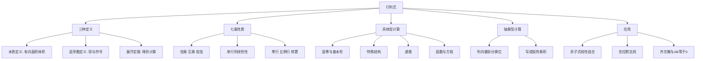

# 线代第1讲 行列式

> [!info] 教材来源
> 《考研数学基础30讲·线性代数分册》第1讲，印刷页11-44 / PDF p17-p50。本文按教材顺序整理，并用全部13道正文例题、11道基础习题及解析反查。

## 本讲速览

- **行列式不是矩阵**：矩阵是线性变换或数据表，行列式是方阵对应的一个数，表示带方向的面积/体积伸缩倍数。
- **三种定义各有用途**：本质定义负责理解，逆序数定义负责判项与符号，展开定理负责降阶计算。
- **计算主线只有一句话**：观察结构，用倍加造零，再化成三角形、分块、范德蒙德或低一阶行列式。
- **具体型看元素分布，抽象型看列之间的关系**；前者重初等变换，后者重单列线性性与 $\lvert AB\rvert=\lvert A\rvert\lvert B\rvert$。
- **余子式题先统一成代数余子式**，再把系数放回相应行或列；同一行得原行列式，换成另一行往往直接为0。
- **方程组只记判定链**：方阵非齐次 $D\ne0$ 才可用克拉默法则；方阵齐次有非零解当且仅当 $D=0$。

## 教材路线

| 顺序 | 教材内容 | 印刷页 / PDF页 | 复习任务 |
|---:|---|---|---|
| 1 | 开篇知识结构图 | 11 / p17 | 建立“定义-性质-计算-应用”主线 |
| 2 | 一、行列式的本质定义（第一种定义） | 12-15 / p18-p21 | 理解有向面积、体积及线性无关 |
| 3 | 二、行列式的性质 | 15-19 / p21-p25 | 掌握转置、倍乘、拆分、互换、倍加等7条性质 |
| 4 | 三、逆序数法定义（第二种定义） | 19-20 / p25-p26 | 会判展开项是否存在及其正负号 |
| 5 | 四、展开定理（第三种定义） | 20-22 / p26-p28 | 掌握余子式、代数余子式及降阶展开 |
| 6 | 五、几个重要的行列式 | 22-24 / p28-p30 | 三角形、副对角线、拉普拉斯、范德蒙德 |
| 7 | 六、具体型行列式的计算 | 25-32 / p31-p38 | 基本形、递推、行列式函数与方程 |
| 8 | 七、抽象型行列式的计算 | 33-36 / p39-p42 | 性质法、乘积行列式、线性组合矩阵化 |
| 9 | 八、余子式和代数余子式的线性组合 | 37 / p43 | 系数替换行列法 |
| 10 | 九、克拉默法则 | 38-40 / p44-p46 | 非齐次、齐次、$AB=0$ |
| 11 | 基础习题精练与解析 | 40-44 / p46-p50 | 用11题反查全部核心方法 |

## 前置知识与关联导航

- 上一讲：[[31_线代第0讲_零基础课_线性代数入门|线代第0讲 零基础课]]。
- 几何前置：[[31_线代第0讲_零基础课_线性代数入门#六、线性变换|线性变换及伸缩、对称、剪切]]。
- 运算前置：[[31_线代第0讲_零基础课_线性代数入门#五、点积运算与矩阵乘法雏形|行乘列与矩阵乘法雏形]]。
- 下一讲：[[20_线代第2讲_矩阵|线代第2讲 矩阵]]，本讲的 $\lvert AB\rvert$、可逆判定和伴随思想会继续使用。
- 方程组深化：[[22_线代第4讲_线性方程组#3. 齐次方程组解的判定|齐次方程组解的判定]]。
- 特征方程：[[23_线代第5讲_特征值与特征向量#2. 特征多项式与特征方程|特征多项式与特征方程]]。
- 正定判定：[[24_线代第6讲_二次型#7. 正定二次型|顺序主子式判定正定]]。

## 知识网络

## 知识点清单

## 一、行列式的本质定义（第一种定义）

### 1. 矩阵与行列式必须分开

- $A=(a_{ij})_{n\times n}$ 是一个**方阵**，可表示数据或线性变换。
- $\lvert A\rvert$ 或 $\det A$ 是由方阵 $A$ 按固定规则计算出的**一个数**。
- 线性变换 $A$ 改变图形，$\lvert A\rvert$ 衡量该变换对有向面积或体积的伸缩。

例如

$$
A=\begin{pmatrix}1&0\\0&-1\end{pmatrix},\qquad \lvert A\rvert=-1.
$$

$A$ 表示关于 $x$ 轴的对称变换；几何面积大小不变，但方向翻转，所以行列式为 $-1$。

> [!tip] 看到什么想到它
> 看到“面积/体积伸缩倍数、方向翻转、向量组是否张成满维空间”，先想到行列式的几何意义，而不是立刻展开计算。

### 2. 二阶行列式

$$
\begin{vmatrix}a_{11}&a_{12}\\a_{21}&a_{22}\end{vmatrix}
=a_{11}a_{22}-a_{12}a_{21}.
$$

把两行或两列看成二维向量，绝对值是它们为邻边构成的平行四边形面积，正负表示取向。

- $\lvert A\rvert>0$：取向与约定方向相同。
- $\lvert A\rvert<0$：面积大小仍为 $\lvert\det A\rvert$，但方向相反。
- $\lvert A\rvert=0$：两个向量共线，二维图形退化为线段。

教材的三个典型图像对应：面积为 $1$、有向面积为 $-1$、两行成比例时面积为 $0$。

### 3. 三阶行列式

三阶行列式的绝对值是三个三维向量所张成平行六面体的体积，符号表示取向。

三阶可用沙路法：

$$
\begin{aligned}
D_3={}&a_{11}a_{22}a_{33}+a_{12}a_{23}a_{31}+a_{13}a_{21}a_{32}\\
&-a_{13}a_{22}a_{31}-a_{12}a_{21}a_{33}-a_{11}a_{23}a_{32}.
\end{aligned}
$$

> [!warning] 边界
> 沙路法只适用于三阶行列式，四阶及以上不能画斜线照搬。

### 4. n阶行列式的本质

$n$ 阶行列式可理解为 $n$ 个 $n$ 维向量张成的有向 $n$ 维体积。

$$
\lvert A\rvert\ne0
\iff \text{行向量组线性无关}
\iff \text{列向量组线性无关}.
$$

$$
\lvert A\rvert=0
\iff \text{向量组线性相关}
\iff \text{图形至少降一维}.
$$

一阶行列式就是数本身：$\lvert a\rvert_{1\times1}=a$，不要把行列式竖线误认为绝对值符号。

## 二、行列式的七条性质

### 1. 性质1：转置后值不变

$$
\lvert A^T\rvert=\lvert A\rvert.
$$

因此任何关于行的性质都有对应的列版本。几何上，按行或按列观察得到的是同一个有向体积。

### 2. 性质2：有零行或零列则值为零

某个方向完全消失，图形降维：

$$
\text{某行（列）全为0}\Longrightarrow \lvert A\rvert=0.
$$

### 3. 性质3：一行或一列的公因子可提出

若第 $i$ 行乘 $k$，则

$$
\det(r_1,\ldots,kr_i,\ldots,r_n)
=k\det(r_1,\ldots,r_i,\ldots,r_n).
$$

这叫**倍乘性质**。只把 $k$ 乘到一行，行列式才乘 $k$；若矩阵每一行都乘 $k$，则

$$
\lvert kA\rvert=k^n\lvert A\rvert,\qquad
\lvert -A\rvert=(-1)^n\lvert A\rvert.
$$

所以一般 $k\lvert A\rvert\ne\lvert kA\rvert$。

### 4. 性质4：对某一行或某一列具有可加性

若只有第 $i$ 行是两个行向量之和，其余行完全相同，则

$$
\det(\ldots,u+v,\ldots)
=\det(\ldots,u,\ldots)+\det(\ldots,v,\ldots).
$$

合并性质3可得单行线性性：

$$
\det(\ldots,\lambda u+\mu v,\ldots)
=\lambda\det(\ldots,u,\ldots)+\mu\det(\ldots,v,\ldots).
$$

> [!warning] 易错
> 行列式只对**单独一行或一列**线性，一般 $\lvert A+B\rvert\ne\lvert A\rvert+\lvert B\rvert$。

### 5. 性质5：互换两行或两列，行列式变号

$$
r_i\leftrightarrow r_j\quad\Longrightarrow\quad D'=-D.
$$

交换 $s$ 次后，$D'=(-1)^sD$。交换奇数次变号，偶数次不变。

### 6. 性质6：两行或两列相等或成比例，行列式为零

$$
r_i=kr_j\quad\Longrightarrow\quad D=0.
$$

相等是 $k=1$ 的特例；几何上两个方向共线，图形降维。

### 7. 性质7：一行的k倍加到另一行，值不变

$$
r_j\leftarrow r_j+kr_i\quad(i\ne j)
\Longrightarrow D' = D.
$$

证明思想是把新行拆开：原行列式加上一个含两行成比例的行列式，后者为0。这叫**倍加性质**，是造零的核心。

### 8. 三种行列变换对行列式的影响

| 变换 | 行列式变化 | 做题用途 |
|---|---|---|
| 互换两行（列） | 乘 $-1$ | 调整结构、移块、化副对角线 |
| 某行（列）乘 $k$ | 乘 $k$ | 提公因子、归一化 |
| 某行（列）的 $k$ 倍加到另一行（列） | 不变 | 造零、三角化、显因子 |

七条性质可统一理解为：行列式对每一行（列）分别线性、交换两行变号，并满足单位矩阵行列式为1。

## 三、行列式的逆序数法定义（第二种定义）

### 1. 排列、逆序和奇偶性

- $1,2,\ldots,n$ 的一个有序排列称为 $n$ 级排列，共 $n!$ 个。
- 在排列 $j_1j_2\cdots j_n$ 中，若前面的数大于后面的数，就构成一个逆序。
- 逆序总数记为 $\tau(j_1j_2\cdots j_n)$。
- $\tau$ 为奇数称奇排列，为偶数称偶排列。

计算逆序数可逐项数“每个数右边比它小的数有几个”，最后求和。

### 2. n阶行列式的代数定义

$$
\lvert A\rvert
=\sum_{j_1j_2\cdots j_n}
(-1)^{\tau(j_1j_2\cdots j_n)}
a_{1j_1}a_{2j_2}\cdots a_{nj_n}.
$$

其中列下标 $j_1j_2\cdots j_n$ 遍历 $1,2,\ldots,n$ 的全部排列，因此共有 $n!$ 项。

每一项必须满足：

1. 每一行恰取一个元素；
2. 每一列恰取一个元素；
3. 列下标排列为偶排列取正，奇排列取负。

### 3. 判一个乘积项的符号

先按**行下标从小到大**重排各因子，再对列下标序列数逆序。

教材示例

$$
a_{12}a_{31}a_{54}a_{43}a_{25}
=a_{12}a_{25}a_{31}a_{43}a_{54}
$$

对应列排列 $25134$，逆序数为4，因此该项在五阶行列式展开中取正号。

> [!tip] 看到什么想到它
> 题目问“某乘积是不是行列式的一项、前面符号是什么、某次项系数是什么”，优先用逆序数定义，不必展开整个行列式。

## 四、行列式的展开定理（第三种定义）

### 1. 余子式与代数余子式

删去元素 $a_{ij}$ 所在的第 $i$ 行、第 $j$ 列，剩余元素按原顺序组成的 $n-1$ 阶行列式称为余子式：

$$
M_{ij}.
$$

代数余子式为

$$
A_{ij}=(-1)^{i+j}M_{ij},\qquad
M_{ij}=(-1)^{i+j}A_{ij}.
$$

符号棋盘为

$$
\begin{pmatrix}
+&-&+&\cdots\\
-&+&-&\cdots\\
+&-&+&\cdots\\
\vdots&\vdots&\vdots&
\end{pmatrix}.
$$

### 2. 按一行或一列展开

沿第 $i$ 行展开：

$$
\lvert A\rvert=\sum_{j=1}^{n}a_{ij}A_{ij}.
$$

沿第 $j$ 列展开：

$$
\lvert A\rvert=\sum_{i=1}^{n}a_{ij}A_{ij}.
$$

**选择原则**：先用倍加制造更多0，再沿0最多的行或列展开。展开只是降阶，不是看到高阶就机械展开。

### 3. 同行同列得原行列式，异行异列得0

$$
\sum_{j=1}^{n}a_{ij}A_{kj}
=\begin{cases}
\lvert A\rvert,&i=k,\\
0,&i\ne k,
\end{cases}
$$

$$
\sum_{i=1}^{n}a_{ij}A_{ik}
=\begin{cases}
\lvert A\rvert,&j=k,\\
0,&j\ne k.
\end{cases}
$$

异行异列为0的原因：用另一行元素配当前行的代数余子式，相当于把当前行替换成已有的另一行，得到两个相同行的行列式。

### 4. 例1.1给出的计算习惯

四阶循环带状行列式先沿零较多的列展开，降为两个三阶三角形行列式，得到 $16-1=15$。可迁移规则是：

1. 高阶具体型先找零最多的行列；
2. 降阶后立即识别三角形或其他基本形；
3. 每次展开都检查 $(-1)^{i+j}$。

## 五、几个重要的行列式

### 1. 主对角线行列式（上、下三角形）

上三角、下三角、对角行列式均有

$$
D=\prod_{i=1}^{n}a_{ii}.
$$

原因是按逆序数定义，除主对角线乘积外，其他每项至少含一个0。

### 2. 副对角线行列式

若非零元素集中在副对角线及其一侧，则

$$
D=(-1)^{\frac{n(n-1)}2}
a_{1n}a_{2,n-1}\cdots a_{n1}.
$$

符号来自逆序排列 $n,n-1,\ldots,1$，其逆序数为 $n(n-1)/2$。

### 3. 拉普拉斯展开式（分块三角形）

设 $A$、$B$ 分别为 $m$ 阶、$n$ 阶方阵，$O$ 为相应零块，则

$$
\begin{vmatrix}A&O\\O&B\end{vmatrix}
=\begin{vmatrix}A&C\\O&B\end{vmatrix}
=\begin{vmatrix}A&O\\C&B\end{vmatrix}
=\lvert A\rvert\lvert B\rvert.
$$

若两个非零块在副对角位置，则

$$
\begin{vmatrix}O&A\\B&O\end{vmatrix}
=(-1)^{mn}\lvert A\rvert\lvert B\rvert.
$$

副对角块形中，另一个角再出现适配的块 $C$ 也不改变该结果；本质仍是先交换块行或块列，把 $A,B$ 移到对角位置。不要把块中的 $A,B,C$ 当作普通数；这里只能在分块结构和维数匹配时使用。

### 4. 范德蒙德行列式

$$
V_n=
\begin{vmatrix}
1&1&\cdots&1\\
x_1&x_2&\cdots&x_n\\
x_1^2&x_2^2&\cdots&x_n^2\\
\vdots&\vdots&&\vdots\\
x_1^{n-1}&x_2^{n-1}&\cdots&x_n^{n-1}
\end{vmatrix}
=\prod_{1\le i<j\le n}(x_j-x_i).
$$

记忆顺序：**后列参数减前列参数**。三阶为

$$
(x_3-x_2)(x_3-x_1)(x_2-x_1).
$$

若幂次按列而不是按行排列，先转置；若行序被换过，补上交换产生的符号。

> [!note] “12+1”基本形
> 教材把主/副对角线的多种三角形形态和拉普拉斯分块形态合称12个基本形，再加范德蒙德，简称“12+1”。做题目标是把陌生行列式化到这些熟悉结构，而不是死记外观。

## 六、具体型行列式的计算

### 1. 普通数值行列式

具体型的通用流程：

1. **看结构**：零多、行和相等、元素差别小、循环、对称、带状、X型。
2. **提公因子**：先把整行整列共同因子提出。
3. **倍加造零**：优先保持行列式不变。
4. **化基本形**：三角形、分块、范德蒙德或爪形。
5. **必要时展开**：沿零最多的行列降阶。
6. **核符号**：互换次数、副对角线符号、代数余子式符号。

#### （1）爪形行列式

典型结构为除第1行、第1列和主对角线外均为0。若 $a_{ii}\ne0\ (i\ge2)$，则

$$
D=\left(\prod_{i=2}^{n}a_{ii}\right)
\left(a_{11}-\sum_{i=2}^{n}\frac{a_{1i}a_{i1}}{a_{ii}}\right).
$$

若不能除以某个参数，不要直接套分式；用无除法的倍加过程或分类讨论。

例1.2中

$$
D=2\cdot3\cdot4
\left(1-\frac12-\frac13-\frac14\right)=-2.
$$

#### （2）每行元素差别小

例1.3的第一列大多相同，先用第一行消去其余行中的共同部分，再把所得稀疏结构化为爪形或副对角线形，最终为 $x^4$。

**题面信号**：大量元素相同，只在少数位置出现 $x\pm1$。不要按定义展开含参四阶式。

#### （3）主对角为a、其余全为b

$$
D_n=[a+(n-1)b](a-b)^{n-1}.
$$

标准做法：把其余各列加到第一列，第一列提出行和 $a+(n-1)b$，再用第一行消其余行，化为三角形。

常用特例：

$$
\begin{vmatrix}
0&1&\cdots&1\\
1&0&\cdots&1\\
\vdots&\vdots&&\vdots\\
1&1&\cdots&0
\end{vmatrix}
=(n-1)(-1)^{n-1},
$$

$$
\begin{vmatrix}
2&1&\cdots&1\\
1&2&\cdots&1\\
\vdots&\vdots&&\vdots\\
1&1&\cdots&2
\end{vmatrix}
=n+1.
$$

若把对角元 $x$ 视为变量，则根为 $x=b$（$n-1$ 重）和 $x=(1-n)b$。

#### （4）副对角线上的同类结构

若把上述 $a$ 放到副对角线上，只需把副对角线换到主对角线，发生 $n(n-1)/2$ 次交换：

$$
G_n=(-1)^{\frac{n(n-1)}2}[a+(n-1)b](a-b)^{n-1}.
$$

#### （5）X型行列式

非零元只在主、副对角线时，应通过行列交换把成对元素聚成 $2\times2$ 块。

若 $2n$ 阶X型主对角线全为 $a$、副对角线全为 $b$，则

$$
D_{2n}=(a^2-b^2)^n.
$$

一般 $2k$ 阶配对结构为

$$
D_{2k}=\prod_{i=1}^{k}
\left(a_i a_{2k+1-i}-b_i b_{2k+1-i}\right).
$$

例1.5四阶式的正确结果是

$$
(a_1a_4-b_1b_4)(a_2a_3-b_2b_3),
$$

不能只写“主对角乘积减副对角乘积”；四阶展开并非只有两项。

#### （6）类对称、行和规律

若主对角为 $a$，第一行其余为 $b$，第一列其余为 $c$，其余非对角元为 $b$，则

$$
D_n=
\begin{cases}
[a+(n-1)b](a-b)^{n-1},&b=c,\\[4pt]
\dfrac{b(a-c)^n-c(a-b)^n}{b-c},&b\ne c.
\end{cases}
$$

该结论来自“各列加到第一列、提因子、由上往下倍加造三角形”。先理解流程，再把公式作为复查。

教材还给出一类上三角取 $x$、下三角取 $-1$、主对角为1的行列式（$x\ne-1$）：

$$
D_n=\frac{x\,2^n+(1-x)^n}{x+1}.
$$

#### （7）造范德蒙德

例1.6中把第1行加到第3行，第三行变成常数 $a+b+c$，提出后调整行序化为范德蒙德：

$$
D=(a+b+c)(b-a)(c-b)(c-a).
$$

这也解释了二次函数插值：三个横坐标互异时，范德蒙德行列式非零，二次函数的三个系数唯一确定。

### 2. 递推法

#### （1）何时使用

当 $D_n$ 的元素分布对任意阶数都保持同一规律，并且展开后能出现同型的 $D_{n-1}$ 或 $D_{n-2}$，建立递推。

操作顺序：

1. 造出只有1-2个非零元的边界行或列；
2. 沿其展开，写出 $D_n$ 与低阶行列式的关系；
3. 给出 $D_0,D_1$ 或其他初值；
4. 迭代、求特征根，或从低阶归纳规律。

递推法与数学归纳法方向相反：递推法从 $D_n$ 向 $D_{n-1},D_{n-2}$ 一直降到初值；归纳法先算低阶猜出规律，再假设 $n=k-1$ 成立并证明 $n=k$。

#### （2）例1.7

教材宽三对角行列式满足

$$
D_n=(-1)^n a^n+D_{n-1},\qquad D_1=1-a,
$$

所以

$$
D_4=a^4-a^3+a^2-a+1.
$$

#### （3）常系数三对角闭式

对主对角为 $k$、上对角为 $b$、下对角为 $c$ 的 $n$ 阶三对角行列式，

$$
D_n=kD_{n-1}-bcD_{n-2},\qquad D_0=1,\quad D_1=k.
$$

记 $\Delta=k^2-4bc$，则

$$
D_n=
\begin{cases}
(n+1)\left(\dfrac{k}{2}\right)^n,&\Delta=0,\\[7pt]
\dfrac{(k+\sqrt\Delta)^{n+1}-(k-\sqrt\Delta)^{n+1}}
{2^{n+1}\sqrt\Delta},&\Delta\ne0.
\end{cases}
$$

这本质上是二阶线性递推的特征根公式。考试中优先会推递推式，闭式用于识别和验算。

教材给出的直接特例：主对角为 $2a$、上对角为 $a^2$、下对角为1时，$\Delta=0$，故

$$
D_n=(n+1)a^n.
$$

### 3. 行列式表示的函数和方程

#### （1）把行列式先看成普通函数

若元素含 $x$ 或 $\lambda$，行列式最终是一个标量函数，可继续求极限、导数、积分、零点和重根。

行列式是 $n$ 阶，不代表所得多项式一定是 $n$ 次；高次项可能因排列限制或相消而消失。

#### （2）差分题只拆变化的行或列

例1.8只有第3列随 $x$ 变化。由单列线性性处理

$$
f(x+1)-f(x),
$$

再倍加造三角形，得

$$
f(x+1)-f(x)=6x^2.
$$

不能把它写成一般性的 $\lvert A(x+1)-A(x)\rvert$；这里能相减，是因为其他列完全相同且只对一列使用可加性。

例如本题算出差分后，还可继续得到

$$
[f(x+1)-f(x)]'=12x,
\qquad
\int[f(x+1)-f(x)]\,dx=2x^3+C.
$$

#### （3）行列式方程与重根

例1.9先造零并因式分解：

$$
(\lambda-2)(\lambda^2-8\lambda+18-3a)=0.
$$

“有二重根”分两种互斥入口：

1. 已知线性因子 $\lambda-2$ 也使二次因子为0，得 $a=2$；
2. $\lambda=2$ 不是二次因子的根，而二次因子自身判别式为0，得 $a=\dfrac23$。

因此 $a=2$ 或 $a=2/3$。见到“重根”必须检查不同因子是否共享根，不能只令某个判别式为0。

## 七、抽象型行列式的计算

### 1. 抽象型的两个入口

1. **用七条性质**：单列拆分、倍乘、换列定号、相同列为0。
2. **写成矩阵乘积**：把新列组表示成旧列组乘一个系数矩阵。

### 2. 矩阵乘积的行列式

对同阶方阵 $A,B$，

$$
\lvert AB\rvert=\lvert A\rvert\lvert B\rvert.
$$

矩阵乘法一般不交换：$AB\ne BA$；但行列式是数，所以

$$
\lvert AB\rvert=\lvert A\rvert\lvert B\rvert
=\lvert B\rvert\lvert A\rvert=\lvert BA\rvert.
$$

几何上，复合变换的面积/体积伸缩倍数等于各次变换伸缩倍数之积。

### 3. 例1.10：已知抽象行列式求另一抽象行列式

已知

$$
\lvert\alpha_1,\alpha_2,\alpha_3,\beta\rvert=a,
\qquad
\lvert\beta+\gamma,\alpha_2,\alpha_3,\alpha_1\rvert=b.
$$

求含 $\alpha_2+\alpha_3$ 与 $\gamma$ 的目标行列式时：

1. 先拆 $\alpha_2+\alpha_3$；
2. 含重复列的项为0；
3. 把第二个已知式拆为含 $\beta$ 和 $\gamma$ 的两项；
4. 通过换列把各项变成目标顺序并记录符号。

结果为 $a+b$。这类题的核心不是算元素，而是把未知式一步步变成已知式。

### 4. 线性组合写成系数矩阵

先补齐三条矩阵语言：

- $A=B$ 当且仅当二者同型且对应元素全部相等，也等价于 $A-B=O$。
- $O$ 表示零矩阵，具体行列数由上下文决定；零矩阵不是数字0，但在同型矩阵加法中扮演零元。
- 分块矩阵把若干小矩阵看成“大元素”组织计算；块的行列数必须匹配，不能按普通数随意交换次序。

向量线性组合可直接写成矩阵乘法：

$$
x_1\alpha_1+x_2\alpha_2+x_3\alpha_3
=[\alpha_1,\alpha_2,\alpha_3]
\begin{pmatrix}x_1\\x_2\\x_3\end{pmatrix}.
$$

若

$$
A=[\alpha_1,\alpha_2,\alpha_3],\qquad
\beta_j=c_{1j}\alpha_1+c_{2j}\alpha_2+c_{3j}\alpha_3,
$$

则

$$
B=[\beta_1,\beta_2,\beta_3]=AC,\qquad C=(c_{ij}).
$$

因此

$$
\lvert B\rvert=\lvert A\rvert\lvert C\rvert.
$$

例1.11中先按对应列做 $B-A$，得到

$$
B-A=A
\begin{pmatrix}
0&2&1\\
-1&2&2\\
2&-5&-2
\end{pmatrix}.
$$

系数矩阵行列式为5，且 $\lvert A\rvert=2$，所以

$$
\lvert B-A\rvert=2\times5=10.
$$

> [!warning] 两种“减法”
> 矩阵 $B-A$ 是对应元素相减；行列式 $\lvert B\rvert-\lvert A\rvert$ 是两个数相减。一般 $\lvert B-A\rvert\ne\lvert B\rvert-\lvert A\rvert$。

## 八、余子式和代数余子式的线性组合

### 1. 代数余子式组合就是“替换一行或一列”

由按第 $i$ 行展开，

$$
a_{i1}A_{i1}+a_{i2}A_{i2}+\cdots+a_{in}A_{in}=\lvert A\rvert.
$$

把系数换成任意 $k_1,k_2,\ldots,k_n$：

$$
k_1A_{i1}+k_2A_{i2}+\cdots+k_nA_{in}
$$

等于把原行列式第 $i$ 行替换为 $(k_1,k_2,\ldots,k_n)$ 后的新行列式。

若替换行恰好等于原行列式的另一行，则新行列式为0。

### 2. 含余子式时先换成代数余子式

$$
M_{ij}=(-1)^{i+j}A_{ij}.
$$

先逐项补符号，再把所有项统一成同一行或同一列的代数余子式组合。

### 3. 例1.12

$$
A_{31}+A_{32}+A_{33}+M_{34}
=A_{31}+A_{32}+A_{33}-A_{34}.
$$

把第3行替换为 $(1,1,1,-1)$，再做倍加化简，结果为6。

> [!tip] 大A配小k
> 看到 $A_{i1},A_{i2},\ldots,A_{in}$ 前面的系数不是原第 $i$ 行，就让“小系数”替换“大行列式”中的第 $i$ 行。

## 九、克拉默法则

### 1. 非齐次方程组

对 $n$ 个方程、$n$ 个未知数的方阵系统

$$
Ax=b,\qquad D=\lvert A\rvert,
$$

若 $D\ne0$，则方程组有唯一解：

$$
x_i=\frac{D_i}{D},\qquad i=1,2,\ldots,n,
$$

其中 $D_i$ 是用常数列 $b$ 替换 $D$ 的第 $i$ 列所得行列式。

若 $D=0$，只能说明不能用克拉默公式且方程组没有唯一解；还可能无解，也可能有无穷多解。

教材示例中 $D=1$，计算 $D_1=2,D_2=5,D_3=9$，故解为 $(2,5,9)^T$。

### 2. 齐次方程组

对 $n$ 元方阵齐次系统 $Ax=0$：

$$
\lvert A\rvert\ne0
\iff \text{只有零解},
$$

$$
\lvert A\rvert=0
\iff \text{存在非零解}.
$$

这两个方向都是充分必要关系。更一般的非方阵系统将在[[22_线代第4讲_线性方程组#3. 齐次方程组解的判定|秩判定]]中处理。

### 3. AB=0的列观点

设 $B=[\beta_1,\ldots,\beta_n]$，则

$$
AB=[A\beta_1,\ldots,A\beta_n].
$$

因此

$$
AB=0\iff B\text{ 的每一列都是 }Ax=0\text{ 的解}.
$$

对同阶方阵，有以下常用结论：

- $AB=0$ 且 $B\ne0$：$B$ 至少有一个非零列，所以 $Ax=0$ 有非零解，$\lvert A\rvert=0$。
- $AB=0$ 且 $\lvert B\rvert\ne0$：$B$ 可逆，右乘 $B^{-1}$ 得 $A=0$。
- $AB=0$ 且 $A\ne0$：若反设 $\lvert B\rvert\ne0$，会推出 $A=0$，故 $\lvert B\rvert=0$。
- 仅由 $\lvert AB\rvert=\lvert A\rvert\lvert B\rvert=0$，只能知道至少一个行列式为0，不能直接断定是哪一个矩阵为零矩阵。

### 4. 例1.13

矩阵 $B\ne0$ 且每一列均为齐次系统的解，所以系统有非零解，系数行列式必须为0：

$$
\begin{vmatrix}
1&2&-2\\
2&-1&\lambda\\
3&1&-1
\end{vmatrix}
=5(\lambda-1)=0.
$$

故 $\lambda=1$。此时 $A\ne0$ 且 $AB=0$，由反证可知 $\lvert B\rvert=0$。

## 公式与二级结论索引

| 结论 | 条件与用途 | 详细位置 |
|---|---|---|
| 二阶公式 $a_{11}a_{22}-a_{12}a_{21}$ | 仅二阶；绝对值为面积 | [[#2. 二阶行列式|二阶行列式]] |
| 沙路法 | 仅三阶 | [[#3. 三阶行列式|三阶行列式]] |
| $\lvert A^T\rvert=\lvert A\rvert$ | 行列性质互通 | [[#1. 性质1：转置后值不变|转置性质]] |
| $\lvert kA\rvert=k^n\lvert A\rvert$ | $A$ 为 $n$ 阶 | [[#3. 性质3：一行或一列的公因子可提出|倍乘性质]] |
| 单行（列）线性性 | 只有该行列变化，其余对应相同 | [[#4. 性质4：对某一行或某一列具有可加性|可加性]] |
| 互换一次乘 $-1$ | 每交换一次都记号 | [[#5. 性质5：互换两行或两列，行列式变号|互换性质]] |
| 倍加不变 | 加到另一行列 | [[#7. 性质7：一行的k倍加到另一行，值不变|倍加性质]] |
| $A_{ij}=(-1)^{i+j}M_{ij}$ | 余子式与代数余子式转换 | [[#1. 余子式与代数余子式|余子式]] |
| 同行同列为 $D$，异行异列为0 | 系数与代数余子式下标需对齐 | [[#3. 同行同列得原行列式，异行异列得0|展开二级结论]] |
| 三角形行列式等于主对角乘积 | 上、下三角均可 | [[#1. 主对角线行列式（上、下三角形）|主对角线]] |
| 副对角线符号 $(-1)^{n(n-1)/2}$ | 副对角三角形 | [[#2. 副对角线行列式|副对角线]] |
| 分块三角形等于对角块行列式之积 | 零块位置和维数要匹配 | [[#3. 拉普拉斯展开式（分块三角形）|拉普拉斯]] |
| 范德蒙德 $\prod_{i<j}(x_j-x_i)$ | 幂次连续且从0开始 | [[#4. 范德蒙德行列式|范德蒙德]] |
| $[a+(n-1)b](a-b)^{n-1}$ | 主对角为 $a$、其余为 $b$ | [[#（3）主对角为a、其余全为b|行和相等型]] |
| 常系数三对角闭式 | 先会递推 $D_n=kD_{n-1}-bcD_{n-2}$ | [[#（3）常系数三对角闭式|三对角递推]] |
| $\lvert AB\rvert=\lvert A\rvert\lvert B\rvert$ | $A,B$ 为同阶方阵 | [[#2. 矩阵乘积的行列式|乘积行列式]] |
| 克拉默 $x_i=D_i/D$ | $n$ 元方阵非齐次且 $D\ne0$ | [[#1. 非齐次方程组|克拉默法则]] |
| 齐次有非零解 $\iff D=0$ | $n$ 元方阵齐次系统 | [[#2. 齐次方程组|齐次判定]] |

## 题型—方法决策表

| 题面信号 | 首选方法 | 备选方法 | 必查点 |
|---|---|---|---|
| 数值行列式、零很多 | 沿零最多行列展开 | 倍加后再展开 | $(-1)^{i+j}$ |
| 元素大量相同、差别小 | 一行倍加到其余行造零 | 提公因子、爪形 | 倍加方向与符号 |
| 每行或每列和相等 | 全部列加到一列，提行和 | 找全1向量结构 | 提的是一列公因子 |
| 主对角 $a$、其余 $b$ | 套 $[a+(n-1)b](a-b)^{n-1}$ | 重新推一遍 | 阶数与重数 |
| X型、主副对角线稀疏 | 交换成 $2\times2$ 分块 | 逆序数判非零项 | 四阶不只两项 |
| 幂次为 $0,1,\ldots,n-1$ | 范德蒙德 | 转置、换行后再套 | 因子顺序和符号 |
| $D_n$ 与阶数同构 | 建递推 | 低阶归纳 | 初值、递推下标 |
| $f(x+1)-f(x)$ 且只一列含 $x$ | 对变化列用线性性 | 先分别化简 | 不能整体写成行列式之差 |
| 行列式方程有重根 | 先因式分解再分类 | 多项式与导数公根 | 共享根与判别式两种来源 |
| 抽象列向量含和 | 单列拆分、重复列置0 | 换列转成已知式 | 每次换列的负号 |
| 新列都是旧列线性组合 | 写 $B=AC$ | 逐列展开 | 系数应按列放进 $C$ |
| $M_{ij},A_{ij}$ 混合求和 | 全部化成 $A_{ij}$ | 符号棋盘 | $M_{ij}$ 无自带正负号 |
| $\sum k_jA_{ij}$ | 用 $k_j$ 替换第 $i$ 行 | 同行/异行结论 | 替换的是哪一行 |
| 非齐次方阵系统、问唯一解 | 算 $D$；$D\ne0$ 用克拉默 | 高斯消元 | $D=0$ 不能直接说无解 |
| 齐次方阵系统、问非零解 | 令 $D=0$ | 秩判定 | 方阵前提 |
| $AB=0$ 且 $B\ne0$ | 取 $B$ 的非零列看 $Ax=0$ | 反证可逆 | $B\ne0$ 不等于 $\lvert B\rvert\ne0$ |

## 教材例题覆盖表

| 例题 | 考查知识 | 看到什么想到它 | 解法入口与独有技巧 | 结果 |
|---|---|---|---|---|
| 例1.1 | 高阶展开 | 零多的四阶循环带状式 | 沿零多列展开，子式立即认三角形 | $15$ |
| 例1.2 | 爪形 | 首行首列外只剩对角元 | 提对角因子、倍加造零 | $-2$ |
| 例1.3 | 元素差别小 | 第一列近乎相同且含 $x\pm1$ | 第一行消其余行，再化爪形 | $x^4$ |
| 例1.4 | 行和相等 | 主对角 $a$、其余 $b$ | 全部列加到第一列，提行和 | $[a+(n-1)b](a-b)^{n-1}$ |
| 例1.5 | X型 | 非零元集中于两条对角线 | 交换成两个二阶块；拒绝“两项错算” | 两个二阶因子的积 |
| 例1.6 | 造范德蒙德 | 某两行相加能得同一常数 | 提 $a+b+c$，换行成范德蒙德 | $(a+b+c)(b-a)(c-b)(c-a)$ |
| 例1.7 | 递推 | 宽三对角且任意阶同构 | 造边界行后展开，逐阶递推 | $a^4-a^3+a^2-a+1$ |
| 例1.8 | 行列式函数差分 | 只有一列随 $x$ 变 | 对该列用线性性，再三角化 | $6x^2$ |
| 例1.9 | 重根参数 | 行列式关于 $\lambda$ 且“有二重根” | 因式分解后查共享根与二次重根 | $a=2$ 或 $2/3$ |
| 例1.10 | 抽象列向量 | 已知两个行列式求第三个 | 拆列、换列、重复列为0 | $a+b$ |
| 例1.11 | 线性组合矩阵化 | $B$ 各列由 $A$ 的列组合 | 写 $B-A=AC$，用乘积行列式 | $10$ |
| 例1.12 | 余子式组合 | $A_{3j}$ 与 $M_{34}$ 混合 | 先 $M_{34}=-A_{34}$，系数替换第3行 | $6$ |
| 例1.13 | $AB=0$ | 非零矩阵的各列都是齐次解 | 非零列给非零解，再反证 $B$ 奇异 | $\lambda=1,\ \lvert B\rvert=0$ |

## 讲末练习反查

| 练习 | 依赖知识 | 只看笔记应先想到 | 结论 |
|---|---|---|---|
| 1.1 | 含参行列式次数 | 倍加造分块，不能按四阶猜四次 | $f(x)=5x(x-1)$，2个根 |
| 1.2 | 代数余子式组合 | 系数替换第1行 | $-4$ |
| 1.3 | 指定幂次系数 | 按含 $x$ 较少的行展开，只追踪能产生 $x^3$ 的项 | $-5$ |
| 1.4 | 循环稀疏结构 | 只保留合法排列项或沿首行展开 | $1-a^4$ |
| 1.5 | 行和相等与三角化 | 第一列造出行和10并提出，再消元 | $160$ |
| 1.6 | 参数抵消 | 连续倍加，使对角线变为 $1,2,3,4$ | $24$ |
| 1.7 | 行列式方程 | 先造一行两个0并提 $\lambda$ | $\lambda=0$ 或 $4$ |
| 1.8 | 抽象行列式 | 拆 $\beta+\gamma$，换列对齐 $m,n$ | $3(m+n)$ |
| 1.9 | 基矩阵与乘积行列式 | 写 $A[\alpha_i]=[A\alpha_i]$，两边取行列式 | $\lvert A\rvert=-2$ |
| 1.10 | 齐次只有零解 | 系数行列式必须非零 | $\lambda\ne1$ |
| 1.11 | $AB=0,B\ne0$ | 取 $B$ 的非零列，推出 $A$ 奇异 | $\lambda=1$ |

## 易错点/易混点

1. **矩阵不等于行列式**：$A$ 是表或变换，$\lvert A\rvert$ 是数。
2. **行列式竖线不总是绝对值**：一阶行列式 $\lvert-2\rvert_{1\times1}=-2$。
3. **负行列式不是“负面积”**：绝对值给面积大小，负号给方向。
4. **沙路法只用于三阶**，四阶不能画斜线。
5. **定义中的一项必须每行每列各取一次**；出现重复行或重复列下标就不是合法项。
6. **只把某一行乘 $k$，行列式才乘 $k$**；全矩阵乘 $k$ 得 $k^n$。
7. **可加性只对一行或一列成立**，一般 $\lvert A+B\rvert\ne\lvert A\rvert+\lvert B\rvert$。
8. **互换与倍加不同**：互换变号，倍加不变。
9. **余子式 $M_{ij}$ 不带符号，代数余子式 $A_{ij}$ 才带 $(-1)^{i+j}$**。
10. **展开时选0多的行列**；直接按第一行展开未必最省。
11. **副对角线乘积要乘 $(-1)^{n(n-1)/2}$**。
12. **副对角分块也有符号**：两个块交换跨过 $mn$ 个位置。
13. **范德蒙德是后减前**；列顺序或行顺序改变都可能变号。
14. **X型四阶通常有4个合法展开项**，不能机械写成主对角乘积减副对角乘积。
15. **行列式阶数不等于含参多项式次数**，高次项可能相消。
16. **$f(x+1)-f(x)$ 只有在其余对应行列相同时才能用单行列线性性合并**。
17. **矩阵乘法不交换，但乘积行列式可交换**：$AB\ne BA$，却有 $\lvert AB\rvert=\lvert BA\rvert$。
18. **矩阵差与行列式差不同**：$\lvert B-A\rvert$ 不能拆成 $\lvert B\rvert-\lvert A\rvert$。
19. **非齐次系统 $D=0$ 不等于无解**，也可能无穷多解。
20. **$B\ne0$ 不等于 $\lvert B\rvert\ne0$**：非零矩阵完全可能不可逆。
21. **$AB=0$ 不推出 $A=0$ 或 $B=0$**；矩阵有零因子。
22. **克拉默法则要求方程数等于未知数数且 $D\ne0$**。

## 注解

### 1. 为什么教材先讲几何再讲公式

七条性质并不是孤立技巧：一条边缩放 $k$，体积缩放 $k$；交换两条边改变取向；一条边叠加另一条边不改变“高度”。理解这一层后，倍乘、互换、倍加就不需要死背。

### 2. 为什么“造零”比“展开”更重要

$n$ 阶行列式直接展开有 $n!$ 项。倍加不会改变值，却能把大部分展开项变成0；随后三角化或沿零行列展开，计算量会从阶乘级迅速降下来。

### 3. 为什么抽象型要写成矩阵乘积

每个新列都是旧列的线性组合时，逐列拆分会产生很多项；写成 $B=AC$ 后，所有组合系数集中进一个小矩阵 $C$，问题变为 $\lvert B\rvert=\lvert A\rvert\lvert C\rvert$。这是[[20_线代第2讲_矩阵#3. 矩阵乘法：行乘列与顺序性|矩阵乘法]]真正发挥作用的入口。

### 4. 行列式在后续章节的角色

- 判断矩阵是否可逆：$\lvert A\rvert\ne0$。
- 判断方阵齐次系统是否有非零解：$\lvert A\rvert=0$。
- 构造特征方程：$\lvert\lambda E-A\rvert=0$。
- 判断实对称矩阵正定：顺序主子式全正。

因此本讲不只是“算一个数”，而是后续可逆性、方程组、特征值和二次型判定的共同入口。

## 速背检查

1. **行列式的几何本质是什么？** 方阵对应线性变换的有向面积/体积伸缩倍数。
2. **$\lvert A\rvert=0$ 的几何含义？** 向量组线性相关，图形降维。
3. **二阶公式？** $a_{11}a_{22}-a_{12}a_{21}$。
4. **沙路法能否算四阶？** 不能，只用于三阶。
5. **$\lvert kA\rvert$ 等于什么？** $A$ 为 $n$ 阶时等于 $k^n\lvert A\rvert$。
6. **三种行变换怎样改行列式？** 互换变号，倍乘乘相应倍数，倍加不变。
7. **两行相等为什么为0？** 交换后矩阵不变但行列式应变号，只能为0。
8. **逆序数定义中每项怎样取元素？** 每行、每列各取一个。
9. **$A_{ij}$ 与 $M_{ij}$ 的关系？** $A_{ij}=(-1)^{i+j}M_{ij}$。
10. **异行元素乘另一行代数余子式再求和？** 0。
11. **副对角线行列式的符号？** $(-1)^{n(n-1)/2}$。
12. **范德蒙德公式的因子顺序？** $\prod_{i<j}(x_j-x_i)$，后减前。
13. **主对角为 $a$、其余为 $b$ 的值？** $[a+(n-1)b](a-b)^{n-1}$。
14. **具体型行列式第一反应？** 看结构并用倍加造零。
15. **递推法的必要信号？** 任意阶结构同构，展开后出现低一阶同型行列式。
16. **为什么 $\lvert AB\rvert=\lvert BA\rvert$？** 两者都等于 $\lvert A\rvert\lvert B\rvert$，不代表 $AB=BA$。
17. **余子式线性组合怎么做？** 先统一为代数余子式，再用系数替换对应行或列。
18. **非齐次系统何时能用克拉默法则？** 方阵且系数行列式 $D\ne0$。
19. **方阵齐次系统何时有非零解？** 当且仅当 $D=0$。
20. **$AB=0,B\ne0$ 能推出什么？** $B$ 至少有非零列是 $Ax=0$ 的非零解，故 $\lvert A\rvert=0$。

## OCR/视觉核查

- PDF p17-p50共34页已全部渲染并OCR，提取2091行文字骨架。
- 已生成9张覆盖全部页面的联系图并逐张阅读；34页高清原页全部逐页查看，不以OCR替代公式和图形判断。
- 高清复核重点：三种定义、七条性质、逆序数符号、余子式下标、主/副对角线符号、拉普拉斯分块、范德蒙德因子顺序、递推闭式、含参重根、抽象列向量与 $AB=0$。
- 正文例1.1-例1.13均建立“知识点-题面信号-解法入口-独有技巧-笔记位置”映射。
- 讲末练习1.1-1.11及其解析均已反查；所有依赖知识均可在正文、决策表或易错点中定位。
- OCR只用于定位文字；上下标、正负号、矩阵位置和公式条件均以高清原页为准。

## 相关链接

- [[00_目录与进度|考研数学目录与进度]]
- [[00_公式极简总表|公式极简总表]]
- [[00_刷题高命中索引|刷题高命中索引]]
- [[00_OCR视觉核查报告#19 线代 行列式|本讲OCR与视觉核查记录]]
- [[31_线代第0讲_零基础课_线性代数入门|上一讲：线性代数入门]]
- [[20_线代第2讲_矩阵|下一讲：矩阵]]
