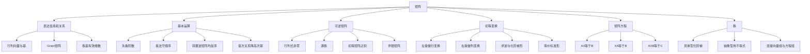

# 线代第2讲 矩阵

> [!info] 教材来源
> 《考研数学基础30讲·线性代数分册》第2讲，印刷页45-81 / PDF p51-p87。本文按教材顺序整理，并用全部20道正文例题、15道基础习题及解析反查。

## 本讲速览

- **矩阵的本质是组织信息与关系**：行、列分别承载对象或指标，矩阵乘法把“上一层输出”与“下一层输入”连接起来。
- **运算第一原则是先看阶数、再守顺序**：乘法一般不可交换，因此消因子、提公因子、平方公式、转置和求逆都不能照搬普通代数。
- **可逆性是一条等价链**：$A$可逆、$\lvert A\rvert\ne0$、$r(A)=n$、$A$可化为$E$、$A$可写成有限个初等矩阵之积，本质上是同一件事。
- **伴随矩阵是行列式与逆矩阵的桥**：核心只有$AA^*=\lvert A\rvert E$，其余公式从它与$A^*=\lvert A\rvert A^{-1}$推出。
- **初等变换是计算中枢**：左乘做行变换，右乘做列变换；它同时服务于求逆、求秩、化标准形和解矩阵方程。
- **秩描述有效信息维数**：具体矩阵化阶梯形，抽象矩阵用乘积、和、可逆因子、零乘积及伴随矩阵的秩公式夹逼。

## 教材路线

| 顺序 | 教材内容 | 印刷页 / PDF页 | 复习任务 |
|---:|---|---|---|
| 1 | 开篇知识结构图 | 45 / p51 | 建立“本质-运算-逆-伴随-初等变换-方程-等价-秩”主线 |
| 2 | 一、矩阵的本质 | 46-49 / p52-p55 | 理解基、信息表达、Gram矩阵和秩的关系意义 |
| 3 | 二、矩阵的定义及其基本运算 | 50-56 / p56-p62 | 掌握九类运算/特殊矩阵及三种矩阵幂方法 |
| 4 | 三、矩阵的逆 | 57-58 / p63-p64 | 会判可逆、反序求逆及用定义构造逆 |
| 5 | 四、伴随矩阵 | 59-62 / p65-p68 | 掌握定义、公式、求逆与伴随矩阵捷径 |
| 6 | 五、初等变换与初等矩阵 | 63-69 / p69-p75 | 分清左行右列、三类初等矩阵、求逆与分块逆 |
| 7 | 六、矩阵方程 | 69-70 / p75-p76 | 会解$AX=B$、$XA=B$、$AXB=C$及复杂变形式 |
| 8 | 七、等价矩阵和等价标准形 | 70-72 / p76-p78 | 用$PAQ=B$、标准形和秩判断、构造等价关系 |
| 9 | 八、矩阵的秩 | 73-74 / p79-p80 | 掌握定义、求法及8组重要公式 |
| 10 | 基础习题精练与解析 | 75-81 / p81-p87 | 用15题反查运算顺序、伴随、等价、秩与方程 |

## 前置知识与关联导航

- 直觉前置：[[31_线代第0讲_零基础课_线性代数入门#六、线性变换|矩阵表示线性变换]]、[[31_线代第0讲_零基础课_线性代数入门#五、点积运算与矩阵乘法雏形|行乘列与点积]]。
- 上一讲：[[19_线代第1讲_行列式|线代第1讲 行列式]]，本讲直接使用行列式性质、代数余子式和$\lvert AB\rvert=\lvert A\rvert\lvert B\rvert$。
- 下一讲：[[21_线代第3讲_向量组|线代第3讲 向量组]]，会把“秩”解释为极大无关组所含向量个数。
- 方程深化：[[22_线代第4讲_线性方程组|线代第4讲 线性方程组]]。
- 高次幂深化：[[23_线代第5讲_特征值与特征向量#6. 相似对角化|用相似对角化计算矩阵幂]]。
- 对称矩阵深化：[[24_线代第6讲_二次型|线代第6讲 二次型]]。

## 知识网络

## 知识点清单

## 一、矩阵的本质

### 1. 矩阵先表达系统信息

一个矩阵不是孤立的数表，而是把两类索引之间的信息组织起来。例如“专业”和“性别”的人数表中：

- 每一列固定一个专业，列内比较不同性别；
- 每一行固定一种性别，行内比较不同专业；
- 行、列的含义由问题背景决定，交换行列就改变信息的组织方式。

数乘$kA$是把每个数据同比例放大，行列之间原有的比例关系不变。要把整个方阵的每个元素都乘$k$时，行列式满足

$$
\lvert kA\rvert=k^n\lvert A\rvert,
$$

因为行列式的$n$行都各提出一个$k$；只把一行乘$k$才仅产生一个$k$。

> [!tip] 看到什么想到它
> 看到“数据表中每一行/列代表什么、整体同比例变化、信息怎样重新组合”，先解释行列含义，再决定是数乘、左乘、右乘还是转置。

### 2. 一个基可以表达所在空间的全部信息

在$n$维空间中，选定$n$个线性无关向量作为一组基后，空间中任意向量都可由它们唯一线性表示，其系数就是该向量在这组基下的坐标。

- 标准正交基最便于读坐标，但“成为基”只要求线性无关，不要求互相垂直。
- 把多个样本坐标按行或列排入矩阵，就得到同一坐标系下的一组信息。
- 改变基，本质上是改变同一信息的表达坐标；相关内容见[[21_线代第3讲_向量组|向量组、基与坐标]]。

教材用平面点集和曲边梯形面积说明：把大量点的坐标存入矩阵后，可通过统计、筛选和矩阵运算近似提取面积等整体信息。复习时应抓住“**矩阵承载样本，运算提取关系**”，不必记具体采样数字。

### 3. Gram矩阵提取长度、夹角与相关性

设矩阵按列分块为

$$
A=(\alpha_1,\alpha_2,\ldots,\alpha_n),
$$

则

$$
A^TA=
\begin{pmatrix}
\alpha_1^T\alpha_1&\cdots&\alpha_1^T\alpha_n\\
\vdots&\ddots&\vdots\\
\alpha_n^T\alpha_1&\cdots&\alpha_n^T\alpha_n
\end{pmatrix}.
$$

它是这些列向量的Gram矩阵：

- 对角元$\alpha_i^T\alpha_i=\lVert\alpha_i\rVert^2$，给出长度平方；
- 非对角元$\alpha_i^T\alpha_j=\lVert\alpha_i\rVert\lVert\alpha_j\rVert\cos\theta_{ij}$，给出内积；
- 若各列先单位化，则对应元素直接是$\cos\theta_{ij}$，可表示余弦相似度；
- $A^TA$一定对称，且$x^TA^TAx=\lVert Ax\rVert^2\ge0$。

教材以高维数据相关性、材料薄弱方向等例子提示：矩阵乘法不仅“算数”，还会把向量间的长度和相关关系集中出来。后续特征值分析会进一步提取主要方向。

> [!tip] 看到什么想到它
> 看到“列向量长度、两两夹角、相关性、余弦相似度”，想到$A^TA$；看到“行向量之间的关系”，对应看$AA^T$。

### 4. 秩描述行列之间有多少独立信息

矩阵可看成若干行向量拼成，也可看成若干列向量拼成。若某一行（列）能由其他行（列）线性表示，它没有增加新的独立方向。

- 行秩与列秩相等，统称矩阵的秩$r(A)$；
- 秩越小，行列之间的线性依赖越多；
- 教材示例矩阵的一行可由另外两行表示，因此秩只有2，而不是3。

本节先建立直觉，正式定义和计算见[[20_线代第2讲_矩阵#八、矩阵的秩|八、矩阵的秩]]。

> [!note] 几何直觉的边界
> 教材把正交矩阵理解为旋转、三角矩阵理解为剪切，并用$A\pm B$说明数据整体平移的直觉。这些是理解入口，不代表任意同型矩阵都对应同一种几何动作；考试仍以定义、阶数和运算条件为准。

## 二、矩阵的定义及其基本运算

### 1. 矩阵、方阵与同型矩阵

由$m n$个数$a_{ij}$排成$m$行$n$列的矩形数表，称为$m\times n$矩阵：

$$
A=(a_{ij})_{m\times n}.
$$

- $i$是行指标，$j$是列指标；
- $m=n$时称$n$阶方阵；
- $A_{m\times s}$与$B_{n\times k}$同型，当且仅当$m=n$且$s=k$；
- 行向量是$1\times n$矩阵，列向量是$m\times1$矩阵。

只有方阵才讨论行列式、逆矩阵和方阵的幂；矩阵乘积即使结果是方阵，两个因子也不一定都是方阵。

### 2. 相等、加法与数乘

矩阵相等必须同时满足：

$$
A=B\iff A,B\text{同型且 }a_{ij}=b_{ij}\text{ 对所有 }i,j.
$$

只有同型矩阵才能相加减：

$$
A\pm B=(a_{ij}\pm b_{ij}),\qquad kA=(ka_{ij}).
$$

它们满足交换律、结合律和分配律：

$$
A+B=B+A,
$$

$$
(A+B)+C=A+(B+C),
$$

$$
k(A+B)=kA+kB,\qquad(k+l)A=kA+lA,
$$

$$
k(lA)=(kl)A.
$$

> [!tip] 看到什么想到它
> 含参数矩阵相等题，先核对阶数，再逐元素列方程；不能只比较行列式、秩或某几个位置。

### 3. 矩阵乘法：行乘列与顺序性

若

$$
A=(a_{ij})_{m\times s},\qquad B=(b_{ij})_{s\times n},
$$

则$AB$有意义，且

$$
AB=C=(c_{ij})_{m\times n},qquad
c_{ij}=\sum_{k=1}^{s}a_{ik}b_{kj}.
$$

一句话：**内维相等才可乘，外维决定结果；结果第$i$行第$j$列是$A$第$i$行与$B$第$j$列的点积。**

矩阵乘法满足

$$
(AB)C=A(BC),
$$

$$
A(B+C)=AB+AC,
$$

$$
(A+B)C=AC+BC,
$$

$$
(kA)B=A(kB)=k(AB),
$$

但一般不满足交换律：

$$
AB\ne BA.
$$

由不交换性产生三类高频陷阱：

1. $A\ne O,B\ne O$仍可能$AB=O$，矩阵存在零因子；
2. $AB=AC$只说明$A(B-C)=O$，一般不能约去$A$；若$A$可逆，左乘$A^{-1}$才可得$B=C$；
3. 左边的公因子只能从左提，右边的公因子只能从右提：

$$
AB+AC=A(B+C),\qquad BA+CA=(B+C)A.
$$

> [!tip] 看到什么想到它
> 每遇到乘积先在草稿上标阶数；每次提因子或消因子，都问一句“它原来在未知量的哪一侧”。

### 4. 转置矩阵

把$m\times n$矩阵$A$的行、列互换，得到$n\times m$矩阵$A^T$。基本公式为

$$
(A^T)^T=A,
$$

$$
(kA)^T=kA^T,
$$

$$
(A+B)^T=A^T+B^T,
$$

$$
(AB)^T=B^TA^T.
$$

多因子必须整体反序：

$$
(ABC)^T=C^TB^TA^T.
$$

反序的原因不是特殊口诀，而是转置后原乘积中“行乘列”的连接方向反了。

### 5. 方阵的幂与矩阵多项式

仅对方阵定义

$$
A^m=\underbrace{AA\cdots A}_{m\text{个}},\qquad A^0=E.
$$

同一个方阵的幂可交换并满足

$$
A^mA^n=A^{m+n},\qquad(A^m)^n=A^{mn}.
$$

不同矩阵一般不交换，因此通常有

$$
(A+B)^2=A^2+AB+BA+B^2\ne A^2+2AB+B^2,
$$

$$
(A-B)(A+B)=A^2+AB-BA-B^2\ne A^2-B^2,
$$

$$
(AB)^n\ne A^nB^n.
$$

只有已知$AB=BA$时，普通二项式展开和乘积幂公式才可照用。单位矩阵$E$与任意同阶方阵可交换，因此$(E+B)^n$总能按二项式展开。

若

$$
f(x)=a_0+a_1x+\cdots+a_mx^m,
$$

则矩阵多项式定义为

$$
f(A)=a_0E+a_1A+\cdots+a_mA^m.
$$

常数项必须写成$a_0E$，不能把普通数$a_0$直接与矩阵相加。

> [!tip] 看到什么想到它
> 看到高次幂，先算$A^2,A^3$找“低次关系、周期、幂零、秩1分解”，不要直接连乘。

### 6. 方阵的行列式

设$A,B$为$n$阶方阵：

$$
\lvert kA\rvert=k^n\lvert A\rvert,
$$

$$
\lvert A^T\rvert=\lvert A\rvert,
$$

$$
\lvert AB\rvert=\lvert A\rvert\lvert B\rvert.
$$

下列推理一般都错：

$$
\lvert A+B\rvert=\lvert A\rvert+\lvert B\rvert,
$$

$$
A\ne O\Rightarrow\lvert A\rvert\ne0,
$$

$$
A\ne B\Rightarrow\lvert A\rvert\ne\lvert B\rvert.
$$

矩阵是否为零与行列式是否为零不是同一层次：非零矩阵完全可能行或列相关，从而行列式为零。

### 7. 九类重要矩阵

| 类型 | 定义/形状 | 必记性质 |
|---|---|---|
| 零矩阵$O$ | 所有元素为0 | $AO=O,OA=O$，但需阶数匹配 |
| 单位矩阵$E_n$ | 主对角为1，其余为0 | $E_nA=A,AE_n=A$ |
| 数量矩阵$kE$ | 单位阵的数倍 | 与任意同阶方阵可交换 |
| 对角矩阵 | 非主对角元全为0 | 乘法、幂、逆都逐个处理对角元 |
| 上/下三角矩阵 | 主对角线一侧为0 | 行列式等于主对角元之积 |
| 对称矩阵 | $A^T=A$ | $a_{ij}=a_{ji}$ |
| 反对称矩阵 | $A^T=-A$ | $a_{ij}=-a_{ji}$，主对角元全为0 |
| 行矩阵 | 只有一行 | 也称行向量 |
| 列矩阵 | 只有一列 | 也称列向量 |

对称与反对称不要混淆：对称矩阵关于主对角线镜像相等；反对称矩阵镜像位置互为相反数。

### 8. 分块矩阵

把矩阵按相容的横线、竖线分成若干子矩阵，可把每个子块当作“元素”运算，但仍要检查块的阶数并保持乘法顺序。

同型、同分法时可逐块相加与数乘。以$2\times2$分块为例：

$$
\begin{pmatrix}A&B\\C&D\end{pmatrix}
\begin{pmatrix}X&Y\\Z&W\end{pmatrix}
=
\begin{pmatrix}
AX+BZ&AY+BW\\
CX+DZ&CY+DW
\end{pmatrix}.
$$

分块相乘后，左侧矩阵的块仍写在每个乘积左边，不能因“块看起来像数”而交换。

若$A,B$分别为$m,n$阶方阵，则

$$
\begin{pmatrix}A&O\\O&B\end{pmatrix}^{k}
=
\begin{pmatrix}A^k&O\\O&B^k\end{pmatrix}.
$$

### 9. 教材三类矩阵幂方法

#### （1）秩1矩阵：例2.1

若

$$
A=\alpha\beta^T,
$$

则$\beta^T\alpha$是一个数，故

$$
A^2=\alpha(\beta^T\alpha)\beta^T=(\beta^T\alpha)A,
$$

进而

$$
A^n=(\beta^T\alpha)^{n-1}A.
$$

对方阵$A=\alpha\beta^T$，有$\operatorname{tr}(A)=\beta^T\alpha$，所以

$$
A^n=[\operatorname{tr}(A)]^{n-1}A.
$$

反过来，$r(A)=1$时通常可把各列的公同比例提出，写成$A=\alpha\beta^T$。

#### （2）低次幂出现单位阵：例2.2

若先算得

$$
A^2=cE,
$$

则

$$
A^{2k}=c^kE,qquad A^{2k+1}=c^kA.
$$

教材例2.2中$A^2=4E$，所以$A^9=4^4A=256A$。关键不是记答案，而是形成“先算低次幂、按奇偶拆分”的动作。

#### （3）单位阵加幂零矩阵：例2.3

若$A=E+B$且$B^s=O$，因为$E$与$B$可交换，二项式在第$s-1$次截断：

$$
A^n=(E+B)^n=\sum_{k=0}^{s-1}\binom nk B^k.
$$

教材例2.3中$B^3=O$，故

$$
A^n=E+nB+\frac{n(n-1)}2B^2.
$$

对上三角主对角全为1的矩阵，优先尝试拆成$E+$严格上三角矩阵；后者必为幂零矩阵。

## 三、矩阵的逆

### 1. 定义、唯一性与可逆判定

设$A,B$为同阶方阵，若

$$
AB=BA=E,
$$

则$A$可逆，$B$是$A$的逆矩阵，记为$A^{-1}$。

- 逆矩阵若存在则唯一；
- 对同阶方阵，一侧满足$AB=E$已足以推出$BA=E$；
- 可逆的充要条件是

$$
A\text{可逆}\iff\lvert A\rvert\ne0.
$$

到本讲末还可补成完整等价链：

$$
A\text{可逆}
\iff \lvert A\rvert\ne0
\iff r(A)=n
\iff A\text{可经初等行变换化为}E.
$$

### 2. 性质与反序公式

设$A,B$同阶可逆，$k\ne0$：

$$
(A^{-1})^{-1}=A,
$$

$$
(kA)^{-1}=\frac1kA^{-1},
$$

$$
(AB)^{-1}=B^{-1}A^{-1},
$$

$$
(A^T)^{-1}=(A^{-1})^T,
$$

$$
\lvert A^{-1}\rvert=\frac1{\lvert A\rvert}.
$$

多因子同样整体反序：

$$
(A_1A_2\cdots A_s)^{-1}
=A_s^{-1}\cdots A_2^{-1}A_1^{-1}.
$$

若$ABC=E$，则三者都可逆，并可循环移动：

$$
ABC=E\iff BCA=E\iff CAB=E,
$$

但不能任意换成$ACB$、$BAC$等非循环顺序。

下列公式一般不成立：

$$
(A+B)^{-1}=A^{-1}+B^{-1}.
$$

即使$A,B$都可逆，$A+B$也未必可逆。

### 3. 用定义法构造逆矩阵

抽象题不一定要算伴随矩阵。目标是把已知关系恒等变形成

$$
MN=E,
$$

于是立即得到$M^{-1}=N$。常用动作是：

1. 把和、差整理成乘积；
2. 左边原有因子从左提，右边原有因子从右提；
3. 把可逆矩阵的乘积整体看待，再反序求逆。

**例2.4的通法**：由$AB=A+B$，配出单位阵：

$$
AB-A-B+E=E,
$$

$$
(A-E)(B-E)=E.
$$

因此$A-E$与$B-E$互逆。此题同时说明：一个选项若声称“必可逆”，可以构造满足原条件的数量矩阵反例排除其他选项。

**例2.5的通法**：若$A,B,A^{-1}+B^{-1}$均可逆，则

$$
A+B=A(B^{-1}+A^{-1})B,
$$

从而$A+B$可逆，且

$$
(A+B)^{-1}=B^{-1}(A^{-1}+B^{-1})^{-1}A^{-1}.
$$

顺序不能改。教材想训练的是“把和改写成已知可逆因子的乘积”。

> [!tip] 看到什么想到它
> 出现“证明某矩阵可逆并求其逆”，先设法构造“待求矩阵×另一个矩阵=$E$”；只有具体低阶数值矩阵才优先直接算。

## 四、伴随矩阵

### 1. 定义与核心恒等式

设$A_{ij}$是元素$a_{ij}$的代数余子式。伴随矩阵把代数余子式矩阵转置排列：

$$
A^*=
\begin{pmatrix}
A_{11}&A_{21}&\cdots&A_{n1}\\
A_{12}&A_{22}&\cdots&A_{n2}\\
\vdots&\vdots&\ddots&\vdots\\
A_{1n}&A_{2n}&\cdots&A_{nn}
\end{pmatrix}.
$$

最核心公式是

$$
AA^*=A^*A=\lvert A\rvert E.
$$

其原理是：对应行、列相乘时，同一行（列）的元素与其代数余子式展开得到$\lvert A\rvert$；不同的行（列）组合相当于出现两行（列）相同的行列式，结果为0。

对二阶矩阵

$$
A=\begin{pmatrix}a&b\\c&d\end{pmatrix},
$$

有

$$
A^*=\begin{pmatrix}d&-b\\-c&a\end{pmatrix}.
$$

记忆：主对角互换，副对角变号；二阶还满足$(A^*)^*=A$。

### 2. 性质、行列式与秩

对任意$n$阶方阵，在相应条件下有：

$$
\lvert A^*\rvert=\lvert A\rvert^{n-1},
$$

$$
(kA)^*=k^{n-1}A^*,
$$

$$
(A^T)^*=(A^*)^T,
$$

$$
(AB)^*=B^*A^*,
$$

$$
(A^*)^*=\lvert A\rvert^{n-2}A\qquad(n\ge2).
$$

若$A$可逆，则

$$
A^*=\lvert A\rvert A^{-1},
$$

$$
(A^{-1})^*=(A^*)^{-1}=\frac{A}{\lvert A\rvert},
$$

$$
A=\lvert A\rvert(A^*)^{-1}.
$$

伴随矩阵的秩必须分类：

$$
r(A^*)=
\begin{cases}
n,&r(A)=n,\\
1,&r(A)=n-1,\\
0,&r(A)<n-1.
\end{cases}
$$

原因：满秩时$A^*$可逆；秩为$n-1$时至少有一个$n-1$阶子式非零而$AA^*=O$；秩低于$n-1$时所有代数余子式都为0。

伴随运算不满足加法：

$$
(A+B)^*\ne A^*+B^*.
$$

### 3. 用伴随矩阵求逆

若$\lvert A\rvert\ne0$，则

$$
A^{-1}=\frac1{\lvert A\rvert}A^*.
$$

步骤：

1. 先算$\lvert A\rvert$并判非零；
2. 计算每个代数余子式$A_{ij}$，特别检查$(-1)^{i+j}$；
3. **转置排放**成$A^*$；
4. 除以$\lvert A\rvert$；
5. 用$AA^{-1}=E$或$A^{-1}A=E$验算。

二阶可直接写成

$$
A^{-1}=\frac1{ad-bc}
\begin{pmatrix}d&-b\\-c&a\end{pmatrix},qquad ad-bc\ne0.
$$

伴随法对低阶、元素简单的矩阵方便；高阶数值矩阵要计算$n^2$个$n-1$阶行列式，通常优先用初等变换。

### 4. 求伴随矩阵的三条路线

1. **定义法**：直接求代数余子式并转置，适合二阶或结构很稀疏的矩阵。
2. **逆矩阵法**：若$A$可逆，先求$A^{-1}$，再用$A^*=\lvert A\rvert A^{-1}$。
3. **直接求伴随的逆**：若题目问$(A^*)^{-1}$，直接用

$$
(A^*)^{-1}=\frac{A}{\lvert A\rvert},
$$

不必先求$A^*$。例2.9正是这一捷径。

教材例2.10处理副对角分块矩阵$C$时，先求$C^{-1}$和$\lvert C\rvert$，再用$C^*=\lvert C\rvert C^{-1}$；例2.11则提醒数乘矩阵取行列式时是$n$次方：

$$
\lvert 2B^*A^{-1}\rvert
=2^n\lvert B^*\rvert\lvert A^{-1}\rvert.
$$

> [!tip] 看到什么想到它
> 看到$A^*$先问四件事：有没有$AA^*=\lvert A\rvert E$；是否可逆；题目问的是矩阵、行列式还是秩；能否避免真的展开代数余子式。

## 五、初等变换与初等矩阵

### 1. 三类初等变换

行或列均有三类初等变换：

1. 某一行（列）乘非零常数；
2. 交换两行（列）；
3. 某一行（列）的$k$倍加到另一行（列）。

使用范围要分清：

- 求秩、判断等价：行变换和列变换都可用；
- 求逆：可只做行变换，也可只做列变换，但不能在同一增广结构中随意混用；
- 解线性方程组：只做行变换，因为列变换会改变未知量的对应关系；
- 算行列式：三类变换对行列式数值的影响不同，不能把“秩不变”误当成“行列式不变”。

### 2. 三类初等矩阵及其逆

对单位矩阵$E$做一次初等变换所得矩阵称为初等矩阵。

| 初等矩阵 | 在单位阵上的操作 | 逆矩阵 |
|---|---|---|
| $E_i(k)$，$k\ne0$ | 第$i$行或第$i$列乘$k$ | $E_i(1/k)$ |
| $E_{ij}$ | 交换第$i,j$行或第$i,j$列 | $E_{ij}$ |
| $E_{ij}(k)$ | 第$j$行的$k$倍加到第$i$行 | $E_{ij}(-k)$ |

对列变换需结合乘法方向读记号：右乘$E_{ij}(k)$时，是把$A$的第$i$列的$k$倍加到第$j$列。

初等矩阵的行列式分别为$k,-1,1$，都非零，所以都可逆；转置仍为同类型初等矩阵：

$$
E_i(k)^T=E_i(k),\qquad E_{ij}^T=E_{ij},\qquad E_{ij}(k)^T=E_{ji}(k).
$$

### 3. 左乘做行变换，右乘做列变换

这是本讲最重要的操作规则：

$$
PA=\text{对}A\text{做与}P\text{对应的行变换},
$$

$$
AQ=\text{对}A\text{做与}Q\text{对应的列变换}.
$$

连续变换按实际乘法顺序记录。若

$$
B=P_s\cdots P_2P_1A,
$$

则最先作用的是最靠近$A$的$P_1$。取逆后顺序反转：

$$
B^{-1}=A^{-1}P_1^{-1}P_2^{-1}\cdots P_s^{-1}.
$$

这解释了例2.13：交换$A$的两行得到$B=E_{12}A$，求逆后

$$
B^{-1}=A^{-1}E_{12},
$$

因此表现为交换$A^{-1}$的相应两列。

例2.14连续做列变换时，把每一步写为右乘初等矩阵：

$$
C=AE_{12}E_{23}(1),
$$

故$Q=E_{12}E_{23}(1)$，不能颠倒两个因子。

### 4. 用初等变换求逆矩阵

若一串初等行变换把$A$化为$E$，设这些变换总乘积为$P$，则

$$
PA=E\Rightarrow P=A^{-1}.
$$

把同样的行变换同步作用于单位阵：

$$
(A\mid E)\xrightarrow{\text{初等行变换}}(E\mid A^{-1}).
$$

也可只做列变换：

$$
\begin{pmatrix}A\\E\end{pmatrix}
\xrightarrow{\text{初等列变换}}
\begin{pmatrix}E\\A^{-1}\end{pmatrix}.
$$

数值计算时优先选择能迅速造出0、避免复杂分数的主元；最终一定回乘验算。教材例2.12强调：伴随法理论重要，初等变换法通常更便捷，也更易在运算题中得步骤分。

### 5. 行阶梯形与行最简阶梯形

**行阶梯形矩阵**满足：

1. 若有零行，零行全部位于非零行下方；
2. 从上到下，每个非零行的首个非零元素所在列严格右移。

若进一步满足：

1. 每个非零行的首个非零元素为1；
2. 每个首1所在列的其余元素全为0，

则称为**行最简阶梯形矩阵**。

任何非零矩阵都可经有限次初等行变换化为行阶梯形和行最简阶梯形；可逆方阵的行最简阶梯形必为$E$。行阶梯形的非零行数就是矩阵的秩。

### 6. 简单分块矩阵的逆

设出现的方阵块均可逆且分块阶数匹配。

**分块对角矩阵**：

$$
\begin{pmatrix}A&O\\O&B\end{pmatrix}^{-1}
=\begin{pmatrix}A^{-1}&O\\O&B^{-1}\end{pmatrix}.
$$

多块对角矩阵也只需逐块求逆，位置不变。

**分块副对角矩阵**：

$$
\begin{pmatrix}O&A\\B&O\end{pmatrix}^{-1}
=\begin{pmatrix}O&B^{-1}\\A^{-1}&O\end{pmatrix}.
$$

逆块不仅取逆，还要交换副对角位置。对多个副对角块，块的次序整体反转。

**分块上三角矩阵**：

$$
\begin{pmatrix}A&C\\O&B\end{pmatrix}^{-1}
=\begin{pmatrix}
A^{-1}&-A^{-1}CB^{-1}\\
O&B^{-1}
\end{pmatrix}.
$$

**分块下三角矩阵**：

$$
\begin{pmatrix}A&O\\C&B\end{pmatrix}^{-1}
=\begin{pmatrix}
A^{-1}&O\\
-B^{-1}CA^{-1}&B^{-1}
\end{pmatrix}.
$$

若记不清非对角块，设

$$
M^{-1}=\begin{pmatrix}X&Y\\Z&W\end{pmatrix},
$$

直接令$MM^{-1}=E$逐块解，比死背可靠。

教材还给出两类含零角块的扩展式。若$B,C$可逆：

$$
\begin{pmatrix}O&B\\C&D\end{pmatrix}^{-1}
=\begin{pmatrix}
-C^{-1}DB^{-1}&C^{-1}\\
B^{-1}&O
\end{pmatrix},
$$

$$
\begin{pmatrix}D&B\\C&O\end{pmatrix}^{-1}
=\begin{pmatrix}
O&C^{-1}\\
B^{-1}&-B^{-1}DC^{-1}
\end{pmatrix}.
$$

例2.15要求先识别大型矩阵中的副对角分块；例2.16则通过设未知块推得分块下三角逆。两题共同规则：**先识别零块位置，再决定逆块位置和乘法顺序。**

## 六、矩阵方程

### 1. 三种标准形及解法

含未知矩阵$X$的方程称为矩阵方程。先按结合律、分配律恒等变形，使其化为下列标准形：

$$
AX=B\Rightarrow X=A^{-1}B\qquad(A\text{可逆}),
$$

$$
XA=B\Rightarrow X=BA^{-1}\qquad(A\text{可逆}),
$$

$$
AXB=C\Rightarrow X=A^{-1}CB^{-1}\qquad(A,B\text{可逆}).
$$

消系数的方向由未知矩阵的位置决定：$AX$要左乘$A^{-1}$，$XA$要右乘$A^{-1}$。不能把矩阵写成普通除法。

复杂数值题的稳定流程是：

1. 先对原方程恒等变形，孤立含未知矩阵的乘积；
2. 再用转置、逆、伴随等公式化简系数；
3. 最后代入具体矩阵计算，避免一开始就制造大量运算。

例如由

$$
A^{-1}BA=6A+BA
$$

先右乘$A^{-1}$，得

$$
A^{-1}B=6E+B,
$$

再整理为

$$
(A^{-1}-E)B=6E,qquad B=6(A^{-1}-E)^{-1}.
$$

### 2. 伴随矩阵参与的矩阵方程：例2.17

若题目只给$A^*$而方程含$A$或$A^{-1}$，不要立即逐元素求$A$。先调用关系链：

$$
A^*=\lvert A\rvert A^{-1},qquad
(A^*)^{-1}=\frac{A}{\lvert A\rvert},qquad
\lvert A^*\rvert=\lvert A\rvert^{n-1}.
$$

例2.17先把原方程化为只含$B$的标准形，再由给定$4$阶$A^*$的行列式恢复$\lvert A\rvert$，最后把$A^{-1}$换成$A^*/\lvert A\rvert$。通用策略是：

> 方程先变形，伴随再换元，行列式负责补回比例因子。

> [!tip] 看到什么想到它
> 若方程里同时出现$A,A^{-1},A^*$，优先把它们统一成一种对象；通常统一成已知的$A^*$最省计算。

## 七、等价矩阵和等价标准形

### 1. 等价矩阵的定义

设$A,B$为同型$m\times n$矩阵。若存在$m$阶可逆矩阵$P$和$n$阶可逆矩阵$Q$，使

$$
PAQ=B,
$$

则称$A$与$B$等价，记为$A\simeq B$。

左乘$P$代表若干行变换，右乘$Q$代表若干列变换，因此等价也等价于“一个矩阵可经有限次初等行、列变换化成另一个矩阵”。

等价矩阵必须同型，但不必是方阵。

### 2. 等价标准形与判定

若$r(A)=r$，则存在可逆$P,Q$使

$$
PAQ=
\begin{pmatrix}
E_r&O\\
O&O
\end{pmatrix}.
$$

右侧称为$A$的等价标准形。它只由矩阵的型和秩决定，因此

$$
A\simeq B
\iff
A,B\text{同型且 }r(A)=r(B).
$$

含参数等价题先求目标矩阵的秩，再令待定矩阵达到同样的秩。例2.18中$r(B)=2$，由$A$的标准形或三阶行列式可得参数$a=-4$。

### 3. 构造变换矩阵

若只用行变换把$A$化成$B$，同步记录这些初等矩阵的乘积即可得到

$$
PA=B.
$$

例2.18在$a=-4$时，一组可行矩阵为

$$
P=
\begin{pmatrix}
1&0&0\\
1&1&0\\
2&2&1
\end{pmatrix}.
$$

若要求全部可逆$P$，可把$PA=B$转置为

$$
A^TP^T=B^T,
$$

把$P^T$按列拆开，分别解线性方程组，最后再附加$\lvert P\rvert\ne0$。这是[[22_线代第4讲_线性方程组|线性方程组]]中的参数解法。

> [!warning] 等价、相似、合同不是一回事
> 等价是$PAQ=B$，只保持型与秩；相似是$P^{-1}AP=B$，保持特征值等更强结构；合同是$P^TAP=B$，服务于二次型。练习2.4得到$C=PAP^{-1}$，是因为行变换与其逆列变换恰好配成相似变换。

## 八、矩阵的秩

### 1. 定义与满秩判定

设$A$为$m\times n$矩阵。若$A$中存在非零的$k$阶子式，而所有$k+1$阶子式（若存在）都为0，则

$$
r(A)=k.
$$

边界：

$$
0\le r(A)\le\min(m,n),
$$

$$
r(A)=0\iff A=O.
$$

对$n$阶方阵：

$$
r(A)=n
\iff\lvert A\rvert\ne0
\iff A\text{可逆}.
$$

“秩至少为$k$”只需找到一个非零$k$阶子式；“秩至多为$k$”需证明所有更高阶子式为0，实际计算通常改用阶梯形。

### 2. 求秩的两种入口

**具体矩阵**：用初等行变换化为行阶梯形，非零行数就是$r(A)$。初等列变换也不改变秩，但行变换更统一。

**含参数且已知秩**：

1. 用一个已知非零低阶子式锁住秩的下界；
2. 用高一阶子式为0锁住上界；
3. 或直接化阶梯形，找参数使主元消失。

例2.19已知三行矩阵的秩为2：任选含参数且便于计算的三阶子式令其为0，可得$t=3$；再检查此时仍有二阶子式非零，排除秩降到1。

### 3. 有关秩的重要公式

设各乘法阶数匹配，$k\ne0$：

$$
r(kA)=r(A),
$$

$$
r(A^T)=r(A),
$$

$$
r(AB)\le\min\{r(A),r(B)\},
$$

$$
r(A+B)\le r(A)+r(B),
$$

$$
r(PA)=r(AQ)=r(PAQ)=r(A)qquad(P,Q\text{可逆}),
$$

$$
r(A)=r(A^T)=r(A^TA)=r(AA^T)qquad(A\text{为实矩阵}).
$$

伴随矩阵的秩见[[20_线代第2讲_矩阵#2. 性质、行列式与秩|伴随矩阵秩的三段式]]。

若$A_{m\times n}B_{n\times s}=O$，则

$$
r(A)+r(B)\le n.
$$

其上位结论是Sylvester秩不等式：

$$
r(AB)\ge r(A)+r(B)-n,
$$

其中$n$是乘积的内维，不是结果的行数或列数。

若$A_{m\times n}B_{n\times m}=E_m$，则

$$
m=r(E_m)=r(AB)\le\min\{r(A),r(B)\}\le m,
$$

故

$$
r(A)=r(B)=m,qquad m\le n.
$$

这是例2.20的“秩夹逼”：等式两端给下界，矩阵阶数给上界。

> [!tip] 看到什么想到它
> 有可逆因子就删；有$AB=O$就看内维；有$AB=E$就用满秩夹逼；有$A^TA$就把秩换回$A$；有$A^*$就按$r(A)$三段分类。

## 公式与二级结论索引

| 主题 | 结论 | 条件/提醒 | 详解 |
|---|---|---|---|
| 乘法阶数 | $A_{m\times s}B_{s\times n}=C_{m\times n}$ | 内维相等，外维定结果 | [[#3. 矩阵乘法：行乘列与顺序性|矩阵乘法]] |
| 乘法元素 | $c_{ij}=\sum_{k=1}^s a_{ik}b_{kj}$ | 第$i$行乘第$j$列 | [[#3. 矩阵乘法：行乘列与顺序性|矩阵乘法]] |
| 转置反序 | $(ABC)^T=C^TB^TA^T$ | 所有因子反序 | [[#4. 转置矩阵|转置]] |
| 逆反序 | $(ABC)^{-1}=C^{-1}B^{-1}A^{-1}$ | 各因子均可逆 | [[#2. 性质与反序公式|逆矩阵性质]] |
| 行列式数乘 | $\lvert kA\rvert=k^n\lvert A\rvert$ | $A$为$n$阶 | [[#6. 方阵的行列式|方阵行列式]] |
| 乘积行列式 | $\lvert AB\rvert=\lvert A\rvert\lvert B\rvert$ | 同阶方阵 | [[#6. 方阵的行列式|方阵行列式]] |
| 矩阵多项式 | $f(A)=a_0E+a_1A+\cdots+a_mA^m$ | 常数项必须乘$E$ | [[#5. 方阵的幂与矩阵多项式|矩阵多项式]] |
| 秩1幂 | $(\alpha\beta^T)^n=(\beta^T\alpha)^{n-1}\alpha\beta^T$ | $n\ge1$ | [[#（1）秩1矩阵：例2.1|秩1矩阵]] |
| 幂零截断 | $(E+B)^n=\sum_{k=0}^{s-1}\binom nkB^k$ | $B^s=O$ | [[#（3）单位阵加幂零矩阵：例2.3|幂零矩阵]] |
| 可逆判定 | $A^{-1}$存在$\iff\lvert A\rvert\ne0\iff r(A)=n$ | $A$为$n$阶 | [[#1. 定义、唯一性与可逆判定|可逆判定]] |
| 伴随核心 | $AA^*=A^*A=\lvert A\rvert E$ | 任意方阵 | [[#1. 定义与核心恒等式|伴随核心]] |
| 伴随求逆 | $A^{-1}=A^*/\lvert A\rvert$ | $\lvert A\rvert\ne0$ | [[#3. 用伴随矩阵求逆|伴随求逆]] |
| 伴随行列式 | $\lvert A^*\rvert=\lvert A\rvert^{n-1}$ | $A$为$n$阶 | [[#2. 性质、行列式与秩|伴随性质]] |
| 伴随数乘 | $(kA)^*=k^{n-1}A^*$ | $A$为$n$阶 | [[#2. 性质、行列式与秩|伴随性质]] |
| 伴随乘积 | $(AB)^*=B^*A^*$ | 同阶方阵，反序 | [[#2. 性质、行列式与秩|伴随性质]] |
| 二重伴随 | $(A^*)^*=\lvert A\rvert^{n-2}A$ | $n\ge2$ | [[#2. 性质、行列式与秩|伴随性质]] |
| 伴随的逆 | $(A^*)^{-1}=A/\lvert A\rvert$ | $A$可逆 | [[#4. 求伴随矩阵的三条路线|伴随捷径]] |
| 左行右列 | $PA$做行变换，$AQ$做列变换 | $P,Q$为对应初等矩阵 | [[#3. 左乘做行变换，右乘做列变换|左行右列]] |
| 行变换求逆 | $(A\mid E)\to(E\mid A^{-1})$ | 只做同步行变换 | [[#4. 用初等变换求逆矩阵|初等求逆]] |
| 分块上三角逆 | 非对角块$-A^{-1}CB^{-1}$ | $A,B$可逆 | [[#6. 简单分块矩阵的逆|分块逆]] |
| 矩阵方程 | $AXB=C\Rightarrow X=A^{-1}CB^{-1}$ | $A,B$可逆，顺序固定 | [[#1. 三种标准形及解法|矩阵方程]] |
| 等价标准形 | $PAQ=\operatorname{diag}(E_r,O)$ | $P,Q$可逆，$r=r(A)$ | [[#2. 等价标准形与判定|等价标准形]] |
| 乘积秩 | $r(AB)\le\min\{r(A),r(B)\}$ | 阶数匹配 | [[#3. 有关秩的重要公式|秩公式]] |
| 零乘积秩 | $AB=O\Rightarrow r(A)+r(B)\le n$ | $n$为内维 | [[#3. 有关秩的重要公式|秩公式]] |
| Gram秩 | $r(A^TA)=r(A)$ | 实矩阵 | [[#3. 有关秩的重要公式|秩公式]] |

## 题型—方法决策表

| 题面信号 | 首选方法 | 备选方法 | 检查点 |
|---|---|---|---|
| 两矩阵相加、相乘或比较相等 | 先标阶数，再逐元素/行乘列 | 分块运算 | 同型条件、乘积内维 |
| $A^n$且矩阵具体 | 先算$A^2,A^3$找规律 | 特征值、相似对角化 | 是否周期、幂零、秩1 |
| $A=\alpha\beta^T$或各列成比例 | 用秩1幂公式 | 直接算$A^2$归纳 | 先算标量$\beta^T\alpha$ |
| 主对角全1的上三角矩阵幂 | 写成$E+B$并找$B^s=O$ | 归纳 | 二项式因$E$可交换才成立 |
| 证明某抽象矩阵可逆 | 配成“待求矩阵×另一矩阵=$E$” | 化成可逆因子乘积 | 提因子左右位置 |
| 具体低阶矩阵求逆 | 伴随法或初等行变换 | 分块逆 | 先判$\lvert A\rvert\ne0$并回乘 |
| 出现$A^*,\lvert A^*\rvert,(A^*)^{-1}$ | 从$AA^*=\lvert A\rvert E$出发 | 换成$\lvert A\rvert A^{-1}$ | 维数指数、是否可逆 |
| A做行/列变换后问逆矩阵 | 写成$B=PA$或$B=AQ$再取逆 | 观察交换行列 | 取逆反序 |
| 大矩阵中有大片零块 | 先识别分块对角/副对角/三角 | 设未知分块相乘 | 逆块位置、负号、乘法顺序 |
| 求未知矩阵X | 化成$AX=B$、$XA=B$或$AXB=C$ | 初等变换 | 从正确一侧乘逆矩阵 |
| 两同型矩阵是否等价 | 比较秩 | 同化为标准形 | 等价不要求相似 |
| 构造$P$使$PA=B$ | 记录把A化到B的行变换 | 解$A^TP^T=B^T$ | 最后检验P可逆 |
| 具体矩阵求秩 | 化行阶梯形 | 找最大非零子式 | 非零行数，不是非零元素数 |
| 含参矩阵且给定秩 | 高一阶子式为0加低阶子式非零 | 化阶梯形看主元 | 同时验证上下界 |
| $AB=O$ | $r(A)+r(B)\le$内维 | Sylvester不等式 | 内维不要写错 |
| $AB=E_m$且矩阵为矩形 | 用秩上下界夹逼 | 线性方程组观点 | 得$r(A)=r(B)=m$及$m\le n$ |

## 教材例题覆盖表

| 例题 | 考查知识 | 看到什么想到它 | 解法入口与独有结论 |
|---|---|---|---|
| 2.1 | 秩1矩阵幂 | $A=\alpha\beta^T$ | 把中间$\beta^T\alpha$视为数，得$A^n=(\beta^T\alpha)^{n-1}A$ |
| 2.2 | 周期型高次幂 | 具体矩阵求$A^9$ | 先算$A^2=4E$，按奇偶拆幂，得$A^9=256A$ |
| 2.3 | 幂零降幂 | 上三角且主对角全1 | 拆$A=E+B$，由$B^3=O$截断二项式 |
| 2.4 | 定义法判可逆 | $AB=A+B$ | 配出$(A-E)(B-E)=E$；其余“必可逆”说法用数量矩阵反例排除 |
| 2.5 | 矩阵和可逆 | 已知$A^{-1}+B^{-1}$可逆 | 写成$A+B=A(B^{-1}+A^{-1})B$，再反序取逆 |
| 2.6 | 伴随核心式 | 二阶一般矩阵 | 同行展开得$\lvert A\rvert$，异行展开得0，从而$AA^*=\lvert A\rvert E$ |
| 2.7 | 二阶逆矩阵 | 一般二阶方阵 | $ad-bc\ne0$；主对角互换、副对角变号后除以行列式 |
| 2.8 | 三阶伴随求逆 | 具体三阶矩阵 | 逐个代数余子式并转置；重点核对符号和位置 |
| 2.9 | 求$(A^*)^{-1}$ | 已给A，不问A*本身 | 直接用$(A^*)^{-1}=A/\lvert A\rvert$，避免先求伴随 |
| 2.10 | 副对角分块伴随 | 分块矩阵$\begin{pmatrix}O&A\\B&O\end{pmatrix}$ | 先求分块逆和总行列式，再用$C^*=\lvert C\rvert C^{-1}$ |
| 2.11 | 伴随行列式 | $\lvert2B^*A^{-1}\rvert$ | 数乘给$2^n$，伴随给$\lvert B\rvert^{n-1}$；结果$(-8)^{n-1}$ |
| 2.12 | 初等变换求逆 | 具体三阶矩阵 | 用$(A\mid E)\to(E\mid A^{-1})$，尽量先造整数主元并回乘 |
| 2.13 | 行交换与逆 | B由A交换两行 | $B=E_{12}A$，故$B^{-1}=A^{-1}E_{12}$，即在逆矩阵中交换列 |
| 2.14 | 连续列变换 | 两步列变换求Q | 每步写成右乘，$C=AE_{12}E_{23}(1)$；顺序不可倒 |
| 2.15 | 大型副对角分块求逆 | 5阶矩阵有左上、右下零块 | 分成$\begin{pmatrix}O&B\\C&O\end{pmatrix}$，分别求$B^{-1},C^{-1}$并反放 |
| 2.16 | 分块下三角逆 | $\begin{pmatrix}B&O\\D&C\end{pmatrix}$ | 设四个未知块，逐块比较，左下块为$-C^{-1}DB^{-1}$ |
| 2.17 | 伴随矩阵方程 | 已知A*且方程含A、A逆 | 先孤立B，再由$\lvert A^*\rvert=\lvert A\rvert^3$恢复比例并统一成A* |
| 2.18 | 等价含参与构造P | A、B等价 | 先比秩得$a=-4$；记录行变换得一组P；全部P转成列方程求参数 |
| 2.19 | 含参秩 | 三行矩阵秩为2 | 令便于计算的三阶子式为0，再核对二阶子式非零，得$t=3$ |
| 2.20 | 矩形矩阵右逆 | $A_{m\times n}B_{n\times m}=E_m$ | 用$r(AB)$上下夹，得$r(A)=r(B)=m$并知$m\le n$ |

## 讲末练习反查

| 练习 | 结论/答案 | 只看笔记时的解题入口 |
|---|---|---|
| 2.1 | C | 分别计算；$A^2-B^2$一般不等于$(A-B)(A+B)$，因为中间项$AB-BA$不消失 |
| 2.2 | C，$f(A)=O$ | 矩阵多项式常数项写$3E$，按“乘方后数乘再相加”计算 |
| 2.3 | D，$BCA=E$ | $ABC=E$可循环移动，不可任意换序 |
| 2.4 | B，$C=PAP^{-1}$ | 行变换写成左乘P，逆向列变换写成右乘$P^{-1}$ |
| 2.5 | B，$a=-2b$ | 3阶$r(A^*)=1$先推出$r(A)=2$，再化阶梯形；题设$b\ne0$负责排除退化 |
| 2.6 | A | 由$AB=O$得$r(A)+r(B)\le3$；$t\ne6$时$r(A)=2$，故非零B必有$r(B)=1$ |
| 2.7 | $A^n=(-6)^{n-1}A$ | 把各列公因子提出，写成$A=\alpha\beta^T$，计算$\beta^T\alpha=-6$ |
| 2.8 | $n=2k$时$A^n=2^{k-1}A^2$；$n=2k+1$时$A^n=2^kA$ | 先算$A^3=2A$，按奇偶归纳；$A^2=\begin{pmatrix}1&0&-1\\0&2&0\\-1&0&1\end{pmatrix}$ |
| 2.9 | $(A-E)^{-1}=\frac12(A+2E)$ | 将$A^2+A-4E=O$改写成$(A-E)(A+2E)=2E$ |
| 2.10 | $(E+B)^{-1}=\frac12(E+A)$ | 先化$E+B=2(E+A)^{-1}$再取逆，最后代入矩阵 |
| 2.11 | $a_{11}=\sqrt3/3$ | 由$A^*=A^T$得$AA^T=\lvert A\rvert E$；先判$\lvert A\rvert=1$，再按第一行展开 |
| 2.12 | $a=2$ | 同型矩阵等价当且仅当秩相同；先求目标秩2，再排除$a=-1$时秩降为1 |
| 2.13 | $A^T=A$且$A^2=E$ | 对$A=E-2\xi\xi^T$直接转置；展开平方并用$\xi^T\xi=1$ |
| 2.14 | $B=\operatorname{diag}(3,2,3/2)$ | 方程先右乘$A^{-1}$，得$B=6(A^{-1}-E)^{-1}$，再代对角阵 |
| 2.15 | $A=\begin{pmatrix}1&0&0&0\\-2&1&0&0\\1&-2&1&0\\0&1&-2&1\end{pmatrix}$ | 先把$(E-C^{-1}B)^TC^T$化为$(C-B)^T$，再孤立A并一次求逆 |

## 易错点/易混点

1. **矩阵与行列式不是同一对象**：矩阵是数表，行列式是方阵对应的数；$kA$与$k\lvert A\rvert$的处理不同。
2. **乘法先看内维**：$AB$存在不代表$BA$存在；即使都存在也一般不相等。
3. **矩阵有零因子**：$AB=O$不能推出$A=O$或$B=O$。
4. **不可随便约去矩阵**：$AB=AC$只有在A可逆等附加条件下才能推出$B=C$。
5. **平方公式需交换条件**：$(A+B)^2=A^2+AB+BA+B^2$；只有$AB=BA$时才能合成$2AB$。
6. **矩阵多项式常数项是$a_0E$**，不是普通数$a_0$。
7. **$\lvert kA\rvert=k^n\lvert A\rvert$**：$n$阶方阵的每一行都被乘$k$。
8. **非零矩阵未必可逆**：$A\ne O$不推出$\lvert A\rvert\ne0$。
9. **转置、逆、伴随乘积都反序**：分别是$(AB)^T$、$(AB)^{-1}$、$(AB)^*$。
10. **和的逆与和的伴随均不可拆**：$(A+B)^{-1}$和$(A+B)^*$没有逐项公式。
11. **伴随矩阵要转置排放**：$A^*$中第$i,j$位置是$A_{ji}$，不是$A_{ij}$。
12. **伴随秩要三段分类**：不能只写“行列式为0所以伴随为0”；当$r(A)=n-1$时$r(A^*)=1$。
13. **左乘行、右乘列**：求逆后因子反序，所以原矩阵行变换常对应逆矩阵的列变换。
14. **增广法求逆不能行列混做**：$(A\mid E)$只能同步做行变换。
15. **分块是矩阵乘法，不是普通数乘法**：非对角逆块的负号与顺序都要验算。
16. **矩阵方程从正确一侧消元**：$AX=B$左乘，$XA=B$右乘。
17. **等价只保秩，不等于相似**：$PAQ$与$P^{-1}AP$的结构和不变量不同。
18. **秩为k要同时有上下界**：只找到一个非零k阶子式，只能说明$r(A)\ge k$。
19. **$AB=O$中的$n$是内维**：若$A_{m\times n}B_{n\times s}=O$，才有$r(A)+r(B)\le n$。
20. **OCR不能负责矩阵符号**：代数余子式下标、转置、逆、块位置和正负号必须回看原页或自行回乘核准。

## 注解

### 1. 为什么乘法、转置和逆都强调顺序

矩阵表示“先做一个变换，再做另一个变换”。$AB$作用于向量时，先执行$B$，再执行$A$；改变顺序通常改变结果。转置和求逆要把这条变换链倒着处理，所以自然出现反序公式。

### 2. 为什么$A^TA$不会丢掉A的秩

若$A^TAx=0$，左乘$x^T$得

$$
x^TA^TAx=\lVert Ax\rVert^2=0,
$$

故$Ax=0$。于是$A^TA$与$A$有相同零空间，再由“列数减零空间维数”等于秩，可知$r(A^TA)=r(A)$。这也是Gram矩阵能保留列向量独立信息的原因。

### 3. 为什么可逆、满秩、非零行列式是一回事

- $\lvert A\rvert\ne0$说明列向量张成整个$n$维空间；
- 因而$r(A)=n$，线性变换既不压扁方向也不丢信息；
- 每个输出都能唯一还原输入，所以存在$A^{-1}$；
- 高斯消元不会出现缺主元，最终能化为$E$。

把这条链理解透，判定题就不必背多套孤立口诀。

### 4. 等价、相似与合同的知识位置

- 本讲等价矩阵研究“有效维数是否相同”，核心不变量是秩；
- [[23_线代第5讲_特征值与特征向量|相似矩阵]]研究同一线性变换在不同基下的矩阵，保留特征值；
- [[24_线代第6讲_二次型|合同矩阵]]研究二次型变量替换，保留正负惯性指数。

做题时先看式子两侧的$P,Q$位置，不要仅凭“两个矩阵可互相变换”判断关系。

### 5. 教材例题真正训练的三种观察

1. **观察低次关系**：矩阵幂题先算$A^2,A^3$；
2. **观察可逆因子**：和差式尽量配成乘积或单位阵；
3. **观察零块与秩**：大型矩阵先分块，抽象矩阵先用秩夹逼。

这些观察比记某一道题的数值答案更能迁移到真题。

### 6. 练习2.13为什么提前连接正交矩阵

若$A^T=A$且$A^2=E$，则

$$
A^TA=A^2=E,
$$

所以$A$是正交矩阵。练习中的$A=E-2\xi\xi^T$实际上表示关于某个超平面的反射；本讲只需会代数验证，几何与正交性质见[[21_线代第3讲_向量组|下一讲相关内容]]。

## 速背检查

1. **矩阵乘法何时有意义？** $A$的列数等于$B$的行数；结果取$A$的行数和$B$的列数。
2. **$AB$第$i,j$个元素是什么？** $A$第$i$行与$B$第$j$列的点积。
3. **$AB=O$能否推出某因子为0？** 不能，矩阵有零因子。
4. **什么时候能从$AB=AC$约去A？** 至少要有A可逆等保证左消去成立的条件。
5. **$(AB)^T$与$(AB)^{-1}$怎样写？** 分别为$B^TA^T$与$B^{-1}A^{-1}$。
6. **矩阵多项式的常数项是什么？** $a_0E$。
7. **秩1矩阵$A=\alpha\beta^T$的$n$次幂？** $(\beta^T\alpha)^{n-1}A$。
8. **$A=E+B,B^3=O$时$A^n$？** $E+nB+\frac{n(n-1)}2B^2$。
9. **方阵可逆的三个常用等价条件？** 有逆、行列式非零、秩为$n$。
10. **伴随矩阵最核心公式？** $AA^*=A^*A=\lvert A\rvert E$。
11. **$(A^*)^{-1}$怎样避免先求A*？** A可逆时直接写$A/\lvert A\rvert$。
12. **$r(A^*)$怎样分类？** $r(A)=n,n-1,<n-1$时分别为$n,1,0$。
13. **左乘、右乘初等矩阵各做什么？** 左乘做行变换，右乘做列变换。
14. **用行变换求逆的增广式？** $(A\mid E)\to(E\mid A^{-1})$。
15. **行最简阶梯形比行阶梯形多什么？** 每个主元为1，且主元所在列其余元素全为0。
16. **分块上三角逆的右上块？** $-A^{-1}CB^{-1}$。
17. **$AXB=C$的解？** $X=A^{-1}CB^{-1}$，两侧顺序固定。
18. **同型矩阵等价的充要条件？** 秩相等。
19. **具体矩阵怎样求秩？** 化行阶梯形，数非零行。
20. **$A_{m\times n}B_{n\times s}=O$给出什么？** $r(A)+r(B)\le n$。
21. **$AB=E_m$且A、B为矩形时得到什么？** $r(A)=r(B)=m$，并有$m\le n$。
22. **$r(A^TA)$与$r(A)$关系？** 对实矩阵相等。

## OCR/视觉核查

- 证据入口：[[00_OCR视觉核查报告#20 线代 矩阵|查看本讲OCR/视觉核查]]。
- PDF p51-p87共37页已全部渲染并OCR；10张全页联系图均已逐张阅读。
- 37页高清原图全部复核，重点核对结构图、Gram矩阵、矩阵乘法阶数、伴随矩阵下标与符号、三类初等矩阵、分块逆、等价标准形、秩公式及答案页。
- 例2.1-例2.20、练习2.1-2.15及全部答案解析均已反查；OCR只用于文字骨架，公式、转置、逆、矩阵位置和正负号以原页为准。

## 相关链接

- [[31_线代第0讲_零基础课_线性代数入门|线性代数入门]]
- [[19_线代第1讲_行列式|上一讲：行列式]]
- [[21_线代第3讲_向量组|下一讲：向量组]]
- [[22_线代第4讲_线性方程组|矩阵方程与线性方程组]]
- [[23_线代第5讲_特征值与特征向量|矩阵幂与相似对角化]]
- [[24_线代第6讲_二次型|对称矩阵、合同与二次型]]
