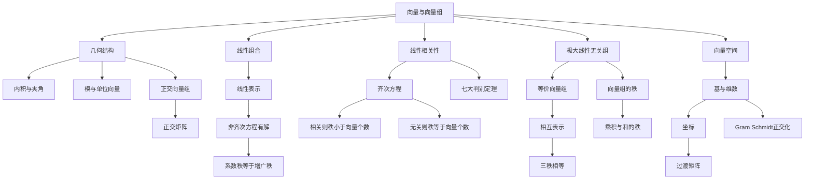

# 线代第3讲 向量组

> [!info] 教材来源
> 《考研数学基础30讲·线性代数分册》第3讲，印刷页82-113 / PDF p88-p119。本文按教材顺序整理，并用2个开篇示例、例3.1-例3.14及基础习题3.1-3.12的解析反查。

## 本讲速览

- **向量组研究“信息是否重复”**：线性表示回答一个向量能否由已有向量生成；线性相关回答一组向量中是否存在冗余。
- **相关性最终都落到齐次方程**：把向量作列拼成$A$，则列向量组无关等价于$Ax=0$只有零解，等价于$r(A)$等于列数。
- **表示问题最终都落到非齐次方程**：$\beta$能由$\alpha_1,\ldots,\alpha_s$表示，等价于$Ax=\beta$有解，等价于$r(A)=r(A,\beta)$。
- **极大线性无关组是向量组的“最简信息骨架”**：其向量个数就是向量组的秩，组内向量无关，原组每个向量都能由它表示。
- **等价要分清对象**：同型矩阵等价只看秩；向量组等价要求相互线性表示，判据是两个单组秩与并组秩三者相等。
- **基是整个空间的极大无关组**：基变换时“基向量顺着过渡矩阵变，坐标逆着变”；Gram-Schmidt则把普通基改造成规范正交基。

## 教材路线

| 顺序 | 教材内容 | 印刷页 / PDF页 | 复习任务 |
|---:|---|---|---|
| 1 | 开篇知识结构图 | 82 / p88 | 建立“向量-表示-相关性-极大无关组-秩-等价-基”主线 |
| 2 | 一、线性代数中的一号人物——向量 | 83-84 / p89-p90 | 从矩阵列向量理解信息重复、表示与秩 |
| 3 | 二、向量与向量组的线性相关性 | 84-97 / p90-p103 | 掌握内积、正交、线性表示及相关性七大定理 |
| 4 | 三、极大线性无关组、等价向量组、向量组的秩 | 97-103 / p103-p109 | 会找极大无关组、判断等价并证明秩公式 |
| 5 | 四、等价矩阵和等价向量组 | 103-105 / p109-p111 | 区分两种等价并掌握三秩判据 |
| 6 | 五、向量空间（仅数学一） | 105-107 / p111-p113 | 掌握基、坐标、过渡矩阵及Gram-Schmidt |
| 7 | 基础习题精练 | 108-109 / p114-p115 | 覆盖相关性、表示、秩、等价与基变换 |
| 8 | 习题解析 | 109-113 / p115-p119 | 反查参数分类、命题边界及综合解法 |

## 前置知识与关联导航

- 直觉前置：[[31_线代第0讲_零基础课_线性代数入门#二、对象（元素）：向量|向量与空间直觉]]。
- 上一讲：[[20_线代第2讲_矩阵#八、矩阵的秩|矩阵的秩]]、[[20_线代第2讲_矩阵#五、初等变换与初等矩阵|初等变换]]、[[20_线代第2讲_矩阵#四、伴随矩阵|伴随矩阵]]。
- 下一讲：[[22_线代第4讲_线性方程组|线性方程组]]，会把本讲的表示、相关与秩系统化为解的判定和结构。
- 后续应用：[[23_线代第5讲_特征值与特征向量|特征向量与相似对角化]]、[[24_线代第6讲_二次型|正交变换与二次型]]。
- 本讲内部导航：[[21_线代第3讲_向量组#6. 判别线性相关性的七大定理|七大定理]]、[[21_线代第3讲_向量组#4. 求极大线性无关组|极大无关组算法]]、[[21_线代第3讲_向量组#2. 基变换与坐标变换|基与坐标]]。

## 知识网络

## 知识点清单

## 一、线性代数中的一号人物——向量

### 1. 从矩阵列向量看信息重复

把矩阵写成列分块

$$
A=[\alpha_1,\alpha_2,\ldots,\alpha_s],
$$

每一列都是一个向量，也可理解为一组信息。若某列能由其他列线性表示，它没有增加新的独立方向；若不能，则它给张成空间增加了新方向。

- 方阵$\det A=0$：列向量组、行向量组均线性相关，存在冗余。
- 方阵$\det A\ne0$：列向量组、行向量组均线性无关，每个方向都不可由其他方向替代。
- 对一般矩阵，不能只看行列式，要看秩；秩就是独立信息的数量。

> [!tip] 看到什么想到它
> 题目出现“哪些向量多余”“哪些列能表示其余列”“有效信息有几个”，立即想到极大线性无关组及$r(A)$，详见[[21_线代第3讲_向量组#三、极大线性无关组、等价向量组、向量组的秩|第三部分]]。

## 二、向量与向量组的线性相关性

### 1. 向量的定义与基本运算

$n$维列向量和行向量分别写成

$$
\alpha=(a_1,a_2,\ldots,a_n)^T,\qquad \alpha^T=(a_1,a_2,\ldots,a_n).
$$

- **相等**：维数相同且对应分量全部相等。
- **加法**：$\alpha+\beta=(a_1+b_1,\ldots,a_n+b_n)^T$，只能对同维向量进行。
- **数乘**：$k\alpha=(ka_1,\ldots,ka_n)^T$。
- **零向量**：所有分量均为0，记作$0$；它与任意向量正交，却不能成为线性无关组中的向量。

向量既可看成有序数组，也可看成空间中的方向。线性代数题通常在“分量计算”和“空间关系”两种视角间切换。

### 2. 内积、模、夹角与正交

设$\alpha=(a_1,\ldots,a_n)^T$、$\beta=(b_1,\ldots,b_n)^T$，则

$$
(\alpha,\beta)=\alpha^T\beta=\sum_{i=1}^n a_ib_i,
$$

$$
\|\alpha\|=\sqrt{(\alpha,\alpha)}=\sqrt{\sum_{i=1}^n a_i^2}.
$$

当$\alpha,\beta$均非零时，夹角$\theta\in[0,\pi]$满足

$$
\cos\theta=\frac{(\alpha,\beta)}{\|\alpha\|\,\|\beta\|}.
$$

- $\|\alpha\|=1$时，$\alpha$为单位向量。
- $\alpha\perp\beta\iff(\alpha,\beta)=0$。
- 非零且两两正交的向量组必线性无关：令$\sum k_i\alpha_i=0$，两边与$\alpha_j$作内积，就有$k_j\|\alpha_j\|^2=0$。
- “两两正交推出无关”必须有**每个向量非零**；零向量与所有向量正交，但含零向量的组相关。

> [!tip] 看到什么想到它
> 出现长度、夹角、垂直或规范正交基，先写内积。要证明一组非零正交向量无关，优先把线性组合分别与每个向量作内积，而不是展开分量。

### 3. 标准正交向量组与正交矩阵

若向量组$\alpha_1,\ldots,\alpha_s$满足

$$
\alpha_i^T\alpha_j=
\begin{cases}
0,&i\ne j,\\
1,&i=j,
\end{cases}
$$

则称为**标准正交向量组**或**规范正交组**。若它还是某向量空间的一组基，则称规范正交基。

设$A$为$n$阶方阵，则

$$
A\text{为正交矩阵}
\iff A^TA=E
\iff A^{-1}=A^T
\iff A\text{的行（列）向量组是规范正交基}.
$$

由于$A^TA=E$也推出$AA^T=E$，正交矩阵的行、列地位对称。其重要作用是保持内积：

$$
(A\alpha)^T(A\beta)=\alpha^TA^TA\beta=\alpha^T\beta,
$$

所以正交变换保持长度、夹角和正交性。二维旋转矩阵为

$$
Q(\theta)=
\begin{bmatrix}
\cos\theta&-\sin\theta\\
\sin\theta&\cos\theta
\end{bmatrix}.
$$

教材示例把$(1,1)^T$逆时针旋转$\pi/4$得到$(0,\sqrt2)^T$，并用旋转把倾斜图形转到便于观察极值的方向。二维、三维坐标轴同步旋转后，新坐标轴的单位方向向量仍组成正交矩阵。

> [!tip] 看到什么想到它
> 出现“旋转后长度/夹角是否改变”“行向量、列向量均为单位且两两正交”，立即想到$Q^TQ=E$；出现椭圆主轴或二次型旋转，继续连接[[24_线代第6讲_二次型|二次型的正交变换]]。

### 4. 线性组合与线性表示

给定向量组$\alpha_1,\ldots,\alpha_s$和数$k_1,\ldots,k_s$，

$$
k_1\alpha_1+\cdots+k_s\alpha_s
$$

称为该向量组的一个线性组合。若存在$k_1,\ldots,k_s$使

$$
\beta=k_1\alpha_1+\cdots+k_s\alpha_s,
$$

则称$\beta$可由$\alpha_1,\ldots,\alpha_s$线性表示，即$\beta$属于它们的张成空间。

令$A=[\alpha_1,\ldots,\alpha_s]$、$x=(k_1,\ldots,k_s)^T$，则

$$
\beta\text{可由向量组表示}
\iff Ax=\beta\text{有解}
\iff r(A)=r(A,\beta).
$$

若不能表示，则增广列一定使秩增加1：

$$
r(A,\beta)=r(A)+1.
$$

表示是否唯一还要继续看系数列是否无关：

- $Ax=\beta$无解：不能表示；
- 有解且$r(A)=s$：无自由变量，表示唯一；
- 有解且$r(A)<s$：有自由变量，表示不唯一。

**例3.1的参数分类模板**：对$(A,\beta)$行化简后，矛盾行决定“不能表示”，主元个数与未知数个数决定“唯一/无穷多表示”。本题中：

- $b\ne2$：无解，$\beta$不能由原组表示；
- $b=2,a\ne1$：唯一表示，$\beta=-\alpha_1+2\alpha_2$；
- $b=2,a=1$：无穷多种表示，

$$
\beta=-(2k+1)\alpha_1+(k+2)\alpha_2+k\alpha_3,\qquad k\in\mathbb R.
$$

> [!tip] 看到什么想到它
> 看到“能否表示、表示式、是否唯一、参数为何值”就建立$(A,\beta)$。先判有无解，再判自由变量，不能只算$\det A$；系数矩阵不是方阵时尤其如此。

### 5. 线性相关与线性无关

若存在一组**不全为0**的数$k_1,\ldots,k_s$，使

$$
k_1\alpha_1+\cdots+k_s\alpha_s=0,
$$

则向量组线性相关；若上式只能由$k_1=\cdots=k_s=0$成立，则线性无关。

把向量作列拼成$A=[\alpha_1,\ldots,\alpha_s]$，有统一判据

$$
\begin{aligned}
\alpha_1,\ldots,\alpha_s\text{相关}
&\iff Ax=0\text{有非零解}
\iff r(A)<s,\\
\alpha_1,\ldots,\alpha_s\text{无关}
&\iff Ax=0\text{只有零解}
\iff r(A)=s.
\end{aligned}
$$

快速结论：

- 单个非零向量无关，单个零向量相关。
- 含零向量的组必相关；含两个成比例向量的组必相关。
- 两个向量无关等价于二者均非零且不成比例。
- $n$维空间中多于$n$个向量必相关；少于或等于$n$个向量则需继续判断。
- $n$个$n$维向量：无关$\iff\det A\ne0$；相关$\iff\det A=0$。
- 一组向量要么相关，要么无关，二者互斥且穷尽。

几何上，无关表示每个向量都增加一个新方向；相关表示至少有一个向量落在其余向量张成的空间中。

> [!tip] 看到什么想到它
> “相关/无关”默认构造齐次方程$Ax=0$；“能否表示$\beta$”构造非齐次方程$Ax=\beta$。二者只差右端是否为0，切勿混用判据。

### 6. 判别线性相关性的七大定理

#### 定理1：相关等价于至少一个向量可由其余向量表示

对$n\ge2$，

$$
\alpha_1,\ldots,
\alpha_n\text{相关}
\iff
\text{其中至少一个向量可由其余$n-1$个表示}.
$$

**证明抓手**：在非平凡零组合中取一个非零系数并移项；反向把表示式移到左侧即可。其否定命题是：向量组无关，当且仅当任一向量都不能由其余向量表示。

注意“至少一个”不等于“任意一个”。只有当某个向量对应的相关系数非零时，才能解出该向量。

#### 定理2：向无关组加入一个向量

若$\alpha_1,\ldots,\alpha_s$线性无关，则

$$
\beta,
\alpha_1,\ldots,
\alpha_s\text{相关}
\iff
\beta\text{可由}\alpha_1,\ldots,
\alpha_s\text{表示},
$$

且表示唯一。

**为什么唯一**：两种表示相减会得到原无关组的非平凡零组合，因此对应系数必须相等。

例3.2用它处理“整体相关、删去某向量后无关”：被删向量能被剩余无关组唯一表示；若假设另一个特定向量也能被前面向量表示，代入后会迫使已知无关子组相关，可用反证法排除。

#### 定理3：以少表多，多的必相关

若$\beta_1,\ldots,\beta_t$都可由$\alpha_1,\ldots,\alpha_s$表示，且$t>s$，则$\beta_1,\ldots,\beta_t$线性相关。

等价说法：若$\beta_1,\ldots,\beta_t$无关且都在$\operatorname{span}(\alpha_1,\ldots,\alpha_s)$中，则$t\le s$。

**本质**：用$s$个方向生成$t$个向量时，相关系数方程只有$s$个约束却有$t$个未知数，$t>s$必有非零解。该结论不要求$\alpha$组本身无关。

#### 定理4：齐次方程、秩与维数判据

对$m$个$n$维列向量$A=[\alpha_1,\ldots,\alpha_m]$，

$$
\alpha_1,\ldots,
\alpha_m\text{无关}
\iff Ax=0\text{只有零解}
\iff r(A)=m.
$$

- $m>n$：方程个数$n$小于未知数个数$m$，必有非零解，故必相关。
- $m=n$：可用$\det A$判断。
- $m<n$：可能相关也可能无关，检查列满秩$r(A)=m$。

#### 定理5：线性表示的秩判据

$$
\beta\in\operatorname{span}(\alpha_1,\ldots,
\alpha_s)
\iff r(\alpha_1,\ldots,
\alpha_s)=r(\alpha_1,\ldots,
\alpha_s,\beta).
$$

加入一个新列后秩最多增加1，因此不能表示时右侧恰比左侧大1。这个定理是所有含参表示题的总入口。

#### 定理6：部分相关与整体相关

- 某个子组相关$\Rightarrow$整个向量组相关。
- 整个向量组无关$\Rightarrow$每个子组无关。

反向一般不成立：整体相关只说明**存在**相关子组，不代表每个子组都相关；每个真子组都无关时，整体仍可能恰好多出一个冗余向量。

教材总结为：**部分相关，整体必相关；整体无关，部分必无关。**

#### 定理7：增添与删去相同分量

- 给一组无关向量各自添加相同个数的新分量，所得组仍无关。
- 给一组相关向量各自删去相同位置的若干分量，所得组仍相关。

矩阵语言：给列向量组增加行，不会破坏已有列无关性；从列向量组删除行，不会消除已有列相关性。

教材口诀：**原来无关，延长必无关；原来相关，缩短必相关。** 两个逆命题都不成立。

> [!tip] 看到什么想到它
> 命题判断先辨方向：相关适合向“大组”传递，无关适合向“小组”传递；无关向量可延长，相关向量可缩短。遇到逆向叙述，优先找零向量、比例向量或低维反例。

### 7. 线性重组的系数矩阵法

若原向量组$\alpha_1,\ldots,\alpha_s$无关，新向量写成

$$
[\beta_1,\ldots,
\beta_t]=[\alpha_1,\ldots,
\alpha_s]C,
$$

则新组的相关性转成系数矩阵$C$的列相关性。特别地，当$s=t$时，

$$
\beta_1,\ldots,
\beta_s\text{无关}
\iff \det C\ne0.
$$

例3.4的两条路线：

1. 先找显式零关系，可迅速排除相关选项；
2. 对剩余选项写系数矩阵，行列式非零即无关。

练习3.4同理：原组三向量无关，新组三向量相关等价于其$3\times3$系数矩阵行列式为0。

> [!tip] 看到什么想到它
> 题目只给“原组无关”而不给具体分量，却要求判断若干线性组合的相关性，不能硬算原向量；把每个新向量在原组下的系数作列拼成$C$。

### 8. 两类特殊结构证明

#### Vandermonde型向量组

设$a_1,\ldots,a_s$互不相同，

$$
\alpha_i=(1,a_i,a_i^2,\ldots,a_i^{n-1})^T.
$$

- $s>n$：向量个数超过维数，必相关。
- $s\le n$：取前$s$行组成$s$阶Vandermonde子式，

$$
\prod_{1\le j<i\le s}(a_i-a_j)\ne0,
$$

故列满秩，向量组无关。

#### 矩阵幂生成的向量组

若$A^k\alpha=0$而$A^{k-1}\alpha\ne0$，则

$$
\alpha,A\alpha,A^2\alpha,\ldots,A^{k-1}\alpha
$$

线性无关。证明时先假设线性组合为0，再依次左乘$A^{k-1},A^{k-2},\ldots$；高次项由$A^k\alpha=0$消失，而$A^{k-1}\alpha\ne0$迫使系数逐个为0。

> [!tip] 看到什么想到它
> 分量呈幂次且底数互异，找Vandermonde子式；出现$A^k\alpha=0$与“证明$\alpha,A\alpha,\ldots$无关”，用逐次左乘幂矩阵消系数。

## 三、极大线性无关组、等价向量组、向量组的秩

### 1. 极大线性无关组

在$\alpha_1,\ldots,\alpha_s$中选出一个子组$\alpha_{i_1},\ldots,\alpha_{i_r}$，若满足：

1. 该子组线性无关；
2. 原向量组中每个向量都可由该子组线性表示；

则它是原向量组的一个极大线性无关组。

- 极大无关组一般不唯一，但所含向量个数相同。
- 若原组无关，则原组自身就是极大无关组。
- 按教材的非空组选取口径，只有零向量组成的组不存在极大无关组。
- “极大”指再加入原组中任何剩余向量都会相关，不是说分量或模最大。

### 2. 等价向量组

若向量组(I)中的每个向量都可由向量组(II)表示，则称(I)可由(II)线性表示。若两组可相互表示，则称它们等价，记作

$$
(\mathrm I)\simeq(\mathrm{II}).
$$

等价关系具有反身性、对称性和传递性。任一非零向量组都与自己的每个极大无关组等价。

两个向量组等价，当且仅当它们张成同一个子空间。判据为

$$
(\mathrm I)\simeq(\mathrm{II})
\iff r(\mathrm I)=r(\mathrm{II})=r(\mathrm I,\mathrm{II}).
$$

还可使用“同秩 + 单向表示”：若(I)可由(II)表示且$r(\mathrm I)=r(\mathrm{II})$，则两组等价。

### 3. 向量组的秩

向量组极大线性无关组所含向量个数称为向量组的秩，记作

$$
r(\alpha_1,\ldots,
\alpha_s)=r.
$$

若$A=[\alpha_1,\ldots,\alpha_s]$，则

$$
r(\alpha_1,\ldots,
\alpha_s)=r(A).
$$

因此矩阵的三种秩相同：

$$
r(A)=A\text{的行秩}=A\text{的列秩}.
$$

- 若$\beta_1,\ldots,\beta_t$均可由$\alpha_1,\ldots,\alpha_s$表示，则$r(\beta_1,\ldots,\beta_t)\le r(\alpha_1,\ldots,\alpha_s)$。
- 等价向量组必等秩；等秩不一定等价。例如$(1,0)^T$与$(0,1)^T$各自成组时秩都为1，却张成不同直线。
- 秩就是张成空间的维数，也是“不重复信息”的数量。

> [!tip] 看到什么想到它
> 看到“某组可由另一组表示”，立刻写出张成空间包含关系，秩只能不增；要推出等价，还必须补上反向表示或秩相等。

### 4. 求极大线性无关组

求列向量组极大无关组的标准步骤：

1. 将向量按原顺序作列拼成$A$；
2. **只做初等行变换**，化为阶梯形；
3. 找出主元所在列号$i_1,\ldots,i_r$；
4. 回到**原矩阵**取$\alpha_{i_1},\ldots,\alpha_{i_r}$；
5. 用阶梯关系或解方程表示其余向量。

原因是若$B=PA$且$P$可逆，则

$$
Ax=0\iff PAx=Bx=0,
$$

所以$A$与$B$中任意对应列子组具有相同的线性相关性。但行变换后的列向量本身通常不是原向量，不能直接作为“原组的极大无关组”。

教材例3.7的主元列为第1、2、4列，因此可取$\alpha_1,\alpha_2,\alpha_4$；其他主元列组合也可能构成另一极大无关组，说明“秩唯一、极大无关组不唯一”。

类似地，要从原行向量中选极大无关组，可只做列变换，再回取原矩阵对应主元行。

> [!warning] 行变换与列向量组
> 行变换保持对应列之间的相关系数关系，却不保证变换前后的整个列向量组张成同一个子空间。因此“对应列相关性不变”不能误写成“列向量组等价”。

### 5. 秩分解与低阶化

若从$A$中选出列空间的一组基组成

$$
B=[\alpha_{i_1},\ldots,
\alpha_{i_r}],
$$

再把$A$每一列在该基下的坐标作成$C$，则

$$
A=BC,
$$

其中$B$列满秩、$C$行满秩，这叫秩分解。矩阵$C$的第$j$列就是$A$第$j$列由基列表示的系数。

例3.8表面上由$A=BC$求$CB$，实质是先从$A$识别出$B$的两列为极大无关列，再读取各列的表示系数构造$C$。还可用

$$
(BC)^k=B(CB)^{k-1}C\qquad(k\ge1)
$$

把大矩阵幂降到$r$阶矩阵$CB$上计算。

> [!tip] 看到什么想到它
> 出现“低秩矩阵$A=BC$、$B$由$A$的若干列组成、求$CB$或$A^k$”，把$B$看成列空间的基，把$C$看成坐标表。

### 6. 有关秩的重要定理与公式

#### 乘积的秩

$$
r(AB)\le\min\{r(A),r(B)\}.
$$

- $AB$的每一列可由$A$的列向量表示，故$r(AB)\le r(A)$。
- $AB$的每一行可由$B$的行向量表示，故$r(AB)\le r(B)$。

若$A_{m\times n}$列满秩$r(A)=n$，则对可乘的$B$有

$$
r(AB)=r(B).
$$

这是练习3.4解析使用的更一般结论：满列秩的左因子不会压缩后方矩阵的列关系。类似地，满行秩的右因子不会降低前方矩阵的秩。

#### 和与并列矩阵的秩

对同型矩阵$A,B$，

$$
r(A+B)\le r(A,B)\le r(A)+r(B),
$$

其中$(A,B)$表示横向拼接。第一步因为$A+B$每列都可由$(A,B)$的列表示；第二步因为把$B$的列加入$A$的列空间，新增独立方向不会超过$r(B)$。

#### 伴随矩阵的秩

对$n\ge2$阶方阵$A$，

$$
r(A^*)=
\begin{cases}
n,&r(A)=n,\\
1,&r(A)=n-1,\\
0,&r(A)<n-1.
\end{cases}
$$

- $r(A)=n$：$A^*=\det(A)A^{-1}$可逆。
- $r(A)=n-1$：至少有一个$n-1$阶子式非零，故$A^*\ne0$；又$AA^*=0$限制$r(A^*)\le1$。
- $r(A)<n-1$：全部$n-1$阶子式为0，故$A^*=0$。

> [!tip] 看到什么想到它
> 抽象矩阵秩证明优先使用“谁能由谁表示”；出现$AB$看列空间和行空间，出现$A+B$先放进$(A,B)$，出现$A^*$按$r(A)=n,n-1,<n-1$三档讨论。

## 四、等价矩阵和等价向量组

### 1. 两种等价的区别

| 比较项 | 等价矩阵 | 等价向量组 |
|---|---|---|
| 对象要求 | $A,B$必须同型 | 向量维数相同；两组向量个数可不同 |
| 定义 | 存在可逆$P,Q$使$PAQ=B$ | 两组可以相互线性表示 |
| 判据 | 同型且$r(A)=r(B)$ | $r(\mathrm I)=r(\mathrm{II})=r(\mathrm I,\mathrm{II})$ |
| 本质 | 可经行、列初等变换互化 | 张成同一个向量空间 |

矩阵等价只比较秩和形状，不要求对应列组张成同一空间；向量组等价也不能只凭“秩相等”。

### 2. 含参等价题的做法

例3.12要求同时判断矩阵$A,B$等价和它们的列向量组等价：

1. **矩阵等价**：分别求$r(A),r(B)$，同型且同秩即可。
2. **列向量组等价**：除$r(A)=r(B)$外，还要检查合并矩阵$(A,B)$的秩，或验证两组可相互表示。
3. 参数使某个矩阵降秩时必须单独代回；不能用“一般参数下可逆”覆盖特殊值。

本题$a\ne-1,0$时两矩阵均满秩，列组都张成$\mathbb R^3$，两种意义下均等价；$a=-1$或$a=0$时两矩阵秩不同，两种意义下均不等价。虽然本题答案恰好一致，判定依据仍完全不同。

> [!tip] 看到什么想到它
> 题面同时出现$A\simeq B$与“$A,B$的列向量组是否等价”，必须分两问写判据；不要因为某一道题答案相同就把概念合并。

## 五、向量空间（仅数学一）

### 1. 基、维数与坐标

在$\mathbb R^n$中，若有序向量组$\xi_1,\ldots,\xi_n$线性无关，则它能唯一表示任一$\alpha\in\mathbb R^n$：

$$
\alpha=x_1\xi_1+\cdots+x_n\xi_n=[\xi_1,\ldots,
\xi_n]x.
$$

- $\xi_1,\ldots,\xi_n$称为$\mathbb R^n$的一组基。
- 基向量个数$n$称为空间维数。
- $x=(x_1,\ldots,x_n)^T$称为$\alpha$在该基下的坐标。
- 基是有序的；交换基向量顺序会交换坐标分量。

更一般地，若$V=\operatorname{span}(\alpha_1,\ldots,\alpha_s)$，从中取极大无关组就是$V$的一组基，向量组的秩就是$\dim V$。

### 2. 基变换与坐标变换

设$\xi_1,\ldots,\xi_n$和$\eta_1,\ldots,\eta_n$是$\mathbb R^n$的两组基，且

$$
[\eta_1,\ldots,
\eta_n]=[\xi_1,\ldots,
\xi_n]C.
$$

则$C$称为由基$\xi$到基$\eta$的过渡矩阵，并且

$$
C=[\xi_1,\ldots,
\xi_n]^{-1}[\eta_1,\ldots,
\eta_n].
$$

$C$的第$j$列是新基向量$\eta_j$在旧基$\xi$下的坐标；两组都是基，所以$C$必可逆。

若同一向量$\alpha$在基$\xi,\eta$下的坐标分别为$x,y$，则

$$
\alpha=[\xi]x=[\eta]y=[\xi]Cy,
$$

从而

$$
x=Cy,\qquad y=C^{-1}x.
$$

记忆：**基向量顺着$C$变，坐标逆着$C$变。**

例3.13的通法：先按题目要求固定方向，再写$[\text{终点基}]=[\text{起点基}]C$；求坐标时不要凭“从哪到哪”猜乘$C$还是$C^{-1}$，直接写同一向量的两种展开式。

本例由基$\beta$到基$\alpha$满足$[\alpha]=[\beta]C$，故

$$
C=[\beta]^{-1}[\alpha]
=
\begin{bmatrix}
0&-1&1\\
1&0&-1\\
0&1&1
\end{bmatrix}.
$$

向量在基$\beta$下坐标为$(1,0,2)^T$时，在基$\alpha$下坐标为$(3/2,1/2,3/2)^T$。具体数值的作用是检查过渡矩阵方向，方法仍以基矩阵等式为准。

若要求向量在两组基下具有相同坐标$x$，则

$$
[\xi]x=[\eta]x
\iff ([\xi]-[\eta])x=0.
$$

练习3.12中该齐次方程只有零解，因此只有零向量在两组给定基下坐标相同。

> [!tip] 看到什么想到它
> “求过渡矩阵”先写基矩阵等式；“已知一种坐标求另一种”先写$\alpha=[\xi]x=[\eta]y$；“两组基下坐标相同”写$([\xi]-[\eta])x=0$。

### 3. Gram-Schmidt正交化

给定线性无关向量$\alpha_1,\ldots,\alpha_r$，先正交化：

$$
\begin{aligned}
\beta_1&=\alpha_1,\\
\beta_2&=\alpha_2-\frac{(\alpha_2,\beta_1)}{(\beta_1,\beta_1)}\beta_1,\\
\beta_k&=\alpha_k-\sum_{j=1}^{k-1}
\frac{(\alpha_k,\beta_j)}{(\beta_j,\beta_j)}\beta_j.
\end{aligned}
$$

再单位化：

$$
\gamma_i=\frac{\beta_i}{\|\beta_i\|}.
$$

几何意义：从$\alpha_k$中依次减去它在已有正交方向上的投影，留下与此前所有方向垂直的新分量。投影系数的分母是$(\beta_j,\beta_j)=\|\beta_j\|^2$，不是$\|\beta_j\|$。

例3.14先发现$\alpha_3=\alpha_1+\alpha_2$，故空间维数为2；取$\alpha_1,\alpha_2$为基并正交化，得到规范正交基

$$
\frac1{\sqrt2}(1,0,1)^T,
\qquad
\frac1{\sqrt6}(-1,2,1)^T.
$$

> [!tip] 看到什么想到它
> 求“张成空间的规范正交基”必须先去掉相关向量、取一组基，再正交化、最后单位化；直接对相关组套公式可能得到零向量并导致除零。

## 公式与二级结论索引

| 主题 | 结论与条件 | 详细讲解 |
|---|---|---|
| 内积与夹角 | $(\alpha,\beta)=\alpha^T\beta$；非零向量有$\cos\theta=(\alpha,\beta)/(\|\alpha\|\|\beta\|)$ | [[21_线代第3讲_向量组#2. 内积、模、夹角与正交\|内积与正交]] |
| 正交矩阵 | $Q^TQ=E\iff Q^{-1}=Q^T$；保持内积、模和夹角 | [[21_线代第3讲_向量组#3. 标准正交向量组与正交矩阵\|正交矩阵]] |
| 线性表示 | $\beta$可表示$\iff Ax=\beta$有解$\iff r(A)=r(A,\beta)$ | [[21_线代第3讲_向量组#4. 线性组合与线性表示\|线性表示]] |
| 表示唯一 | 在可表示前提下，表示唯一$\iff$表示组无关$\iff r(A)$等于列数 | [[21_线代第3讲_向量组#4. 线性组合与线性表示\|唯一性分类]] |
| 线性相关 | 相关$\iff Ax=0$有非零解$\iff r(A)$小于列数 | [[21_线代第3讲_向量组#5. 线性相关与线性无关\|相关性]] |
| 方阵列组 | $n$个$n$维向量无关$\iff\det A\ne0$ | [[21_线代第3讲_向量组#5. 线性相关与线性无关\|维数判据]] |
| 子组传递 | 部分相关则整体相关；整体无关则部分无关 | [[21_线代第3讲_向量组#定理6：部分相关与整体相关\|定理6]] |
| 分量增删 | 无关组延长仍无关；相关组缩短仍相关 | [[21_线代第3讲_向量组#定理7：增添与删去相同分量\|定理7]] |
| 以少表多 | $t$个向量都由$s$个向量表示且$t>s$，则前者相关 | [[21_线代第3讲_向量组#定理3：以少表多，多的必相关\|定理3]] |
| 向量组等价 | $(I)\simeq(II)\iff r(I)=r(II)=r(I,II)$ | [[21_线代第3讲_向量组#2. 等价向量组\|等价向量组]] |
| 三秩相等 | 矩阵秩=行向量组秩=列向量组秩 | [[21_线代第3讲_向量组#3. 向量组的秩\|向量组的秩]] |
| 乘积秩 | $r(AB)\le\min\{r(A),r(B)\}$ | [[21_线代第3讲_向量组#乘积的秩\|乘积秩]] |
| 和与并列秩 | $r(A+B)\le r(A,B)\le r(A)+r(B)$，要求$A,B$同型 | [[21_线代第3讲_向量组#和与并列矩阵的秩\|和的秩]] |
| 伴随矩阵秩 | 按$r(A)=n,n-1,<n-1$，$r(A^*)$分别为$n,1,0$ | [[21_线代第3讲_向量组#伴随矩阵的秩\|伴随秩]] |
| 过渡矩阵 | $[\eta]=[\xi]C$，坐标$x=Cy$、$y=C^{-1}x$ | [[21_线代第3讲_向量组#2. 基变换与坐标变换\|基与坐标]] |
| 正交化 | 减去已有正交方向的投影，再除以模单位化 | [[21_线代第3讲_向量组#3. Gram-Schmidt正交化\|Gram-Schmidt]] |

## 题型—方法决策表

| 题面信号 | 首选方法 | 备选方法 | 必查点 |
|---|---|---|---|
| $\beta$能否由若干向量表示 | 解$Ax=\beta$，比系数秩与增广秩 | 直接解系数 | 有解后再判唯一性 |
| 含参表示题 | 行化简$(A,\beta)$并按矛盾行、主元分档 | 方阵先看行列式，奇异值再代回 | $\det A=0$不等于一定无解 |
| 判断一组向量相关性 | 看$r(A)$是否小于列数 | 方阵看行列式；找显式零关系 | 秩与“向量个数”比较，不是与维数机械比较 |
| 只知原组无关，判断新线性组合 | 写$[\beta]=[\alpha]C$，判断$C$列组 | 排除法找零关系 | 系数排列与新向量顺序一致 |
| 向量个数大于维数 | 直接判相关 | 无 | 严格区分“个数”和“分量数” |
| 某子组相关/整体无关 | 用定理6传递 | 构造齐次关系 | 方向不可反写 |
| 向量增添或删去分量 | 用定理7 | 用齐次方程解释 | 无关只保证延长，相关只保证缩短 |
| 求极大无关组 | 行化简后回取原主元列 | 检查候选组秩及表示其余列 | 不能拿变换后列作原组答案 |
| 判断两向量组等价 | 三秩相等 | 同秩加单向表示 | 等秩本身不够 |
| 判断两矩阵等价 | 先确认同型，再比秩 | 化同一标准形 | 与列向量组等价分开 |
| 证明$r(AB)$上界 | 列表示得$\le r(A)$，行表示得$\le r(B)$ | 转置切换视角 | 矩阵阶数可乘 |
| 证明$r(A+B)$上界 | 放进并列矩阵$(A,B)$ | 极大无关组扩充 | $A,B$必须同型 |
| 已知$A=BC$且$B$取自$A$列 | 把$C$解释为坐标矩阵 | 直接解各列表示 | 注意矩阵形状 |
| 矩阵幂作用下的向量组 | 假设零组合，逐次左乘$A$的幂 | 无 | 利用最高非零阶$A^{k-1}\alpha$ |
| 求过渡矩阵 | 写$[终点基]=[起点基]C$ | $C=[起点基]^{-1}[终点基]$ | 方向必须写在等式里 |
| 已知旧/新坐标互求 | 由$[\xi]x=[\eta]y$推出 | 用过渡矩阵逆 | 基顺变、坐标逆变 |
| 求规范正交基 | 先取基，再Gram-Schmidt，再单位化 | 对低维手找垂直向量 | 原组相关时先去冗余 |

## 教材例题覆盖表

| 教材例题 | 覆盖知识 | 通用入口 | 可迁移结论 |
|---|---|---|---|
| 示例1 | 二维正交旋转 | 左乘$Q(\theta)$并解释几何位置 | 正交变换保长度和夹角 |
| 示例2 | 旋转图形观察最值 | 旋转坐标轴到主方向 | 复杂图形先换到易观察方向 |
| 例3.1 | 含参线性表示 | 化简$(A,\beta)$，按无解/唯一/无穷多分类 | 矛盾行看能否表示，自由变量看唯一性 |
| 例3.2 | 相关组删添向量 | 定理2与反证法 | 相关关系中要证明目标系数非零才能解出指定向量 |
| 例3.3 | 相关性命题辨析 | 按七大定理逐项查充分必要条件 | “某个向量不能被其余表示”不能单独推出整组无关 |
| 例3.4 | 无关组的线性重组 | 提取系数矩阵$C$ | 原组无关时，新组问题等价于系数列问题 |
| 例3.5 | Vandermonde型向量组 | 比个数与维数，取非零Vandermonde子式 | 底数互异时$s\le n$无关，$s>n$相关 |
| 例3.6 | $\alpha,A\alpha,\ldots$的无关性 | 零组合逐次左乘高次幂 | 用最高非零阶逐个消系数 |
| 例3.7 | 极大无关组 | 行化简、回取原主元列 | 秩唯一，极大无关组可不唯一 |
| 例3.8 | 秩分解$A=BC$ | $B$是基列，$C$是各列坐标 | $(BC)^k=B(CB)^{k-1}C$可降阶 |
| 例3.9 | 乘积秩 | 分别从列空间和行空间证明 | $r(AB)\le\min\{r(A),r(B)\}$ |
| 例3.10 | 和与并列矩阵的秩 | 用表示关系与极大无关组扩充 | $r(A+B)\le r(A,B)\le r(A)+r(B)$ |
| 例3.11 | 伴随矩阵秩 | 用$AA^*=\det(A)E$及子式 | 伴随秩只有$n,1,0$三档 |
| 例3.12 | 两种等价辨析 | 矩阵比同型同秩；向量组看三秩 | 答案偶然相同不代表概念相同 |
| 例3.13 | 过渡矩阵与坐标 | 固定$[终点基]=[起点基]C$ | 基向量顺着$C$，坐标逆着$C$ |
| 例3.14 | 规范正交基 | 去冗余、正交化、单位化 | 投影分母为被投影向量的模平方 |

## 讲末练习反查

| 练习 | 答案/结论 | 笔记中的做题依据 |
|---|---|---|
| 3.1 | C | $\det A=0$说明列组相关，由定理1知至少一列可由其余列表示；不是任一列都可以 |
| 3.2 | C | 先用特殊参数排除其余选项，再构造恒成立的非平凡零关系；训练“任意参数下必相关” |
| 3.3 | C，即$\lambda\ne-1$ | 一般值看系数行列式；$\lambda=1,-1$分别代回增广矩阵，奇异不等于一定不能表示 |
| 3.4 | A，即$lm=6$ | 新向量在原无关组下的系数矩阵必须降秩，令其行列式为0 |
| 3.5 | C错误 | 用张成空间包含关系比较$r_1,r_2,r_3$；同秩加单向表示才能推出等价 |
| 3.6 | C | 同型矩阵同秩才矩阵等价；向量组需同秩且单向表示，或直接三秩相等 |
| 3.7 | $t\ne-3$ | 将三列行化简；列满秩时无关，参数使最后主元为0时相关 |
| 3.8 | $a=-1,b\ne0$时不能表示；$a=-1,b=0$时表示不唯一；$a\ne-1$时唯一 | 增广矩阵最后两行区分矛盾、自由变量与主元；唯一时$\beta=-\frac{2b}{a+1}\alpha_1+\frac{a+b+1}{a+1}\alpha_2+\frac b{a+1}\alpha_3$ |
| 3.9 | $r=2$；可取$\alpha_1,\alpha_2$ | 行化简回取原主元列，并得$\alpha_3=2\alpha_1+\alpha_2$、$\alpha_4=\alpha_1+3\alpha_2$ |
| 3.10 | $a=15,b=5$ | 已知$\alpha$组秩为2，先令$\beta$组相关，再利用$\beta_3$可由$\alpha$组表示 |
| 3.11 | 两两正交的非零向量组无关 | 设零组合，分别与每个向量作内积；非零条件保证模平方大于0 |
| 3.12 | 过渡矩阵、双坐标及同坐标向量 | 写基矩阵等式和$x=Cy$；同坐标转成$([\alpha]-[\beta])x=0$，本题仅零向量满足 |

## 易错点/易混点

1. **相关系数必须不全为0**：所有系数均为0的等式对任何向量组都成立，不能据此判相关。
2. **“至少一向量可由其余表示”不是“任意一向量”**：能否解出某个指定向量取决于它在某条相关关系中的系数是否非零。
3. **$\det A=0$只适用于方阵列组的快速判定**：矩形矩阵必须比较秩与列数。
4. **向量数超过维数必相关，反之不必无关**：少于维数仍可能含零向量或比例向量。
5. **能表示与唯一表示是两层问题**：先用$r(A)=r(A,\beta)$判有解，再用$r(A)=s$判唯一。
6. **行列式为0不等于非齐次方程无解**：可能无解，也可能有无穷多解，必须看增广秩。
7. **整体相关不能推出任一子组相关**；整体无关才能推出所有子组无关。
8. **分量增删的方向固定**：无关可延长，相关可缩短；反向均无保证。
9. **等秩不等于向量组等价**：等价要求张成同一空间，即三秩相等。
10. **矩阵等价与向量组等价不是同一概念**：矩阵先要求同型，向量组允许个数不同。
11. **行变换后要回取原主元列**：阶梯矩阵的主元列只提供列号，不是原向量答案。
12. **行变换保持对应列相关性，不必保持列空间本身**：不要误判为变换前后列向量组等价。
13. **极大无关组不唯一，秩唯一**：题目问“一组”时给任意合格组即可。
14. **两两正交推出无关必须排除零向量**。
15. **过渡矩阵方向不能靠文字猜**：始终写$[终点基]=[起点基]C$。
16. **坐标变换与基变换方向相反**：若$[\eta]=[\xi]C$，则旧坐标$x=Cy$，新坐标$y=C^{-1}x$。
17. **Gram-Schmidt先取基再正交化**：相关组直接套公式可能产生零向量。
18. **投影系数分母是模平方**：$(\beta_j,\beta_j)=\|\beta_j\|^2$。

## 注解

### 1. 为什么相关性、表示和方程组其实是一件事

列向量组给出一个映射$x\mapsto Ax$。问$\beta$能否表示，是问$\beta$是否落在该映射的值域；问列组是否相关，是问是否有两个不同系数给出同一输出，也就是$Ax=0$是否有非零解。因此本讲自然过渡到[[22_线代第4讲_线性方程组|下一讲线性方程组]]。

### 2. 为什么秩是最核心的计数器

秩同时数出主元个数、极大无关组向量个数和张成空间维数。表示题中它比较“加入$\beta$是否新增方向”；相关题中它比较“独立方向数是否少于向量个数”；等价题中它比较“两组是否张成同一空间”。

### 3. 为什么极大无关组能代表原向量组

它一方面内部无冗余，另一方面又能表示原组全部向量，所以删除它中的任一向量都会丢失某个方向，再加入原组的任一剩余向量又不会增加方向。这正是“最简但完整”的信息骨架。

### 4. 为什么系数矩阵能替代抽象向量运算

原组无关意味着表达坐标唯一。新向量之间若出现零关系，它们在原组下的坐标列必出现同样的零关系；因此可以完全在系数矩阵$C$上判断，而不需要知道原向量具体分量。

### 5. 为什么基变了，坐标要反向变

基向量变大或旋转后，同一个实际向量没有改变。若$[\eta]=[\xi]C$，新基已经吸收了$C$，为了保持$[\xi]x=[\eta]y$，坐标必须满足$x=Cy$。基描述“尺子”，坐标描述“用尺子量出的数”，两者共同保持实际向量不变。

### 6. 本讲与后续知识的连接

- 方程组解空间的基础解系就是齐次解空间的一组基。
- 特征向量能否相似对角化，本质上看能否找到$n$个线性无关特征向量。
- 实对称矩阵可取规范正交特征向量组，连接本讲正交矩阵与Gram-Schmidt。
- 二次型用正交变换换基，坐标变换规则继续沿用本讲结论。

## 速背检查

1. **问**：$\beta$可由$\alpha_1,\ldots,\alpha_s$表示的秩判据？ **答**：$r(A)=r(A,\beta)$。
2. **问**：什么时候表示唯一？ **答**：在可表示前提下，表示组无关，即$r(A)=s$。
3. **问**：列向量组相关的统一判据？ **答**：$Ax=0$有非零解，即$r(A)<$列数。
4. **问**：$n$维空间中多少个向量一定相关？ **答**：多于$n$个。
5. **问**：相关组中能否任取一向量由其余表示？ **答**：不能，只保证至少一个；指定向量需在相关式中系数非零。
6. **问**：向无关组加入$\beta$后相关说明什么？ **答**：$\beta$可由原组唯一表示。
7. **问**：以$s$个向量表示$t>s$个无关向量可能吗？ **答**：不可能，多出来的向量组必相关。
8. **问**：部分与整体如何传递？ **答**：部分相关则整体相关；整体无关则部分无关。
9. **问**：增删分量口诀？ **答**：无关延长仍无关，相关缩短仍相关。
10. **问**：极大无关组的两个条件？ **答**：组内无关，原组每个向量都能由它表示。
11. **问**：向量组的秩是什么？ **答**：任一极大无关组所含向量个数，也等于对应矩阵秩。
12. **问**：求列极大无关组为什么要回原矩阵取列？ **答**：行变换只保持对应列的相关关系，变换后列不再是原向量。
13. **问**：向量组等价的判据？ **答**：相互表示，等价地三秩$r(I)=r(II)=r(I,II)$。
14. **问**：等秩能直接推出向量组等价吗？ **答**：不能，还需同一张成空间。
15. **问**：同型矩阵等价的判据？ **答**：秩相等。
16. **问**：$r(AB)$的上界？ **答**：不超过$r(A)$与$r(B)$中的较小者。
17. **问**：$r(A^*)$有哪三种值？ **答**：当$r(A)=n,n-1,<n-1$时依次为$n,1,0$。
18. **问**：正交矩阵最常用等价式？ **答**：$Q^TQ=E\iff Q^{-1}=Q^T$。
19. **问**：若$[\eta]=[\xi]C$，两套坐标$x,y$有何关系？ **答**：$x=Cy$，$y=C^{-1}x$。
20. **问**：Gram-Schmidt三步？ **答**：先取基、减去已有方向投影、再单位化。

## OCR/视觉核查

- 已逐页 OCR：PDF p88-p119，共32页；OCR只用于提取文字骨架，公式以原页为准。
- 已逐张查看8张全页联系图，并逐页高清阅读全部32张原页。
- 已重点复核：正交矩阵与旋转图、七大定理及证明、例3.1参数阶梯矩阵、例3.4系数矩阵、Vandermonde行列式、例3.8秩分解、三组秩公式、基与坐标变换、Gram-Schmidt图解。
- 已逐题核对2个开篇示例、例3.1-例3.14、习题3.1-3.12及印刷页109-113的全部答案解析。

## 相关链接

- 上一讲：[[20_线代第2讲_矩阵|线代第2讲 矩阵]]
- 下一讲：[[22_线代第4讲_线性方程组|线代第4讲 线性方程组]]
- 线代入口：[[00_知识链路图#线代|线代知识链路]]
- 总目录：[[00_目录与进度|张宇基础30讲目录与进度]]
- 刷题定位：[[00_刷题高命中索引|刷题高命中索引]]
