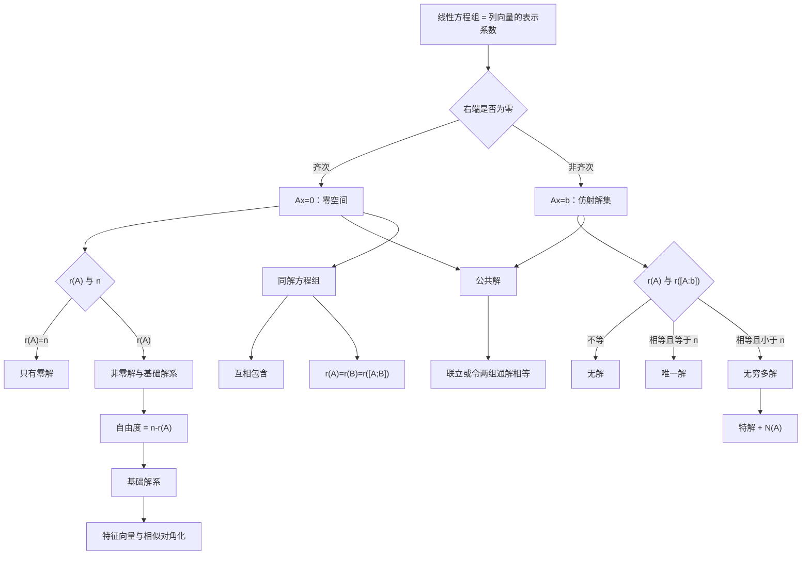

# 线代第4讲 线性方程组

源：`27张宇基础30讲线代.pdf`，印刷页 114-138 / PDF p120-p144。

整理方式：本讲 25 页已逐页 OCR，并逐张阅读 7 张全页联系图和 25 张高清原页；公式、矩阵、例题与答案均以原页复核结果为准。

## 本讲速览

- **总主线**：方程组就是列向量之间的表示关系。$Ax=0$研究列向量怎样组合成零向量，$Ax=b$研究$b$怎样由$A$的列向量表示。
- **判解只看两个数**：齐次方程组比较$r(A)$与未知数个数$n$；非齐次方程组先比较$r(A)$与$r([A:b])$，相等后再与$n$比较。
- **所有解的结构**：齐次通解是零空间的一组基的线性组合；非齐次通解是“一个特解 + 对应齐次通解”。
- **一眼识别自由度**：只要方程组相容，自由变量数、基础解系向量数、零空间维数都等于$n-r(A)$。
- **综合题三条支线**：多个非齐次解用“系数和”构造齐次解或特解；公共解求解空间交集；同解方程组判断两个零空间是否完全相同。
- **做题顺序**：先判结构，再做计算。没有确认相容性、秩和自由度前，不要急着回代求具体解。

## 教材路线

| 教材顺序 | 印刷页 / PDF页 | 本讲任务 |
|---|---|---|
| 基础知识结构 | 114 / p120 | 建立齐次、非齐次、公共解、同解四条主线 |
| 一、线性方程组与向量组其实是一回事 | 114-116 / p120-p122 | 看懂$Ax=b$就是列向量的线性表示 |
| 二、齐次线性方程组 | 116-122 / p122-p128 | 判非零解、求基础解系和通解，掌握例4.1-4.5 |
| 三、非齐次线性方程组 | 122-128 / p128-p134 | 判相容性、拆解通解，掌握例4.6-4.11 |
| 四、两个方程组的公共解 | 128-130 / p134-p136 | 掌握联立、代入、通解相等三种方法 |
| 五、同解方程组 | 130-132 / p136-p138 | 掌握互相包含、秩判据及例4.13-4.15 |
| 基础习题精练与答案 | 132-138 / p138-p144 | 用练习4.1-4.10反查判据边界和综合计算 |

## 前置知识与关联导航

- 行变换、阶梯形、伴随矩阵：[[20_线代第2讲_矩阵#五、初等变换与初等矩阵|初等变换]]、[[20_线代第2讲_矩阵#四、伴随矩阵|伴随矩阵]]。
- 矩阵秩和秩不等式：[[20_线代第2讲_矩阵#八、矩阵的秩|矩阵的秩]]。
- 线性表示、相关与无关：[[21_线代第3讲_向量组#二、向量与向量组的线性相关性|向量组的线性相关性]]。
- 极大无关组、向量组的秩和基：[[21_线代第3讲_向量组#三、极大线性无关组、等价向量组、向量组的秩|极大无关组与向量组的秩]]。
- 后续特征向量仍要反复求$(A-\lambda E)x=0$：[[23_线代第5讲_特征值与特征向量|下一讲：特征值与特征向量]]。

> [!note] 统一记号
> 本讲默认$A\in\mathbb R^{m\times n}$，未知向量$x\in\mathbb R^n$，$A=[\alpha_1,\alpha_2,\ldots,\alpha_n]$，右端列向量记为$b$或$\beta$。$[A:b]$表示在$A$右侧添加列$b$，$\begin{bmatrix}A\\B\end{bmatrix}$表示把$A,B$上下拼接。

## 知识网络

## 知识点清单

## 一、线性方程组与向量组其实是一回事

### 1. 三种形式与同一个本质

一般的$m$个方程、$n$个未知量的线性方程组可写为：

$$
\begin{cases}
a_{11}x_1+a_{12}x_2+\cdots+a_{1n}x_n=b_1,\\
\vdots\\
a_{m1}x_1+a_{m2}x_2+\cdots+a_{mn}x_n=b_m.
\end{cases}
$$

令

$$
A=(a_{ij})_{m\times n}
=[\alpha_1,\alpha_2,\ldots,\alpha_n],\qquad
x=(x_1,\ldots,x_n)^T,\qquad b=\beta,
$$

则它有三种完全等价的写法：

$$
Ax=b,
$$

$$
x_1\alpha_1+x_2\alpha_2+\cdots+x_n\alpha_n=\beta,
$$

以及原来的标量方程组。

**直观理解**：解向量$x$中的每个分量，不只是“未知数”，还是把$\beta$表示成$A$各列向量线性组合时的系数。因此：

- $Ax=0$的解：列向量组组合成零向量时的系数。
- $Ax=b$的解：$b$由列向量组表示时的系数。
- 数学一的向量空间语境中，$x$还可理解为$\beta$在一组基下的坐标。

增广矩阵为：

$$
[A:b]=
\begin{bmatrix}
a_{11}&\cdots&a_{1n}&b_1\\
\vdots&&\vdots&\vdots\\
a_{m1}&\cdots&a_{mn}&b_m
\end{bmatrix}.
$$

**看到什么想到它**：

- 题目给出$A=[\alpha_1,\ldots,\alpha_n]$和列向量关系：直接把关系系数写成方程组的解。
- 题目问“$b$能否由$\alpha_1,\ldots,\alpha_n$表示”：等价于问$Ax=b$是否有解。
- 题目给出一个解向量：把分量当作列向量的组合系数，而不是只当作一串数字。

### 2. 为什么求解只做初等行变换

对方程组做初等行变换，相当于左乘可逆初等矩阵$P$：

$$
Ax=b\iff PAx=Pb.
$$

可逆变换不会增删解，所以两组方程同解。行变换的目的有两个：

1. 暴露真实独立约束的个数$r(A)$。
2. 把主元变量写成自由变量的函数，得到全部解。

列变换会改变列向量及其组合系数，通常会改变原未知量的含义，不能直接当作同解变换。

**看到什么想到它**：凡是“求方程组的解、基础解系、参数条件”，默认先化系数矩阵或增广矩阵的行阶梯形，不用中学式逐个消元，也不随意做列变换。

## 二、齐次线性方程组

### 1. 定义与三种表示

齐次线性方程组的右端全为零：

$$
Ax=0
\iff
x_1\alpha_1+\cdots+x_n\alpha_n=0.
$$

它**永远至少有零解**$x=0$。考试中的“有解”通常没有区分度，真正要判断的是：

- 是否只有零解；
- 是否存在非零解；
- 基础解系有几个向量；
- 怎样表示全部解。

### 2. 齐次解的秩判据与零空间维数

设$r(A)=r$，则：

| 条件 | 解的情况 | 列向量关系 | 自由度 |
|---|---|---|---|
| $r(A)=n$ | 只有零解 | $\alpha_1,\ldots,\alpha_n$线性无关 | $0$ |
| $r(A)<n$ | 有非零解，且有无穷多解 | 列向量组线性相关 | $n-r(A)$ |

核心等式：

$$
\dim N(A)=n-r(A).
$$

这里$N(A)=\{x:Ax=0\}$是$A$的零空间。$n-r(A)$同时表示：

- 自由变量个数；
- 线性无关解的最大个数；
- 基础解系所含向量个数；
- 数学一中的解空间维数。

**为什么成立**：$r(A)$个主元对应$r(A)$个真实独立约束，剩下$n-r(A)$个变量可自由取值。只要存在一个自由变量，就可取出非零解；任意非零解的数倍又给出无穷多个解。

**看到什么想到它**：

- “存在非零解”“有基础解系”“有无穷多解”：立刻写$r(A)<n$。
- “只有零解”“列向量线性无关”：立刻写$r(A)=n$。
- “有$s$个线性无关解”：通常转成$n-r(A)=s$，再与其他秩条件联立。

### 3. 解的封闭性与类消去律

若$A\xi_1=0,A\xi_2=0$，则任意常数$k_1,k_2$满足：

$$
A(k_1\xi_1+k_2\xi_2)=0.
$$

所以齐次方程组的解集对加法和数乘封闭，是一个向量空间。

若$A\in\mathbb R^{m\times n}$且$r(A)=n$，则：

$$
AB=AC\Longrightarrow A(B-C)=0\Longrightarrow B=C.
$$

这叫“类消去律”。它不是形式上的随意约去$A$，真正条件是$A$列满秩，使$Ax=0$只有零解。

**看到什么想到它**：

- 多个已知齐次解被重新线性组合：新向量仍是解，之后只需检查线性无关。
- $AB=AC$想消去左因子$A$：必须先确认$r(A)=n$。

### 4. 基础解系与通解

当$r(A)<n$时，向量组$\xi_1,\ldots,\xi_s$是$Ax=0$的基础解系，当且仅当：

1. 每个$\xi_i$都是$Ax=0$的解；
2. $\xi_1,\ldots,\xi_s$线性无关；
3. 任一解都能由它们线性表示。

其中

$$
s=n-r(A).
$$

通解为：

$$
x=k_1\xi_1+\cdots+k_s\xi_s,\qquad k_1,\ldots,k_s\in\mathbb R.
$$

基础解系不唯一，但所含向量数固定。若

$$
\Xi=[\xi_1,\ldots,\xi_s],
$$

则另一组$s$个解向量$\Xi C$仍是基础解系，当且仅当$C$为$s$阶可逆矩阵。

> [!warning] 判断“另一组也是基础解系”
> 不能只看“等价”或“等秩”。必须同时核对：向量个数是$s$、每个向量确实是解、整组线性无关。最稳方法是把候选组写成原基础解系乘系数矩阵，再检验该系数矩阵行列式是否非零。

**看到什么想到它**：给一组基础解系，再让判断若干线性组合是否仍为基础解系，先利用解的封闭性确认“都是解”，再把注意力集中到系数矩阵是否可逆。

### 5. 求基础解系与通解的标准步骤

1. 对$A$做初等行变换，化为行阶梯形或行最简阶梯形矩阵$B$。
2. 数主元，得到$r(A)=r$。
3. 按列确定主元变量，其余$n-r$个未知量设为自由变量。
4. 用主元变量表示自由变量。
5. 让自由变量分别取一组线性无关的值，得到$n-r$个基础解向量。
6. 写成$x=\sum k_i\xi_i$。

自由变量不一定非要依次取$1,0,\ldots,0$，可以为避免分数而适当缩放；但不同次取值必须线性无关。教材例4.1也说明：只要选出的主元列构成一个非零$r$阶子式，剩余列对应变量均可作为自由变量。

**计算检查**：

- 基础解系向量个数是否恰为$n-r(A)$；
- 每个向量代回是否满足$A\xi_i=0$；
- 这些向量是否线性无关；
- 通解参数个数是否与自由变量个数一致。

### 6. 教材例4.1-4.5的方法提炼

**例4.1：直接求齐次通解**

- 先行化简得到秩，再选自由变量，而不是边看原方程边猜。
- 阶梯形已足够判秩和选自由变量；继续化为行最简形可减少回代。
- 自由变量可缩放取值以消分母，但最后的基础解系必须保持线性无关。

**例4.2：同时垂直于若干向量的单位向量**

设待求向量为$\beta$，把正交条件写成：

$$
\alpha_i^T\beta=0.
$$

先求齐次方程组的非零解$\beta$，再单位化：

$$
\beta^\circ=\pm\frac{\beta}{\|\beta\|}.
$$

三维中垂直于一个二维平面的单位法向量通常有正、负两个方向，不能漏掉$\pm$。

**例4.3：已知矩阵乘积，反推两个零空间维数**

先用

$$
r(AB)\le \min\{r(A),r(B)\}
$$

夹逼出$r(A),r(B)$，再分别使用“未知数个数减系数矩阵秩”。不要把$A$和$B$的列数混用。

**例4.4：伴随矩阵与基础解系**

使用

$$
AA^*=A^*A=\det(A)E
$$

及伴随矩阵秩结论。若$n$阶矩阵$r(A)=n-1$，则$r(A^*)=1$。当$\lvert A\rvert=0$时，$A^*A=0$说明$A$的每个列向量都是$A^*x=0$的解；再按$n-r(A^*)$挑出足够多的线性无关列。

**例4.5：基础解系换组**

候选向量都是原解的线性组合，所以“是解”自动成立；真正要检查的是系数矩阵是否可逆。若候选向量之间能直接相加得到零向量，可立即排除。

## 三、非齐次线性方程组

### 1. 定义、增广矩阵与向量表示

非齐次线性方程组写为：

$$
Ax=b
\iff
x_1\alpha_1+\cdots+x_n\alpha_n=b,
\qquad b\ne 0.
$$

它是否有解，等价于$b$是否属于$A$的列空间。添加$b$后若列向量组的秩增加，就说明$b$不能由原列向量组表示。

### 2. 相容性与解的个数

| 秩条件 | 结论 |
|---|---|
| $r(A)\ne r([A:b])$ | 无解 |
| $r(A)=r([A:b])=n$ | 唯一解 |
| $r(A)=r([A:b])=r<n$ | 无穷多解 |

判题顺序必须是：

1. 先比较$r(A)$与$r([A:b])$，判断是否相容；
2. 相容后，再与未知数个数$n$比较，判断唯一还是无穷多。

两个重要边界：

- **列满秩$r(A)=n$**：若有解则唯一，但仍可能无解。
- **行满秩$r(A)=m$**：对任意$b\in\mathbb R^m$都有解，因为

$$
r(A)=m\le r([A:b])\le m.
$$

于是$r([A:b])=r(A)=m$。若还满足$m=n$，则对任意$b$都有唯一解；若$m<n$，则对任意$b$都有无穷多解。

**看到什么想到它**：

- “无解”：行化简增广矩阵，寻找$[0\ \cdots\ 0\mid c]$且$c\ne0$的矛盾行。
- “有两个不同解”：线性方程组不可能恰有两个解，必为无穷多解，所以$r(A)=r([A:b])<n$。
- 题目只给$r(A)<n$：不能直接说无穷多解，还缺相容性。

### 3. 解的性质：差、平移与系数和

设$\eta_1,\eta_2,\eta$都是$Ax=b$的解，$\xi$是$Ax=0$的解，则：

$$
A(\eta_1-\eta_2)=0,
$$

$$
A(\eta+\xi)=b.
$$

更一般地，若$\eta_1,\ldots,\eta_t$都是同一非齐次方程组的解，则：

$$
A\left(\sum_{i=1}^t c_i\eta_i\right)
=\left(\sum_{i=1}^t c_i\right)b.
$$

因此在$b\ne0$时：

- $\sum c_i=0$：该线性组合是对应齐次方程组的解；
- $\sum c_i=1$：该线性组合仍是原非齐次方程组的解。

非齐次解集一般不是向量空间：两个特解相加通常得到右端$2b$。它是齐次零空间的平移，也就是一个仿射集合。

**看到什么想到它**：题目给出多个$Ax=b$的解，却不给$A,b$的具体值，优先做“解相减”或设计系数和为$0/1$的组合，不要尝试还原矩阵。

### 4. 通解结构与标准求法

若$Ax=b$相容，$\eta$是一个特解，$\xi_1,\ldots,\xi_s$是$Ax=0$的基础解系，则：

$$
x=\eta+k_1\xi_1+\cdots+k_s\xi_s,
\qquad s=n-r(A).
$$

标准步骤：

1. 对增广矩阵$[A:b]$做初等行变换并先判相容性。
2. 写出导出组$Ax=0$，求其基础解系。
3. 在非齐次方程组中令自由变量取$0$，通常可快速得到一个特解$\eta$。
4. 写成“特解 + 齐次通解”。

**为什么成立**：任意解$x$与特解$\eta$之差满足$A(x-\eta)=0$；反过来，特解加任意齐次解仍映到$b$。

**检查点**：

- 特解必须满足$A\eta=b$；
- 基础解系必须对应同一个系数矩阵$A$；
- 参数个数必须为$n-r(A)$；
- 特解不唯一，但不同特解给出的最终解集相同。

### 5. 由多个非齐次解反构通解

已知$r(A)=r$、未知数个数$n$及若干特解时：

1. 先确定需要$n-r$个齐次基础解。
2. 用系数和为$0$的组合制造齐次解。
3. 检查这些齐次解线性无关。
4. 用系数和为$1$的组合制造一个特解。
5. 写出“特解 + 基础解系线性组合”。

也可把已知解重新组合写成：

$$
[\zeta_1,\ldots,\zeta_t]
=[\eta_1,\ldots,\eta_t]C.
$$

若$C$可逆，则可在两组组合之间来回转换；这常用于快速找“若干差向量 + 一个特解”。

### 6. 教材例4.6、4.8-4.11的方法提炼

**例4.6：只给$m,n,r(A)$判断解的情况**

- $r(A)=m$是充分条件：对任意右端项都有解。
- $r(A)=n$只保证“若有解则唯一”，不保证相容。
- $m=n$若没有满秩条件，可能无解、唯一或无穷多解。
- $r(A)<n$只保证齐次方程组有非零解；非齐次方程组仍可能无解。

**例4.8：含参方程组已知有两个不同解**

先由“两个不同解”推出无穷多解，再得到$\lvert A\rvert=0$筛选参数。每个候选参数都必须回到增广矩阵检查$r(A)=r([A:b])$；只令行列式为零不够。

**例4.9：三个特解与若干组合**

- 设计总系数为$0$的组合，凑出$n-r(A)$个独立齐次解。
- 对两个特解取平均，系数和为$1$，仍是特解。
- 找到的齐次解数量正确还不够，仍要检查线性无关。

**例4.10：抽象列向量关系**

若$\alpha_1=2\alpha_2+\alpha_3$，则

$$
\alpha_1-2\alpha_2-\alpha_3+0\alpha_4=0
$$

直接给出齐次解$(1,-2,-1,0)^T$。若$\beta$已有表示系数$(1,2,3,4)^T$，它就是一个特解。再用$n-r(A)$确认所找齐次解是否已经构成基础解系。

**例4.11：从通解反推列向量关系**

若

$$
x=\eta+k\xi
$$

是$Ax=\alpha_5$的通解，则：

$$
A\eta=\alpha_5,\qquad A\xi=0.
$$

常数项给出$\alpha_5$的表示关系，参数项给出$A$各列的齐次关系。若通解只有一个参数，则$n-r(A)=1$，可再用秩排除看似可行、实则会使秩下降的表示。

### 7. 正规方程恒有解

教材例4.7给出一个常用二级结论：对任意实矩阵$A\in\mathbb R^{m\times n}$和任意$b\in\mathbb R^m$，

$$
A^TAx=A^Tb
$$

一定有解。

证明入口：

$$
[A^TA:A^Tb]=A^T[A:b],
$$

所以

$$
r([A^TA:A^Tb])
\le r(A^T)=r(A)=r(A^TA).
$$

而系数矩阵的秩不超过增广矩阵的秩，因此两者相等，方程相容。

但它不一定唯一：

$$
A^TAx=A^Tb\text{唯一解}
\iff r(A)=n.
$$

这也是最小二乘正规方程的代数基础，并与[[20_线代第2讲_矩阵#注解|矩阵章中的$A^TA$秩结论]]相连。

## 四、两个方程组的公共解

### 1. 公共解就是两个解集的交

齐次方程组$Ax=0$与$Bx=0$的公共解满足：

$$
\begin{bmatrix}
A\\
B
\end{bmatrix}x=0.
$$

因此

$$
N(A)\cap N(B)
=N\left(\begin{bmatrix}A\\B\end{bmatrix}\right).
$$

非齐次方程组$Ax=a$与$Bx=\beta$的公共解满足：

$$
\begin{bmatrix}
A\\
B
\end{bmatrix}x
=
\begin{bmatrix}
a\\
\beta
\end{bmatrix}.
$$

齐次方程组必有零公共解，所以题目若强调“公共解”，通常真正关心的是非零公共解或公共解空间的维数。

### 2. 三种求法

**方法一：直接联立**

上下拼接系数矩阵，直接求新方程组。这是给出具体$A,B$时最稳的通法。

**方法二：一组通解代入另一组**

若已知

$$
x=k_1\xi_1+\cdots+k_s\xi_s
$$

是$Ax=0$的通解，把它代入$Bx=0$，求参数$k_i$之间的关系，再代回。

**方法三：令两组通解相等**

若

$$
x=\sum_{i=1}^s k_i\xi_i,\qquad
x=\sum_{j=1}^t l_j\eta_j,
$$

则公共解满足：

$$
\sum_{i=1}^s k_i\xi_i-\sum_{j=1}^t l_j\eta_j=0.
$$

解出参数关系后，代回任一组通解。

**选择建议**：

- 两个系数矩阵都具体：优先联立。
- 一组已有基础解系，另一组矩阵简单：优先代入。
- 两组都只给基础解系：优先令两组通解相等。

### 3. 教材例4.12的迁移

例4.12用同一道题展示三种方法，三条路线必须得到同一个一维公共解空间。复习时不要只记最后向量，重点检查：

1. 拼接矩阵必须是上下拼接，不是左右拼接；
2. 代入法求的是参数关系，不是重新求全部未知量；
3. 两组通解相等时，参数属于不同方程组，不能提前把它们写成同一个字母。

**看到什么想到它**：题目出现“两方程组同时满足”“公共解”“既是$A$的解又是$B$的解”，立即翻译为解集交集。

## 五、同解方程组

### 1. 定义与三组等价判据

$Ax=0$与$Bx=0$同解，指它们有完全相同的解集：

$$
N(A)=N(B).
$$

常用判据：

$$
Ax=0\text{的解都满足}Bx=0,
$$

并且

$$
Bx=0\text{的解都满足}Ax=0.
$$

若已知$r(A)=r(B)$，只检验一个方向的包含即可。原因是：

$$
\dim N(A)=n-r(A)=n-r(B)=\dim N(B),
$$

同维子空间中，一个包含另一个就只能相等。

最方便的秩判据是：

$$
Ax=0\text{与}Bx=0\text{同解}
\iff
r(A)=r(B)=
r\left(\begin{bmatrix}A\\B\end{bmatrix}\right).
$$

它的本质是$A,B$的行空间相同。

> [!warning] 只知道$r(A)=r(B)$不够
> 两个同维子空间可能方向完全不同。还必须有一个解集包含关系，或证明上下拼接后秩没有增加。

### 2. 常用证明与计算路线

1. **互相代入**：分别证明每个$A$解也是$B$解，反之亦然。
2. **一边包含 + 秩相同**：客观题和证明题最省力。
3. **三秩相同**：计算上下拼接矩阵的秩。
4. **先求通解**：直接比较两组参数化解集。
5. **新增方程型**：若$B$是在$A$原方程上再增加若干方程，则$N(B)\subseteq N(A)$自动成立，只需让$A$的通解满足新增方程。

**看到什么想到它**：

- “在原方程组基础上添加一个方程，何时同解”：把原通解代入新增方程，并让结果对所有自由参数恒成立。
- “证明两个齐次方程组同解”：优先寻找一边包含，再用秩或零空间维数补齐另一边。

### 3. 教材例4.13：添加方程而不改变解集

原系统通解为$x=k\xi$。将它代入新增方程，得到关于$k$的式子。因为$k$任意，系数必须为零。教材得到参数条件后，还检查：

- 原系统的解满足新增方程；
- 新系统包含原系统全部旧方程，所以新系统的解自然满足原系统。

两边包含都成立，才可称同解。

### 4. 教材例4.14：相容性、转置与冗余方程

若$Ax=b$有解，则$b\in C(A)$，也就是$b$可由$A$的列向量表示。转置后，$b^T$可由$A^T$的行向量表示，因此在$A^Tx=0$下再添加方程$b^Tx=0$不会增加新约束：

$$
A^Tx=0
\quad\text{与}\quad
\begin{bmatrix}
A^T\\
b^T
\end{bmatrix}x=0
$$

同解。

转置拼接的易错式：

$$
[A,B]^T=
\begin{bmatrix}
A^T\\
B^T
\end{bmatrix},
$$

而不是$[A^T,B^T]$。因此$r([A,B])$与$r([A^T,B^T])$一般不相等。

### 5. 教材例4.15：平方范数与四秩相同

对实矩阵$A\in\mathbb R^{m\times n}$：

$$
Ax=0\Longrightarrow A^TAx=0.
$$

反过来，若$A^TAx=0$，左乘$x^T$：

$$
x^TA^TAx=(Ax)^T(Ax)=\|Ax\|^2=0.
$$

实向量范数平方为零只能说明$Ax=0$，故：

$$
N(A)=N(A^TA).
$$

由零空间维数相同可得：

$$
r(A)=r(A^TA).
$$

再结合转置与$AA^T$，得到常用“四秩相同”：

$$
r(A)=r(A^T)=r(A^TA)=r(AA^T).
$$

**边界**：教材讨论实矩阵。复数矩阵应使用共轭转置$A^H$和$\|Ax\|^2=(Ax)^H(Ax)$。

## 公式与二级结论索引

| 结论 | 完整条件与含义 | 详细位置 |
|---|---|---|
| $Ax=0$只有零解 | $A$有$n$列且$r(A)=n$ | [[#2. 齐次解的秩判据与零空间维数\|齐次秩判据]] |
| $Ax=0$有非零解 | $r(A)<n$，且非零解一旦存在就有无穷多个 | [[#2. 齐次解的秩判据与零空间维数\|齐次秩判据]] |
| 秩-零度公式 | $\dim N(A)=n-r(A)$ | [[#2. 齐次解的秩判据与零空间维数\|零空间维数]] |
| 类消去律 | $r(A)=n$时，$AB=AC\Rightarrow B=C$ | [[#3. 解的封闭性与类消去律\|类消去律]] |
| 基础解系换组 | 候选组$\Xi C$仍为基础解系 iff $C$可逆 | [[#4. 基础解系与通解\|基础解系]] |
| 非齐次相容 | $Ax=b$有解 iff $r(A)=r([A:b])$ | [[#2. 相容性与解的个数\|相容性]] |
| 非齐次唯一 | $r(A)=r([A:b])=n$ | [[#2. 相容性与解的个数\|解的个数]] |
| 非齐次无穷多 | $r(A)=r([A:b])<n$ | [[#2. 相容性与解的个数\|解的个数]] |
| 行满秩保证相容 | $r(A)=m$时，对任意$b\in\mathbb R^m$都有解 | [[#2. 相容性与解的个数\|行满秩]] |
| 非齐次通解 | $x=\eta+\sum k_i\xi_i$，$\eta$为特解，$\xi_i$为$N(A)$的基 | [[#4. 通解结构与标准求法\|通解结构]] |
| 多个特解的系数和 | $\sum c_i=0$造齐次解；$\sum c_i=1$仍为特解 | [[#3. 解的性质：差、平移与系数和\|系数和规则]] |
| 正规方程恒相容 | 任意实$A,b$下，$A^TAx=A^Tb$有解 | [[#7. 正规方程恒有解\|正规方程]] |
| 公共解 | $N(A)\cap N(B)=N([A;B])$，此处$[A;B]$为上下拼接 | [[#1. 公共解就是两个解集的交\|公共解]] |
| 同解三秩判据 | $N(A)=N(B)$ iff $r(A)=r(B)=r([A;B])$ | [[#1. 定义与三组等价判据\|同解判据]] |
| $A^TA$不改变零空间 | 实矩阵下$N(A)=N(A^TA)$ | [[#5. 教材例4.15：平方范数与四秩相同\|同解证明]] |
| 四秩相同 | 实矩阵下$r(A)=r(A^T)=r(A^TA)=r(AA^T)$ | [[#5. 教材例4.15：平方范数与四秩相同\|四秩相同]] |

## 题型—方法决策表

| 题面信号 | 首选方法 | 备选方法 | 最后检查 |
|---|---|---|---|
| 齐次方程组是否有非零解 | 比较$r(A)$与$n$ | 看列向量是否相关 | 比较对象是列数$n$，不是行数$m$ |
| 求齐次通解 | 行化简、选自由变量、造基础解系 | 化为行最简形直接读解 | 向量数$n-r(A)$且彼此无关 |
| 判断候选基础解系 | 解向量 + 个数 + 线性无关 | 写成$\Xi C$并检验$C$可逆 | 等价/等秩本身不够 |
| 同时垂直于多个向量 | 内积条件写成齐次方程组 | 三维时用几何法辅助 | 若求单位向量，要单位化并保留$\pm$ |
| 非齐次有无解 | 比较$r(A)$与$r([A:b])$ | 直接找矛盾行 | 先判相容，再谈唯一/无穷多 |
| 已知有两个不同解 | 直接判无穷多解 | 两解作差得非零齐次解 | 含参时仍须核增广秩 |
| 求非齐次通解 | 一个特解 + 导出组基础解系 | 直接从行最简增广矩阵参数化 | 参数数为$n-r(A)$ |
| 给多个非齐次解 | 系数和$0/1$法 | 解向量组乘可逆系数矩阵 | 齐次解必须找够且线性无关 |
| 给列向量关系求通解 | 关系系数写成齐次解；表示系数写成特解 | 展开$Ax=b$ | 用$n-r(A)$确认完整性 |
| 求两个方程组公共解 | 上下拼接联立 | 一组通解代入另一组 | 齐次题别只写零解 |
| 两组都给基础解系求公共解 | 令两组通解相等 | 选一组代入另一组 | 两组参数先分开记 |
| 判断同解 | 互相包含或三秩判据 | 求两组通解比较 | $r(A)=r(B)$单独不够 |
| 原系统增加一个方程后同解 | 原通解代入新增方程，对参数恒等 | 比较上下拼接秩 | 说明反向包含为何自动成立 |
| 出现$A^TA$ | 用$N(A)=N(A^TA)$和四秩相同 | 范数平方证明 | 实矩阵条件；恒有解不等于唯一 |
| 出现$A^*$与基础解系 | $AA^*=A^*A=\det(A)E$和伴随秩 | 从列向量关系找解 | 分清伴随$A^*$与转置$A^T$ |

## 教材例题覆盖表

| 例题 | 核心知识 | 看到什么想到它 | 可迁移的方法 |
|---|---|---|---|
| 4.1 | 齐次通解与自由变量 | 直接求基础解系 | 行变换后按秩选自由变量；可缩放取值以消分母 |
| 4.2 | 正交单位向量 | 同时与若干向量正交 | 写齐次方程，求非零解后单位化，答案有$\pm$ |
| 4.3 | 乘积秩与零度 | 已知$AB$的秩 | 先由$r(AB)$夹逼因子秩，再分别算“列数减秩” |
| 4.4 | 伴随矩阵零空间 | $A^*$、$AA^*=\det(A)E$ | 先判$r(A),r(A^*)$，再从$A^*A=0$挑独立列 |
| 4.5 | 基础解系换组 | 一组基础解系变成若干线性组合 | 候选系数矩阵可逆 iff 仍为基础解系 |
| 4.6 | 非齐次秩判据 | 只给$r(A),m,n$ | 行满秩保证任意$b$相容；列满秩不保证相容 |
| 4.7 | 正规方程 | $A^TAx=A^Tb$ | 以秩夹逼证明恒有解，再另判是否唯一 |
| 4.8 | 含参且有两个不同解 | “两个不同解” | 先判无穷多，$\lvert A\rvert=0$筛参数，再核增广秩 |
| 4.9 | 多个特解构造通解 | 同一$Ax=b$的若干解及组合 | 系数和$0$造齐次解，系数和$1$造特解 |
| 4.10 | 抽象列关系 | $\alpha_i$之间有关系，$\beta$已有表示 | 关系系数是齐次解，表示系数是特解 |
| 4.11 | 由通解反推列关系 | 给$x=\eta+k\xi$ | 拆成$A\eta=b$与$A\xi=0$，再用秩排除 |
| 4.12 | 公共解三种算法 | 两个齐次方程组 | 联立、代入、两通解相等三法互证 |
| 4.13 | 添加方程后的同解 | 原系统后多一行 | 原通解代入新增行，对任意参数恒成立 |
| 4.14 | 相容方程与转置 | 已知$Ax=b$有解 | $b\in C(A)$，故新增行$b^T$对$A^T$冗余 |
| 4.15 | $A^TA$同解与秩 | $Ax=0$和$A^TAx=0$ | 左乘$x^T$化为$\|Ax\|^2$，推出四秩相同 |

## 讲末练习反查

| 练习 | 结论或答案 | 笔记必须支持的做题链 |
|---|---|---|
| 4.1 | $\lambda=-2,\ \mu\ne-1$ | 对增广矩阵行化简；让系数行消失而右端不消失，形成矛盾行 |
| 4.2 | 选D | $Ax=b$无穷多$\Rightarrow r(A)=r([A:b])<n\Rightarrow Ax=0$有非零解；反向一般不能推 |
| 4.3 | 选B | 判断候选向量能否由基础解系线性表示；可把多个候选同时放进增广矩阵减少重复计算 |
| 4.4 | 选C | 等价向量组可能向量过多，等秩向量组可能不是解；候选仍须满足基础解系三条件 |
| 4.5 | 选C | 三个特解作差；由$n-r(A)=1$知只需一个非零齐次解，再加任一特解 |
| 4.6 | $\xi_1+k_1(\xi_1-\xi_2)+k_2(\xi_2-\xi_3)$，代入教材向量即得答案 | 两个差向量为独立齐次解；再以矩阵行数和独立行给$r(A)$上下界，确认已找齐 |
| 4.7 | $\eta=(2,-6,8)^T$ | 先写$\eta=k_1\xi_1+k_2\xi_2$，再叠加题给线性约束；也可用三向量行列式为零 |
| 4.8 | $x=(13/7,-4/7,0,0)^T+k_1(-3/7,2/7,1,0)^T+k_2(-13/7,4/7,0,1)^T$ | 行化简增广矩阵，分离一个特解和对应齐次基础解系 |
| 4.9 | 先逐层求$A\xi_2=\xi_1$与$A^2\xi_3=\xi_1$的通解；最终行列式恒为$-1/2$ | 每个矩阵方程都是非齐次通解；把任意参数保留到最后，用行列式证明三向量始终无关 |
| 4.10 | $m=2,\ n=4,\ t=6$ | 先求(I)通解$x=C(1,1,2,1)^T+(-2,-4,-5,0)^T$，代入(II)，令关于任意$C$的恒等式各项系数为零，再反向验同解 |

### 练习4.2的五条逻辑边界

1. $Ax=0$只有零解，只能推出$r(A)=n$；$Ax=b$可能唯一，也可能无解。
2. $Ax=0$有非零解，只能推出$r(A)<n$；$Ax=b$可能无穷多，也可能无解。
3. $A$行满秩，可推出对任意$b$都有解。
4. $Ax=b$有唯一解，可推出$Ax=0$只有零解。
5. $Ax=b$有无穷多解，可推出$Ax=0$有非零解。

其中第4、5条通常不能倒推，因为倒推时缺少相容性。

## 易错点/易混点

1. 齐次方程组永远有零解；题目真正问的通常是“是否有非零解”。
2. 基础解系个数用未知数个数$n$减秩，不是方程个数$m$减秩。
3. $r(A)<n$只保证齐次方程组有非零解，不保证非齐次方程组有解。
4. $r(A)=n$只保证$Ax=b$至多一个解；是否存在仍看$r([A:b])$。
5. $r(A)=m$才保证对任意$b\in\mathbb R^m$相容。
6. 线性方程组若有两个不同解，就有无穷多个解，不可能恰好两个。
7. $\lvert A\rvert=0$只说明方阵不满秩，含参非齐次题仍需检查增广秩。
8. 行变换保持同解；列变换通常改变未知量含义，不能随意用于求原方程组的解。
9. 自由变量可灵活选择和缩放，但得到的基础解向量必须线性无关。
10. “候选向量都是解”不等于“候选组是基础解系”，还要检查个数和线性无关。
11. 非齐次解不能任意相加；多个特解组合后是否仍为特解，要看系数和是否为$1$。
12. 特解不是基础解系的一部分；基础解系属于导出组$Ax=0$。
13. 公共解只要求同时满足两个方程组；同解要求两个完整解集完全相同。
14. 同解方程组秩相等是必要条件但不是充分条件，必须再有包含关系或三秩相同。
15. 公共解和同解中的$[A;B]$是上下拼接，非齐次增广$[A:b]$是左右拼接。
16. $[A,B]^T=[A^T;B^T]$，不是$[A^T,B^T]$；后两者的秩一般不同。
17. 正规方程$A^TAx=A^Tb$恒有解，但不一定唯一。
18. $A^*$是伴随矩阵，$A^T$是转置矩阵；例4.4和例4.14使用的对象不同。
19. $N(A)=N(A^TA)$的范数证明依赖实矩阵；复数情形应换成$A^H$。
20. 由多个特解作差得到的齐次解，数量正确后仍要证明彼此线性无关。

## 注解

### 1. 为什么“秩”能统一所有判解

$r(A)$统计系数矩阵提供了多少个独立约束；$r([A:b])$检查把右端项加入后是否出现新信息。新信息若无法由旧约束解释，就产生矛盾；若不产生矛盾，$n-r(A)$正好是还可自由变化的方向数。

### 2. 为什么齐次解集是空间，非齐次解集是平移

零空间通过原点，对加法、数乘封闭。非齐次解集若存在，则是$\eta+N(A)$：它与零空间形状、维数相同，只是整体从原点平移到特解$\eta$处。

### 3. 为什么多个特解要看“系数和”

线性映射会把组合系数原样带到右端：

$$
A\left(\sum c_i\eta_i\right)=\left(\sum c_i\right)b.
$$

所以“和为$0$回到原点”“和为$1$留在同一仿射平面”不是技巧硬记，而是线性的直接结果。

### 4. 为什么行满秩能覆盖所有右端项

$A\in\mathbb R^{m\times n}$行满秩意味着列空间的维数已经达到$m$，而列空间又是$\mathbb R^m$的子空间，因此列空间就是整个$\mathbb R^m$。任意$b$自然都能由$A$的列向量表示。

### 5. 为什么正规方程总有解

$A^Tb$一定属于$A^T$的列空间，而$A^TA$与$A$有相同的秩和零空间。正规方程把原问题投影到$A$的列空间方向上，因此即使原方程$Ax=b$不相容，正规方程仍相容。

### 6. 抽象方程组题怎样启动

不要等具体矩阵。看到列向量关系就把系数写成齐次解；看到目标向量的表示就把系数写成特解；看到多个特解就做差。最后用$n-r(A)$确认所找方向是否完整。

### 7. 本讲与后续知识的连接

- 特征向量本质是$(A-\lambda E)x=0$的非零解：[[23_线代第5讲_特征值与特征向量|特征值与特征向量]]。
- 正交、Gram矩阵与$A^TA$来自[[21_线代第3讲_向量组#2. 内积、模、夹角与正交|内积与正交]]。
- 伴随矩阵、秩不等式和初等行变换分别回链[[20_线代第2讲_矩阵#四、伴随矩阵|伴随矩阵]]、[[20_线代第2讲_矩阵#八、矩阵的秩|矩阵秩]]与[[20_线代第2讲_矩阵#五、初等变换与初等矩阵|初等变换]]。

## 速背检查

| 问题 | 快答 |
|---|---|
| $Ax=0$何时只有零解？ | $r(A)=n$。 |
| $Ax=0$何时有非零解？ | $r(A)<n$。 |
| 基础解系有几个向量？ | $n-r(A)$个。 |
| 基础解系必须满足哪三点？ | 都是解、线性无关、能表示全部解。 |
| 为什么齐次解可任意线性组合？ | 线性映射把组合仍映到零。 |
| $AB=AC$何时能推出$B=C$？ | $A$列满秩，即$r(A)=n$。 |
| $Ax=b$有解的充要条件？ | $r(A)=r([A:b])$。 |
| $Ax=b$何时唯一？ | $r(A)=r([A:b])=n$。 |
| $Ax=b$何时无穷多？ | $r(A)=r([A:b])<n$。 |
| 哪种满秩保证任意$b$都有解？ | 行满秩$r(A)=m$。 |
| 非齐次通解怎样写？ | 一个特解 + 对应齐次通解。 |
| 两个特解之差是什么？ | 对应齐次方程组的解。 |
| 多个特解系数和为$0$得到什么？ | 齐次解。 |
| 多个特解系数和为$1$得到什么？ | 原非齐次方程组的解。 |
| 两个不同解说明什么？ | 方程组有无穷多解。 |
| 正规方程是否总有解？ | 是；但不一定唯一。 |
| 两齐次方程组的公共解怎样求？ | 解$[A;B]x=0$。 |
| 同解方程组的三秩判据？ | $r(A)=r(B)=r([A;B])$。 |
| 秩相同能否单独推出同解？ | 不能，还要一个包含关系。 |
| $Ax=0$与$A^TAx=0$为何同解？ | 后者左乘$x^T$得到$\|Ax\|^2=0$。 |

## OCR/视觉核查

- 范围：PDF p120-p144，共 25 页；包括结构图、正文、例4.1-4.15、练习4.1-4.10和全部答案。
- OCR：25/25 页逐页完成，用于建立文字检索骨架；未直接采用 OCR 的数学公式。
- 联系图：7/7 张逐张阅读，确认章节边界、教材顺序和例题/答案分布。
- 高清原页：25/25 页逐页打开阅读；矩阵、上下标、转置、伴随、增广/上下拼接、参数条件均由原图复核。
- 高风险复核：p123-p131 的秩判据与例4.1-4.8，p132-p138 的抽象解、公共解、同解，p140-p144 的练习答案与参数结论。

## 相关链接

- [[00_目录与进度|考研数学目录与进度]]
- [[00_知识链路图|考研数学知识链路图]]
- [[00_定理公式方法题型易错真题索引|定理、公式、方法、题型与易错索引]]
- [[20_线代第2讲_矩阵|上一相关章：矩阵]]
- [[21_线代第3讲_向量组|上一讲：向量组]]
- [[23_线代第5讲_特征值与特征向量|下一讲：特征值与特征向量]]
