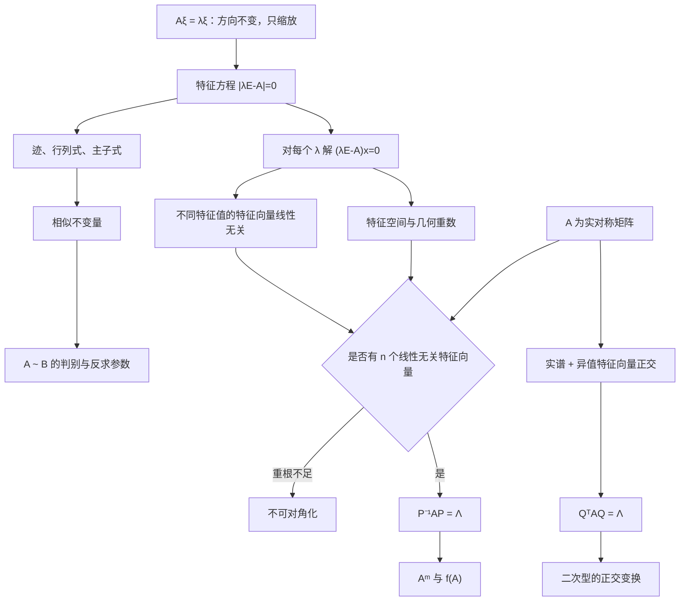

# 线代第5讲 特征值与特征向量

源：`27张宇基础30讲线代.pdf`，印刷页 139-177 / PDF p145-p183。

整理方式：本讲 39 页已逐页 OCR，并逐张阅读 10 张全页联系图和 39 张高清原页；定义、公式、矩阵、19 个正文例题及 15 道讲末练习均以原页复核结果为准。

## 本讲速览

- **总主线**：寻找矩阵作用下方向不变的非零向量。$A\xi=\lambda\xi$把矩阵运算转成数乘，由此贯通特征方程、相似、对角化、矩阵高次幂和二次型。
- **计算入口**：先由$|\lambda E-A|=0$求全部特征值，再对每个根解$(\lambda E-A)x=0$；根的重数和解空间维数必须分开记录。
- **相似的本质**：$B=P^{-1}AP$表示同一线性变换在不同基下的矩阵。相似保留特征多项式、迹、行列式、秩等信息，但这些相同一般仍不足以推出相似。
- **对角化判据**：$A$可相似对角化，当且仅当它有$n$个线性无关特征向量；重根处必须检查“几何重数 = 代数重数”。
- **实对称矩阵是特殊好情形**：特征值全为实数，不同特征值的特征向量正交，必可用正交矩阵$Q$化为对角矩阵。
- **做题顺序**：先识别结构和可用不变量，再决定展开行列式、求零空间、构造相似矩阵还是直接做特征值映射，避免一上来硬算$P^{-1}$或高次幂。

## 教材路线

| 教材顺序 | 印刷页 / PDF页 | 本讲任务 |
|---|---|---|
| 基础知识结构 | 139 / p145 | 建立“特征值与特征向量 → 相似 → 对角化 → 实对称”的主线 |
| 一、特征值与特征向量的定义 | 140 / p146 | 理解特征方向、非零条件和方阵要求 |
| 二、矩阵的特征值与特征向量的求法 | 140-144 / p146-p150 | 掌握特征方程、齐次方程组及多项式试根法 |
| 三、特征值、特征向量的性质与重要结论 | 145-151 / p151-p157 | 掌握迹、行列式、主子式、重数、矩阵函数和特殊矩阵 |
| 四、矩阵的相似 | 151-155 / p157-p161 | 掌握定义、相似不变量、派生矩阵及判别边界 |
| 五、矩阵的相似对角化 | 155-164 / p161-p170 | 掌握充要条件、构造$P$、反求$A$和高次幂 |
| 六、实对称矩阵的相似对角化 | 164-169 / p170-p175 | 掌握正交对角化、重根内正交化和同谱判相似 |
| 基础习题精练与答案 | 169-177 / p175-p183 | 用练习5.1-5.15反查映射、判定、构造和综合计算 |

## 前置知识与关联导航

- 行列式展开、主子式和代数余子式：[[19_线代第1讲_行列式|行列式]]。
- 逆矩阵、伴随矩阵、矩阵多项式与秩：[[20_线代第2讲_矩阵|矩阵]]。
- 线性相关、基、坐标和Gram-Schmidt：[[21_线代第3讲_向量组|向量组]]。
- 求$(\lambda E-A)x=0$的基础解系：[[22_线代第4讲_线性方程组#二、齐次线性方程组|齐次方程组]]。
- 下一讲用正交对角化把二次型化为标准形：[[24_线代第6讲_二次型|二次型]]。

> [!note] 统一记号
> 本讲默认$A,B\in\mathbb R^{n\times n}$，$E$为$n$阶单位矩阵，$A^\ast$为伴随矩阵，$\operatorname{tr}(A)$为迹。$\lambda$的代数重数记为$k$，对应特征空间$\ker(\lambda E-A)$的维数称为几何重数，记为$g$。

## 知识网络

## 知识点清单

## 一、特征值与特征向量的定义

### 1. 定义、对象与非零条件

设$A$是$n$阶矩阵。若存在数$\lambda$和$n$维**非零**列向量$\xi$，使

$$
A\xi=\lambda\xi,
$$

则称$\lambda$是$A$的特征值，$\xi$是$A$对应于$\lambda$的特征向量，$(\lambda,\xi)$称为一个特征对。

三个条件缺一不可：

1. $A$必须是方阵，才能让$A\xi$与$\xi$同维并比较方向。
2. $\xi\ne0$；若允许$\xi=0$，任意$\lambda$都满足等式，定义会失效。
3. 特征向量必须与特征值配对，不能脱离对应的$\lambda$单独谈。

非方阵没有本讲意义下的特征值，但常转而研究方阵$A^TA$或$AA^T$，这也是后续奇异值思想的入口。

### 2. 直观理解：寻找矩阵作用下不转向的方向

一般向量经过$A$后会改变长度和方向；特征向量所在的直线或子空间经过$A$后仍留在原方向，只被缩放$\lambda$倍：

- $\lambda>1$：同向拉伸。
- $0<\lambda<1$：同向压缩。
- $\lambda<0$：反向并按$|\lambda|$缩放。
- $\lambda=0$：被压到零向量，因此$A$不可逆。

对应于$\lambda$的特征空间为

$$
E_\lambda(A)=\ker(\lambda E-A).
$$

严格说，$E_\lambda(A)$包含零向量，而“对应于$\lambda$的全部特征向量”是$E_\lambda(A)\setminus\{0\}$。

> [!tip] 看到什么想到它
> 题目出现“方向不变”“$A\xi$与$\xi$成比例”“某非零向量经矩阵作用后变为自身若干倍”，立即写$A\xi=\lambda\xi$；出现“每行元素和相同”，立即试$\boldsymbol e=(1,\ldots,1)^T$。

## 二、矩阵的特征值与特征向量的求法

### 1. 从定义到特征方程

由$A\xi=\lambda\xi$得

$$
(\lambda E-A)\xi=0.
$$

要让齐次方程组有非零解，必须且只需

$$
|\lambda E-A|=0.
$$

其中：

- $\lambda E-A$称为特征矩阵。
- $f_A(\lambda)=|\lambda E-A|$称为特征多项式，是首项系数为$1$的$n$次多项式。
- $|\lambda E-A|=0$称为特征方程；其根按重数计共有$n$个（在复数域内）。

求解必须分两阶段：

1. 解特征方程，求全部$\lambda_i$及其代数重数。
2. 对每个$\lambda_i$分别解$(\lambda_iE-A)x=0$，取所有非零解。

> [!warning] 不能只求根
> 特征值的重数不能直接告诉你有几个线性无关特征向量。尤其遇到重根，必须继续求零空间维数$n-r(\lambda_iE-A)$。

### 2. 特殊结构先读谱，不要先展开

- 上三角、下三角、对角矩阵的特征值就是主对角线元素，按出现次数计重数。
- 分块三角矩阵的特征多项式等于各对角块特征多项式之积。
- 若$A-cE$具有明显低秩结构，可先求$A-cE$的特征值，再整体平移$c$。
- 若每行元素和为$c$，则

$$
A\boldsymbol e=c\boldsymbol e,\qquad \boldsymbol e=(1,\ldots,1)^T,
$$

所以$c$是特征值。

### 3. 特征多项式的试根与降次

直接展开得到三次或更高次多项式后，教材给出以下起步规则：

设

$$
f(x)=a_kx^k+a_{k-1}x^{k-1}+\cdots+a_1x+a_0.
$$

1. $a_0=0\Rightarrow f(0)=0$，先提出$x$。
2. 全部系数之和为$0\Rightarrow f(1)=0$，先提出$x-1$。
3. 偶次项系数之和等于奇次项系数之和$\Rightarrow f(-1)=0$，先提出$x+1$。
4. 试出一个根$r$后，用多项式除法把$f(x)$降一次；缺项必须补零系数。
5. 若$f(x)$是首一整系数多项式，则任一有理根必为整数，且是常数项$a_0$的因子；优先试$\pm1,\pm2,\ldots$。

**教材方法的目的**不是背求根花招，而是尽快把特征多项式化成一次因式与二次因式的乘积。行列式本身若可通过行列变换直接因式分解，通常比完全展开更快。

> [!tip] 看到什么想到它
> 三阶特征多项式出现系数和为零，先试$1$；正负交错后可能满足$f(-1)=0$，先试$-1$；常数项很小，先用整数因子试根，再做综合除法。

### 4. 求特征向量的标准步骤与例5.1

对每个特征值$\lambda_i$：

1. 写出$\lambda_iE-A$。
2. 只做初等**行**变换化阶梯形。
3. 求齐次方程组的基础解系$\eta_1,\ldots,\eta_s$。
4. 对应的全部特征向量为

$$
k_1\eta_1+\cdots+k_s\eta_s,\qquad (k_1,\ldots,k_s)\ne(0,\ldots,0).
$$

例5.1得到特征值$1,1,10$：

$$
E_1(A)=\operatorname{span}\left\{
\begin{pmatrix}-2\\1\\0\end{pmatrix},
\begin{pmatrix}2\\0\\1\end{pmatrix}
\right\},
$$

$$
E_{10}(A)=\operatorname{span}\left\{
\begin{pmatrix}1\\2\\-2\end{pmatrix}
\right\}.
$$

这个例子同时说明：二重根$1$恰有两个线性无关特征向量；单根$10$必只有一个独立方向。单根$\lambda$满足

$$
r(\lambda E-A)=n-1,
$$

但删去某个方程前仍要确认其余行能保持该秩，不能凭“行列式为零”随意删行。

> [!warning] 计算边界
> 求特征值时可以对行列式同时使用不改变其值或记录倍数的行、列变换；求特征向量时是在解方程组，只能用初等行变换。把列变换混进零空间求解会改变未知量含义。

## 三、特征值、特征向量的性质与重要结论

### 1. 特征值判定与参数题入口

对任意数$\lambda_0$：

$$
\lambda_0\text{是}A\text{的特征值}
\Longleftrightarrow
|\lambda_0E-A|=0
\Longleftrightarrow
\lambda_0E-A\text{不可逆}.
$$

$$
\lambda_0\text{不是}A\text{的特征值}
\Longleftrightarrow
|\lambda_0E-A|\ne0
\Longleftrightarrow
\lambda_0E-A\text{可逆且满秩}.
$$

常见改写：若$a\ne0$且

$$
|aA+bE|=0,
$$

则

$$
-\frac ba
$$

是$A$的特征值，因为$aA+bE=a\left(A+\frac baE\right)$。题面写“$aA+bE$不可逆”“对应齐次方程有非零解”完全同义。

> [!tip] 看到什么想到它
> 含参数矩阵被告知不可逆，先把它凑成$c(\lambda E-A)$，把不可逆条件翻译成“$\lambda$是$A$的特征值”，通常比展开行列式更快。

### 2. 迹、行列式与各阶主子式

设$A$的$n$个特征值按代数重数记为$\lambda_1,\ldots,\lambda_n$，则

$$
\sum_{i=1}^n\lambda_i=\operatorname{tr}(A),
\qquad
\prod_{i=1}^n\lambda_i=|A|.
$$

因此：

- 有一个特征值为$0\Longleftrightarrow |A|=0\Longleftrightarrow A$不可逆。
- 已知$n-1$个特征值时，可用迹求剩余特征值。
- 已知全部特征值时，可直接计算行列式，无需展开。

主子式是“所取行下标集合与列下标集合相同”的子式。若$M_k$表示$A$的全部$k$阶主子式之和，则

$$
|\lambda E-A|
=\lambda^n-M_1\lambda^{n-1}+M_2\lambda^{n-2}-\cdots+(-1)^nM_n,
$$

且

$$
M_k=\sum_{1\le i_1<\cdots<i_k\le n}
\lambda_{i_1}\lambda_{i_2}\cdots\lambda_{i_k}.
$$

三阶时尤其常用：

$$
M_1=\lambda_1+\lambda_2+\lambda_3=\operatorname{tr}(A),
$$

$$
M_2=\lambda_1\lambda_2+\lambda_1\lambda_3+\lambda_2\lambda_3,
$$

$$
M_3=|A|=\lambda_1\lambda_2\lambda_3.
$$

例5.4中，三阶矩阵特征值为$1,2,3$，二阶主子式之和为

$$
1\cdot2+1\cdot3+2\cdot3=11.
$$

题目若用“主对角元代数余子式之和”表述，本质仍是二阶主子式之和。

### 3. 代数重数与几何重数

若$\lambda_0$是特征多项式的$k$重根，则其代数重数为$k$。对应特征空间维数为

$$
g=\dim E_{\lambda_0}(A)
=n-r(\lambda_0E-A),
$$

称为几何重数，并满足

$$
1\le g\le k.
$$

也就是：$k$重特征值至多提供$k$个线性无关特征向量，但可能只提供$1,2,\ldots,k-1$个。

| 概念 | 从哪里读 | 它回答什么 |
|---|---|---|
| 代数重数$k$ | 特征多项式中$(\lambda-\lambda_0)^k$ | 这个根重复几次 |
| 几何重数$g$ | $n-r(\lambda_0E-A)$ | 对应特征空间有几个独立方向 |

> [!warning] 最常见误判
> “$\lambda_0$是二重根”不能推出“有两个线性无关特征向量”。只有再算出$r(\lambda_0E-A)=n-2$，才能得到$g=2$。

### 4. 不同特征值对应的特征向量线性无关

若$\lambda_1\ne\lambda_2$，且

$$
A\xi_1=\lambda_1\xi_1,\qquad
A\xi_2=\lambda_2\xi_2,
$$

则$\xi_1,\xi_2$线性无关。更一般地，两两不同的特征值对应的特征向量组线性无关。

两向量情形的证明思路：假设$k_1\xi_1+k_2\xi_2=0$，分别对等式作用$A$和乘$\lambda_1$，相减得到

$$
k_2(\lambda_2-\lambda_1)\xi_2=0,
$$

故$k_2=0$，再得$k_1=0$。多向量情形可用同样消元或归纳法。

这个定理直接给出充分条件：若$n$阶矩阵有$n$个互异特征值，就自动得到$n$个线性无关特征向量。

### 5. 特征向量线性组合的边界

**同一特征值**：若$\xi_1,\xi_2$都属于$\lambda$，则

$$
A(k_1\xi_1+k_2\xi_2)
=\lambda(k_1\xi_1+k_2\xi_2).
$$

所以只要$k_1\xi_1+k_2\xi_2\ne0$，它仍是属于$\lambda$的特征向量。这里允许某个系数为$0$。

**不同特征值**：若$\xi_1,\xi_2$分别属于$\lambda_1\ne\lambda_2$，且$k_1k_2\ne0$，则

$$
k_1\xi_1+k_2\xi_2
$$

不是$A$对应于任何特征值的特征向量。若某个系数为$0$，就退化回原来的一个特征方向。

**专属配对**：同一个非零特征向量不可能同时属于两个不同特征值，否则

$$
(\lambda_1-\lambda_2)\xi=0
$$

会与$\xi\ne0$、$\lambda_1\ne\lambda_2$矛盾。

几何上，同一特征空间内的任意非零线性组合仍在该空间；两个不同特征空间方向的混合通常不再保持单一缩放倍率。

例5.13正是利用“同一特征值的特征向量可作非零线性组合”，重新排列相似矩阵$P$的列。

### 6. 常用矩阵的特征值映射

若$A\xi=\lambda\xi$且$\xi\ne0$，则：

| 矩阵 | 对应特征值 | 对应特征向量 | 条件 |
|---|---:|---|---|
| $A$ | $\lambda$ | $\xi$ | 定义 |
| $kA$ | $k\lambda$ | $\xi$ | 任意数$k$ |
| $A^m$ | $\lambda^m$ | $\xi$ | 正整数$m$ |
| $f(A)$ | $f(\lambda)$ | $\xi$ | $f$为多项式 |
| $A^{-1}$ | $1/\lambda$ | $\xi$ | $A$可逆，故$\lambda\ne0$ |
| $A^\ast$ | $\det(A)/\lambda$ | $\xi$ | $A$可逆 |
| $P^{-1}AP$ | $\lambda$ | $P^{-1}\xi$ | $P$可逆 |
| $A^T$ | 与$A$相同的特征值 | 一般不是$\xi$ | 特征向量须另算 |

关键推导只有一条：把$A\xi=\lambda\xi$反复代入。例如

$$
f(A)\xi
=\left(a_0E+a_1A+\cdots+a_mA^m\right)\xi
=f(\lambda)\xi.
$$

若矩阵满足$f(A)=O$，则它的任一特征值都满足

$$
f(\lambda)=0.
$$

反过来，“全部特征值满足$f(\lambda)=0$”一般不能直接推出$f(A)=O$；若$A$可对角化，则可以通过$f(A)=Pf(\Lambda)P^{-1}$推出。

例5.3中$A^2=A$，所以任一特征值满足$\lambda^2=\lambda$，即$\lambda\in\{0,1\}$。于是$E+A$的特征值只能是$1,2$，均非零，故$E+A$可逆。进一步，$x(x-1)$无重根，所以幂等矩阵本身也可对角化。

例5.5中每行元素和为$2$，故$A\boldsymbol e=2\boldsymbol e$；又$|A|=3$，所以

$$
A^\ast\boldsymbol e=\frac32\boldsymbol e.
$$

由$A^\ast$的第一行可读出题目所求的第一列代数余子式之和为$3/2$。

> [!tip] 看到什么想到它
> 求$|f(A)|$时不要先算$f(A)$。先把$A$的特征值逐个代入$f$，再把$f(\lambda_i)$相乘。求$r(f(A))$且$A$可对角化时，可数$f(\lambda_i)$中非零值的个数（按重数计）。

### 7. 秩一矩阵与外积结构

若$A=\alpha\beta^T$，其中$\alpha,\beta$均为非零$n$维列向量，则$r(A)=1$，并且

$$
A\alpha=(\beta^T\alpha)\alpha.
$$

因此$\beta^T\alpha=\operatorname{tr}(A)$是一个特征值。又

$$
\dim\ker A=n-1,
$$

故$0$至少是$n-1$重特征值。按重数计，全部特征值为

$$
0,\ldots,0,\operatorname{tr}(A).
$$

若$\operatorname{tr}(A)=0$，则最后一个特征值也为$0$，但$A$仍可能不是零矩阵。

例5.2把这一结论推广到任意秩为$1$的$n$阶矩阵：$0$的几何重数为$n-1$，其余特征值由迹补出。

## 四、矩阵的相似

### 1. 定义及其与矩阵等价的区别

设$A,B$为两个$n$阶方阵。若存在$n$阶可逆矩阵$P$，使

$$
B=P^{-1}AP,
$$

则称$A$与$B$相似，记作$A\sim B$。

相似表示同一个线性变换在两组不同基下的矩阵；$P$的列通常承载从新基到旧基的坐标关系。

| 关系 | 对象 | 变换形式 | 保留的信息 |
|---|---|---|---|
| 等价 | 可为非方阵，只需同型 | $B=PAQ$，$P,Q$各自可逆 | 主要保留秩 |
| 相似 | 必须是同阶方阵 | $B=P^{-1}AP$ | 保留线性变换的谱结构 |

所以相似是比等价更严格的关系；不能把等价标准形当成相似标准形。

### 2. 相似是等价关系，证明相似有两条主路

相似满足：

1. 反身性：$A\sim A$。
2. 对称性：$A\sim B\Rightarrow B\sim A$。
3. 传递性：$A\sim B$且$B\sim C\Rightarrow A\sim C$。

证明$A\sim B$常用：

- **定义法**：直接构造可逆$P$使$P^{-1}AP=B$。
- **传递法**：找共同标准形$\Lambda$，证明$A\sim\Lambda$且$B\sim\Lambda$。

考研中第二条更常见，尤其当两矩阵都可对角化时。

### 3. 相似不变量：适合排除，不能随意反推

若$A\sim B$，则：

$$
|A|=|B|,
\qquad
r(A)=r(B),
\qquad
\operatorname{tr}(A)=\operatorname{tr}(B),
$$

$$
|\lambda E-A|=|\lambda E-B|,
$$

所以二者有相同的特征值及代数重数，并且对每个$\lambda$都有

$$
r(\lambda E-A)=r(\lambda E-B).
$$

此外，它们的各阶主子式之和分别相等。

这些结论的使用原则：

- 任意一项不同，立即判定不相似。
- 各项都相同，一般仍不能直接判定相似。
- 若二者都可对角化且特征值连同重数相同，则都相似于同一个对角矩阵，因而相似。

一个能说明“常见不变量全相同仍不够”的例子是两个四阶幂零矩阵，其Jordan块型分别为$J_3(0)\oplus J_1(0)$和$J_2(0)\oplus J_2(0)$。二者特征值、迹、行列式、秩、零空间维数和各阶主子式之和都相同，但前者$A^2\ne O$、后者$B^2=O$，故不相似。

> [!warning] 逻辑方向
> “相似$\Rightarrow$同谱”永远成立；“同谱$\Rightarrow$相似”一般错误。只有补上可对角化、实对称等足够条件时，才可能反推。

### 4. 相似关系对派生矩阵的传递

若$B=P^{-1}AP$，则同一个$P$给出

$$
B^m=P^{-1}A^mP,
\qquad
f(B)=P^{-1}f(A)P.
$$

若$A,B$可逆，还有

$$
B^{-1}=P^{-1}A^{-1}P,
\qquad
f(B^{-1})=P^{-1}f(A^{-1})P.
$$

伴随矩阵也满足

$$
B^\ast=P^{-1}A^\ast P.
$$

所以$f(A)$、$A^{-1}$、$A^\ast$可以按同一种相似变换组合，例如相应的线性组合仍相似。

转置矩阵也相似：

$$
A^T\sim B^T,
$$

但变换矩阵变为$P^{-T}$，因为

$$
B^T=P^TA^TP^{-T}.
$$

因此不能把$A^T$与$f(A)$当作由同一$P$同步变换。例5.8中

$$
A^2+A^T\sim B^2+B^T
$$

一般不成立，正是因为两部分的相似“手段”不同。

若$A\sim C$、$B\sim D$，则

$$
\begin{pmatrix}A&0\\0&B\end{pmatrix}
\sim
\begin{pmatrix}C&0\\0&D\end{pmatrix},
$$

相似矩阵可取为相应变换矩阵的分块对角矩阵。

若$X$可逆，则乘积换序满足

$$
X^{-1}(XY)X=YX,
$$

因此$XY\sim YX$。练习5.4正是先把$BA$写成$AD$，再由$A$可逆得到$B=ADA^{-1}$；若缺少可逆条件，不能仅凭“交换乘法顺序”断言两个乘积相似。

教材还用“$tE+A$扰动后取$t\to0^+$”说明：即使矩阵奇异，恒等式

$$
|A^\ast|=|A|^{n-1},
\qquad
(AB)^\ast=B^\ast A^\ast
$$

仍成立；可逆情形先用$A^\ast=|A|A^{-1}$证明，奇异情形再借连续性延拓。

### 5. 相似判别、参数反求与教材例5.6-5.8

判断或利用相似关系的顺序：

1. 先比阶数与方阵条件。
2. 用秩、迹、行列式快速排除。
3. 比特征多项式、特征值及重数。
4. 重根时比较$r(\lambda E-A)$，即比较几何重数。
5. 若都可对角化，尝试证明二者相似于同一个对角矩阵。
6. 题目要求参数时，用必要条件列方程后，还要代回检查是否真正相似。

例5.6先用秩、行列式、迹排掉三个选项，再由剩余矩阵都可对角化且同谱确认相似。选择题若只问唯一正确项，必要条件已经排完时通常不必在考场完整构造$P$。

例5.7由$A\sim B$直接用

$$
|A|=|B|,
\qquad
\operatorname{tr}(A)=\operatorname{tr}(B)
$$

得到$(a,b)=(0,1)$。

例5.8检验的是上一小节的边界：多项式、逆、伴随可沿同一个相似变换传递；转置虽保持相似，但不能随意与前者相加后仍断言相似。

## 五、矩阵的相似对角化

### 1. 定义：把矩阵换到特征向量基下

若存在可逆矩阵$P$，使

$$
P^{-1}AP=\Lambda,
$$

其中$\Lambda$为对角矩阵，则称$A$可相似对角化，$\Lambda$称为$A$的相似标准形。

若

$$
P=[\xi_1,\xi_2,\ldots,\xi_n],
\qquad
\Lambda=\operatorname{diag}(\lambda_1,\ldots,\lambda_n),
$$

则

$$
AP=P\Lambda
$$

等价于逐列关系

$$
A\xi_i=\lambda_i\xi_i,\qquad i=1,\ldots,n.
$$

因此，$P$的列就是一组线性无关特征向量；换到这组基后，$A$只对每个坐标轴做独立数乘。

这与等价标准形$PAQ$不同：相似对角化只允许右乘矩阵是左乘矩阵的逆，且矩阵必须为方阵。

### 2. 两个充要条件与两个常用充分条件

对$n$阶矩阵$A$，以下条件等价：

1. $A$可相似对角化。
2. $A$有$n$个线性无关特征向量。
3. 对每个特征值$\lambda_i$，几何重数等于代数重数，即若$\lambda_i$为$k_i$重根，则

$$
n-r(\lambda_iE-A)=k_i.
$$

教材常把后两条表述为两个充要判据。

两个直接可用的充分条件：

$$
A\text{有}n\text{个互异特征值}
\Longrightarrow A\text{可对角化},
$$

这里的特征值必须属于当前讨论的数域；若只允许实相似变换，则需要$n$个互异的**实**特征值。

$$
A\text{为实对称矩阵}
\Longrightarrow A\text{可对角化}.
$$

注意逻辑：

- 有重根不代表不能对角化，要检查对应特征空间是否够大。
- 特征值不全互异不代表不能对角化；$E$只有一个特征值$1$，却显然已是对角矩阵。
- 普通矩阵同谱不保证同时可对角化。

例5.9的矩阵$D$只有三重特征值$-1$，但

$$
n-r(-E-D)<3,
$$

独立特征向量不足，故不能对角化。例5.10则把三个“矩阵不可逆”条件翻译为$-1,3,1/3$三个互异特征值，直接判定可对角化。

> [!tip] 判断流程
> 先看是否实对称；再看是否有$n$个互异特征值；若出现重根，只在重根处计算$n-r(\lambda E-A)$。单根一定贡献一个独立特征向量。

### 3. 构造$P$与$\Lambda$的标准步骤

已知$A$可对角化时：

1. 求全部特征值及其代数重数。
2. 对每个特征值求一组特征空间基。
3. 共选出$n$个线性无关特征向量$\xi_1,\ldots,\xi_n$。
4. 令

$$
P=[\xi_1,\ldots,\xi_n].
$$

5. 按列一一对应地令

$$
\Lambda=\operatorname{diag}(\lambda_1,\ldots,\lambda_n),
$$

则$P^{-1}AP=\Lambda$。

$P$一般不唯一，原因包括：

- 每个特征向量都可乘非零常数。
- 同一特征空间内可换另一组基。
- 可以整体调整列顺序，但$\Lambda$中的对角元必须同步调整。

例5.11专门检验“列与对角元对应”：若$P$第$i$列属于$\lambda$，则$\Lambda$第$i$个对角元必须就是$\lambda$。同一特征值下的非零线性组合可以作新列，不同特征值向量的非平凡混合不能作特征向量列。

### 4. 由特征数据反求矩阵

若已知$n$个线性无关特征向量及对应特征值，则

$$
A=P\Lambda P^{-1}.
$$

也可不显式求$P^{-1}$，直接利用

$$
AP=P\Lambda
$$

按列建立矩阵方程。

例5.15给出

$$
\xi_1=(1,0,0)^T,
\quad
\xi_2=(1,1,0)^T,
\quad
\xi_3=(1,1,1)^T,
$$

以及$A\xi_i=i\xi_i$，所以

$$
P=[\xi_1,\xi_2,\xi_3],
\qquad
\Lambda=\operatorname{diag}(1,2,3),
$$

最终

$$
A=
\begin{pmatrix}
1&1&1\\
0&2&1\\
0&0&3
\end{pmatrix}.
$$

> [!tip] 看到什么想到它
> “给出若干线性无关向量并说明$A\xi_i=\lambda_i\xi_i$”就是把$P$和$\Lambda$直接递到手里；优先合并成$AP=P\Lambda$，不要逐个设$A$的九个未知元。

### 5. 抽象基、表示矩阵与循环向量

有些题不直接给标准坐标矩阵，而给一组基$C=[\alpha_1,\ldots,\alpha_n]$及$A\alpha_i$在该基下的表示。把每个$A\alpha_i$的坐标按列排成$B$，就有

$$
AC=CB,
\qquad
C^{-1}AC=B.
$$

先在小矩阵$B$上求谱和对角化。若

$$
Q^{-1}BQ=\Lambda,
$$

则

$$
(CQ)^{-1}A(CQ)=\Lambda.
$$

例5.14正是这条链：先由$A\alpha_i$关系写出表示矩阵$B$，求得特征值$1,1,4$及$B$的特征向量，再取$P=CQ$回到标准基。核心不是硬求$A$，而是“先在已知基下研究同一线性变换”。

例5.12给出

$$
A^2-A=2E,
\qquad
P=[\alpha,A\alpha],
$$

且$\alpha$不是$A$的特征向量。因为$\alpha,A\alpha$不成比例，所以$P$可逆；又

$$
A^2\alpha=2\alpha+A\alpha,
$$

故

$$
AP=[A\alpha,A^2\alpha]
=[\alpha,A\alpha]
\begin{pmatrix}0&2\\1&1\end{pmatrix}.
$$

于是

$$
P^{-1}AP=
\begin{pmatrix}0&2\\1&1\end{pmatrix},
$$

其特征值为$2,-1$，因此$A$可对角化。这是“取$\alpha,A\alpha,A^2\alpha,\ldots$构造循环基”的典型入口。

### 6. 矩阵幂、矩阵多项式与降幂

若$P^{-1}AP=\Lambda$，则

$$
A=P\Lambda P^{-1},
$$

$$
A^m=P\Lambda^mP^{-1},
$$

$$
f(A)=Pf(\Lambda)P^{-1}.
$$

其中

$$
\Lambda^m=\operatorname{diag}(\lambda_1^m,\ldots,\lambda_n^m),
$$

$$
f(\Lambda)=\operatorname{diag}(f(\lambda_1),\ldots,f(\lambda_n)).
$$

三个高频简化：

1. 若$A$可对角化且$f(\lambda_i)=c$对全部特征值都成立，则

$$
f(A)=cE.
$$

2. 若$A$可对角化且只有两个不同特征值$a,b$，则任意高次幂都可插值降为

$$
A^m=u_mA+v_mE,
$$

其中$u_m,v_m$由$u_ma+v_m=a^m$、$u_mb+v_m=b^m$求得。
3. 若已知低次矩阵方程，如$A^2=A+2E$，也可直接递推降幂，不一定完整求$P$。

例5.16中$A$可对角化，特征值为$1,2,3$，而

$$
f(x)=x^3-6x^2+11x-8
$$

在三点都取$-2$，故$f(A)=-2E$。

例5.17先由二重根$3$的几何重数必须为$2$求得参数$a=2$。此时不同特征值为$3,-1$，所以

$$
A^m=\frac{3^m-(-1)^m}{4}A
+\frac{3^m+3(-1)^m}{4}E.
$$

取$m=100$即可，比把$P\Lambda^{100}P^{-1}$完全乘开更简洁。

教材回扣前面乘积矩阵例题：若

$$
CB=
\begin{pmatrix}-1&0\\-1&-2\end{pmatrix},
$$

则由特征值$-1,-2$对角化可得

$$
(CB)^8=
\begin{pmatrix}1&0\\255&256\end{pmatrix}.
$$

## 六、实对称矩阵的正交对角化

### 1. 三个核心性质

若$A^T=A$且元素均为实数，则$A$是实对称矩阵。它具有：

1. 全部特征值均为实数，可选实特征向量。
2. 不同特征值对应的特征向量相互正交。
3. 存在正交矩阵$Q$使

$$
Q^TAQ=Q^{-1}AQ=\Lambda.
$$

第三条称为实对称矩阵的谱定理，也说明任意实对称矩阵必可相似对角化。

第二条的证明要抓住对称性：若$A\xi_i=\lambda_i\xi_i$，则

$$
(A\xi_1)^T\xi_2
=\xi_1^TA^T\xi_2
=\xi_1^TA\xi_2.
$$

两边分别代入特征值，得到

$$
(\lambda_1-\lambda_2)\xi_1^T\xi_2=0.
$$

当$\lambda_1\ne\lambda_2$时，必有$\xi_1^T\xi_2=0$。

正交比线性无关更强：非零正交向量必线性无关，但线性无关向量未必正交。

### 2. 为什么普通矩阵不能随便正交对角化

若某个实矩阵存在正交矩阵$Q$使$Q^TAQ=\Lambda$为实对角矩阵，则

$$
A=Q\Lambda Q^T,
$$

从而

$$
A^T=(Q\Lambda Q^T)^T=Q\Lambda Q^T=A.
$$

因此，实矩阵能被正交相似对角化的充要条件就是它为实对称矩阵。普通可对角化矩阵通常只能找到可逆$P$，不能保证$P^{-1}=P^T$。

### 3. 正交对角化的标准步骤

对实对称矩阵$A$：

1. 求全部特征值及重数。
2. 求各特征空间的一组基。
3. **只在同一个重特征值的特征空间内部**做Gram-Schmidt正交化。
4. 将全部向量单位化为$\eta_1,\ldots,\eta_n$。
5. 令

$$
Q=[\eta_1,\ldots,\eta_n],
$$

则$Q^TQ=E$且

$$
Q^TAQ=\operatorname{diag}(\lambda_1,\ldots,\lambda_n).
$$

Gram-Schmidt的一般形式：

$$
\beta_1=\alpha_1,
$$

$$
\beta_k=\alpha_k-
\sum_{j=1}^{k-1}
\frac{(\alpha_k,\beta_j)}{(\beta_j,\beta_j)}\beta_j,
\qquad
\eta_k=\frac{\beta_k}{\|\beta_k\|}.
$$

不同特征值的特征向量已经正交，不需要也不应把它们混合正交化。若跨不同特征空间做减投影，所得新向量一般不再是任何特征值的特征向量。

$Q$不唯一：列可改符号、可换顺序，同一重特征空间内还可选不同的标准正交基；但列顺序变化时$\Lambda$必须同步变化。

### 4. 例5.18：由正交矩阵一列反求参数

题给实对称矩阵及$Q$的第一列

$$
q_1=\frac1{\sqrt6}(1,2,1)^T.
$$

因为$Q$的列是单位特征向量，先代入$Aq_1=\lambda_1q_1$，得到参数$a=-1$及$\lambda_1=2$。再求其余特征值得$5,-4$，可选单位特征向量

$$
q_2=\frac1{\sqrt3}(1,-1,1)^T,
\qquad
q_3=\frac1{\sqrt2}(-1,0,1)^T.
$$

于是可取

$$
Q=
\begin{pmatrix}
\frac1{\sqrt6}&\frac1{\sqrt3}&-\frac1{\sqrt2}\\
\frac2{\sqrt6}&-\frac1{\sqrt3}&0\\
\frac1{\sqrt6}&\frac1{\sqrt3}&\frac1{\sqrt2}
\end{pmatrix},
$$

并有

$$
Q^TAQ=\operatorname{diag}(2,5,-4).
$$

几何上，$Q$代表一次保持长度与夹角的正交旋转或反射，$\Lambda$给出新坐标轴方向上的独立伸缩。

### 5. 两个实对称矩阵的相似判据与例5.19

一般矩阵同谱不一定相似；但若$A,B$均为$n$阶实对称矩阵，则

$$
A\sim B
\Longleftrightarrow
A,B\text{有完全相同的特征值及代数重数}.
$$

原因是二者都可正交对角化。同谱时可把对角元排成同一顺序，使

$$
Q_A^TAQ_A=\Lambda,
\qquad
Q_B^TBQ_B=\Lambda,
$$

由传递性得到$A\sim B$。

例5.19不直接解$P^{-1}AP=B$，而是分别求出$A,B$的特征值均为$2,5,-4$，再利用二者实对称，判定都相似于$\operatorname{diag}(2,5,-4)$。

若还要求把$A$变成$B$的相似矩阵，设

$$
P^{-1}AP=\Lambda,
\qquad
Q^{-1}BQ=\Lambda,
$$

则令

$$
S=PQ^{-1},
$$

便有

$$
S^{-1}AS=QP^{-1}APQ^{-1}=Q\Lambda Q^{-1}=B.
$$

计算时先明确题目采用$S^{-1}AS=B$还是$SAS^{-1}=B$，再确定乘法顺序，避免把$PQ^{-1}$与$QP^{-1}$混淆。

## 公式与二级结论索引

| 结论 | 完整条件与结果 | 详细讲解 |
|---|---|---|
| 特征对 | $A\xi=\lambda\xi$，其中$A$为方阵、$\xi\ne0$ | [[#1. 定义、对象与非零条件\|定义]] |
| 特征方程 | $\lambda$为特征值$\Longleftrightarrow\det(\lambda E-A)=0$ | [[#1. 从定义到特征方程\|特征方程]] |
| 特征空间 | $E_\lambda(A)=\ker(\lambda E-A)$，特征向量还须去掉零向量 | [[#2. 直观理解：寻找矩阵作用下不转向的方向\|特征空间]] |
| 谱的和与积 | $\sum\lambda_i=\operatorname{tr}(A)$，$\prod\lambda_i=\det(A)$，按代数重数计 | [[#2. 迹、行列式与各阶主子式\|迹与行列式]] |
| 主子式系数 | $k$阶主子式之和等于任取$k$个特征值乘积之和 | [[#2. 迹、行列式与各阶主子式\|主子式]] |
| 几何重数 | $g=n-r(\lambda E-A)\le k$，$k$为代数重数 | [[#3. 代数重数与几何重数\|两种重数]] |
| 异值向量 | 不同特征值对应的特征向量线性无关 | [[#4. 不同特征值对应的特征向量线性无关\|线性无关]] |
| 同值线性组合 | 同一特征空间内的非零线性组合仍是同值特征向量 | [[#5. 特征向量线性组合的边界\|线性组合]] |
| 矩阵函数映射 | $A\xi=\lambda\xi\Rightarrow f(A)\xi=f(\lambda)\xi$ | [[#6. 常用矩阵的特征值映射\|映射表]] |
| 逆与伴随 | $A$可逆时，$A^{-1}$和$A^\ast$对应特征值分别为$1/\lambda$、$\det(A)/\lambda$ | [[#6. 常用矩阵的特征值映射\|逆与伴随]] |
| 秩一矩阵 | $r(A)=1\Rightarrow$特征值为$n-1$个$0$和$\operatorname{tr}(A)$ | [[#7. 秩一矩阵与外积结构\|秩一结构]] |
| 相似 | $B=P^{-1}AP$，表示同一变换在不同基下的矩阵 | [[#1. 定义及其与矩阵等价的区别\|相似定义]] |
| 相似不变量 | 特征多项式、迹、行列式、秩、$r(\lambda E-A)$及各阶主子式之和相同 | [[#3. 相似不变量：适合排除，不能随意反推\|相似不变量]] |
| 对角化充要条件 | 有$n$个线性无关特征向量；等价于每个重根$g=k$ | [[#2. 两个充要条件与两个常用充分条件\|对角化判据]] |
| 矩阵幂 | $P^{-1}AP=\Lambda\Rightarrow A^m=P\Lambda^mP^{-1}$ | [[#6. 矩阵幂、矩阵多项式与降幂\|矩阵幂]] |
| 实对称谱定理 | $A^T=A\Rightarrow\exists Q$正交，使$Q^TAQ=\Lambda$ | [[#1. 三个核心性质\|谱定理]] |
| 实对称同谱判据 | 两个实对称矩阵相似$\Longleftrightarrow$特征值及重数完全相同 | [[#5. 两个实对称矩阵的相似判据与例5.19\|同谱判据]] |

## 题型—方法决策表

| 题面信号 | 首选知识点 | 起手式 | 备选路线 | 检查点 |
|---|---|---|---|---|
| 给具体矩阵，求谱 | 特征方程 | 先找三角、分块、低秩、行和等结构，再算$\det(\lambda E-A)$ | 试根后多项式除法 | 根要按重数写全 |
| 求特征向量 | 齐次方程组 | 对每个$\lambda_i$单独解$(\lambda_iE-A)x=0$ | 利用已知秩删冗余方程 | 去掉零向量，参数不全为零 |
| 给$A\xi$与$\xi$成比例 | 特征对定义 | 写$A\xi=\lambda\xi$逐分量比较 | 若只问$\lambda$可找任一非零分量 | 先确认$\xi\ne0$ |
| $aA+bE$不可逆 | 特征值判定 | 凑成$a(A-\lambda E)$ | 写行列式为零 | 注意$\lambda=-b/a$的符号 |
| 已知全部或部分特征值 | 迹、行列式、主子式 | 用和、积、两两乘积和 | 对矩阵多项式做谱映射 | 重数不能漏 |
| $A^2=A$、$f(A)=O$ | 多项式约束 | 对特征对作用矩阵等式，得$f(\lambda)=0$ | 若可对角化再反推$f(A)$ | 只得候选值，不保证每个都出现 |
| $A=\alpha\beta^T$或$r(A)=1$ | 秩一矩阵 | 先写$n-1$个零，再用迹补最后一个 | 直接算$A\alpha$ | 迹为零时可能全谱为零 |
| 求$\det(f(A))$、$r(f(A))$ | 特征值映射 | 计算$f(\lambda_i)$ | 可对角化时数非零对角元 | 求秩路线通常需要可对角化 |
| 判断$A\sim B$ | 相似不变量 | 先比秩、迹、行列式、特征多项式 | 都可对角化时找共同$\Lambda$ | 同谱一般只必要 |
| 相似关系中反求参数 | 相似不变量 | 用迹、行列式、重根几何重数列式 | 最后构造共同标准形 | 必要条件解出后仍要验充分性 |
| 判断能否对角化 | 几何重数 | 实对称或$n$个异根可直接判；重根算$n-r$ | 看最小多项式是否无重根 | 每个重根都必须$g=k$ |
| 已给$P^{-1}AP=\Lambda$候选 | 列序对应 | 检查$P$第$i$列是否属$\Lambda_{ii}$ | 用$AP=P\Lambda$逐列验 | $P$必须可逆 |
| 给一组基及$A\alpha_i$ | 表示矩阵 | 把坐标按列组成$B$，得$AC=CB$ | 在$B$上先对角化 | 最终相似矩阵是$CQ$ |
| 求$A^m$或$f(A)$ | 对角化/降幂 | $A^m=P\Lambda^mP^{-1}$ | 用低次方程或谱插值降幂 | 普通矩阵不能逐元素乘方 |
| 实对称矩阵求$Q$ | 正交对角化 | 求谱与特征空间，重根内部正交化，再全部单位化 | 由已知$Q$列先反推参数 | $Q^TQ=E$且列序对应 |
| 两个实对称矩阵是否相似 | 实对称同谱判据 | 比较完整特征值多重集 | 分别正交化到同一$\Lambda$ | 必须同时是实对称矩阵 |
| 分块对角矩阵高次幂 | 分块运算 | 每个块分别求幂 | 可对角化块用谱，Jordan型块用二项式 | 保持原分块位置 |

## 教材例题覆盖表

| 例题 | 题面信号 | 方法入口 | 独有结论或迁移 |
|---|---|---|---|
| 例5.1 | 具体三阶实对称矩阵 | 特征方程后逐根求零空间 | 二重根可对应二维特征空间；单根处秩为$n-1$ |
| 例5.2 | $r(A)=1$或$A=\alpha\beta^T$ | 零空间维数$n-1$，余根用迹 | 秩一矩阵谱为$0,\ldots,0,\operatorname{tr}(A)$ |
| 例5.3 | $A^2=A$ | 特征值代入矩阵多项式 | 谱只可能为$0,1$，故$E+A$可逆 |
| 例5.4 | 三阶矩阵已知三个特征值 | 用二阶主子式之和 | 答案$11$，不必求矩阵元素 |
| 例5.5 | 每行和为$2$且$\det(A)=3$ | $A\boldsymbol e=2\boldsymbol e$，再映射到$A^\ast$ | 代数余子式列和为$3/2$ |
| 例5.6 | 从四个矩阵中选相似者 | 秩、行列式、迹先排除 | 剩余者用同谱且可对角化确认 |
| 例5.7 | 相似矩阵含参数 | 迹与行列式列方程 | $(a,b)=(0,1)$ |
| 例5.8 | $A\sim B$后比较派生矩阵 | 区分同一相似手段与转置手段 | $A^2+A^T$与$B^2+B^T$一般不保证相似 |
| 例5.9 | 判断四个矩阵能否对角化 | 实对称、异根先判，重根验几何重数 | 三重根但独立向量不足者失败 |
| 例5.10 | 三个矩阵不可逆条件 | 翻译成$-1,3,1/3$三个特征值 | 三个互异根直接保证三阶矩阵可对角化 |
| 例5.11 | 已知若干特征向量，选择$P$ | 检查每列与$\Lambda$对角元对应 | 同特征空间可组合，异特征空间不可混合 |
| 例5.12 | $A^2-A=2E$且$P=[\alpha,A\alpha]$ | 证明循环向量组无关，再写表示矩阵 | $P^{-1}AP=\begin{pmatrix}0&2\\1&1\end{pmatrix}$ |
| 例5.13 | 更换$P$的列 | 同一特征空间的非零线性组合 | 无需重算$P^{-1}AP$，只看列所对应的特征值 |
| 例5.14 | 给基$\alpha_i$及$A\alpha_i$关系 | 先构造表示矩阵$B$，再取$P=CQ$ | 抽象基题先在坐标矩阵上降维计算 |
| 例5.15 | 给三组完整特征数据 | $A=P\Lambda P^{-1}$或$AP=P\Lambda$ | 得$A=\begin{pmatrix}1&1&1\\0&2&1\\0&0&3\end{pmatrix}$ |
| 例5.16 | 求矩阵多项式 | 在全部特征值上求$f(\lambda)$ | 三个值都为$-2$，故$f(A)=-2E$ |
| 例5.17 | 含参数矩阵可对角化并求$A^{100}$ | 用重根几何重数定参数，再对角化或插值降幂 | $a=2$；两点谱可把高次幂降为$uA+vE$ |
| 例5.18 | 实对称矩阵，已知$Q$第一列 | 该列必为单位特征向量，先反求参数 | $a=-1$，再补齐正交单位特征向量 |
| 例5.19 | 两个实对称矩阵判相似 | 分别求谱并化到同一对角阵 | 同谱是实对称矩阵相似的充要条件 |

## 讲末练习反查

下面不是抄题，而是把每题的“识别信号 → 起手知识 → 结果”压缩成复习入口。

| 练习 | 识别与首步 | 关键链路 | 结果 |
|---|---|---|---|
| 5.1 | 已知$2$是$A$的特征值，问含$A^2$和逆的矩阵 | 先映射为$4/3$，取逆后变为$3/4$ | B，$3/4$ |
| 5.2 | $A$实对称，求$(P^{-1}AP)^T$的特征向量 | 展开为$P^TAP^{-T}$，对$P^T\alpha$作用 | B，$P^T\alpha$ |
| 5.3 | 多个同谱矩阵判相似 | 在重根$2$处比较几何重数 | B：$A\sim C$，$B\not\sim C$ |
| 5.4 | $A$可逆且给出$BA=AD$ | 左乘$A^{-1}$得$A^{-1}BA=D$ | B，相似于$\operatorname{diag}(2,-1,3)$ |
| 5.5 | 已知$A$的三个特征值，求$\det(A^\ast-E)$ | $A^\ast$谱为$-2,3,-6$，再平移$-1$并求积 | $42$ |
| 5.6 | 已知四阶$A^\ast$的谱，求$\det(f(A))$ | 由$\det(A^\ast)=[\det(A)]^3$得$\det(A)=2$，再反推$A$谱并代$f$ | $-187/8$ |
| 5.7 | 含参数矩阵可对角化且有二重根 | 二重根必须满足$n-r(\lambda E-A)=2$ | $x+y=0$ |
| 5.8 | $A$相似于$\operatorname{diag}(1,-1,2)$，求两个多项式矩阵秩之和 | 在三个特征值上分别判断多项式是否为零 | $2+2=4$ |
| 5.9 | 给$A^{-1}$的一个特征值，反求参数$k$ | 取倒数得到$A$的特征值，再代特征方程 | $k=1$或$k=-2$ |
| 5.10 | $A^\ast\xi$与$\xi$关系、行列式已知 | 对$AA^\ast=\det(A)E$作用于$\xi$ | $a=c=2,b=-3,\lambda_0=1$ |
| 5.11 | 完整求$P^{-1}AP=\Lambda$ | 求谱$2,-1,-2$及三个一维特征空间 | 可取$P=[(4,3,1)^T,(-\tfrac12,0,1)^T,(0,-1,1)^T]$，$\Lambda=\operatorname{diag}(2,-1,-2)$ |
| 5.12 | 参数矩阵有二重根并要求对角化 | 特征多项式定参数，再验二重根有二维特征空间 | $a=4,b=5$；可取列向量$(2,1,0)^T,(-3,0,1)^T,(-1,-1,1)^T$，$\Lambda=\operatorname{diag}(1,1,5)$ |
| 5.13 | 实对称矩阵正交对角化，某特征值重复 | 求$2,2,-7$；只在$\lambda=2$的二维空间内正交化 | $Q^TAQ=\operatorname{diag}(2,2,-7)$ |
| 5.14 | 实对称矩阵给两个属于$1$的特征向量，另一个特征值$-1$ | 用正交性求与二者都垂直的方向，再$A=Q\Lambda Q^T$ | $A=\begin{pmatrix}0&1&0\\1&0&0\\0&0&1\end{pmatrix}$ |
| 5.15 | 四阶分块对角矩阵求$A^n$ | 对$B$用两点谱降幂，对$C=2E+N$用$N^2=O$ | 见下方分块公式 |

练习5.15中，令

$$
B=\begin{pmatrix}1&-2\\-1&0\end{pmatrix},
\qquad
C=\begin{pmatrix}2&1\\0&2\end{pmatrix},
\qquad
\varepsilon=(-1)^n,
$$

则

$$
B^n=
\begin{pmatrix}
\dfrac{2^{n+1}+\varepsilon}{3}&\dfrac{-2^{n+1}+2\varepsilon}{3}\\[6pt]
\dfrac{-2^n+\varepsilon}{3}&\dfrac{2^n+2\varepsilon}{3}
\end{pmatrix},
$$

$$
C^n=
\begin{pmatrix}
2^n&n2^{n-1}\\
0&2^n
\end{pmatrix}.
$$

原矩阵$A=\operatorname{diag}(B,C)$，故$A^n=\operatorname{diag}(B^n,C^n)$。这题把“分块计算、可对角化块、幂零扰动”三种知识串在一起。

## 易错点/易混点

1. **零向量不是特征向量**：写通解时必须注明参数不全为零。
2. **方阵才谈本讲特征值**：长方阵应转向$A^TA$、$AA^T$等方阵。
3. **$|\lambda E-A|$与$|A-\lambda E|$符号可能差$(-1)^n$**：根相同，但展开系数和首项符号不同。
4. **重根不等于多个独立方向**：代数重数来自多项式，几何重数来自零空间。
5. **求特征向量不能做列变换**：列变换会改变未知量坐标。
6. **同一特征值下的线性组合须非零**：恰好组合成零向量时仍不是特征向量。
7. **不同特征值向量的非平凡混合不是特征向量**：只有某个系数为零时例外。
8. **$f(A)=O\Rightarrow f(\lambda)=0$，反向一般不成立**：反推通常要补“$A$可对角化”。
9. **$A^T$与$A$同谱，不一定同特征向量**：必须重新解$(\lambda E-A^T)x=0$。
10. **伴随特征值公式要看可逆性**：$|A|/\lambda$要求$A$可逆；奇异情形不能除以$0$。
11. **同谱一般不推出相似**：还需比较重根结构，或证明双方都可对角化。
12. **相似不变量都是必要条件**：由迹、行列式求出参数后仍要验证充分性。
13. **相似与等价不可混**：$PAQ$中的左右矩阵独立，$P^{-1}AP$中的两边互为逆。
14. **相似变换方向不可倒置**：$B=P^{-1}AP$与$B=PAP^{-1}$对应不同变换矩阵。
15. **转置相似使用不同的变换矩阵**：所以$f(A)+A^T$不能按同一$P$直接整体搬过去。
16. **能对角化不要求特征值互异**：互异只是充分条件，重根且$g=k$也可以。
17. **$P$的列序与$\Lambda$必须同步**：改列序而不改对角元会让$AP=P\Lambda$失效。
18. **普通对角化只要求$P$可逆**：不能擅自把$P^{-1}$换成$P^T$。
19. **正交化只在同一重特征空间内做**：跨不同特征值混合会破坏特征向量身份。
20. **单位化不能省**：正交向量组成的矩阵未必正交，列向量还必须长度为$1$。
21. **实对称同谱判相似有前提**：只要有一个矩阵不是实对称，就不能套此充要判据。
22. **求高次幂前先看低次方程和分块**：对角化不是唯一方法，也不总是最省算力。

## 注解

### 1. 为什么特征值把矩阵问题变简单

矩阵乘法会混合各坐标；在特征向量基下，混合被拆成若干独立数乘。对角化不是为了“把矩阵变好看”，而是把线性变换分解成互不干扰的基本方向。

### 2. 为什么要区分代数重数和几何重数

代数重数记录特征方程重复根，几何重数记录真实可用方向。对角化需要一整组基，所以真正决定成败的是“每个根能否提供与重数同样多的独立方向”。

### 3. 为什么相似保留特征值

由

$$
\lambda E-P^{-1}AP=P^{-1}(\lambda E-A)P
$$

取行列式，左右两个$P$因子相消，特征多项式不变。它体现的是“换坐标不改变线性变换本身的固有伸缩倍率”。

### 4. 为什么相似不变量相同仍可能不相似

迹、行列式、特征值只记录了谱的粗信息；重根附近还存在特征向量数量及更深的广义特征向量链结构。考研范围内通常用$r(\lambda E-A)$或可对角化性区分，不必展开完整Jordan理论。

### 5. 为什么实对称矩阵格外重要

对称性把左右内积交换起来，迫使不同特征空间正交；因此总能选到一组标准正交特征向量。下一讲二次型的正交变换，本质就是沿这些主轴重新选坐标。

### 6. 矩阵多项式题怎样一眼降维

不要把$f(A)$当成要逐项乘出的矩阵，先看它对每个特征方向做什么。可对角化时，问题等价于在有限个数$\lambda_i$上计算普通函数$f(\lambda_i)$。

### 7. 抽象基题怎样启动

看到$A\alpha_i$被写成$\alpha_1,\ldots,\alpha_n$的线性组合，就把组合系数按列排成表示矩阵$B$。此时$AC=CB$已经把题目变成普通矩阵题，最后再用$C$把结果送回原坐标。

### 8. 与前后章节的连接

- 求特征向量本质上是求齐次方程组的基础解系：[[22_线代第4讲_线性方程组#4. 基础解系与通解|基础解系]]。
- 构造$P$是在寻找一组新基：[[21_线代第3讲_向量组#2. 基变换与坐标变换|基与坐标]]。
- $Q^TAQ=\Lambda$将直接成为二次型正交化的主工具：[[24_线代第6讲_二次型|二次型]]。

## 速背检查

1. **特征向量为什么不能为零？** 零向量对任意$\lambda$都满足$A0=\lambda0$，无法建立专属配对。
2. **求特征值的必要充分条件？** $|\lambda E-A|=0$。
3. **求到特征值后下一步？** 对每个根单独解$(\lambda E-A)x=0$并去掉零向量。
4. **三角矩阵的特征值？** 主对角线元素，按出现次数计。
5. **特征值的和、积？** 分别为$\operatorname{tr}(A)$和$|A|$。
6. **三阶二阶主子式之和？** $\lambda_1\lambda_2+\lambda_1\lambda_3+\lambda_2\lambda_3$。
7. **几何重数怎样算？** $n-r(\lambda E-A)$，且不超过代数重数。
8. **不同特征值的特征向量有什么关系？** 线性无关；若$A$实对称，还正交。
9. **同一特征值向量能否相加？** 非零线性组合仍为该特征值的特征向量。
10. **$f(A)$怎样映射特征值？** $f(A)\xi=f(\lambda)\xi$。
11. **$A^{-1}$和$A^\ast$的对应特征值？** $1/\lambda$和$|A|/\lambda$，前提是$A$可逆。
12. **秩一$n$阶矩阵的谱？** $n-1$个$0$和一个$\operatorname{tr}(A)$。
13. **相似的定义？** 存在可逆$P$使$B=P^{-1}AP$。
14. **同谱能否推出相似？** 一般不能；双方都可对角化且同谱时可以。
15. **可对角化的充要条件？** 有$n$个线性无关特征向量；等价于每个重根$g=k$。
16. **两个常用充分条件？** $n$个互异特征值；实对称。
17. **怎样构造$P$？** 按顺序把$n$个线性无关特征向量作列，$\Lambda$按同序放对应特征值。
18. **怎样由特征数据反求$A$？** $A=P\Lambda P^{-1}$。
19. **怎样求高次幂？** $A^m=P\Lambda^mP^{-1}$，或利用低次方程、谱插值降幂。
20. **实对称矩阵正交对角化步骤？** 求谱、求特征空间、重根内正交化、全部单位化、按列组成$Q$。
21. **为什么不同特征值向量不用正交化？** 实对称矩阵中它们天然正交。
22. **两个实对称矩阵何时相似？** 特征值连同代数重数完全相同。

## OCR/视觉核查

- 核查范围：`27张宇基础30讲线代.pdf` PDF p145-p183，共39页。
- OCR：39页逐页完成，用于建立小节、例题、练习和答案文字骨架；数学公式未直接采用OCR结果。
- 全页视觉：10张2×2联系图全部阅读，39张高清原页全部逐页阅读。
- 重点复核：特征多项式试根法、各阶主子式公式、重数判据、矩阵映射表、相似反例、伴随连续性说明、对角化列序、抽象基例题、实对称正交化、练习5.1-5.15答案页。
- 证据入口：[[00_OCR视觉核查报告#23 线代 特征值与特征向量|本讲OCR/视觉核查记录]]。

## 相关链接

- [[00_目录与进度|考研数学目录与进度]]
- [[00_知识链路图|考研数学知识链路图]]
- [[00_公式极简总表|公式极简总表]]
- [[00_定理公式方法题型易错真题索引|定理、公式、方法与易错索引]]
- [[22_线代第4讲_线性方程组|上一讲：线性方程组]]
- [[24_线代第6讲_二次型|下一讲：二次型]]
