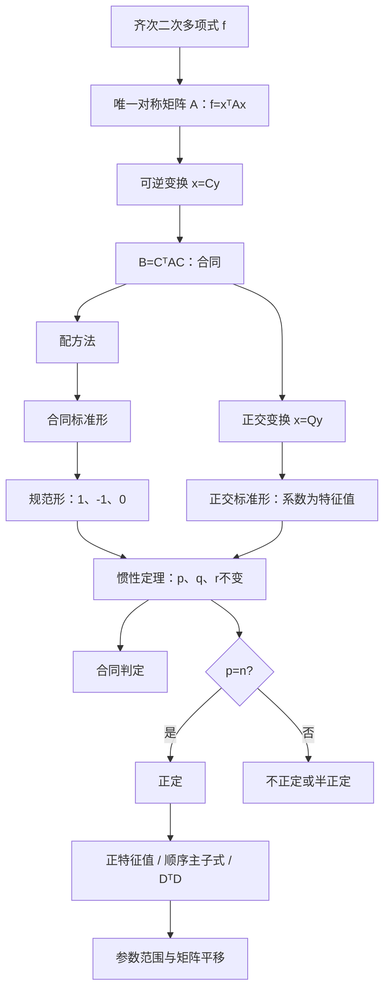

# 线代第6讲 二次型

源：`27张宇基础30讲线代.pdf`，印刷页 178-206 / PDF p184-p212。

整理方式：本讲29页已逐页OCR，并逐张阅读8张全页联系图和29张高清原页；结构图、定义定理、公式矩阵、12个正文例题及13道讲末练习均以原页复核结果为准。

## 本讲速览

- **总主线**：把齐次二次多项式写成$f=x^TAx$，再通过坐标变换把交叉项消掉；合同研究“换坐标后还是同一个二次型”，惯性指数负责分类，正定性负责判断$f$是否对任意非零向量恒正。
- **矩阵入口**：二次型只认唯一的实对称矩阵。平方项系数放主对角线，混合项$c x_ix_j$在$a_{ij},a_{ji}$处各放$c/2$；即使题目给的是非对称$B$，也要先取$(B+B^T)/2$。
- **两条化形路线**：只求标准形、规范形或惯性指数，优先配方法；题目明确要求正交变换、给定特征数据或需要保留长度角度时，用实对称矩阵的正交对角化。
- **分类核心**：任意可逆变换都不改变正、负惯性指数$p,q$及秩$r=p+q$。两个实对称矩阵合同，当且仅当$p,q$相同。
- **正定核心**：$A$正定等价于$p=n$、全部特征值正、全部顺序主子式正、$A$合同于$E$、存在可逆$D$使$A=D^TD$。具体数值矩阵通常优先用顺序主子式。
- **做题顺序**：先写对称矩阵并辨认题目要“合同信息”还是“相似/正交信息”，再选配方、特征值或顺序主子式；最后检查变换可逆、列序对应、参数边界是否严格。

## 教材路线

| 教材顺序 | 印刷页 / PDF页 | 本讲任务 |
|---|---|---|
| 基础知识结构 | 178 / p184 | 建立“矩阵表示 → 标准/规范形 → 惯性 → 正定”的主线 |
| 一、二次型的定义及其矩阵表达式 | 178-180 / p184-p186 | 掌握实二次型、唯一对称矩阵、混合项折半与二次型的秩 |
| 二、合同变换，二次型的合同标准形、规范形 | 180-184 / p186-p190 | 掌握可逆线性变换、合同、标准形、规范形、配方法与正交变换法 |
| 三、惯性定理 | 184-192 / p190-p198 | 掌握正负惯性指数、合同判据及例6.2-6.9的化形与综合题 |
| 四、正定二次型及其判别 | 192-197 / p198-p203 | 掌握定义、充要条件、必要条件、五种判法及例6.10-6.12 |
| 基础习题精练与答案 | 197-206 / p203-p212 | 用练习6.1-6.13反查规范形、合同、正定、正交化和特征值平移 |

## 前置知识与关联导航

- 行列式、顺序主子式与参数计算：[[19_线代第1讲_行列式|行列式]]。
- 逆矩阵、初等变换、秩与矩阵方程：[[20_线代第2讲_矩阵|矩阵]]。
- 内积、正交矩阵、Gram-Schmidt与坐标变换：[[21_线代第3讲_向量组|向量组]]。
- 齐次方程组只有零解的判定：[[22_线代第4讲_线性方程组|线性方程组]]。
- 实对称矩阵的谱与正交对角化：[[23_线代第5讲_特征值与特征向量#六、实对称矩阵的正交对角化|实对称矩阵]]。
- 下一单元进入概率论：[[25_概率第1讲_随机事件与概率|随机事件与概率]]。

> [!note] 统一记号
> 本讲默认变量、矩阵和变换均在实数域。$x=(x_1,\ldots,x_n)^T$，$E$为$n$阶单位矩阵；二次型的唯一对称矩阵记为$A=A^T$。$A\simeq B$表示合同，$A\sim B$表示相似；$p,q$分别表示正、负惯性指数，$r=r(A)=p+q$。

## 知识网络

## 知识点清单

## 一、二次型的定义及其矩阵表达式

### 1. 实二次型：每一项的总次数都为2

$n$个变量$x_1,\ldots,x_n$的实二次齐次多项式称为$n$元实二次型：

$$
f(x_1,\ldots,x_n)
=\sum_{i=1}^n a_{ii}x_i^2
+2\sum_{1\le i<j\le n}a_{ij}x_ix_j,
\qquad a_{ij}\in\mathbb R.
$$

完全展开式可写为

$$
f=\sum_{i=1}^n\sum_{j=1}^n a_{ij}x_ix_j,
\qquad a_{ij}=a_{ji}.
$$

这里研究的是**齐次**二次式：只有$x_i^2$和$x_ix_j$，没有一次项、常数项或三次项。

> [!tip] 看到什么想到它
> 题面出现“二次型”“齐次二次多项式”“$x^TAx$”，第一步都是建立唯一对称矩阵；后续化形、秩、惯性和正定都转到矩阵上处理。

### 2. 唯一对称矩阵与混合项折半

令

$$
x=\begin{pmatrix}x_1\\ \vdots\\x_n\end{pmatrix},
\qquad A=(a_{ij})_{n\times n},\qquad A^T=A,
$$

则

$$
f(x)=x^TAx.
$$

展开$x^TAx$时，$i\ne j$的两个位置共同贡献

$$
a_{ij}x_ix_j+a_{ji}x_jx_i=2a_{ij}x_ix_j.
$$

因此读矩阵的规则是：

- $x_i^2$的系数直接放$a_{ii}$；
- 混合项$c x_ix_j$的系数平分到两个对称位置：

$$
a_{ij}=a_{ji}=\frac c2.
$$

只要规定矩阵必须对称，二次型与矩阵$A$就一一对应。教材例6.1中

$$
f=2x_1^2+2x_2^2+2x_3^2-2x_1x_2-2x_2x_3+2x_1x_3
$$

对应

$$
A=\begin{pmatrix}
2&-1&1\\
-1&2&-1\\
1&-1&2
\end{pmatrix}.
$$

> [!warning] “能表示”不等于“就是二次型矩阵”
> 同一个$f$可由许多非对称矩阵写成$x^TBx$，但本讲所称“$f$的矩阵”必须是唯一的对称矩阵。把混合项全放在上三角或下三角，只是一个表示式，不是规范的二次型矩阵。

### 3. 非对称矩阵怎样还原为二次型矩阵

对任意实方阵$B$，$x^TBx$仍是一个标量二次型，因为

$$
x^TBx=(x^TBx)^T=x^TB^Tx.
$$

两式平均得

$$
x^TBx=x^T\frac{B+B^T}{2}x.
$$

故它的唯一对称矩阵是

$$
A=\frac{B+B^T}{2}.
$$

这正是练习6.8的核心：题给的非对称$B$不是$f$的二次型矩阵，但其对称部分才是。

> [!tip] 看到什么想到它
> 题目直接给$x^TBx$且$B\ne B^T$，不要说“它不是二次型”；应答“它是二次型，但$B$不是该二次型的矩阵”，再取$(B+B^T)/2$。

### 4. 二次型的秩

二次型$f=x^TAx$的秩定义为其对称矩阵的秩：

$$
r(f)=r(A).
$$

后面化成标准形后，秩也等于非零平方项的个数。秩是可逆线性变换下的不变量，因此参数题常用“题设秩 = 矩阵秩”直接求参数。

## 二、合同变换，二次型的合同标准形、规范形

### 1. 线性变换与可逆条件

把旧变量$x$写成新变量$y$的线性组合：

$$
x=Cy,
\qquad
C=(c_{ij})_{n\times n}.
$$

若

$$
|C|\ne0,
$$

则称$x=Cy$为可逆线性变换。可逆性保证新旧变量之间一一对应，既不丢维数，也不会把某个非零方向压成零。

代入二次型：

$$
f=x^TAx=(Cy)^TA(Cy)=y^T(C^TAC)y.
$$

所以新二次型矩阵为

$$
B=C^TAC.
$$

> [!warning] 方向必须统一
> 若写$x=Cy$，新矩阵就是$C^TAC$；若先定义$y=Cx$，则应先改写$x=C^{-1}y$。不能一边写$y=Cx$，一边直接套$C^TAC$。

### 2. 矩阵合同的定义、几何意义与性质

若存在可逆矩阵$C$使

$$
B=C^TAC,
$$

则称$A$与$B$合同，记作$A\simeq B$；对应的两个二次型称为合同二次型。

直观上，$A$和$B$描述的是同一个二次型在两套坐标中的形态：一般可逆变换可以拉伸、剪切、扭斜图形，但不会改变其基本类型；正交变换只旋转或反射坐标轴，长度与夹角保持不变。

合同具有：

1. **反身性**：$A\simeq A$。
2. **对称性**：$A\simeq B\Rightarrow B\simeq A$。
3. **传递性**：$A\simeq B, B\simeq D\Rightarrow A\simeq D$。

合同还保持：

$$
r(A)=r(B),
$$

并保持对称性；若$A=A^T$，则$(C^TAC)^T=C^TAC$。

合同一定是矩阵等价，但一般不一定相似；“合同”和“相似”关注的对象不同：

$$
\text{合同： }C^TAC,
\qquad
\text{相似： }P^{-1}AP.
$$

当$C=Q$是正交矩阵时，$Q^T=Q^{-1}$，故$Q^TAQ$既是合同变换，也是相似变换。

> [!tip] 看到什么想到它
> 题目问二次型是否同类、正负平方项个数是否相同，想到合同；题目问特征值、迹、行列式是否保持，想到相似。只有正交变换时两条线合并。

### 3. 标准形与规范形

没有交叉项的二次型

$$
f=d_1y_1^2+d_2y_2^2+\cdots+d_ny_n^2
$$

称为标准形，其中$d_i$允许为零。

若把每个非零系数再缩放为$1$或$-1$，得到

$$
f=z_1^2+\cdots+z_p^2
-z_{p+1}^2-\cdots-z_{p+q}^2
+0z_{p+q+1}^2+\cdots+0z_n^2,
$$

则称为规范形。这里

$$
r=p+q.
$$

标准形的系数可为任意实数；规范形只保留符号与零，因而最适合做合同分类。

### 4. 定理1：配方法可化合同标准形与规范形

任意实二次型都能通过可逆线性变换$x=Cy$化为标准形，并继续缩放为规范形。矩阵语言为：对任意实对称矩阵$A$，存在可逆$C$使

$$
C^TAC=\Lambda,
$$

其中$\Lambda$为对角矩阵，进一步可取其对角元属于$\{1,-1,0\}$。

但一般配方法中：

- $C$的列向量不一定是$A$的特征向量；
- 标准形系数$d_i$一般不等于$A$的特征值；
- 配方次序不同，$C$和$d_i$都可能不同。

配方法的实用算法：

1. **有平方项**：选一个$x_i^2$，把所有含$x_i$的混合项一次配成完全平方，再处理剩余变量。
2. **没有平方项但有混合项**：先令$x_1=y_1+y_2, x_2=y_1-y_2$等可逆替换，利用$x_1x_2=y_1^2-y_2^2$造出平方项。
3. **平方项少于变量数**：必须补上$0y_k^2$，并给未出现变量安排独立新变量，保证变换矩阵仍为$n$阶可逆矩阵。
4. **要规范形**：对$d_i>0$令$z_i=\sqrt{d_i},y_i$；对$d_i<0$令$z_i=\sqrt{-d_i},y_i$。

> [!warning] 配成平方和不自动等于合法变换
> 必须能写出$n$个彼此独立的新变量。若只写出两个平方却把三元变量压成两个新变量，变换不可逆，所得“标准形”和秩都不可信。

### 5. 例6.2：有平方项时一次配完相关混合项

教材例6.2：

$$
f=x_1^2+2x_1x_2+2x_1x_3-x_2^2-2x_2x_3-x_3^2.
$$

先围绕$x_1^2$配方，再围绕$x_2$配方：

$$
f=(x_1+x_2+x_3)^2-2(x_2+x_3)^2+0x_3^2.
$$

取

$$
y_1=x_1+x_2+x_3,\qquad y_2=x_2+x_3,\qquad y_3=x_3,
$$

则标准形为

$$
f=y_1^2-2y_2^2+0y_3^2.
$$

独有迁移：必须补$0y_3^2$，否则会误以为这是二元变换；写变换时还要把$y$反解成$x=Cy$，检验$|C|\ne0$。

### 6. 例6.3：没有平方项时先造平方项

对

$$
f=x_1x_2+x_1x_3-x_2x_3,
$$

先令

$$
x_1=y_1+y_2,\qquad x_2=y_1-y_2,\qquad x_3=y_3,
$$

得到含$y_1^2-y_2^2$的式子，再继续配方并作可逆替换，可化为规范形

$$
f=z_1^2-z_2^2+z_3^2.
$$

因此$p=2,q=1,r=3$。这个例子要记的是“无平方项先造平方项”，而不是死背某一组变换矩阵。

### 7. 定理2：正交变换化标准形

对任意实对称矩阵$A$，存在正交矩阵$Q$使

$$
Q^TAQ=Q^{-1}AQ
=\operatorname{diag}(\lambda_1,\ldots,\lambda_n),
$$

其中$\lambda_i$是$A$的全部特征值。作$x=Qy$，则

$$
f=x^TAx
=\lambda_1y_1^2+\cdots+\lambda_ny_n^2.
$$

标准步骤：

1. 写唯一对称矩阵$A$。
2. 求全部特征值及重数。
3. 求各特征空间；重特征值内部先正交化。
4. 把全部特征向量单位化。
5. 按目标对角元顺序作列，组成$Q$。
6. 写$x=Qy$并验$Q^TQ=E$、$Q^TAQ=\Lambda$。

正交法的边界：

- $Q$通常不唯一：特征向量可变号，同一重特征空间可换另一组标准正交基，列还可与特征值同步换序。
- 但所得标准形系数就是特征值，除顺序外唯一。
- 正交变换一般只能化为标准形；除非特征值本身都属于$\{1,-1,0\}$，否则不能直接得到规范形。

### 8. 例6.4：重特征值内部要正交化

教材例6.4的矩阵为

$$
A=\begin{pmatrix}
2&2&-2\\
2&5&-4\\
-2&-4&5
\end{pmatrix},
$$

特征值为$1,1,10$。二重特征值$1$的基础解未必正交，必须在该二维特征空间内做Gram-Schmidt，再与$\lambda=10$的特征向量一起单位化。最终可得

$$
Q^TAQ=\operatorname{diag}(1,1,10),
$$

故标准形为

$$
f=y_1^2+y_2^2+10y_3^2.
$$

> [!tip] 看到什么想到它
> “用正交变换”“求正交矩阵”“给出$Q$的一列”都直接接到实对称谱定理；重复特征值出现时，只在它自己的特征空间内部正交化。

## 三、惯性定理

### 1. 正、负惯性指数与不变量

无论选哪一种可逆线性变换把二次型化为标准形或规范形，其中正系数个数$p$、负系数个数$q$都不变：

$$
p=\text{正惯性指数},
\qquad q=\text{负惯性指数}.
$$

若二次型秩为$r$，则

$$
r=p+q,
\qquad n-r=\text{零系数个数}.
$$

因此不同配方次序虽可给出不同$d_i$，但不能改变正、负、零项的数量。

对实对称矩阵：

$$
p=\text{正特征值个数},
\qquad q=\text{负特征值个数},
$$

均按重数计算。

### 2. 实对称矩阵的合同判据

两个实二次型（或实对称矩阵）合同，当且仅当它们有相同的正、负惯性指数：

$$
A\simeq B
\Longleftrightarrow
p_A=p_B, q_A=q_B.
$$

等价地，可比较：

- $p,q$；
- $r$与$p$；
- $r$与$q$；
- 正、负、零特征值个数。

合同不要求特征值数值相同，只要求符号个数相同；相似则要求完整特征值多重集相同。

> [!tip] 看到什么想到它
> 选择题问“哪个矩阵与$A$合同”，最快先数$p,q$；不必求具体$C$。只有题目要求变换矩阵时，才继续构造。

### 3. 配方法与正交法的选法比较

| 目标 | 配方法 | 正交变换法 |
|---|---|---|
| 变换要求 | $C$只需可逆 | $Q^TQ=E$ |
| 得到标准形 | 可以，系数一般不是特征值 | 可以，系数就是特征值 |
| 得到规范形 | 可以继续缩放为$\pm1,0$ | 一般不能直接得到 |
| 求惯性指数 | 常最快 | 可数特征值符号 |
| 求具体正交矩阵 | 不适用 | 必须使用 |
| 结果唯一性 | 变换和标准系数都不唯一 | $Q$不唯一，特征值多重集唯一 |

### 4. 例6.5：正交矩阵换列、变号时同步改标准形

若$P=[e_1,e_2,e_3]$使标准形为

$$
2y_1^2+y_2^2-y_3^2,
$$

则$e_1,e_2,e_3$分别对应特征值$2,1,-1$。换成

$$
Q=[e_1,-e_3,e_2]
$$

时，变号不改变对应特征值，但列序发生$2,-1,1$的重排，所以新标准形为

$$
2y_1^2-y_2^2+y_3^2.
$$

核心规则：$Q$第$i$列对应哪个特征值，$\Lambda_{ii}$就放哪个值。

### 5. 例6.6：两个实对称矩阵间的正交变换

题目给正交变换把$A$化为$B$时，

$$
B=Q^TAQ=Q^{-1}AQ,
$$

所以$A,B$不只合同，还相似。可先用相似不变量求参数：

$$
\operatorname{tr}(A)=\operatorname{tr}(B),
\qquad |A|=|B|.
$$

教材例6.6由此求得$a=4,b=1$。若还要求$Q$，分别取$A,B$对应于同一排列特征值的标准正交特征向量矩阵$Q_1,Q_2$：

$$
Q_1^TAQ_1=Q_2^TBQ_2=\Lambda,
$$

则

$$
Q=Q_1Q_2^T,
\qquad Q^TAQ=B.
$$

本例可取

$$
Q=\frac15\begin{pmatrix}4&-3\\-3&-4\end{pmatrix}.
$$

### 6. 例6.7：含参数惯性指数用配方读符号

$$
f=x_1^2-x_2^2+2ax_1x_3+4x_2x_3
$$

配方为

$$
f=(x_1+ax_3)^2-(x_2-2x_3)^2+(4-a^2)x_3^2.
$$

已有一个负平方项。要让负惯性指数恰为$1$，第三项不能再为负：

$$
4-a^2\ge0
\Longleftrightarrow
-2\le a\le2.
$$

端点使第三系数为零，负项仍只有一个，所以端点应保留。

> [!warning] 惯性指数与正定的边界符号不同
> “不新增负项”允许系数等于零，用$\ge0$；“正定”要求所有方向严格为正，必须用$>0$。

### 7. 例6.8：合同选择题只比符号个数

教材例6.8的$A$可配成两个正平方项与一个负平方项，因此$p=2,q=1$。在对角候选中直接选择同样有两个$1$、一个$-1$者，无需构造$C$，也无需让特征值数值与$A$相同。

### 8. 例6.9：同时交换同号行列

交换$A$的第1、2行，相当于左乘置换矩阵$P$；再交换第1、2列，相当于右乘$P$。该置换矩阵满足

$$
P^T=P^{-1}=P,
$$

故新矩阵

$$
C=P^TAP=P^{-1}AP.
$$

所以本例中$A,C$既合同又相似。一般“对称地做同一种行、列初等变换”产生合同；只有变换矩阵同时满足相似形式时，才能再断言相似。

## 四、正定二次型及其判别

### 1. 定义与几何直观

若对任意非零$x\in\mathbb R^n$都有

$$
x^TAx>0,
$$

则称$f=x^TAx$为正定二次型，称实对称矩阵$A$为正定矩阵。

量词必须完整：

$$
\forall x\ne0,\quad x^TAx>0.
$$

几何上，正定意味着$f=c\ (c>0)$对应封闭的椭圆类曲面；若存在非零方向使$f=0$或$f<0$，就失去正定性。

### 2. 正定的五组充要条件

对$n$阶实对称矩阵$A$，以下命题等价：

1. 定义：$x\ne0\Rightarrow x^TAx>0$。
2. 正惯性指数$p=n$。
3. 存在$n$阶**可逆**矩阵$D$，使

$$
A=D^TD.
$$

4. $A$合同于单位矩阵：

$$
A\simeq E.
$$

5. $A$的全部特征值都大于零。
6. $A$的全部顺序主子式都大于零：

$$
\Delta_1>0,\ \Delta_2>0,\ \ldots,\ \Delta_n>0.
$$

这里教材把定义之外的判据归纳为四类，复习时可把“定义 + 五个等价入口”一起记。

$k$阶顺序（左上角）主子式为

$$
\Delta_k=
\begin{vmatrix}
a_{11}&\cdots&a_{1k}\\
\vdots&\ddots&\vdots\\
a_{k1}&\cdots&a_{kk}
\end{vmatrix}.
$$

> [!tip] 看到什么想到它
> 具体二、三阶数值矩阵优先顺序主子式；题面给特征值、正交标准形或$aE+A$时优先特征值；题面本身是若干平方和时优先用定义或$D^TD$。

### 3. 必要条件不能单独反推

若$A$正定，则必有

$$
a_{ii}>0\quad(i=1,\ldots,n),
\qquad |A|>0.
$$

原因：取$x=e_i$得$a_{ii}=e_i^TAe_i>0$；全部特征值正，其积$|A|>0$。

但这些只是必要条件：对角元全正、行列式正，单独都不足以推出正定；必须使用完整充要条件。

负定可作为对称结论理解：

$$
A\text{负定}\Longleftrightarrow -A\text{正定}
\Longleftrightarrow \lambda_i(A)<0.
$$

顺序主子式表现为

$$
(-1)^k\Delta_k>0\quad(k=1,\ldots,n).
$$

### 4. 例6.10：同一个正定结论的五种证明路线

对

$$
f=2x_1^2+2x_2^2+2x_3^2+2x_1x_2+2x_1x_3+2x_2x_3,
$$

其矩阵为

$$
A=\begin{pmatrix}2&1&1\\1&2&1\\1&1&2\end{pmatrix}.
$$

教材用五条路线说明同一结论：

1. **顺序主子式**：$\Delta_1=2,\Delta_2=3,\Delta_3=4$均正。
2. **特征值**：$4,1,1$均正。
3. **配方法**：标准形中三个系数均正，即$p=3$。
4. **定义**：

$$
f=(x_1+x_2)^2+(x_2+x_3)^2+(x_3+x_1)^2\ge0,
$$

且$f=0$对应的齐次方程组只有零解，所以$x\ne0$时$f>0$。
5. **分解**：写成$x^TD^TDx$，且$D$可逆。

做具体数值题时，顺序主子式通常最短；若题式天然是平方和，定义法可能更直接。

### 5. 平方和判正定：还要检查“同时为零”是否只有零解

若

$$
f=(\ell_1(x))^2+\cdots+(\ell_n(x))^2=\|Dx\|^2,
$$

则$f\ge0$自动成立，但正定还要求

$$
Dx=0\Longrightarrow x=0,
$$

即

$$
|D|\ne0.
$$

教材例6.11中

$$
f=(x_1+x_2)^2+(x_2+x_3)^2+(ax_3+x_1)^2,
$$

对应线性形式系数矩阵行列式为$a+1$，故

$$
f\text{正定}\Longleftrightarrow a\ne-1.
$$

当$a=-1$时，仍有$f\ge0$，但存在非零$x$令三个平方同时为零，所以只是半正定而非正定。

### 6. 例6.12：正定等价命题中的条件陷阱

教材例6.12的正确充要条件是

$$
A\text{正定}\Longleftrightarrow A^{-1}\text{正定}.
$$

因为$A$正定时特征值$\lambda_i>0$，$A^{-1}$的特征值$1/\lambda_i>0$；反向同理，且双方自动实对称。

其余常见陷阱：

- $A^\ast$正定通常只是$A$正定的必要结果，反向不充分；三阶时$A=-E$给出$A^\ast=E$。
- 负惯性指数$q=0$只能说明没有负项，还可能有零项，即可能半正定；正定还要$p=n$。
- 写$A=C^TC$时，若不要求$C$可逆，只能推出半正定；正定必须补$|C|\ne0$。

### 7. 特征值平移：$aE+A$与$E+\varepsilon A$

若实对称$A$的特征值满足

$$
\lambda_1<\lambda_2<\cdots<\lambda_n,
$$

则$aE+A$的特征值为$a+\lambda_i$，所以

$$
aE+A\text{正定}
\Longleftrightarrow a+\lambda_1>0
\Longleftrightarrow a>-\lambda_1.
$$

对$\varepsilon>0$，$E+\varepsilon A$的特征值为$1+\varepsilon\lambda_i$：

$$
\lambda_1\ge0
\Rightarrow
\forall\varepsilon>0, E+\varepsilon A\text{正定};
$$

$$
\lambda_1<0
\Rightarrow
0<\varepsilon<-\frac1{\lambda_1}.
$$

> [!tip] 看到什么想到它
> 出现$A+cE$、$E+\varepsilon A$，不要重新展开顺序主子式；单位矩阵只让所有特征值整体平移，正定只看平移后的最小特征值是否严格大于零。

## 公式与二级结论索引

| 结论 | 完整条件与公式 | 详解 |
|---|---|---|
| 二次型矩阵 | $f=x^TAx$，$A=A^T$；$cx_ix_j\Rightarrow a_{ij}=a_{ji}=c/2$ | [[#2. 唯一对称矩阵与混合项折半\|矩阵表示]] |
| 非对称表示对称化 | 任意实方阵$B$：$x^TBx=x^T\frac{B+B^T}{2}x$ | [[#3. 非对称矩阵怎样还原为二次型矩阵\|对称化]] |
| 二次型的秩 | $r(f)=r(A)$，也等于标准形非零平方项个数 | [[#4. 二次型的秩\|秩]] |
| 可逆线性变换 | $x=Cy,\ \det(C)\ne0$ | [[#1. 线性变换与可逆条件\|线性变换]] |
| 合同变换 | $B=C^TAC$，$C$可逆；保持秩、对称性和惯性 | [[#2. 矩阵合同的定义、几何意义与性质\|合同]] |
| 标准形 | $d_1y_1^2+\cdots+d_ny_n^2$，允许$d_i=0$ | [[#3. 标准形与规范形\|标准形]] |
| 规范形 | $p$个$1$、$q$个$-1$、$n-p-q$个$0$ | [[#3. 标准形与规范形\|规范形]] |
| 配方法定理 | 任意实对称$A$存在可逆$C$使$C^TAC$对角；系数一般非特征值 | [[#4. 定理1：配方法可化合同标准形与规范形\|配方法]] |
| 正交标准形 | $A=A^T\Rightarrow\exists Q$正交，$Q^TAQ=\operatorname{diag}(\lambda_i)$ | [[#7. 定理2：正交变换化标准形\|正交法]] |
| 惯性定理 | 任意可逆变换下$p,q$不变，$r=p+q$ | [[#1. 正、负惯性指数与不变量\|惯性]] |
| 合同判据 | 实对称$A,B$：$A\simeq B\Longleftrightarrow p_A=p_B,q_A=q_B$ | [[#2. 实对称矩阵的合同判据\|合同判据]] |
| 正定定义 | $A=A^T$且$\forall x\ne0, x^TAx>0$ | [[#1. 定义与几何直观\|正定定义]] |
| 正定判据 | $p=n\Longleftrightarrow\lambda_i>0\Longleftrightarrow\Delta_k>0\Longleftrightarrow A\simeq E\Longleftrightarrow A=D^TD$且$D$可逆 | [[#2. 正定的五组充要条件\|充要条件]] |
| 正定必要条件 | $A$正定$\Rightarrow a_{ii}>0,\ \det(A)>0$；反向一般不成立 | [[#3. 必要条件不能单独反推\|必要条件]] |
| 平方和判定 | $f=\|Dx\|^2$正定$\Longleftrightarrow D$可逆 | [[#5. 平方和判正定：还要检查“同时为零”是否只有零解\|平方和]] |
| 逆矩阵正定 | 实对称$A$：$A$正定$\Longleftrightarrow A^{-1}$正定 | [[#6. 例6.12：正定等价命题中的条件陷阱\|逆矩阵]] |
| 特征值平移 | $aE+A$正定$\Longleftrightarrow a>-\lambda_{\min}(A)$ | [[#7. 特征值平移：$aE+A$与$E+\varepsilon A$\|平移]] |
| 负定判据 | $A$负定$\Longleftrightarrow -A$正定；$(-1)^k\Delta_k>0$ | [[#3. 必要条件不能单独反推\|负定]] |

## 题型—方法决策表

| 题面信号 | 首选知识点 | 起手式 | 备选路线 | 检查点 |
|---|---|---|---|---|
| 给二次式，求矩阵 | 唯一对称表示 | 平方项上对角，混合项折半 | 展开$x^TAx$验算 | 矩阵必须对称 |
| 给$x^TBx$且$B$非对称 | 对称化 | $A=(B+B^T)/2$ | 先展开再按系数写$A$ | 不能把$B$直接称为二次型矩阵 |
| 只求标准形/规范形 | 配方法 | 有平方项先一次配完相关混合项 | 无平方项先造平方项 | 变换必须可逆，零平方项不能漏 |
| 明确要求正交变换 | 实对称谱定理 | 求特征值与标准正交特征向量 | 已知部分$Q$列时先反推特征空间 | $Q$列序与$\Lambda$同步 |
| 求正交矩阵$Q$ | 重根内正交化 | 解特征空间，正交化、单位化、按列组$Q$ | 利用实对称异值向量天然正交 | 验$Q^TQ=E$ |
| 判断两个矩阵合同 | 惯性定理 | 分别求$p,q$ | 配方或数特征值符号 | 不要求特征值数值相同 |
| 求含参数惯性指数 | 配方读符号 | 化标准形后对剩余系数分类 | 求特征值符号 | 零系数不计入$p,q$ |
| 正交变换把$A$化为$B$ | 正交合同=相似 | 先用迹、行列式、特征值求参数 | 分别正交化到同一$\Lambda$ | 中间$\Lambda$列序必须一致 |
| 同时交换同行同列 | 合同变换 | 写$P^TAP$ | 若$P^{-1}=P^T$再判相似 | 只换行或只换列不构成合同 |
| 具体矩阵判正定 | Sylvester判据 | 算全部顺序主子式 | 特征值或配方 | 必须全部严格$>0$ |
| 含参数矩阵判正定 | 顺序主子式不等式组 | $\Delta_1>0,\ldots,\Delta_n>0$联立 | 小矩阵可直接求最小特征值 | 边界点通常不取 |
| 已写成平方和 | 定义/$D^TD$ | 检查平方同时为零是否只得$x=0$ | 计算线性形式系数矩阵行列式 | $f\ge0$不等于$f>0$ |
| 判断正定等价命题 | 条件完整性 | 先确认实对称、可逆等前提 | 用特征值逐项检验 | $q=0$、$A^*>0$、$C^TC$都可能只给必要结论 |
| 给$aE+A$或$E+\varepsilon A$ | 特征值平移 | 只看最小特征值 | 顺序主子式 | 不等式严格，注意$\varepsilon>0$ |
| 给秩反求参数 | $r(f)=r(A)$ | 用行列式为零锁定候选，再验秩 | 同时行列初等变换 | 只证$\det(A)=0$还没证恰为指定秩 |
| 给标准形和$Q$一列反求$A$ | $A=Q\Lambda Q^T$ | 已知列对应已知特征值，补标准正交基 | 用不同特征空间正交性 | 重特征空间内基不唯一 |

## 教材例题覆盖表

| 例题 | 题面信号 | 方法入口 | 独有结论或迁移 |
|---|---|---|---|
| 例6.1 | 由三元二次式写矩阵 | 平方项直放、混合项折半 | 二次型矩阵必须是唯一对称矩阵；$r(f)=r(A)$ |
| 例6.2 | 有平方项，要求标准形与可逆变换 | 围绕一个变量一次配完相关混合项 | 平方项不足变量数时补$0y_i^2$，否则变换可能降维 |
| 例6.3 | 只有混合项，要求规范形 | 先用和差替换造平方项，再配方与缩放 | 无平方项也能用可逆变换化形；最终$p=2,q=1$ |
| 例6.4 | 实对称矩阵正交化，含重特征值 | 重特征空间内正交化、全体单位化 | 得$\operatorname{diag}(1,1,10)$；正交标准系数是特征值 |
| 例6.5 | 改变正交矩阵列序与符号 | 追踪每列对应的特征值 | 变号不改特征值，换列必须同步换对角元 |
| 例6.6 | 正交变换把含参数$A$化为$B$ | 先用迹、行列式求$a=4,b=1$，再拼两组特征基 | 若$Q_1^TAQ_1=Q_2^TBQ_2$，则$Q=Q_1Q_2^T$ |
| 例6.7 | 负惯性指数恰为1，求参数 | 配方后控制剩余系数不为负 | $4-a^2\ge0$，端点对应零项仍保留，故$a\in[-2,2]$ |
| 例6.8 | 从对角矩阵中选与$A$合同者 | 求$p=2,q=1$ | 合同只看惯性，不看特征值大小 |
| 例6.9 | 先交换两行，再交换同号两列 | 写置换矩阵$P$ | 此处$P^T=P^{-1}=P$，故既合同又相似 |
| 例6.10 | 判具体二次型正定 | 顺序主子式、特征值、配方、定义、$D^TD$五法 | 平方和还要证明公共零点只有$x=0$ |
| 例6.11 | 三个线性式平方和含参数 | 检查线性形式系数矩阵是否可逆 | 行列式$a+1\ne0$，故$a\ne-1$；等号点仅半正定 |
| 例6.12 | 选择正定的充要条件 | 用特征值和前提逐项验 | $A\leftrightarrow A^{-1}$正定；伴随、$q=0$、非可逆$C$均有陷阱 |

## 讲末练习反查

下面不复刻题干，只保留每题“识别信号 → 起手方法 → 关键结果”，确保复习笔记能反向支撑做题。

| 练习 | 识别与首步 | 关键链路 | 结果 |
|---|---|---|---|
| 6.1 | 求给定二次型规范形 | 配方或求特征值$6,2,-4$ | $p=2,q=1$，选B：$y_1^2+y_2^2-y_3^2$ |
| 6.2 | 选与二次型矩阵不合同者 | 原式$(x_1+2x_2)^2-x_2^2$，先定$p=q=1$ | 只有D为正定，惯性不同，选D |
| 6.3 | 四个矩阵中选正定 | 先用$a_{ii}>0$、低阶顺序主子式排除，再验剩余 | 选D；其$\Delta_1=3,\Delta_2=6,\Delta_3=7$ |
| 6.4 | 已知二次型秩为2，反求$a$ | 对对称矩阵同时行列消元 | 化到$\operatorname{diag}(2,2,a-2)$，故$a=2$ |
| 6.5 | 三个平方和求秩 | 写矩阵或检查线性形式相关性 | 秩为2；表面三个平方对应的变换矩阵不可逆，不能判秩为3 |
| 6.6 | 求正惯性指数 | 求谱$0,1,4$或配成$(x_1+x_2+x_3)^2+2x_2^2$ | $p=2$ |
| 6.7 | 含参数$t$正定 | 联立全部顺序主子式$>0$ | $-\frac45<t<0$ |
| 6.8 | $B$非对称，问$x^TBx$与其矩阵 | 取$A=(B+B^T)/2$ | $x^TBx$是二次型，但$B$不是其矩阵；$A=\begin{pmatrix}1&0&3/2\\0&0&5/2\\3/2&5/2&5\end{pmatrix}$ |
| 6.9 | 已知特征值和、积，求参数并正交化 | 用迹与行列式得$k=1,m=2$，再求谱 | 特征值$2,2,-3$；标准形$2y_1^2+2y_2^2-3y_3^2$ |
| 6.10 | 已知秩为2并问曲面 | $\det(A)=0$求$c$，再求特征值 | $c=3$，谱$0,4,9$；$f=1$为椭圆柱面 |
| 6.11 | 已知正交标准形系数$1,2,5$，反求$a>0$ | 对矩阵的$2\times2$块求谱或用行列式 | $a=2$；按$1,2,5$求单位特征向量组成$Q$ |
| 6.12 | 已知标准形$y_1^2+y_2^2$和$Q$第三列 | 第三列是$\lambda=0$特征向量；补其正交补空间 | $A=\frac12\begin{pmatrix}1&0&-1\\0&2&0\\-1&0&1\end{pmatrix}$；$A+E$谱为$2,2,1$，故正定 |
| 6.13 | $aE+A$、$E+\varepsilon A$正定范围 | 对全部特征值做平移，只看最小值 | $a>-\lambda_1$；若$\lambda_1\ge0$则任意$\varepsilon>0$，若$\lambda_1<0$则$0<\varepsilon<-1/\lambda_1$ |

练习6.9可取正交矩阵

$$
Q=\begin{pmatrix}
0&\frac{2}{\sqrt5}&\frac1{\sqrt5}\\
1&0&0\\
0&\frac1{\sqrt5}&-\frac2{\sqrt5}
\end{pmatrix},
$$

对应$Q^TAQ=\operatorname{diag}(2,2,-3)$。重特征值$2$的二维特征空间中标准正交基不唯一，因此$Q$不唯一。

练习6.11在$a=2$时可取

$$
Q=\begin{pmatrix}
0&1&0\\
\frac1{\sqrt2}&0&\frac1{\sqrt2}\\
-\frac1{\sqrt2}&0&\frac1{\sqrt2}
\end{pmatrix},
$$

使$Q^TAQ=\operatorname{diag}(1,2,5)$。列顺序改变时，标准形系数也要同步改变。

## 易错点/易混点

1. **混合项不折半**：$cx_ix_j$对应$a_{ij}=a_{ji}=c/2$，不是$c$。
2. **把非对称$B$直接叫二次型矩阵**：$x^TBx$的矩阵应为$(B+B^T)/2$。
3. **把合同写成相似**：一般是$C^TAC$，不是$C^{-1}AC$；只有$C$正交时二者相同。
4. **变换方向混乱**：先固定$x=Cy$还是$y=Cx$，再代入，不能机械套式。
5. **配方法只写平方不验可逆**：新变量必须有$n$个且线性无关。
6. **漏写零平方项**：三元二次型化成两个非零平方时，仍应写$+0y_3^2$并补第三个变量。
7. **以为配方系数就是特征值**：一般可逆合同只保惯性；只有正交变换的标准系数才是特征值。
8. **以为标准形唯一**：配方法所得系数不唯一；规范形的$p,q$唯一，正交标准形的特征值多重集唯一。
9. **以为正交变换总能到规范形**：它一般只能到以特征值为系数的标准形。
10. **重特征值处忘记正交化**：基础解系可能不正交，必须在同一特征空间内正交化并单位化。
11. **$Q$换列但$\Lambda$不换序**：列和对角元必须一一对应；特征向量变号则特征值不变。
12. **合同要求特征值完全相同**：错误；合同只要求$p,q$相同。
13. **只比较秩就判合同**：秩相同仍可能正负惯性不同，还要比较$p$或$q$。
14. **含参数惯性题误删端点**：若系数允许变为零且不增加指定符号项，端点可以保留。
15. **同时换行列就必相似**：一般只保证合同；本讲例6.9因置换矩阵正交才同时相似。
16. **正定只验$|A|>0$或$a_{ii}>0$**：它们只是必要条件。
17. **顺序主子式与任意主子式混淆**：Sylvester正定判据只需左上角$\Delta_1,\ldots,\Delta_n$全正。
18. **把$\ge0$当正定**：$f\ge0$只是半正定候选；还要证明$f=0$只有零向量。
19. **平方和必正定**：平方和只自动半正定；线性形式系数矩阵必须满秩。
20. **$A=C^TC$就正定**：若$C$奇异，只能半正定；必须要求$C$可逆。
21. **$q=0$就正定**：还可能有零特征值；必须$p=n$。
22. **$A^\ast$正定就推出$A$正定**：一般不成立，例如三阶$A=-E$。
23. **参数正定不等式写成非严格**：正定要求每个顺序主子式或最小特征值严格大于零。
24. **只由$|A|=0$断言指定秩**：行列式为零只说明秩小于$n$，还要验证未降得更多。

## 注解

### 1. 为什么二次型矩阵必须对称

$x_ix_j=x_jx_i$，所以矩阵的反对称部分不会贡献任何二次型值。把$B$分解为

$$
B=\frac{B+B^T}{2}+\frac{B-B^T}{2},
$$

第二项是反对称矩阵，对任意$x$都有$x^T(B-B^T)x=0$。只保留对称部分，才让“一个二次型对应一个矩阵”。

### 2. 为什么合同而不是相似描述二次型换元

二次型同时含一个左侧$x^T$和一个右侧$x$。替换$x=Cy$后，左侧自然变成$y^TC^T$，右侧变成$Cy$，于是矩阵被两边夹成$C^TAC$。相似$P^{-1}AP$则来自线性变换在不同基下的表示，来源不同。

### 3. 为什么配方法必须保留变量个数

合法换坐标必须一一对应。若把三个旧变量只压成两个新变量，会丢失一个方向；沿这个方向的二次型信息、秩和零空间都会被误判。补$0y_i^2$不是形式主义，而是在显式记录这个零方向。

### 4. 为什么惯性比标准系数更稳定

一般可逆变换会拉伸坐标，所以$d_i$的大小可以改变；但连续可逆地拉伸、剪切不能把一个严格正方向变成严格负方向，也不能凭空增加秩。因此真正属于合同类别的是正、负、零方向的数量。

### 5. 为什么正交法的系数就是特征值

正交矩阵满足$Q^T=Q^{-1}$，所以$Q^TAQ$同时是合同和相似。相似保持特征值，而实对称谱定理又保证它能被化成对角矩阵，故对角元只能是$A$的特征值。

### 6. 为什么平方和还要查公共零点

$f=\|Dx\|^2$始终非负。若$D$奇异，就存在$x\ne0$落在$\ker D$中，使$f=0$；只有$D$可逆时，非零$x$才必给出非零$Dx$，从而$f>0$。

### 7. 二次型如何收束整本线代

- 写矩阵用到[[20_线代第2讲_矩阵|矩阵运算与秩]]。
- 配方法后的可逆性回到[[22_线代第4讲_线性方程组|齐次方程只有零解]]。
- 正交化使用[[21_线代第3讲_向量组|内积与Gram-Schmidt]]。
- 正交标准形直接使用[[23_线代第5讲_特征值与特征向量#六、实对称矩阵的正交对角化|实对称谱定理]]。
- 正定判据把行列式、特征值、秩、合同和方程组判定汇到同一个结论上。

## 速背检查

1. **什么是实二次型？** 每一项总次数均为2的实齐次多项式。
2. **混合项$6x_1x_2$怎样进矩阵？** $a_{12}=a_{21}=3$。
3. **给非对称$B$时二次型矩阵是什么？** $(B+B^T)/2$。
4. **二次型的秩？** 唯一对称矩阵$A$的秩，也等于标准形非零平方项个数。
5. **$x=Cy$后新矩阵？** $C^TAC$，前提$|C|\ne0$。
6. **合同与相似的标准形式？** $C^TAC$与$P^{-1}AP$。
7. **何时正交合同同时是相似？** $C=Q$且$Q^T=Q^{-1}$。
8. **标准形与规范形区别？** 标准形只无混合项；规范形系数只取$1,-1,0$。
9. **无平方项怎样启动配方？** 用和差可逆替换把混合项变成平方差。
10. **为什么要补$0y_i^2$？** 保留变量维数并显式记录零方向，保证变换可逆。
11. **配方法系数是否为特征值？** 一般不是；正交变换系数才是。
12. **正交法的完整步骤？** 求谱、求特征空间、重根内正交化、全体单位化、按列组$Q$。
13. **正交变换能否总得规范形？** 不能，一般只得以特征值为系数的标准形。
14. **惯性定理说什么？** 任意可逆变换下正、负惯性指数$p,q$不变，且$r=p+q$。
15. **两个实对称矩阵何时合同？** $p,q$分别相同。
16. **正定的定义？** 对任意$x\ne0$都有$x^TAx>0$。
17. **正定最常用判据？** 全部特征值正，或全部顺序主子式正。
18. **$a_{ii}>0$、$|A|>0$够不够？** 不够，只是必要条件。
19. **平方和怎样判正定？** 写$f=\|Dx\|^2$，检查$D$是否可逆。
20. **$q=0$是否正定？** 不一定；还要无零项，即$p=n$。
21. **$A=C^TC$何时推出正定？** $C$必须可逆；否则只保证半正定。
22. **$A$正定与$A^{-1}$正定的关系？** 对实对称$A$互为充要条件。
23. **$aE+A$何时正定？** $a>-\lambda_{\min}(A)$。
24. **正定参数题边界取不取？** 不取，因为要求严格大于零；惯性指数题则要按零项是否允许另判。

## OCR/视觉核查

- 核查范围：`27张宇基础30讲线代.pdf` PDF p184-p212，共29页。
- OCR：29页逐页完成，共提取1555个文本块，用于建立小节、例题、练习和答案文字骨架；数学公式未直接采用OCR结果。
- 全页视觉：8张2×2联系图全部阅读，29张高清原页全部逐页阅读。
- 重点复核：结构图、非对称表示的对称化、合同与相似区别、标准形/规范形两条定理、配方补零项、重特征空间正交化、例6.6变换矩阵、惯性参数边界、正定五种判法、平方和公共零点、例6.12反例、练习6.1-6.13全部答案页。
- 证据入口：[[00_OCR视觉核查报告#24 线代 二次型|本讲OCR/视觉核查记录]]。

## 相关链接

- [[00_目录与进度|考研数学目录与进度]]
- [[00_知识链路图|考研数学知识链路图]]
- [[00_公式极简总表|公式极简总表]]
- [[00_定理公式方法题型易错真题索引|定理、公式、方法与易错索引]]
- [[23_线代第5讲_特征值与特征向量|上一讲：特征值与特征向量]]
- [[25_概率第1讲_随机事件与概率|下一讲：随机事件与概率]]
