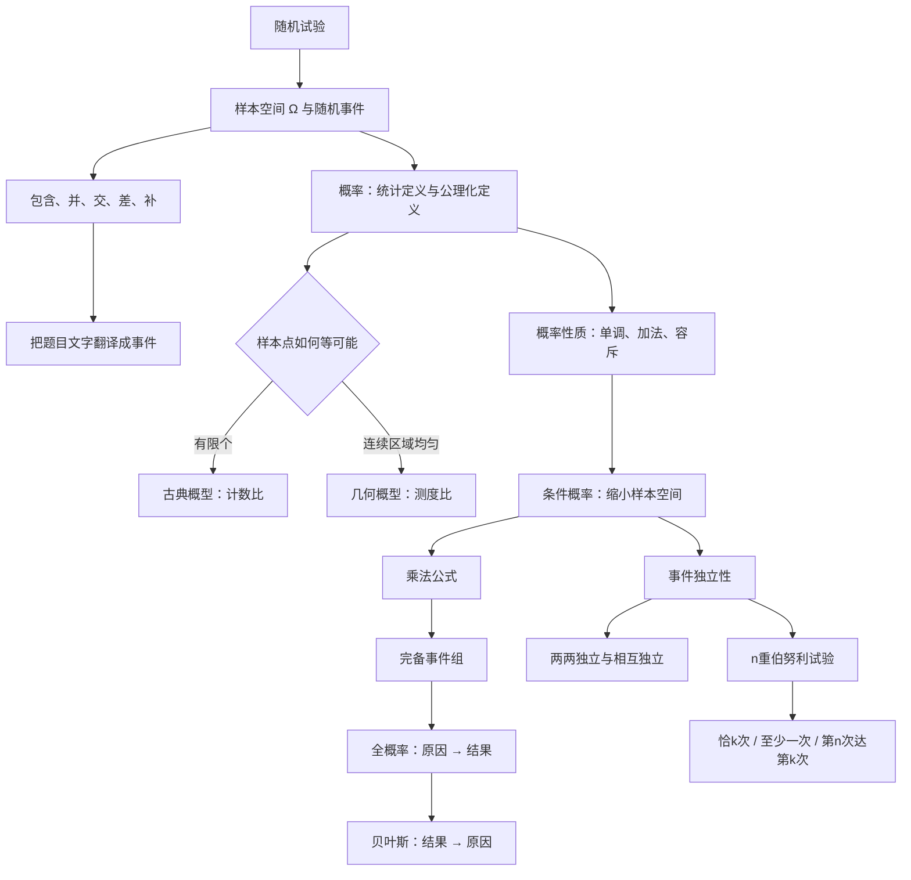

# 概率第1讲 随机事件与概率

源：`27张宇基础30讲概率.pdf`，印刷页 1-32 / PDF p7-p38。

整理方式：本讲32页已逐页OCR，并逐张阅读8张全页联系图和32张高清原页；基础知识结构、定义公式、15个正文例题、19道讲末练习及答案页均以原页复核结果为准。

## 本讲速览

- **本讲主线**：先把自然语言翻译成事件集合，再判断古典概型、几何概型或条件概率模型；随后用加法、乘法、全概率、贝叶斯和独立性组织计算。
- **事件语言是地基**：并、交、差、补、互斥、完备事件组必须先分清。概率公式算错，常常不是算术问题，而是事件写错。
- **两类直接模型**：有限且等可能用古典概型；在有限几何区域内按长度、面积或体积均匀取点用几何概型。两者都先确认“等可能/均匀”。
- **三条条件链**：条件概率是“缩小样本空间”；全概率是“由原因推结果”；贝叶斯是“看到结果后反推原因”。
- **独立不等于互斥**：独立表示一件事是否发生不改变另一件事的概率；互斥表示两件事不能同时发生。两事件概率都为正时，二者不可能既独立又互斥。
- **做题检查顺序**：事件翻译 → 模型与样本空间 → 分母是否等可能 → 是否有序/放回 → 是否需要分情况 → 公式条件 → 结果是否落在$[0,1]$。

## 教材路线

| 教材顺序 | 印刷页 / PDF页 | 本讲任务 |
|---|---|---|
| 基础知识结构 | 1 / p7 | 建立“事件语言 → 概率模型 → 概率公式 → 独立试验”的总图 |
| 一、基本概念 | 1-7 / p7-p13 | 随机试验、样本空间、事件关系与运算、概率的三种定义 |
| 二、古典概型和几何概型 | 8-14 / p14-p20 | 等可能计数、随机分配、三种抽样方式、几何测度比 |
| 三、概率的性质与公式 | 15-22 / p21-p28 | 加减法、条件概率、乘法公式、全概率公式、贝叶斯公式 |
| 四、事件的独立性和独立重复试验 | 22-25 / p28-p31 | 两事件与多事件独立、两两独立、伯努利试验 |
| 基础习题精练 | 25-26 / p31-p32 | 用练习1.1-1.19反查事件翻译、概型、条件链和独立性 |
| 答案与解析 | 27-32 / p33-p38 | 核对模型选择、关键等式、结果与易错边界 |

## 前置知识与关联导航

- 集合、函数和逻辑语言：[[01_高数第1讲_函数极限与连续|函数、集合与逻辑基础]]。
- 排列组合与二项式思想：本讲[[#4. 古典概型|古典概型]]中集中复习。
- 上一单元：[[24_线代第6讲_二次型|线代第6讲 二次型]]。
- 下一讲把“事件的概率”编码为随机变量的分布：[[26_概率第2讲_一维随机变量及其分布|概率第2讲 一维随机变量及其分布]]。
- 多维随机变量中的独立性是本讲事件独立性的延伸：[[27_概率第3讲_多维随机变量及其分布#8. 随机变量的相互独立性|随机变量的相互独立性]]。
- 频率为何趋近概率将在[[29_概率第5讲_大数定律与中心极限定理#4. 伯努利大数定律|伯努利大数定律]]中解释。

> [!note] 统一记号
> $\Omega$为样本空间，$\omega$为样本点，$\varnothing$为不可能事件；$AB$表示$A\cap B$，$\bar A$表示$A$的对立事件，$A-B=A\bar B$。条件概率$P(B\mid A)$的竖线右侧是条件。除特别说明外，事件均属于同一随机试验。

## 知识网络

## 知识点清单

## 一、基本概念

### 1. 随机试验、样本空间与随机事件

#### 1.1 随机试验

一个试验称为随机试验，通常同时具备：

1. 在相同条件下可以重复；
2. 试验前知道全部可能结果，且可能结果不止一个；
3. 每次试验前不能确定究竟出现哪个结果。

“随机”不是毫无规律，而是**单次结果不可预知，重复试验呈现稳定统计规律**。

#### 1.2 样本点与样本空间

- **样本点**$\omega$：一次试验的一个不可再分结果。
- **样本空间**$\Omega$：所有样本点组成的集合。
- **基本事件**：只含一个样本点的事件。
- **随机事件**$A$：样本空间的一个子集；当试验结果$\omega\in A$时，称事件$A$发生。
- **必然事件**：$\Omega$，每次试验都发生。
- **不可能事件**：$\varnothing$，不含样本点。

样本空间的选取取决于研究目的。同一次物理试验可以用粗细不同的样本点描述，但一旦确定$\Omega$，后续事件和概率都必须在同一层级上。

> [!tip] 看到什么想到它
> 题目出现“连续掷两次”“抽取后记录顺序”“只关心颜色而不关心编号”，先写清一个样本点究竟记录哪些信息。分母算错，最常见原因就是样本点定义前后不一致。

### 2. 事件的关系、运算与文字翻译

#### 2.1 关系与运算

| 名称 | 集合表达 | 含义 |
|---|---|---|
| 包含 | $A\subseteq B$ | $A$发生必然导致$B$发生 |
| 相等 | $A=B$ | $A\subseteq B$且$B\subseteq A$ |
| 交/积 | $AB=A\cap B$ | $A,B$同时发生 |
| 并/和 | $A\cup B$ | $A,B$至少一个发生 |
| 差 | $A-B=A\bar B$ | $A$发生而$B$不发生 |
| 对立/补 | $\bar A=\Omega-A$ | $A$不发生 |
| 相容 | $AB\ne\varnothing$ | 二者有可能同时发生 |
| 互斥/不相容 | $AB=\varnothing$ | 二者不可能同时发生 |

**对立一定互斥，但互斥不一定对立**：对立还要求$A\cup B=\Omega$。

#### 2.2 完备事件组

有限或可列个事件构成完备事件组（样本空间的一个划分），当且仅当它们两两互斥且并为$\Omega$。有限情形$B_1,\ldots,B_n$写为

$$
B_iB_j=\varnothing\quad(i\ne j),
\qquad
\bigcup_{i=1}^nB_i=\Omega.
$$

它表示所有原因被分成“互不重叠且没有遗漏”的若干类，是[[#8. 全概率公式|全概率公式]]和[[#9. 贝叶斯公式|贝叶斯公式]]的结构基础。

#### 2.3 事件运算律

| 运算律 | 公式 |
|---|---|
| 交换律 | $A\cup B=B\cup A,\ AB=BA$ |
| 结合律 | $(A\cup B)\cup C=A\cup(B\cup C),\ (AB)C=A(BC)$ |
| 分配律 | $A(B\cup C)=AB\cup AC$；$A\cup BC=(A\cup B)(A\cup C)$ |
| 幂等律 | $A\cup A=A,\ AA=A$ |
| 吸收律 | $A\cup AB=A,\ A(A\cup B)=A$ |
| 同一律 | $A\cup\varnothing=A,\ A\Omega=A$ |
| 零一律 | $A\cup\Omega=\Omega,\ A\varnothing=\varnothing$ |
| 补律 | $A\cup\bar A=\Omega,\ A\bar A=\varnothing,\ \bar{\bar A}=A$ |
| 德摩根律 | $\overline{A\cup B}=\bar A\bar B,\ \overline{AB}=\bar A\cup\bar B$ |
| 差事件 | $A-B=A\bar B$ |

德摩根律可推广：

$$
\overline{\bigcup_{i=1}^nA_i}=\bigcap_{i=1}^n\bar A_i,
\qquad
\overline{\bigcap_{i=1}^nA_i}=\bigcup_{i=1}^n\bar A_i.
$$

教材还常用

$$
A\cap(B-C)=AB-AC,
$$

本质上是先把$B-C$写成$B\bar C$再分配。

#### 2.4 高频文字翻译

| 题面语言 | 事件表达 |
|---|---|
| 至少一个发生 | $A\cup B\cup C$ |
| 都发生 | $ABC$ |
| 都不发生 | $\bar A\bar B\bar C=\overline{A\cup B\cup C}$ |
| 不都发生 | $\overline{ABC}=\bar A\cup\bar B\cup\bar C$ |
| 只发生$A$ | $A\bar B\bar C$ |
| 恰有一个发生 | $A\bar B\bar C\cup\bar AB\bar C\cup\bar A\bar BC$ |
| 至少两个发生 | $AB\cup AC\cup BC$ |
| 至多一个发生 | $\bar A\bar B\cup\bar A\bar C\cup\bar B\bar C$ |
| 恰有两个发生 | $AB\bar C\cup A\bar BC\cup\bar ABC$ |

若$A=\{X\ge c\}$，$B=\{Y\ge c\}$，则

$$
\{\max(X,Y)\ge c\}=A\cup B,\qquad
\{\min(X,Y)\ge c\}=AB,
$$

$$
\{\max(X,Y)<c\}=\bar A\bar B,\qquad
\{\min(X,Y)<c\}=\bar A\cup\bar B.
$$

> [!warning] 易错边界
> “不都发生”只排除“全部发生”，仍允许发生一个或两个；“都不发生”则一个也不能发生。“至多一个”还包括零个发生。

> [!tip] 看到什么想到它
> 文字长、条件多时，先用集合式表达，再化简；判断两个事件式是否相等，可用事件代数、互相包含或Venn图，不能像普通代数那样随意约去事件。

### 3. 概率的描述性、统计性与公理化定义

#### 3.1 描述性理解

$P(A)$衡量事件$A$发生可能性的大小，满足$0\le P(A)\le1$。它不是对单次试验的预言，而是对随机机制的数量刻画。

#### 3.2 统计定义：频率提供概率的经验估计

重复$n$次试验，事件$A$发生$n_A$次，频率为

$$
f_n(A)=\frac{n_A}{n}.
$$

频率随试验结果改变，是随机的；当$n$很大时，它通常在某个常数附近稳定，该常数用来刻画$P(A)$。

> [!warning] 概率不等于某一次实验频率
> $f_n(A)$是样本数据，$P(A)$是随机机制的理论参数。大样本下“接近”不等于有限样本中“必然相等”，其理论依据见[[29_概率第5讲_大数定律与中心极限定理#4. 伯努利大数定律|伯努利大数定律]]。

#### 3.3 公理化定义

概率$P$是在事件集合上定义的函数，满足：

1. **非负性**：$P(A)\ge0$；
2. **规范性**：$P(\Omega)=1$；
3. **可列可加性**：若$A_1,A_2,\ldots$两两互斥，则

$$
P\left(\bigcup_{i=1}^{\infty}A_i\right)
=\sum_{i=1}^{\infty}P(A_i).
$$

有限个互斥事件的可加性是第三条公理的直接推论。

> [!tip] 看到什么想到它
> 证明一个函数能否作为概率时，查三条公理；计算具体概率时，通常使用这些公理推出的补集、单调性、加法和条件概率公式。

## 二、古典概型和几何概型

### 4. 古典概型

#### 4.1 适用条件与基本公式

古典概型同时要求：

1. 样本空间只含有限个样本点；
2. 每个样本点等可能。

若$\Omega$有$n$个等可能样本点，事件$A$含$k$个，则

$$
P(A)=\frac{k}{n}
=\frac{A\text{所含样本点数}}{\Omega\text{所含样本点数}}.
$$

有限不代表等可能。若各样本点概率不同，不能直接“有利数/总数”。

#### 4.2 计数工具

- **加法原理**：互斥的若干完成方式，总数相加。
- **乘法原理**：按连续步骤完成，每步选择数相乘。
- **排列**：从$n$个不同元素取$m$个并排序，

$$
A_n^m=P_n^m=\frac{n!}{(n-m)!}.
$$

- **组合**：从$n$个不同元素取$m$个，不计顺序，

$$
C_n^m=\binom nm=\frac{n!}{m!(n-m)!}.
$$

- **补集计数**：遇到“至少一个、存在重复、不是全都”时，常用

$$
N(A)=N(\Omega)-N(\bar A).
$$

#### 4.3 随机分配/占盒模型

$n$个可区分对象独立放入$N$个可区分位置，每个对象有$N$种去向，总样本数为

$$
N^n.
$$

教材例1.1形成三条常用计数：

1. 指定$n$个位置各恰有一个对象（$n\le N$）：

$$
P=\frac{n!}{N^n}.
$$

2. 恰有$n$个位置被占用，即每个被占位置恰有一个对象：

$$
P=\frac{\binom Nn n!}{N^n}.
$$

3. 指定$k$个位置各恰有一个对象：先从$n$个对象中选$k$个并与指定位置一一对应，其余对象不能进入这$k$个位置，

$$
P=\frac{\binom nk k!(N-k)^{n-k}}{N^n}
=\frac{n!(N-k)^{n-k}}{(n-k)!N^n}.
$$

生日、进房间、到车站等题只是在改写“对象”和“位置”。

#### 4.4 三种抽样模型

从$N$个可区分对象中抽$n$次：

| 抽样方式 | 是否计顺序 | 等可能样本总数 | 典型分布入口 |
|---|---:|---:|---|
| 有放回逐次抽取 | 是 | $N^n$ | 独立重复、二项模型 |
| 无放回逐次抽取 | 是 | $A_N^n$ | 路径计数 |
| 任取$n$个 | 否 | $C_N^n$ | 超几何计数 |

无放回逐次抽取与任取$n$个的样本点不同，但若事件只关心“抽到哪些对象、不关心顺序”，分子分母都会多出$n!$，概率相同。

#### 4.5 教材例1.2：至少一个优先取补

袋中3白2黑，抽2个：

- 有放回：

$$
P(\text{至少一白})=1-\left(\frac25\right)^2=\frac{21}{25}.
$$

- 无放回：

$$
P(\text{至少一白})
=1-\frac25\cdot\frac14
=\frac9{10}.
$$

- 任取2个：

$$
P(\text{至少一白})
=1-\frac{\binom22}{\binom52}
=\frac9{10}.
$$

这里展示的不是三个孤立公式，而是“先识别抽样模型，再用补集简化至少一个”。

#### 4.6 教材例1.3：恰有若干个与固定次抽取

100个球中40白60黑，抽20次：

- 有放回且恰15白：

$$
\binom{20}{15}\left(\frac{40}{100}\right)^{15}
\left(\frac{60}{100}\right)^5.
$$

- 无放回且恰15白：

$$
\frac{\binom{40}{15}\binom{60}{5}}{\binom{100}{20}}.
$$

- 不论有无放回，第20个球为白球的边缘概率均为

$$
\frac{40}{100}=\frac25.
$$

无放回使各次抽取**不独立**，但任一固定位置在随机排列中具有对称性，所以其边缘概率仍等于总体白球比例。

> [!tip] 看到什么想到它
> 古典概型先问四件事：样本点是否等可能？是否计顺序？是否放回？对象/位置是否可区分？“至少”常取补，“恰有”常分类计数，“固定第$r$次”常用位置对称性。

### 5. 几何概型

#### 5.1 适用条件与公式

若样本点在有限可测区域$\Omega$内按几何测度均匀分布，事件$A$对应子区域，则

$$
P(A)=\frac{m(A)}{m(\Omega)},
$$

其中$m$可表示长度、面积或体积。

几何概型的核心条件是“对等测度的小区域等可能”，不是区域形状规则。概率只由测度比决定，与子区域的位置、方向和形状无关。

#### 5.2 标准解题流程

1. 选坐标，把一次试验表示为点；
2. 写出样本区域$\Omega$；
3. 把事件条件化为不等式区域$A$；
4. 画图确认交集、边界与补集；
5. 求长度/面积/体积比。

边界曲线、有限个点等零测度集合通常不影响概率，所以严格不等号与非严格不等号常给出同一结果。

按教材的考试范围提示，数学一还可能用体积处理三维区域；数学三通常落在一维长度和二维面积。无论维数怎样变化，入口始终是“均匀性 + 测度比”。

#### 5.3 教材例1.4：绝对值条件先画带状区域

$x,y$独立且均匀取自$(0,1)$，事件$|x-y|<1/2$对应单位正方形内两条直线之间的带状区域。用补集两个直角三角形：

$$
P(|x-y|<1/2)
=1-2\cdot\frac{\frac12\cdot\frac12\cdot\frac12}{1}
=\frac34.
$$

> [!tip] 看到什么想到它
> “随机到达时刻、随机取两个数、随机断棒、平面点均匀落入”通常提示几何概型。先画样本区域，再判断直接算事件区还是算补集更短。

## 三、概率的性质与公式

### 6. 概率的基本性质、加法与减法

#### 6.1 基本性质

由三条公理可推出：

$$
P(\varnothing)=0,\qquad 0\le P(A)\le1.
$$

若$A\subseteq B$，则

$$
P(B-A)=P(B)-P(A),\qquad P(A)\le P(B).
$$

特别地，

$$
P(\bar A)=1-P(A).
$$

> [!warning] 集合关系不能由概率值机械反推
> $A=\varnothing\Rightarrow P(A)=0$，但在连续模型中$P(A)=0$不一定有$A=\varnothing$；同理，$A=\Omega\Rightarrow P(A)=1$，但$P(A)=1$不一定有$A=\Omega$。概率为0/1描述“几乎不发生/几乎必然”，不必等于空集/全集。

同样，

$$
P(A)=P(B)
$$

只说明两事件可能性相同，不推出$A=B$。

#### 6.2 加法公式与容斥

两事件：

$$
P(A\cup B)=P(A)+P(B)-P(AB).
$$

三事件：

$$
\begin{aligned}
P(A\cup B\cup C)
={}&P(A)+P(B)+P(C)\\
&-P(AB)-P(AC)-P(BC)+P(ABC).
\end{aligned}
$$

一般容斥原则按“单项加、两两交减、三重交加……”交替。

若$A_1,\ldots,A_n$两两互斥，则交项均为0：

$$
P\left(\bigcup_{i=1}^nA_i\right)=\sum_{i=1}^nP(A_i).
$$

#### 6.3 差事件与常用界

$$
P(A-B)=P(A)-P(AB).
$$

由加法公式可得

$$
P(A\cup B)\le P(A)+P(B),
$$

$$
P(AB)\ge P(A)+P(B)-1.
$$

并集上界推广为

$$
P\left(\bigcup_{i=1}^nA_i\right)
\le\sum_{i=1}^nP(A_i).
$$

#### 6.4 教材例题给出的判题规则

- **例1.5**：比较复合事件概率，先证明事件包含，再用单调性；不能只看代数形式猜大小。
- **例1.6**：即使$P(A\cup B)=1$，也不能直接断言$A\cup B=\Omega$；应只在概率层面使用补集公式。
- **例1.9**：信件全部错装可设$A_i=$“第$i$封装对”，先求$\bigcup A_i$再取补；错排本质上是容斥。

> [!tip] 看到什么想到它
> “至少一个”常用并集或补集；“至少发生其中一个”但事件不互斥时必须减交集；“比较概率”先寻找包含关系；“全错、无人、没有一个”常对“至少一个正确”取补。

### 7. 条件概率

#### 7.1 定义：条件事件成为新样本空间

当$P(A)>0$时，在$A$已发生的条件下$B$发生的概率为

$$
P(B\mid A)=\frac{P(AB)}{P(A)}.
$$

直观上，原样本空间$\Omega$缩小为$A$，其中的有利部分是$AB$。

$P(\,\cdot\mid A)$本身仍满足概率的三条公理，因此补集、加法、单调性等公式都可在条件$A$下使用，例如

$$
P(\bar B\mid A)=1-P(B\mid A).
$$

#### 7.2 乘法公式

由条件概率定义：

$$
P(AB)=P(A)P(B\mid A)
=P(B)P(A\mid B).
$$

多事件链式乘法：

$$
\begin{aligned}
P(A_1A_2\cdots A_n)
={}&P(A_1)P(A_2\mid A_1)\\
&\cdots P(A_n\mid A_1A_2\cdots A_{n-1}),
\end{aligned}
$$

前提是各条件事件概率为正。

#### 7.3 教材例1.7：先把互斥条件用于分子

若$A,C$互斥，则$AC=\varnothing$。求$P(AB\mid\bar C)$时：

$$
P(AB\mid\bar C)
=\frac{P(AB\bar C)}{P(\bar C)}
=\frac{P(AB)}{1-P(C)}.
$$

例中$P(AB)=1/2,\ P(C)=1/3$，故结果为$3/4$。

#### 7.4 教材例1.8：两个方向的条件概率共用交概率

若

$$
P(A)=\frac14,\qquad
P(B\mid A)=\frac13,\qquad
P(A\mid B)=\frac12,
$$

则

$$
P(AB)=P(A)P(B\mid A)=\frac1{12},
$$

$$
P(B)=\frac{P(AB)}{P(A\mid B)}=\frac16,
\qquad
P(A\cup B)=\frac13.
$$

> [!warning] 条件方向不能交换
> $P(B\mid A)$与$P(A\mid B)$通常不同；二者通过同一个$P(AB)$联系。写公式前先用中文读一遍：“在谁已经发生的条件下，求谁？”

> [!tip] 看到什么想到它
> 题面出现“已知、在……条件下、抽到某类后、至少有人成功的情况下”，先写条件概率分式；分子必须是“目标且条件”，分母只写“条件”。

### 8. 全概率公式

#### 8.1 公式与结构

若$B_1,\ldots,B_n$构成完备事件组，且$P(B_i)>0$，则对任意事件$A$：

$$
A=\bigcup_{i=1}^nAB_i,
$$

其中$AB_i$两两互斥。因此

$$
P(A)=\sum_{i=1}^nP(B_i)P(A\mid B_i).
$$

它把“结果$A$”按全部可能原因$B_i$拆开：

$$
\text{结果概率}
=\sum \text{原因概率}\times\text{该原因下结果概率}.
$$

#### 8.2 建立完备事件组的常见方式

- 第一次抽取的颜色、等级或箱号；
- 机器、工厂、批次或人群来源；
- 随机变量的各个可能取值；
- 某过程前一步的所有互斥状态；
- 缺陷个数、疾病状态等隐藏原因。

检查两件事：原因之间是否互斥；是否覆盖全部情况。

#### 8.3 教材例1.10：先随机选范围，再在范围内抽取

先均匀选$X\in\{1,2,3,4\}$，再从$\{1,\ldots,X\}$均匀选$Y$。求$P(Y=2)$时，按$X$分层：

$$
P(Y=2)
=\sum_{x=1}^4P(X=x)P(Y=2\mid X=x)
=\frac{13}{48}.
$$

不同$x$下第二步分母不同，不能把所有$(x,y)$误当成等可能点。

#### 8.4 教材例1.11：无放回不独立，但固定次边缘概率不变

10件正品、2件次品无放回抽2件，按第一次结果分层：

$$
\begin{aligned}
P(\text{第二次次品})
={}&P(\text{首正})P(\text{次品}\mid\text{首正})\\
&+P(\text{首次})P(\text{次品}\mid\text{首次})
=\frac16.
\end{aligned}
$$

也可由随机排列的位置对称性直接得到$2/12=1/6$。

> [!tip] 看到什么想到它
> 题目是“先……再……”，且后一步概率受前一步状态影响，优先画概率树或按前一步构造完备事件组。路径上相乘，互斥路径间相加。

### 9. 贝叶斯公式

#### 9.1 公式与含义

若$B_1,\ldots,B_n$构成完备事件组，$P(B_i)>0$，且$P(A)>0$，则

$$
P(B_i\mid A)
=\frac{P(B_i)P(A\mid B_i)}
{\sum_{j=1}^nP(B_j)P(A\mid B_j)}.
$$

四个角色：

| 名称 | 数学量 | 含义 |
|---|---|---|
| 先验概率 | $P(B_i)$ | 看到结果前对原因的认识 |
| 似然 | $P(A\mid B_i)$ | 原因$B_i$下看到证据$A$的可能性 |
| 证据概率 | $P(A)$ | 全部原因产生证据$A$的总概率 |
| 后验概率 | $P(B_i\mid A)$ | 看到证据后对原因的更新 |

全概率公式沿“原因$\to$结果”，贝叶斯公式沿“结果$\to$原因”。分母就是先用全概率算出的证据总概率。

#### 9.2 教材示例：同一棵概率树的正向与反向

教材用“村庄从三个小偷中等可能派一人，三人的得手概率分别为$0,3/4,1/6$”说明两个方向。设$B=$失窃，$A_i=$派第$i$人：

1. 正向求失窃概率，用全概率：

$$
P(B)=\sum_{i=1}^3P(A_i)P(B\mid A_i)
=\frac13\left(0+\frac34+\frac16\right)
=\frac{11}{36}.
$$

2. 已知发生失窃，反问是谁去的，用贝叶斯：

$$
P(A_1\mid B)=0,\qquad
P(A_2\mid B)=\frac9{11},\qquad
P(A_3\mid B)=\frac2{11}.
$$

这说明后验概率不是只比较“谁本领大”，而是比较各原因的**先验权重×产生证据的能力**。本例三人的先验相同，所以后验恰与各自得手概率成比例。

#### 9.3 教材例1.12：先更新原因，再预测下一次

两批产品等可能被选中：一批全合格，另一批有$1/4$不合格。抽到一个合格品后放回，再抽同一批产品：

1. 用贝叶斯公式更新“选中哪一批”的后验概率；
2. 再用更新后的批次概率，通过全概率预测下一件不合格。

最终

$$
P(\text{下一件不合格}\mid\text{已见合格})=\frac3{28}.
$$

这类题不是把“放回”理解成回到最初状态：物理组成恢复了，但观察到的证据已经改变了对批次来源的认识。

> [!tip] 看到什么想到它
> “已检测为阳性，实际患病的概率”“产品合格后来自哪台机器”“观察到白球后原袋类型”都是逆向追因。先列全部原因，再写先验、似然，分母把所有原因路径加全。

## 四、事件的独立性和独立重复试验

### 10. 事件的独立性

#### 10.1 两事件独立

事件$A,B$独立，当且仅当

$$
P(AB)=P(A)P(B).
$$

若$P(A)>0$，则等价于$P(B\mid A)=P(B)$；若$P(B)>0$，也等价于$P(A\mid B)=P(A)$。含义是一个事件是否发生不改变另一个事件的概率。

若

$$
P(AB)>P(A)P(B),
$$

可称二者正关联；若小于，则负关联；相等就是独立。

#### 10.2 独立与互斥的区别

| 关系 | 数学条件 | 直观含义 |
|---|---|---|
| 互斥 | $P(AB)=0$（集合层面更强为$AB=\varnothing$） | 不能同时发生 |
| 独立 | $P(AB)=P(A)P(B)$ | 是否发生互不影响 |

若$A,B$互斥且$P(A),P(B)>0$，则

$$
P(AB)=0<P(A)P(B),
$$

所以二者不独立。互斥通常表示强烈的负向影响。

#### 10.3 三事件：两两独立与相互独立

$A,B,C$两两独立只要求

$$
P(AB)=P(A)P(B),\quad
P(AC)=P(A)P(C),\quad
P(BC)=P(B)P(C).
$$

三者相互独立还必须满足

$$
P(ABC)=P(A)P(B)P(C).
$$

因此两两独立不推出相互独立。

一般地，$A_1,\ldots,A_n$相互独立，要求任取$k\ge2$个事件都有

$$
P(A_{i_1}\cdots A_{i_k})
=P(A_{i_1})\cdots P(A_{i_k}).
$$

只检验全部$n$个的乘积等式也不够，所有子组都要满足。

#### 10.4 独立性的稳定结论

1. 若$A,B$独立，则以下各对也独立：

$$
A,\bar B;\qquad \bar A,B;\qquad \bar A,\bar B.
$$

2. 若一族事件相互独立，把它们分成互不重叠的若干组，并在每组内部作有限次并、交、差、补，所得各组事件仍相互独立。
3. 概率为0或1的事件与任意事件独立，因为乘法等式自动成立；但它未必就是$\varnothing$或$\Omega$。

#### 10.5 教材例1.13：构造反例识别“两两不相互”

两次抛公平硬币，取“第一次正面”“第二次正面”“两次结果一正一反”等三个事件。它们可满足任意两事件的乘法等式，却不满足三重交的乘法等式。

这个例子要记住的是检查层级：

1. 两两独立：逐对查；
2. 相互独立：还要查三重交，推广到$n$个时查任意子组。

> [!tip] 看到什么想到它
> 题面写“互不影响、独立工作、各人独立命中”时才能乘；无放回抽样通常不独立。判断多个事件独立，不能只查两两，也不能只查全体乘积。

### 11. 独立重复试验与伯努利模型

#### 11.1 独立试验序列与$n$重伯努利模型

在相同条件下独立重复进行一系列完全相同的试验，每次试验的可能结果及各结果概率都不变，且各次试验相互独立，称为**独立试验序列模型**。

一次试验只有“成功$A$”与“失败$\bar A$”两个结果，且

$$
P(A)=p,\qquad P(\bar A)=q=1-p.
$$

若独立试验序列中每次只有上述两个结果，重复$n$次，就得到**$n$重伯努利模型**。所以“独立试验序列”是上位概念，“$n$重伯努利”还额外限定每次只有两种结果。三个关键词缺一不可：

1. 每次只有成功/失败两类结果；
2. 每次成功概率均为同一个$p$；
3. 各次试验相互独立。

#### 11.2 恰有$k$次成功

任意一条含$k$次成功、$n-k$次失败的指定路径概率为$p^kq^{n-k}$，这样的路径有$\binom nk$条，因此

$$
P_n(k)=\binom nkp^k(1-p)^{n-k},
\qquad k=0,1,\ldots,n.
$$

这就是下一讲[[26_概率第2讲_一维随机变量及其分布#5. 二项分布|二项分布]]的来源。

#### 11.3 高频二级结论

- 至少一次成功：

$$
P(X\ge1)=1-(1-p)^n.
$$

- 前$n-1$次恰有$k-1$次成功，且第$n$次成功，即“第$n$次试验时恰好达到第$k$次成功”：

$$
\binom{n-1}{k-1}p^k(1-p)^{n-k}.
$$

- 第$r$次才首次成功：

$$
(1-p)^{r-1}p.
$$

#### 11.4 教材例1.14与例1.15

- **例1.14**：三次独立射击，已知至少一次命中概率为$7/8$。由

$$
1-(1-p)^3=\frac78
$$

得$p=1/2$。

- **例1.15**：第4次射击后恰为第2次命中，要求前三次恰命中一次且第4次命中：

$$
\binom31p(1-p)^2\cdot p
=3p^2(1-p)^2.
$$

组合位置只能在前3次中选；第4次已经被题意固定为成功，不能再放入$\binom42$中任选。

> [!tip] 看到什么想到它
> “重复$n$次、每次成功率相同且独立”先想到伯努利模型；“至少一次”先取补；“第$n$次才达到第$k$次”把最后一次固定为成功，只在前$n-1$次选$k-1$个成功位置。

## 公式与二级结论索引

| 结论 | 完整公式与条件 | 详细讲解 |
|---|---|---|
| 德摩根律 | $\overline{\cup A_i}=\cap\bar A_i$，$\overline{\cap A_i}=\cup\bar A_i$ | [[#2. 事件的关系、运算与文字翻译|事件运算]] |
| 古典概型 | 有限且等可能时$P(A)=N(A)/N(\Omega)$ | [[#4. 古典概型|古典概型]] |
| 几何概型 | 在有限区域内按测度均匀时$P(A)=m(A)/m(\Omega)$ | [[#5. 几何概型|几何概型]] |
| 对立事件 | $P(\bar A)=1-P(A)$ | [[#6. 概率的基本性质、加法与减法|概率性质]] |
| 两事件加法 | $P(A\cup B)=P(A)+P(B)-P(AB)$ | [[#6. 概率的基本性质、加法与减法|加法公式]] |
| 三事件容斥 | 单项和减两两交，再加三重交 | [[#6. 概率的基本性质、加法与减法|容斥]] |
| 差事件 | $P(A-B)=P(A)-P(AB)$ | [[#6. 概率的基本性质、加法与减法|减法]] |
| 条件概率 | $P(B\mid A)=P(AB)/P(A)$，要求$P(A)>0$ | [[#7. 条件概率|条件概率]] |
| 乘法公式 | $P(AB)=P(A)P(B\mid A)$；多事件按条件链相乘 | [[#7. 条件概率|乘法公式]] |
| 全概率公式 | 完备事件组$B_i$下，$P(A)=\sum P(B_i)P(A\mid B_i)$ | [[#8. 全概率公式|全概率公式]] |
| 贝叶斯公式 | $P(B_i\mid A)=P(B_i)P(A\mid B_i)/P(A)$，分母用全概率展开 | [[#9. 贝叶斯公式|贝叶斯公式]] |
| 两事件独立 | $P(AB)=P(A)P(B)$ | [[#10. 事件的独立性|事件独立性]] |
| 三事件相互独立 | 三个两两乘积等式和一个三重乘积等式都成立 | [[#10. 事件的独立性|多事件独立]] |
| 二项概率 | $n$重伯努利试验中$P(X=k)=\binom nkp^k(1-p)^{n-k}$ | [[#11. 独立重复试验与伯努利模型|伯努利模型]] |
| 至少一次成功 | $1-(1-p)^n$，前提是$n$次独立且成功率同为$p$ | [[#11. 独立重复试验与伯努利模型|伯努利模型]] |
| 第$n$次达第$k$次成功 | $\binom{n-1}{k-1}p^k(1-p)^{n-k}$ | [[#11. 独立重复试验与伯努利模型|伯努利模型]] |

## 题型—方法决策表

| 题面信号 | 首选入口 | 关键步骤 | 检查点 |
|---|---|---|---|
| 至少一个、都不、不都、恰有几个 | 事件运算与德摩根律 | 先翻译事件，再决定直接算或取补 | “不都”是否误写成“都不” |
| 比较两个事件概率 | 集合包含 + 单调性 | 先证明$A\subseteq B$ | 概率相等不能反推事件相等 |
| 有限个结果且等可能 | 古典概型 | 定义样本点，数分子分母 | 是否真的等可能 |
| 抽球、选人、排座 | 排列组合 | 判断有序/无序、放回/不放回 | 分子分母必须用同一种样本点 |
| 随机分配到盒、房间、日期 | 占盒模型 | 总数$N^n$，再约束位置 | 对象和位置是否可区分 |
| 至少一白、至少一次命中 | 补集 | $1-P(\text{零次})$ | 补事件是否更容易 |
| 连续区间或平面均匀取点 | 几何概型 | 写不等式、画区域、求测度比 | 区域是否有限且均匀 |
| “在……已发生条件下” | 条件概率 | 分子写目标交条件，分母写条件 | 竖线方向、分母是否大于0 |
| 连续多步抽取 | 乘法公式/概率树 | 路径内乘，互斥路径间加 | 无放回时条件概率会变 |
| 原因分若干互斥类别，求结果 | 全概率公式 | 构造完备事件组并逐路相乘 | 原因是否互斥且穷尽 |
| 看到结果后判断原因 | 贝叶斯公式 | 先验×似然，再除证据总概率 | 分母是否包含所有原因 |
| 问无放回固定第$r$次的类别 | 位置对称性 | 固定位置边缘概率等于总体比例 | 仅边缘相同，不代表各次独立 |
| “互不影响、独立工作” | 独立性乘法 | 交事件概率化为乘积 | 独立与互斥不能混 |
| 三个事件是否相互独立 | 两两 + 三重检查 | 查3个两两等式和1个三重等式 | 只查两两不够 |
| $n$次独立、成功率相同 | 伯努利模型 | 选成功位置并乘路径概率 | 是否独立、$p$是否恒定 |
| 第$n$次恰达到第$k$次成功 | 末次固定成功 | 前$n-1$次恰$k-1$次成功 | 组合数应为$\binom{n-1}{k-1}$ |

## 教材例题覆盖表

| 例题 | 核心知识与通用步骤 | 独有结论/迁移 |
|---|---|---|
| 1.1 | 以$N^n$为随机分配总数，再按指定位置、任选位置分别计数 | 生日、房间、车站题都是占盒模型 |
| 1.2 | 分清有放回、无放回、任取三种抽样，再对“至少一白”取补 | 无放回有序与无序的共同排列因子可约去 |
| 1.3 | “恰15白”分别用二项路径计数和超几何计数；固定第20次用位置对称 | 无放回不独立，但固定位置边缘概率仍等于总体比例 |
| 1.4 | 把两个均匀数写成单位正方形内的点，用补集面积 | 绝对值不等式对应对角带 |
| 1.5 | 先找事件包含关系，再用概率单调性 | 复合事件概率比较不能靠外观 |
| 1.6 | 在概率层面使用$P(A\cup B)=1$，不把它擅自升级为集合等式 | 零/一概率事件未必为空集/全集 |
| 1.7 | 用互斥关系化简条件概率分子 | $AC=\varnothing$可推出$ABC=\varnothing$ |
| 1.8 | 两个方向条件概率共用$P(AB)$，先交后边缘再并 | 条件概率不可交换 |
| 1.9 | 设“第$i$封装对”为事件，容斥后取补 | 错排数可由容斥得到 |
| 1.10 | 按先选出的$X$分层，用全概率求$Y$ | 分层后各层样本大小不同，不能平铺成等可能点 |
| 1.11 | 按第一次抽取结果分层，或用位置对称求第二次次品 | 固定次边缘概率与抽取次序无关 |
| 1.12 | 观察合格后先用贝叶斯更新批次，再用全概率预测 | “先诊断、后预测”是两公式的连续使用 |
| 1.13 | 逐对检查独立，再检查三重交 | 提供“两两独立但不相互独立”的标准反例 |
| 1.14 | “至少一次命中”对“全部未中”取补 | $1-(1-p)^n$ |
| 1.15 | 最后一次固定命中，前面恰有一次命中 | 第$n$次达第$k$次成功用$\binom{n-1}{k-1}$ |

## 讲末练习反查

| 练习 | 反查知识点 | 只看笔记应能完成的关键动作 |
|---|---|---|
| 1.1 | 事件代数 | 把差改写为交补，用恒等式或Venn图验证，不能随意“消去事件” |
| 1.2 | 事件与概率的区别 | 识别$P(A)=P(B)\nRightarrow A=B$，$P(AB)=0\nRightarrow AB=\varnothing$ |
| 1.3 | 古典概型 | 把判别式条件转成两次有序掷骰的点对计数，结果为$19/36$ |
| 1.4 | 分类计数/全概率 | 按第一步颜色或来源分互斥路径，路径内乘、路径间加，结果为$19/40$ |
| 1.5 | 独立性的事件运算 | 展开$P((A\cup B)C)$；在已知$AC,BC$独立后，关键落到$ABC$项 |
| 1.6 | 几何概型 | 将角度条件化为区域面积比，结果为$1/2+1/\pi$ |
| 1.7 | 几何概型 | 画出$xy>1/4$与$x+y<5/4$的交区并分块积分，结果为$15/32-\frac12\ln2$ |
| 1.8 | 事件运算与加法 | 展开$P(\bar A\bar B)$并连接$P(A\cup B)$，得$P(B)=1-p$ |
| 1.9 | 差事件 | 用$A=(A-B)\cup AB$且两部分互斥，得$P(AB)=0.4$、$P(\overline{AB})=0.6$ |
| 1.10 | 条件概率 | 先化简条件事件，再写“目标交条件/条件”，结果为$0.25$ |
| 1.11 | 互斥、独立、包含 | 三种关系分别列式，可得对应$P(B)$为$0.3,0.5,0.7$ |
| 1.12 | 独立事件并集 | 对“至少一人解出”取“无人解出”的补，结果为$3/5$ |
| 1.13 | 条件概率与独立性 | 在“至少一人命中”条件下求$A$命中，分母为并事件，结果为$15/22$ |
| 1.14 | 文字转事件 | 区分“都不”“不都”“至多一个”，尤其记住至多一个含零个 |
| 1.15 | 最大最小事件 | $\max$越过阈值对应并，$\min$越过阈值对应交；反向条件用补集 |
| 1.16 | 事件恒等式 | 差事件先化成交补，再用分配律、吸收律或Venn图查等式 |
| 1.17 | 贝叶斯公式 | 把原球颜色作为原因、观察白球作为证据，后验原球为白的概率为$2/3$ |
| 1.18 | 嵌套条件概率 | 先按箱子分层求$P(A)=2/5$和$P(AB)=276/1421$，再得$q=P(B\mid A)=690/1421$ |
| 1.19 | 多层全概率 | 缺陷个数为一级原因、检测判断为二级路径，区分误拒与误收，合格概率为$0.887$ |

## 易错点/易混点

1. **随机事件不是一个数**：它是$\Omega$的子集；概率才是赋给事件的数。
2. **样本点定义必须统一**：分母按有序样本数，分子也必须按有序计数。
3. **有限不等于古典概型**：还要每个样本点等可能。
4. **对立不等于互斥**：对立是“互斥且并为$\Omega$”。
5. **不都不等于都不**：$\overline{ABC}$与$\bar A\bar B\bar C$不同。
6. **至多一个包含零个**：不能只写三个“恰有一个”的互斥项。
7. **概率相等不推出事件相等**：$P(A)=P(B)$只比较测度。
8. **零概率不一定是不可能事件**：连续型随机变量取某一点就是典型例子。
9. **加法公式不能漏交集**：只有互斥事件才可直接相加。
10. **无放回不独立**：即使固定次边缘概率与总体比例相同，各次之间仍相互影响。
11. **条件概率方向不能颠倒**：竖线右边是已经知道的条件。
12. **条件概率分子必须取交**：$P(B\mid A)$的分子是$P(AB)$，不是$P(B)$。
13. **全概率的分类必须互斥且穷尽**：漏掉原因，分母和总概率都会错。
14. **贝叶斯分母不是随便归一化**：它是证据$A$的全概率。
15. **独立不等于互斥**：正概率互斥事件一定不独立。
16. **两两独立不推出相互独立**：三个事件还要查三重交。
17. **只查全体乘积也不够**：多事件相互独立要求任意子组乘积等式。
18. **伯努利试验要求同概率且独立**：无放回抽球一般不能直接套二项式。
19. **第$n$次达第$k$次成功时末次已固定**：组合数是$\binom{n-1}{k-1}$，不是$\binom nk$。
20. **频率不是概率本身**：有限次试验的频率可以偏离理论概率。

## 注解

### 1. 为什么先翻译事件再列概率式

概率公式只处理集合关系。自然语言中的“至少、至多、恰好、不都、只”若翻译错，后面即使每一步算术正确也不会得到正确答案。最稳做法是先写事件式，再依据并、交、补决定用加法、乘法还是补集。

### 2. 古典概型与几何概型其实是一条思想

两者都在做“有利部分/全部部分”。古典概型用样本点个数作测度，几何概型用长度、面积或体积作测度。几何区域若切成大量等测度小块，也可近似看成古典计数。

### 3. 为什么无放回的固定次概率仍等于总体比例

把所有对象随机排列，任意固定位置对每个对象完全对称，所以该位置属于某类的概率等于该类对象占总体的比例。这个结论只说明单个位置的边缘分布，不说明不同位置独立。

### 4. 全概率与贝叶斯是一正一反

全概率已知各原因及原因下结果，求结果：

$$
\text{原因}\longrightarrow\text{结果}.
$$

贝叶斯观察到结果后，重新分配各原因的权重：

$$
\text{结果}\longrightarrow\text{原因}.
$$

贝叶斯公式的分母正是全概率，所以两者应作为同一张概率树的正向与反向阅读。

### 5. 为什么观察后放回仍可能改变下一次概率

放回只恢复了物理组成，却没有抹去已经获得的信息。若盒子类型未知，观察结果会改变“当前是哪种盒子”的后验概率，因此下一次的预测也改变；教材例1.12正是这种“信息状态改变”。

### 6. 独立性为何用乘法刻画

若$A$发生不改变$B$的概率，则$P(B\mid A)=P(B)$。代入

$$
P(AB)=P(A)P(B\mid A)
$$

立即得到$P(AB)=P(A)P(B)$。因此乘法等式不是生硬定义，而是“条件不改变概率”的无分母写法。

### 7. 做综合概率题时怎样画树

每一层代表一步或一种原因；一条路径上的条件概率相乘；到达同一目标事件的互斥路径相加。若题目反问路径来源，就用目标证据对路径权重归一化，即贝叶斯更新。

## 速背检查

1. **随机试验的三个特征是什么？** 可重复、结果集合已知且不唯一、单次结果事前不确定。
2. **事件与样本点是什么关系？** 事件是样本点组成的集合；基本事件只含一个样本点。
3. **对立事件比互斥多什么条件？** 两事件之并必须为$\Omega$。
4. **“不都发生”怎样写？** $\overline{ABC}=\bar A\cup\bar B\cup\bar C$。
5. **完备事件组的两项条件？** 两两互斥且并为$\Omega$。
6. **概率的三条公理？** 非负性、$P(\Omega)=1$、两两互斥事件的可列可加性。
7. **频率与概率的区别？** 频率是样本统计量，概率是随机机制参数。
8. **古典概型的两个条件？** 样本点有限且等可能。
9. **有放回、无放回有序、任取$n$个的总数？** $N^n,A_N^n,C_N^n$。
10. **几何概型的公式及前提？** 均匀落在有限可测区域时，概率等于有利测度/总测度。
11. **$P(A)=0$能否推出$A=\varnothing$？** 一般不能。
12. **两事件加法公式？** $P(A\cup B)=P(A)+P(B)-P(AB)$。
13. **条件概率分子、分母分别是什么？** 分子是目标与条件的交，分母是条件。
14. **多步同时发生怎样算？** 用乘法公式，按路径依次乘条件概率。
15. **全概率公式解决什么方向？** 按全部原因分解，原因推结果。
16. **贝叶斯公式解决什么方向？** 观察结果后反推并更新原因概率。
17. **独立与互斥能同时成立吗？** 两个正概率事件不能；若至少一个概率为0则可能。
18. **三个事件两两独立后还要查什么？** $P(ABC)=P(A)P(B)P(C)$。
19. **伯努利模型的三项条件？** 二结果、同一成功率、各次独立。
20. **$n$次至少一次成功的概率？** $1-(1-p)^n$。
21. **第$n$次恰达到第$k$次成功的概率？** $\binom{n-1}{k-1}p^k(1-p)^{n-k}$。
22. **无放回时固定第$r$次为白球的概率为何仍是白球比例？** 随机排列中的位置对称性；但各次不独立。

## OCR/视觉核查

- 范围：`27张宇基础30讲概率.pdf` 印刷页1-32 / PDF p7-p38，共32页。
- 文字骨架：32页全部逐页OCR，共提取1444个文本块；公式、上下标和集合符号未直接采用OCR结果。
- 全页阅读：已查看8张覆盖全部页面的联系图，并逐页查看32张高清原页。
- 重点复核：知识结构图、事件运算律、三种概率定义、随机分配与抽样表、几何区域、条件概率链、全概率/贝叶斯概率树、独立性定义及伯努利公式。
- 题目反查：正文例1.1-1.15全部建立“题面信号—方法入口—独有技巧”映射；练习1.1-1.19及答案解析全部用于反查。
- 成稿校对：事件补集、条件方向、组合数、分数、积分区域与独立性条件均再次回看原页，不以OCR模糊字符作为公式依据。

## 相关链接

- [[00_目录与进度|考研数学目录与进度]]
- [[00_知识链路图|考研数学知识链路图]]
- [[00_公式极简总表|公式极简总表]]
- [[00_定理公式方法题型易错真题索引|定理、公式、方法、题型与易错索引]]
- [[00_刷题高命中索引|刷题高命中索引]]
- [[24_线代第6讲_二次型|上一单元：线代第6讲 二次型]]
- [[26_概率第2讲_一维随机变量及其分布|下一讲：一维随机变量及其分布]]
