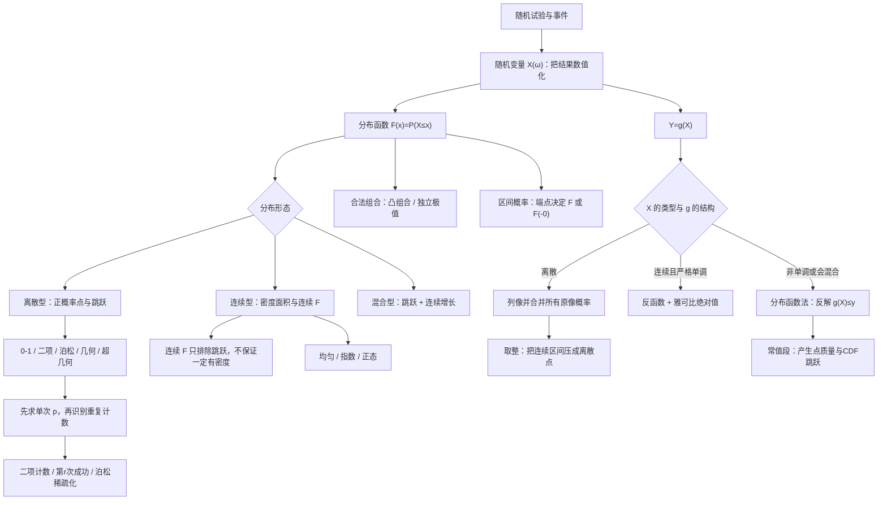

# 概率第2讲 一维随机变量及其分布

源：`27张宇基础30讲概率.pdf`，印刷页 33-61 / PDF p39-p67。

补充源：`26余丙森《概率论与数理统计》辅导讲义.pdf`，基础篇第2章印刷页 14-28 / PDF p19-p33，强化篇第2章印刷页 86-95 / PDF p91-p100。

整理方式：张宇本讲29页与余丙森相关25页均已逐页OCR；已阅读张宇8张全页联系图和29张高清原页，以及余丙森1张整章联系图、13组高清原页阅读图。两书公式、图表、张宇例2.1-2.18与练习2.1-2.18、余丙森基础篇21题与强化篇16题均以原页复核结果为准。

## 本讲速览

- **本讲主线**：随机事件经随机变量数值化，全部一维分布再统一到 $F_X(x)=P(X\le x)$；离散型用概率求和，连续型用密度积分，函数分布先把 $\{g(X)\le y\}$ 反解成 $X$ 的取值范围。
- **分布函数是总入口**：它既能描述离散型、连续型，也能描述混合型。端点题必须区分 $F(a)$ 与左极限 $F(a-0)$。
- **常见分布先识别机制**：独立重复计数是二项，稀有计数是泊松，首次成功是几何，不放回计数是超几何；区间等可能是均匀，等待时间是指数，对称钟形是正态。
- **函数分布先判类型**：离散型列像并合并原像概率；连续型单调变换可用反函数公式，非单调、多分支或可能产生点质量时优先用分布函数法。
- **题目常把两步模型叠加**：先由密度求单次事件概率，再把重复次数化成二项；泊松总数经独立保留后仍为泊松，参数变为 $\lambda p$。
- **检查顺序**：取值范围 → 分布合法性 → 端点开闭 → 参数条件 → 模型条件 → 变换是否一一对应 → 最终概率是否在 $[0,1]$ 或密度积分是否为1。

## 教材路线

### 张宇基础30讲

| 教材顺序 | 印刷页 / PDF页 | 本讲任务 |
|---|---|---|
| 基础知识结构 | 33 / p39 | 建立“随机变量 → 分布函数 → 离散/连续分布 → 函数分布”的总图 |
| 一、随机变量 | 34 / p40 | 理解随机变量是定义在样本空间上的实值函数 |
| 二、分布函数 | 34-35 / p40-p41 | 定义、充要条件、左极限和各种区间概率 |
| 三、一维随机变量的分布：离散型与连续型 | 36-40 / p42-p46 | 分布律、概率密度、由 $F$ 与 $f$ 互求、混合型雏形 |
| 三、常见离散型分布 | 40-41 / p46-p47 | 0-1、二项、泊松、几何、超几何及近似关系 |
| 三、常见连续型分布 | 41-46 / p47-p52 | 均匀、指数、正态、分位数及模型识别 |
| 三、混合型分布 | 46-47 / p52-p53 | 点质量与连续部分共同构造分布函数 |
| 四、一维随机变量函数的分布 | 47-51 / p53-p57 | 离散映射、分布函数法、单调公式法、多分支变换 |
| 五、综合题举例 | 51-52 / p57-p58 | 免赔额、条件二项、全概率与泊松稀疏化 |
| 基础习题精练 | 53-54 / p59-p60 | 用练习2.1-2.18反查全部定义、模型与变换方法 |
| 答案与解析 | 55-61 / p61-p67 | 核对端点、参数、支撑、条件概率和雅可比 |

### 余丙森辅导讲义

| 讲义部分 | 印刷页 / PDF页 | 融合内容 |
|---|---:|---|
| 基础篇第2章 | 14-28 / p19-p33 | 考试要求、随机变量与CDF、离散/连续分布、常见分布、函数分布及例2.1-2.21 |
| 强化篇第2章 | 86-95 / p91-p100 | 8组重要结论、参数归一化、概率比较、分层模型、取整与混合变换及例2.1-2.16 |

## 前置知识与关联导航

- 随机事件、条件概率、全概率和独立重复试验：[[25_概率第1讲_随机事件与概率|概率第1讲]]。
- 积分、变限积分和分段函数：[[08_高数第8讲_一元函数积分学的概念与性质|积分概念与性质]]。
- 由 $F'=f$ 及 $F'=F$ 反求函数：[[15_高数第15讲_微分方程|微分方程]]。
- 一维分布将在[[27_概率第3讲_多维随机变量及其分布|概率第3讲]]扩展为联合、边缘、条件分布和随机变量独立性。
- 常见分布的期望与方差见[[28_概率第4讲_随机变量的数字特征#7. 常见分布的期望与方差|常见分布数字特征]]。
- 正态分布的大样本来源见[[29_概率第5讲_大数定律与中心极限定理#6. 独立同分布中心极限定理|中心极限定理]]。

> [!note] 统一记号
> $X$ 为随机变量，$F_X(x)=P(X\le x)$ 为分布函数，$f_X(x)$ 为连续型随机变量的概率密度；$F(a-0)=\lim_{x\to a^-}F(x)$。$B(n,p)$、$P(\lambda)$、$G(p)$、$H(n,N,M)$、$U(a,b)$、$E(\lambda)$、$N(\mu,\sigma^2)$ 分别表示二项、泊松、几何、超几何、均匀、指数和正态分布。

## 知识网络

## 知识点清单

## 一、随机变量与分布函数

### 1. 随机变量与分布函数

#### 1.1 随机变量：把随机结果映射为实数

设随机试验的样本空间为 $\Omega$。若对每个样本点 $\omega\in\Omega$，都有唯一实数 $X(\omega)$ 与之对应，并且对任意实数 $x$，集合

$$
\{\omega:X(\omega)\le x\}
$$

都是随机事件，则称 $X=X(\omega)$ 为随机变量。

- **本质**：随机变量是定义在样本空间上的实值单值函数，不是“会随机变化的普通未知数”。
- **与普通函数的区别**：普通函数的自变量通常是实数；随机变量的自变量是样本点，样本点可以是号码、路径、产品状态等。
- **事件与随机变量的关系**：事件是一次静态判断，如“出现正面”；随机变量把许多事件统一写成 $\{X\le x\}$、$\{X\in B\}$ 等数值条件。

> [!tip] 看到什么想到它
> 题目给“次数、寿命、长度、最大值、赔付额”等随机量时，先写清它由哪个基本结果决定及可能取值。取值范围错了，后面的分布律、密度和变换支撑都会错。

#### 1.2 分布函数的定义与直观

随机变量 $X$ 的分布函数为

$$
F_X(x)=P(X\le x),\qquad -\infty<x<+\infty.
$$

当阈值 $x$ 从左向右移动时，$F_X(x)$累计“落在阈值左侧”的全部概率，因此它天然单调不减。

#### 1.3 分布函数的充要条件

实函数 $F(x)$ 是某个随机变量的分布函数，当且仅当：

1. **单调不减**：$x_1<x_2\Rightarrow F(x_1)\le F(x_2)$；
2. **右连续**：$F(x+0)=F(x)$；
3. **两端规范**：

$$
\lim_{x\to-\infty}F(x)=0,\qquad
\lim_{x\to+\infty}F(x)=1.
$$

由此自动得到 $0\le F(x)\le1$。

> [!warning] 右连续决定分段写法
> 阶梯型分布函数通常写成“左闭右开”区间，如 $a\le x<b$。在跳点 $a$ 处，函数值取跳跃后的高度。

#### 1.4 教材例2.1与例2.2：如何判断含参数或组合后的函数

- **含参数分段函数**：先用 $F(+\infty)=1$ 定总高度，再用右连续和边界值定其余参数，最后检查单调性。
- **组合函数**：不要凭“长得像概率”判断，逐条检查充要条件。
- 若 $F_1,F_2$ 都是分布函数，$a_1,a_2\ge0$ 且 $a_1+a_2=1$，则凸组合 $a_1F_1+a_2F_2$ 仍是分布函数；同理，若 $f_1,f_2$ 为密度，则 $a_1f_1+a_2f_2$ 仍为密度。
- $F_1F_2$ 与 $1-(1-F_1)(1-F_2)$ 均为分布函数。若另取相互独立且CDF分别为 $F_1,F_2$ 的 $X_1,X_2$，它们分别是

$$
F_{\max(X_1,X_2)}(x)=F_1(x)F_2(x),
$$

$$
F_{\min(X_1,X_2)}(x)=1-[1-F_1(x)][1-F_2(x)].
$$

- $F_1+F_2$ 在 $+\infty$ 趋于2；$F_1-F_2$ 即使处处非负，也不自动满足单调、右连续和两端规范。
- 对密度而言，$f_1+f_2$ 的总积分为2，$f_1f_2$ 一般也不归一；“非负”只是密度的一个条件。若 $f$ 为密度，则平移反射 $f(c-x)$ 仍为密度，因为换元后非负且总积分仍为1。
- $\sqrt{f_1f_2}$ 也通常不是密度：由算术-几何平均不等式，其积分不超过1；只有在 $f_1=f_2$ 几乎处处成立时才取等号。

教材例2.1最终得到 $a=1,b=-1$，

$$
F(x)=
\begin{cases}
0,&x\le0,\\
1-e^{-x},&x>0,
\end{cases}
\qquad
P(|X|<2)=1-e^{-2}.
$$

> [!tip] 看到什么想到它
> 判断“能否作为分布函数”时，优先算 $F(-\infty)$、$F(+\infty)$，常可一眼排除；端点通过后再查单调与右连续。

### 2. 分布函数求概率

#### 2.1 单点、尾部和区间的完整公式

| 事件 | 用分布函数表示 |
|---|---|
| $X\le a$ | $F(a)$ |
| $X<a$ | $F(a-0)$ |
| $X=a$ | $F(a)-F(a-0)$ |
| $X>a$ | $1-F(a)$ |
| $X\ge a$ | $1-F(a-0)$ |
| $a<X<b$ | $F(b-0)-F(a)$ |
| $a\le X<b$ | $F(b-0)-F(a-0)$ |
| $a<X\le b$ | $F(b)-F(a)$ |
| $a\le X\le b$ | $F(b)-F(a-0)$ |

统一理解：

- 右端包含 $b$，使用 $F(b)$；右端不含 $b$，使用 $F(b-0)$。
- 左端不包含 $a$，减去 $F(a)$；左端包含 $a$，只减去 $F(a-0)$。

#### 2.2 四步端点法

1. 把事件写成标准区间；
2. 看右端是否包含，选 $F(b)$ 或 $F(b-0)$；
3. 看左端是否包含，选减 $F(a-0)$ 或减 $F(a)$；
4. 若 $F$ 在端点连续，再把左右极限化成函数值。

> [!warning] 连续型结论不能偷渡到一般随机变量
> 只有连续型随机变量才可随意改变有限个端点。一般分布可能在端点有跳跃，练习2.4中 $P(0\le X\le1)\ne P(0<X<1)$ 正是考这个差别。

## 二、离散型随机变量及常见离散分布

### 3. 离散型随机变量

#### 3.1 分布律及合法性

若 $X$ 只取有限个或可列个值 $x_1,x_2,\ldots$，则称 $X$ 为离散型随机变量。记

$$
P(X=x_i)=p_i,\qquad i=1,2,\ldots
$$

为 $X$ 的分布律。必须满足

$$
p_i\ge0,\qquad \sum_i p_i=1.
$$

分布函数为

$$
F_X(x)=\sum_{x_i\le x}p_i,
$$

所以它是右连续阶梯函数；在正概率点 $x_i$ 的跳跃高度为

$$
P(X=x_i)=F_X(x_i)-F_X(x_i-0).
$$

对任意集合 $B$，

$$
P(X\in B)=\sum_{x_i\in B}p_i.
$$

#### 3.2 从分布函数反读分布律

1. 找全部跳点，这些点就是正概率点；
2. 每个点的概率等于该处跳幅；
3. 所有跳幅之和应为1。

教材练习2.5还说明：遇到“随机系数方程有实根”，先把判别式条件化成关于 $X$ 的事件，再用跳点概率求和。例如 $t^2+Xt+1=0$ 有实根等价于 $X^2-4\ge0$。

#### 3.3 含参数分布律的筛根顺序

1. 写出每项非负；
2. 用总和为1；
3. 再使用题给事件概率；
4. 代数方程若有多根，用概率非负、参数范围和题意筛根。

教材例2.3中，归一性本身不能唯一确定参数，必须结合 $P(X\ge2)$ 和非负性筛选。

该例最终取 $\theta=1/2$，三点概率依次为 $1/4,1/2,1/4$。这说明“代数方程解出来”还不等于“概率参数合法”。

> [!tip] 看到什么想到它
> “各概率成等差数列”时用中项 $a$ 和公差 $d$ 参数化，再同时保留总和、正性和“互不相等”即 $d\ne0$；不要只求出总和就丢掉参数约束。

### 4. 两点分布

一次试验只有成功/失败两种结果，成功记1、失败记0：

$$
P(X=1)=p,\qquad P(X=0)=1-p,\qquad 0<p<1.
$$

记作 $X\sim B(1,p)$，也称0-1分布。

> [!tip] 看到什么想到它
> 一次“是否发生、是否合格、是否命中”的指示变量。它是二项分布的一个试验单位。

### 5. 二项分布

#### 5.1 模型条件与公式

在 $n$ 次独立重复的伯努利试验中，每次成功概率都为 $p$，令 $X$ 为成功次数，则

$$
X\sim B(n,p),\qquad
P(X=k)=C_n^kp^k(1-p)^{n-k},\quad k=0,1,\ldots,n.
$$

四个条件缺一不可：次数固定、每次只有成败、各次独立、成功概率相同。

高频补集：

$$
P(X\ge1)=1-(1-p)^n.
$$

教材练习2.2的结构是：先由较小试验次数的“至少一次”反求同一个 $p$，再代入新的试验次数。

#### 5.2 先求单次概率，再转二项计数

若一次观测中事件 $A$ 的概率由密度或均匀长度比给出，独立观测 $n$ 次，事件出现次数仍满足

$$
Y\sim B(n,P(A)).
$$

这正是练习2.9、2.10的共同入口。不要把原连续随机变量的密度直接代入二项公式，先算出单次概率 $p$。

#### 5.3 第$r$次成功时停止

若每次独立成功概率为 $p$，$Y$ 表示第$r$次成功出现时的试验次数，则

$$
P(Y=k)=C_{k-1}^{r-1}p^r(1-p)^{k-r},
\qquad k=r,r+1,\ldots
$$

原因：第 $k$ 次必须成功，前 $k-1$ 次恰有 $r-1$ 次成功。教材例2.7取 $r=2$，先由原密度算出 $p=P(X>3)=1/8$，再代入上式。

### 6. 泊松分布

#### 6.1 定义与模型识别

若

$$
P(X=k)=\frac{\lambda^k}{k!}e^{-\lambda},
\qquad k=0,1,2,\ldots,\quad \lambda>0,
$$

则 $X\sim P(\lambda)$。

常见题面：单位时间、单位长度或单位面积内，稀疏且近似独立发生的到达数、事故数、故障数。

$$
P(X=0)=e^{-\lambda},\qquad
P(X\ge1)=1-e^{-\lambda}.
$$

相邻点概率之比为

$$
\frac{P(X=k+1)}{P(X=k)}=\frac{\lambda}{k+1}.
$$

看到“两个相邻取值概率相等”，可立即得到 $\lambda=k+1$；比把两项完整展开更短。

教材例2.6先由“至少一辆”反求 $\lambda$，再算“最多一辆”

$$
P(X\le1)=P(X=0)+P(X=1)=e^{-\lambda}(1+\lambda).
$$

#### 6.2 二项分布的泊松近似

当 $n$ 大、$p$ 小且 $\lambda=np$ 保持适中时，

$$
C_n^kp^k(1-p)^{n-k}
\approx \frac{\lambda^k}{k!}e^{-\lambda}.
$$

精确的极限定理表述为：令 $p_n=\lambda/n$，对任意固定的非负整数 $k$，

$$
\lim_{n\to\infty}C_n^kp_n^k(1-p_n)^{n-k}
=\frac{\lambda^k}{k!}e^{-\lambda}.
$$

教材给出的经验范围是 $n\ge20,\ p\le0.05$；尤其 $n\ge100,\ np\le10$ 时常用。考试若明确要求“泊松近似”，先令 $\lambda=np$，并保持事件方向与尾部范围不变。

> [!note] 讲义考纲口径
> 余丙森讲义标注泊松定理为“数学一了解、数学三掌握”。这是该讲义的适用范围标记；实际备考仍以报考年份考试大纲为准，但定理条件和近似入口两类考生都应会识别。

#### 6.3 泊松稀疏化

若总数 $N\sim P(\lambda)$，每个对象相互独立地以概率 $p$ 被保留，且

$$
M\mid N=n\sim B(n,p),
$$

则

$$
M\sim P(\lambda p).
$$

教材例2.18中 $\lambda=8,\ p=1/4$，故理赔次数 $M\sim P(2)$。证明入口是条件二项分布与全概率求和，而不是直接猜参数。

### 7. 几何分布

独立重复试验中，每次成功概率为 $p$，$X$ 表示首次成功所需试验次数，则

$$
X\sim G(p),\qquad
P(X=k)=(1-p)^{k-1}p,\quad k=1,2,\ldots
$$

题面翻译：前 $k-1$ 次失败，第 $k$ 次首次成功。

尾概率及离散无记忆性：

$$
P(X>m)=(1-p)^m,
$$

$$
P(X>m+n\mid X>m)=P(X>n).
$$

> [!warning] 取值起点
> 本书的几何分布表示“首次成功的试验次数”，所以从1开始。若别的资料把失败次数记为随机变量，公式会从0开始，不能混用。

### 8. 超几何分布

总数 $N$ 个，其中 $M$ 个属于目标类；不放回抽取 $n$ 个，令 $X$ 为抽到目标类的个数，则

$$
X\sim H(n,N,M),
$$

$$
P(X=k)=\frac{C_M^kC_{N-M}^{\,n-k}}{C_N^n}.
$$

可取范围由“目标类和非目标类都够抽”共同决定：

$$
\max(0,n-N+M)\le k\le\min(M,n).
$$

- **超几何**：不放回，抽取之间不独立。
- **二项**：放回或总体足够大而抽取比例很小，可近似认为独立。
- 当 $n\ll N$ 时，可用 $B(n,M/N)$ 近似超几何分布。

## 三、连续型随机变量及常见连续分布

### 9. 连续型随机变量

#### 9.1 概率密度与分布函数

若存在非负函数 $f_X(x)$，使

$$
F_X(x)=\int_{-\infty}^{x}f_X(t)\,dt,
$$

则 $X$ 为连续型随机变量，$f_X$ 为概率密度。密度满足

$$
f_X(x)\ge0,\qquad
\int_{-\infty}^{+\infty}f_X(x)\,dx=1.
$$

由积分表示可知：**连续型随机变量的CDF一定连续**。但反命题不成立；CDF连续只说明没有跳跃点和点质量，并不保证存在普通概率密度，还可能是奇异连续分布。考试中若要由 $F$ 认定连续型，仍需能写成某个非负可积函数的积分。

对可积集合 $B$，

$$
P(X\in B)=\int_B f_X(x)\,dx.
$$

特别地，

$$
P(a<X<b)=P(a\le X\le b)=\int_a^bf_X(x)\,dx,
$$

因为连续型随机变量在任意单点的概率都为0：

$$
P(X=c)=0.
$$

#### 9.2 密度不是点概率

- $f_X(x)$ 是“单位长度上的局部概率强度”，不是 $P(X=x)$。
- 密度值可以大于1，只要非负且总面积为1。
- 在有限个点改变密度值，不改变任何积分概率，因此仍表示同一分布。
- 连续型区间端点的开闭不影响概率，但支撑范围仍必须写清。

#### 9.3 $F$ 与 $f$ 互求

若 $f$ 在 $x$ 处连续，则

$$
F_X'(x)=f_X(x).
$$

由密度求分布函数时必须从 $-\infty$ 累积。分段密度的后一段应写成

$$
F(x)=\text{此前全部面积}+\int_{\text{当前段左端}}^x f(t)\,dt.
$$

不能只积分当前小段。教材例2.5和练习2.14都专门考这个累计量。

反过来，若 $F$ 连续，且除有限个点外可导、导函数连续，则可取

$$
f(x)=F'(x)
$$

作为密度；有限个不可导点上的密度值可任意指定。

教材例2.4在 $x\le0$ 上给出 $f(x)=F(x)$，于是 $F'=F$；结合 $F(0)=1$ 得 $F(x)=e^x$。又因分布函数单调且不超过1，$x>0$ 时只能恒为1。

#### 9.4 混合型随机变量

若一个分布既有若干点概率，又在某些区间有连续密度，它既非纯离散型，也非纯连续型，称为混合型。

教材例2.13中：

$$
P(X=1)=\frac14,\qquad P(X=4)=\frac13,
$$

剩余概率

$$
P(1<X<4)=1-\frac14-\frac13=\frac5{12}
$$

分布在 $(1,4)$ 内条件均匀。因此内部的无条件密度为

$$
\frac5{12}\cdot\frac1{4-1}=\frac5{36},
$$

而分布函数还必须在1和4处分别跳跃 $1/4$ 与 $1/3$。**密度只能描述连续部分，不能代替点质量。**

完整分布函数为

$$
F_X(x)=
\begin{cases}
0,&x<1,\\
\dfrac14+\dfrac{5(x-1)}{36}
=\dfrac19+\dfrac{5x}{36},&1\le x<4,\\
1,&x\ge4.
\end{cases}
$$

#### 9.5 偶密度的对称结论

若 $f(x)$ 为偶函数，则分布关于0对称，且对 $a>0$：

$$
F(-a)=1-F(a),
$$

$$
P(|X|<a)=2F(a)-1,
$$

$$
P(|X|>a)=2[1-F(a)].
$$

同时

$$
F(-a)=\frac12-\int_0^af(x)\,dx.
$$

这些结论依赖连续型和关于0对称；一般分布若在0有点质量，需要重新处理端点。

### 10. 均匀分布

若 $X$ 在区间 $(a,b)$ 上等可能取值，则 $X\sim U(a,b)$，

$$
f_X(x)=
\begin{cases}
\dfrac1{b-a},&a<x<b,\\
0,&\text{其他},
\end{cases}
$$

$$
F_X(x)=
\begin{cases}
0,&x<a,\\
\dfrac{x-a}{b-a},&a\le x<b,\\
1,&x\ge b.
\end{cases}
$$

区间内概率就是长度比：

$$
P(c<X<d)=\frac{\operatorname{len}((c,d)\cap(a,b))}{b-a}.
$$

均匀分布是几何概型的一维模型。写 $U(a,b)$ 或 $U[a,b]$ 不影响连续分布，因为端点概率为0。

教材例2.8的反推技巧：

- $P(X>4)=1/2$ 表明4是支撑区间中点，故 $a+b=8$；
- 另一段概率给出区间总长，联立求 $a,b$；
- 使用长度比前先判断给定端点是否真的落在 $(a,b)$ 内。

### 11. 指数分布

若

$$
f_X(x)=
\begin{cases}
\lambda e^{-\lambda x},&x>0,\\
0,&x\le0,
\end{cases}
\qquad \lambda>0,
$$

则 $X\sim E(\lambda)$，且

$$
F_X(x)=
\begin{cases}
0,&x<0,\\
1-e^{-\lambda x},&x\ge0.
\end{cases}
$$

尾概率最简：

$$
P(X>t)=e^{-\lambda t},\qquad t\ge0.
$$

无记忆性：

$$
P(X>s+t\mid X>s)=P(X>t),\qquad s,t>0.
$$

它描述“已等待 $s$ 时间仍未发生后，还要再等超过 $t$ 时间”的概率与已等待时长无关。教材例2.9的元件寿命题直接使用尾概率；参数 $\lambda$ 是失效率，越大表示等待时间通常越短，其期望 $1/\lambda$ 在[[28_概率第4讲_随机变量的数字特征#7. 常见分布的期望与方差|数字特征]]中系统学习。

> [!warning] 同名参数不等于同一分布
> $X\sim P(\lambda)$ 的 $X$ 是非负整数计数，$Y\sim E(\lambda)$ 的 $Y$ 是非负连续等待时间。题目若让二者共用同一个 $\lambda$，应分别用 $P(X=k)=\lambda^ke^{-\lambda}/k!$ 与 $P(Y>t)=e^{-\lambda t}$，不能混写分布公式。

### 12. 正态分布

#### 12.1 定义、参数与图像

若

$$
f_X(x)=\frac1{\sqrt{2\pi}\sigma}
\exp\left[-\frac{(x-\mu)^2}{2\sigma^2}\right],
\qquad -\infty<x<+\infty,\quad \sigma>0,
$$

则 $X\sim N(\mu,\sigma^2)$。

- 图像关于 $x=\mu$ 对称；
- 在 $x=\mu$ 处唯一取最大值 $1/(\sqrt{2\pi}\sigma)$；
- $\mu$ 控制中心位置，$\sigma$ 控制横向离散程度：$\sigma$ 越大，曲线越矮、越宽。

正态密度归一化同时给出高数中常用的高斯积分：

$$
\int_{-\infty}^{+\infty}e^{-x^2}\,dx=\sqrt\pi,
\qquad
\int_0^{+\infty}e^{-x^2}\,dx=\frac{\sqrt\pi}{2}.
$$

看到 $Ce^{-x^2+2bx+c}$ 一类密度核，先完全平方，再平移成高斯积分求 $C$。

#### 12.2 标准正态与标准化

标准正态变量 $Z\sim N(0,1)$ 的密度和分布函数记为

$$
\varphi(z)=\frac1{\sqrt{2\pi}}e^{-z^2/2},
\qquad
\Phi(z)=\int_{-\infty}^{z}\varphi(t)\,dt.
$$

对称性：

$$
\Phi(0)=\frac12,\qquad
\Phi(-z)=1-\Phi(z).
$$

若 $X\sim N(\mu,\sigma^2)$，则

$$
Z=\frac{X-\mu}{\sigma}\sim N(0,1),
$$

$$
F_X(x)=\Phi\left(\frac{x-\mu}{\sigma}\right),
$$

$$
P(a<X<b)=
\Phi\left(\frac{b-\mu}{\sigma}\right)
-\Phi\left(\frac{a-\mu}{\sigma}\right).
$$

线性变换：

$$
aX+b\sim N(a\mu+b,a^2\sigma^2),\qquad a\ne0.
$$

#### 12.3 对称面积与固定中心区间

围绕均值对称：

$$
F_X(\mu-x)+F_X(\mu+x)=1.
$$

$$
P(|X-\mu|<c)=2\Phi\left(\frac c\sigma\right)-1.
$$

因此在 $c$ 固定时，$\sigma$ 越大，$c/\sigma$ 越小，中心区间概率单调减小。教材例2.10、2.11和练习2.3都要求先标准化或直接利用对称面积。

比较多个正态区间概率时，先各自标准化，再比较标准正态曲线下的面积。除 $\Phi$ 单调增加外，还可使用

$$
\Phi'(x)=\varphi(x)>0,
\qquad
\Phi''(x)=-x\varphi(x)<0\quad(x>0),
$$

即 $\Phi$ 在正半轴上为凹函数。强化选择题若端点不便直接排序，可画标准正态面积，或用凹性比较相邻区间增量。

#### 12.4 上侧 $\alpha$ 分位数

若 $Z\sim N(0,1)$ 且

$$
P(Z>u_\alpha)=\alpha,
$$

则 $u_\alpha$ 为标准正态的上侧 $\alpha$ 分位数。由对称性，

$$
u_\alpha=-u_{1-\alpha}.
$$

若

$$
P(|Z|<x)=\alpha,
$$

则两侧尾概率各为 $(1-\alpha)/2$，故

$$
x=u_{\frac{1-\alpha}{2}}.
$$

> [!tip] 看到什么想到它
> “中心概率”先算两尾总概率，再均分；“上侧分位数”的下标表示右尾面积，不是左侧累计面积。

#### 12.5 代数条件与正态对称性的联动

随机系数方程题先做代数翻译。例如 $y^2+4y+X=0$ 无实根等价于

$$
16-4X<0\iff X>4.
$$

若该事件概率为 $1/2$ 且 $X$ 正态，则4就是正态分布的中位数，也就是均值 $\mu$。先翻译事件，再使用分布性质。

## 四、一维随机变量函数的分布

### 13. 离散型函数分布

设 $Y=g(X)$，若 $X$ 为离散型，则 $Y$ 仍为离散型。对每个可能值 $y$，

$$
P(Y=y)=\sum_{x_i:g(x_i)=y}P(X=x_i).
$$

标准步骤：

1. 列出 $X$ 的全部正概率点；
2. 计算每个 $g(x_i)$；
3. 合并相同的函数值；
4. 将对应原像概率相加并检查总和为1。

教材例2.14与练习2.12都用平方或二次映射说明：不同 $x_i$ 可能得到同一个 $Y$ 值，这些原像不能作为不同的 $Y$ 取值保留，概率必须合并。

#### 13.1 连续变量取整会变成离散变量

若 $Y=\lfloor X\rfloor$，则

$$
\{Y=k\}=\{k\le X<k+1\},
$$

所以即使 $X$ 连续，$Y$ 也只取整数。特别地，若 $X\sim E(1)$，则

$$
P(Y=k)=\int_k^{k+1}e^{-x}\,dx
=e^{-k}(1-e^{-1}),\qquad k=0,1,2,\ldots
$$

看到取整、分档、评级、按区间收费，先写“某一档对应的原变量区间”，再对该区间求概率。

> [!warning] 同分布不等于相等
> $X,Y$ 同分布只表示各自的分布函数相同，不表示 $X=Y$，更不自动表示二者独立；反之若 $X=Y$ 几乎处处成立，则它们必同分布。

### 14. 连续型函数分布：分布函数法

#### 14.1 通用定义法

对任意 $Y=g(X)$，先写

$$
F_Y(y)=P(Y\le y)=P(g(X)\le y)
=\int_{\{x:g(x)\le y\}}f_X(x)\,dx.
$$

若 $F_Y$ 连续且除有限点外可导，则

$$
f_Y(y)=F_Y'(y).
$$

通用流程：

1. 先由 $X$ 的支撑和值域确定 $Y$ 的可能范围；
2. 按 $y$ 的临界值分段；
3. 画 $u=g(x)$ 与水平线 $u=y$，找出满足 $g(x)\le y$ 的全部 $x$ 区间；
4. 对这些区间积分；
5. 再求导，并检查密度积分为1。

分布函数法最可靠，尤其适合：

- $g$ 非单调，如 $X^2$、$|X|$、$\min$、$\max$；
- 原密度分段，不同 $y$ 区间的有效反解数不同；
- $g$ 有常值段，变换后可能出现点质量；
- 只要求 $F_Y$ 而不要求密度。

#### 14.2 多对一变换的核心

若 $Y=X^2$，则

$$
\{Y\le y\}=\{-\sqrt y\le X\le\sqrt y\},
\qquad y\ge0,
$$

但必须再与 $X$ 的支撑求交。教材例2.17中，当 $0<y<1$ 时正负两支都有效；当 $1<y<4$ 时负支已全部被收入，只剩正支继续增长，所以密度必须分段。

该例的结果为

$$
f_Y(y)=
\begin{cases}
\dfrac{3}{8\sqrt y},&0<y<1,\\
\dfrac{1}{8\sqrt y},&1<y<4,\\
0,&\text{其他}.
\end{cases}
$$

若 $Y=|X|$，对 $y>0$，

$$
f_Y(y)=f_X(y)+f_X(-y),
$$

前提是相应原像落在 $X$ 的支撑中；练习2.18正是按有效原像个数分段。

#### 14.3 概率积分变换

若 $F_X$ 连续，则概率积分变换成立：

$$
Y=F_X(X)\sim U(0,1).
$$

当 $F_X$ 严格单调时，可直接用普通反函数证明：

$$
P(F_X(X)\le y)
=P(X\le F_X^{-1}(y))
=y,\qquad 0\le y<1.
$$

一般连续但含平坦区间时，改用广义逆函数仍可得到同一结论；因此“严格增加”是方便直接反解的充分条件，**CDF连续才是结论成立的关键条件**。若 $F_X$ 有跳跃，$F_X(X)$ 通常不再服从 $U(0,1)$。

#### 14.4 变换产生混合型分布

连续型 $X$ 经函数变换后不一定仍是纯连续型。如果 $g$ 把一段具有正概率的 $X$ 区间压成同一个常数，则 $Y$ 在该常数处产生点质量。

保险免赔额

$$
Y=
\begin{cases}
0,&X\le100,\\
X-100,&X>100
\end{cases}
$$

中，$P(Y=0)=P(X\le100)>0$，而 $y>0$ 部分仍连续，所以 $Y$ 为混合型。

更一般地，$g$ 的每个常值区间只要承载正概率，就会在对应函数值处制造一个CDF跳跃；跳跃大小就是该原像区间的概率。强化题中即使 $X$ 连续，分段常值与恒等映射也能使 $Y$ 成为纯离散型、纯连续型或混合型。

若题目另问 $P(X\le Y)$，不能只看 $Y$ 的边缘分布。应把 $Y=g(X)$ 代回，直接在 $x$ 轴上解

$$
x\le g(x),
$$

再对满足条件的原变量区域积分。

### 15. 连续型函数分布：单调换元

#### 15.1 严格单调公式

设 $X$ 的支撑为 $(a,b)$，$y=g(x)$ 在该区间严格单调可导，反函数为 $x=h(y)$。则

$$
f_Y(y)=f_X(h(y))|h'(y)|,
\qquad \alpha<y<\beta,
$$

其中

$$
\alpha=\min\{g(a+),g(b-)\},\qquad
\beta=\max\{g(a+),g(b-)\}.
$$

区间外 $f_Y(y)=0$。

- 严格增加时，$\{g(X)\le y\}=\{X\le h(y)\}$；
- 严格减少时，不等号反向，$\{g(X)\le y\}=\{X\ge h(y)\}$；
- 绝对值 $|h'(y)|$ 同时覆盖两种情况。

#### 15.2 多分支公式

若对固定 $y$，方程 $g(x)=y$ 在支撑内有有限个单调分支反解 $x=h_i(y)$，则

$$
f_Y(y)=\sum_i f_X(h_i(y))|h_i'(y)|,
$$

只累加真正落在 $X$ 支撑内的分支。它是 $Y=X^2$、$Y=|X|$ 等题的公式化版本；支撑复杂时，先用[[#14. 连续型函数分布：分布函数法|分布函数法]]更稳。

#### 15.3 线性变换

若 $Y=aX+b,\ a\ne0$，则

$$
f_Y(y)=\frac1{|a|}
f_X\left(\frac{y-b}{a}\right).
$$

不要漏掉 $1/|a|$，也要把 $X$ 的支撑同时映射为 $Y$ 的支撑。

#### 15.4 教材例2.16、练习2.16-2.18的方法迁移

- 随机截取 $(0,2)$：先令原始点 $V\sim U(0,2)$，短段 $X=\min(V,2-V)$；用补事件求得 $X\sim U(0,1)$。再由 $Z=(2-X)/X=2/X-1$ 严格递减，反解 $x=2/(1+z)$。
- $Y=1-\sqrt[3]X$：函数严格递减，反解时不等号方向会改变；公式法中由绝对值统一处理。
- $Y=e^X$：值域先定为 $(0,\infty)$，反函数 $x=\ln y$，雅可比为 $1/y$。
- $Y=|X|$：不是一一映射，必须累加 $\pm y$ 两个有效原像。

随机截线段例最终得到

$$
f_Z(z)=
\begin{cases}
\dfrac{2}{(1+z)^2},&z>1,\\
0,&\text{其他}.
\end{cases}
$$

## 五、综合题方法

### 1. “先连续，后离散”的两层模型

题目先给一次观测的密度，再问多次观测中的出现次数：

1. 先由积分求 $p=P(X\in A)$；
2. 再根据试验机制识别二项、几何或第$r$次成功停止；
3. 写清计数随机变量的取值范围。

例2.7、练习2.9和2.10都属于这一结构。

### 2. 条件分布加全概率

若已知

$$
N\sim P(\lambda),\qquad M\mid N=n\sim B(n,p),
$$

则从

$$
P(M=m)=\sum_{n=m}^{\infty}P(M=m\mid N=n)P(N=n)
$$

出发可推出 $M\sim P(\lambda p)$。这个结构也预告了下一讲的[[27_概率第3讲_多维随机变量及其分布#4. 二维离散型条件分布|条件分布]]。

### 3. 同分布、独立与相等必须分开

- 同分布：$F_X=F_Y$，只说明边缘概率相同；
- 独立：联合事件概率可乘；
- 相等：$X=Y$ 是最强的逐结果关系。

练习2.11先由同分布得到 $P(X>a)=P(Y>a)$，再由题设事件独立写交概率乘积，二者缺一不可。

### 4. 赔付额题先识别点质量

有免赔额时：

1. $Y>0$ 等价于损失超过免赔额；
2. $Y=0$ 往往有正概率，故赔付额是混合型；
3. 若题目跨到期望，再按函数期望积分，见[[28_概率第4讲_随机变量的数字特征#2. 连续型数学期望|连续型函数期望]]；
4. 年度事件总数为泊松且每次独立理赔时，用泊松稀疏化。

教材例2.18中

$$
P(Y>0)=\frac14,\qquad E(Y)=50,\qquad M\sim P(2).
$$

### 5. 分布参数归一化的三种短路

1. **离散无穷和**：看到 $A c^k/k!$，联想 $\sum_{k=0}^{\infty}c^k/k!=e^c$，由概率和为1求 $A$。
2. **偶函数密度**：$f(x)=f(-x)$ 时先把全轴积分化为 $2\int_0^{\infty}f(x)dx$，并可立即得左右半轴概率各为 $1/2$。
3. **二次指数核**：看到 $Ce^{-x^2+2bx+c}$，先完全平方，把积分化为平移、伸缩后的高斯积分。

归一化只确定“总质量为1”；含参分布还要继续检查非负性、支撑和题给概率条件。

### 6. 正态分层后的全概率与贝叶斯

题目把正态变量按若干区间分层，并给每层的故障率、命中率或条件概率时：

1. 先标准化，求各层先验概率 $P(A_i)$；
2. 令结果事件为 $B$，用全概率公式求

$$
P(B)=\sum_iP(A_i)P(B\mid A_i);
$$

3. 若观察到结果后反推所属层，再用

$$
P(A_j\mid B)=\frac{P(A_j)P(B\mid A_j)}{P(B)}.
$$

同一棵分层树完成“正向汇总”和“反向更新”；不要把各层条件概率直接相加。

## 公式与二级结论索引

| 结论 | 条件与公式 | 详细讲解 |
|---|---|---|
| 分布函数充要条件 | 单调不减、右连续、两端极限0和1 | [[#1. 随机变量与分布函数\|分布函数]] |
| CDF凸组合 | $a_i\ge0,\sum a_i=1\Rightarrow\sum a_iF_i$仍为CDF | [[#1. 随机变量与分布函数\|组合函数]] |
| 独立极值CDF | $F_{\max}=F_1F_2$；$F_{\min}=1-(1-F_1)(1-F_2)$ | [[#1. 随机变量与分布函数\|组合函数]] |
| 点概率 | $P(X=a)=F(a)-F(a-0)$ | [[#2. 分布函数求概率\|端点公式]] |
| 离散跳幅 | $p_i=F(x_i)-F(x_i-0)$ | [[#3. 离散型随机变量\|离散型]] |
| 二项分布 | $C_n^kp^k(1-p)^{n-k}$，独立同概率重复试验 | [[#5. 二项分布\|二项]] |
| 第$r$次成功 | $C_{k-1}^{r-1}p^r(1-p)^{k-r}$，$k\ge r$ | [[#5. 二项分布\|停止时刻]] |
| 泊松分布 | $\lambda^ke^{-\lambda}/k!$ | [[#6. 泊松分布\|泊松]] |
| 泊松相邻比 | $P(X=k+1)/P(X=k)=\lambda/(k+1)$ | [[#6. 泊松分布\|泊松]] |
| 泊松近似 | $n$大、$p$小，$\lambda=np$ | [[#6. 泊松分布\|泊松近似]] |
| 泊松稀疏化 | $N\sim P(\lambda),M\mid N\sim B(N,p)\Rightarrow M\sim P(\lambda p)$ | [[#6. 泊松分布\|泊松稀疏化]] |
| 几何分布 | $(1-p)^{k-1}p$，首次成功次数 | [[#7. 几何分布\|几何]] |
| 超几何分布 | $C_M^kC_{N-M}^{n-k}/C_N^n$，不放回 | [[#8. 超几何分布\|超几何]] |
| 密度与分布函数 | $F(x)=\int_{-\infty}^xf(t)dt$，连续处 $F'=f$ | [[#9. 连续型随机变量\|连续型]] |
| 连续CDF边界 | 连续型必有连续CDF；连续CDF不保证一定存在密度 | [[#9. 连续型随机变量\|连续型]] |
| 偶密度对称 | $F(-a)=1-F(a)$，连续且关于0对称 | [[#9. 连续型随机变量\|偶密度]] |
| 均匀分布 | 区间概率等于交集长度除以总长 | [[#10. 均匀分布\|均匀]] |
| 指数尾概率 | $P(X>t)=e^{-\lambda t}$ | [[#11. 指数分布\|指数]] |
| 指数无记忆性 | $P(X>s+t\mid X>s)=P(X>t)$ | [[#11. 指数分布\|无记忆性]] |
| 正态标准化 | $(X-\mu)/\sigma\sim N(0,1)$ | [[#12. 正态分布\|正态]] |
| 中心正态概率 | $P(\lvert X-\mu\rvert<c)=2\Phi(c/\sigma)-1$ | [[#12. 正态分布\|对称面积]] |
| 标准正态CDF曲率 | $\Phi'=\varphi>0$；$x>0$时$\Phi''=-x\varphi<0$ | [[#12. 正态分布\|概率比较]] |
| 高斯积分 | $\int_0^\infty e^{-x^2}dx=\sqrt\pi/2$ | [[#12. 正态分布\|正态归一化]] |
| 离散函数分布 | 对同一像值累加全部原像概率 | [[#13. 离散型函数分布\|离散变换]] |
| 取整变换 | $P(\lfloor X\rfloor=k)=P(k\le X<k+1)$ | [[#13. 离散型函数分布\|取整变换]] |
| 分布函数法 | $F_Y(y)=P(g(X)\le y)$ | [[#14. 连续型函数分布：分布函数法\|定义法]] |
| 单调换元 | $f_Y(y)=f_X(h(y))\lvert h'(y)\rvert$ | [[#15. 连续型函数分布：单调换元\|公式法]] |
| 多分支换元 | $\sum_i f_X(h_i(y))\lvert h_i'(y)\rvert$，仅计有效原像 | [[#15. 连续型函数分布：单调换元\|多分支]] |
| 概率积分变换 | $F_X$连续$\Rightarrow F_X(X)\sim U(0,1)$；严格增加只用于直接反解 | [[#14. 连续型函数分布：分布函数法\|概率积分变换]] |

## 题型—方法决策表

| 题面信号 | 首选入口 | 备选方法 | 最后检查 |
|---|---|---|---|
| 判断某函数是否为分布函数 | 两端极限 → 单调 → 右连续 | 构造随机变量解释 | 值域是否在 $[0,1]$ |
| 判断CDF或密度的组合是否合法 | 凸组合优先；其余逐查充要条件 | 独立最大/最小值解释 | CDF条件与密度条件不要混用 |
| 用 $F$ 求含端点区间概率 | 按开闭选 $F$ 或 $F(-0)$ | 事件拆分 | 是否漏掉跳跃点 |
| 由阶梯 $F$ 求分布律 | 找跳点与跳幅 | 逐区间累计反推 | 跳幅和是否为1 |
| 含参数分布律 | 非负 + 归一 + 题给事件 | 参数范围筛根 | 每项概率是否非负 |
| 单次成败计数 | 二项 $B(n,p)$ | 补集算至少一次 | 独立、同概率是否满足 |
| 单位时间稀有次数 | 泊松 $P(\lambda)$ | 二项泊松近似 | 参数对应的时间尺度 |
| 泊松相邻点概率相等/成比例 | 先写相邻比 $\lambda/(k+1)$ | 展开两项约分 | 下标是否真相邻 |
| 首次/第$r$次成功 | 几何或停止时刻公式 | 逐序列计数 | 最后一次必须成功 |
| 不放回计数 | 超几何 | 抽取比例极小时二项近似 | $k$ 的可取范围 |
| 密度求参数/概率/$F$ | 先归一，再积分 | 利用对称性 | 后段是否加前面积 |
| 无穷分布律或二次指数核求常数 | 指数级数 / 完全平方 | 偶对称化半轴积分 | 归一后仍要查非负与支撑 |
| 分段常数密度给尾面积 | 画密度图并按面积定位端点 | 分段积分 | 尾部平台区间是否漏算 |
| 含点质量又有区间密度 | 直接构造 $F$ | 全概率分解 | 跳幅与连续质量之和为1 |
| 区间等可能 | 长度比 | 分布函数 | 先与支撑求交 |
| 寿命已工作后再工作 | 指数尾概率与无记忆性 | 条件概率定义 | 条件事件方向 |
| 正态区间概率 | 标准化 | 对称面积 | 分母是 $\sigma$ |
| 比较多个正态区间概率 | 全部标准化后比较面积 | $\Phi$单调性与正半轴凹性 | 不能直接比较原区间长度 |
| 正态区间分层且给各层结果率 | 先全概率，观察结果后再贝叶斯 | 画分层树 | 分层须互斥且穷尽 |
| 正态分位数 | 先画左右尾面积 | $\Phi$ 反解 | 下标代表上尾面积 |
| 离散 $Y=g(X)$ | 列像、合并原像 | 直接求 $P(Y=y)$ | 新概率总和为1 |
| $Y=\lfloor X\rfloor$或按区间分档 | 把每个像值还原成原变量区间 | 用CDF端点公式 | 区间开闭与取值起点 |
| $Y=F_X(X)$ | 先检查 $F_X$ 是否连续 | 广义逆/严格单调反解 | 有跳跃时不能套均匀结论 |
| 连续且严格单调变换 | 反函数 + 雅可比 | 分布函数法 | 值域与绝对值 |
| $X^2,\lvert X\rvert,\min,\max$ | 分布函数法 | 多分支密度求和 | 每段有效原像数 |
| 变换有常值段 | 先找点质量，再求连续部分 | 构造完整 $F_Y$ | 不可只写密度 |
| 已知 $Y=g(X)$ 再求 $P(X\le Y)$ | 在$x$轴上直接解$x\le g(x)$ | 分段画函数图 | 不能只靠$Y$的边缘CDF |
| 随机总数 + 条件二项 | 条件概率与全概率 | 泊松稀疏化结论 | 参数变为 $\lambda p$ |

## 教材例题覆盖表

### 张宇基础30讲例题

| 例题 | 教材方法与可迁移结论 |
|---|---|
| 2.1 | 用两端极限、右连续确定分段 $F$ 的参数；严格区间概率用左极限 |
| 2.2 | 判断组合后的 $F$ 或 $f$ 必须分别检查各自充要条件，不能只看非负 |
| 2.3 | 含参数分布律先归一和非负，再用事件概率筛根 |
| 2.4 | $f=F$ 转为 $F'=F$，结合边界和分布函数单调性补全 |
| 2.5 | 分段密度转分布函数时，后一段累加此前面积 |
| 2.6 | 泊松题由“至少一次”反求 $\lambda$，再按题意累加点概率 |
| 2.7 | 先积分求单次成功率，再用“第$r$次成功时停止”结构 |
| 2.8 | 均匀分布用中点和长度比反推支撑端点 |
| 2.9 | 指数寿命用尾概率和无记忆性处理“已工作后再工作” |
| 2.10 | 正态区间围绕均值对称时，可直接搬运面积 |
| 2.11 | 固定中心窗口概率写成 $2\Phi(c/\sigma)-1$ 判断单调性 |
| 2.12 | 中心概率转为两侧等尾，再对应上侧分位数 |
| 2.13 | 混合型分布用点质量 + 条件连续分布构造完整 $F$ |
| 2.14 | 离散平方映射要合并 $\pm x$ 等原像概率 |
| 2.15 | 证明 $F_X(X)\sim U(0,1)$，并明确严格单调的适用范围 |
| 2.16 | 随机截线段先求短段分布，再对长短比做单调换元 |
| 2.17 | 非单调平方映射按 $y$ 分段，逐段确定有效原像 |
| 2.18 | 免赔额产生点质量；条件二项叠加泊松总数得到泊松稀疏化 |

### 余丙森基础篇例题（PDF p20-p33）

| 例题 / 页码 | 考点 | 题面信号 | 首选方法与独有迁移 | 笔记落点 |
|---|---|---|---|---|
| 2.1 / p20-p21 | CDF判定 | 多个候选分段函数 | 两端极限、单调、右连续依次检查；先用硬条件快速排除 | [[#1. 随机变量与分布函数\|CDF条件]] |
| 2.2 / p21 | 含参CDF与端点 | 分段CDF、绝对值事件 | 先由规范性定参数，再按开闭选择函数值或左极限 | [[#2. 分布函数求概率\|端点公式]] |
| 2.3 / p22-p23 | 离散分布律与CDF | 三点取值 | 归一后按跳点累计；跳幅等于该点概率 | [[#3. 离散型随机变量\|离散型]] |
| 2.4 / p23-p24 | 二项分布 | 独立掷骰三次、计指定点数 | 识别 $B(3,1/6)$，列全分布律并核概率和 | [[#5. 二项分布\|二项]] |
| 2.5 / p24 | 泊松参数 | 相邻两点概率相等 | 用 $P_{k+1}/P_k=\lambda/(k+1)$ 直接反求 $\lambda$ | [[#6. 泊松分布\|相邻比]] |
| 2.6 / p24 | 几何分布 | 首次出现指定结果 | 前若干次失败、末次成功；取值从1开始 | [[#7. 几何分布\|几何]] |
| 2.7 / p25 | 泊松近似 | $n$大、$p$小的二项尾部 | 令 $\lambda=np$，保留原事件方向后用补集累计 | [[#6. 泊松分布\|泊松近似]] |
| 2.8 / p26 | 由CDF求密度 | 分段连续CDF | 可导处求导，有限分界点密度值任取 | [[#9. 连续型随机变量\|F与f互求]] |
| 2.9 / p26-p27 | 密度判定 | 对已知密度作函数变换 | 检查非负和归一；换元证明 $f(1-x)$ 仍为密度 | [[#1. 随机变量与分布函数\|组合合法性]] |
| 2.10 / p27 | 连续事件的重复计数 | 先给密度，再独立观察三次 | 先积分求单次概率，再转二项计数 | [[#1. “先连续，后离散”的两层模型\|两层模型]] |
| 2.11 / p27-p28 | 函数事件概率 | $P(X^2\le c)$ | 解成双边区间，与分段支撑求交后积分 | [[#14. 连续型函数分布：分布函数法\|分布函数法]] |
| 2.12 / p28 | 密度转CDF | 分段三角密度 | 先归一，后一段累加此前全部面积 | [[#9. 连续型随机变量\|累计积分]] |
| 2.13 / p28-p29 | 零概率边界 | 由概率关系判断集合关系 | 连续单点构造反例；概率为0不等于事件为空 | [[25_概率第1讲_随机事件与概率#6. 概率的基本性质、加法与减法\|概率与集合边界]] |
| 2.14 / p29 | 均匀分布叠加二项 | 区间等可能、重复观测 | 长度比求单次概率，再累加二项尾部 | [[#10. 均匀分布\|均匀分布]] |
| 2.15 / p30 | 指数尾概率 | 元件寿命超过常数 | 直接使用 $P(X>a)=e^{-\lambda a}$ | [[#11. 指数分布\|指数分布]] |
| 2.16 / p30 | 正态对称 | 关于均值对称的两阈值 | 镜像尾概率互补，无须先解 $\sigma$ | [[#12. 正态分布\|正态对称]] |
| 2.17 / p31 | 正态反参 | 已知尾概率及标准正态数值 | 标准化反求 $\sigma$，再把目标化成中心区间 | [[#12. 正态分布\|正态标准化]] |
| 2.18 / p31 | 离散函数分布 | 平方、截断映射 | 列像并合并相同像值的全部原像概率 | [[#13. 离散型函数分布\|离散变换]] |
| 2.19 / p32 | 线性变换CDF | $Y=2X+1$ | 从 $P(2X+1\le y)$ 反解到 $F_X((y-1)/2)$ | [[#15. 连续型函数分布：单调换元\|线性变换]] |
| 2.20 / p32-p33 | 正态线性变换 | $Y=aX+b$且$a$可正可负 | 分方向推CDF，统一记 $N(a\mu+b,a^2\sigma^2)$ | [[#12. 正态分布\|正态线性变换]] |
| 2.21 / p33 | 非单调变换 | $Y=X^2+1$ | 先定值域，再解双边不等式并求导 | [[#14. 连续型函数分布：分布函数法\|多对一变换]] |

### 余丙森强化篇例题（PDF p92-p100）

| 例题 / 页码 | 考点 | 题面信号 | 首选方法与独有迁移 | 笔记落点 |
|---|---|---|---|---|
| 2.1 / p92 | CDF参数与点质量 | 已给 $P(X=0)$ | 用跳幅定常数，再以右连续定斜率 | [[#1. 随机变量与分布函数\|含参CDF]] |
| 2.2 / p92-p93 | 多分界含参CDF | 两个连接点、多个代数根 | 两端规范与逐点右连续列式，最后用单调和非负筛根 | [[#1. 随机变量与分布函数\|含参CDF]] |
| 2.3 / p93 | CDF/密度组合 | $f_1,f_2,F_1,F_2$混合选项 | 分别检查各自充要条件；$F_1F_2$可解释为独立最大值CDF | [[#1. 随机变量与分布函数\|组合函数]] |
| 2.4 / p93-p94 | 偶密度 | 比较 $F(x),F(-x)$ 与半轴积分 | 换元得 $F(-x)=1-F(x)$，令$x=0$得两半面积各 $1/2$ | [[#9. 连续型随机变量\|偶密度]] |
| 2.5 / p94 | 离散归一化 | $A/(2^kk!)$ | 用指数级数 $\sum(1/2)^k/k!=e^{1/2}$ 求常数 | [[#5. 分布参数归一化的三种短路\|归一化]] |
| 2.6 / p94 | 连续归一化 | $Ce^{-x^2+2x}$ | 完全平方并平移成高斯积分 | [[#5. 分布参数归一化的三种短路\|归一化]] |
| 2.7 / p95 | 密度图与尾概率 | 分段常数密度、$P(X\ge k)$固定 | 把尾概率看作曲线右侧面积，直接读出 $k$ 的区间 | [[#9. 连续型随机变量\|密度面积]] |
| 2.8 / p95 | 双指数形密度 | $Ae^{-\lvert x\rvert}$、尾分位与CDF | 偶对称归一；先定位分位在正半轴，再分段积分 | [[#9. 连续型随机变量\|偶密度与CDF]] |
| 2.9 / p95-p96 | 同名参数跨分布 | $X\sim P(\lambda),Y\sim E(\lambda)$ | 分别用泊松点概率和指数尾概率，同名参数不能混公式 | [[#11. 指数分布\|同名参数警告]] |
| 2.10 / p96 | 均匀反参 | 两个区间概率求支撑 | 半概率先给中点，再由长度比求总长 | [[#10. 均匀分布\|反推端点]] |
| 2.11 / p96-p97 | 正态概率比较 | 不同均值方差、同一原区间 | 各自标准化，按面积、单调性或正半轴凹性比较 | [[#12. 正态分布\|概率比较]] |
| 2.12 / p97-p98 | 正态分层综合 | 各电压区间损坏率不同 | 标准化求层概率，全概率求损坏率，再贝叶斯反推区间 | [[#6. 正态分层后的全概率与贝叶斯\|分层模型]] |
| 2.13 / p98 | 指数取整 | $Y=\lfloor X\rfloor$ | 把 $Y=k$ 还原为 $k\le X<k+1$ 后积分 | [[#13. 离散型函数分布\|取整变换]] |
| 2.14 / p98-p99 | 概率积分变换 | $Y=F_X(X)$ | 先求 $F_X$，再用连续CDF下 $F_X(X)\sim U(0,1)$ | [[#14. 连续型函数分布：分布函数法\|概率积分变换]] |
| 2.15 / p99 | 常值段产生点质量 | 连续$X$经常值/恒等分段映射 | 找被压缩区间的概率；CDF跳点数对应正概率点数 | [[#14. 连续型函数分布：分布函数法\|混合变换]] |
| 2.16 / p99-p100 | 混合变换与联合事件 | 两段常值、一段恒等，另求$P(X\le Y)$ | 分段构造CDF；附加事件回到$x\le g(x)$直接解 | [[#14. 连续型函数分布：分布函数法\|混合变换]] |

## 讲末练习反查

| 练习 | 结果或关键式 | 笔记提供的入口 |
|---|---|---|
| 2.1 | 四个候选都不能作分布函数，选D | 先查两端极限即可逐个否定 |
| 2.2 | $p=1/3$，$P(Y\ge1)=65/81$ | 同一 $p$ 下用两次“至少一次”补集 |
| 2.3 | $\sigma_1<\sigma_2$ | 固定中心窗口概率随 $\sigma$ 增大而减小 |
| 2.4 | $P(0\le X\le1)=1-e^{-1}$，$P(0<X<1)=0$ | 分别使用 $F(1)-F(0-0)$ 与 $F(1-0)-F(0)$ |
| 2.5 | $X=(-1,2,3)$，概率 $(0.4,0.4,0.2)$；其余答案为1、0.6 | 跳点/跳幅与判别式事件 |
| 2.6 | $A=1/2,B=1/\pi$；$f(x)=1/[\pi\sqrt{a^2-x^2}]$；概率 $1/3$ | 支撑两端连续定参数，区间内求导 |
| 2.7 | $A=100$；概率依次 $1/3,1/10,0$；$F(x)=0$ 或 $1-100/x$ | 密度归一、连续单点概率为0、累积积分 |
| 2.8 | $\mu=4$ | 无实根转成 $X>4$，正态半概率点等于均值 |
| 2.9 | $20/27$ | 一次概率 $2/3$，三次计数 $B(3,2/3)$ |
| 2.10 | $9/64$ | 一次事件概率 $1/4$，再用 $B(3,1/4)$ |
| 2.11 | $a=\sqrt[3]4$ | 同分布给等尾概率，事件独立给乘积 |
| 2.12 | $F_Y(y)=0,2/3,1$，分界为1和3 | 先合并产生 $Y=1$ 的两个原像 |
| 2.13 | 概率为 $1/3+d,1/3,1/3-d$，$-1/3<d<1/3,d\ne0$；条件概率 $1/(2-3d)$ | 等差参数化 + 正性约束 + 条件概率 |
| 2.14 | $F(x)=0,x^2/2,2x-x^2/2-1,1$，分界为0、1、2 | 后段加前段累计面积 |
| 2.15 | $F(-a)=1-F(a)$，并得两个双侧概率公式 | 偶密度关于0对称 |
| 2.16 | $k=1/\pi$；$f_Y(y)=\dfrac{3(1-y)^2}{\pi[1+(1-y)^6]}$ | 归一后处理严格递减变换 |
| 2.17 | $F_X(x)=\dfrac{e^x}{1+e^x}$；$f_Y(y)=1/(1+y)^2,\ y>0$ | $y=e^x$，反函数 $\ln y$ 与雅可比 $1/y$ |
| 2.18 | $f_Y(y)=2/3$ 于 $0<y<1$，$1/3$ 于 $1\le y<2$ | $\lvert X\rvert$ 的有效原像密度求和 |

## 易错点/易混点

1. 随机变量是样本点的函数；$x$ 只是分布函数中的阈值。
2. 分布函数右连续，不是左连续；$F(a-0)$ 与 $F(a)$ 的差可能就是点概率。
3. 判断分布函数时，非负且不超过1远远不够，还要单调、右连续和两端极限。
4. $F_1F_2$ 可作分布函数不代表 $f_1f_2$ 可作密度；密度还要归一。
5. 离散分布的正概率点是 $F$ 的跳点，概率是跳幅，不是该处函数值。
6. 参数分布律解出多个代数根时，必须回查每项非负和题设参数范围。
7. 二项要求独立且每次成功率相同；不放回抽样通常是超几何。
8. 几何分布从1开始；“第$r$次成功停止”中的第 $k$ 次必须成功。
9. 泊松近似要用 $\lambda=np$；不能把 $p$ 或 $n$ 单独当泊松参数。
10. 密度可以大于1，但不能为负，总积分必须为1。
11. 连续型的 $P(X=a)=0$ 不表示 $f(a)=0$。
12. 在有限点修改密度不改分布；在有限点修改分布函数却可能改变点概率或破坏右连续。
13. 分段密度求 $F$ 时，后一段必须累加前段面积。
14. 混合型随机变量不能只用一个普通密度描述，必须保留点质量。
15. 均匀长度比之前先与支撑求交；题给端点未必位于支撑内部。
16. 指数分布无记忆性是条件尾概率结论，不是“寿命一定不会老化”的现实断言。
17. 正态分布标准化除以 $\sigma$，而方差参数写作 $\sigma^2$。
18. 上侧 $\alpha$ 分位数的下标是右尾面积，中心面积要先均分两尾。
19. 连续变换公式只对严格单调分支直接成立；$X^2$、$|X|$ 不能只取一个反根。
20. 雅可比必须取绝对值，且变换后的支撑不能遗漏。
21. 连续型经有常值段的函数变换后可能变成混合型。
22. 同分布不等于相等，也不等于独立；题目给了哪种关系就只用哪种关系。
23. 条件二项叠加泊松得到泊松稀疏化，需要每个对象独立地以同一概率保留。
24. 连续型随机变量的CDF必连续，但CDF连续不推出随机变量一定有普通密度；“连续CDF”和“连续型”不是同义词。
25. CDF或密度的凸组合要求系数非负且和为1；普通相加、相减或相乘不能仅凭形式判定合法。
26. 泊松分布与指数分布都可用参数 $\lambda$，但一个描述离散计数，一个描述连续等待时间，公式不可互换。
27. $F_X(X)\sim U(0,1)$ 的关键是 $F_X$ 连续；严格单调只是方便用普通反函数证明。CDF有跳跃时不能硬套。
28. 连续型 $X$ 经取整会变成离散型，经常值段与非恒定段混合映射可能变成混合型；变量类型不会自动保留。
29. 比较正态区间概率前必须分别标准化；原区间更长不代表标准化后的曲线面积更大。
30. 归一化只保证总概率为1，不能替代非负性、支撑、单调性和题给参数条件检查。

## 注解

### 1. 为什么分布函数能统一三类分布

离散型的 $F$ 用跳跃累计概率，连续型的 $F$ 用面积连续增长，混合型则同时具有跳跃和连续增长。三者表面不同，但 $F(x)=P(X\le x)$ 对任何随机变量都成立。

### 2. 为什么连续型单点概率为0而密度仍有意义

单点没有长度，所以积分面积为0；密度刻画的是点附近单位长度内的概率强度。真正的区间概率来自“密度乘小长度”的累积，而不是密度值本身。

### 3. 为什么非单调变换优先画图

$g(X)\le y$ 的几何意义是曲线 $u=g(x)$ 位于水平线 $u=y$ 下方的全部横坐标。画图能直接看出原像有几段、临界值在哪，避免漏掉反根或把无效反根算入。

### 4. 为什么换元公式有雅可比

变换把 $x$ 轴上的一小段 $dx$ 拉伸为 $dy$。为保持同一小段概率，

$$
f_X(x)|dx|=f_Y(y)|dy|,
$$

所以出现 $|dx/dy|$。绝对值只保证长度为正，不能替代支撑判断。

### 5. 为什么泊松稀疏化仍是泊松

先随机产生泊松个对象，再独立保留每一个。条件于总数时是二项抽取；把所有可能总数加总后，指数级数重新组合成泊松概率，平均数量由 $\lambda$ 缩为 $\lambda p$。

### 6. 一维函数分布题的最稳开局

先写三行：

1. $X$ 的支撑；
2. $Y=g(X)$ 的值域；
3. $F_Y(y)=P(g(X)\le y)$。

即使最后改用公式法，这三行也能防止值域、分段点和反根遗漏。

### 7. 为什么连续CDF不一定代表连续型随机变量

CDF连续只排除了跳跃，所以不存在正概率单点；连续型还要求CDF能表示为某个密度的积分，即具有绝对连续性。复习时可记成：**有密度一定连续，连续未必有密度**。

### 8. 为什么 $F_X(X)$ 不要求处处严格单调

若CDF在某区间平坦，该区间本身没有概率质量，因此平坦造成的“多个反像”不会改变 $F_X(X)$ 的分布。严格单调只是让 $F_X^{-1}$ 写法更直接；一般连续CDF用广义逆仍可得到均匀分布。

### 9. 为什么归一化题先识别函数形状

$k!$ 分母提示指数级数，$|x|$ 提示偶对称，二次指数提示完全平方与正态核。先识别结构再积分，既短也能减少常数、根号和指数平移因子遗漏。

## 速背检查

- [ ] 随机变量的定义域是什么？它与普通实函数有何区别？
- [ ] 分布函数的三个充要条件是什么？
- [ ] $P(X<a)$、$P(X\ge a)$ 分别怎样写成 $F$？
- [ ] 为什么阶梯分布函数通常写成左闭右开？
- [ ] 如何从分布函数的跳跃读出离散分布律？
- [ ] 二项、几何、超几何分别对应什么试验机制？
- [ ] 第$r$次成功恰在第$k$次出现，为什么组合数是 $C_{k-1}^{r-1}$？
- [ ] 二项分布何时可用泊松近似，参数取什么？
- [ ] 泊松稀疏化的条件与结论是什么？
- [ ] 密度的两个合法性条件是什么？密度能否大于1？
- [ ] 连续型随机变量为什么可忽略区间端点？
- [ ] 分段密度求 $F$ 时为什么要累加前段面积？
- [ ] 混合型分布为何不能只写普通密度？
- [ ] 均匀分布的区间概率怎样用长度表示？
- [ ] 指数分布的尾概率与无记忆性公式是什么？
- [ ] 正态标准化为何除以 $\sigma$ 而不是 $\sigma^2$？
- [ ] 中心概率 $\alpha$ 对应的上侧分位数下标是什么？
- [ ] 离散函数分布为什么要合并相同像值？
- [ ] 连续函数分布何时可直接用反函数公式？
- [ ] $Y=X^2$ 或 $Y=|X|$ 为什么通常要分段、累加多个原像？
- [ ] 函数有常值段时，变换后的随机变量可能出现什么新成分？
- [ ] 同分布、独立和随机变量相等有什么区别？
- [ ] $F_1,F_2$为CDF时，哪些凸组合和独立极值公式仍是CDF？
- [ ] 为什么“CDF连续”不能直接推出随机变量一定有密度？
- [ ] 泊松分布相邻两点概率之比是什么，如何由此反求 $\lambda$？
- [ ] $\int_0^{\infty}e^{-x^2}dx$ 等于多少，二次指数核怎样化为它？
- [ ] $Y=\lfloor X\rfloor$ 时，事件 $\{Y=k\}$ 怎样还原成 $X$ 的区间？
- [ ] $F_X(X)\sim U(0,1)$ 的关键条件是什么？严格单调起什么作用？
- [ ] 正态区间分层题为什么先用全概率、观察结果后再用贝叶斯？

## OCR/视觉核查

- 张宇范围：`27张宇基础30讲概率.pdf` 印刷页33-61 / PDF p39-p67，共29页；逐页OCR，并阅读8张联系图及全部29张高清原页。
- 余丙森范围：`26余丙森《概率论与数理统计》辅导讲义.pdf` 基础篇印刷页14-28 / PDF p19-p33、强化篇印刷页86-95 / PDF p91-p100，共25页；逐页OCR提取1177个文本块。
- 余丙森视觉复核：已查看1张覆盖全部25页的整章联系图、基础篇8组与强化篇5组高清原页阅读图，并保留25张原页图用于公式、图表和例题放大核对。
- 逐题覆盖：张宇正文例2.1-2.18与练习2.1-2.18保持覆盖；余丙森基础篇例2.1-2.21、强化篇例2.1-2.16均建立“页码—考点—题面信号—首选方法—独有技巧—笔记落点”记录。
- 公式复核重点：CDF开闭端点、凸组合与独立极值、泊松极限及相邻比、密度归一化、高斯积分、正态标准化与凹性、取整、概率积分变换、常值段产生的点质量均以高清原页核对。
- 成稿校对：两书的定义条件、参数范围、积分上下限、分段端点、正态参数、雅可比绝对值和全部例题落点均再次反查，不以OCR模糊字符作为公式依据。
- 历史抽样证据：[[00_OCR视觉核查报告#26 概率 一维随机变量及其分布|本讲OCR/视觉核查记录]]；本轮全页图片和OCR仅作临时复核，不纳入笔记库。

## 相关链接

- [[25_概率第1讲_随机事件与概率|上一讲：随机事件与概率]]
- [[27_概率第3讲_多维随机变量及其分布|下一讲：多维随机变量及其分布]]
- [[28_概率第4讲_随机变量的数字特征#7. 常见分布的期望与方差|常见分布的期望与方差]]
- [[29_概率第5讲_大数定律与中心极限定理#6. 独立同分布中心极限定理|正态近似与中心极限定理]]
- [[00_定理公式方法题型易错真题索引|总方法索引]]
