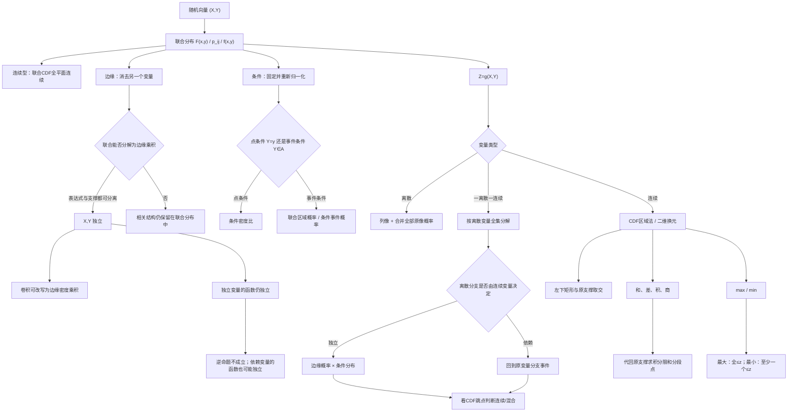

# 概率第3讲 多维随机变量及其分布

源：

- `27张宇基础30讲概率.pdf`，印刷页62-102 / PDF p68-p108。
- `26余丙森《概率论与数理统计》辅导讲义.pdf`，基础篇印刷页29-47 / PDF p34-p52，强化篇印刷页96-113 / PDF p101-p118。

整理方式：张宇本讲41页与余丙森相关37页均已逐页OCR；已阅读张宇11张全页联系图和41张高清原页，以及余丙森8张全页联系图、19组高清双页图。两书定义、公式、图形、张宇例3.1-3.12与练习3.1-3.18、余丙森基础篇17题与强化篇23题均以原页复核结果为准。

## 本讲速览

- **本讲主线**：联合分布描述“同时怎样变化”，由联合向外求边缘、向内求条件，再判断独立；最后把二维变量通过函数映射成新的随机变量。
- **二维题先画支撑区域**：连续型题的归一化、边缘密度、条件密度、区域概率和函数分布，本质都在同一非零区域上切片或换元。
- **联合信息最强，边缘信息不够反推联合**：已知联合一定能求边缘；只有边缘通常不能确定联合，还需要独立性、条件分布或其他约束。
- **独立性是分解条件**：离散型检验每个格子是否为行边缘与列边缘之积；连续型检验联合密度能否在整个支撑上分解为两个边缘密度之积。
- **函数分布先按类型选法**：离散型列像并合并概率；一个离散一个连续时按离散变量全集分解；连续型优先写事件区域，和差积商可用换元所得公式。
- **积分限比公式更重要**：卷积式写出后，必须把原支撑条件代入，求出积分变量范围和关于 \(z\) 的分段点。
- **极值题优先用分布函数**：最大值对应“全部不大于”，最小值对应“至少一个不大于”，独立时再把交事件概率化成乘积。
- **混合型先按分支拆事件**：一个变量离散、另一个连续时用全概率；分支若由原变量决定，不能擅自乘独立概率。最后看CDF是否跳跃，判断结果含不含点质量。

## 教材路线

### 张宇基础30讲

| 教材顺序 | 印刷页 / PDF页 | 本讲任务 |
|---|---|---|
| 基础知识结构 | 62 / p68 | 建立“联合 → 边缘/条件 → 独立 → 函数分布”的总图 |
| 一、\(n\)维随机变量及其分布函数 | 63-65 / p69-p71 | 随机向量、联合分布函数、四条性质、边缘分布函数 |
| 二、二维离散型随机变量 | 65-67 / p71-p73 | 联合分布律、边缘分布律、条件分布律 |
| 二、二维连续型随机变量 | 67-70 / p73-p76 | 联合密度、边缘密度、条件密度、二维均匀与二维正态 |
| 例3.1-例3.4 | 71-74 / p77-p80 | 联合表、事件独立、三角形支撑、由边缘与条件反求联合 |
| 三、随机变量的相互独立性 | 75-78 / p81-p84 | 定义、充要条件、性质、判定与反证，例3.5-例3.6 |
| 四、多维随机变量函数的分布 | 79-83 / p85-p89 | 离散映射、混合型全集分解、CDF法、二维换元、卷积公式 |
| 例3.7-例3.11 | 84-89 / p90-p95 | 和差、积、离散选择变量、最大值 |
| 五、综合题举例：例3.12 | 89-90 / p95-p96 | 对称性、协方差与独立、极坐标求径向函数分布 |
| 基础习题精练 | 91-93 / p97-p99 | 练习3.1-3.18覆盖合法性、表格、区域、函数分布与混合分布 |
| 答案与解析 | 94-102 / p100-p108 | 核对全部积分区域、分段点、条件概率及独有技巧 |

### 余丙森辅导讲义

| 讲义顺序 | 印刷页 / PDF页 | 本讲任务 |
|---|---|---|
| 考试要求、随机向量与联合CDF | 29-31 / p34-p36 | 多维随机变量、联合CDF定义、四条性质及含参CDF |
| 二维离散型随机变量 | 31-33 / p36-p38 | 联合、边缘、条件分布律，事件筛点与联合表反推 |
| 二维连续型随机变量 | 34-37 / p39-p42 | 联合密度、区域概率、边缘密度、条件密度与曲线支撑 |
| 独立性、二维均匀与二维正态 | 38-41 / p43-p46 | 独立判定、直积支撑、函数保持独立、二维常见分布 |
| 二维函数分布与卷积 | 42-47 / p47-p52 | 离散映射、CDF区域法、次序统计量、正态可加性与卷积 |
| 强化篇重要结论 | 96-97 / p101-p102 | 极值、连续CDF、均匀面积比、独立性及常见分布结论 |
| 强化类型1-5 | 97-106 / p102-p111 | 联合CDF、离散表、连续条件、独立判定、离散-连续混合 |
| 强化类型6-7 | 107-113 / p112-p118 | 层次混合、函数分布、极值、卷积及由密度反求联合CDF |

## 前置知识与关联导航

- 条件概率、全概率、事件独立与独立重复试验：[[25_概率第1讲_随机事件与概率|概率第1讲]]。
- 分布函数、概率密度、常见一维分布和一维函数分布：[[26_概率第2讲_一维随机变量及其分布|概率第2讲]]。
- 二重积分、换元、极坐标和区域分割：[[18_高数第18讲_多元函数积分学|多元函数积分学]]。
- 协方差、相关系数及“独立与不相关”的严格关系：[[28_概率第4讲_随机变量的数字特征|概率第4讲]]。
- 正态变量和的渐近意义与中心极限定理：[[29_概率第5讲_大数定律与中心极限定理|概率第5讲]]。

> [!note] 统一记号
> 联合分布函数记为 \(F(x,y)=P(X\le x,Y\le y)\)，边缘分布函数为 \(F_X,F_Y\)；离散联合概率记为 \(p_{ij}=P(X=x_i,Y=y_j)\)，行、列边缘分别记为 \(p_{i\cdot},p_{\cdot j}\)；连续联合密度记为 \(f(x,y)\)，边缘密度为 \(f_X,f_Y\)，条件密度为 \(f_{X\mid Y},f_{Y\mid X}\)。密度的非零区域也称支撑区域。

## 知识网络

## 知识点清单

## 一、\(n\)维随机变量及其分布函数

### 1. 二维分布函数

#### 1.1 随机向量与联合分布函数

若 \(X_1,\ldots,X_n\) 定义在同一样本空间上，则

\[
(X_1,X_2,\ldots,X_n)
\]

称为 \(n\)维随机变量或随机向量，各 \(X_i\) 称为分量。二维时记作 \((X,Y)\)。

\[
F(x_1,\ldots,x_n)
=P(X_1\le x_1,\ldots,X_n\le x_n)
\]

称为联合分布函数。二维情形为

\[
F(x,y)=P(X\le x,Y\le y).
\]

**直观**：\(F(x,y)\) 是平面上点 \((x,y)\) 左下方无穷矩形内的总概率，不是点 \((x,y)\) 本身的概率。

> [!tip] 看到什么想到它
> 题目直接给 \(F(x,y)\)，首先想到三件事：令一个变量趋于 \(+\infty\) 求边缘；用“四角加减”求矩形概率；若要判断它能否成为联合分布函数，还要检查矩形增量非负。

#### 1.2 二维分布函数的四条性质

1. **分别单调不减**：固定 \(y\)，\(F(x,y)\) 关于 \(x\) 单调不减；固定 \(x\)，关于 \(y\) 单调不减。
2. **分别右连续**：

\[
\lim_{x\to x_0^+}F(x,y)=F(x_0,y),\qquad
\lim_{y\to y_0^+}F(x,y)=F(x,y_0).
\]

3. **边界极限**：

\[
F(-\infty,y)=F(x,-\infty)=0,\qquad
F(+\infty,+\infty)=1.
\]

4. **矩形增量非负**：若 \(x_1<x_2,\ y_1<y_2\)，则

\[
\begin{aligned}
&P(x_1<X\le x_2,\ y_1<Y\le y_2)\\
&=F(x_2,y_2)-F(x_1,y_2)-F(x_2,y_1)+F(x_1,y_1)\ge0.
\end{aligned}
\]

第四条是二维相对一维新增的关键条件。仅“分别单调、右连续、极限正确”仍不足以保证它是合法联合分布函数。

#### 1.3 边缘分布函数

\[
F_X(x)=P(X\le x)=F(x,+\infty),
\]

\[
F_Y(y)=P(Y\le y)=F(+\infty,y).
\]

这里 \(+\infty\) 表示取极限：

\[
F_X(x)=\lim_{y\to+\infty}F(x,y),\qquad
F_Y(y)=\lim_{x\to+\infty}F(x,y).
\]

常用补集公式：

\[
P(X>x,Y>y)=1-F_X(x)-F_Y(y)+F(x,y).
\]

**信息方向**：联合分布能唯一确定两个边缘分布；两个边缘分布一般不能唯一确定联合分布，因为它们没有记录 \(X,Y\) 怎样共同变化。

#### 1.4 CDF零值传播与双尾公式

CDF非负且分别单调不减，因此：若固定 \(y_0\) 有 \(F(x_0,y_0)=0\)，则同一水平线上所有 \(x\le x_0\) 都有 \(F(x,y_0)=0\)；若 \(x\le x_0,\ y\le y_0\)，也必有 \(F(x,y)=0\)。含参CDF题可用这个规律把已知零值向左、向下传播，但不能跨到更大的另一坐标而不验证。

常考右上角双尾概率：

\[
P(X>x,Y>y)=1-F_X(x)-F_Y(y)+F(x,y).
\]

> [!tip] 看到什么想到它
> 给 \(F(0,0)=0\) 后再问左侧点值，先用单调性；给 \(P(X>x,Y>y)\)，先画两个补事件做容斥，不要在未给独立性时写成 \([1-F_X(x)][1-F_Y(y)]\)。

## 二、常见的二维随机变量

### 2. 二维离散型联合分布

若 \((X,Y)\) 只取有限个或可列无穷个点 \((x_i,y_j)\)，则称为二维离散型随机变量，其联合分布律为

\[
p_{ij}=P(X=x_i,Y=y_j).
\]

合法性条件：

\[
p_{ij}\ge0,\qquad \sum_i\sum_j p_{ij}=1.
\]

联合分布函数：

\[
F(x,y)=\sum_{x_i\le x}\sum_{y_j\le y}p_{ij}.
\]

任意平面区域 \(G\) 的概率：

\[
P((X,Y)\in G)=\sum_{(x_i,y_j)\in G}p_{ij}.
\]

**做题顺序**：

1. 先写 \(X,Y\) 的全部可能取值；
2. 根据样本机制或约束确定哪些格子可能、哪些必为0；
3. 填联合概率；
4. 检查所有格子和为1；
5. 再从表中求边缘、条件或函数分布。

> [!example] 例3.1的通用方法
> 等可能样本题不要直接猜表。先数总样本，再逐格数满足 \(X=x_i,Y=y_j\) 的样本数。联合表一旦完成，边缘与条件分布只是求和和归一化。

### 3. 二维离散型边缘分布

\[
p_{i\cdot}=P(X=x_i)=\sum_j p_{ij},
\]

\[
p_{\cdot j}=P(Y=y_j)=\sum_i p_{ij}.
\]

- 固定 \(X=x_i\)，横向把该行所有 \(Y\) 情况相加，得到 \(X\) 的边缘概率。
- 固定 \(Y=y_j\)，纵向把该列所有 \(X\) 情况相加，得到 \(Y\) 的边缘概率。
- 行边缘总和、列边缘总和都应为1。

**支撑约束先行**：如 \(P(X_1X_2=0)=1\)，所有满足 \(x_1x_2\ne0\) 的格子先置0，再用边缘和补表，通常比直接列许多方程更快。

### 4. 二维离散型条件分布

若 \(p_{\cdot j}=P(Y=y_j)>0\)，则

\[
P(X=x_i\mid Y=y_j)=\frac{p_{ij}}{p_{\cdot j}}.
\]

若 \(p_{i\cdot}=P(X=x_i)>0\)，则

\[
P(Y=y_j\mid X=x_i)=\frac{p_{ij}}{p_{i\cdot}}.
\]

**直观**：给定 \(Y=y_j\) 后，只保留第 \(j\) 列，再把该列重新归一化；给定 \(X=x_i\) 后同理只看第 \(i\) 行。

乘法公式：

\[
p_{ij}=p_{\cdot j}P(X=x_i\mid Y=y_j)
=p_{i\cdot}P(Y=y_j\mid X=x_i).
\]

> [!warning] 下标方向
> \(P(X=x_i\mid Y=y_j)\) 的分母是 \(Y=y_j\) 的列边缘 \(p_{\cdot j}\)，不是 \(p_{i\cdot}\)。先读竖线右边“已知谁”，分母就取谁的边缘概率。

#### 停止时刻联合分布模板

独立伯努利试验成功概率为 \(p\)，令 \(X\) 为第一次成功的试验次数，\(Y\) 为第二次成功的试验次数，则支撑先写成

\[
1\le m<n.
\]

在 \(\{X=m,Y=n\}\) 中，第 \(m,n\) 次成功，其余 \(n-2\) 次失败，所以

\[
P(X=m,Y=n)=p^2(1-p)^{n-2},\qquad 1\le m<n.
\]

由联合分布求和可复核边缘：

\[
P(X=m)=p(1-p)^{m-1},
\]

\[
P(Y=n)=(n-1)p^2(1-p)^{n-2},\qquad n\ge2.
\]

> [!tip] 看到什么想到它
> “进行到第 \(r\) 次成功为止”先固定最后一次必须成功，再在此前位置安排其余成功；联合停止时刻还要先写严格次序约束，不能把不可能格子纳入求和。

### 5. 二维连续型联合密度

若存在非负可积函数 \(f(x,y)\)，使

\[
F(x,y)=\int_{-\infty}^{x}\int_{-\infty}^{y}f(u,v)\,dv\,du,
\]

则称 \((X,Y)\) 为二维连续型随机变量，\(f(x,y)\) 为联合概率密度。

密度合法性：

\[
f(x,y)\ge0\quad\text{几乎处处},\qquad
\iint_{\mathbb R^2}f(x,y)\,dx\,dy=1.
\]

若 \(G\) 为平面区域，则

\[
P((X,Y)\in G)=\iint_G f(x,y)\,dx\,dy.
\]

若 \(f\) 在 \((x,y)\) 连续，则

\[
f(x,y)=\frac{\partial^2F(x,y)}{\partial x\,\partial y}.
\]

反过来，若 \(F\) 连续且可作相应混合偏导，该偏导可作为密度。

> [!note] 密度不是点概率
> 连续型随机变量在单点或曲线上的概率通常为0。改变密度在有限个点或零面积集合上的值，不改变任何概率；所以密度的分段端点取等号与否通常不影响结果。

**联合CDF的连续性**：若 \((X,Y)\) 是二维连续型随机变量，则 \(F(x,y)\) 在整个平面连续。反过来，联合CDF连续并不自动保证存在联合密度，仍可能有奇异连续分布。

**由密度反求联合CDF**：始终计算左下矩形与支撑的交集：

\[
F(x,y)=\iint_{D\cap((-\infty,x]\times(-\infty,y])}f(u,v)\,du\,dv.
\]

对 \(0<v<u\) 一类三角支撑，通常按 \(y\le x\) 与 \(x<y\) 分区，因为矩形上边或右边谁先截断支撑会改变积分上限。二重积分表示密度曲面下的**体积**；仅在区域上均匀时，概率才可直接化为面积比。

#### 连续区域题固定流程

1. 画出 \(f(x,y)>0\) 的支撑 \(D\)；
2. 用 \(\iint_Df=1\) 求参数；
3. 求概率时先求事件区域与 \(D\) 的交集；
4. 选择横切或竖切，使积分限尽量少分段；
5. 最后检查概率在 \([0,1]\)。

### 6. 二维连续型边缘密度

\[
f_X(x)=\int_{-\infty}^{+\infty}f(x,y)\,dy,
\qquad
f_Y(y)=\int_{-\infty}^{+\infty}f(x,y)\,dx.
\]

**几何意义**：固定 \(x\)，沿竖直截线累加联合密度，得到 \(f_X(x)\)；固定 \(y\)，沿水平截线累加，得到 \(f_Y(y)\)。

实际计算不能只机械写 \((-\infty,+\infty)\)，而应由支撑区域写出有效上下限：

\[
f_X(x)=\int_{y_{\min}(x)}^{y_{\max}(x)}f(x,y)\,dy.
\]

投影边界或截线表达式发生变化处，就是边缘密度的分段点。

> [!tip] 看到什么想到它
> 给三角形、抛物线、圆盘等非矩形支撑，先画图并分别做 \(x\) 轴、\(y\) 轴投影。例3.3与练习3.12、3.13都在考“固定谁、积掉谁、积分限由截线决定”。

### 7. 二维连续型条件密度

当 \(f_Y(y)>0\) 时，

\[
f_{X\mid Y}(x\mid y)=\frac{f(x,y)}{f_Y(y)}.
\]

当 \(f_X(x)>0\) 时，

\[
f_{Y\mid X}(y\mid x)=\frac{f(x,y)}{f_X(x)}.
\]

乘法公式：

\[
f(x,y)=f_X(x)f_{Y\mid X}(y\mid x)
=f_Y(y)f_{X\mid Y}(x\mid y).
\]

条件分布函数：

\[
F_{X\mid Y}(x\mid y)
=\int_{-\infty}^{x}f_{X\mid Y}(u\mid y)\,du.
\]

**条件密度的支撑**也要随给定值变化。例如三角形区域 \(0<y<1,\ y<x<2-y\) 中，给定 \(Y=y\) 后，\(X\) 的范围是 \(y<x<2-y\)。

> [!example] 由边缘与条件反求联合
> 例3.4和例3.5都直接使用 \(f(x,y)=f_X(x)f_{Y\mid X}(y\mid x)\)。必须把两个密度的成立条件同时保留；只乘表达式、不写联合支撑，答案不完整。

#### 点条件与事件条件不能混用

- 给定一个连续取值 \(Y=y_0\)：使用条件密度 \(f_{X\mid Y}(x\mid y_0)\)。
- 给定正概率事件 \(Y\in A\)：回到条件概率定义，按二维区域积分：

\[
P(X\in B\mid Y\in A)
=\frac{\iint_{B\times A}f(x,y)\,dx\,dy}{P(Y\in A)}.
\]

例如 \(P(X\le a\mid Y\ge c)\) 不是把 \(y=c\) 代入条件密度；它要求计算区域 \(\{x\le a,y\ge c\}\) 与支撑的交集。

#### 层次条件模型

题目按“先生成 \(X\)，再在 \(X=x\) 条件下生成 \(Y\)”描述时，直接用

\[
f(x,y)=f_X(x)f_{Y\mid X}(y\mid x).
\]

典型模板：\(X\sim U(0,1)\)，且 \(Y\mid X=x\sim U(0,x)\)，则

\[
f(x,y)=\frac1x,\qquad 0<y<x<1,
\]

\[
f_Y(y)=\int_y^1\frac{dx}{x}=-\ln y,\qquad 0<y<1.
\]

这类题的联合支撑来自两个条件的交集，不能把两个边缘密度相乘。

### 9. 二维均匀分布

若 \(D\) 是面积为 \(S_D\) 的有界区域，且

\[
f(x,y)=
\begin{cases}
\dfrac1{S_D},&(x,y)\in D,\\
0,&\text{其他},
\end{cases}
\]

则称 \((X,Y)\) 在区域 \(D\) 上服从均匀分布。

任意子区域 \(G\subseteq D\)：

\[
P((X,Y)\in G)=\frac{S_G}{S_D}.
\]

**重要结论**：二维区域上均匀不代表边缘变量也均匀。边缘密度等于相应截线长度除以总面积；只有截线长度为常数时，边缘才可能均匀。

> [!tip] 看到什么想到它
> “在三角形、矩形、圆盘上均匀”先求面积。求区域概率可直接做面积比；求边缘密度仍需按截线长度写成分段函数。

### 10. 二维正态分布

若

\[
\begin{aligned}
f(x,y)
=\frac{1}{2\pi\sigma_1\sigma_2\sqrt{1-\rho^2}}
\exp\Bigg\{&
-\frac{1}{2(1-\rho^2)}
\Bigg[
\left(\frac{x-\mu_1}{\sigma_1}\right)^2\\
&-2\rho\left(\frac{x-\mu_1}{\sigma_1}\right)
\left(\frac{y-\mu_2}{\sigma_2}\right)
+\left(\frac{y-\mu_2}{\sigma_2}\right)^2
\Bigg]\Bigg\},
\end{aligned}
\]

其中 \(\sigma_1,\sigma_2>0,\ -1<\rho<1\)，则记

\[
(X,Y)\sim N(\mu_1,\mu_2;\sigma_1^2,\sigma_2^2;\rho).
\]

核心结论：

1. 边缘分布必为

\[
X\sim N(\mu_1,\sigma_1^2),\qquad
Y\sim N(\mu_2,\sigma_2^2).
\]

2. 若 \((X,Y)\) **联合二维正态**，则

\[
X,Y\text{ 独立}\iff \rho=0.
\]

3. 若两个一维正态变量相互独立，则它们的联合分布是 \(\rho=0\) 的二维正态。
4. 两个边缘都为正态，**不保证**联合分布一定是二维正态。
5. 对联合正态变量，任意非退化线性组合 \(aX+bY\) 仍为正态，且

\[
E(aX+bY)=a\mu_1+b\mu_2,
\]

\[
D(aX+bY)=a^2\sigma_1^2+b^2\sigma_2^2+2ab\rho\sigma_1\sigma_2.
\]

#### 二次指数核的识别

求二维正态边缘或遇到含 \(xy\) 的二次指数时，对被积变量完全平方：

\[
Ay^2+Bxy+Cx^2
=A\left(y+\frac{B}{2A}x\right)^2
+\left(C-\frac{B^2}{4A}\right)x^2.
\]

前一部分视为某个正态密度核，用规范性把积分化为1；剩余关于 \(x\) 的指数项就是边缘密度核。看到“二次型指数 + 全轴积分”，优先配方识别正态，不要硬算高斯积分。

### 8. 随机变量的相互独立性

#### 8.1 定义与充要条件

\[
X,Y\text{ 独立}
\iff F(x,y)=F_X(x)F_Y(y),\quad\forall x,y.
\]

离散型：

\[
X,Y\text{ 独立}
\iff p_{ij}=p_{i\cdot}p_{\cdot j},\quad\forall i,j.
\]

连续型：

\[
X,Y\text{ 独立}
\iff f(x,y)=f_X(x)f_Y(y)
\quad\text{几乎处处}.
\]

对 \(n\) 个随机变量，联合分布函数必须分解为全部边缘分布函数的乘积，才称相互独立。\(n\ge3\) 时，仅两两独立一般不足以推出相互独立。

#### 8.2 独立性的含义与性质

- 给定另一个变量不会改变原分布：

\[
P(X=x_i\mid Y=y_j)=P(X=x_i),
\]

\[
f_{X\mid Y}(x\mid y)=f_X(x),
\]

前提是相应条件概率或边缘密度分母为正。

- 一组相互独立随机变量的任意子组仍相互独立。
- 若 \(X_1,\ldots,X_n\) 相互独立，则 \(g_1(X_1),\ldots,g_n(X_n)\) 仍相互独立。
- 更一般地，由互不重叠的独立变量组分别构造的函数仍相互独立。

**快速判定“因子式密度”**：若

\[
f(x,y)=k g(x)h(y)
\]

只在直积支撑 \([a,b]\times[c,d]\) 上非零，且 \(g,h>0\)，归一化常数会分成两个一维积分的倒数，因此 \(f=f_Xf_Y\)，可直接判独立。若非零区域是三角形、菱形等**非直积支撑**，即使表达式表面能拆成 \(g(x)h(y)\)，通常仍不独立。

**函数独立的逆命题不成立**：

- \(X,Y\) 独立可推出 \(g(X),h(Y)\) 独立，但 \(g(X),h(Y)\) 独立不能反推 \(X,Y\) 独立；平方会丢掉符号信息。
- \(X,Y\) 不独立时，它们的某些函数仍可能独立。例如菱形区域上均匀分布时，按直线 \(x+y=0\)、\(x-y=0\) 划出的两个0-1指示变量可因四个子区等面积而独立。

#### 8.3 怎样判断不独立

要否定独立，只需找到一组 \(x_0,y_0\) 使

\[
F(x_0,y_0)\ne F_X(x_0)F_Y(y_0),
\]

或离散表中找到一个格子

\[
p_{ij}\ne p_{i\cdot}p_{\cdot j}.
\]

构造事件反例时，常选概率都在 \((0,1)\) 内，且两个事件满足包含、相等或互斥关系。若 \(A\subseteq B\)，则 \(P(A\cap B)=P(A)\)，通常不可能等于 \(P(A)P(B)\)。

> [!example] 例3.6
> \(X\) 与 \(|X|\) 看似有关，但“有关”必须转化为概率等式。取 \(A=\{X\le1\}\)、\(B=\{|X|\le1\}\)，有 \(B\subset A\)，于是 \(P(A\cap B)=P(B)\ne P(A)P(B)\)，一组反例即可证明不独立。

> [!warning] 三组概念不要混
> “事件 \(A,B\) 独立”“随机变量 \(X,Y\) 独立”“\(X,Y\) 不相关”是三个层级。例3.2给的是两个具体事件独立，不能直接推出 \(X,Y\) 独立；例3.12说明协方差为0也不能推出独立。

## 三、多维随机变量函数的分布

设

\[
Z=g(X,Y),
\]

则 \(Z\) 仍是随机变量。题目目标通常是由 \((X,Y)\) 的联合分布求 \(Z\) 的分布；也可能同时定义 \(U=h(X,Y)\)，求 \((Z,U)\) 的联合分布。

### 11. 离散型函数分布

若 \((X,Y)\) 离散，则：

1. 对每个可能点 \((x_i,y_j)\) 计算 \(z_{ij}=g(x_i,y_j)\)；
2. 列出 \(Z\) 的所有不同取值；
3. 把映到同一 \(z\) 的全部联合概率相加：

\[
P(Z=z)=\sum_{g(x_i,y_j)=z}p_{ij}.
\]

若求 \((U,V)\) 的联合分布，则把每个原格映成有序对

\[
(u_{ij},v_{ij})=(h_1(x_i,y_j),h_2(x_i,y_j)),
\]

再合并相同有序像的概率。

> [!tip] 看到什么想到它
> 给联合表后求 \(X+Y\)、\(X-Y\)、\(XY\)、\(X/Y\)、\(\max\)、\(\min\)，不要套连续型卷积；直接增加一行“函数值”，同值格子相加。例3.7和练习3.10、3.11都是这一套路。

#### 一个离散、一个非离散

若 \(Y\) 只取 \(y_1,y_2,\ldots\)，则对任何事件 \(A\)：

\[
P(A)=\sum_jP(Y=y_j)P(A\mid Y=y_j).
\]

因此求 \(Z=g(X,Y)\) 的分布时，按 \(Y\) 的所有可能值作全集分解。这是例3.10、练习3.15和3.18的核心。

#### 混合型分支公式与类型判断

若离散变量 \(B\) 取 \(b_j\)，则统一入口是

\[
F_Z(z)=\sum_jP(B=b_j)\,P(Z\le z\mid B=b_j).
\]

若 \(X\) 与 \(B\) 独立，且 \(Z=X+B\)，可写成移位分布的混合：

\[
F_Z(z)=\sum_jP(B=b_j)F_X(z-b_j).
\]

若 \(B\) 本身由 \(X\) 决定，例如 \(B=\mathbf1_{\{X\ge0\}}\)，则不能拆成独立乘积；应直接在原变量上分支：

\[
P(Z\le z)
=P(Z\le z,B=0)+P(Z\le z,B=1).
\]

结果类型看CDF：

- CDF在某点跳跃，跳幅就是该点的概率，结果含离散点质量；
- 在教材常见的有限分段光滑情形中，CDF连续且各段绝对连续，则结果可为连续型，即使原二维变量中有一个离散分量；
- 连续变量被某个分支压到常数时，通常会产生混合分布。

> [!tip] 看到什么想到它
> \(XY\) 中离散分支可取0时，先检查0处跳点；\(X+B\) 是若干平移连续分布的混合，CDF可能仍连续。不要仅凭“输入含离散变量”判断输出必为离散或混合。

### 12. 连续型函数分布：通用法

#### 12.1 分布函数法

若 \((X,Y)\) 的联合密度为 \(f(x,y)\)，则

\[
F_Z(z)=P(g(X,Y)\le z)
=\iint_{\{(x,y):g(x,y)\le z\}}f(x,y)\,dx\,dy.
\]

若 \(F_Z\) 可导，则

\[
f_Z(z)=F_Z'(z).
\]

固定流程：

1. 先由原支撑确定 \(Z\) 的取值范围；
2. 对范围外直接写 \(F_Z(z)=0\) 或1；
3. 在有效范围内画出 \(D\cap\{g(x,y)\le z\}\)；
4. 找到区域形状改变的临界 \(z\)，分段积分；
5. 求导并检查密度非负、积分为1。

**优先使用CDF法的情形**：最大/最小、径向函数 \(X^2+Y^2\)、混合分布可能产生跳跃、变换非一一对应，或不等式区域比等值线切片更易描述。

**两个常见图形信号**：

- \(Z=X+Y\)：移动直线 \(x+y=z\)，穿过支撑顶点时产生分段点；
- \(Z=|X-Y|\)：事件 \(|X-Y|\le z\) 是主对角线两侧的带状区域，矩形支撑上常用“总面积减去两个角三角形”。

### 16. 二维变量变换

设

\[
U=u(X,Y),\qquad V=v(X,Y),
\]

变换在相应区域内一一对应，具有连续偏导，且存在唯一逆变换

\[
x=x(u,v),\qquad y=y(u,v).
\]

若雅可比

\[
J=\frac{\partial(x,y)}{\partial(u,v)}
=
\begin{vmatrix}
\dfrac{\partial x}{\partial u}&\dfrac{\partial x}{\partial v}\\
\dfrac{\partial y}{\partial u}&\dfrac{\partial y}{\partial v}
\end{vmatrix}
\ne0,
\]

则

\[
f_{U,V}(u,v)
=f_{X,Y}(x(u,v),y(u,v))\,|J|.
\]

再积去另一个变量：

\[
f_U(u)=\int f_{U,V}(u,v)\,dv.
\]

必须同时完成三件事：

1. 写逆变换；
2. 取雅可比绝对值；
3. 把原支撑变成 \(uv\) 平面上的新支撑。

若变换不是一一对应，不能只写一个逆分支；应分区后把各分支密度相加，或改用分布函数法。

> [!note] 教材方法定位
> 二维换元是和差积商公式的来源。真正需要掌握的是“选一个辅助变量使变换可逆”，而不是孤立背四个公式。

### 13. 和的分布

设 \(Z=X+Y\)。一般联合密度下：

\[
f_Z(z)=\int_{-\infty}^{+\infty}f(x,z-x)\,dx
=\int_{-\infty}^{+\infty}f(z-y,y)\,dy.
\]

若 \(X,Y\) 独立：

\[
f_Z(z)=\int_{-\infty}^{+\infty}f_X(x)f_Y(z-x)\,dx.
\]

这就是卷积。公式中的无穷限只是统一写法；实际有效积分限由

\[
x\in S_X,\qquad z-x\in S_Y
\]

共同决定。

**卷积三步**：

1. **换字母**：在被替换变量的位置写 \(z-x\)；
2. **换区域**：把两个原支撑条件联立，解出 \(x\) 的范围；
3. **按临界点分段积分**：临界点来自移动直线 \(x+y=z\) 穿过支撑顶点或边界。

对独立变量 \(Z=aX+bY\)，\(a,b\ne0\)：

\[
f_Z(z)
=\int_{-\infty}^{+\infty}
f_X\!\left(\frac{z-by}{a}\right)
f_Y(y)\frac1{|a|}\,dy.
\]

若 \(X\sim N(\mu,\sigma^2)\)、\(Y\sim U(-c,c)\) 且独立，则卷积可直接化成两个标准正态CDF之差：

\[
f_{X+Y}(z)
=\frac1{2c}
\left[
\Phi\!\left(\frac{z+c-\mu}{\sigma}\right)
-\Phi\!\left(\frac{z-c-\mu}{\sigma}\right)
\right].
\]

看到“正态 + 有界均匀”时，积分上下限来自均匀支撑，换元后必出现两个 \(\Phi\) 值相减。

### 14. 差、积、商的分布

#### 14.1 差 \(Z=X-Y\)

\[
f_Z(z)=\int_{-\infty}^{+\infty}f(x,x-z)\,dx
=\int_{-\infty}^{+\infty}f(y+z,y)\,dy.
\]

独立时：

\[
f_Z(z)=\int f_X(x)f_Y(x-z)\,dx.
\]

#### 14.2 积 \(Z=XY\)

\[
f_Z(z)
=\int_{-\infty}^{+\infty}
\frac1{|x|}f\!\left(x,\frac z x\right)\,dx
=\int_{-\infty}^{+\infty}
\frac1{|y|}f\!\left(\frac z y,y\right)\,dy.
\]

独立时可把 \(f\) 换成 \(f_Xf_Y\)。

#### 14.3 商 \(Z=X/Y\)

\[
f_Z(z)=\int_{-\infty}^{+\infty}|y|\,f(zy,y)\,dy.
\]

独立时：

\[
f_Z(z)=\int_{-\infty}^{+\infty}|y|\,f_X(zy)f_Y(y)\,dy.
\]

> [!tip] 公式记忆
> 先决定“保留谁作积分变量”，把另一个变量用 \(z\) 与它表示，再乘相应偏导的绝对值。积的公式出现 \(1/|x|\) 或 \(1/|y|\)，商的公式出现 \(|y|\)，本质都是雅可比。

> [!warning] 公式不能替你找积分限
> 对例3.9的 \(Z=XY\)，必须把 \(0\le x\le2,\ 0\le z/x\le1\) 联立，得到 \(z\le x\le2\) 且 \(0<z<2\)。练习3.16的 \(Z=X/Y\) 则由 \(x,y\ge0\) 得 \(z>0,\ y>0\)。

### 15. 最大值与最小值

令

\[
M=\max(X,Y),\qquad N=\min(X,Y).
\]

最大值：

\[
F_M(z)=P(M\le z)=P(X\le z,Y\le z)=F(z,z).
\]

若独立：

\[
F_M(z)=F_X(z)F_Y(z).
\]

最小值：

\[
\begin{aligned}
F_N(z)
&=P(N\le z)\\
&=P(X\le z\ \text{或}\ Y\le z)\\
&=F_X(z)+F_Y(z)-F(z,z).
\end{aligned}
\]

若独立：

\[
F_N(z)=1-[1-F_X(z)][1-F_Y(z)].
\]

推广到相互独立的 \(X_1,\ldots,X_n\)：

\[
F_{\max}(z)=\prod_{i=1}^nF_i(z),
\]

\[
F_{\min}(z)=1-\prod_{i=1}^n[1-F_i(z)].
\]

若还同分布，分布函数为 \(F\)、密度为 \(f\)：

\[
F_{\max}(z)=F^n(z),\qquad
f_{\max}(z)=nF^{n-1}(z)f(z),
\]

\[
F_{\min}(z)=1-[1-F(z)]^n,\qquad
f_{\min}(z)=n[1-F(z)]^{n-1}f(z).
\]

独立指数变量的最小值仍为指数分布。若

\[
X_i\sim E(\lambda_i),\qquad i=1,\ldots,n,
\]

则

\[
P\!\left(\min_iX_i>z\right)
=\prod_i e^{-\lambda_i z}
=e^{-(\sum_i\lambda_i)z},
\]

所以

\[
\min_iX_i\sim E\!\left(\sum_i\lambda_i\right).
\]

**事件翻译口诀**：

- 最大值不超过 \(z\)：所有变量都不超过 \(z\)；
- 最小值大于 \(z\)：所有变量都大于 \(z\)，再取补集。

#### 常见分布的可加性

以下均要求相互独立：

\[
X\sim B(n,p),\ Y\sim B(m,p)
\Rightarrow X+Y\sim B(n+m,p),
\]

其中成功概率 \(p\) 必须相同；

\[
X\sim P(\lambda_1),\ Y\sim P(\lambda_2)
\Rightarrow X+Y\sim P(\lambda_1+\lambda_2);
\]

\[
X\sim N(\mu_1,\sigma_1^2),\ Y\sim N(\mu_2,\sigma_2^2)
\Rightarrow X+Y\sim N(\mu_1+\mu_2,\sigma_1^2+\sigma_2^2);
\]

\[
X\sim\chi^2(n),\ Y\sim\chi^2(m)
\Rightarrow X+Y\sim\chi^2(n+m).
\]

## 教材例题覆盖表

### 例3.1-3.12

| 例题 | 核心知识 | 看到什么想到它 | 可迁移方法 |
|---|---|---|---|
| 3.1 | 离散联合、边缘、条件 | 等可能投放并记录两个计数 | 数样本填联合表，行列求和，条件列内归一 |
| 3.2 | 具体事件独立求参数 | 表格含参数，给 \(\{X=0\}\) 与 \(\{X+Y=1\}\) 独立 | 先归一化，再写 \(P(A\cap B)=P(A)P(B)\)；不误判为随机变量独立 |
| 3.3 | 三角形均匀分布 | 有界区域上均匀，求边缘和条件 | 面积定密度，画图找投影，按截线分段 |
| 3.4 | 边缘与条件反求联合 | 已知 \(f_X\) 和 \(f_{Y\mid X}\) | 乘法公式保留联合支撑，再积分求边缘和区域概率 |
| 3.5 | 正态条件密度 | \(X\) 的边缘与 \(Y\mid X=x\) 给定 | \(f=f_Xf_{Y\mid X}\)，展开指数识别联合结构 |
| 3.6 | 证明不独立 | 变量与其绝对值 | 选有包含关系的事件，一组反例否定乘法等式 |
| 3.7 | 离散和差分布 | 已有联合表，求 \(X_1\pm X_2\) | 每格计算函数值，相同结果的概率合并 |
| 3.8 | 和密度分段 | 一边无界、一边有限的独立连续变量 | 卷积后联立支撑，分段点是 \(z=0,1\)；换元法与CDF法可复核 |
| 3.9 | 积的分布 | 矩形两边之积 \(XY\) | 换元、积公式或CDF三法；双曲线与矩形交点定积分限 |
| 3.10 | 离散选择连续变量 | 0-1变量选择 \(X_1\) 或 \(X_2\) | 按选择变量全集分解，联合CDF出现 \(\min(x,y)\) |
| 3.11 | 最大值 | 两个独立同分布均匀变量取最大 | \(F_{\max}=F^2\) 后求导，并用二维面积复核 |
| 3.12 | 对称、独立、径向变换 | 圆盘上的径向密度，求 \(X^2+Y^2\) | 奇偶对称算矩；边缘乘积判独立；极坐标求径向CDF |

### 余丙森基础篇例题（PDF p35-p51）

| 例题 / 页码 | 考点 | 题面信号 | 首选方法 | 独有技巧 | 笔记落点 |
|---|---|---|---|---|---|
| 3.1 / p35-p36 | 含参联合CDF | arctan与指数分段 | 无穷极限、边界、右连续列式 | 三类CDF条件各锁定参数 | [[#1. 二维分布函数\|联合CDF]] |
| 3.2 / p36-p37 | 离散区域事件 | 有限个联合取值 | 筛选满足事件的点或算补集 | 圆域、绝对值事件无需重建样本 | [[#2. 二维离散型联合分布\|联合表]] |
| 3.3 / p37-p38 | 同分布补表 | 0-1变量、乘积事件 | 先锁定关键格，再用行列边缘补齐 | 同分布给出相同行列和 | [[#3. 二维离散型边缘分布\|边缘分布]] |
| 3.4 / p38-p39 | 离散条件分布 | 给联合表、固定一行 | 该行概率除以行和 | 条件分布等价于缩减样本空间 | [[#4. 二维离散型条件分布\|条件分布]] |
| 3.5 / p40 | 含参联合密度 | 矩形支撑、线性密度 | 先归一化，再将事件与支撑取交 | CDF点值也是左下矩形概率 | [[#5. 二维连续型联合密度\|联合密度]] |
| 3.6 / p40 | 和与极值事件 | 单位方形、密度 \(x+y\) | 把函数事件翻译成区域 | 最小值优先用“全大于”的补集 | [[#15. 最大值与最小值\|极值]] |
| 3.7 / p41 | 曲线支撑边缘 | \(x^2<y<x\) | 先投影，再按截线积分 | 水平截线端点为 \(y,\sqrt y\) | [[#6. 二维连续型边缘密度\|边缘密度]] |
| 3.8 / p42 | 双向条件密度 | \(x^2\le y\le1\) | 先求边缘，再作密度比 | 条件支撑随给定值变化 | [[#7. 二维连续型条件密度\|条件密度]] |
| 3.9 / p42-p43 | 条件概率 | 给 \(Y=1/4\) | 代入条件密度后在有效支撑积分 | 固定 \(y\) 时 \(y<x<\sqrt y\) | [[#7. 二维连续型条件密度\|条件密度]] |
| 3.10 / p43-p44 | 独立变量区域概率 | 均匀加指数、\(X+Y<1\) | 边缘相乘后积分三角区 | 独立只负责分解，积分区仍须画 | [[#8. 随机变量的相互独立性\|独立性]] |
| 3.11 / p44 | 连续独立判定 | 两个联合密度候选 | 求边缘并比较乘积 | 因子式必须连同直积支撑检查 | [[#8. 随机变量的相互独立性\|独立性]] |
| 3.12 / p46 | 二维均匀 | 直线与抛物线围域 | 面积定密度，交集面积求概率 | 换积分次序可减少分段 | [[#9. 二维均匀分布\|二维均匀]] |
| 3.13 / p47 | 离散函数分布 | \(\min(X,Y)\) | 原格映射后合并同像概率 | 不套连续型极值密度公式 | [[#11. 离散型函数分布\|离散函数]] |
| 3.14 / p48-p49 | 和与绝对差 | 单位方形均匀 | CDF区域法按临界值分段 | \(\lvert X-Y\rvert\le z\) 是对角带 | [[#12. 连续型函数分布：通用法\|CDF区域法]] |
| 3.15 / p49-p50 | 指数最小值 | 两个独立指数寿命 | 生存函数相乘 | 结果参数为 \(\lambda_1+\lambda_2\) | [[#15. 最大值与最小值\|指数最小值]] |
| 3.16 / p50-p51 | 独立正态和 | 两个标准正态相加 | 直接用正态可加性 | 配方和规范性可复核推导 | [[#13. 和的分布\|正态和]] |
| 3.17 / p51 | 正态和差判定 | 比较四个半概率命题 | 先写新均值方差 | 减法时均值也相减 | [[#13. 和的分布\|正态线性组合]] |

### 余丙森强化篇例题（PDF p102-p118）

| 例题 / 页码 | 考点 | 题面信号 | 首选方法 | 独有技巧 | 笔记落点 |
|---|---|---|---|---|---|
| 3.1 / p102 | CDF规范性与单调 | 只给第一象限表达式 | 先用极限定参，再用非负性 | 零值可沿单调方向传播 | [[#1. 二维分布函数\|联合CDF]] |
| 3.2 / p102-p103 | 分段CDF求边缘 | 多区域分段与示意图 | 令另一变量趋于 \(+\infty\) | 直接读取最外层分段 | [[#1. 二维分布函数\|边缘CDF]] |
| 3.3 / p103 | 一般最大值 | 未给独立性 | \(F_Z(z)=F(z,z)\) | 不得擅写 \(F_XF_Y\) | [[#15. 最大值与最小值\|一般最大值]] |
| 3.4 / p103 | 双尾联合概率 | \(P(X>x,Y>y)\) | 德摩根加容斥 | 得 \(1-F_X-F_Y+F\) | [[#1. 二维分布函数\|双尾公式]] |
| 3.5 / p104 | 同分布和零格补表 | \(P(XY\ne0)=0\) | 不可能格置0，再用边缘补表 | 支撑约束优先于列方程 | [[#2. 二维离散型联合分布\|联合表]] |
| 3.6 / p104-p105 | 平方约束补表 | \(P(X^2=Y^2)=1\) | 不满足约束的格子置0 | 再由已知边缘逐格反推 | [[#2. 二维离散型联合分布\|联合表]] |
| 3.7 / p105-p106 | 古典概型联合表 | 两封信投三信箱 | 数有序投放样本填表 | 边缘可由表或二项计数复核 | [[#2. 二维离散型联合分布\|联合表]] |
| 3.8 / p106-p107 | 两次成功停止时刻 | 第一次成功 \(X\)、第二次成功 \(Y\) | 写 \(1\le m<n\) 并定位成功位置 | 对联合式求和可回验两个边缘 | [[#停止时刻联合分布模板\|停止时刻]] |
| 3.9 / p107 | 三角支撑条件密度 | \(0<y<2x\) | 投影求边缘，再作密度比 | 固定 \(y\) 后 \(y/2<x<1\) | [[#7. 二维连续型条件密度\|条件密度]] |
| 3.10 / p107-p108 | 层次条件模型 | \(X\)均匀，\(Y\mid X=x\)均匀 | \(f=f_Xf_{Y\mid X}\) | \(f_Y(y)=-\ln y\)；事件条件用区域比 | [[#层次条件模型\|层次模型]] |
| 3.11 / p109 | 二次指数求边缘 | 指数中含 \(xy\) | 对积分变量完全平方 | 用正态密度规范性免算积分 | [[#二次指数核的识别\|正态配方]] |
| 3.12 / p109-p110 | iid均匀最小值区间 | \(1<\min\le2\) | 面积比或最小值CDF作差 | 两法互相复核 | [[#15. 最大值与最小值\|最小值]] |
| 3.13 / p110-p111 | 函数可能独立 | 菱形均匀与两个符号指示量 | 支撑否定原变量独立，再按四区面积填表 | 原变量依赖但函数可独立 | [[#8. 随机变量的相互独立性\|函数独立]] |
| 3.14 / p111-p112 | 一离散一连续 | 联合CDF在 \(y=0,1\) 分层 | 先取边缘判独立，再按离散变量全概率 | 从CDF跳点读离散边缘 | [[#混合型分支公式与类型判断\|混合型]] |
| 3.15 / p112 | 条件分布混合 | \(X\)离散，\(Y\mid X=i\)均匀 | 全概率逐层计算 | 每层支撑不同，分别算长度比 | [[#混合型分支公式与类型判断\|条件混合]] |
| 3.16 / p112-p113 | 依赖分支变量 | \(Y=\mathbf1_{\{X\ge0\}}\) | 先反证独立，再按 \(X\) 正负分支 | 不能使用独立乘法 | [[#混合型分支公式与类型判断\|依赖分支]] |
| 3.17 / p113-p114 | 多个离散函数 | 联合表求和、最小、积、商 | 增加函数值行并合并同值 | 逐格登记有序原像避免漏项 | [[#11. 离散型函数分布\|离散映射]] |
| 3.18 / p114 | 线性函数CDF | 三角支撑、\(Z=2X-Y\) | 定值域后画移动直线 | 用补区域可少分段 | [[#12. 连续型函数分布：通用法\|CDF区域法]] |
| 3.19 / p114-p115 | 非独立极值 | 联合密度 \(x+y\) | 最大积左下，最小积右上补集 | 一般情形不得用边缘乘积 | [[#15. 最大值与最小值\|一般极值]] |
| 3.20 / p115-p116 | 和与最大值 | 斜带支撑、密度 \(e^x\) | 和用CDF或一般卷积，最大积交集 | 两法用同一支撑互验积分限 | [[#13. 和的分布\|和的分布]] |
| 3.21 / p116 | 正态加均匀 | \(N(\mu,\sigma^2)+U(-\pi,\pi)\) | 卷积后标准化 | 密度化为两个 \(\Phi\) 值之差 | [[#13. 和的分布\|正态加均匀]] |
| 3.22 / p116-p117 | Bernoulli与均匀函数 | \(XY\) 与 \(X+Y\) | 按 \(X=0,1\) 全概率分解 | 乘积有0处跳点，和仍可连续 | [[#混合型分支公式与类型判断\|类型判断]] |
| 3.23 / p117-p118 | 密度反求联合CDF | \(0<y<x\)、指数密度 | 左下矩形与支撑取交 | 按 \(y\le x\) 和 \(x<y\) 分区 | [[#5. 二维连续型联合密度\|联合CDF]] |

## 讲末练习反查

### 基础习题3.1-3.18

| 练习 | 笔记中的做题入口 | 关键检查点 |
|---|---|---|
| 3.1 | [[27_概率第3讲_多维随机变量及其分布#5. 二维连续型联合密度\|密度合法性]] | 线性组合成为密度需系数非负且和为1 |
| 3.2 | [[27_概率第3讲_多维随机变量及其分布#3. 二维离散型边缘分布\|支撑约束补表]] | \(X_1X_2\ne0\) 的格子先置0 |
| 3.3 | [[27_概率第3讲_多维随机变量及其分布#15. 最大值与最小值\|极值事件]] | 和差正态；\(\min\ge0\) 是两个变量都非负 |
| 3.4 | [[27_概率第3讲_多维随机变量及其分布#15. 最大值与最小值\|最大值CDF]] | iid时 \(F_{\max}=F^2\) |
| 3.5 | [[27_概率第3讲_多维随机变量及其分布#1. 二维分布函数\|边缘CDF]] | 令另一变量趋于 \(+\infty\)，不要多绕一步求密度 |
| 3.6 | [[27_概率第3讲_多维随机变量及其分布#6. 二维连续型边缘密度\|边缘积分]] | 奇函数乘偶密度在全轴积分为0 |
| 3.7 | [[27_概率第3讲_多维随机变量及其分布#11. 离散型函数分布\|离散映射]] | 先把两个乘积化成独立0-1变量，再作差 |
| 3.8 | [[27_概率第3讲_多维随机变量及其分布#13. 和的分布\|和的分布]] | \(z=1\) 是移动直线穿过方形顶点的分段点 |
| 3.9 | [[27_概率第3讲_多维随机变量及其分布#8. 随机变量的相互独立性\|离散独立性]] | 用 \(p_{ij}=p_{i\cdot}p_{\cdot j}\) 和行列和逐步反推 |
| 3.10 | [[27_概率第3讲_多维随机变量及其分布#2. 二维离散型联合分布\|联合表]] | 无放回且有重复号码；相同号码仍可能来自不同实体 |
| 3.11 | [[27_概率第3讲_多维随机变量及其分布#11. 离散型函数分布\|二维函数映射]] | 求 \((U,V)\) 时合并相同有序像，而非分别求边缘 |
| 3.12 | [[27_概率第3讲_多维随机变量及其分布#6. 二维连续型边缘密度\|曲线支撑边缘]] | 抛物线反解有正负支，先做坐标轴投影 |
| 3.13 | [[27_概率第3讲_多维随机变量及其分布#5. 二维连续型联合密度\|区域概率]] | 从 \(x^2<y<x<1\) 先推出 \(0<x<1\) |
| 3.14 | [[27_概率第3讲_多维随机变量及其分布#5. 二维连续型联合密度\|区域概率]] | \(X+Y\) 可积补集；\(X/Y\le1/2\) 化为 \(y\ge2x\) |
| 3.15 | [[27_概率第3讲_多维随机变量及其分布#11. 离散型函数分布\|混合型全集分解]] | 按 \(Y=\pm1\) 分解，乘负数时不等号翻转 |
| 3.16 | [[27_概率第3讲_多维随机变量及其分布#14. 差、积、商的分布\|商的分布]] | \(z>0,y>0\)，雅可比为 \(\lvert y\rvert\)，参数最终消去 |
| 3.17 | [[27_概率第3讲_多维随机变量及其分布#15. 最大值与最小值\|最小值CDF]] | 先算 \(P(X>z,Y>z)\) 再取补集 |
| 3.18 | [[27_概率第3讲_多维随机变量及其分布#12. 连续型函数分布：通用法\|混合分布CDF]] | \(Y=0\) 产生点质量，\(z=0\) 是唯一跳点 |

## 公式与二级结论索引

| 主题 | 结论与条件 | 详细讲解 |
|---|---|---|
| 联合CDF | \(F(x,y)=P(X\le x,Y\le y)\)，还须满足矩形增量非负 | [[27_概率第3讲_多维随机变量及其分布#1. 二维分布函数\|二维分布函数]] |
| 矩形概率 | \(F(x_2,y_2)-F(x_1,y_2)-F(x_2,y_1)+F(x_1,y_1)\) | [[27_概率第3讲_多维随机变量及其分布#1. 二维分布函数\|四角加减]] |
| 边缘CDF | \(F_X(x)=F(x,+\infty)\)，\(F_Y(y)=F(+\infty,y)\) | [[27_概率第3讲_多维随机变量及其分布#1. 二维分布函数\|边缘CDF]] |
| 连续型联合CDF | \(F(x,y)=\int_{-\infty}^{x}\int_{-\infty}^{y}f(u,v)\,dv\,du\)；二维连续型必有连续CDF，逆命题不成立 | [[27_概率第3讲_多维随机变量及其分布#5. 二维连续型联合密度\|联合密度与CDF]] |
| 右上双尾 | \(P(X>x,Y>y)=1-F_X(x)-F_Y(y)+F(x,y)\)，不要求独立 | [[27_概率第3讲_多维随机变量及其分布#1.4 CDF零值传播与双尾公式\|双尾公式]] |
| 离散边缘 | \(p_{i\cdot}=\sum_jp_{ij}\)，\(p_{\cdot j}=\sum_ip_{ij}\) | [[27_概率第3讲_多维随机变量及其分布#3. 二维离散型边缘分布\|离散边缘]] |
| 离散条件 | \(P(X=x_i\mid Y=y_j)=p_{ij}/p_{\cdot j}\)，分母须正 | [[27_概率第3讲_多维随机变量及其分布#4. 二维离散型条件分布\|离散条件]] |
| 两次成功停止时刻 | 若单次成功率为 \(p\)，则 \(P(X=m,Y=n)=p^2(1-p)^{n-2}\)，支撑为 \(1\le m<n\) | [[27_概率第3讲_多维随机变量及其分布#停止时刻联合分布模板\|停止时刻]] |
| 连续边缘 | \(f_X(x)=\int f(x,y)dy\)，有效积分限由支撑截线决定 | [[27_概率第3讲_多维随机变量及其分布#6. 二维连续型边缘密度\|连续边缘]] |
| 连续条件 | \(f_{X\mid Y}(x\mid y)=f(x,y)/f_Y(y)\)，要求 \(f_Y(y)>0\) | [[27_概率第3讲_多维随机变量及其分布#7. 二维连续型条件密度\|连续条件]] |
| 点条件与事件条件 | \(Y=y_0\) 用条件密度；\(Y\in B\) 用 \(P(A\cap B)/P(B)\) 的区域比 | [[27_概率第3讲_多维随机变量及其分布#点条件与事件条件不能混用\|两类条件]] |
| 独立 | 联合CDF/分布律/密度分别等于边缘乘积，须对全部取值成立 | [[27_概率第3讲_多维随机变量及其分布#8. 随机变量的相互独立性\|独立性]] |
| 因子式判独立 | \(f(x,y)=g(x)h(y)\) 且支撑为直积集时可判独立；仅表达式可分而支撑耦合不够 | [[27_概率第3讲_多维随机变量及其分布#8. 随机变量的相互独立性\|支撑可分性]] |
| 二维均匀 | \(f=1/S_D\) 于 \(D\) 内；子区域概率为面积比 | [[27_概率第3讲_多维随机变量及其分布#9. 二维均匀分布\|二维均匀]] |
| 二维正态 | 联合正态中 \(\rho=0\iff\) 独立；仅边缘正态不够 | [[27_概率第3讲_多维随机变量及其分布#10. 二维正态分布\|二维正态]] |
| 二维换元 | \(f_{UV}=f_{XY}(x(u,v),y(u,v))\lvert J\rvert\)，需一一对应与新支撑 | [[27_概率第3讲_多维随机变量及其分布#16. 二维变量变换\|二维换元]] |
| 和 | \(f_{X+Y}(z)=\int f(x,z-x)dx\)；独立时为卷积 | [[27_概率第3讲_多维随机变量及其分布#13. 和的分布\|和的分布]] |
| 正态加均匀 | 独立的 \(X\sim N(\mu,\sigma^2),Y\sim U(a,b)\) 满足 \(f_{X+Y}(z)=\{\Phi[(z-a-\mu)/\sigma]-\Phi[(z-b-\mu)/\sigma]\}/(b-a)\) | [[27_概率第3讲_多维随机变量及其分布#13. 和的分布\|正态加均匀]] |
| 差 | \(f_{X-Y}(z)=\int f(x,x-z)dx\) | [[27_概率第3讲_多维随机变量及其分布#14. 差、积、商的分布\|差的分布]] |
| 积 | 令 \(Z=XY\)，则 \(f_Z(z)=\int \lvert x\rvert^{-1}f(x,z/x)dx\) | [[27_概率第3讲_多维随机变量及其分布#14. 差、积、商的分布\|积的分布]] |
| 商 | \(f_{X/Y}(z)=\int \lvert y\rvert f(zy,y)\,dy\) | [[27_概率第3讲_多维随机变量及其分布#14. 差、积、商的分布\|商的分布]] |
| 最大值 | 一般 \(F_{\max}(z)=F(z,z)\)；独立时为 \(F_X(z)F_Y(z)\) | [[27_概率第3讲_多维随机变量及其分布#15. 最大值与最小值\|最大值]] |
| 最小值 | 一般 \(F_{\min}=F_X+F_Y-F(z,z)\)；独立时用生存函数乘积 | [[27_概率第3讲_多维随机变量及其分布#15. 最大值与最小值\|最小值]] |
| 指数最小值 | 独立 \(X_i\sim E(\lambda_i)\Rightarrow\min_iX_i\sim E(\sum_i\lambda_i)\) | [[27_概率第3讲_多维随机变量及其分布#15. 最大值与最小值\|指数最小值]] |
| 离散分支混合 | 若分支变量与连续变量独立，则按分支概率加权各条件CDF；分支由原变量决定时须回到原事件 | [[27_概率第3讲_多维随机变量及其分布#混合型分支公式与类型判断\|分支混合]] |

## 题型—方法决策表

| 题面信号 | 首选方法 | 备选方法 | 必查项 |
|---|---|---|---|
| 给联合分布函数，求边缘 | 令另一变量趋于 \(+\infty\) | 若可导再从密度积分 | 极限、分段边界 |
| 判断二元函数能否作联合CDF | 单调、右连续、边界极限、矩形增量 | 直接构造矩形反例 | 不能漏第四条 |
| 离散联合表有空格或参数 | 支撑约束 → 行列和 → 归一化 | 再用事件独立或随机变量独立 | 两种独立不要混 |
| 给联合表求条件 | 固定条件所在行/列并归一化 | 条件概率定义 | 分母必须大于0 |
| 给连续联合密度与区域 | 画支撑，先归一化 | 改换积分次序 | 事件与支撑取交 |
| 给联合密度求联合CDF | 将左下矩形与原支撑取交后积分 | 先画支撑再按 \(x,y\) 大小分区 | 分段边界来自矩形扫过支撑的临界位置 |
| 求连续边缘密度 | 做坐标轴投影，固定一个变量切片 | 先求边缘CDF再求导 | 投影端点与分段 |
| 已知边缘与条件密度 | 用 \(f=f_Xf_{Y\mid X}\) | 用另一方向乘法公式 | 两个支撑条件同时保留 |
| 条件写成 \(Y=y_0\) 或 \(Y\in B\) | 点条件用密度比；事件条件用区域概率比 | 先写条件概率定义 | 连续型单点概率为0，不能把两种条件混算 |
| 第一次、第二次成功时刻 | 先写次序支撑，再固定成功与失败位置 | 对联合式求和反查边缘 | 必须有 \(1\le m<n\)，失败次数按时间线计 |
| 判断独立 | 联合是否等于边缘乘积 | 求条件分布是否等于边缘 | 要证明独立须全域成立；否定只需一处 |
| 密度表达式可拆成 \(g(x)h(y)\) | 同时检查支撑能否写成两个一维集合的直积 | 求边缘后比乘积 | 曲线或斜线耦合支撑通常破坏独立 |
| 指数含 \(xy\) 的二次核，求边缘 | 对积分变量完全平方 | 识别条件正态或用高斯积分 | 配方常数必须移到积分号外，方差系数要为正 |
| 证明不独立 | 选一格/一点反例 | 构造包含或互斥事件 | 事件概率取非平凡值 |
| 离散 \(Z=g(X,Y)\) | 原格映射并合并同值概率 | 枚举样本点 | 不能漏多对一原像 |
| 一个离散一个连续 | 按离散变量全集分解 | 条件分布混合 | 是否产生点质量或跳跃 |
| 离散分支由 \(X\) 的符号/区间决定 | 按原变量事件直接拆分 | 先求联合事件再合并 | 分支指标与 \(X\) 通常相关，禁止套独立乘法 |
| 含离散输入，判断输出是离散/连续/混合 | 先写输出CDF并检查跳点 | 分支逐一看是否把正概率压到一点 | “输入含离散变量”本身不能决定输出类型 |
| 连续一般函数 | \(F_Z(z)=P(g(X,Y)\le z)\) 画区域 | 二维换元 | 先定取值范围和临界值 |
| 和、差 | 换元/卷积公式 | CDF区域法 | 代回原支撑求积分限 |
| 正态变量加有限区间均匀变量 | 卷积并把正态密度积分化为两个 \(\Phi\) 值之差 | 先条件于均匀变量 | 标准化方向、上下端点和系数 \(1/(b-a)\) |
| 积、商 | 二维换元或专用公式 | CDF法 | 雅可比绝对值、零点与正负分区 |
| 最大、最小 | 事件等价转成CDF或生存函数 | 直接二维积分 | 最大是“全≤”，最小常用“全>”的补集 |
| 圆盘、\(x^2+y^2\) | 极坐标 + CDF | 二维换元 | 半径范围和雅可比 \(r\) |
| 密度线性组合 | 非负性与总积分为1 | 识别凸组合 | 系数可否为0 |

## 易错点/易混点

1. **联合CDF不是点概率**：\(F(x,y)\) 表示左下区域概率；连续型的 \(P(X=x,Y=y)=0\)。
2. **合法联合CDF不能漏矩形增量非负**：分别单调并不能替代二维非负性。
3. **边缘不能反推联合**：相同边缘可对应许多不同依赖结构；只有再给独立性等信息才可恢复。
4. **条件分布分母看竖线右边**：给定 \(Y\) 就除以 \(Y\) 的边缘；分母为0时该公式无定义。
5. **连续条件密度不是用 \(P(Y=y)\) 作分母**：连续型单点概率为0，使用的是密度比。
6. **二维均匀不推出边缘均匀**：边缘形状由截线长度决定，三角形上均匀常得到分段线性边缘密度。
7. **二维正态的前提不能删**：只有在联合二维正态族内，\(\rho=0\) 才等价于独立；两个边缘正态不必联合正态。
8. **事件独立不等于随机变量独立**：某一对事件满足乘法式，只说明这一对事件独立。
9. **不相关不等于独立**：\(E(XY)=EXEY\) 仅说明协方差为0；例3.12仍可由联合密度不分解否定独立。
10. **联合密度的有限点值不影响概率**：端点写 \(<\) 或 \(\le\) 通常无影响，但支撑区域的整体形状绝不能丢。
11. **卷积公式不自动给积分限**：把 \(y=z-x\) 代回全部支撑条件，才会得到正确分段。
12. **只有独立时才能把联合密度换成边缘乘积**：一般和差积商公式使用的是联合密度 \(f(x,y)\)。
13. **雅可比必须取绝对值**：负行列式不能让密度为负。
14. **积、商变换常非全局一一对应**：跨越正负象限时要分区或改用CDF法。
15. **最大与最小事件方向易反**：\(\max\le z\) 是交事件；\(\min\le z\) 是并事件，常用补集更短。
16. **离散函数分布要合并全部原像**：不同格子得到同一函数值时，概率必须相加。
17. **混合变换可能产生点质量**：连续 \(X\) 乘取0的离散变量会在0处产生跳跃，结果不再是纯连续型。
18. **重复号码不等于同一球**：无放回抽样中，编号相同的实体仍要分别计数，联合概率按实体抽取算。
19. **最终自检**：联合表总和为1；边缘密度积分为1；条件分布对条件支撑积分为1；函数密度非负且积分为1。
20. **因子式还要配直积支撑**：\(f(x,y)=g(x)h(y)\) 只说明非零区内可拆；若支撑是 \(y<x\) 之类的耦合区域，仍不能判独立。
21. **点条件与事件条件不是同一算法**：\(Y=y_0\) 用条件密度，\(Y\ge c\) 用二维区域概率比；连续型的 \(P(Y=y_0)=0\)。
22. **连续CDF不保证有联合密度**：连续型联合分布一定有连续CDF，但CDF连续只是必要条件，不是绝对连续的充分条件。
23. **函数独立不能倒推原变量独立**：\(X,Y\) 独立可推出 \(g(X),h(Y)\) 独立；反向不成立，相关变量的某些粗化函数也可能独立。
24. **分支由原变量决定时不能假设独立**：如 \(I=\mathbf1_{\{X\ge0\}}\)，求 \(g(X,I)\) 必须按 \(X\) 的原事件分解。
25. **含离散输入不等于结果必为混合型**：只有某个分支把正概率压到单点才产生跳跃；平移后的连续分支混合仍可能处处连续。
26. **停止时刻先写次序支撑**：第一次与第二次成功时刻必有 \(1\le X<Y\)，支撑写错会让联合式看似归一却含不可能点。
27. **由密度求联合CDF必须和支撑取交**：积分上限不能机械写成 \(-\infty\) 到 \(x,y\) 后忽略原区域，曲线支撑尤其要分段。
28. **一般极值公式不需要独立，乘积公式需要**：总有 \(F_{\max}(z)=F(z,z)\)；只有独立时才能写 \(F_X(z)F_Y(z)\)。
29. **正态加均匀的卷积端点易反**：标准化后是“下端平移对应较大的 \(\Phi\) 参数”减“上端平移对应较小的参数”，最后除以区间长度。

## 注解：把二维题压成四张图

复习时可把本讲想成四张图：

1. **联合表或支撑图**：所有概率信息的源头。
2. **投影图**：向坐标轴投影，得到边缘范围；固定一个变量看截线，得到边缘积分限。
3. **条件切片图**：固定一行、一列或一条截线后重新归一化。
4. **等值线移动图**：\(x+y=z\)、\(xy=z\)、\(\max(x,y)=z\) 等曲线移动，经过支撑边界时产生分段点。

只要先把这四张图画对，公式通常只是把图翻译成求和、积分或雅可比。

## 速背检查

1. **二维联合分布函数是什么？**
   \(F(x,y)=P(X\le x,Y\le y)\)，表示点 \((x,y)\) 左下区域概率。

2. **二维CDF相对一维新增的关键合法性条件是什么？**
   任意矩形的四角增量必须非负。

3. **怎样从联合CDF求边缘CDF？**
   令另一个变量趋于 \(+\infty\)。

4. **离散联合表怎样求边缘？**
   固定 \(X\) 求行和，固定 \(Y\) 求列和。

5. **\(P(X=x_i\mid Y=y_j)\) 的分母是什么？**
   \(P(Y=y_j)=p_{\cdot j}>0\)。

6. **连续联合密度的两个合法性条件是什么？**
   几乎处处非负，且全平面积分为1。

7. **求连续边缘密度时先做什么？**
   画支撑并做坐标轴投影，固定一个变量确定另一个变量的截线范围。

8. **怎样由边缘密度和条件密度恢复联合密度？**
   \(f=f_Xf_{Y\mid X}=f_Yf_{X\mid Y}\)，并保留完整联合支撑。

9. **二维区域上均匀时，边缘一定均匀吗？**
   不一定；边缘密度与对应截线长度成正比。

10. **二维正态中何时独立？**
    在“联合二维正态”的前提下，\(\rho=0\iff X,Y\) 独立。

11. **怎样最快否定两个随机变量独立？**
    找一个格子、一点或一对事件，使联合概率不等于边缘概率乘积。

12. **独立变量分别作函数变换后是否仍独立？**
    是；由互不重叠的独立变量组分别构造的函数仍独立。

13. **离散 \(Z=g(X,Y)\) 怎样求分布？**
    每个联合格映成 \(z\)，相同 \(z\) 的联合概率相加。

14. **一个离散变量和一个连续变量共同构造 \(Z\) 时怎么办？**
    按离散变量的全部可能值作全集分解。

15. **连续函数分布的总入口是什么？**
    \(F_Z(z)=P(g(X,Y)\le z)\)，将事件画成原支撑内的积分区域。

16. **卷积题最容易漏哪一步？**
    把 \(z-x\) 代回原支撑，求有效积分限和关于 \(z\) 的分段点。

17. **积与商公式中的绝对值从哪里来？**
    二维变量变换的雅可比绝对值。

18. **最大值CDF为什么是交事件？**
    \(\max(X,Y)\le z\) 当且仅当 \(X\le z\) 且 \(Y\le z\)。

19. **最小值CDF怎样最省事？**
    \(F_{\min}(z)=1-P(X>z,Y>z)\)，独立时生存概率相乘。

20. **怎样识别函数变换后出现混合分布？**
    若某个离散分支把一整组样本压到同一点，该点会产生正概率跳跃。

21. **二维连续型随机变量的联合CDF一定连续吗？反过来呢？**
    一定连续；但联合CDF连续不保证分布一定具有联合密度。

22. **怎样直接求右上角概率 \(P(X>x,Y>y)\)？**
    用 \(1-F_X(x)-F_Y(y)+F(x,y)\)，该式不要求独立。

23. **两次成功停止时刻的联合分布怎样写？**
    若每次成功率为 \(p\)，则在 \(1\le m<n\) 上有 \(P(X=m,Y=n)=p^2(1-p)^{n-2}\)。

24. **连续型的点条件和事件条件分别怎样算？**
    \(Y=y_0\) 用条件密度比；\(Y\in B\) 用 \(P(A\cap\{Y\in B\})/P(Y\in B)\)。

25. **密度能拆成 \(g(x)h(y)\) 就一定独立吗？**
    不一定，还要确认非零支撑是两个一维支撑的直积集。

26. **\(g(X)\) 与 \(h(Y)\) 独立能否推出 \(X,Y\) 独立？**
    不能；函数可能丢失依赖信息，甚至相关变量的某些指示函数也会独立。

27. **含离散变量的函数为什么未必是混合分布？**
    是否混合取决于输出CDF有无跳点，而不取决于输入类型；只有正概率被压到某点才出现离散质量。

28. **由联合密度求联合CDF时，分段从哪里来？**
    从左下矩形与原支撑的交集形状变化而来，先画交集，再按临界位置分段积分。

29. **独立指数变量的最小值服从什么分布？**
    仍为指数分布，参数等于各参数之和。

30. **正态变量加均匀变量的密度为什么出现两个 \(\Phi\) 之差？**
    卷积是在一个有限滑动区间内积分正态密度，标准化后正好是正态CDF的端点差。

## OCR/视觉核查

- **张宇教材范围**：印刷页62-102 / PDF p68-p108，共41页；全页OCR后查看11张联系图，并逐页高清复核41张原页。
- **余丙森讲义范围**：基础篇印刷页29-47 / PDF p34-p52，强化篇印刷页96-113 / PDF p101-p118，共37页；逐页OCR得到1983个文本块。
- **余丙森视觉复核**：查看覆盖全部37页的8张联系图，并进一步查看19组高清双页图；公式、支撑图、联合表、分段积分和例题解析均以原页为准。
- **例题反查**：余丙森基础篇例3.1-3.17、强化篇例3.1-3.23全部登记；重复套路合并讲解，停止时刻、层次条件模型、函数独立反例、混合型分支与正态加均匀等独有方法均已落入正文。
- **重点校对**：联合CDF四角增量与双尾公式、条件支撑、因子式与直积支撑、二次指数配方、卷积积分限、极值的一般式与独立式、混合分布跳点均按高清原页复核。
- **复核日期**：2026-07-16。

## 相关链接

- [[26_概率第2讲_一维随机变量及其分布|上一讲：一维随机变量及其分布]]
- [[28_概率第4讲_随机变量的数字特征|下一讲：随机变量的数字特征]]
- [[00_公式极简总表|公式极简总表]]
- [[00_刷题高命中索引|刷题高命中索引]]
- [[00_知识链路图|知识链路图]]
