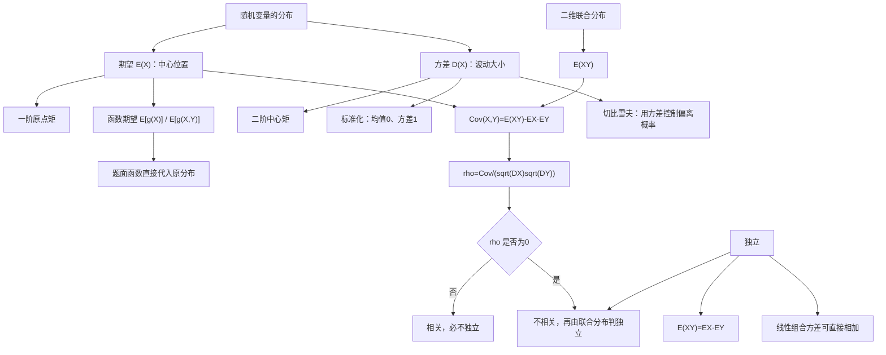

# 概率第4讲 随机变量的数字特征

源：`27张宇基础30讲概率.pdf`，印刷页 103-124 / PDF p109-p130。

整理方式：本讲22页已逐页OCR，并逐张阅读6张全页联系图和22张高清原页；基础知识结构、定义与性质、常见分布表、图4-1、例4.1-4.12、练习4.1-4.14及全部答案页均以原页复核结果为准。

## 本讲速览

- **数字特征是在压缩分布信息**：期望描述中心位置，方差与标准差描述波动，协方差与相关系数描述两个变量的线性联动。
- **期望题先判存在，再谈计算**：离散级数或连续积分必须绝对收敛；对称抵消得到0不代表期望存在。
- **函数期望通常不用先求函数分布**：直接把 \(g(X)\) 或 \(g(X,Y)\) 乘原分布求和、积分，尤其适合绝对值、截断函数、指数函数和等待时间。
- **方差题先找一阶、二阶矩**：优先使用 \(DX=E(X^2)-(EX)^2\)；线性组合用协方差展开，独立只是让协方差项消失。
- **相关系数只刻画线性关系**：\(\rho=0\) 表示不相关，不表示没有函数关系；独立必不相关，反之通常不成立。
- **独立性与不相关性要分两层判断**：先算协方差；非零即可判相关且不独立，等于0只能判不相关，还要回到联合分布判断是否独立。
- **切比雪夫只需要均值和方差**：它给概率界而非精确概率，可正向估计尾概率，也可反解保证概率所需的偏差半径。

## 教材路线

| 教材顺序 | 印刷页 / PDF页 | 本讲任务 |
|---|---|---|
| 基础知识结构 | 103 / p109 | 建立“一维数字特征 → 二维数字特征 → 独立/不相关 → 概率界”的总图 |
| 一、一维随机变量：数学期望 | 103-104 / p109-p110 | 离散与连续定义、函数期望、存在条件和期望性质 |
| 一、一维随机变量：方差、标准差 | 105-106 / p111-p112 | 方差定义、标准化、线性组合、独立乘积、最小均方误差和常见分布表 |
| 例4.1-例4.6 | 107-109 / p113-p115 | 二项最值、计数变量、期望存在性、正态核、泊松识别、概率积分变换 |
| 二、二维随机变量函数的期望 | 109-110 / p115-p116 | 联合分布下直接求 \(E[g(X,Y)]\) |
| 二、协方差、相关系数与矩 | 110-111 / p116-p117 | 定义、性质、标准化、原点矩与中心矩 |
| 例4.7-例4.8 | 111-113 / p117-p119 | 由约束补联合表、函数分布、相关系数、绝对值分区积分 |
| 三、独立性与不相关性、切比雪夫 | 113-115 / p119-p121 | 两种关系的判定程序、重要结论和概率界 |
| 例4.9-例4.12 | 114-116 / p120-p122 | 和差不相关、函数关系反例、切比雪夫、随机分段综合题 |
| 基础习题精练 | 117-118 / p123-p124 | 练习4.1-4.14覆盖线性组合、函数矩、联合表和综合判定 |
| 答案与解析 | 119-124 / p125-p130 | 核对全部独有技巧、计算路径和判定理由 |

## 前置知识与关联导航

- 分布函数、密度、常见一维分布及一维函数分布：[[26_概率第2讲_一维随机变量及其分布|概率第2讲]]。
- 联合分布、边缘分布、独立性和二维函数分布：[[27_概率第3讲_多维随机变量及其分布|概率第3讲]]。
- 条件概率、事件独立与示性变量对应的事件运算：[[25_概率第1讲_随机事件与概率|概率第1讲]]。
- 反常积分的收敛、奇偶性与积分计算：[[08_高数第8讲_一元函数积分学的概念与性质|积分概念与性质]]、[[09_高数第9讲_一元函数积分学的计算|积分计算]]。
- 本讲的切比雪夫不等式将用于[[29_概率第5讲_大数定律与中心极限定理|大数定律与中心极限定理]]，数字特征也会进入[[30_概率第6讲_数理统计|数理统计]]。

> [!note] 统一记号
> 教材用 \(EX,DX\) 表示数学期望和方差；本笔记同时使用 \(E(X),D(X)\)。标准差记为 \(\sigma_X=\sqrt{DX}\)，协方差记为 \(\operatorname{Cov}(X,Y)\)，相关系数记为 \(\rho_{XY}\)。

## 知识网络

## 知识点清单

## 一、一维随机变量的数字特征

### 1. 离散型数学期望

若离散型随机变量 \(X\) 的分布律为

\[
P(X=x_i)=p_i,\qquad i=1,2,\ldots,
\]

且

\[
\sum_i |x_i|p_i<+\infty,
\]

则数学期望存在，定义为

\[
EX=\sum_i x_ip_i.
\]

直观上，期望是“所有可能取值按概率加权后的重心”，不要求 \(EX\) 本身是 \(X\) 的可能取值。

若 \(Y=g(X)\)，无需先求 \(Y\) 的分布，只要

\[
\sum_i |g(x_i)|p_i<+\infty,
\]

就有

\[
E[g(X)]=\sum_i g(x_i)p_i.
\]

> [!tip] 看到什么想到它
> 给离散分布律并问 \(E(X^2)\)、\(E|X-a|\)、\(E(e^{tX})\) 或 \(D[g(X)]\)，直接把题目中的函数代入 \(g(x_i)\)。相同函数值不必先合并成新分布。

### 2. 连续型数学期望

若连续型随机变量 \(X\) 的密度为 \(f(x)\)，且

\[
\int_{-\infty}^{+\infty}|x|f(x)\,dx<+\infty,
\]

则

\[
EX=\int_{-\infty}^{+\infty}xf(x)\,dx.
\]

若 \(Y=g(X)\)，且

\[
\int_{-\infty}^{+\infty}|g(x)|f(x)\,dx<+\infty,
\]

则

\[
E[g(X)]
=\int_{-\infty}^{+\infty}g(x)f(x)\,dx.
\]

这就是“函数期望公式”：题目只问数字特征时，通常不必先求 \(Y=g(X)\) 的密度。

#### 期望存在性的严格判据

- 期望存在要求绝对收敛，而非仅要求正负两侧形式上抵消。
- 若 \(f(x)\) 为偶函数，\(xf(x)\) 为奇函数，只能在绝对可积后推出 \(EX=0\)。
- 柯西密度 \(f(x)=1/[\pi(1+x^2)]\) 虽然关于0对称，但 \(\int |x|f(x)\,dx\) 发散，因此 \(EX\) 不存在。例4.3正是在排除“奇函数积分为0”的误用。
- 某个 \(E[g(X)]\) 可以存在，即使 \(EX\) 不存在。练习4.9中的有界函数 \(\min\{|X|,1\}\) 就属于这种情况。

#### 概率积分变换

若 \(X\) 的分布函数 \(F\) 连续且严格单调，则

\[
F(X)\sim U(0,1).
\]

更一般地，连续分布函数也可结合广义反函数理解这一结论。例4.6看到“连续变量的 \(F(X)\)”时，优先把它转成均匀变量，而不是重新推一遍复杂分布。

> [!tip] 看到什么想到它
> “求函数的期望”先直接积分；“求 \(F(X)\) 的概率”先想概率积分变换；“密度对称”先检查绝对可积，再用奇偶性。

### 4. 数学期望性质

在相应期望存在时：

1. 常数的期望仍为常数：

\[
E(c)=c.
\]

2. **线性性不需要独立**：

\[
E(aX+bY+c)=aEX+bEY+c,
\]

\[
E\left(\sum_{i=1}^{n}a_iX_i\right)
=\sum_{i=1}^{n}a_iEX_i.
\]

3. 若 \(X,Y\) 相互独立，则

\[
E(XY)=EX\cdot EY.
\]

更一般地，相互独立变量的可积函数仍独立，因此

\[
E\left[\prod_{i=1}^{n}g_i(X_i)\right]
=\prod_{i=1}^{n}E[g_i(X_i)].
\]

4. 同分布变量具有相同的可积函数期望：

\[
X\overset d=Y\Rightarrow E[g(X)]=E[g(Y)].
\]

5. 事件 \(A\) 的示性变量 \(I_A\) 满足

\[
E(I_A)=P(A),\qquad I_A^2=I_A.
\]

练习4.13把事件 \(A,B\) 变成0-1变量，实质就是用示性变量把事件概率翻译成数字特征。

> [!warning] 两个“是否独立”
> \(E(X+Y)=EX+EY\) 永远不要求独立；把乘积拆成 \(E(XY)=EXEY\) 才通常需要独立。看到“和”与“积”必须先分清。

### 5. 方差与标准差

若二阶矩存在，则

\[
DX=E[(X-EX)^2].
\]

它表示随机变量到自身中心的平均平方距离。展开得最常用计算式

\[
DX=E(X^2)-(EX)^2.
\]

标准差为

\[
\sigma_X=\sqrt{DX},
\]

与 \(X\) 具有相同量纲；方差的量纲是 \(X\) 的平方。

当 \(DX>0\) 时，标准化变量

\[
X^*=\frac{X-EX}{\sqrt{DX}}
\]

满足

\[
E(X^*)=0,\qquad D(X^*)=1.
\]

标准化完成三件事：去中心、除尺度、保留分布形状。后面的相关系数就是两个标准化变量的协方差。

> [!tip] 看到什么想到它
> 问 \(D[g(X)]\) 时，不必先求 \(g(X)\) 的分布，直接算 \(E[g^2(X)]-[E(g(X))]^2\)。练习4.5、4.6都只需函数期望。

### 6. 方差性质

#### 基本性质

\[
DX\ge0,\qquad E(X^2)=DX+(EX)^2\ge(EX)^2.
\]

\[
DX=0
\iff P(X=a)=1\ \text{对某个常数 }a.
\]

\[
D(c)=0,\qquad D(aX+b)=a^2DX.
\]

平移只改变中心，不改变波动；数乘 \(a\) 使距离放大 \(|a|\)，所以方差乘 \(a^2\)。

#### 和、差与一般线性组合

\[
D(X\pm Y)
=DX+DY\pm2\operatorname{Cov}(X,Y).
\]

\[
D\left(\sum_{i=1}^{n}a_iX_i\right)
=\sum_{i=1}^{n}a_i^2DX_i
+2\sum_{1\le i<j\le n}a_ia_j\operatorname{Cov}(X_i,X_j).
\]

若各变量两两不相关，协方差项消失；相互独立必然满足这一条件，但“两两不相关”已经足够用于方差相加。

#### 独立变量的特殊结论

若 \(X,Y\) 独立，则

\[
D(aX+bY)=a^2DX+b^2DY.
\]

乘积方差也有教材中的重要二级结论：

\[
\begin{aligned}
D(XY)
&=E(X^2)E(Y^2)-(EX)^2(EY)^2\\
&=DX\cdot DY+DX(EY)^2+DY(EX)^2\\
&\ge DX\cdot DY.
\end{aligned}
\]

若 \(X_1,\ldots,X_n\) 相互独立，则

\[
D\left(\sum_{i=1}^{n}a_iX_i\right)
=\sum_{i=1}^{n}a_i^2DX_i,
\]

且分别作函数变换后仍可相加：

\[
D\left(\sum_{i=1}^{n}g_i(X_i)\right)
=\sum_{i=1}^{n}D[g_i(X_i)].
\]

#### 期望是最优平方逼近常数

对任意常数 \(c\)，

\[
DX=E[(X-EX)^2]\le E[(X-c)^2],
\]

并且

\[
E[(X-c)^2]=DX+(c-EX)^2.
\]

因此 \(c=EX\) 唯一使均方误差最小。期望不仅是“平均值”，还是用一个常数逼近随机变量时的最佳平方损失解。

### 7. 常见分布的期望与方差

| 分布 | 参数与支撑 | \(EX\) | \(DX\) | 识别提示 |
|---|---|---:|---:|---|
| 0-1分布 \(B(1,p)\) | \(0,1\) | \(p\) | \(p(1-p)\) | 示性变量 |
| 二项 \(B(n,p)\) | \(0,\ldots,n\) | \(np\) | \(np(1-p)\) | \(n\) 次独立成功次数 |
| 泊松 \(P(\lambda)\) | \(0,1,\ldots\) | \(\lambda\) | \(\lambda\) | \(\lambda^k e^{-\lambda}/k!\) |
| 几何 \(G(p)\) | \(1,2,\ldots\) | \(1/p\) | \((1-p)/p^2\) | 首次成功所需试验次数 |
| 正态 \(N(\mu,\sigma^2)\) | 全实轴 | \(\mu\) | \(\sigma^2\) | 配方识别正态核 |
| 均匀 \(U(a,b)\) | \((a,b)\) | \((a+b)/2\) | \((b-a)^2/12\) | 中点与区间长度 |
| 指数 \(E(\lambda)\) | \(x>0\) | \(1/\lambda\) | \(1/\lambda^2\) | \(\lambda e^{-\lambda x}\) |

必须区分泊松分布 \(P(\lambda)\) 与指数分布 \(E(\lambda)\)：前者离散，均值与方差都为 \(\lambda\)；后者连续，均值、方差分别为 \(1/\lambda,1/\lambda^2\)。

#### 教材例题给出的识别与转化

- **例4.1**：二项标准差 \(\sqrt{np(1-p)}\) 的最大值来自 \(p(1-p)\le1/4\)，等号在 \(p=1/2\)。
- **例4.2**：重复观察某事件的发生次数先识别为二项分布，再用 \(E(Y^2)=DY+(EY)^2\)。
- **例4.3**：对称不能代替绝对收敛检查。
- **例4.4**：\(Ae^{-ax^2+bx+c}\) 型密度先配方，再与正态密度的指数项和归一化系数整体比较。
- **例4.5**：\(C/k!\) 先由总概率为1求 \(C=e^{-1}\)，再识别为 \(P(1)\)；绝对值题在符号改变处拆分。
- **例4.6**：连续CDF的函数 \(F(X)\) 优先转化为均匀变量。

## 二、二维随机变量的数字特征

### 3. 二维随机变量函数的期望

若 \((X,Y)\) 为离散型，联合分布律为

\[
p_{ij}=P(X=x_i,Y=y_j),
\]

且绝对收敛，则

\[
E[g(X,Y)]
=\sum_i\sum_j g(x_i,y_j)p_{ij}.
\]

若 \((X,Y)\) 为连续型，联合密度为 \(f(x,y)\)，且绝对可积，则

\[
E[g(X,Y)]
=\iint_{\mathbb R^2}g(x,y)f(x,y)\,dx\,dy.
\]

由此直接得到

\[
E(XY)=\sum_i\sum_jx_iy_jp_{ij}
\]

或

\[
E(XY)=\iint xyf(x,y)\,dx\,dy.
\]

若 \(Z=g(X,Y)\)，则

\[
DZ=E[g^2(X,Y)]-[E(g(X,Y))]^2.
\]

> [!example] 例4.8：把文字翻译成函数
> 两人相约见面，先到者等待时间不是 \(X-Y\)，而是 \(|X-Y|\)。若联合支撑为单位正方形，绝对值沿 \(x=y\) 改变符号，必须把区域分成 \(x<y\) 与 \(x>y\) 两块积分。

> [!tip] 看到什么想到它
> 问“等待时间、距离、较大者、较小者、比值、截断量”的期望，先把文字写成 \(g(X,Y)\)，再直接对联合分布求期望。只有题目明确要求函数分布时才先求分布。

### 8. 协方差

在二阶矩存在时，

\[
\operatorname{Cov}(X,Y)
=E[(X-EX)(Y-EY)].
\]

展开得到计算式

\[
\operatorname{Cov}(X,Y)=E(XY)-EX\cdot EY.
\]

因此二维表格或联合密度题固定凑齐

\[
EX,\qquad EY,\qquad E(XY).
\]

#### 协方差性质

\[
\operatorname{Cov}(X,Y)=\operatorname{Cov}(Y,X),
\]

\[
\operatorname{Cov}(X,X)=DX,
\]

\[
\operatorname{Cov}(aX,bY)=ab\operatorname{Cov}(X,Y),
\]

\[
\operatorname{Cov}(X_1+X_2,Y)
=\operatorname{Cov}(X_1,Y)+\operatorname{Cov}(X_2,Y).
\]

常数平移不影响协方差：

\[
\operatorname{Cov}(X+a,Y+b)=\operatorname{Cov}(X,Y).
\]

一般双线性展开为

\[
\operatorname{Cov}\left(\sum_i a_iX_i,\sum_j b_jY_j\right)
=\sum_i\sum_j a_ib_j\operatorname{Cov}(X_i,Y_j).
\]

例如

\[
\operatorname{Cov}(X+Y,X-Y)=DX-DY,
\]

交叉项因协方差对称而抵消。这正是例4.9和练习4.2的首选入口。

#### 随机变量的矩

- \(E(X^k)\)：\(X\) 的 \(k\) 阶原点矩。
- \(E[(X-EX)^k]\)：\(X\) 的 \(k\) 阶中心矩。
- \(E(X^kY^l)\)：\(X,Y\) 的 \(k+l\) 阶混合原点矩。
- \(E[(X-EX)^k(Y-EY)^l]\)：\(k+l\) 阶混合中心矩。

于是

\[
EX=E(X)
\]

是一阶原点矩，

\[
DX=E[(X-EX)^2]
\]

是二阶中心矩，

\[
\operatorname{Cov}(X,Y)
=E[(X-EX)(Y-EY)]
\]

是二阶混合中心矩。

### 9. 相关系数

当 \(DX>0,DY>0\) 时，

\[
\rho_{XY}
=\frac{\operatorname{Cov}(X,Y)}
{\sqrt{DX}\sqrt{DY}}.
\]

它是消除量纲与尺度后的协方差。若

\[
X^*=\frac{X-EX}{\sqrt{DX}},\qquad
Y^*=\frac{Y-EY}{\sqrt{DY}},
\]

则

\[
\rho_{XY}=\operatorname{Cov}(X^*,Y^*).
\]

由柯西-施瓦茨不等式，

\[
|\rho_{XY}|\le1.
\]

等号条件是几乎处处存在严格线性关系：

\[
\rho_{XY}=1
\iff P(Y=aX+b)=1,\ a>0,
\]

\[
\rho_{XY}=-1
\iff P(Y=aX+b)=1,\ a<0.
\]

相关系数只衡量**线性**相依程度。\(\rho=0\) 只表示无线性关系，变量仍可能有明显非线性函数关系。

> [!warning] 常量变量
> 若 \(DX=0\) 或 \(DY=0\)，相关系数分母为0，\(\rho_{XY}\) 不定义；协方差仍可讨论。

#### 二维例题的两种典型结构

- **例4.7**：边缘分布加约束 \(P(X^2=Y^2)=1\)。先把不满足约束的格子置0，再由行列边缘补表；最后算得 \(\rho=0\)，但联合表不等于边缘乘积，所以不独立。
- **例4.8**：已知独立边缘密度时先相乘得到联合密度，再对 \(|X-Y|\) 分区积分。独立性用于构造联合密度，不用于拆 \(E|X-Y|\)。

## 三、独立性、不相关性与概率界

### 10. 独立与不相关

#### 两种关系的定义

独立性由完整分布决定：

\[
F(x,y)=F_X(x)F_Y(y),\qquad\forall x,y,
\]

离散型等价于

\[
p_{ij}=p_{i\cdot}p_{\cdot j},\qquad\forall i,j,
\]

连续型等价于

\[
f(x,y)=f_X(x)f_Y(y)\quad\text{几乎处处}.
\]

不相关性只由二阶数字特征决定：

\[
X,Y\text{ 不相关}
\iff \operatorname{Cov}(X,Y)=0
\iff E(XY)=EX\cdot EY.
\]

由方差公式还可写成

\[
X,Y\text{ 不相关}
\iff D(X+Y)=DX+DY.
\]

#### 必须掌握的逻辑关系

\[
X,Y\text{ 独立}\Rightarrow X,Y\text{ 不相关},
\]

反之通常不成立。

若 \((X,Y)\) **联合二维正态**，则

\[
X,Y\text{ 独立}
\iff X,Y\text{ 不相关}.
\]

由独立推出不相关的逆否命题：

\[
X,Y\text{ 相关}\Rightarrow X,Y\text{ 不独立}.
\]

#### 考试判定程序

\[
\operatorname{Cov}(X,Y)
=E(XY)-EXEY.
\]

1. 若协方差非零：直接判“相关且不独立”。
2. 若协方差为零：只能判“不相关”，再用联合分布决定独立或不独立。
3. 若已知联合二维正态：协方差为零即可进一步判独立。

> [!example] 两类函数关系反例
> 例4.10中，对称变量 \(X\) 与 \(|X|\) 满足 \(E(X|X|)=0\)，所以不相关；但 \(|X|\) 完全由 \(X\) 决定，显然不独立。练习4.4、4.14中的 \(Y=X^3\) 则有 \(E(XY)=E(X^4)>0\)，所以既相关又不独立。看到“\(Y=g(X)\)”不能机械地猜相关系数为0，要实际计算。

> [!warning] 不能从函数关系直接断言“相关”
> 非线性函数关系保证通常不独立，却不保证线性相关；\(X\) 与 \(|X|\) 就是“不独立但不相关”的标准反例。

### 11. 切比雪夫不等式

若 \(EX=\mu\)、\(DX=\sigma^2<+\infty\)，则对任意 \(\varepsilon>0\)，

\[
P(|X-\mu|\ge\varepsilon)
\le\frac{\sigma^2}{\varepsilon^2}.
\]

等价地，

\[
P(|X-\mu|<\varepsilon)
\ge1-\frac{\sigma^2}{\varepsilon^2}.
\]

它不要求知道 \(X\) 的具体分布，只使用均值和方差，因此给出的是普适界，不是精确概率。

#### 正向估计

若问偏离至少 \(\varepsilon\) 的概率上界，直接代入

\[
\frac{DX}{\varepsilon^2}.
\]

例4.11先令 \(U=X-Y\)，由

\[
DU=DX+DY-2\operatorname{Cov}(X,Y)
\]

算出新变量方差，再对 \(|U-EU|\) 使用切比雪夫。

#### 反解偏差半径

若要求

\[
P(|X-EX|<\varepsilon)\ge1-\alpha,
\]

只需保证

\[
1-\frac{DX}{\varepsilon^2}\ge1-\alpha,
\]

即

\[
\varepsilon\ge\sqrt{\frac{DX}{\alpha}}.
\]

练习4.11给定 \(DX=0.009\) 与保证概率0.9，得到 \(\varepsilon\ge0.3\)。

#### 最大值、最小值的代数恒等式

对

\[
U=\max(X,Y),\qquad V=\min(X,Y),
\]

恒有

\[
U+V=X+Y,\qquad UV=XY,
\]

并且

\[
U=\frac{X+Y+|X-Y|}{2},\qquad
V=\frac{X+Y-|X-Y|}{2}.
\]

因此只问 \(E(U+V)\) 或 \(E(UV)\) 时，不要求极值分布。练习4.10直接化为 \(E(X+Y)\) 与 \(E(XY)\)。

> [!example] 例4.12的综合迁移
> 随机切分区间时，先把切点记为 \(T\)，再写短段 \(X=\min(T,2-T)\)、长段 \(Y=2-X\)。求短段分布用补事件 \(P(X>x)\)；求 \(Y/X\) 的分布用一维单调变换；只求 \(E(X/Y)\) 时直接对 \(X\) 积分。一个题同时展示了“建模函数、求分布、求函数期望”的三种入口。

## 公式与二级结论索引

| 主题 | 完整结论与条件 | 详细讲解 |
|---|---|---|
| 离散期望 | \(\sum\lvert x_i\rvert p_i<\infty\) 时，\(EX=\sum x_ip_i\) | [[28_概率第4讲_随机变量的数字特征#1. 离散型数学期望|离散期望]] |
| 连续期望 | \(\int\lvert x\rvert f(x)dx<\infty\) 时，\(EX=\int xf(x)dx\) | [[28_概率第4讲_随机变量的数字特征#2. 连续型数学期望|连续期望]] |
| 函数期望 | \(E[g(X)]=\sum g(x_i)p_i\) 或 \(\int g(x)f(x)dx\)，须绝对可积 | [[28_概率第4讲_随机变量的数字特征#2. 连续型数学期望|函数期望]] |
| 二维函数期望 | \(E[g(X,Y)]=\sum\sum gp_{ij}\) 或 \(\iint gf\) | [[28_概率第4讲_随机变量的数字特征#3. 二维随机变量函数的期望|二维函数期望]] |
| 期望线性 | \(E(\sum a_iX_i)=\sum a_iEX_i\)，不要求独立 | [[28_概率第4讲_随机变量的数字特征#4. 数学期望性质|期望性质]] |
| 方差计算 | \(DX=E(X^2)-(EX)^2\) | [[28_概率第4讲_随机变量的数字特征#5. 方差与标准差|方差]] |
| 仿射方差 | \(D(aX+b)=a^2DX\) | [[28_概率第4讲_随机变量的数字特征#6. 方差性质|方差性质]] |
| 一般和差 | \(D(X\pm Y)=DX+DY\pm2\operatorname{Cov}(X,Y)\) | [[28_概率第4讲_随机变量的数字特征#6. 方差性质|和差方差]] |
| 独立乘积方差 | \(D(XY)=DXDY+DX(EY)^2+DY(EX)^2\) | [[28_概率第4讲_随机变量的数字特征#6. 方差性质|独立乘积]] |
| 最小均方误差 | \(E[(X-c)^2]=DX+(c-EX)^2\ge DX\) | [[28_概率第4讲_随机变量的数字特征#6. 方差性质|最优常数]] |
| 概率积分变换 | 连续严格单调CDF下 \(F(X)\sim U(0,1)\) | [[28_概率第4讲_随机变量的数字特征#2. 连续型数学期望|概率积分变换]] |
| 协方差 | \(\operatorname{Cov}(X,Y)=E(XY)-EXEY\) | [[28_概率第4讲_随机变量的数字特征#8. 协方差|协方差]] |
| 相关系数 | \(DX,DY>0\) 时，\(\rho=\operatorname{Cov}/(\sqrt{DX}\sqrt{DY})\) | [[28_概率第4讲_随机变量的数字特征#9. 相关系数|相关系数]] |
| 完全线性相关 | \(\lvert\rho\rvert=1\iff P(Y=aX+b)=1\)，符号由 \(a\) 决定 | [[28_概率第4讲_随机变量的数字特征#9. 相关系数|等号条件]] |
| 不相关 | \(\operatorname{Cov}=0\iff E(XY)=EXEY\iff D(X+Y)=DX+DY\) | [[28_概率第4讲_随机变量的数字特征#10. 独立与不相关|不相关]] |
| 独立与不相关 | 独立必不相关；联合二维正态时二者等价 | [[28_概率第4讲_随机变量的数字特征#10. 独立与不相关|关系判定]] |
| 切比雪夫 | \(P(\lvert X-EX\rvert\ge\varepsilon)\le DX/\varepsilon^2\) | [[28_概率第4讲_随机变量的数字特征#11. 切比雪夫不等式|切比雪夫]] |

## 题型-方法决策表

| 题面信号 | 首选方法 | 备选方法 | 必查边界 |
|---|---|---|---|
| 给离散表或阶梯CDF求期望方差 | 由跳幅还原分布律，再算一、二阶矩 | 直接对函数值合并 | 概率和为1、期望绝对收敛 |
| 给连续密度求 \(E[g(X)]\) | 直接积分 \(g(x)f(x)\) | 先求函数分布 | 支撑、绝对可积、奇偶性条件 |
| 给 \(D[g(X)]\) | 算 \(E[g^2]-[E(g)]^2\) | 求新变量密度 | 二次函数是 \(g^2\)，不是 \(g\) |
| 重复独立试验中的计数 | 识别二项分布 | 从0-1变量求和 | 单次成功概率、次数 \(n\) |
| \(C/k!\) 或正态指数核 | 先归一化并识别分布 | 按定义求矩 | 参数、支撑、配方常数 |
| 问 \(F(X)\) 的概率 | 概率积分变换 | 直接写分段CDF | \(F\) 的连续与单调条件 |
| 给二维联合表求相关系数 | 求边缘、\(EX,EY,E(XY),DX,DY\) | 用条件期望 | 表格补全、方差非零 |
| 只给边缘与支撑约束 | 先按约束置零，再用行列和补表 | 设参数联立 | 边缘信息通常不足，须用全部约束 |
| 线性组合的方差或相关系数 | 协方差双线性展开 | 求新变量分布 | 不能无故删协方差项 |
| 绝对值二维期望 | 沿符号改变边界分区 | 用对称性倍乘 | 联合支撑和每区表达式 |
| 判断相关、独立 | 先算协方差，再按判定程序 | 直接验联合分解 | \(\operatorname{Cov}=0\) 不推出独立 |
| \(Y=g(X)\) | 通常先判不独立，再实际算协方差 | 事件反例 | 非线性函数关系可能不相关 |
| 只知均值方差估计概率 | 切比雪夫不等式 | 若知分布则算精确值 | 中心必须是 \(EX\)，结果只是界 |
| 最大最小的和或积 | 用 \(U+V=X+Y,UV=XY\) | 求极值分布 | 题目究竟问分布还是期望 |

## 教材例题覆盖表

| 例题 | 题面信号 | 方法入口 | 必须带走的迁移结论 |
|---|---|---|---|
| 4.1 | 二项成功次数标准差最大值 | \(p(1-p)\le1/4\) | 二项波动在 \(p=1/2\) 最大 |
| 4.2 | 重复观察阈值事件，求计数平方期望 | 先求单次概率并识别二项 | \(E(Y^2)=DY+(EY)^2\) |
| 4.3 | 对称柯西密度求期望 | 检查绝对收敛 | 主值为0不等于期望存在 |
| 4.4 | \(Ae^{-ax^2+bx+c}\) 型密度 | 配方识别正态 | 指数项与归一化系数一起比较 |
| 4.5 | \(C/k!\)、绝对偏差 | 归一化识别泊松，按符号拆绝对值 | 可利用零均值和单点修正简算 |
| 4.6 | 连续CDF的函数 \(F(X)\) | \(F(X)\sim U(0,1)\) | 概率积分变换优先于硬推CDF |
| 4.7 | 边缘分布加 \(X^2=Y^2\) | 支撑约束置零、行列和补表 | 不相关仍可不独立 |
| 4.8 | 两人等待时间 | 建模为 \(\lvert X-Y\rvert\)，沿对角线分区 | 先翻译随机量再积分 |
| 4.9 | \(X+Y\) 与 \(X-Y\) 不相关 | 协方差双线性 | \(\operatorname{Cov}(X+Y,X-Y)=DX-DY\) |
| 4.10 | 对称变量 \(X\) 与 \(\lvert X\rvert\) | 奇偶性算协方差，函数关系判独立 | 标准“不相关但不独立”反例 |
| 4.11 | 给均值方差相关系数，估计尾概率 | 先构造 \(U=X-Y\) 的方差 | 切比雪夫可用于新变量 |
| 4.12 | 随机切分区间 | 极值建模、CDF法、单调变换、直接期望 | 根据所求对象在三种入口间切换 |

## 讲末练习反查

| 练习 | 笔记中的做题入口 | 关键检查点 |
|---|---|---|
| 4.1 | [[28_概率第4讲_随机变量的数字特征#4. 数学期望性质|期望线性]] | 同分布给 \(EX=EY\)，不要求独立 |
| 4.2 | [[28_概率第4讲_随机变量的数字特征#8. 协方差|协方差双线性]] | 不必求线性组合分布；分别算协方差和两个方差 |
| 4.3 | [[28_概率第4讲_随机变量的数字特征#10. 独立与不相关|事件独立与联合表]] | 先由极值事件独立求参数，再补表算协方差 |
| 4.4 | [[28_概率第4讲_随机变量的数字特征#10. 独立与不相关|函数关系判定]] | \(Y=X^3\) 不独立，且 \(E(XY)=E(X^4)>0\) |
| 4.5 | [[28_概率第4讲_随机变量的数字特征#1. 离散型数学期望|阶梯CDF与函数矩]] | 先取跳幅；\(D(X^2)\) 需要 \(E(X^4)\) |
| 4.6 | [[28_概率第4讲_随机变量的数字特征#5. 方差与标准差|函数方差]] | 算 \(E(e^{-2X})\) 与 \(E(e^{-4X})\)，不用求新密度 |
| 4.7 | [[28_概率第4讲_随机变量的数字特征#2. 连续型数学期望|反比函数期望]] | \(1/y\) 与密度中的 \(y\) 抵消后化成正态积分 |
| 4.8 | [[28_概率第4讲_随机变量的数字特征#7. 常见分布的期望与方差|泊松矩]] | \(E(X^2)=DX+(EX)^2=\lambda+\lambda^2\) |
| 4.9 | [[28_概率第4讲_随机变量的数字特征#2. 连续型数学期望|截断函数期望]] | 利用偶性并在 \(\lvert x\rvert=1\) 处分段；\(EX\) 可不存在 |
| 4.10 | [[28_概率第4讲_随机变量的数字特征#11. 切比雪夫不等式|极值恒等式]] | \(U+V=X+Y,UV=XY\)，无需极值分布 |
| 4.11 | [[28_概率第4讲_随机变量的数字特征#11. 切比雪夫不等式|反解半径]] | 令下界至少0.9，解 \(\varepsilon>0\) 的范围 |
| 4.12 | [[28_概率第4讲_随机变量的数字特征#8. 协方差|0-1联合表]] | \(E(XY)=P(X=1,Y=1)\)，再由边缘补其余三格 |
| 4.13 | [[28_概率第4讲_随机变量的数字特征#4. 数学期望性质|示性变量]] | 条件概率先转 \(P(AB)\)，且 \(X^2=X,Y^2=Y\) |
| 4.14 | [[28_概率第4讲_随机变量的数字特征#10. 独立与不相关|正态奇偶性与函数关系]] | \(EY=E(X^3)=0\)，但 \(E(XY)=E(X^4)>0\) |

## 易错点/易混点

1. **奇函数积分为0有前提**：先验证绝对收敛；柯西分布的期望不能写成0。
2. **函数期望不必先求函数分布**：只求 \(E[g(X)]\) 或 \(D[g(X)]\) 时，优先直接代原分布。
3. **期望线性不需要独立**：\(E(X+Y)=EX+EY\) 始终成立；乘积拆分才通常需要独立。
4. **方差不能线性拆**：一般 \(D(X+Y)\) 含 \(2\operatorname{Cov}(X,Y)\)。
5. **平移与数乘效果不同**：\(D(aX+b)=a^2DX\)，常数 \(b\) 不影响方差。
6. **\(D(X^2)\) 不是 \(DX\) 的平方**：应算 \(E(X^4)-[E(X^2)]^2\)。
7. **独立变量乘积方差不等于 \(DX\cdot DY\)**：还要加 \(DX(EY)^2+DY(EX)^2\)。
8. **\(\rho=0\) 只表示不相关**：还要用联合分布判独立，除非已知联合二维正态。
9. **相关一定不独立**：这是“独立必不相关”的逆否命题。
10. **函数关系不等于线性相关**：\(Y=g(X)\) 通常不独立，但协方差可能为0。
11. **\(|\rho|=1\) 的关系必须是线性的**：且只在方差均非零时讨论。
12. **二维表只给边缘通常不能确定联合**：需要支撑约束、协方差、事件独立等附加条件。
13. **绝对值积分必须分区**：分界线来自绝对值内部等于0，而不是凭对称随意乘2。
14. **切比雪夫围绕的是期望**：先把事件写成 \(|Z-EZ|\)，不能直接把任意中心塞进公式。
15. **切比雪夫给界不等于取等**：若已知具体分布，精确概率可能远小于上界。
16. **反解切比雪夫注意方向**：要求保证概率越高，需要的 \(\varepsilon\) 越大。
17. **最大最小先看是否只问和与积**：若是，直接用代数恒等式，避免多余的分布计算。

## 注解：用三本账组织本讲

1. **分布账**：取值、概率、密度、联合支撑。独立性必须查这本账。
2. **矩账**：\(EX,E(X^2),DX,EY,E(Y^2),DY,E(XY)\)。协方差和相关系数从这本账结算。
3. **关系账**：独立、相关、不相关、函数关系。不要把不同层级的关系互相替代。

做题时先问“题目给的是哪本账的信息，要求的是哪本账的结论”。例如给联合表求相关系数，是从分布账计算矩账；给协方差恢复0-1联合表，则是从矩账反推分布账。

## 速背检查

1. **离散型期望存在的条件是什么？**
   \(\sum |x_i|p_i<\infty\)，此时 \(EX=\sum x_ip_i\)。

2. **连续型期望为什么不能只靠对称性判为0？**
   必须先有 \(\int |x|f(x)dx<\infty\)；否则奇函数的对称主值不等于期望。

3. **求 \(E[g(X)]\) 是否必须先求 \(g(X)\) 的分布？**
   不必，通常直接用 \(\sum g(x_i)p_i\) 或 \(\int g(x)f(x)dx\)。

4. **期望线性需要独立吗？**
   不需要；\(E(aX+bY)=aEX+bEY\)。

5. **什么时候可以写 \(E(XY)=EXEY\)？**
   \(X,Y\) 独立且相关期望存在时。

6. **方差的定义式和计算式是什么？**
   \(DX=E[(X-EX)^2]=E(X^2)-(EX)^2\)。

7. **标准化后均值和方差是多少？**
   \(E(X^*)=0,D(X^*)=1\)。

8. **\(DX=0\) 说明什么？**
   \(X\) 几乎处处等于某个常数。

9. **一般的 \(D(X+Y)\) 怎样展开？**
   \(DX+DY+2\operatorname{Cov}(X,Y)\)。

10. **独立时 \(D(XY)\) 是什么？**
    \(DXDY+DX(EY)^2+DY(EX)^2\)。

11. **哪个常数使 \(E[(X-c)^2]\) 最小？**
    \(c=EX\)，最小值为 \(DX\)。

12. **协方差的计算式是什么？**
    \(\operatorname{Cov}(X,Y)=E(XY)-EXEY\)。

13. **相关系数为什么不受量纲影响？**
    协方差除以两个标准差，尺度被标准化。

14. **\(|\rho|=1\) 表示什么？**
    两变量几乎处处存在严格线性关系 \(Y=aX+b\)。

15. **独立与不相关的正确方向是什么？**
    独立必不相关；不相关通常不能推出独立。

16. **协方差非零能立即得到什么？**
    两变量相关，因此一定不独立。

17. **协方差为零后下一步做什么？**
    只能先判不相关，再查联合分布是否分解；联合二维正态时可直接判独立。

18. **切比雪夫尾概率上界是什么？**
    \(P(|X-EX|\ge\varepsilon)\le DX/\varepsilon^2\)。

19. **如何由保证概率 \(1-\alpha\) 反解半径？**
    取 \(\varepsilon\ge\sqrt{DX/\alpha}\)。

20. **最大值与最小值的两个代数恒等式是什么？**
    \(\max+\min=X+Y\)，\(\max\cdot\min=XY\)。

## 相关链接

- [[27_概率第3讲_多维随机变量及其分布|上一讲：多维随机变量及其分布]]
- [[29_概率第5讲_大数定律与中心极限定理|下一讲：大数定律与中心极限定理]]
- [[26_概率第2讲_一维随机变量及其分布#二、离散型随机变量及常见离散分布|常见离散分布]]
- [[26_概率第2讲_一维随机变量及其分布#三、连续型随机变量及常见连续分布|常见连续分布]]
- [[27_概率第3讲_多维随机变量及其分布#8. 随机变量的相互独立性|多维变量独立性]]
- [[30_概率第6讲_数理统计|数字特征在数理统计中的应用]]
