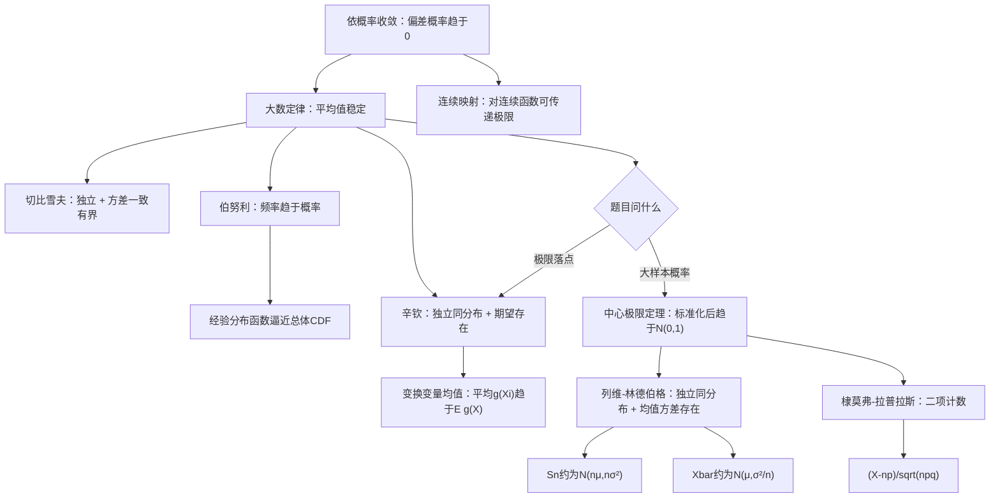

# 概率第5讲 大数定律与中心极限定理

> [!info] 教材与核查范围
> 来源：`27张宇基础30讲概率.pdf`，印刷页125-132，PDF p131-p138。
> 本讲8页均已逐页OCR，并查看全讲联系图和全部8页高清原图；公式、上下标、标准化分母、概率区间及答案均以原页为准。

## 本讲速览

- **依概率收敛描述“越来越可能接近”**：对任意误差宽度 \(\varepsilon>0\)，偏差超过 \(\varepsilon\) 的概率趋于0。
- **大数定律回答“平均值稳定到哪里”**：切比雪夫处理独立且方差一致有界的变量，伯努利说明频率趋近概率，辛钦说明独立同分布样本均值趋近期望。
- **中心极限定理回答“稳定附近怎样波动”**：独立同分布且均值、正方差存在时，标准化的和趋于标准正态。
- **看到平均值极限先想大数定律，看到大样本概率和 \(\Phi\) 先想中心极限定理**；二者不能互相替代。
- **变换后仍可套定理**：遇到 \(n^{-1}\sum g(X_i)\)，先令 \(Y_i=g(X_i)\)，再检查 \(Y_i\) 的独立同分布性及所需矩。
- **做题核心是“先算中心与尺度，再标准化”**：和用 \(n\mu,n\sigma^2\)，均值用 \(\mu,\sigma^2/n\)，二项计数用 \(np,np(1-p)\)。

## 教材路线

| 教材内容 | 印刷页 / PDF页 | 复习任务 |
|---|---:|---|
| 基础知识结构、依概率收敛 | 125 / p131 | 掌握定义、等价形式及连续映射性质 |
| 三类大数定律、经验分布函数 | 126 / p132 | 区分条件与结论，理解频率逼近概率 |
| 例5.1-例5.3 | 127-128 / p133-p134 | 方差一致有界、经验分布、变换变量均值 |
| 列维-林德伯格与棣莫弗-拉普拉斯定理 | 128-129 / p134-p135 | 掌握条件、标准化式与近似分布 |
| 例5.4-例5.6 | 129-130 / p135-p136 | 条件辨析、二项标准化、容量反解 |
| 练习5.1-5.5及解答 | 130-132 / p136-p138 | 指数样本和、0-1和、二项区间、样本均值、平方样本均值 |

## 前置知识与关联导航

- 均值、方差、标准化与切比雪夫不等式：[[28_概率第4讲_随机变量的数字特征#5. 方差与标准差|方差与标准差]]、[[28_概率第4讲_随机变量的数字特征#11. 切比雪夫不等式|切比雪夫不等式]]。
- 二项、指数、正态分布：[[26_概率第2讲_一维随机变量及其分布#5. 二项分布|二项分布]]、[[26_概率第2讲_一维随机变量及其分布#11. 指数分布|指数分布]]、[[26_概率第2讲_一维随机变量及其分布#12. 正态分布|正态分布]]。
- 伯努利试验与频率：[[25_概率第1讲_随机事件与概率|随机事件与概率]]。
- 本讲的经验分布、样本均值及一致性将进入[[30_概率第6讲_数理统计#1. 总体、样本与简单随机样本|总体与样本]]和[[30_概率第6讲_数理统计#9. 估计量的评价标准|估计量评价]]。

> [!note] 记号
> \(S_n=\sum_{i=1}^{n}X_i\)，\(\bar X_n=S_n/n\)；\(\xrightarrow{P}\) 表示依概率收敛，\(\xrightarrow{d}\) 表示依分布收敛，\(\Phi\) 表示标准正态分布函数。

## 知识网络

## 知识点清单

## 一、依概率收敛

### 1. 依概率收敛

#### 直观与定义

普通数列 \(x_n\to a\) 表示充分大的 \(n\) 下，数值必落入 \(a\) 的任意小邻域；随机变量每次取值可能不同，因此改问“落入邻域的概率是否趋于1”。

随机变量序列 \(\{X_n\}\) 依概率收敛于随机变量 \(X\)，定义为对任意 \(\varepsilon>0\)，

\[
\lim_{n\to\infty}P\{|X_n-X|\ge\varepsilon\}=0.
\]

等价地，

\[
\lim_{n\to\infty}P\{|X_n-X|<\varepsilon\}=1.
\]

记作

\[
X_n\xrightarrow{P}X.
\]

极限也可为常数 \(a\)：

\[
X_n\xrightarrow{P}a
\iff
P(|X_n-a|\ge\varepsilon)\to0.
\]

> [!warning] 量词不能漏
> 必须是“对任意固定的 \(\varepsilon>0\)”成立。不能只验证某一个误差范围，也不能把 \(\varepsilon\) 随意设成依赖 \(n\) 的量。

#### 连续映射性质

若

\[
X_n\xrightarrow{P}X,\qquad Y_n\xrightarrow{P}Y,
\]

且 \(g(x,y)\) 连续，则

\[
g(X_n,Y_n)\xrightarrow{P}g(X,Y).
\]

一般地，对连续的 \(m\) 元函数同样成立。常用二级结论包括

\[
X_n+Y_n\xrightarrow{P}X+Y,
\]

\[
X_nY_n\xrightarrow{P}XY,
\]

以及在 \(P(Y=0)=0\) 且分母可控时，

\[
\frac{X_n}{Y_n}\xrightarrow{P}\frac{X}{Y}.
\]

**看到什么想到它：** 若题目已经给出多个依概率极限，又要求它们的和、积或连续函数的极限，先用连续映射性质，不必重新从概率定义计算。

## 二、大数定律

大数定律的统一语言是：大量观测的平均结果逐渐稳定。它只说明**依概率极限**，不直接给有限样本的精确分布，也不说明误差经过标准化后的形状。

### 2. 切比雪夫不等式工具

若 \(EY\) 与 \(DY\) 存在，则对任意 \(\varepsilon>0\)，

\[
P\{|Y-EY|\ge\varepsilon\}
\le \frac{DY}{\varepsilon^2}.
\]

证明依概率收敛的常用模板是：找到随机变量 \(Y_n\)，使

\[
DY_n\to0,
\]

则

\[
P\{|Y_n-EY_n|\ge\varepsilon\}
\le\frac{DY_n}{\varepsilon^2}\to0,
\]

即

\[
Y_n-EY_n\xrightarrow{P}0.
\]

它是切比雪夫大数定律的直接证明工具，详细概率界见[[28_概率第4讲_随机变量的数字特征#11. 切比雪夫不等式|上一讲]]。

### 3. 切比雪夫大数定律

#### 条件与结论

设随机变量序列 \(\{X_i\}\) 满足：

1. \(X_1,X_2,\ldots\) 相互独立；
2. 各 \(DX_i\) 存在；
3. 方差一致有界，即存在不依赖 \(i\) 的常数 \(C\)，使

\[
DX_i\le C,\qquad i=1,2,\ldots.
\]

则

\[
\frac1n\sum_{i=1}^{n}X_i
-\frac1n\sum_{i=1}^{n}EX_i
\xrightarrow{P}0.
\]

教材也写作

\[
\frac1n\sum_{i=1}^{n}X_i
\xrightarrow{P}
\frac1n\sum_{i=1}^{n}EX_i,
\]

含义是随机平均与期望平均之差依概率趋于0。

#### 为什么成立

令

\[
Y_n=\frac1n\sum_{i=1}^{n}X_i.
\]

由独立性，

\[
DY_n
=\frac1{n^2}\sum_{i=1}^{n}DX_i
\le\frac{nC}{n^2}
=\frac Cn\to0.
\]

再用切比雪夫不等式即可得到结论。这里真正起作用的是：平均以后方差被压到0。

#### 特殊情形

若各变量还有共同期望 \(EX_i=\mu\)，则

\[
\bar X_n\xrightarrow{P}\mu.
\]

切比雪夫大数定律不要求同分布，但必须逐项检查方差是否有**统一上界**。

#### 例5.1：不同倍数变换怎样检查

若 \(X_n\) 服从参数为 \(n\) 的指数分布，则

\[
DX_n=\frac1{n^2}.
\]

对新序列第 \(n\) 项 \(a_nX_n\)，

\[
D(a_nX_n)=a_n^2DX_n=\frac{a_n^2}{n^2}.
\]

- \(a_n=1/n\)：方差 \(1/n^4\)，一致有界；
- \(a_n=1\)：方差 \(1/n^2\)，一致有界；
- \(a_n=n\)：方差为1，一致有界；
- \(a_n=n^2\)：方差为 \(n^2\)，无统一上界。

**看到什么想到它：** 题目把每个 \(X_n\) 乘以不同系数时，不要只看原方差；固定写出新序列的第 \(n\) 项并计算其方差。

### 4. 伯努利大数定律

设 \(\mu_n\) 是 \(n\) 重伯努利试验中事件 \(A\) 发生的次数，每次发生概率为 \(p\)，则

\[
\frac{\mu_n}{n}\xrightarrow{P}p.
\]

即对任意 \(\varepsilon>0\)，

\[
P\left\{\left|\frac{\mu_n}{n}-p\right|<\varepsilon\right\}
\to1.
\]

这里 \(\mu_n/n\) 是实验频率，\(p\) 是理论概率。结论是“频率依概率趋近概率”，不是有限次试验中二者必然相等。

#### 4.1 经验分布函数（仅数学三）

设观测值按非降序排列为

\[
x_{(1)}\le x_{(2)}\le\cdots\le x_{(n)}.
\]

经验分布函数定义为

\[
F_n(x)
=\frac{\#\{i:x_i\le x\}}n.
\]

若先忽略重复值造成的空区间，可写成教材的阶梯形式

\[
F_n(x)=
\begin{cases}
0, & x<x_{(1)},\\
\dfrac{k}{n}, & x_{(k)}\le x<x_{(k+1)},\quad k=1,\ldots,n-1,\\
1, & x\ge x_{(n)}.
\end{cases}
\]

它有三点必须记住：

- 是右连续、不减的阶梯函数；
- 在每个观测值处的跳幅等于该值出现频数除以 \(n\)；
- \(F_n(x)\) 是事件 \(\{X\le x\}\) 的样本频率，而 \(F(x)\) 是该事件的理论概率。

由伯努利大数定律，对每个固定 \(x\)，样本量充分大时

\[
F_n(x)\approx F(x).
\]

**例5.2通法：** 先排序，再按“累计个数/总数”写每个区间。样本 \((2,1,5,2,1,3,1)\) 排序后为 \((1,1,1,2,2,3,5)\)，故阶梯高度依次为 \(0,3/7,5/7,6/7,1\)。

### 5. 辛钦大数定律

若 \(X_1,X_2,\ldots\) 独立同分布，且有限期望

\[
EX_i=\mu
\]

存在，则

\[
\bar X_n=\frac1n\sum_{i=1}^{n}X_i
\xrightarrow{P}\mu.
\]

与切比雪夫大数定律相比，辛钦要求同分布，但只要求期望存在，不要求方差存在。

#### 变换后样本均值

若 \(X_i\) 独立同分布，则对同一函数 \(g\)，随机变量

\[
Y_i=g(X_i)
\]

仍独立同分布。只要 \(E[g(X)]\) 存在，就有

\[
\frac1n\sum_{i=1}^{n}g(X_i)
\xrightarrow{P}E[g(X)].
\]

例5.3中令 \(Y_i=X_i^2\)。密度

\[
f(x)=
\begin{cases}
1-|x|,& |x|<1,\\
0,& \text{其他},
\end{cases}
\]

关于0对称，因此

\[
E(X^2)
=2\int_0^1x^2(1-x)\,dx
=\frac16.
\]

故

\[
\frac1n\sum_{i=1}^{n}X_i^2
\xrightarrow{P}\frac16.
\]

练习5.4同理：骰子点数均值依概率收敛到单次点数期望 \(7/2\)。

#### 三类大数定律对比

| 定理 | 核心条件 | 结论对象 | 高频题面 |
|---|---|---|---|
| 切比雪夫 | 相互独立；方差存在且一致有界 | 随机平均与期望平均之差 | 非同分布序列、变系数序列 |
| 伯努利 | 同一事件的独立重复试验 | 频率 \(\mu_n/n\) 趋于概率 \(p\) | 发生次数、经验分布 |
| 辛钦 | 独立同分布；期望存在 | 样本均值趋于总体期望 | \(n^{-1}\sum g(X_i)\) 的极限 |

> [!note] 与数理统计的联系
> 估计量 \(T_n\xrightarrow{P}\theta\) 称为参数 \(\theta\) 的一致估计量。教材提示，数学一判断一致性时常使用依概率收敛和大数定律。

## 三、中心极限定理

大数定律只说平均值落在 \(\mu\) 附近；中心极限定理进一步说明偏差按 \(1/\sqrt n\) 尺度放大后，极限形状通常是正态分布。

### 6. 独立同分布中心极限定理

教材称为**列维-林德伯格定理**。设 \(X_1,X_2,\ldots\) 满足：

1. 相互独立；
2. 同分布；
3. \(EX_i=\mu\)、\(DX_i=\sigma^2>0\) 存在。

则对任意实数 \(x\)，

\[
\lim_{n\to\infty}
P\left\{
\frac{\sum_{i=1}^{n}X_i-n\mu}{\sigma\sqrt n}
\le x
\right\}
=\Phi(x),
\]

其中

\[
\Phi(x)=\frac1{\sqrt{2\pi}}
\int_{-\infty}^{x}e^{-t^2/2}\,dt.
\]

也可写成

\[
\frac{S_n-n\mu}{\sigma\sqrt n}
\xrightarrow{d}N(0,1).
\]

#### 条件辨析

- **同均值、同方差不等于同分布**，所以例5.4的选项“有相同均值和方差”不充分。
- **同一离散型分布或同一连续型分布**只说明同分布，仍不能保证期望和方差存在。
- 同一指数分布既保证同分布，又保证均值和方差存在，因此在例5.4中满足条件。
- 方差必须大于0；若方差为0，变量几乎处处为常数，标准化分母为0。

**看到什么想到它：** 题目出现“大量独立同分布变量的和”“近似概率”或直接给出 \(\Phi\) 值时，立即计算单项 \(\mu,\sigma^2\)，再写总和的中心与标准差。

### 7. 和的正态近似

当 \(n\) 足够大时，

\[
S_n=\sum_{i=1}^{n}X_i
\approx N(n\mu,n\sigma^2).
\]

注意第二个参数是方差，标准差为

\[
\sqrt{DS_n}=\sigma\sqrt n.
\]

因此

\[
P(S_n\le c)
\approx
\Phi\left(\frac{c-n\mu}{\sigma\sqrt n}\right),
\]

以及

\[
P(a<S_n<b)
\approx
\Phi\left(\frac{b-n\mu}{\sigma\sqrt n}\right)
-\Phi\left(\frac{a-n\mu}{\sigma\sqrt n}\right).
\]

#### 容量与数量反解

例5.6中每箱质量均值50千克、标准差5千克。若装 \(n\) 箱，总质量 \(T_n\) 满足

\[
ET_n=50n,\qquad \sqrt{DT_n}=5\sqrt n.
\]

要求载重5000千克时不超载概率大于 \(0.977=\Phi(2)\)：

\[
P(T_n\le5000)
\approx
\Phi\left(\frac{5000-50n}{5\sqrt n}\right)>\Phi(2).
\]

由 \(\Phi\) 严格递增，

\[
\frac{1000-10n}{\sqrt n}>2.
\]

解得 \(n<98.0199\)，所以最大整数为98。

**判题规则：** 概率约束题先标准化，再利用 \(\Phi\) 的单调性把概率不等式转成代数不等式；最后依据“至少、至多、严格大于”等字眼取整数边界。

### 8. 样本均值的正态近似

由 \(\bar X_n=S_n/n\)，

\[
E\bar X_n=\mu,\qquad
D\bar X_n=\frac{\sigma^2}{n}.
\]

因此

\[
\frac{\bar X_n-\mu}{\sigma/\sqrt n}
\xrightarrow{d}N(0,1),
\]

并且大样本下

\[
\bar X_n\approx N\left(\mu,\frac{\sigma^2}{n}\right).
\]

#### 变换变量的样本均值

若令 \(Y_i=g(X_i)\)，并且

\[
EY_i=\eta,\qquad DY_i=\tau^2>0,
\]

则

\[
\frac1n\sum_{i=1}^{n}g(X_i)
\approx N\left(\eta,\frac{\tau^2}{n}\right).
\]

练习5.5中 \(g(X)=X^2\)，已知 \(E(X^k)=\alpha_k\)，故

\[
E(X^2)=\alpha_2,
\]

\[
D(X^2)=E(X^4)-[E(X^2)]^2
=\alpha_4-\alpha_2^2.
\]

于是当 \(\alpha_4-\alpha_2^2>0\) 时，

\[
Z_n=\frac1n\sum_{i=1}^{n}X_i^2
\approx
N\left(
\alpha_2,
\frac{\alpha_4-\alpha_2^2}{n}
\right).
\]

若 \(\alpha_4-\alpha_2^2=0\)，则 \(X^2\) 几乎处处为常数，不能再按正方差情形标准化。

### 9. 棣莫弗-拉普拉斯中心极限定理

若

\[
Y_n\sim B(n,p),\qquad 0<p<1,
\]

则

\[
\frac{Y_n-np}{\sqrt{np(1-p)}}
\xrightarrow{d}N(0,1).
\]

即对任意实数 \(x\)，

\[
P\left\{
\frac{Y_n-np}{\sqrt{np(1-p)}}\le x
\right\}
\to\Phi(x).
\]

它是列维-林德伯格定理对独立0-1变量之和的特例：若 \(X_i\sim B(1,p)\) 且相互独立，则

\[
Y_n=\sum_{i=1}^{n}X_i\sim B(n,p).
\]

#### 二项概率的三种计算方式

教材给出以下选择顺序：

1. 当 \(n\le10\) 时，直接用

\[
P(Y_n=k)=\binom nkp^k(1-p)^{n-k}.
\]

2. 当 \(n>10,p<0.1\)，且 \(\lambda=np\) 适中时，用泊松近似

\[
P(Y_n=k)\approx\frac{\lambda^k}{k!}e^{-\lambda}.
\]

3. 当 \(n\) 较大，教材给出的正态近似入口为 \(p<0.1,np\ge10\)，用

\[
P(a<Y_n<b)
\approx
\Phi\left(\frac{b-np}{\sqrt{np(1-p)}}\right)
-\Phi\left(\frac{a-np}{\sqrt{np(1-p)}}\right).
\]

> [!important] 本书本讲的端点口径
> 例题与练习都直接把原整数端点标准化，没有使用 \(\pm0.5\) 连续性修正。复习本教材和反查本讲答案时按这一口径处理。

#### 例5.5：公平硬币标准化

若 \(X_n\sim B(n,1/2)\)，则

\[
EX_n=\frac n2,qquad DX_n=\frac n4.
\]

所以

\[
\frac{X_n-n/2}{\sqrt n/2}
=\frac{2X_n-n}{\sqrt n}
\xrightarrow{d}N(0,1).
\]

### 10. 标准正态分布函数

设 \(Z\sim N(0,1)\)，则

\[
\Phi(x)=P(Z\le x).
\]

计算时常用

\[
\Phi(0)=\frac12,
\]

\[
\Phi(-x)=1-\Phi(x),
\]

\[
P(a<Z\le b)=\Phi(b)-\Phi(a).
\]

不要把未标准化的原变量端点直接代入 \(\Phi\)。先减均值，再除以**标准差**。

## 公式与二级结论索引

| 主题 | 完整结论与条件 | 详细讲解 |
|---|---|---|
| 依概率收敛 | 对任意 \(\varepsilon>0\)，\(P(\lvert X_n-X\rvert\ge\varepsilon)\to0\) | [[29_概率第5讲_大数定律与中心极限定理#1. 依概率收敛|定义]] |
| 连续映射 | \(X_n\to_PX,Y_n\to_PY\)，\(g\) 连续，则 \(g(X_n,Y_n)\to_Pg(X,Y)\) | [[29_概率第5讲_大数定律与中心极限定理#1. 依概率收敛|连续映射]] |
| 切比雪夫大数定律 | 独立且 \(DX_i\le C\)，则 \(n^{-1}\sum(X_i-EX_i)\to_P0\) | [[29_概率第5讲_大数定律与中心极限定理#3. 切比雪夫大数定律|切比雪夫大数定律]] |
| 伯努利大数定律 | \(n\) 次试验中的发生频率 \(\mu_n/n\to_Pp\) | [[29_概率第5讲_大数定律与中心极限定理#4. 伯努利大数定律|伯努利大数定律]] |
| 经验分布函数 | \(F_n(x)=n^{-1}\#\{X_i\le x\}\)，固定 \(x\) 下逼近 \(F(x)\) | [[29_概率第5讲_大数定律与中心极限定理#4.1 经验分布函数（仅数学三）|经验分布]] |
| 辛钦大数定律 | 独立同分布且 \(EX=\mu\) 存在，则 \(\bar X_n\to_P\mu\) | [[29_概率第5讲_大数定律与中心极限定理#5. 辛钦大数定律|辛钦大数定律]] |
| 变换均值极限 | \(n^{-1}\sum g(X_i)\to_PE[g(X)]\)，要求变换后期望存在 | [[29_概率第5讲_大数定律与中心极限定理#5. 辛钦大数定律|变换样本均值]] |
| 独立同分布CLT | \((S_n-n\mu)/(\sigma\sqrt n)\to_dN(0,1)\)，\(\sigma^2>0\) | [[29_概率第5讲_大数定律与中心极限定理#6. 独立同分布中心极限定理|列维-林德伯格]] |
| 和的近似分布 | \(S_n\approx N(n\mu,n\sigma^2)\) | [[29_概率第5讲_大数定律与中心极限定理#7. 和的正态近似|样本和]] |
| 均值的近似分布 | \(\bar X_n\approx N(\mu,\sigma^2/n)\) | [[29_概率第5讲_大数定律与中心极限定理#8. 样本均值的正态近似|样本均值]] |
| 二项CLT | \((Y_n-np)/\sqrt{np(1-p)}\to_dN(0,1)\) | [[29_概率第5讲_大数定律与中心极限定理#9. 棣莫弗-拉普拉斯中心极限定理|棣莫弗-拉普拉斯]] |
| 标准正态对称性 | \(\Phi(-x)=1-\Phi(x)\)，\(\Phi(0)=1/2\) | [[29_概率第5讲_大数定律与中心极限定理#10. 标准正态分布函数|标准正态]] |

## 题型-方法决策表

| 题面信号 | 首选方法 | 开局动作 | 必查边界 |
|---|---|---|---|
| 问 \(X_n\) 是否依概率收敛 | 定义或切比雪夫不等式 | 控制 \(P(\lvert X_n-a\rvert\ge\varepsilon)\) | 对任意 \(\varepsilon>0\) |
| 独立但未必同分布的平均 | 切比雪夫大数定律 | 算每项方差并找统一上界 | 上界不能依赖 \(i\) |
| 事件发生频率 | 伯努利大数定律 | 写次数/总次数 | 结论是依概率趋近，不是相等 |
| 给样本值求经验CDF | 累计频率 | 排序并数 \(\le x\) 的个数 | 重复值、右连续、端点归属 |
| \(n^{-1}\sum g(X_i)\) 的极限 | 辛钦大数定律 | 令 \(Y_i=g(X_i)\)，求 \(EY\) | 独立同分布、期望存在 |
| 大量独立同分布变量的和求概率 | 列维-林德伯格 | 算 \(n\mu,n\sigma^2\) | 分母是 \(\sigma\sqrt n\) |
| 样本均值求近似概率 | 样本均值CLT | 算 \(\mu,\sigma^2/n\) | 分母是 \(\sigma/\sqrt n\) |
| 二项计数且给 \(\Phi\) | 棣莫弗-拉普拉斯 | 算 \(np,np(1-p)\) | 按教材直接标准化端点 |
| 求最大装载量或最小样本量 | CLT后反解 | 用 \(\Phi\) 单调性转为代数不等式 | 严格/非严格概率与整数取值 |
| \(n^{-1}\sum X_i^2\) 近似分布 | 对 \(Y_i=X_i^2\) 用CLT | 算 \(E(X^2),E(X^4)\) | \(D(X^2)=E(X^4)-[E(X^2)]^2\) |

## 教材例题覆盖表

| 例题 | 题面信号 | 方法入口 | 必须带走的规则 |
|---|---|---|---|
| 例5.1 | 指数变量乘不同阶数系数 | 计算新序列第 \(n\) 项方差 | 切比雪夫条件中的统一上界必须与 \(n\) 无关 |
| 例5.2 | 给7个样本值求经验CDF | 排序后写累计频率阶梯 | 重复值一次跳过相应频数，端点用 \(\le x\) |
| 例5.3 | \(n^{-1}\sum X_i^2\) 的依概率极限 | 令 \(Y_i=X_i^2\)，用辛钦 | 变换后仍独立同分布，极限为 \(E(X^2)=1/6\) |
| 例5.4 | 问CLT还需满足什么 | 对照三项条件逐项排除 | 同均值方差不推出同分布，同一类型分布不保证矩存在 |
| 例5.5 | 公平硬币正面次数 | 二项标准化 | \((X_n-n/2)/(\sqrt n/2)=(2X_n-n)/\sqrt n\) |
| 例5.6 | 总质量不超载概率大于0.977 | 总和正态近似后反解 \(n\) | 利用 \(\Phi\) 单调性与严格不等式，最大整数为98 |

## 讲末练习反查

| 练习 | 对应知识点 | 只看笔记应能确定的开局与结论 |
|---|---|---|
| 5.1 | [[29_概率第5讲_大数定律与中心极限定理#6. 独立同分布中心极限定理|指数样本和标准化]] | \(EX=1/\lambda,DX=1/\lambda^2\)，化成 \((\lambda\sum X_i-n)/\sqrt n\) |
| 5.2 | [[29_概率第5讲_大数定律与中心极限定理#7. 和的正态近似|0-1样本和]] | 和的均值50、方差25，故 \(P(\sum X_i\le55)\approx\Phi(1)\) |
| 5.3 | [[29_概率第5讲_大数定律与中心极限定理#9. 棣莫弗-拉普拉斯中心极限定理|二项区间概率]] | \(X\sim B(100,0.05)\)，标准化区间为 \([0,2.29]\)，结果0.489 |
| 5.4 | [[29_概率第5讲_大数定律与中心极限定理#5. 辛钦大数定律|骰子均值]] | 单次期望为 \(7/2\)，算术平均值依概率收敛到 \(7/2\) |
| 5.5 | [[29_概率第5讲_大数定律与中心极限定理#8. 样本均值的正态近似|平方样本均值]] | 令 \(Y=X^2\)，均值 \(\alpha_2\)、方差 \(\alpha_4-\alpha_2^2\)，再除以 \(n\) |

## 易错点/易混点

1. **依概率收敛不是逐点收敛**：它控制的是偏差事件的概率。
2. **不能漏“任意 \(\varepsilon>0\)”**：验证一个固定误差不等于证明定义。
3. **大数定律不等于中心极限定理**：前者给平均值的依概率极限，后者给标准化误差的极限分布。
4. **切比雪夫大数定律不要求同分布**，但要求独立、方差存在且一致有界。
5. **一致有界不是逐个有限**：必须存在同一个常数 \(C\) 控制所有 \(DX_i\)。
6. **辛钦不要求方差存在**：独立同分布且期望存在即可。
7. **对 \(X_i^2\) 套定理时对象已变**：要检查 \(X_i^2\) 的期望或方差，而不是机械沿用 \(X_i\) 的矩。
8. **经验分布按“\(\le x\)”计数**：因此函数右连续，重复值处按频数一次跳跃。
9. **同均值同方差不推出同分布**：不能据此满足独立同分布CLT。
10. **同一离散型或连续型分布不保证矩存在**：还要核对期望和方差。
11. **和与均值的尺度相反**：\(DS_n=n\sigma^2\)，\(D\bar X_n=\sigma^2/n\)。
12. **标准化除以标准差**：不能除以方差 \(n\sigma^2\) 或 \(\sigma^2/n\)。
13. **正态近似不是精确分布**：题目写“近似”“当 \(n\) 充分大”时才使用。
14. **二项分布的方差是 \(np(1-p)\)**：漏掉 \(1-p\) 会使所有端点错误。
15. **本讲答案未做连续性修正**：反查本书练习时直接标准化整数端点。
16. **\(\Phi\) 的输入必须标准化**：先减中心，再除尺度。
17. **反解数量后必须取整数**：同时核对概率不等号是严格还是非严格。
18. **\(D(X^2)\neq[DX]^2\)**：正确式为 \(E(X^4)-[E(X^2)]^2\)。

## 注解：怎样形成选法脉络

### 1. 先看题目要“落点”还是“形状”

- 求 \(\bar X_n\) 依概率趋于什么：找期望，用大数定律。
- 求 \(S_n\) 或 \(\bar X_n\) 落在某区间的近似概率：找均值和方差，用中心极限定理。

### 2. 再看对象是不是原变量

题目出现平方、绝对值或一般函数时，先写

\[
Y_i=g(X_i).
\]

随后所有条件都对 \(Y_i\) 检查：大数定律需要 \(EY\)，中心极限定理还需要 \(DY>0\)。

### 3. 最后固定写“三行标准化”

\[
E(\text{目标}),\qquad D(\text{目标}),\qquad
\frac{\text{目标}-E(\text{目标})}{\sqrt{D(\text{目标})}}.
\]

这三行能避免把和与均值、方差与标准差、二项参数与正态参数混在一起。

## OCR/视觉核查

- 证据入口：[[00_OCR视觉核查报告#29 概率 大数定律与中心极限定理|查看本讲OCR/视觉核查]]。
- 已逐页阅读PDF p131-p138全部8页，覆盖结构图、定义、三类大数定律、经验分布函数、两类中心极限定理、例5.1-5.6、练习5.1-5.5及全部答案。
- 重点视觉复核：经验分布的分段端点、例5.1各倍数、列维-林德伯格标准化分母、二项三种算法条件、例5.6严格概率边界、练习5.5的四阶矩公式。

## 速背检查

1. **依概率收敛的定义是什么？**
   对任意 \(\varepsilon>0\)，\(P(|X_n-X|\ge\varepsilon)\to0\)。

2. **依概率极限能否通过连续函数？**
   能；多个依概率收敛变量代入连续函数后，极限可直接代入。

3. **切比雪夫大数定律的三个条件是什么？**
   相互独立、方差存在、方差一致有界。

4. **切比雪夫大数定律的结论是什么？**
   \(n^{-1}\sum(X_i-EX_i)\xrightarrow{P}0\)。

5. **为什么平均以后会稳定？**
   独立时平均值方差不超过 \(C/n\)，趋于0。

6. **伯努利大数定律说什么？**
   事件发生频率依概率收敛于事件概率。

7. **经验分布函数怎样定义？**
   \(F_n(x)=n^{-1}\#\{i:X_i\le x\}\)。

8. **辛钦大数定律比切比雪夫少要求什么、多要求什么？**
   不要求方差存在，但要求独立同分布。

9. **\(n^{-1}\sum g(X_i)\) 的依概率极限是什么？**
   在期望存在时为 \(E[g(X)]\)。

10. **独立同分布中心极限定理的条件是什么？**
    独立、同分布、均值与正方差存在。

11. **样本和怎样标准化？**
    \((S_n-n\mu)/(\sigma\sqrt n)\)。

12. **样本和近似服从什么分布？**
    \(N(n\mu,n\sigma^2)\)。

13. **样本均值近似服从什么分布？**
    \(N(\mu,\sigma^2/n)\)。

14. **二项变量怎样标准化？**
    \((Y_n-np)/\sqrt{np(1-p)}\)。

15. **公平硬币正面次数的标准化式是什么？**
    \((2X_n-n)/\sqrt n\)。

16. **练习5.1中指数样本和的标准化式是什么？**
    \((\lambda\sum X_i-n)/\sqrt n\)。

17. **\(D(X^2)\) 怎样用原点矩表示？**
    \(E(X^4)-[E(X^2)]^2\)。

18. **只知大数定律能否算大样本区间概率？**
    不能；它只给依概率落点，区间近似通常要用中心极限定理。

19. **反解最大装载量的固定步骤是什么？**
    写总和均值方差、标准化、用 \(\Phi\) 单调性解不等式、按题意取整数。

20. **本讲二项题是否使用 \(0.5\) 连续性修正？**
    教材本讲例题与练习没有使用，按原书直接标准化端点。

## 相关链接

- [[28_概率第4讲_随机变量的数字特征|上一讲：随机变量的数字特征]]
- [[30_概率第6讲_数理统计|下一讲：数理统计]]
- [[30_概率第6讲_数理统计#4. 三大抽样分布|抽样分布]]
- [[30_概率第6讲_数理统计#9. 估计量的评价标准|估计量一致性]]
- [[26_概率第2讲_一维随机变量及其分布#6. 泊松分布|泊松近似所用分布]]
