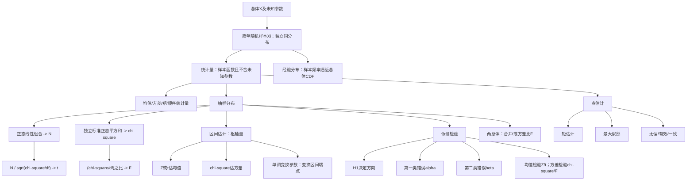
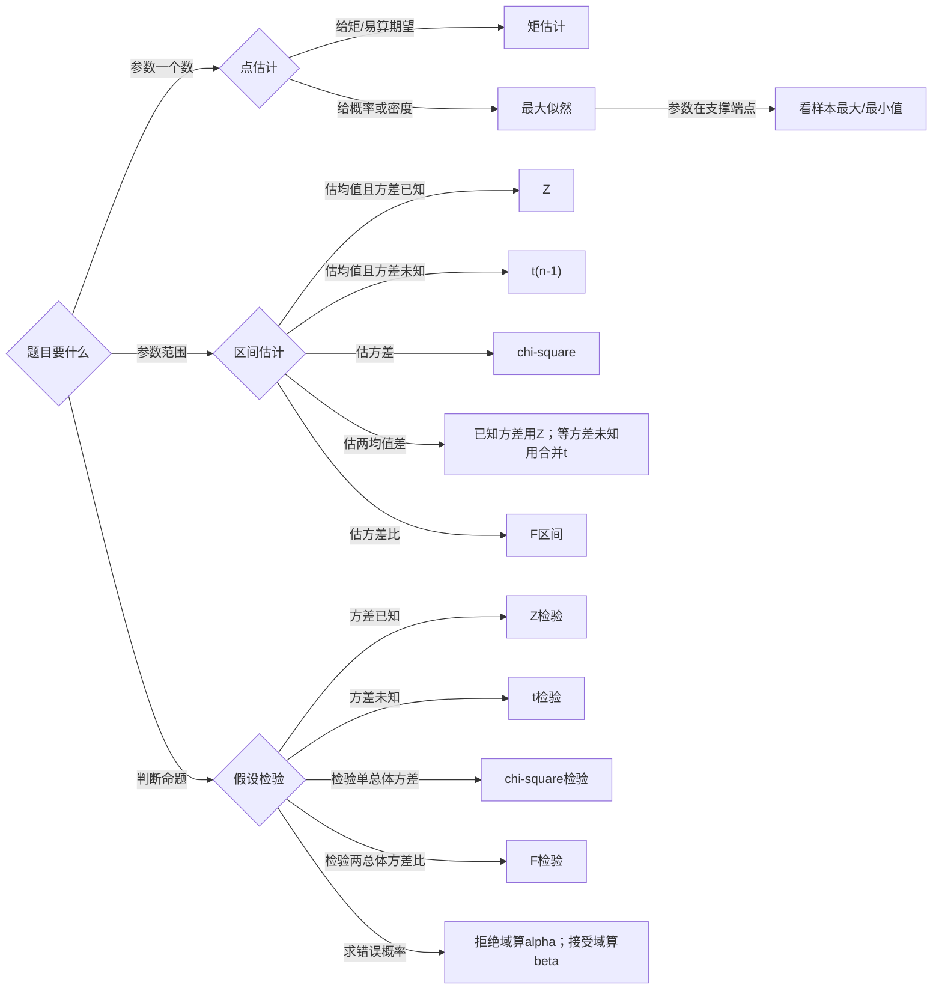

# 概率第6讲 数理统计

> [!info] 教材与核查范围
> 来源：`27张宇基础30讲概率.pdf`，印刷页133-163 / PDF p139-p169；`26余丙森《概率论与数理统计》辅导讲义.pdf`，基础篇印刷页63-79 / PDF p68-p84、强化篇印刷页132-150 / PDF p137-p155。
> 张宇31页与余丙森36页知识页均已逐页OCR和直接读图；余丙森PDF p156为宣传页，仅核查、不纳入笔记。已反查张宇例6.1-6.17、练习6.1-6.12，以及余丙森基础例6.1-6.5、7.1-7.7和强化例6.1-6.13、7.1-7.8、8.1-8.2。公式、分位点、自由度、拒绝域和参数范围均以高清原页为准。

## 本讲速览

- **主线是“总体未知 -> 抽取样本 -> 构造统计量 -> 利用抽样分布推断总体”**。统计量是工具，点估计、区间估计和假设检验是三种输出。
- **先判断统计量，再判断分布**：统计量不得含未知参数；正态总体下，\(\bar X\)、\(S^2\)及其组合分别导向\(N\)、\(\chi^2\)、\(t\)、\(F\)。
- **凑抽样分布不能只看外形**：必须完成正态量标准化、平方和除方差、卡方量除自由度、分子分母独立四项检查。
- **点估计先看参数怎样进入分布**：进入矩时用矩估计；进入概率或密度时用最大似然；进入支撑区间端点时，极值次序统计量常控制MLE。
- **区间估计的核心是枢轴量**：均值在方差已知时用\(Z\)，方差未知时用\(t\)；方差用\(\chi^2\)，并检查分母两端的分位点顺序。
- **假设检验由备择假设决定方向**：\(\ne\)双侧，\(>\)右侧，\(<\)左侧；不拒绝\(H_0\)不等于证明\(H_0\)正确。
- **单总体与双总体共用一套选择逻辑**：先认参数目标，再问哪些量已知；两均值在等方差未知时用合并\(t\)，两方差之比用\(F\)。

## 教材路线

| 教材内容 | 印刷页 / PDF页 | 复习任务 |
|---|---:|---|
| 基础结构、总体、样本与样本分布 | 133-135 / p139-p141 | 区分总体、样本、样本值和统计量 |
| 常用样本数字特征、顺序统计量 | 135-136 / p141-p142 | 掌握均值、方差、样本矩及极值分布 |
| \(\chi^2\)、\(t\)、\(F\)分布及性质 | 136-139 / p142-p145 | 从定义凑分布，识别自由度与独立性 |
| 正态总体统计量、例6.1-例6.6 | 139-142 / p145-p148 | 把正态样本化为四类抽样分布 |
| 点估计、矩估计、最大似然、评价标准 | 142-145 / p148-p151 | 区分估计量与估计值，掌握边界MLE |
| 例6.7-例6.12 | 145-151 / p151-p157 | 覆盖矩法、似然、不变性、无偏、有效、一致 |
| 区间估计、例6.13-例6.14 | 151-154 / p157-p160 | 掌握正态总体四类置信区间及大样本近似 |
| 假设检验、例6.15-例6.17 | 154-158 / p160-p164 | 掌握六类均值检验与两类错误 |
| 练习6.1-6.12及答案 | 158-163 / p164-p169 | 用全部练习反查定义、分布、估计与检验 |
| 余丙森基础篇：统计量与抽样分布 | 63-70 / p68-p75 | 样本二重性、三大分布、分位点、单双正态总体抽样分布；例6.1-6.5 |
| 余丙森基础篇：参数估计 | 71-79 / p76-p84 | 矩估计、MLE、评价标准、单双总体置信区间；例7.1-7.7 |
| 余丙森强化篇：统计量与估计 | 132-145 / p137-p150 | 统计量组合、经验分布、边界MLE、无偏有效、变换区间；例6.1-6.13、7.1-7.8 |
| 余丙森强化篇：假设检验 | 146-150 / p151-p155 | 两类错误、单总体均值/方差、双总体均值/方差检验；例8.1-8.2 |

## 前置知识与关联导航

- 独立性、联合分布与条件概率：[[27_概率第3讲_多维随机变量及其分布|多维随机变量及其分布]]。
- 期望、方差、协方差与切比雪夫不等式：[[28_概率第4讲_随机变量的数字特征#5. 方差与标准差|方差]]、[[28_概率第4讲_随机变量的数字特征#11. 切比雪夫不等式|切比雪夫不等式]]。
- 大数定律、中心极限定理和依概率收敛：[[29_概率第5讲_大数定律与中心极限定理#1. 依概率收敛|依概率收敛]]、[[29_概率第5讲_大数定律与中心极限定理#6. 独立同分布中心极限定理|中心极限定理]]。
- 经验分布函数及其依概率解释：[[29_概率第5讲_大数定律与中心极限定理#4.1 经验分布函数（仅数学三）|经验分布函数]]。
- 正态、均匀和指数分布：[[26_概率第2讲_一维随机变量及其分布#12. 正态分布|正态分布]]、[[26_概率第2讲_一维随机变量及其分布|一维随机变量及其分布]]。

> [!note] 统一记号
> \(X\)表示总体；\(X_1,\ldots,X_n\)表示随机样本；\(x_1,\ldots,x_n\)表示一次抽样得到的样本值。\(\mu=EX\)，\(\sigma^2=DX\)。本书采用上侧分位点，如\(P\{Z>z_\alpha\}=\alpha\)、\(P\{\chi^2(\nu)>\chi^2_\alpha(\nu)\}=\alpha\)。

## 知识网络

## 知识点清单

## 一、总体与样本

### 1. 总体、样本与简单随机样本

#### 总体、样本与样本值

- **总体**：研究对象某项数量指标的全体；概率语言中用随机变量\(X\)及其分布描述。
- **样本**：从总体中抽取的随机变量组\(X_1,\ldots,X_n\)，\(n\)为样本容量。
- **样本值**：一次抽样后得到的具体数\(x_1,\ldots,x_n\)。

\(\bar X\)是随机变量，\(\bar x\)是本次样本算出的具体数，二者不能混写。

样本具有**二重性**：抽样前，\((X_1,\ldots,X_n)\)是随机向量；抽样后，\((x_1,\ldots,x_n)\)是一组确定数据。“随机性”用于研究抽样分布，“确定性”用于算本次统计值。

#### 简单随机样本与样本分布

\(X_1,\ldots,X_n\)来自总体\(X\)的简单随机样本，当且仅当：

1. \(X_1,\ldots,X_n\)相互独立；
2. 每个\(X_i\)都与总体\(X\)同分布。

\[
X_1,\ldots,X_n\overset{\mathrm{iid}}{\sim}X.
\]

若总体分布函数为\(F(x)\)，则

\[
F_{X_1,\ldots,X_n}(x_1,\ldots,x_n)=\prod_{i=1}^{n}F(x_i).
\]

离散总体概率函数为\(p(x)\)时，

\[
P\{X_1=x_1,\ldots,X_n=x_n\}=\prod_{i=1}^{n}p(x_i).
\]

连续总体密度为\(f(x)\)时，

\[
f_{X_1,\ldots,X_n}(x_1,\ldots,x_n)=\prod_{i=1}^{n}f(x_i).
\]

**看到什么想到它：** “简单随机样本”立刻翻译成独立同分布；后续乘概率、乘密度、方差相加均依赖独立性。

## 二、统计量及其分布

### 2. 统计量

#### 定义与判定

由样本构成且**不含任何未知参数**的函数

\[
T=T(X_1,\ldots,X_n)
\]

称为统计量。统计量是随机变量；代入样本值后的\(T(x_1,\ldots,x_n)\)才是具体观测值。

> [!warning] 练习6.1判题规则
> 只检查两点：是否为样本函数，是否含未知参数。已知常数或已知参数可以出现；未知的\(\mu,\sigma,\theta\)一旦出现，就不是统计量。

#### 常用样本数字特征

\[
\bar X=\frac1n\sum_{i=1}^{n}X_i,
\]

\[
S^2=\frac1{n-1}\sum_{i=1}^{n}(X_i-\bar X)^2,
\qquad S=\sqrt{S^2},
\]

\[
A_k=\frac1n\sum_{i=1}^{n}X_i^k,
\qquad
B_k=\frac1n\sum_{i=1}^{n}(X_i-\bar X)^k.
\]

常用恒等式：

\[
\sum_{i=1}^{n}(X_i-\bar X)=0,
\]

\[
\sum_{i=1}^{n}(X_i-\bar X)^2
=\sum_{i=1}^{n}X_i^2-n\bar X^2,
\]

\[
S^2=\frac1{n-1}\left(\sum_{i=1}^{n}X_i^2-n\bar X^2\right).
\]

若\(EX=\mu\)、\(DX=\sigma^2<\infty\)，则无需总体正态也有

\[
E\bar X=\mu,\qquad D\bar X=\frac{\sigma^2}{n},\qquad ES^2=\sigma^2.
\]

所以\(S^2\)是\(\sigma^2\)的无偏估计；而

\[
B_2=\frac1n\sum(X_i-\bar X)^2
\]

满足

\[
EB_2=\frac{n-1}{n}\sigma^2,
\]

通常有偏。

处理“某个样本与样本均值混在一起”的题，可直接调用

\[
\operatorname{Cov}(X_i,\bar X)=\frac{\sigma^2}{n},
\qquad
E(X_i\bar X)=\mu^2+\frac{\sigma^2}{n},
\]

\[
\operatorname{Cov}(X_i+X_j,\bar X)=\frac{2\sigma^2}{n}\quad(i\ne j),
\qquad
D(X_i-\bar X)=\frac{n-1}{n}\sigma^2.
\]

这些式子只用到样本独立同分布和二阶矩存在，不要求总体正态。

#### 例6.1：离均差的方差

对\(Y_i=X_i-\bar X\)，\(\bar X\)中含有\(X_i\)，二者不独立。用

\[
\operatorname{Cov}(X_i,\bar X)=\frac{\sigma^2}{n}
\]

得

\[
D(X_i-\bar X)
=\sigma^2+\frac{\sigma^2}{n}-2\frac{\sigma^2}{n}
=\frac{n-1}{n}\sigma^2.
\]

例题中\(\sigma^2=1\)，故\(DY_i=(n-1)/n\)。

#### 例6.2：组合统计量的期望

题设\(EX=0\)，

\[
S_k^2=\frac nk\bar X^2+\frac1kS^2.
\]

由

\[
E\bar X^2=D\bar X+(E\bar X)^2=\frac{\sigma^2}{n},
\qquad ES^2=\sigma^2,
\]

得

\[
E(S_k^2)=\frac2k\sigma^2.
\]

要无偏估计\(\sigma^2\)，取\(k=2\)。

**看到什么想到它：** 求平方统计量的期望，先用\(EZ^2=DZ+(EZ)^2\)，不要误写为\((EZ)^2\)。

### 3. 顺序统计量

将样本从小到大排列：

\[
X_{(1)}\le X_{(2)}\le\cdots\le X_{(n)}.
\]

其中

\[
X_{(1)}=\min_iX_i,\qquad X_{(n)}=\max_iX_i.
\]

若总体分布函数为\(F(x)\)，由独立性：

\[
F_{X_{(n)}}(x)
=P(X_1\le x,\ldots,X_n\le x)
=[F(x)]^n,
\]

\[
F_{X_{(1)}}(x)
=1-P(X_1>x,\ldots,X_n>x)
=1-[1-F(x)]^n.
\]

若总体连续且密度为\(f(x)\)，则

\[
f_{X_{(n)}}(x)=n[F(x)]^{n-1}f(x),
\]

\[
f_{X_{(1)}}(x)=n[1-F(x)]^{n-1}f(x).
\]

**看到什么想到它：**

- “全部不超过\(x\)”对应最大值的CDF。
- “至少一个不超过\(x\)”先取补集，得到最小值的CDF。
- 参数是支撑区间上端点时，MLE常由\(X_{(n)}\)控制；是下端点时，常由\(X_{(1)}\)控制。

余丙森基础例6.1和强化例6.1分别用“至少一个小于阈值”和“最大值超过阈值”训练同一入口：先把事件改写成“全部满足”，利用独立性乘方，再按需取补集。均匀总体上尤其可直接写\([F(x)]^n\)。

### 4. 三大抽样分布

#### \(\chi^2\)分布

若\(Z_1,\ldots,Z_\nu\)相互独立且均服从\(N(0,1)\)，则

\[
Q=\sum_{i=1}^{\nu}Z_i^2\sim\chi^2(\nu).
\]

\(\nu\)为自由度，且

\[
EQ=\nu,\qquad DQ=2\nu.
\]

若\(Q_1\sim\chi^2(\nu_1)\)、\(Q_2\sim\chi^2(\nu_2)\)且独立，则

\[
Q_1+Q_2\sim\chi^2(\nu_1+\nu_2).
\]

上侧分位点定义为

\[
P\{\chi^2(\nu)>\chi^2_\alpha(\nu)\}=\alpha.
\]

#### \(t\)分布

若

\[
Z\sim N(0,1),\qquad Q\sim\chi^2(\nu),
\]

且\(Z,Q\)相互独立，则

\[
T=\frac{Z}{\sqrt{Q/\nu}}\sim t(\nu).
\]

\(t\)分布关于0对称，当期望存在时\(ET=0\)，且

\[
t_{1-\alpha}(\nu)=-t_\alpha(\nu).
\]

#### \(F\)分布

若\(Q_1\sim\chi^2(\nu_1)\)、\(Q_2\sim\chi^2(\nu_2)\)且独立，则

\[
F=\frac{Q_1/\nu_1}{Q_2/\nu_2}\sim F(\nu_1,\nu_2).
\]

自由度有顺序：分子对应\(\nu_1\)，分母对应\(\nu_2\)。重要性质：

\[
F\sim F(\nu_1,\nu_2)
\Longrightarrow
\frac1F\sim F(\nu_2,\nu_1),
\]

\[
F_{1-\alpha}(\nu_1,\nu_2)
=\frac1{F_\alpha(\nu_2,\nu_1)},
\]

\[
T\sim t(\nu)\Longrightarrow T^2\sim F(1,\nu).
\]

按本讲的上侧分位点记号，还有两条高频恒等式：

\[
\chi^2_\alpha(1)=z_{\alpha/2}^2,
\qquad
F_\alpha(1,\nu)=t_{\alpha/2}^2(\nu).
\]

若\(P(|Z|<x)=\gamma\)，则两侧尾概率均为\((1-\gamma)/2\)，所以

\[
x=z_{(1-\gamma)/2}.
\]

不要把区间内概率\(\gamma\)直接写进上侧分位点下标。

#### “凑定义”的统一流程

1. **分子标准化**：正态线性组合先减均值、除标准差，化为\(N(0,1)\)。
2. **平方和标准化**：每项先除标准差，确认是独立标准正态平方和。
3. **按自由度归一**：凑\(t\)时分母是\(\sqrt{\chi^2(\nu)/\nu}\)；凑\(F\)时上下都要除自由度。
4. **检查独立性**：分子、分母若使用重叠样本，不能仅凭外形套\(t\)或\(F\)。

> [!note] 样本下标重叠不必然不独立
> 若原变量联合正态，可进一步检查协方差。例如独立同方差正态变量\(X_1,X_2\)的\(X_1-X_2\)与\(X_1+X_2\)协方差为0，且二者联合正态，因此独立；这正是余丙森强化例6.7中重叠样本仍能凑\(t(1)\)的理由。非正态情形不能只凭协方差为0推出独立。

#### 例6.3-例6.6的迁移规则

- **例6.3**：\(X_1-2X_2\sim N(0,20)\)，\(3X_3-4X_4\sim N(0,100)\)，且二者独立。要成为\(\chi^2(2)\)，系数分别为\(1/20,1/100\)，故\(ab=1/2000\)。
- **例6.4**：分子线性组合标准化为\(N(0,1)\)，分母由4个独立标准正态平方构成\(\chi^2(4)\)，且两部分样本下标不重叠，故凑成\(t(4)\)。
- **例6.5**：前10项和后5项平方和分别凑\(\chi^2(10)\)、\(\chi^2(5)\)，再按自由度归一，得到\(F(10,5)\)。
- **例6.6**：由\(X\sim t(n)\)知\(X^2\sim F(1,n)\)。若\(P(X>c)=\alpha\)，则

\[
P(Y>c^2)=P(X^2>c^2)=P(|X|>c)=2\alpha.
\]

> [!warning] 同分布不等于相等
> 例6.6只能说\(Y\)与\(X^2\)同分布，不能说\(Y=X^2\)。例如\(X\sim U(0,1)\)时，\(1-X\)与\(X\)同分布，但通常不相等。

### 5. 正态总体下的常用统计量

设\(X_1,\ldots,X_n\)来自\(N(\mu,\sigma^2)\)。

#### 样本均值

\[
\bar X\sim N\left(\mu,\frac{\sigma^2}{n}\right),
\qquad
\frac{\sqrt n(\bar X-\mu)}{\sigma}\sim N(0,1).
\]

#### 围绕已知总体均值的平方和

\[
\frac1{\sigma^2}\sum_{i=1}^{n}(X_i-\mu)^2
\sim\chi^2(n).
\]

中心是已知真均值\(\mu\)，没有估计参数，自由度为\(n\)。

#### 围绕样本均值的平方和

\[
\frac1{\sigma^2}\sum_{i=1}^{n}(X_i-\bar X)^2
=\frac{(n-1)S^2}{\sigma^2}
\sim\chi^2(n-1).
\]

用样本估计了均值，且偏差和为0，故损失1个自由度。

#### 均值与样本方差独立

正态总体下，

\[
\bar X\perp S^2.
\]

因此

\[
\frac{\sqrt n(\bar X-\mu)}{S}
=\frac{\bar X-\mu}{S/\sqrt n}
\sim t(n-1),
\]

并有

\[
\frac{n(\bar X-\mu)^2}{S^2}\sim F(1,n-1).
\]

后一式就是\(t(n-1)\)统计量的平方。

若已知\(\sigma\)，并要求

\[
P(|\bar X-\mu|\le d)\ge1-\alpha,
\]

则

\[
n\ge\left(\frac{z_{\alpha/2}\sigma}{d}\right)^2,
\]

样本容量必须向上取整。余丙森强化例6.11就是先标准化再反解\(n\)。

> [!warning] 使用边界
> \(\bar X\perp S^2\)、精确的\(\chi^2\)与\(t\)结论依赖总体正态。一般总体只能在大样本下借助中心极限定理得到近似结论。

### 6. 两个正态总体的常用统计量

设两组样本相互独立：

\[
X_1,\ldots,X_m\overset{\mathrm{iid}}{\sim}N(\mu_X,\sigma_X^2),
\qquad
Y_1,\ldots,Y_n\overset{\mathrm{iid}}{\sim}N(\mu_Y,\sigma_Y^2).
\]

样本均值之差：

\[
\bar X-\bar Y
\sim N\left(
\mu_X-\mu_Y,\,
\frac{\sigma_X^2}{m}+\frac{\sigma_Y^2}{n}
\right).
\]

样本方差：

\[
\frac{(m-1)S_X^2}{\sigma_X^2}\sim\chi^2(m-1),
\qquad
\frac{(n-1)S_Y^2}{\sigma_Y^2}\sim\chi^2(n-1).
\]

两式独立，故

\[
\frac{S_X^2/\sigma_X^2}{S_Y^2/\sigma_Y^2}
=\frac{\sigma_Y^2S_X^2}{\sigma_X^2S_Y^2}
\sim F(m-1,n-1).
\]

若两总体方差相等但未知，记合并样本方差

\[
S_w^2=
\frac{(m-1)S_X^2+(n-1)S_Y^2}{m+n-2}.
\]

则

\[
ES_w^2=\sigma^2,
\qquad
\frac{(m+n-2)S_w^2}{\sigma^2}\sim\chi^2(m+n-2),
\]

\[
\frac{(\bar X-\bar Y)-(\mu_X-\mu_Y)}
{S_w\sqrt{1/m+1/n}}
\sim t(m+n-2).
\]

**自由度为什么相加：** 两组围绕各自样本均值的平方离差和分别损失1个自由度，故总自由度为\((m-1)+(n-1)=m+n-2\)，不是\(m+n\)。

> [!tip] 先把线性组合看成“新样本”
> 若把独立正态样本两两相加，\(U_i=X_{2i-1}+X_{2i}\)仍独立同分布，且\(U_i\sim N(2\mu,2\sigma^2)\)。余丙森强化例6.5据此把复杂平方离差和还原为普通样本方差题；先识别新总体的均值、方差和容量，再套抽样分布。

**练习6.4：** 若\(\sigma_X^2=4,m=8,\sigma_Y^2=5,n=10\)，则

\[
\frac{5S_X^2}{4S_Y^2}\sim F(7,9).
\]

**练习6.2：** 若两总体独立且都为\(N(\mu,\sigma^2)\)，样本容量均为\(n\)，则

\[
\bar X-\bar Y\sim N\left(0,\frac{2\sigma^2}{n}\right).
\]

将\(|\bar X-\bar Y|>\sigma\)标准化后阈值为\(\sqrt{n/2}\)，\(\sigma\)消去，所以概率不随\(\sigma\)改变。

### 6A. 经验分布函数（仅数学三）

对样本\(X_1,\ldots,X_n\)，经验分布函数为

\[
F_n(x)=\frac1n\sum_{i=1}^{n}I\{X_i\le x\}
=\frac{\#\{X_i\le x\}}n.
\]

它是右连续阶梯函数：每遇到一个不同样本值，按该值出现频数除以\(n\)向上跳。端点必须按“\(\le x\)”计数。余丙森强化例6.13给出重复样本值，考的正是跳跃高度而非只数不同取值；完整概率解释见[[29_概率第5讲_大数定律与中心极限定理#4.1 经验分布函数（仅数学三）|经验分布函数]]。

## 三、参数的点估计

点估计是用样本构造一个数去逼近未知参数。若

\[
\hat\theta=\hat\theta(X_1,\ldots,X_n),
\]

则\(\hat\theta\)称为\(\theta\)的**估计量**；代入样本值所得

\[
\hat\theta(x_1,\ldots,x_n)
\]

称为**估计值**。估计量是随机变量，估计值是具体数，未知参数\(\theta\)则是客观但未知的固定量。

### 7. 矩估计

#### 基本思想

用样本原点矩逼近相应总体原点矩：

\[
A_k=\frac1n\sum_{i=1}^{n}X_i^k
\quad\longleftrightarrow\quad
EX^k.
\]

若只有一个参数，优先令

\[
\bar X=EX
\]

并解出参数；若一阶矩中不含参数或难以求解，再用

\[
\frac1n\sum_{i=1}^{n}X_i^2=EX^2.
\]

若有\(m\)个未知参数，一般联立

\[
\frac1n\sum_{i=1}^{n}X_i^k=EX^k,
\qquad k=1,\ldots,m.
\]

> [!important] 教材的低阶矩原则
> 矩的阶数不能任取。求一个参数时，应取**能解出参数的最低阶矩**；能用一阶就不先用二阶。高阶矩通常计算更繁、波动更大。

#### 标准步骤

1. 根据总体分布计算\(EX,EX^2,\ldots\)；
2. 选足够且尽量低阶的矩；
3. 令总体矩等于样本矩；
4. 解出\(\hat\theta\)，再检查参数取值范围。

余丙森基础例7.1给出

\[
f(x;\theta)=\frac{2x}{\theta^2},\qquad 0<x<\theta.
\]

由\(EX=2\theta/3\)，立刻得到\(\hat\theta_M=3\bar X/2\)。这类“参数既在系数又在支撑端点”的题，矩估计只需积分求矩；到MLE时才必须把支撑条件写进似然。

#### 例6.7：离散总体的一阶矩估计

由题设概率表算得

\[
EX=3-4\theta.
\]

令\(EX=\bar X\)，得矩估计量

\[
\hat\theta_M=\frac{3-\bar X}{4}.
\]

给定样本的\(\bar x=2\)，所以矩估计值为\(1/4\)。

#### 例6.9：均匀区间下端点

若\(X\sim U(\theta,1)\)，则

\[
EX=\frac{1+\theta}{2}.
\]

令\(\bar X=(1+\theta)/2\)，得

\[
\hat\theta_M=2\bar X-1.
\]

#### 练习6.9：估计量的方差

密度为

\[
f(x;\theta)=\frac{6x}{\theta^3}(\theta-x),
\qquad 0<x<\theta.
\]

计算得

\[
EX=\frac{\theta}{2},
\qquad
EX^2=\frac{3\theta^2}{10},
\qquad
DX=\frac{\theta^2}{20}.
\]

故矩估计量与方差为

\[
\hat\theta=2\bar X,
\qquad
D\hat\theta=4D\bar X=\frac{\theta^2}{5n}.
\]

**看到什么想到它：** 题目同时问“矩估计量的方差”，先由矩方程找\(\hat\theta\)，再算总体方差并用\(D\bar X=DX/n\)。

#### 练习6.10：幂密度

若

\[
f(x;\theta)=(1+\theta)x^\theta,
\qquad 0<x<1,\quad\theta>-1,
\]

则

\[
EX=\frac{1+\theta}{2+\theta}.
\]

令\(EX=\bar X\)，解得

\[
\hat\theta_M=\frac{2\bar X-1}{1-\bar X}.
\]

#### 余丙森补充：正态参数的矩估计口径

余丙森按**原点矩从低阶到高阶**处理\(N(\mu,\sigma^2)\)：

| 未知参数 | 使用的矩方程 | 矩估计量 |
|---|---|---|
| \(\mu\)，\(\sigma^2\)已知 | \(EX=\mu=\bar X\) | \(\hat\mu_M=\bar X\) |
| \(\sigma^2\)，\(\mu\)已知 | \(EX^2=\mu^2+\sigma^2=A_2\) | \(\hat\sigma_M^2=n^{-1}\sum X_i^2-\mu^2\) |
| \(\mu,\sigma^2\)均未知 | \(EX=\bar X,EX^2=A_2\) | \(\hat\mu_M=\bar X,\ \hat\sigma_M^2=n^{-1}\sum(X_i-\bar X)^2\) |

第二行是“原点矩法”的教材口径，不能误写成MLE的\(n^{-1}\sum(X_i-\mu)^2\)。矩估计也不保证估计值自动落在参数空间内，遇到负的方差矩估计值要先识别方法局限，而不是擅自改公式。

两本教材的幂密度只差一次参数平移，放在一起最容易记：

| 密度 | 矩估计 | 最大似然估计 |
|---|---|---|
| \(\theta x^{\theta-1},\ 0<x<1,\theta>0\) | \(\bar X/(1-\bar X)\) | \(-n/\sum\ln X_i\) |
| \((1+\theta)x^\theta,\ 0<x<1,\theta>-1\) | \((2\bar X-1)/(1-\bar X)\) | \(-n/\sum\ln X_i-1\) |

**看到什么想到它：** 指数写成“参数减1”时常设新参数\(a=\theta\)；写成“参数本身”时相当于\(a=1+\theta\)。先读清密度，不能背一个式子通吃。

### 8. 最大似然估计

#### 直观与似然函数

最大似然法选择参数值，使“已经观察到这组样本”的概率或联合密度最大。

离散总体：

\[
L(\theta)
=\prod_{i=1}^{n}p(x_i;\theta).
\]

连续总体：

\[
L(\theta)
=\prod_{i=1}^{n}f(x_i;\theta).
\]

因样本独立同分布，似然才能写成同一概率函数或密度的乘积。常取对数：

\[
\ell(\theta)=\ln L(\theta)
=\sum_{i=1}^{n}\ln p(x_i;\theta)
\]

或

\[
\ell(\theta)=\sum_{i=1}^{n}\ln f(x_i;\theta).
\]

#### 三种求最大值情形

1. **内部有驻点**：解\(\ell'(\theta)=0\)，并检查参数范围；必要时用二阶导或单调性验证。
2. **无驻点、函数单调**：回到参数允许区间，在边界处取最大。
3. **似然为常数**：按定义判断，MLE可能不唯一。

> [!warning] 似然函数不能漏支撑集
> 若密度的非零区间依赖参数，必须把“所有样本值均落在支撑集内”的条件写进\(L(\theta)\)。这类题的最大值常由样本最大值或最小值决定，盲目求导会漏解。

#### 最大似然估计的不变性

若\(\hat\theta\)是\(\theta\)的MLE，且教材条件下\(u=u(\theta)\)可逆，则

\[
\widehat{u(\theta)}=u(\hat\theta).
\]

因此先估计基础参数，再代入目标函数；不要为\(u(\theta)\)重写一遍似然。

#### 正态总体的MLE模板

对正态样本，直接记住“使残差平方和最小”的结构：

| 未知参数 | MLE |
|---|---|
| \(\mu\)，\(\sigma^2\)已知 | \(\hat\mu_L=\bar X\) |
| \(\sigma^2\)，\(\mu\)已知 | \(\hat\sigma_L^2=n^{-1}\sum(X_i-\mu)^2\) |
| \(\mu,\sigma^2\)均未知 | \(\hat\mu_L=\bar X,\ \hat\sigma_L^2=n^{-1}\sum(X_i-\bar X)^2\) |

最后一个方差MLE等于\((n-1)S^2/n\)，分母是\(n\)，所以它通常有偏；不要和分母为\(n-1\)的无偏样本方差\(S^2\)混淆。

#### 例6.7：频数合并与参数范围

样本中各取值出现的次数代入概率表后，

\[
L(\theta)
=4\theta^6(1-\theta)^2(1-2\theta)^4,
\qquad 0<\theta<\frac12.
\]

对数求导得到方程

\[
12\theta^2-14\theta+3=0.
\]

两根为

\[
\frac{7\pm\sqrt{13}}{12}.
\]

其中正号根超过\(1/2\)，不合参数范围，故

\[
\hat\theta_L=\frac{7-\sqrt{13}}{12}.
\]

教材进一步用\(\ell''(\theta)<0\)验证该点为最大值。**似然方程的根不是自动答案，必须先过参数范围。**

#### 例6.8：先求分布，再用不变性

分布函数满足

\[
F'(t)+\frac{2t}{\theta^2}[F(t)-1]=0,\qquad F(0)=0.
\]

解得

\[
F(t)=1-e^{-t^2/\theta^2},\qquad t\ge0,
\]

故生存函数与密度为

\[
P(T>t)=e^{-t^2/\theta^2},
\]

\[
f(t;\theta)=\frac{2t}{\theta^2}e^{-t^2/\theta^2},
\qquad t>0.
\]

条件概率用生存函数作比：

\[
P(T>s+t\mid T>s)
=\frac{P(T>s+t)}{P(T>s)}
=e^{-(t^2+2st)/\theta^2}.
\]

对样本\(t_1,\ldots,t_n\)，

\[
\ell(\theta)
=n\ln2-2n\ln\theta+\sum_{i=1}^{n}\ln t_i
-\frac1{\theta^2}\sum_{i=1}^{n}t_i^2,
\]

从而

\[
\hat\theta
=\sqrt{\frac1n\sum_{i=1}^{n}T_i^2}.
\]

题中性能函数

\[
Q(\theta)=\frac{\theta^2}{2}\ln\theta-\frac34\theta^2+\theta
\]

在\(\theta>1\)上单调递增，故

\[
\hat Q=Q(\hat\theta).
\]

**迁移：** 题目先让你由微分方程求CDF，目的是得到密度；最后估计复合函数时，才使用MLE不变性。

#### 例6.9：参数进入支撑集

\(X\sim U(\theta,1)\)时

\[
L(\theta)=\frac1{(1-\theta)^n},
\qquad \theta\le X_{(1)}.
\]

似然随\(\theta\)增大而增大，所以最大允许值是

\[
\hat\theta_L=X_{(1)}=\min_iX_i.
\]

#### 练习6.5、6.10、6.11反查

- **练习6.5**：按取值频数合并，\(L(\theta)\propto(1-\theta)^3(1+\theta)^5\)，故\(\hat\theta=1/4\)。
- **练习6.10**：

\[
\ell(\theta)=n\ln(1+\theta)+\theta\sum_{i=1}^{n}\ln X_i,
\]

\[
\hat\theta_L=-\frac{n}{\sum_{i=1}^{n}\ln X_i}-1.
\]

因\(0<X_i<1\)，有\(\sum\ln X_i<0\)，可用于检查\(\hat\theta>-1\)。
- **练习6.11**：密度支撑为\(0\le x\le a\)，似然要求\(a\ge X_{(n)}\)，且随\(a\)单调减，因此

\[
\hat a=X_{(n)}.
\]

又\(p=P(0<X<\sqrt a)=1/a\)，由不变性

\[
\hat p=\frac1{X_{(n)}}.
\]

#### 余丙森强化：边界、约束与离散参数

- \(X\sim U(1,\theta)\)时，\(L(\theta)=(\theta-1)^{-n}I\{\theta\ge X_{(n)}\}\)在可行域递减，故\(\hat\theta_L=X_{(n)}\)；矩估计为\(2\bar X-1\)。这与\(U(\theta,1)\)取最小值形成镜像。
- Pareto型分布\(F(x)=1-(\alpha/x)^\beta\ (x\ge\alpha)\)：已知\(\alpha=1\)、\(\beta>1\)时，\(\hat\beta_M=\bar X/(\bar X-1)\)，\(\hat\beta_L=n/\sum\ln X_i\)；已知\(\beta=2\)时，支撑条件给\(\hat\alpha_L=X_{(1)}\)。同一模型中“形状参数”走求导，“端点参数”走极值。
- 多参数密度若受归一化条件约束，先由\(\int f=1\)消去一个参数，再最大化；不能把受约束参数当成彼此独立分别求导。
- 参数代表“球的总数”等离散量时，可先求连续参数下的候选点，再在允许的整数点比较似然；简单四舍五入不一定保持似然最大。
- 求\(P_\theta(A)\)等参数函数的MLE，先求基础参数MLE，再用不变性代入；事件概率仍要按原分布和支撑区间分段计算。

### 9. 估计量的评价标准

#### 无偏性

若对参数空间内每个\(\theta\)都有

\[
E_\theta(\hat\theta)=\theta,
\]

则\(\hat\theta\)是\(\theta\)的无偏估计量。

无偏只说明长期平均对准参数，不说明单次误差小。

若仅有

\[
\lim_{n\to\infty}E\hat\theta_n=\theta,
\]

则称为**渐近无偏**，不等于每个有限\(n\)下都无偏。并且非线性变换通常不保持无偏：即使\(E\hat\theta=\theta\)，一般也不能推出\(E[g(\hat\theta)]=g(\theta)\)。例如\(E\bar X^2=\mu^2+\sigma^2/n\)，所以\(\bar X^2\)不是\(\mu^2\)的无偏估计。

#### 有效性（最小方差性）

若\(\hat\theta_1,\hat\theta_2\)都是\(\theta\)的无偏估计量，且

\[
D\hat\theta_1<D\hat\theta_2,
\]

则\(\hat\theta_1\)比\(\hat\theta_2\)有效。

> [!warning] 前提不能漏
> 先验证两者无偏，再比较方差；不能拿一个有偏估计量直接参加教材定义下的有效性比较。

对无偏线性估计\(\hat\mu=\sum a_iX_i\)，约束为\(\sum a_i=1\)。由

\[
\sum_{i=1}^{n}a_i^2\ge\frac1n\left(\sum_{i=1}^{n}a_i\right)^2=\frac1n,
\]

等权\(a_i=1/n\)使方差最小，因此样本均值是此类估计中最有效的。

#### 一致性（相合性）

\(\hat\theta_n\)是\(\theta\)的一致估计量，当对任意\(\varepsilon>0\)，

\[
\lim_{n\to\infty}
P\{|\hat\theta_n-\theta|\ge\varepsilon\}=0,
\]

等价地

\[
\hat\theta_n\xrightarrow{P}\theta.
\]

常用证明路线：

1. 先求\(E\hat\theta_n\)，判断其是否趋于\(\theta\)；
2. 求\(D\hat\theta_n\)，若趋于0；
3. 用切比雪夫不等式压住偏离概率。

特别地，若\(E\hat\theta_n=\theta\)且\(D\hat\theta_n\to0\)，则

\[
P(|\hat\theta_n-\theta|\ge\varepsilon)
\le\frac{D\hat\theta_n}{\varepsilon^2}\to0.
\]

教材注明：数学一重点是无偏、有效、一致；数学三还直接考估计量的期望、方差和依概率收敛计算。

#### 例6.10：相邻差平方的无偏系数

\[
D=k\sum_{i=1}^{n-1}(X_{i+1}-X_i)^2.
\]

独立同分布给出

\[
E(X_{i+1}-X_i)^2=2\sigma^2,
\]

所以

\[
ED=2k(n-1)\sigma^2.
\]

令\(ED=\sigma^2\)，得

\[
k=\frac1{2(n-1)}.
\]

相邻差之间并不相互独立，但本题只用期望的线性性，不需要它们独立。

#### 例6.11：线性估计量的无偏与有效

若

\[
\hat\mu=\sum_{i=1}^{n}a_iX_i,
\]

则

\[
E\hat\mu=\mu\sum a_i.
\]

故系数和为1时无偏。样本独立时

\[
D\hat\mu=\sigma^2\sum a_i^2.
\]

教材三个估计量的方差分别为

\[
\frac{19}{50}\sigma^2,\qquad
\frac{25}{72}\sigma^2,\qquad
\frac7{18}\sigma^2,
\]

因此第二个估计量方差最小、最有效。

#### 例6.12：加权估计量的一致性

\[
Y_n=\frac{2}{n(n+1)}\sum_{i=1}^{n}iX_i.
\]

利用\(\sum i=n(n+1)/2\)，得

\[
EY_n=\mu.
\]

又

\[
DY_n
=\frac{4\sigma^2}{n^2(n+1)^2}\sum_{i=1}^{n}i^2
=\frac23\frac{2n+1}{n(n+1)}\sigma^2
\to0.
\]

由切比雪夫不等式，

\[
Y_n\xrightarrow{P}\mu.
\]

#### 讲末练习中的无偏反查

- **练习6.8**：\(ES^2=DX\)。对\(f(x)=\tfrac12e^{-|x|}\)，由对称性\(EX=0\)，且\(EX^2=2\)，故\(ES^2=2\)。
- **练习6.12**：

\[
T=\bar X^2-\frac1nS^2.
\]

因为

\[
E\bar X^2=\frac{\sigma^2}{n}+\mu^2,
\qquad ES^2=\sigma^2,
\]

所以

\[
ET=\mu^2.
\]

这类题的本质是用样本方差校正\(E\bar X^2\)中的\(\sigma^2/n\)偏差。

#### 余丙森例7.7：极值估计的偏差校正

若\(X=\theta+Y\)，其中\(Y\sim E(2)\)，则

\[
X_{(1)}=\theta+Y_{(1)},
\qquad
Y_{(1)}\sim E(2n).
\]

故

\[
EX_{(1)}=\theta+\frac1{2n}.
\]

所以\(X_{(1)}\)对\(\theta\)有正偏，而\(X_{(1)}-1/(2n)\)才无偏。**看到平移指数总体的端点参数，想到“最小值仍为指数，速率乘样本量”。**

## 四、参数的区间估计（数学一）

### 10. 区间估计基本概念

点估计只给一个数，不能直接反映误差范围；区间估计用两个统计量

\[
\hat\theta_1(X_1,\ldots,X_n),
\qquad
\hat\theta_2(X_1,\ldots,X_n)
\]

构造随机区间，使

\[
P\{\hat\theta_1<\theta<\hat\theta_2\}=1-\alpha.
\]

则\((\hat\theta_1,\hat\theta_2)\)称为\(\theta\)的置信水平\(1-\alpha\)的置信区间；\(\hat\theta_1,\hat\theta_2\)分别为置信下限和置信上限；\(\alpha\)为显著性水平。

若两侧漏出的概率相等：

\[
P(\theta<\hat\theta_1)
=P(\theta>\hat\theta_2)
=\frac{\alpha}{2},
\]

则称为等尾置信区间。

#### 构造区间的统一方法

1. 找含参数\(\theta\)和样本统计量、但分布不再含未知参数的**枢轴量**\(G\)；
2. 选分位点\(a,b\)，使\(P(a<G<b)=1-\alpha\)；
3. 把不等式反解为\(\hat\theta_1<\theta<\hat\theta_2\)；
4. 检查分位点定义、自由度和端点顺序。

若\((L,U)\)是\(\theta\)的置信区间，且目标参数\(\eta=g(\theta)\)：

- \(g\)严格递增时，\(\eta\)的区间为\((g(L),g(U))\)；
- \(g\)严格递减时，端点要交换，为\((g(U),g(L))\)。

余丙森强化例7.8先对\(Y=\ln X\sim N(\mu,1)\)构造\(\mu\)的区间，再由\(EX=e^{\mu+1/2}\)对两端作递增变换。**先估基础参数，再变换整个区间；不能只变换点估计后沿用原半宽。**

> [!warning] 正确理解置信度
> 参数\(\theta\)是固定的，随机的是区间。重复抽样并按同一方法构造区间，约有\(1-\alpha\)比例的区间覆盖\(\theta\)。不能把已经算出的固定区间解释为“参数有\(1-\alpha\)概率落在其中”。

### 11. 正态总体均值的置信区间

设\(X_1,\ldots,X_n\)来自\(N(\mu,\sigma^2)\)。

#### 情形一：\(\sigma^2\)已知

\[
Z=\frac{\bar X-\mu}{\sigma/\sqrt n}\sim N(0,1).
\]

由\(P(|Z|<z_{\alpha/2})=1-\alpha\)，得

\[
\boxed{
\left(
\bar X-z_{\alpha/2}\frac{\sigma}{\sqrt n},
\bar X+z_{\alpha/2}\frac{\sigma}{\sqrt n}
\right)
}.
\]

半宽和区间长度：

\[
\Delta=z_{\alpha/2}\frac{\sigma}{\sqrt n},
\qquad
L=2z_{\alpha/2}\frac{\sigma}{\sqrt n}.
\]

#### 情形二：\(\sigma^2\)未知

用\(S\)替代\(\sigma\)后不能继续按标准正态处理，应改用

\[
T=\frac{\bar X-\mu}{S/\sqrt n}\sim t(n-1).
\]

因此

\[
\boxed{
\left(
\bar X-t_{\alpha/2}(n-1)\frac{S}{\sqrt n},
\bar X+t_{\alpha/2}(n-1)\frac{S}{\sqrt n}
\right)
}.
\]

#### 例6.13：区间中心与长度

\(\sigma^2\)已知时，\(\bar X\)只决定区间中心，长度

\[
L=2z_{\alpha/2}\frac{\sigma}{\sqrt n}
\]

与\(\bar X\)无关；固定置信水平和总体方差时，\(n\)越大，区间越短。

若要求半宽不超过\(d\)，可反解样本容量：

\[
n\ge
\left(\frac{z_{\alpha/2}\sigma}{d}\right)^2,
\]

最后向上取整。

#### 例6.14：大样本近似区间

即使未说明总体正态，只要样本量大且总体方差存在，可由中心极限定理近似认为

\[
\frac{\bar X-\mu}{\sigma/\sqrt n}\approx N(0,1).
\]

题中\(\sigma^2=1,n=100,\bar x=5,1-\alpha=0.95\)，故

\[
\Delta=1.96\cdot\frac1{10}=0.196,
\]

\[
\mu\text{的近似置信区间为 }(4.804,5.196).
\]

**边界：** 正态总体给精确区间；一般总体的大样本结论是近似区间。

#### 例6.15与练习6.6

- 例6.15中\(\sigma^2\)未知、\(n=16\)，使用\(t(15)\)，不能用\(z\)。
- 练习6.6中置信水平0.90意味着\(\alpha=0.10\)，双侧各留0.05，自由度是\(16-1=15\)，故使用\(t_{0.05}(15)\)。

### 12. 正态总体方差的置信区间

#### 情形三：\(\mu\)已知，估计\(\sigma^2\)

\[
Q=\frac{\sum_{i=1}^{n}(X_i-\mu)^2}{\sigma^2}
\sim\chi^2(n).
\]

按上侧分位点，

\[
P\left\{
\chi^2_{1-\alpha/2}(n)
<Q<
\chi^2_{\alpha/2}(n)
\right\}=1-\alpha.
\]

反解得

\[
\boxed{
\left(
\frac{\sum_{i=1}^{n}(X_i-\mu)^2}{\chi^2_{\alpha/2}(n)},
\frac{\sum_{i=1}^{n}(X_i-\mu)^2}{\chi^2_{1-\alpha/2}(n)}
\right)
}.
\]

#### 情形四：\(\mu\)未知，估计\(\sigma^2\)

\[
Q=\frac{(n-1)S^2}{\sigma^2}\sim\chi^2(n-1),
\]

故

\[
\boxed{
\left(
\frac{(n-1)S^2}{\chi^2_{\alpha/2}(n-1)},
\frac{(n-1)S^2}{\chi^2_{1-\alpha/2}(n-1)}
\right)
}.
\]

若要求\(\sigma\)的区间，对以上两个正端点分别开平方。

> [!warning] 三个高频错误
> 1. \(\mu\)已知用自由度\(n\)，未知用\(n-1\)；2. 本书是上侧分位点，\(\chi^2_{\alpha/2}\)较大，放在下限分母；3. 反解\(1/\sigma^2\)不等式时会倒序，必须最后检查下限小于上限。

### 12A. 两个正态总体参数的置信区间

设两组正态样本相互独立，容量分别为\(m,n\)，记\(\delta=\mu_X-\mu_Y\)。

#### 两方差已知，估计均值差

\[
\frac{(\bar X-\bar Y)-\delta}
{\sqrt{\sigma_X^2/m+\sigma_Y^2/n}}
\sim N(0,1),
\]

故\(\delta\)的\(1-\alpha\)置信区间为

\[
\boxed{
\bar X-\bar Y
\pm z_{\alpha/2}
\sqrt{\frac{\sigma_X^2}{m}+\frac{\sigma_Y^2}{n}}
}.
\]

#### 两方差相等但未知，估计均值差

用[[30_概率第6讲_数理统计#6. 两个正态总体的常用统计量|合并样本方差]]\(S_w^2\)，有

\[
\boxed{
\bar X-\bar Y
\pm t_{\alpha/2}(m+n-2)S_w\sqrt{\frac1m+\frac1n}
}.
\]

“两个方差都未知”并不足以使用合并\(t\)，还必须有**方差相等**这一模型条件。

#### 估计方差比

令\(R=\sigma_X^2/\sigma_Y^2\)，则

\[
\frac{S_X^2/S_Y^2}{R}\sim F(m-1,n-1).
\]

按上侧分位点，\(R\)的等尾置信区间为

\[
\boxed{
\left(
\frac{S_X^2/S_Y^2}{F_{\alpha/2}(m-1,n-1)},
\frac{S_X^2/S_Y^2}{F_{1-\alpha/2}(m-1,n-1)}
\right)
}.
\]

检查法：\(F_{\alpha/2}\)是较大的右侧临界值，必须放在下限分母；若交换两个总体，区间应取倒数并交换端点。

## 五、假设检验（数学一）

### 13. 假设检验基本概念

#### 原假设与备择假设

对总体参数、分布类型、独立性等提出的待检验判断称为统计假设。通常把“没有充分证据就不轻易否定”的假设记为

\[
H_0
\]

（原假设、基本假设、零假设），其对立陈述记为

\[
H_1
\]

（备择假设）。

#### 小概率原理与显著性水平

小概率原理：概率很小的事件在一次试验中通常不应发生。若在\(H_0\)为真时，样本却落入预先规定的小概率区域，就拒绝\(H_0\)。

规定的小概率上限\(\alpha\)称为显著性水平，常取

\[
\alpha=0.10,\ 0.05,\ 0.01.
\]

使\(H_0\)被拒绝的统计量取值集合称为**拒绝域**；其补集称接受域或不拒绝域。

#### 标准流程

1. 写\(H_0,H_1\)；
2. 在\(H_0\)边界值下选检验统计量及其分布；
3. 由\(H_1\)的方向确定单侧或双侧拒绝域；
4. 代入样本算统计量；
5. 落入拒绝域则拒绝\(H_0\)，否则不拒绝\(H_0\)。

**方向判定：**

\[
H_1:\mu\ne\mu_0\Rightarrow\text{双侧},
\]

\[
H_1:\mu>\mu_0\Rightarrow\text{右侧},
\qquad
H_1:\mu<\mu_0\Rightarrow\text{左侧}.
\]

> [!warning] 结论用语
> “不拒绝\(H_0\)”只表示当前样本证据不足，不能写成“证明\(H_0\)正确”。连续型统计量在临界点取等号的概率为0，开闭端点通常不影响显著性水平。

### 14. 第一类错误与第二类错误

#### 第一类错误：弃真

\(H_0\)为真却拒绝\(H_0\)：

\[
\alpha=P\{\text{拒绝 }H_0\mid H_0\text{真}\}.
\]

显著性水平正是第一类错误概率的控制上限。

#### 第二类错误：取伪

\(H_0\)为假却不拒绝\(H_0\)：

\[
\beta=P\{\text{不拒绝 }H_0\mid H_0\text{假}\}
=P\{\text{接受域}\mid H_1\text{下给定真实参数}\}.
\]

\(1-\beta\)是检验发现备择为真的能力，称检验功效。

#### 二者关系

- \(\alpha\)与\(\beta\)对应不同条件事件，通常\(\alpha+\beta\ne1\)。
- 固定样本量和检验形式时，减小\(\alpha\)通常会扩大接受域，使\(\beta\)增大。
- 实际中常先控制\(\alpha\)，再尽量减小\(\beta\)；增加样本量可同时改善两类错误。

#### 例6.16：分别在两个假设下积分

拒绝事件为\(W=\{U>3/2\}\)。于是

\[
\alpha=P(W\mid H_0)
=\int_{3/2}^{2}\frac12\,dx
=\frac14,
\]

\[
\beta=P(W^c\mid H_1)
=\int_{0}^{3/2}\frac{x}{2}\,dx
=\frac9{16}.
\]

关键不是背数值，而是：算\(\alpha\)用\(H_0\)下密度，算\(\beta\)用\(H_1\)下密度。

#### 例6.17：给定真实均值求\(\beta\)

\[
X_i\sim N(\mu,4),\quad n=16,
\]

拒绝域为\(\{\bar X>11\}\)。当真实\(\mu=11.5\)时，第二类错误是落入接受域：

\[
\beta=P_{\mu=11.5}(\bar X\le11).
\]

因\(\sigma/\sqrt n=2/4=1/2\)，

\[
\beta
=\Phi\left(\frac{11-11.5}{1/2}\right)
=\Phi(-1)
=1-\Phi(1).
\]

**看到什么想到它：** 求\(\beta\)时先把拒绝域取补集，再在题目给出的备择真实参数下重新标准化。

### 15. 正态总体均值的假设检验

设\(X_1,\ldots,X_n\)来自\(N(\mu,\sigma^2)\)。

#### 方差已知：\(Z\)检验

\[
Z=\frac{\bar X-\mu_0}{\sigma/\sqrt n}.
\]

| 备择假设 | 拒绝域（标准化形式） | 拒绝域（\(\bar X\)形式） |
|---|---|---|
| \(H_1:\mu\ne\mu_0\) | \(\lvert Z\rvert\ge z_{\alpha/2}\) | \(\bar X\le\mu_0-z_{\alpha/2}\sigma/\sqrt n\)或\(\bar X\ge\mu_0+z_{\alpha/2}\sigma/\sqrt n\) |
| \(H_1:\mu>\mu_0\) | \(Z\ge z_\alpha\) | \(\bar X\ge\mu_0+z_\alpha\sigma/\sqrt n\) |
| \(H_1:\mu<\mu_0\) | \(Z\le-z_\alpha\) | \(\bar X\le\mu_0-z_\alpha\sigma/\sqrt n\) |

单侧复合假设常写为\(H_0:\mu\le\mu_0,H_1:\mu>\mu_0\)或相反，临界值仍在边界\(\mu=\mu_0\)下确定。

#### 方差未知：\(t\)检验

\[
T=\frac{\bar X-\mu_0}{S/\sqrt n}\sim t(n-1)
\quad(H_0\text{边界成立时}).
\]

| 备择假设 | 拒绝域 |
|---|---|
| \(H_1:\mu\ne\mu_0\) | \(\lvert T\rvert\ge t_{\alpha/2}(n-1)\) |
| \(H_1:\mu>\mu_0\) | \(T\ge t_\alpha(n-1)\) |
| \(H_1:\mu<\mu_0\) | \(T\le-t_\alpha(n-1)\) |

记忆方法：**拒绝域的方向与\(H_1\)的方向一致**；方差未知只需把标准误中的\(\sigma\)换成\(S\)，分位点从\(z\)换成\(t(n-1)\)。

#### 例6.15：区间估计与双侧检验

题设\(n=16,\bar x=10,s^2=0.16\)，方差未知，因此统一使用\(t(15)\)。

置信区间：

\[
\bar x\pm t_{0.025}(15)\frac{s}{\sqrt n}
=10\pm2.132\cdot\frac{0.4}{4}
=(9.7868,10.2132).
\]

检验\(H_0:\mu=9.7,H_1:\mu\ne9.7\)时，\(9.7\)不在该95%置信区间内，等价于样本统计量落入显著性水平0.05的双侧拒绝域，故拒绝\(H_0\)。

> [!note] 区间与检验的对应
> 同一模型、同一显著性水平下，双侧检验\(H_0:\mu=\mu_0\)不拒绝，当且仅当\(\mu_0\)落在相应的\(1-\alpha\)双侧置信区间内。

### 16. 正态总体方差与两个正态总体的检验

#### 单个正态总体的方差检验

检验\(H_0:\sigma^2=\sigma_0^2\)时，先按均值是否已知选统计量：

| 条件 | 检验统计量 | \(H_0\)下分布 |
|---|---|---|
| \(\mu\)已知 | \(Q=\sum(X_i-\mu)^2/\sigma_0^2\) | \(\chi^2(n)\) |
| \(\mu\)未知 | \(Q=(n-1)S^2/\sigma_0^2\) | \(\chi^2(n-1)\) |

设对应自由度为\(\nu\)。按上侧分位点，拒绝域为：

| 备择假设 | 拒绝域 |
|---|---|
| \(H_1:\sigma^2\ne\sigma_0^2\) | \(Q\le\chi^2_{1-\alpha/2}(\nu)\)或\(Q\ge\chi^2_{\alpha/2}(\nu)\) |
| \(H_1:\sigma^2>\sigma_0^2\) | \(Q\ge\chi^2_\alpha(\nu)\) |
| \(H_1:\sigma^2<\sigma_0^2\) | \(Q\le\chi^2_{1-\alpha}(\nu)\) |

大方差使平方离差和偏大，因此“\(>\)”对应右尾；小方差对应左尾。先靠这一方向判断，再写分位点，最不容易反。

#### 两个正态总体均值差的检验

若\(\sigma_X^2=\sigma_Y^2\)但未知，检验

\[
H_0:\mu_X-\mu_Y=\delta_0
\]

使用

\[
T=\frac{(\bar X-\bar Y)-\delta_0}
{S_w\sqrt{1/m+1/n}}
\sim t(m+n-2).
\]

备择为\(\ne,>,<\)时，分别使用\(|T|\ge t_{\alpha/2}\)、\(T\ge t_\alpha\)、\(T\le-t_\alpha\)。若两方差已知，则把分母换为\(\sqrt{\sigma_X^2/m+\sigma_Y^2/n}\)，并用标准正态分位点。

#### 两个正态总体方差比的检验

检验\(H_0:\sigma_X^2/\sigma_Y^2=r_0\)时，使用

\[
F=\frac{S_X^2/S_Y^2}{r_0}
\sim F(m-1,n-1).
\]

| 备择假设 | 拒绝域 |
|---|---|
| \(H_1:\sigma_X^2/\sigma_Y^2\ne r_0\) | \(F\le F_{1-\alpha/2}(m-1,n-1)\)或\(F\ge F_{\alpha/2}(m-1,n-1)\) |
| \(H_1:\sigma_X^2/\sigma_Y^2>r_0\) | \(F\ge F_\alpha(m-1,n-1)\) |
| \(H_1:\sigma_X^2/\sigma_Y^2<r_0\) | \(F\le F_{1-\alpha}(m-1,n-1)\) |

分子总体与分母总体不能临时互换；一旦倒置统计量，两个自由度、备择方向和临界值都要同步变换。

#### 余丙森强化例8.2的判题链

- 检验正态均值且总体方差未知：\(n=25,\bar x=501.5,s=2.5\)，故\(T=3\)，与\(t_{0.025}(24)\)比较后拒绝\(H_0:\mu=500\)。
- 检验\(H_0:\sigma^2\le6\)对\(H_1:\sigma^2>6\)，均值未知，故用\(Q=24s^2/6=25\)与右尾\(\chi^2_{0.1}(24)=33.196\)比较；未进拒绝域，只能写“没有充分证据认为\(\sigma^2>6\)”。

**看到什么想到它：** 同一组数据连续问均值和方差，不代表使用同一统计量；每问一次都重新执行“参数目标 -> 已知条件 -> 枢轴分布 -> 备择方向”。

## 公式与二级结论索引

| 内容 | 完整条件与结论 | 详细讲解 |
|---|---|---|
| 样本联合分布 | 简单随机样本独立同分布，联合分布/密度为各边缘乘积 | [[30_概率第6讲_数理统计#1. 总体、样本与简单随机样本\|总体与样本]] |
| 样本均值 | \(E\bar X=\mu,\ D\bar X=\sigma^2/n\) | [[30_概率第6讲_数理统计#2. 统计量\|统计量]] |
| 单个样本与均值 | \(\operatorname{Cov}(X_i,\bar X)=\sigma^2/n\)，故\(E(X_i\bar X)=\mu^2+\sigma^2/n\) | [[30_概率第6讲_数理统计#2. 统计量\|统计量]] |
| 无偏样本方差 | \(S^2=(n-1)^{-1}\sum(X_i-\bar X)^2,\ ES^2=\sigma^2\) | [[30_概率第6讲_数理统计#2. 统计量\|样本数字特征]] |
| 最大值分布 | \(F_{X_{(n)}}(x)=F^n(x)\) | [[30_概率第6讲_数理统计#3. 顺序统计量\|顺序统计量]] |
| 最小值分布 | \(F_{X_{(1)}}(x)=1-[1-F(x)]^n\) | [[30_概率第6讲_数理统计#3. 顺序统计量\|顺序统计量]] |
| \(\chi^2\)定义 | 独立\(N(0,1)\)平方和；自由度等于独立平方项数 | [[30_概率第6讲_数理统计#4. 三大抽样分布\|三大抽样分布]] |
| \(t\)定义 | \(Z/\sqrt{Q/\nu}\sim t(\nu)\)，要求\(Z\perp Q\) | [[30_概率第6讲_数理统计#4. 三大抽样分布\|三大抽样分布]] |
| \(F\)定义 | \((Q_1/\nu_1)/(Q_2/\nu_2)\sim F(\nu_1,\nu_2)\)，要求独立 | [[30_概率第6讲_数理统计#4. 三大抽样分布\|三大抽样分布]] |
| \(t^2\)与\(F\) | \(t^2(\nu)\sim F(1,\nu)\) | [[30_概率第6讲_数理统计#4. 三大抽样分布\|三大抽样分布]] |
| 分位点恒等式 | 上侧分位点下，\(\chi^2_\alpha(1)=z_{\alpha/2}^2\)，\(F_\alpha(1,\nu)=t_{\alpha/2}^2(\nu)\) | [[30_概率第6讲_数理统计#4. 三大抽样分布\|三大抽样分布]] |
| 正态样本均值 | \(\bar X\sim N(\mu,\sigma^2/n)\) | [[30_概率第6讲_数理统计#5. 正态总体下的常用统计量\|正态总体统计量]] |
| 已知均值平方和 | \(\sum(X_i-\mu)^2/\sigma^2\sim\chi^2(n)\) | [[30_概率第6讲_数理统计#5. 正态总体下的常用统计量\|正态总体统计量]] |
| 未知均值平方和 | \((n-1)S^2/\sigma^2\sim\chi^2(n-1)\) | [[30_概率第6讲_数理统计#5. 正态总体下的常用统计量\|正态总体统计量]] |
| Student统计量 | \((\bar X-\mu)/(S/\sqrt n)\sim t(n-1)\)，且\(\bar X\perp S^2\) | [[30_概率第6讲_数理统计#5. 正态总体下的常用统计量\|正态总体统计量]] |
| 两样本方差比 | \((S_X^2/\sigma_X^2)/(S_Y^2/\sigma_Y^2)\sim F(m-1,n-1)\) | [[30_概率第6讲_数理统计#6. 两个正态总体的常用统计量\|两总体统计量]] |
| 两样本合并\(t\) | 方差相等但未知时，均值差除以\(S_w\sqrt{1/m+1/n}\)服从\(t(m+n-2)\) | [[30_概率第6讲_数理统计#6. 两个正态总体的常用统计量\|两总体统计量]] |
| 经验分布 | \(F_n(x)=n^{-1}\#\{X_i\le x\}\)，右连续；仅数学三 | [[30_概率第6讲_数理统计#6A. 经验分布函数（仅数学三）\|经验分布]] |
| 矩估计 | 令最低可用阶样本矩等于总体矩，再解参数 | [[30_概率第6讲_数理统计#7. 矩估计\|矩估计]] |
| 最大似然 | 独立样本似然为概率/密度乘积；求参数域内全局最大值 | [[30_概率第6讲_数理统计#8. 最大似然估计\|最大似然]] |
| MLE不变性 | 教材可逆条件下，\(\widehat{u(\theta)}=u(\hat\theta)\) | [[30_概率第6讲_数理统计#8. 最大似然估计\|最大似然]] |
| 正态方差三种估计 | 原点矩、MLE、无偏估计的中心与分母可能不同，须按方法分别写 | [[30_概率第6讲_数理统计#余丙森补充：正态参数的矩估计口径\|正态矩估计]]、[[30_概率第6讲_数理统计#正态总体的MLE模板\|正态MLE]] |
| 无偏、有效、一致 | \(E\hat\theta=\theta\)；无偏前提下方差小者有效；\(\hat\theta_n\xrightarrow P\theta\) | [[30_概率第6讲_数理统计#9. 估计量的评价标准\|评价标准]] |
| 均值\(Z\)区间 | \(\sigma^2\)已知，\(\bar X\pm z_{\alpha/2}\sigma/\sqrt n\) | [[30_概率第6讲_数理统计#11. 正态总体均值的置信区间\|均值区间]] |
| 均值\(t\)区间 | \(\sigma^2\)未知，\(\bar X\pm t_{\alpha/2}(n-1)S/\sqrt n\) | [[30_概率第6讲_数理统计#11. 正态总体均值的置信区间\|均值区间]] |
| 方差\(\chi^2\)区间 | 已知\(\mu\)用\(n\)，未知\(\mu\)用\(n-1\) | [[30_概率第6讲_数理统计#12. 正态总体方差的置信区间\|方差区间]] |
| 两均值差区间 | 方差已知用\(Z\)；相等但未知用\(S_w\)与\(t(m+n-2)\) | [[30_概率第6讲_数理统计#12A. 两个正态总体参数的置信区间\|两总体区间]] |
| 方差比区间 | \((S_X^2/S_Y^2)/F_{\alpha/2}\)为下限，除以\(F_{1-\alpha/2}\)为上限 | [[30_概率第6讲_数理统计#估计方差比\|方差比区间]] |
| 单调变换区间 | 递增函数按原端点变换，递减函数变换后交换端点 | [[30_概率第6讲_数理统计#10. 区间估计基本概念\|区间估计]] |
| 两类错误 | \(\alpha=P(\text{拒绝}H_0\mid H_0真)\)，\(\beta=P(\text{不拒绝}H_0\mid H_0假)\) | [[30_概率第6讲_数理统计#14. 第一类错误与第二类错误\|两类错误]] |
| 正态均值检验 | 方差已知用\(Z\)，未知用\(t\)；方向由\(H_1\)决定 | [[30_概率第6讲_数理统计#15. 正态总体均值的假设检验\|均值检验]] |
| 正态方差检验 | 已知均值用\(\chi^2(n)\)，未知均值用\(\chi^2(n-1)\)；\(H_1\)决定尾部 | [[30_概率第6讲_数理统计#16. 正态总体方差与两个正态总体的检验\|方差检验]] |
| 两总体检验 | 等方差未知的均值差用合并\(t\)，方差比用\(F\) | [[30_概率第6讲_数理统计#16. 正态总体方差与两个正态总体的检验\|两总体检验]] |

## 题型—方法决策表

| 题面信号 | 首选方法 | 开始怎么写 | 检查点 |
|---|---|---|---|
| “下列不是统计量” | 定义判定 | 圈出表达式中的未知参数 | 已知参数可以出现 |
| \(\max X_i,\min X_i\)的分布 | 顺序统计量 | 先写CDF并利用独立性 | 最小值通常先取补集 |
| 独立正态线性组合的平方和 | 凑\(\chi^2\) | 算每个线性组合的均值、方差 | 每项标准化且互相独立 |
| 正态量除以平方和开方 | 凑\(t\) | 分子凑\(N(0,1)\)，分母凑\(\sqrt{\chi^2/\nu}\) | 分子与分母独立 |
| 两组平方和或样本方差之比 | 凑\(F\) | 各自除总体方差，再除自由度 | 自由度顺序与比例系数 |
| 正态和差使用重叠变量 | 联合正态 + 协方差 | 先算两线性组合协方差 | 只有联合正态时“不相关”才推出独立 |
| 给中心概率求分位点 | 两尾等分 | 把区间外概率分给两端 | 本书下标是上侧概率 |
| “求矩估计” | 低阶矩方程 | 先算\(EX\)，令其等于\(\bar X\) | 参数范围、最低可用阶 |
| “求最大似然” | 似然函数 | 写乘积及支撑条件，再取对数 | 驻点、边界、参数域 |
| 参数是分布区间端点 | 边界型MLE | 将支撑条件化为\(\theta\le X_{(1)}\)或\(\theta\ge X_{(n)}\) | 似然在可行域的单调方向 |
| 估计参数函数\(u(\theta)\) | MLE不变性 | 先求\(\hat\theta\)，再代\(u\) | 教材所需可逆/单调条件 |
| “无偏” | 求期望 | 展开线性组合或用\(EZ^2=DZ+(EZ)^2\) | 对所有参数值成立 |
| “哪个更有效” | 比较方差 | 先证明各估计量无偏 | 独立线性组合方差用系数平方 |
| “证明一致” | 切比雪夫路线 | 求期望与方差，证偏差和方差趋0 | 极限是依概率，不是只算期望 |
| 正态均值置信区间 | \(Z/t\)选择 | 先问\(\sigma^2\)是否已知 | \(t\)自由度\(n-1\) |
| 正态方差置信区间 | \(\chi^2\)枢轴量 | 先问\(\mu\)是否已知 | 自由度和分位点顺序 |
| 两正态均值差区间 | \(Z\)或合并\(t\) | 先问方差是否已知；未知时再问是否相等 | 合并\(t\)自由度\(m+n-2\) |
| 两正态方差比区间 | \(F\)枢轴量 | 写\((S_X^2/S_Y^2)/(\sigma_X^2/\sigma_Y^2)\) | 两个自由度与分位点顺序 |
| 参数作单调变换 | 变换区间端点 | 先构造基础参数区间 | 递减时交换端点 |
| 非正态但样本量很大 | 中心极限定理近似 | 标准化\(\bar X\) | 结论写“近似” |
| “显著性水平、拒绝域” | 假设检验 | 写\(H_0,H_1\)，按\(H_1\)定方向 | 不拒绝不等于证明为真 |
| “第二类错误概率” | 接受域概率 | 取拒绝域补集，在备择真实参数下算 | 不是\(1-\alpha\) |
| 检验单总体方差 | \(\chi^2\)检验 | 按均值已知/未知选\(n\)或\(n-1\) | 大方差右尾、小方差左尾 |
| 检验两总体均值差 | 合并\(t\) | 先核对正态、独立、方差相等未知 | 备择方向决定尾部 |
| 检验两总体方差比 | \(F\)检验 | 固定分子总体并写自由度 | 倒数会同时交换方向与自由度 |

## 教材例题覆盖表

### 张宇教材例题

| 例题 | 核心考点 | 可迁移的方法 |
|---|---|---|
| 例6.1 | \(D(X_i-\bar X)\) | 共同含样本变量时用协方差或展开线性组合，不能误判独立 |
| 例6.2 | 构造方差的无偏估计 | 用\(E\bar X^2=D\bar X+(E\bar X)^2\)和\(ES^2=\sigma^2\) |
| 例6.3 | \(\chi^2\)构造 | 先算正态线性组合方差，再按方差倒数配平方项系数 |
| 例6.4 | \(t\)构造 | 分子标准正态、分母卡方除自由度、两部分独立 |
| 例6.5 | \(F\)构造 | 两组独立卡方量分别除自由度后作比 |
| 例6.6 | \(t^2\sim F\) | 同分布只替换概率，不能把两个随机变量写成相等 |
| 例6.7 | 矩估计与离散MLE | 一阶矩解参数；按频数写似然；删除越界根并验证极大 |
| 例6.8 | 分布方程、MLE不变性 | 先由微分方程求CDF和密度，再估\(\theta\)，最后代入性能函数 |
| 例6.9 | 均匀下端点 | 矩法用均值；似然在\(\theta\le X_{(1)}\)上单调，取\(X_{(1)}\) |
| 例6.10 | 无偏系数 | 展开相邻差平方的期望，独立样本交叉期望可拆 |
| 例6.11 | 有效性 | 系数和为1判无偏，系数平方和乘\(\sigma^2\)比方差 |
| 例6.12 | 一致性 | 无偏 + 方差趋0 + 切比雪夫不等式 |
| 例6.13 | 区间长度 | 区间中心随\(\bar X\)变，已知方差时长度与\(\bar X\)无关 |
| 例6.14 | 大样本近似区间 | 一般总体用CLT近似，不冒充正态总体精确结论 |
| 例6.15 | \(t\)区间与双侧检验 | 方差未知统一用\(t(n-1)\)；\(\mu_0\)是否在区间内决定检验结论 |
| 例6.16 | 两类错误积分 | \(\alpha\)用\(H_0\)密度在拒绝域积分，\(\beta\)用\(H_1\)密度在接受域积分 |
| 例6.17 | 给定参数求\(\beta\) | 先取接受域，再在真实均值下标准化 |

### 余丙森基础篇例题

| 例题 | 印刷页 / PDF页 | 题面信号 | 首选入口 | 独有规则 | 正文落点 |
|---|---:|---|---|---|---|
| 基础6.1 | 64 / p69 | 样本最小值概率 | 先取补集再乘方 | “至少一个”改写成“全部不” | §3 顺序统计量 |
| 基础6.2 | 66 / p71 | 正态线性组合平方和 | 分别算方差并标准化 | 平方项系数取组合方差倒数 | §4 三大抽样分布 |
| 基础6.3 | 67 / p72 | 正态和除以平方和开方 | 分子标准正态、分母卡方 | 自由度等于独立平方项数 | §4 三大抽样分布 |
| 基础6.4 | 67-68 / p72-p73 | \(t\)变量的倒数平方 | 先用\(T^2\sim F(1,n)\) | 取倒数交换自由度 | §4 三大抽样分布 |
| 基础6.5 | 68 / p73 | 多个正态组合辨分布 | 逐项核对\(\chi^2/t/F\)定义 | 绝对值先化平方，F自由度有序 | §4 三大抽样分布 |
| 基础7.1 | 72 / p77 | 单参数密度求矩估计 | 最低可用阶矩 | \(EX=2\theta/3\)，故\(3\bar X/2\) | §7 矩估计 |
| 基础7.2 | 72-73 / p77-p78 | 正态参数已知/未知 | 分情形列原点矩方程 | 矩法与MLE的中心不同 | 正态矩估计口径 |
| 基础7.3 | 75 / p80 | 幂密度同时求两种估计 | 均值方程、对数似然 | 参数化平移会使公式差1 | 幂密度对照表 |
| 基础7.4 | 75-76 / p80-p81 | 正态MLE | 最小化残差平方和 | 方差MLE分母为\(n\) | 正态MLE模板 |
| 基础7.5 | 77 / p82 | \(\bar X^2\)与\(S^2\)组合 | 分别求期望再配系数 | 平方均值多出\(\sigma^2/n\) | §9 无偏性 |
| 基础7.6 | 77 / p82 | 无偏线性估计比有效性 | 系数和为1、比平方和 | 等权平均达到最小方差 | §9 有效性 |
| 基础7.7 | 78 / p83 | 平移指数样本最小值 | 求最小值分布和期望 | 偏差为\(1/(2n)\)，可直接消偏 | 极值估计偏差校正 |

### 余丙森强化篇例题

| 例题 | 印刷页 / PDF页 | 题面信号 | 首选入口 | 独有规则 | 正文落点 |
|---|---:|---|---|---|---|
| 强化6.1 | 132-133 / p137-p138 | 均匀总体最大值超阈值 | 最大值CDF后取补集 | 全部不超过阈值才可乘方 | §3 顺序统计量 |
| 强化6.2 | 133 / p138 | \(X_1\)与\(\bar X\)混合 | 展开期望、方差、协方差 | 二者共享变量，不能判独立 | §2 统计量 |
| 强化6.3 | 134 / p139 | 二项总体的\(E(\bar X-S^2)\) | 先求总体均值与方差 | 直接用\(E\bar X\)与\(ES^2\) | §2 统计量 |
| 强化6.4 | 134 / p139 | 两总体同方差的合并离差和 | 卡方量相加 | 分母是自由度之和 | §6 两总体统计量 |
| 强化6.5 | 134-135 / p139-p140 | 配对和的平方离差 | 把配对和视为新iid样本 | 新总体方差为\(2\sigma^2\) | §6 新样本技巧 |
| 强化6.6 | 135 / p140 | 两组不重叠平方和之比 | 各除自由度后作比 | 得\(F(10,5)\) | §4 三大抽样分布 |
| 强化6.7 | 135-136 / p140-p141 | 同分布变量、绝对值、样本重叠 | 分布与独立性分别核对 | 正态和差不相关可推出独立 | §4 独立性注解 |
| 强化6.8 | 136-137 / p141-p142 | 给中心概率求正态分位点 | 区间外概率两侧等分 | 上侧下标为\((1-\gamma)/2\) | §4 分位点 |
| 强化6.9 | 137 / p142 | \(\chi^2(1)\)、\(F(1,n)\)分位点 | 用\(Z^2\)、\(t^2\) | 分位点尾概率还要减半 | §4 分位点恒等式 |
| 强化6.10 | 137 / p142 | 均值偏差平方除\(S^2\) | 先凑\(t\)再平方 | \(n(\bar X-\mu)^2/S^2\sim F(1,n-1)\) | §5 正态总体统计量 |
| 强化6.11 | 137-138 / p142-p143 | 控制样本均值误差概率 | 标准化后反解容量 | 最小样本量向上取整 | §5 容量反解 |
| 强化6.12 | 138-139 / p143-p144 | 二元正态两分量抽样 | 分别用双样本结论 | 合并卡方自由度为\(2n-2\) | §6 两总体统计量 |
| 强化6.13 | 139 / p144 | 重复样本值的经验CDF | 数不超过\(x\)的频数 | 右连续，跳跃量含重复次数；仅数学三 | §6A 经验分布 |
| 强化7.1 | 140-141 / p145-p146 | \(U(1,\theta)\)端点估计 | 矩方程、支撑边界MLE | 似然在\(\theta\ge X_{(n)}\)上递减 | §7、§8 边界估计 |
| 强化7.2 | 141-142 / p146-p147 | Pareto型形状与端点参数 | 分情形用矩、对数似然、极值 | 下端点MLE由样本最小值控制 | §8 边界估计 |
| 强化7.3 | 142-143 / p147-p148 | 分段密度且参数受约束 | 先归一化消元，再最大化 | 事件概率用MLE不变性 | §8 约束与不变性 |
| 强化7.4 | 143 / p148 | 红白球抽样估总数 | 二项似然或样本比例 | 离散参数须回整数域比较 | §8 离散参数 |
| 强化7.5 | 143-144 / p148-p149 | 离散概率表的似然方程 | 按频数写似然并筛根 | 越界根必须删除 | §8 参数范围 |
| 强化7.6 | 144 / p149 | 改变置信度比较长度 | 看临界值单调性 | 置信度下降，等尾区间缩短 | §11 区间长度 |
| 强化7.7 | 144-145 / p149-p150 | 给\(n,\bar x,s\)求两类区间 | 均值用t、方差用卡方 | 均值未知时方差自由度\(n-1\) | §11、§12 |
| 强化7.8 | 145 / p150 | 对数正态参数函数区间 | 先对\(\mu\)作区间再单调变换 | 变换两端，不沿用原半宽 | §10 单调变换 |
| 强化8.1 | 149 / p154 | 已知真实状态和检验决定 | 对照两类错误定义 | 拒绝只可能弃真，不拒绝只可能取伪 | §14 两类错误 |
| 强化8.2 | 149-150 / p154-p155 | 同组数据检验均值与方差 | 均值用t，方差用卡方 | 每个目标重新选统计量；不拒绝不是证明 | §15、§16 |

余丙森基础篇12道、强化篇23道，共35道例题均已登记；重复套路用于巩固判题规则，独有方法已融入对应知识块。

## 讲末练习反查

| 练习 | 笔记应支持的判断 | 答题抓手 |
|---|---|---|
| 6.1 | 判断统计量 | 表达式含未知\(\sigma\)则不是统计量 |
| 6.2 | 判断概率是否随\(\sigma\)变化 | 求\(\bar X-\bar Y\)分布，连同阈值一起标准化 |
| 6.3 | 识别\(t(2)\) | 分子差标准化，分母两平方项凑\(\chi^2(2)/2\) |
| 6.4 | 识别\(F(7,9)\) | 两样本方差先分别除总体方差，结果为\(5S_X^2/(4S_Y^2)\) |
| 6.5 | 离散型MLE | 按频数得\(L\propto(1-\theta)^3(1+\theta)^5\)，解得\(1/4\) |
| 6.6 | 均值置信区间 | 0.90置信度给\(\alpha/2=0.05\)，方差未知、自由度15 |
| 6.7 | 解释显著性水平 | \(\alpha=P(\text{拒绝}H_0\mid H_0真)\) |
| 6.8 | 求\(ES^2\) | 样本方差无偏；双指数总体方差为2 |
| 6.9 | 矩估计及其方差 | \(\hat\theta=2\bar X,\ D\hat\theta=\theta^2/(5n)\) |
| 6.10 | 矩估计与MLE | 分别用总体均值、对数似然，不能把两种估计混为一式 |
| 6.11 | 参数支撑集与不变性 | \(\hat a=X_{(n)}\)，再得\(\hat p=1/X_{(n)}\) |
| 6.12 | 构造\(\mu^2\)无偏估计 | \(E\bar X^2=\mu^2+\sigma^2/n\)，用\(S^2/n\)消偏 |

## 易错点/易混点

1. **样本与样本值**：\(X_i\)是随机变量，\(x_i\)是具体观测值；估计量与估计值同理。
2. **统计量的限制**：不能含未知参数，不是“不能含任何参数”。
3. **独立性不能想当然**：\(X_i\)与\(\bar X\)不独立；正态总体中\(\bar X\)与\(S^2\)才独立。
4. **样本方差分母**：无偏样本方差分母是\(n-1\)，不是\(n\)。
5. **卡方项必须标准化**：\(N(0,\tau^2)\)的平方不是直接\(\chi^2(1)\)，要先除\(\tau^2\)。
6. **自由度不是平方项表面个数**：若使用样本均值估计了\(\mu\)，平方离差和自由度为\(n-1\)。
7. **\(t\)与\(F\)都要求独立**：只凑出正确边缘分布仍不够。
8. **\(F\)自由度有顺序**：倒数会交换两个自由度。
9. **同分布不等于同一个随机变量**：只能替换分布函数或概率。
10. **矩估计优先低阶矩**：不是任取一个\(k\)令\(A_k=EX^k\)。
11. **似然必须写支撑条件**：参数决定区间端点时，边界往往就是MLE。
12. **似然方程根要过三关**：参数范围、是否可行、是否真为最大值。
13. **无偏不代表有效**：有效性是在无偏估计量之间比较方差。
14. **一致性是大样本性质**：单有\(E\hat\theta=\theta\)不能推出一致；常再证方差趋0。
15. **置信水平不是参数的后验概率**：随机的是区间，不是固定参数。
16. **\(\sigma^2\)未知不能把\(S\)直接塞进\(Z\)**：应改用\(t(n-1)\)。
17. **方差区间分位点容易反**：上侧\(\alpha/2\)分位点较大，放在下限分母。
18. **单侧与双侧分位点不同**：双侧用\(\alpha/2\)，单侧用\(\alpha\)。
19. **不拒绝不等于接受为真**：只能说证据不足。
20. **\(\beta\ne1-\alpha\)**：两者在不同真实假设下计算；求\(\beta\)必须使用备择中的具体参数。
21. **样本有抽样前后两种形态**：\(X_i\)是随机变量，\(x_i\)是实现值；不能拿一次观测值的关系冒充抽样分布性质。
22. **共享样本不必然相关，协方差为0也不必然独立**：只有联合正态时，不相关才可推出独立。
23. **中心概率不是上侧分位点下标**：先把区间外概率分成两尾，再写\(z_{(1-\gamma)/2}\)。
24. **合并\(t\)有额外条件**：两总体正态、样本独立、方差相等但未知，缺一不可。
25. **矩估计、MLE、无偏估计不能混用**：正态方差的中心和分母会随方法与已知条件改变。
26. **非线性变换一般破坏无偏性**：\(\hat\theta\)无偏不推出\(g(\hat\theta)\)对\(g(\theta)\)无偏。
27. **参数函数区间要变换端点**：递减函数还要交换端点，不能只变换中心并保留原半宽。
28. **方差检验先凭方向判尾部**：方差大使平方离差和大，对应右尾；方差小对应左尾。
29. **F检验倒置会牵动三处**：统计量取倒数时，两个自由度和备择方向都要交换。
30. **同一批样本问不同参数，要重新选统计量**：均值检验的\(t\)不能沿用到方差检验。

## 注解

### 1. 为什么统计量是连接总体与样本的桥

总体参数未知，不能直接用于计算；统计量只由可观测样本构成，其分布却会随总体参数变化。统计推断正是利用“统计量的观测值”和“参数控制的抽样分布”反推总体。

### 2. 为什么正态总体特别重要

正态变量的线性组合仍正态，样本均值与样本方差又独立，因此能精确构造\(Z,\chi^2,t,F\)。一般总体通常只能依靠大样本近似，难以得到同样整齐的有限样本结论。

### 3. 为什么区间估计与检验像一对逆过程

区间估计问：“哪些参数值与当前样本相容？”假设检验问：“给定参数值\(\mu_0\)是否与当前样本冲突？”所以同一双侧模型下，\(\mu_0\)落在置信区间内就不拒绝，落在外面就拒绝。

### 4. 一张选择图

## 速背检查

1. **什么是简单随机样本？** 相互独立且每个样本变量与总体同分布。
2. **统计量最关键的限制是什么？** 只能是样本函数，不能含未知参数。
3. **为什么样本方差分母取\(n-1\)？** 用样本均值估计总体均值损失1个自由度，并使\(ES^2=\sigma^2\)。
4. **最大值、最小值的CDF分别是什么？** \(F^n(x)\)与\(1-[1-F(x)]^n\)。
5. **凑\(\chi^2\)要检查什么？** 每项是独立标准正态的平方。
6. **凑\(t\)要检查什么？** 分子标准正态，分母为独立的\(\sqrt{\chi^2(\nu)/\nu}\)。
7. **凑\(F\)要检查什么？** 两个独立卡方量分别除自由度后作比。
8. **\(t^2(\nu)\)服从什么？** \(F(1,\nu)\)。
9. **正态总体下\(\bar X\)与\(S^2\)的关系？** 相互独立。
10. **\((n-1)S^2/\sigma^2\)的分布？** \(\chi^2(n-1)\)。
11. **矩估计为什么优先低阶？** 只选能解参数的最低阶矩，计算更直接且通常更稳定。
12. **似然函数无驻点怎么办？** 看可行参数域上的单调性和边界。
13. **无偏、有效、一致分别回答什么？** 平均是否对准、无偏前提下波动谁更小、大样本是否依概率逼近真值。
14. **证明一致性的常用充分路线？** 期望趋于参数且方差趋0，再用切比雪夫不等式。
15. **正态均值区间怎样选\(Z/t\)？** 方差已知用\(Z\)，未知用\(t(n-1)\)。
16. **正态方差区间怎样选自由度？** 均值已知用\(n\)，未知用\(n-1\)。
17. **备择\(\mu\ne\mu_0,\mu>\mu_0,\mu<\mu_0\)分别对应什么？** 双侧、右侧、左侧。
18. **显著性水平\(\alpha\)是什么？** \(H_0\)为真却被拒绝的第一类错误概率。
19. **第二类错误\(\beta\)怎样算？** 在备择给定真实参数下，计算统计量落入接受域的概率。
20. **双侧置信区间与检验如何对应？** \(\mu_0\)在区间内则不拒绝，在区间外则拒绝。
21. **\(X_i\)与\(\bar X\)的协方差是多少？** \(\sigma^2/n\)，所以二者一般不独立。
22. **上侧分位点下\(\chi^2_\alpha(1)\)和\(F_\alpha(1,\nu)\)怎样化？** 分别为\(z_{\alpha/2}^2\)和\(t_{\alpha/2}^2(\nu)\)。
23. **两正态总体方差相等但未知时，均值差用什么？** 合并样本方差和\(t(m+n-2)\)。
24. **方差比的枢轴量是什么？** \((S_X^2/S_Y^2)/(\sigma_X^2/\sigma_Y^2)\sim F(m-1,n-1)\)。
25. **正态方差的MLE为什么不是\(S^2\)？** 均值未知时MLE分母为\(n\)，而无偏样本方差分母为\(n-1\)。
26. **单总体方差检验怎样选自由度？** 均值已知用\(n\)，未知用\(n-1\)。
27. **两总体方差比检验怎样定方向？** 分子方差变大使\(F\)变大，所以“\(>\)”右尾、“\(<\)”左尾。
28. **参数作递减变换时区间怎样变？** 分别变换原端点后交换次序。

## 教材复核记录

- OCR范围：张宇PDF p139-p169共31页；余丙森PDF p68-p84、p137-p156共37页，共提取1712个余丙森OCR文本块。余丙森p156为宣传页，未吸收为知识点。
- 视觉范围：张宇8张联系图与31页高清原图已复核；余丙森7张全页联系图、19组高清阅读图覆盖全部37页，均已直接查看。
- 重点复核：样本矩、\(\chi^2/t/F\)构造与分位点、单双正态总体抽样分布、三种方差估计口径、边界MLE、四类单总体区间、三类双总体区间及全部拒绝域。
- 题目范围：张宇17道例题、12道练习及答案；余丙森12道基础例题、23道强化例题均已反查正文。
- 详细证据：[[00_OCR视觉核查报告#30 概率 数理统计|本讲OCR与视觉核查报告]]。

## 相关链接

- [[29_概率第5讲_大数定律与中心极限定理|上一讲：大数定律与中心极限定理]]
- [[28_概率第4讲_随机变量的数字特征#5. 方差与标准差|期望与方差工具]]
- [[27_概率第3讲_多维随机变量及其分布|独立性与联合分布]]
- [[26_概率第2讲_一维随机变量及其分布#12. 正态分布|正态分布]]
- [[00_定理公式方法题型易错真题索引|全书定理、公式、方法与题型索引]]
- [[00_公式极简总表|全书公式极简总表]]
