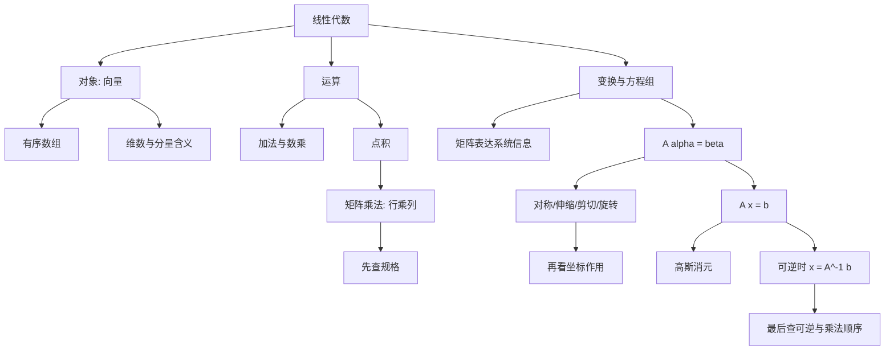

# 线代第0讲 零基础课：线性代数入门

> [!info] 教材与复核范围
> 来源：`27张宇基础30讲线代.pdf`，印刷页 1-10 / PDF p7-p16，共10页。
> 本讲全部页面均已逐页 OCR（368行文字骨架），阅读3张全页联系图，并逐张查看全部10张高清原页。矩阵元素、正负号、分数、图形方向和方程组答案均以高清原页为准。

## 本讲速览

- 线性代数研究的不是孤立数字，而是**向量之间的关系以及保持加法、数乘结构的线性变换**；矩阵是表达这种变换和系统信息的工具。
- 教材从最小语言开始：向量是有序数组；加法和数乘生成新的向量；点积把两个同维向量压成一个数。
- 矩阵乘法的核心只有一句：**结果的第 $i$ 行第 $j$ 列，等于左矩阵第 $i$ 行与右矩阵第 $j$ 列的点积**。
- 把平面点按列排成矩阵后，左乘一个 $2\times2$ 矩阵，就能统一完成对称、伸缩、剪切和旋转。
- 方程组可写成 $A\boldsymbol{x}=\boldsymbol{b}$；若 $A$ 可逆，则逆变换把输出还原为输入：$\boldsymbol{x}=A^{-1}\boldsymbol{b}$。
- 本讲只建立直觉和统一语言。逆矩阵怎样求、初等变换怎样用，留到[[20_线代第2讲_矩阵|线代第2讲 矩阵]]系统展开。

## 教材路线

| 教材顺序 | 内容 | 印刷页 / PDF页 | 复习任务 |
|---|---|---|---|
| 开篇 | 线代全书三大版块与研究对象 | 1 / p7 | 建立“对象 -> 运算 -> 变换 -> 应用”的主线 |
| 一 | 对象（元素）：向量 | 1 / p7 | 有序数组、维数、分量位置与信息编码 |
| 二-1 | 线性运算 | 2 / p8 | 向量加法、数乘及同维条件 |
| 二-2 | 点积运算 | 2-3 / p8-p9 | 点积、四类行列乘法、矩阵乘法元素规则 |
| 二-3(1) | 矩阵用于表达系统信息 | 3-4 / p9-p10 | 行列含义、元素位置、矩阵乘法练习 |
| 二-3(2) | 线性变换举例 | 4-8 / p10-p14 | 对称、伸缩、剪切、旋转矩阵 |
| 二-4 | 方程组求解 | 8-10 / p14-p16 | $A\boldsymbol{x}=\boldsymbol{b}$、单位矩阵、逆矩阵、消元法与逆矩阵法 |

## 前置知识与关联导航

- 前置只需会解简单二元、三元一次方程组，并理解函数是“输入经过法则得到输出”。函数与反函数直觉可回看[[01_高数第1讲_函数极限与连续#一、函数的概念与特性|函数与反函数]]。
- 行列式用于判断和计算可逆性：[[19_线代第1讲_行列式|线代第1讲 行列式]]。
- 矩阵运算、逆矩阵、初等变换与矩阵方程：[[20_线代第2讲_矩阵|线代第2讲 矩阵]]。
- 向量关系、线性组合、线性相关：[[21_线代第3讲_向量组|线代第3讲 向量组]]。
- 方程组解的结构、秩与解空间：[[22_线代第4讲_线性方程组|线代第4讲 线性方程组]]。
- 线性变换的特征方向与标准化：[[23_线代第5讲_特征值与特征向量|特征值与特征向量]]、[[24_线代第6讲_二次型|二次型]]。

## 知识网络

## 知识点清单

## 一、线性代数研究什么

### 1. 全书三大版块

教材把六讲分成三层：

| 版块 | 内容 | 它解决什么 |
|---|---|---|
| 基础版块 | 行列式、矩阵 | 建立计算工具与变换语言 |
| 主题版块 | 向量组、方程组 | 研究向量之间的关系和方程组解的结构 |
| 应用版块 | 特征值、二次型 | 找变换的稳定方向，并把二次型化为标准形 |

真正的知识链不是六章并列，而是：

$$
\text{向量}
\xrightarrow{\text{矩阵表示的线性变换}}
\text{新向量}
\xrightarrow{\text{研究关系与逆过程}}
\text{方程组、特征值、二次型}.
$$

> [!tip] 看到什么想到它
> 线代题无论外表是行列式、矩阵还是方程组，都先问：研究对象是什么向量？矩阵施加了什么变换？题目要求正向输出，还是反求输入？

### 2. “线性”的最低直觉

线性结构保留两种运算：加法和数乘。若 $T$ 是线性变换，则

$$
T(k\boldsymbol{\alpha}+l\boldsymbol{\beta})
=kT(\boldsymbol{\alpha})+lT(\boldsymbol{\beta}).
$$

矩阵 $A$ 表示线性变换时，$T(\boldsymbol{x})=A\boldsymbol{x}$。这条性质解释了为什么后面所有问题都围绕“线性组合”展开。

> [!note] 教材定位
> 第0讲先用二维图形和方程组建立直觉，不在这里证明线性空间与线性映射的完整理论。

## 二、对象（元素）：向量

### 1. 定义、分量与维数

向量是拼在一起的**有序数组**。例如

$$
\boldsymbol{\alpha}=[-1,1]
$$

是二维行向量；同样的数据竖写为

$$
\boldsymbol{\alpha}=
\begin{bmatrix}
-1\\1
\end{bmatrix}
$$

就是二维列向量。

- 分量：数组中的每个数。
- 维数：分量个数。$n$ 个分量组成 $n$ 维向量。
- 顺序：向量是有序的，$[-1,1]\ne[1,-1]$。
- 行列方向：同一组分量写成行或列，在线代运算中规格不同，不能随意混用。

### 2. 向量怎样表达信息

教材把“运动兴趣、音乐兴趣”依次放在两个位置，并约定 $-1,0,1$ 分别表示不喜欢、无所谓、喜欢：

$$
[-1,1]
=
[\text{不喜欢运动},\text{喜欢音乐}],
$$

$$
[0,1]
=
[\text{对运动无所谓},\text{喜欢音乐}].
$$

关键不在这组具体编码，而在于：**先规定每个位置的语义，再用分量保存对应信息**。交换分量就改变了信息。

> [!tip] 看到什么想到它
> 题目把若干指标、坐标或系数按顺序排列时，先写出“第 $i$ 个分量表示什么”。线代中的位置不是排版细节，而是数学信息。

## 三、运算总览

教材把本讲运算分成三层：

1. **线性运算**：向量加法、数乘，输出仍是向量。
2. **点积运算**：对应分量相乘再相加；矩阵乘法把这种“行与列的点积”批量执行。
3. **线性变换**：矩阵作为对应法则，把输入向量变为输出向量。

它们的关系是：

$$
\text{分量级加法和数乘}
\longrightarrow
\text{向量点积}
\longrightarrow
\text{矩阵批量作用于向量或点集}.
$$

## 四、线性运算

### 1. 向量加法

同维向量按对应分量相加：

$$
\boldsymbol{\alpha}=(a_1,\ldots,a_n),\quad
\boldsymbol{\beta}=(b_1,\ldots,b_n),
$$

$$
\boldsymbol{\alpha}+\boldsymbol{\beta}
=(a_1+b_1,\ldots,a_n+b_n).
$$

**条件**：两向量维数相同，且对应位置的语义一致。

### 2. 数乘

数 $k$ 乘向量，就是每个分量同时乘 $k$：

$$
k\boldsymbol{\alpha}=(ka_1,\ldots,ka_n).
$$

加法与数乘组合成线性组合：

$$
k_1\boldsymbol{\alpha}_1+\cdots+k_r\boldsymbol{\alpha}_r.
$$

这正是[[21_线代第3讲_向量组|向量组]]中线性表示、线性相关和极大无关组的起点。

> [!tip] 看到什么想到它
> 题目出现“由若干向量表示”“系数组合”“保持加法和倍数关系”，先想到线性组合，而不是点积。

## 五、点积运算与矩阵乘法雏形

### 1. 向量点积

同维向量对应分量相乘再相加：

$$
(\boldsymbol{\alpha},\boldsymbol{\beta})
=\sum_{k=1}^{n}a_kb_k.
$$

教材示例：

$$
\boldsymbol{\alpha}=[-1,1],\qquad
\boldsymbol{\beta}=[0,-1],
$$

$$
(\boldsymbol{\alpha},\boldsymbol{\beta})
=(-1)\cdot0+1\cdot(-1)=-1.
$$

点积的输出是一个数。把第一个向量写成行、第二个写成列，就是矩阵乘法中的“行乘列”。

### 2. 一行乘一列

$$
[a_1,a_2]
\begin{bmatrix}
b_1\\b_2
\end{bmatrix}
=a_1b_1+a_2b_2.
$$

结果是 $1\times1$ 的标量。内层长度必须相同。

### 3. 一行乘多列

$$
[a_1,a_2]
\begin{bmatrix}
b_1&c_1\\
b_2&c_2
\end{bmatrix}
=
[a_1b_1+a_2b_2,\ a_1c_1+a_2c_2].
$$

左边一行分别与右边每一列做点积，因此输出是一行。

### 4. 多行乘一列

$$
\begin{bmatrix}
a_1&a_2\\
b_1&b_2
\end{bmatrix}
\begin{bmatrix}
c_1\\c_2
\end{bmatrix}
=
\begin{bmatrix}
a_1c_1+a_2c_2\\
b_1c_1+b_2c_2
\end{bmatrix}.
$$

左边每一行都与右边这一列做点积，因此输出是一列。

### 5. 多行乘多列

$$
\begin{bmatrix}
a_1&a_2\\
b_1&b_2
\end{bmatrix}
\begin{bmatrix}
c_1&d_1\\
c_2&d_2
\end{bmatrix}
=
\begin{bmatrix}
a_1c_1+a_2c_2&a_1d_1+a_2d_2\\
b_1c_1+b_2c_2&b_1d_1+b_2d_2
\end{bmatrix}.
$$

一般地，

$$
A_{m\times n}B_{n\times s}=C_{m\times s},
$$

$$
c_{ij}=\sum_{k=1}^{n}a_{ik}b_{kj}.
$$

记忆时不要背展开式，只记：

$$
c_{ij}
=
(\text{$A$的第$i$行})\cdot(\text{$B$的第$j$列}).
$$

> [!tip] 看到什么想到它
> 计算 $AB$ 前先写规格。只有 $A$ 的列数等于 $B$ 的行数时乘积才有定义，结果取“外侧规格”。

### 6. 教材 p9 八个练习的结构

| 题号 | 结构 | 结果 |
|---:|---|---|
| 1 | $[1,1][1,-1]^T$ | $0$ |
| 2 | $[2,0][0,-2]^T$ | $0$ |
| 3 | 一行乘 $2\times2$ 矩阵 | $[3,-2]$ |
| 4 | $2\times2$ 矩阵乘一列 | $[1,-4]^T$ |
| 5 | 一列乘一行（外积） | $\begin{bmatrix}1&-1\\1&-1\end{bmatrix}$ |
| 6 | 一列乘一行（外积） | $\begin{bmatrix}0&-4\\0&0\end{bmatrix}$ |
| 7 | $2\times2$ 乘 $2\times2$ | $\begin{bmatrix}1&4\\-3&2\end{bmatrix}$ |
| 8 | 把第7题两因子调换 | $\begin{bmatrix}1&3\\-4&2\end{bmatrix}$ |

第7、8题直接说明：即使 $AB$、$BA$ 都存在，也通常 $AB\ne BA$。

## 六、线性变换

### 1. 矩阵先用于表达系统信息

矩阵是按行列组织的信息表。例如

$$
M=
\begin{bmatrix}
40&15\\
12&8
\end{bmatrix}
$$

可约定“每行是一件商品，每列依次是价格、卡路里”，于是第一行表示价格40、卡路里15。若改成

$$
\begin{bmatrix}
40&12\\
15&8
\end{bmatrix},
$$

信息随位置改变。矩阵本身只保存数，**每行、每列的含义来自题目约定**。

同一个矩阵还可在不同场景表达不同信息。教材用兴趣和投篮结果说明：数学结构相同，不代表现实语义相同。

> [!tip] 看到什么想到它
> 应用题先标注“行对象”和“列指标”，再运算。没有语义标签时，交换行列可能算得出数，却答错问题。

### 2. 矩阵是线性对应法则

教材用

$$
A\boldsymbol{\alpha}=\boldsymbol{\beta}
$$

表示矩阵 $A$ 作用于输入向量 $\boldsymbol{\alpha}$，输出向量 $\boldsymbol{\beta}$。类比函数语言：

| 高数 | 线代 |
|---|---|
| 对应法则 $f$ | 矩阵 $A$ |
| 自变量 $x$ | 输入向量 $\boldsymbol{\alpha}$ |
| 函数值 $y$ | 输出向量 $\boldsymbol{\beta}$ |
| $f(x)=y$ | $A\boldsymbol{\alpha}=\boldsymbol{\beta}$ |

若把多个平面点作为列排成

$$
P=
\begin{bmatrix}
x_1&x_2&\cdots&x_r\\
y_1&y_2&\cdots&y_r
\end{bmatrix},
$$

则 $AP$ 会对每一列同时施加同一个变换。教材所有图形变换都采用“点作列、矩阵左乘”的约定。

### 3. 对称变换

| 对称对象 | 变换矩阵 $A$ | 坐标变化 |
|---|---|---|
| $x$轴 | $\begin{bmatrix}1&0\\0&-1\end{bmatrix}$ | $(x,y)\mapsto(x,-y)$ |
| $y$轴 | $\begin{bmatrix}-1&0\\0&1\end{bmatrix}$ | $(x,y)\mapsto(-x,y)$ |
| 原点 | $\begin{bmatrix}-1&0\\0&-1\end{bmatrix}$ | $(x,y)\mapsto(-x,-y)$ |
| 直线 $y=x$ | $\begin{bmatrix}0&1\\1&0\end{bmatrix}$ | $(x,y)\mapsto(y,x)$ |
| 直线 $y=-x$ | $\begin{bmatrix}0&-1\\-1&0\end{bmatrix}$ | $(x,y)\mapsto(-y,-x)$ |

**二级结论**：每个对称矩阵连续作用两次都会回到原图，即 $A^2=E_2$，所以 $A^{-1}=A$。

### 4. 伸缩变换

教材逐一展示：

| 变换矩阵 | 作用 |
|---|---|
| $\operatorname{diag}(2,1)$ | 横向拉伸2倍 |
| $\operatorname{diag}(1,2)$ | 纵向拉伸2倍 |
| $\operatorname{diag}(1/2,1)$ | 横向压缩为原来的一半 |
| $\operatorname{diag}(1,1/2)$ | 纵向压缩为原来的一半 |

一般地，

$$
\begin{bmatrix}
k_x&0\\0&k_y
\end{bmatrix}
\begin{bmatrix}
x\\y
\end{bmatrix}
=
\begin{bmatrix}
k_xx\\k_yy
\end{bmatrix}.
$$

- $k_x,k_y>1$：对应方向拉伸。
- $0<k_x,k_y<1$：对应方向压缩。
- 某个系数为负：还包含对应坐标的反射。
- 某个系数为0：图形塌缩到低维，变换不可逆。

### 5. 剪切变换

教材给出两种：

$$
\begin{bmatrix}
1&-1\\0&1
\end{bmatrix}
\begin{bmatrix}
x\\y
\end{bmatrix}
=
\begin{bmatrix}
x-y\\y
\end{bmatrix},
$$

$$
\begin{bmatrix}
1&0\\-1&1
\end{bmatrix}
\begin{bmatrix}
x\\y
\end{bmatrix}
=
\begin{bmatrix}
x\\y-x
\end{bmatrix}.
$$

剪切保持一条坐标方向不动，另一坐标按前者的倍数发生平移。认图时不要只看“斜了”，直接算一般点 $(x,y)$ 的像最稳。

### 6. 旋转变换

教材矩阵为

$$
R_{\pi/4}
=
\begin{bmatrix}
\frac{\sqrt2}{2}&-\frac{\sqrt2}{2}\\
\frac{\sqrt2}{2}&\frac{\sqrt2}{2}
\end{bmatrix},
$$

它把图形绕原点**逆时针旋转 $\pi/4$**，例如 $(1,1)$ 变为 $(0,\sqrt2)$。

一般的逆时针旋转矩阵是

$$
R_\theta=
\begin{bmatrix}
\cos\theta&-\sin\theta\\
\sin\theta&\cos\theta
\end{bmatrix}.
$$

**二级结论**：

$$
R_\theta^{-1}=R_{-\theta},\qquad
R_\theta R_\varphi=R_{\theta+\varphi}.
$$

旋转保持长度与夹角。判断顺逆时针时，看第一列：它就是 $(1,0)^T$ 的像 $(\cos\theta,\sin\theta)^T$。

### 7. 变换矩阵的读法

对

$$
A=
\begin{bmatrix}
a&b\\c&d
\end{bmatrix},
$$

有

$$
A
\begin{bmatrix}
x\\y
\end{bmatrix}
=
\begin{bmatrix}
ax+by\\cx+dy
\end{bmatrix}.
$$

因此识别陌生变换的通用入口是：

1. 算一般点 $(x,y)$ 的像。
2. 或分别算基向量 $(1,0)^T,(0,1)^T$ 的像。
3. 矩阵第一、第二列正是两个基向量的像。

> [!tip] 看到什么想到它
> 给一个 $2\times2$ 矩阵问几何意义，先算两列，不要凭矩阵外观猜图形。

## 七、方程组求解

### 1. 方程组写成矩阵形式

教材方程组

$$
\begin{cases}
x_1+2x_2=3,\\
4x_1+7x_2=10
\end{cases}
$$

可写成

$$
\underbrace{
\begin{bmatrix}
1&2\\4&7
\end{bmatrix}}_{A}
\underbrace{
\begin{bmatrix}
x_1\\x_2
\end{bmatrix}}_{\boldsymbol{x}}
=
\underbrace{
\begin{bmatrix}
3\\10
\end{bmatrix}}_{\boldsymbol{b}}.
$$

每一行与未知向量点积，正好生成对应方程左端。因此：

- $A$：系数矩阵，表示从未知向量到方程左端的线性变换。
- $\boldsymbol{x}$：待求输入。
- $\boldsymbol{b}$：已知输出。

### 2. 单位矩阵与逆矩阵

$n$ 阶单位矩阵记为 $E_n$，主对角线为1，其余元素为0，并满足

$$
E_mA_{m\times n}=A_{m\times n},
\qquad
A_{m\times n}E_n=A_{m\times n}.
$$

（规格相容时）。

若方阵 $A$ 存在矩阵 $A^{-1}$，使

$$
AA^{-1}=A^{-1}A=E_n,
$$

则称 $A$ 可逆，$A^{-1}$ 为 $A$ 的逆矩阵。

这分别类比：

- 非零数 $a$ 的倒数：$a^{-1}a=1$。
- 可逆函数 $f$ 的反函数：$f^{-1}(f(x))=x$。

**边界**：不是每个矩阵都有逆；逆矩阵只对可逆方阵定义。本讲直接给出具体逆矩阵，求逆方法留到[[20_线代第2讲_矩阵|第2讲]]。

### 3. 逆矩阵解法

若 $A$ 可逆，则在

$$
A\boldsymbol{x}=\boldsymbol{b}
$$

两边**同时左乘** $A^{-1}$：

$$
A^{-1}A\boldsymbol{x}=A^{-1}\boldsymbol{b},
$$

所以

$$
\boldsymbol{x}=A^{-1}\boldsymbol{b}.
$$

教材给出

$$
A=
\begin{bmatrix}
1&2\\4&7
\end{bmatrix},\qquad
A^{-1}=
\begin{bmatrix}
-7&2\\4&-1
\end{bmatrix}.
$$

直接核对 $AA^{-1}=A^{-1}A=E_2$，再算

$$
\boldsymbol{x}
=A^{-1}\boldsymbol{b}
=
\begin{bmatrix}
-7&2\\4&-1
\end{bmatrix}
\begin{bmatrix}
3\\10
\end{bmatrix}
=
\begin{bmatrix}
-1\\2
\end{bmatrix}.
$$

> [!warning] 乘法顺序
> 矩阵通常不可交换。$A^{-1}$ 必须乘在 $A$ 的左侧以消去左边的 $A$；不能把 $A^{-1}\boldsymbol{b}$ 写成 $\boldsymbol{b}A^{-1}$。

### 4. 教材练习1：两种方法解二元组

高斯消元：用第1式乘4减第2式，得 $x_2=2$，回代得 $x_1=-1$。

逆矩阵法：直接用上面的 $A^{-1}\boldsymbol{b}$。

教材结论是：对这个小方程组，逆矩阵法没有比消元更简洁。它的价值主要在于展示“反求输入就是施加逆变换”的统一语言。

### 5. 教材练习2：三元组

$$
\begin{cases}
x_1+x_2+x_3=2,\\
x_1+2x_2+4x_3=3,\\
x_1+3x_2+9x_3=5.
\end{cases}
$$

高斯消元：

$$
(2)-(1):\quad x_2+3x_3=1,
$$

$$
(3)-(2):\quad x_2+5x_3=2.
$$

两式相减得 $2x_3=1$，所以

$$
x_3=\frac12,\qquad
x_2=-\frac12,\qquad
x_1=2.
$$

矩阵形式中

$$
A=
\begin{bmatrix}
1&1&1\\
1&2&4\\
1&3&9
\end{bmatrix},\qquad
A^{-1}=
\begin{bmatrix}
3&-3&1\\
-\frac52&4&-\frac32\\
\frac12&-1&\frac12
\end{bmatrix}.
$$

于是

$$
\boldsymbol{x}=A^{-1}
\begin{bmatrix}
2\\3\\5
\end{bmatrix}
=
\begin{bmatrix}
2\\-\frac12\\\frac12
\end{bmatrix}.
$$

### 6. 高斯消元与逆矩阵法怎样选

| 场景 | 首选理解 |
|---|---|
| 只解一个具体方程组 | 通常直接消元，更省计算 |
| 题目已经给出 $A^{-1}$ | 直接算 $A^{-1}\boldsymbol{b}$ |
| 同一个可逆 $A$ 对应多个右端 $\boldsymbol{b}$ | 逆变换观点便于统一表达 |
| $A$ 不是方阵或不可逆 | 不能用逆矩阵公式，转向消元与秩 |
| 大规模数值计算 | 通常分解并求解，不显式计算逆矩阵 |

教材在入门处强调逆矩阵法的统一性；考研计算中仍要根据题目结构选法，不能见方程组就先求逆。

## 公式与二级结论索引

| 结论 | 完整条件/意义 | 详细讲解 |
|---|---|---|
| 向量加法 | 同维、对应分量相加 | [[#1. 向量加法\|向量加法]] |
| 数乘 | 每个分量同乘标量 $k$ | [[#2. 数乘\|数乘]] |
| 点积 | 同维向量对应分量乘积之和，输出标量 | [[#1. 向量点积\|点积]] |
| 矩阵乘法规格 | $A_{m\times n}B_{n\times s}=C_{m\times s}$ | [[#5. 多行乘多列\|矩阵乘法]] |
| 乘积元素 | $c_{ij}=\sum_ka_{ik}b_{kj}$ | [[#5. 多行乘多列\|行乘列]] |
| 线性变换 | $A(k\alpha+l\beta)=kA\alpha+lA\beta$ | [[#2. “线性”的最低直觉\|线性]] |
| 多点同时变换 | 点作列时，$AP$逐列变换 | [[#2. 矩阵是线性对应法则\|点集变换]] |
| 五种对称矩阵 | 坐标符号或顺序发生对应变化，且 $A^2=E_2$ | [[#3. 对称变换\|对称]] |
| 对角伸缩 | $\operatorname{diag}(k_x,k_y):(x,y)\mapsto(k_xx,k_yy)$ | [[#4. 伸缩变换\|伸缩]] |
| 剪切 | 保持一个坐标，另一个坐标加前者倍数 | [[#5. 剪切变换\|剪切]] |
| 旋转 | $R_\theta=\begin{bmatrix}\cos\theta&-\sin\theta\\\sin\theta&\cos\theta\end{bmatrix}$ | [[#6. 旋转变换\|旋转]] |
| 单位矩阵 | $E_mA_{m\times n}=A_{m\times n}E_n=A_{m\times n}$ | [[#2. 单位矩阵与逆矩阵\|单位矩阵]] |
| 逆矩阵 | $AA^{-1}=A^{-1}A=E_n$，仅对可逆方阵 | [[#2. 单位矩阵与逆矩阵\|逆矩阵]] |
| 逆矩阵解法 | $A\boldsymbol{x}=\boldsymbol{b}\Rightarrow\boldsymbol{x}=A^{-1}\boldsymbol{b}$，前提是 $A$ 可逆 | [[#3. 逆矩阵解法\|逆矩阵解法]] |

## 题型—方法决策表

| 题面信号 | 首选知识点 | 怎样开始 | 检查点 |
|---|---|---|---|
| 指标、坐标、数据按顺序排成数组 | 向量的信息意义 | 标注每个分量的语义 | 顺序和维数是否一致 |
| 判断两个向量能否相加/点积 | 同维条件 | 先数分量 | 行列方向是否符合乘法规格 |
| 计算 $AB$ | 行乘列 | 写出 $A,B$ 规格和结果规格 | 内侧相等、外侧定结果 |
| 只求乘积某个 $c_{ij}$ | 第 $i$ 行点乘第 $j$ 列 | 只抽对应行列 | 下标不要错位 |
| 两因子交换后结果不同 | 矩阵不可交换 | 分别算 $AB,BA$ | 不能套数乘交换律 |
| 矩阵作用于若干平面点 | 点按列排成 $P$，算 $AP$ | 先确认点是列还是行 | 变换矩阵应在左侧 |
| 问矩阵的几何作用 | 基向量像/一般点像 | 算两列或算 $(x,y)$ 的像 | 旋转正负号、伸缩方向 |
| 出现对称轴或旋转角 | 标准变换矩阵 | 写坐标变化再写矩阵 | $y=x$与$y=-x$不要混 |
| 线性方程组 | $A\boldsymbol{x}=\boldsymbol{b}$ | 提取系数矩阵和右端列 | 变量顺序固定 |
| 已知 $A^{-1}$ 求解 | 逆矩阵解法 | 左乘 $A^{-1}$ | 先确认 $A$ 可逆，顺序不能换 |
| 未知数/方程数不等或解不唯一 | 消元与秩 | 不用逆矩阵公式 | 转到[[22_线代第4讲_线性方程组\|方程组解结构]] |

## 教材例题覆盖表

| 教材位置 | 考查知识 | 题面信号 | 解法入口 | 独有结论 | 笔记定位 |
|---|---|---|---|---|---|
| p7 兴趣编码 | 向量表达信息 | 有序指标与等级编码 | 先定每个位置含义 | 换序即换信息 | [[#2. 向量怎样表达信息\|向量信息]] |
| p8 点积示例 | 对应分量乘积之和 | 两个同维向量 | 行乘列 | $[-1,1]\cdot[0,-1]^T=-1$ | [[#1. 向量点积\|点积]] |
| p9 练习1-8 | 四类行列乘法 | 结果可能是数、行、列、矩阵 | 先规格后行乘列 | 第7、8题说明不可交换 | [[#6. 教材 p9 八个练习的结构\|八题反查]] |
| p9-p10 信息矩阵 | 行列语义 | 同一组数按不同位置排列 | 标注行对象、列指标 | 位置不能随便改变 | [[#1. 矩阵先用于表达系统信息\|信息矩阵]] |
| p10 两个练习 | 左乘矩阵改变点集 | 交换矩阵、伸缩矩阵乘点矩阵 | 对每列同时作用 | 左乘交换行或伸缩行 | [[#2. 矩阵是线性对应法则\|点集变换]] |
| p10-p11 五幅图 | 对称变换 | 关于轴、原点、两条对角线 | 先写坐标像 | 五个矩阵均为自身的逆 | [[#3. 对称变换\|对称]] |
| p12-p13 四幅图 | 横纵伸缩 | 对角矩阵 | 对角元控制对应坐标 | 0系数导致塌缩 | [[#4. 伸缩变换\|伸缩]] |
| p13 两幅图 | 剪切 | 图形斜切 | 算一般点像 | 保持一个坐标不变 | [[#5. 剪切变换\|剪切]] |
| p13-p14 旋转图 | 逆时针 $\pi/4$ | 含 $\sqrt2/2$ 的正交结构 | 看第一列方向 | $(1,1)\mapsto(0,\sqrt2)$ | [[#6. 旋转变换\|旋转]] |
| p14-p15 二元组 | 逆变换解方程 | 已给 $A^{-1}$ | 左乘 $A^{-1}$ | 解 $(-1,2)$ | [[#3. 逆矩阵解法\|二元组]] |
| p15 练习1 | 消元与求逆比较 | 同一二元组两种解法 | 单题优先消元 | 逆矩阵法不更简洁 | [[#4. 教材练习1：两种方法解二元组\|练习1]] |
| p15-p16 练习2 | 三元组两种解法 | Vandermonde型系数矩阵 | 消元或用已给逆矩阵 | 解 $(2,-1/2,1/2)$ | [[#5. 教材练习2：三元组\|练习2]] |

## 讲末练习反查

本讲没有独立答案附录，练习与答案直接穿插在 p9、p10、p15-p16。反查标准如下：

| 练习组 | 只看笔记应能完成什么 | 定位 |
|---|---|---|
| p9 八个乘法式 | 判断结果是标量、行、列还是矩阵，并算出全部答案 | [[#6. 教材 p9 八个练习的结构\|p9练习]] |
| p10 两个点集乘法 | 解释左乘交换/伸缩矩阵为什么改变对应坐标行 | [[#2. 矩阵是线性对应法则\|点集变换]] |
| p10-p14 图形变换 | 由坐标变化写矩阵，由矩阵判断对称、伸缩、剪切或旋转 | [[#3. 对称变换\|对称]]、[[#4. 伸缩变换\|伸缩]]、[[#5. 剪切变换\|剪切]]、[[#6. 旋转变换\|旋转]] |
| p15 练习1 | 用消元和已给逆矩阵求 $(-1,2)$，说明为什么消元更短 | [[#4. 教材练习1：两种方法解二元组\|练习1]] |
| p15-p16 练习2 | 两种方法求 $(2,-1/2,1/2)$，核对 $AA^{-1}=E_3$ | [[#5. 教材练习2：三元组\|练习2]] |

## 易错点/易混点

1. 向量是有序数组；交换分量不是换个写法，而是换了向量和信息。
2. 行向量与列向量分量相同也不等同；它们在乘法中的规格不同。
3. 加法要求同型，点积要求同维，矩阵乘法要求左列数等于右行数，三个条件不要混用。
4. 点积输出标量；列乘行是外积，输出矩阵，二者形状完全不同。
5. $AB$ 的结果规格取外侧，不能把 $m\times n$ 与 $n\times s$ 误写成 $n\times n$。
6. $c_{ij}$ 是左第 $i$ 行点乘右第 $j$ 列，不是同位置元素直接相乘。
7. 即使 $AB,BA$ 都存在，也通常不相等；教材 p9 第7、8题就是反例。
8. 矩阵的行列语义来自题目约定。把商品和指标转置后，必须重新解释信息。
9. 教材图形把点作为列，故变换写成 $AP$；若把点作行，公式会变，不能混搭。
10. 关于 $y=x$ 对称是交换 $x,y$；关于 $y=-x$ 对称是交换后再同时变号。
11. 旋转矩阵第一行第二项为 $-\sin\theta$；教材矩阵表示逆时针 $\pi/4$，不是顺时针。
12. 对角矩阵的第一、第二个对角元分别控制 $x,y$；不要把横向和纵向伸缩写反。
13. 剪切题先算 $(x,y)$ 的像，靠图猜方向容易把正负号看错。
14. $E_n$ 的阶数必须匹配；不能把标量1与任意阶单位矩阵不加区别地混写。
15. 只有可逆方阵才有 $A^{-1}$；一般方程组不能一律写 $\boldsymbol{x}=A^{-1}\boldsymbol{b}$。
16. 解 $A\boldsymbol{x}=\boldsymbol{b}$ 要左乘 $A^{-1}$；矩阵不能随意跨等号“除过去”。
17. 逆矩阵必须同时满足 $AA^{-1}=A^{-1}A=E_n$；本讲给出的逆矩阵求法在第2讲再学。
18. 三元练习答案是 $(2,-1/2,1/2)$，尤其不要把 $x_2$ 漏成 $-1$。
19. 求出解后应代回原方程或计算 $A\boldsymbol{x}$，不能只信中间消元。
20. “未知数多就显式求逆更优”不是通用计算规则；考研题仍按结构选择消元、秩或已知逆矩阵。

## 注解

### 1. 本讲最重要的不是会背十几个矩阵

真正要建立的是三层翻译：

$$
\text{现实信息或几何点}
\longleftrightarrow
\text{向量/矩阵}
\longleftrightarrow
\text{矩阵运算与变换结果}.
$$

遇到陌生矩阵时，始终可以回到“它把一般向量或两个基向量变成什么”。

### 2. 为什么矩阵乘法必须是行乘列

矩阵每一行代表一个线性表达式。它与输入列向量点积，生成一个输出分量；多行就生成多个输出分量。右边有多列时，相当于同时处理多个输入。因此行乘列不是人为口诀，而是把多个线性对应法则批量组合起来。

### 3. 方程组就是反求线性变换的输入

$A\boldsymbol{x}=\boldsymbol{b}$ 不是新题型：已知变换规则 $A$ 和输出 $\boldsymbol{b}$，反求输入 $\boldsymbol{x}$。可逆时由逆变换唯一还原；不可逆时就要研究无解、多解及解空间，这正是[[22_线代第4讲_线性方程组|第4讲]]的主线。

### 4. 教材的逆矩阵法怎样正确理解

本讲用逆矩阵说明“统一反演”的思想。实际求解一个大型方程组时，通常不会先显式算出 $A^{-1}$，而会做消元或矩阵分解；考研中也常用初等变换。这里应记住的是适用条件和结构，不是把求逆当作所有方程组的固定首选。

### 5. 怎样衔接后续六讲

- 看到“可逆”先进入[[19_线代第1讲_行列式|行列式]]与[[20_线代第2讲_矩阵|矩阵]]。
- 看到“若干向量能否互相表示”进入[[21_线代第3讲_向量组|向量组]]。
- 看到“方程组有几个解、解怎样表示”进入[[22_线代第4讲_线性方程组|方程组]]。
- 看到“变换后方向不变”进入[[23_线代第5讲_特征值与特征向量|特征值]]。
- 看到“二次齐次多项式化标准形”进入[[24_线代第6讲_二次型|二次型]]。

## 速背检查

| 问题 | 短答 |
|---|---|
| 1. 线代研究的基本对象是什么？ | 向量以及向量之间的关系。 |
| 2. 向量为什么强调“有序”？ | 每个位置对应固定分量和信息，换序就换向量。 |
| 3. 向量维数是什么？ | 分量个数。 |
| 4. 线性运算包括什么？ | 向量加法和数乘。 |
| 5. 点积怎样算？ | 同维向量对应分量相乘再相加。 |
| 6. $A_{m\times n}B_{n\times s}$结果规格？ | $m\times s$。 |
| 7. $c_{ij}$怎样得到？ | 左矩阵第 $i$ 行点乘右矩阵第 $j$ 列。 |
| 8. 为什么一般 $AB\ne BA$？ | 行列配对和变换复合顺序不同。 |
| 9. 矩阵表达信息前先做什么？ | 约定每行、每列的含义。 |
| 10. 点集按列排列时怎样统一变换？ | 左乘变换矩阵：$AP$。 |
| 11. 关于 $y=x$ 对称的矩阵？ | $\begin{bmatrix}0&1\\1&0\end{bmatrix}$。 |
| 12. 关于 $y=-x$ 对称的矩阵？ | $\begin{bmatrix}0&-1\\-1&0\end{bmatrix}$。 |
| 13. $\operatorname{diag}(2,1)$做什么？ | 横向拉伸2倍，纵坐标不变。 |
| 14. 一般逆时针旋转矩阵？ | $\begin{bmatrix}\cos\theta&-\sin\theta\\\sin\theta&\cos\theta\end{bmatrix}$。 |
| 15. 怎样快速读陌生 $2\times2$ 变换？ | 看两列，即两个基向量的像。 |
| 16. $E_n$的作用？ | 保持向量或矩阵不变。 |
| 17. 逆矩阵定义？ | $AA^{-1}=A^{-1}A=E_n$。 |
| 18. $A\boldsymbol{x}=\boldsymbol{b}$何时可写 $\boldsymbol{x}=A^{-1}\boldsymbol{b}$？ | $A$ 为可逆方阵时。 |
| 19. 二元教材例的解？ | $(-1,2)$。 |
| 20. 三元教材练习的解？ | $(2,-1/2,1/2)$。 |

## OCR/视觉核查

- PDF p7-p16 共10页全部渲染并 OCR，得到368行文字骨架；OCR仅用于定位，不直接采信矩阵与公式。
- 3张覆盖全页的联系图均已阅读，10张高清原页均逐页查看。
- p8-p10 的点积、四类行列乘法及10个练习逐式复核；第7、8题乘法顺序及答案已核对。
- p10-p14 的5种对称、4种伸缩、2种剪切和1种旋转逐图核对矩阵、正负号和方向。
- p14-p16 的二元、三元方程组，两个逆矩阵及解向量均以原图复核；三元解确认为 $(2,-1/2,1/2)$。
- 本讲没有独立课后答案页；穿插练习均已进入例题覆盖表和讲末练习反查。

## 相关链接

- [[00_目录与进度|张宇基础30讲目录与进度]]
- [[00_知识链路图|知识链路图]]
- [[00_公式极简总表|公式极简总表]]
- [[00_刷题高命中索引|刷题高命中索引]]
- [[18A_高数附录_图形公式与变形技巧|上一单元：高数附录]]
- [[19_线代第1讲_行列式|下一讲：行列式]]
- [[20_线代第2讲_矩阵|矩阵]]
- [[21_线代第3讲_向量组|向量组]]
- [[22_线代第4讲_线性方程组|线性方程组]]
